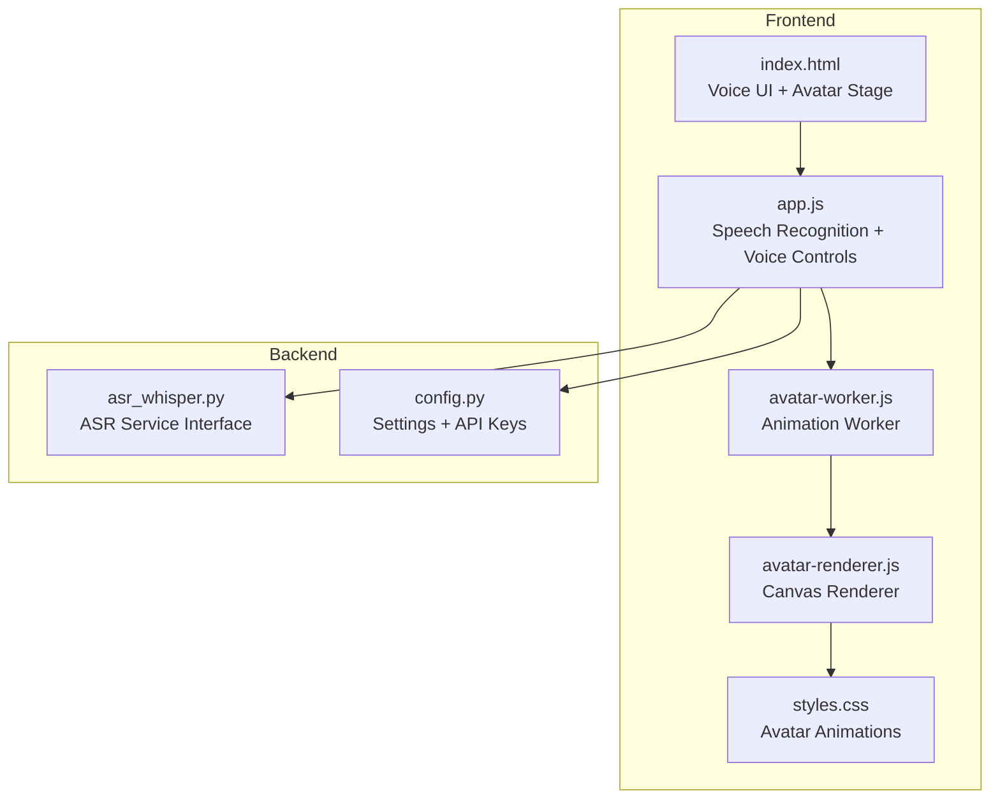
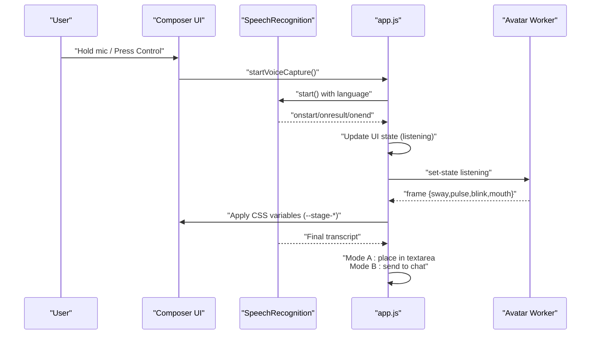
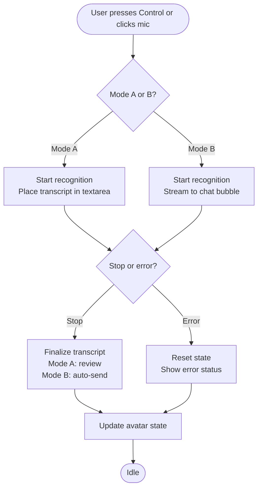
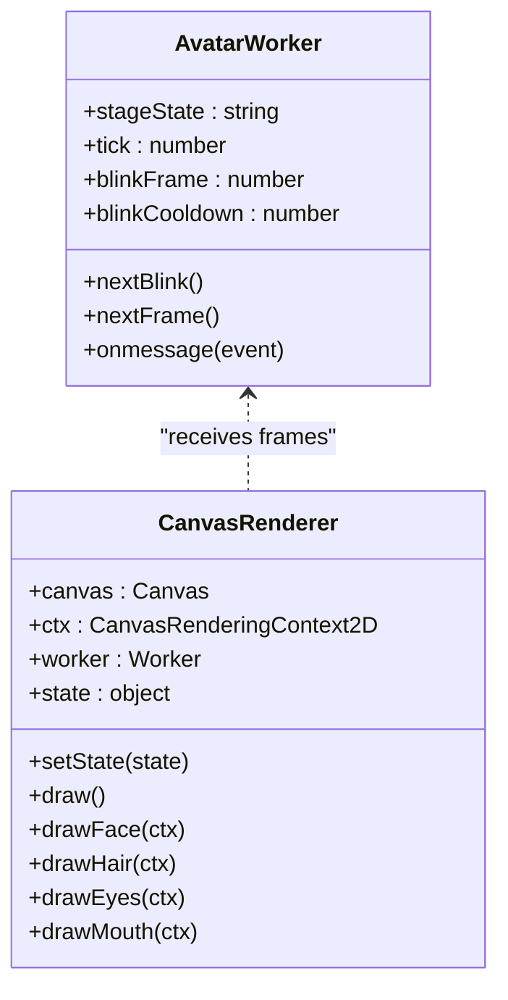
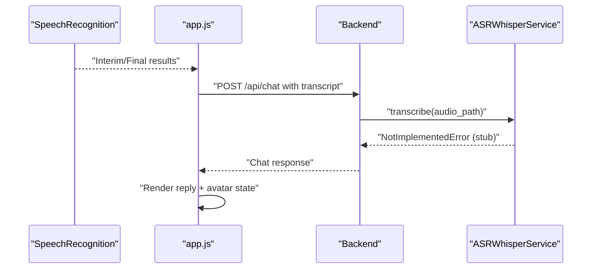
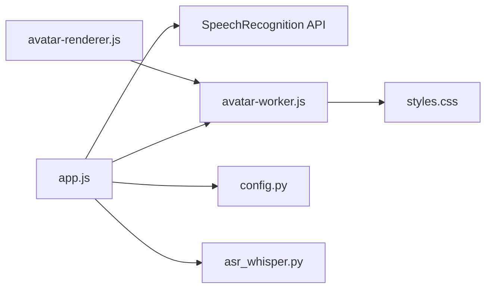

# Voice Input and Avatar System

<cite>
**Referenced Files in This Document**
- [index.html](file://frontend/index.html)
- [app.js](file://frontend/scripts/app.js)
- [avatar-renderer.js](file://frontend/scripts/avatar-renderer.js)
- [avatar-worker.js](file://frontend/scripts/avatar-worker.js)
- [styles.css](file://frontend/assets/styles.css)
- [asr_whisper.py](file://backend/audio/asr_whisper.py)
- [config.py](file://backend/config.py)
</cite>

## Table of Contents
1. [Introduction](#introduction)
2. [Project Structure](#project-structure)
3. [Core Components](#core-components)
4. [Architecture Overview](#architecture-overview)
5. [Detailed Component Analysis](#detailed-component-analysis)
6. [Dependency Analysis](#dependency-analysis)
7. [Performance Considerations](#performance-considerations)
8. [Troubleshooting Guide](#troubleshooting-guide)
9. [Conclusion](#conclusion)

## Introduction
This document explains the voice input controls and animated avatar system. It covers push-to-talk functionality, speech recognition integration, and the audio processing pipeline. It also documents the avatar animation system using Web Workers for background processing, canvas rendering, and state management. Additional topics include microphone permissions, audio quality settings, noise cancellation features, browser compatibility, audio codec support, and troubleshooting audio-related issues.

## Project Structure
The voice and avatar systems span the frontend HTML/CSS/JavaScript and a backend audio processing module:

- Frontend
  - Voice input: HTML microphone button, JavaScript speech recognition handlers, and UI status updates
  - Avatar: CSS animations and JavaScript Web Worker for background animation calculations
- Backend
  - Audio processing: ASR service interface (currently a placeholder for Whisper-based transcription)

**Diagram sources**
- [index.html:1-338](file://frontend/index.html#L1-L338)
- [app.js:1-1765](file://frontend/scripts/app.js#L1-L1765)
- [avatar-worker.js:1-48](file://frontend/scripts/avatar-worker.js#L1-L48)
- [avatar-renderer.js:1-106](file://frontend/scripts/avatar-renderer.js#L1-L106)
- [styles.css:886-992](file://frontend/assets/styles.css#L886-L992)
- [asr_whisper.py:1-19](file://backend/audio/asr_whisper.py#L1-L19)
- [config.py:1-76](file://backend/config.py#L1-L76)

**Section sources**
- [index.html:1-338](file://frontend/index.html#L1-L338)
- [app.js:1-1765](file://frontend/scripts/app.js#L1-L1765)
- [avatar-worker.js:1-48](file://frontend/scripts/avatar-worker.js#L1-L48)
- [avatar-renderer.js:1-106](file://frontend/scripts/avatar-renderer.js#L1-L106)
- [styles.css:886-992](file://frontend/assets/styles.css#L886-L992)
- [asr_whisper.py:1-19](file://backend/audio/asr_whisper.py#L1-L19)
- [config.py:1-76](file://backend/config.py#L1-L76)

## Core Components
- Voice input modes
  - Mode A (Ctrl+M): Record-then-review with transcript placed in the text area for manual confirmation
  - Mode B (hold Control or click mic): Instant-send with continuous speech-to-text updates
- Speech recognition integration
  - Uses browser SpeechRecognition API with fallback to webkitSpeechRecognition
  - Continuous, interim results enabled; supports language selection
- Avatar animation system
  - Web Worker computes animation frames (sway, pulse, blink, mouth movement)
  - CSS variables apply computed values to the avatar stage for smooth rendering
- Audio processing pipeline
  - Frontend: SpeechRecognition captures audio and produces transcripts
  - Backend: ASR service interface (Whisper) for transcription (placeholder)
- Microphone permissions and browser compatibility
  - Feature detection for SpeechRecognition; graceful degradation when unsupported
  - Language resolution via browser default or explicit selection

**Section sources**
- [app.js:601-727](file://frontend/scripts/app.js#L601-L727)
- [app.js:733-808](file://frontend/scripts/app.js#L733-L808)
- [app.js:830-858](file://frontend/scripts/app.js#L830-L858)
- [app.js:538-565](file://frontend/scripts/app.js#L538-L565)
- [avatar-worker.js:1-48](file://frontend/scripts/avatar-worker.js#L1-L48)
- [styles.css:886-992](file://frontend/assets/styles.css#L886-L992)
- [asr_whisper.py:10-19](file://backend/audio/asr_whisper.py#L10-L19)

## Architecture Overview
The voice input system integrates browser speech recognition with UI state updates and avatar feedback. The avatar system delegates animation computation to a Web Worker while the main thread updates CSS variables for rendering.

**Diagram sources**
- [app.js:601-727](file://frontend/scripts/app.js#L601-L727)
- [app.js:733-808](file://frontend/scripts/app.js#L733-L808)
- [app.js:830-858](file://frontend/scripts/app.js#L830-L858)
- [avatar-worker.js:41-46](file://frontend/scripts/avatar-worker.js#L41-L46)

## Detailed Component Analysis

### Voice Input Controls and Speech Recognition
- Setup and capabilities
  - Detects SpeechRecognition or webkitSpeechRecognition; disables UI if unsupported
  - Initializes recognition with continuous and interim results enabled
  - Resolves language from dropdown or browser default
- Modes
  - Mode A (Ctrl+M): Starts recognition, collects transcript, places in textarea for review
  - Mode B (Control press/delay or mic click-and-hold): Starts recognition, streams transcript to chat bubble, auto-sends on stop
- State management
  - Tracks listening, recognitionStarting, modeAActive, micHeld, spaceTalking
  - Updates mic button visuals and voice status text
- Error handling
  - Catches errors from recognition.start and displays status; resets state on error
- Browser compatibility
  - Graceful degradation when SpeechRecognition is missing; disables voice language selector

**Diagram sources**
- [app.js:733-808](file://frontend/scripts/app.js#L733-L808)
- [app.js:830-858](file://frontend/scripts/app.js#L830-L858)
- [app.js:601-727](file://frontend/scripts/app.js#L601-L727)

**Section sources**
- [app.js:601-727](file://frontend/scripts/app.js#L601-L727)
- [app.js:733-808](file://frontend/scripts/app.js#L733-L808)
- [app.js:830-858](file://frontend/scripts/app.js#L830-L858)
- [app.js:860-864](file://frontend/scripts/app.js#L860-L864)
- [app.js:866-881](file://frontend/scripts/app.js#L866-L881)

### Avatar Animation System
- Web Worker
  - Maintains stage state ("idle", "listening", "thinking", "speaking")
  - Computes sway, pulse, blink, and mouth shapes per frame
  - Posts frames to main thread at ~12.5 FPS
- Canvas renderer
  - Receives frame messages and draws face elements (face, hair, eyes, mouth)
  - Applies transforms for breathing scale, head tilt, and sway
- CSS-driven presentation
  - Avatar stage uses CSS variables for animation values
  - State-specific visual effects (aura/core/shadow changes)

**Diagram sources**
- [avatar-worker.js:1-48](file://frontend/scripts/avatar-worker.js#L1-L48)
- [avatar-renderer.js:1-106](file://frontend/scripts/avatar-renderer.js#L1-L106)

**Section sources**
- [avatar-worker.js:1-48](file://frontend/scripts/avatar-worker.js#L1-L48)
- [avatar-renderer.js:1-106](file://frontend/scripts/avatar-renderer.js#L1-L106)
- [styles.css:886-992](file://frontend/assets/styles.css#L886-L992)
- [app.js:538-565](file://frontend/scripts/app.js#L538-L565)

### Audio Processing Pipeline
- Frontend
  - SpeechRecognition captures microphone audio and emits transcripts
  - Transcripts are processed based on mode (review or auto-send)
- Backend
  - ASR service interface (Whisper) is defined but not implemented yet
  - Configuration loads API keys and provider settings

**Diagram sources**
- [app.js:928-1087](file://frontend/scripts/app.js#L928-L1087)
- [asr_whisper.py:10-19](file://backend/audio/asr_whisper.py#L10-L19)
- [config.py:55-76](file://backend/config.py#L55-L76)

**Section sources**
- [app.js:928-1087](file://frontend/scripts/app.js#L928-L1087)
- [asr_whisper.py:10-19](file://backend/audio/asr_whisper.py#L10-L19)
- [config.py:55-76](file://backend/config.py#L55-L76)

### Practical Examples
- Voice activation
  - Hold Control to activate Mode B (instant-send) with a short delay to avoid conflicts with Ctrl+M
  - Click-and-hold the mic button for Mode B
  - Press Ctrl+M to toggle Mode A (record-then-review)
- Avatar customization
  - Change avatar state via CSS variables applied by the main thread
  - States: idle, listening, thinking, speaking
- Animation triggers
  - Avatar worker computes new frames at ~12.5 FPS
  - Main thread applies computed values to CSS variables for smooth rendering
- Performance optimization
  - Use Web Workers to offload animation calculations from the main thread
  - Minimize DOM updates; batch CSS variable changes
  - Limit frame rate to reduce CPU/GPU load

**Section sources**
- [app.js:733-808](file://frontend/scripts/app.js#L733-L808)
- [app.js:538-565](file://frontend/scripts/app.js#L538-L565)
- [avatar-worker.js:18-39](file://frontend/scripts/avatar-worker.js#L18-L39)
- [styles.css:886-992](file://frontend/assets/styles.css#L886-L992)

## Dependency Analysis
- Frontend dependencies
  - app.js depends on HTML elements, SpeechRecognition API, and avatar worker
  - avatar-worker.js is a standalone module computing animation frames
  - avatar-renderer.js encapsulates canvas drawing and worker communication
  - styles.css defines CSS variables and state-specific visual effects
- Backend dependencies
  - ASR service interface relies on Whisper model (placeholder)
  - Configuration provides API keys and provider settings

**Diagram sources**
- [app.js:1-1765](file://frontend/scripts/app.js#L1-L1765)
- [avatar-worker.js:1-48](file://frontend/scripts/avatar-worker.js#L1-L48)
- [avatar-renderer.js:1-106](file://frontend/scripts/avatar-renderer.js#L1-L106)
- [styles.css:886-992](file://frontend/assets/styles.css#L886-L992)
- [asr_whisper.py:1-19](file://backend/audio/asr_whisper.py#L1-L19)
- [config.py:1-76](file://backend/config.py#L1-L76)

**Section sources**
- [app.js:1-1765](file://frontend/scripts/app.js#L1-L1765)
- [avatar-worker.js:1-48](file://frontend/scripts/avatar-worker.js#L1-L48)
- [avatar-renderer.js:1-106](file://frontend/scripts/avatar-renderer.js#L1-L106)
- [styles.css:886-992](file://frontend/assets/styles.css#L886-L992)
- [asr_whisper.py:1-19](file://backend/audio/asr_whisper.py#L1-L19)
- [config.py:1-76](file://backend/config.py#L1-L76)

## Performance Considerations
- Web Worker usage
  - Offloads animation computations from the main thread to prevent UI jank
- Frame rate control
  - Avatar worker runs at ~12.5 FPS; adjust interval for performance trade-offs
- CSS variable updates
  - Batch updates to CSS variables to minimize layout thrashing
- Speech recognition
  - Keep recognition continuous but limit unnecessary restarts
  - Use interim results judiciously to balance responsiveness and accuracy

[No sources needed since this section provides general guidance]

## Troubleshooting Guide
- Speech recognition unavailable
  - Symptom: Mic button disabled, voice language selector disabled
  - Cause: Browser lacks SpeechRecognition support
  - Resolution: Use a compatible browser or disable voice features
- Cannot start speech recognition
  - Symptom: Error message appears; state resets
  - Cause: Permissions denied or device unavailable
  - Resolution: Grant microphone permissions; test another microphone device
- No audio input detected
  - Symptom: Avatar remains idle despite speech
  - Cause: Microphone permissions not granted or blocked
  - Resolution: Enable microphone permissions; verify device selection
- Language mismatch
  - Symptom: Misrecognized speech
  - Cause: Incorrect language setting
  - Resolution: Select appropriate language in voice settings
- Noise interference
  - Symptom: Frequent interruptions or misinterpretations
  - Cause: Background noise or poor microphone quality
  - Resolution: Use a noise-canceling microphone; reduce ambient noise
- Browser compatibility
  - Symptom: Voice features not working on certain browsers
  - Cause: Missing SpeechRecognition implementation
  - Resolution: Use Chrome, Edge, or Safari; avoid unsupported browsers

**Section sources**
- [app.js:601-609](file://frontend/scripts/app.js#L601-L609)
- [app.js:840-845](file://frontend/scripts/app.js#L840-L845)
- [app.js:866-881](file://frontend/scripts/app.js#L866-L881)

## Conclusion
The voice input and avatar systems combine browser SpeechRecognition with a responsive UI and efficient Web Worker-based animation. The architecture separates concerns between speech processing, state management, and rendering, enabling maintainable and performant features. Future enhancements can include backend ASR integration, improved noise handling, and expanded language support.