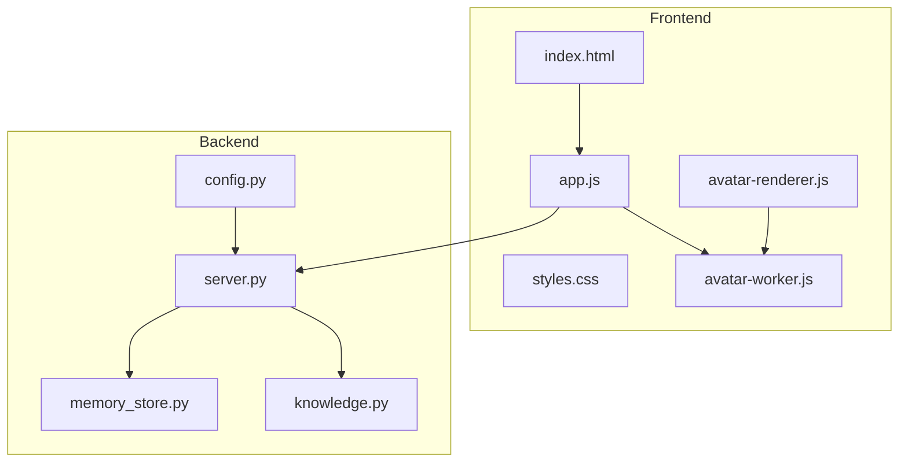
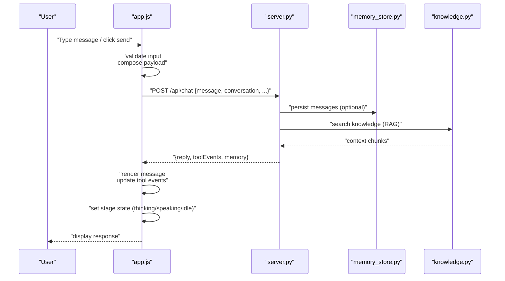
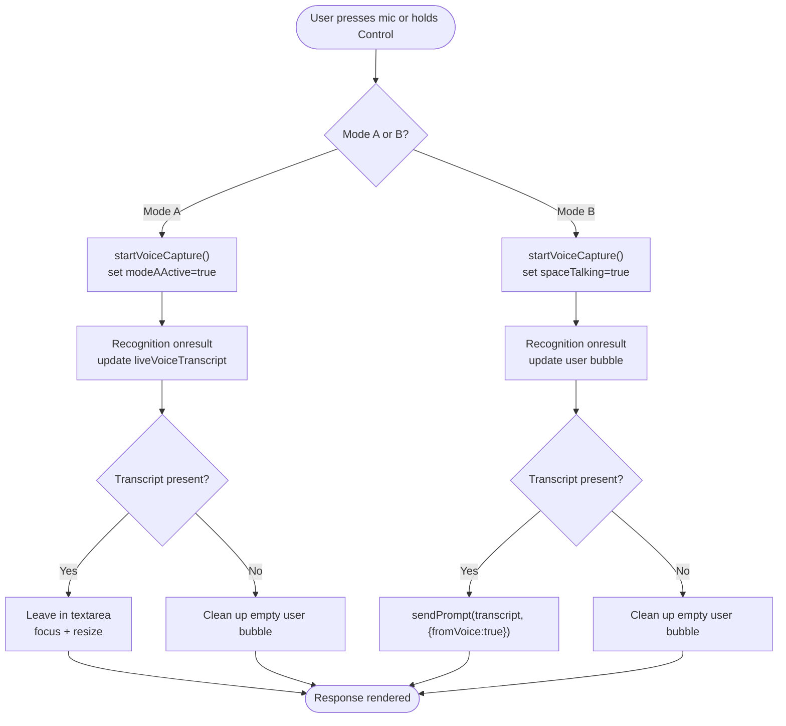
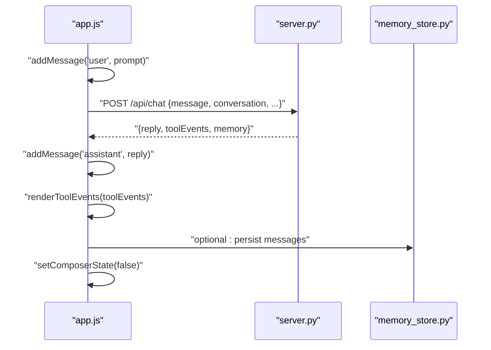
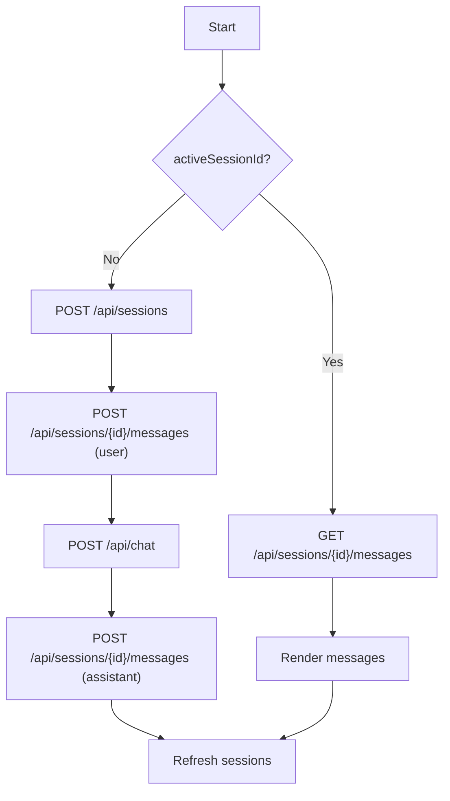
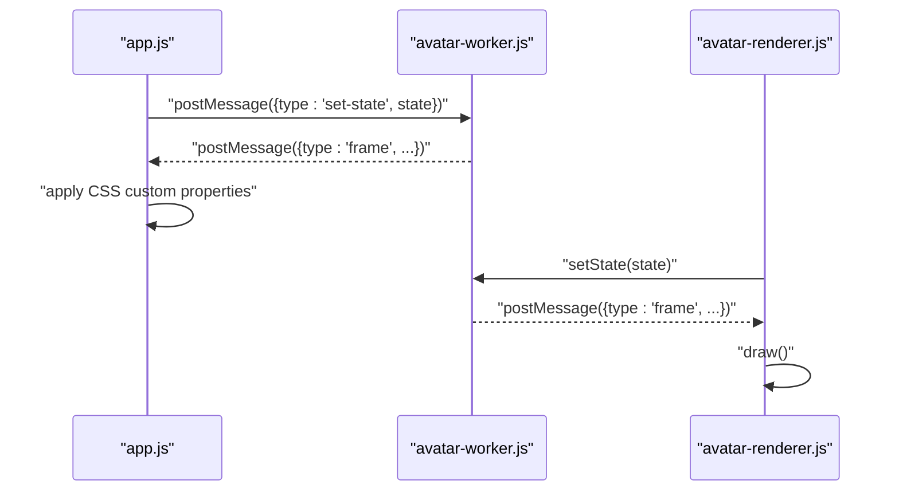
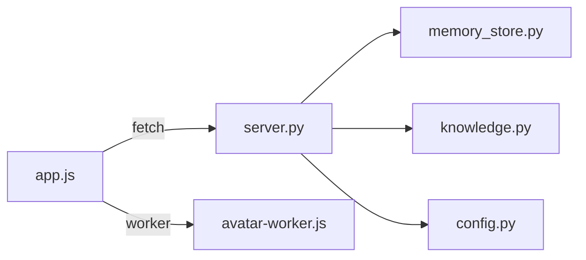

# Application Logic

<cite>
**Referenced Files in This Document**
- [index.html](file://frontend/index.html)
- [app.js](file://frontend/scripts/app.js)
- [styles.css](file://frontend/assets/styles.css)
- [avatar-renderer.js](file://frontend/scripts/avatar-renderer.js)
- [avatar-worker.js](file://frontend/scripts/avatar-worker.js)
- [server.py](file://backend/server.py)
- [config.py](file://backend/config.py)
- [memory_store.py](file://backend/core/memory_store.py)
- [knowledge.py](file://backend/tools/knowledge.py)
</cite>

## Table of Contents
1. [Introduction](#introduction)
2. [Project Structure](#project-structure)
3. [Core Components](#core-components)
4. [Architecture Overview](#architecture-overview)
5. [Detailed Component Analysis](#detailed-component-analysis)
6. [Dependency Analysis](#dependency-analysis)
7. [Performance Considerations](#performance-considerations)
8. [Troubleshooting Guide](#troubleshooting-guide)
9. [Conclusion](#conclusion)
10. [Appendices](#appendices)

## Introduction
This document explains the main frontend controller application logic for the Orbit Virtual Assistant. It covers application state management, session handling, message processing pipeline, user interaction workflows, event-driven architecture, DOM manipulation patterns, real-time update mechanisms, chat session lifecycle, message composition and rendering, tool execution coordination, error handling strategies, mode switching (Simple, Copilot, Coach), utility drawer management, avatar state synchronization, backend API integration, and performance optimization techniques.

## Project Structure
The application is split into a modern frontend (HTML/CSS/JS) and a Python backend server. The frontend is served by the backend HTTP server and communicates with it via REST endpoints. The backend persists state in MongoDB and orchestrates LLM interactions, tooling (weather, news, knowledge), and session/document management.

**Diagram sources**
- [index.html](file://frontend/index.html)
- [app.js](file://frontend/scripts/app.js)
- [styles.css](file://frontend/assets/styles.css)
- [avatar-worker.js](file://frontend/scripts/avatar-worker.js)
- [avatar-renderer.js](file://frontend/scripts/avatar-renderer.js)
- [server.py](file://backend/server.py)
- [config.py](file://backend/config.py)
- [memory_store.py](file://backend/core/memory_store.py)
- [knowledge.py](file://backend/tools/knowledge.py)

**Section sources**
- [index.html](file://frontend/index.html)
- [app.js](file://frontend/scripts/app.js)
- [server.py](file://backend/server.py)

## Core Components
- Application state and UI elements: centralized state object and DOM element references.
- Event binding and user interaction: keyboard, pointer, and form handlers.
- Voice input modes: dual-mode voice capture (Mode A: Ctrl+M review; Mode B: push-to-talk).
- Message pipeline: compose, submit, render, and tool events.
- Session management: create, load, update, and delete sessions.
- Memory and utility panels: weather, news, tasks, notes, and quick actions.
- Avatar worker: animated avatar state synchronized with UI.
- Backend integration: REST endpoints for state, chat, sessions, attachments, profile, tasks, notes, weather, and news.

**Section sources**
- [app.js](file://frontend/scripts/app.js)
- [index.html](file://frontend/index.html)

## Architecture Overview
The frontend is a single-page application driven by DOM events and asynchronous HTTP requests to the backend. The backend exposes REST endpoints and manages persistent state via MongoDB. The avatar animation runs in a Web Worker and updates CSS custom properties for smooth visuals.

**Diagram sources**
- [app.js](file://frontend/scripts/app.js)
- [server.py](file://backend/server.py)
- [memory_store.py](file://backend/core/memory_store.py)
- [knowledge.py](file://backend/tools/knowledge.py)

## Detailed Component Analysis

### Application State and UI Elements
- Centralized state: mode, conversation, memory, currentTurn, sessions, voice flags, UI toggles, screen capture state, and avatar worker reference.
- DOM element references: layout, sidebar, header, mode buttons, avatar stage, session actions, utility drawer, coach panel, message list, tool events, composer, mic, toggles, quick actions, screen share preview/video, forms, and memory views.

Key behaviors:
- LocalStorage persistence for sidebar open state, voice language, virtual language, and coach topic/level.
- UI updates on initialization and mode changes.
- Composer auto-resize and toggle chips.

**Section sources**
- [app.js](file://frontend/scripts/app.js)
- [index.html](file://frontend/index.html)

### Event-Driven Interaction Model
- Keyboard shortcuts: Ctrl+M toggles Mode A; Control holds trigger Mode B; Escape cancels Mode A; Enter sends unless in Mode A recording.
- Pointer events: mic button press-and-hold for Mode B; pointerup/cancel to stop.
- Form submission: prevents default, trims input, and triggers sendPrompt.
- Quick actions and practice buttons: set mode to coach and inject prompts with RAG context hints.

**Section sources**
- [app.js](file://frontend/scripts/app.js)
- [index.html](file://frontend/index.html)

### Voice Input Modes and Pipeline
Dual-mode voice capture:
- Mode A (Ctrl+M): records speech, transcripts to textarea for review; does not auto-submit.
- Mode B (hold Control or mic): starts recognition immediately and auto-submits transcript.

Pipeline highlights:
- startVoiceCapture: sets language, starts recognition, updates mic button state.
- onresult: updates live transcript; in Mode A, writes to textarea; in Mode B, updates chat bubble.
- onend: finalizes transcript; Mode A leaves in textarea; Mode B sends prompt.
- stopVoiceCapture: stops recognition and cleans up state.

**Diagram sources**
- [app.js](file://frontend/scripts/app.js)

**Section sources**
- [app.js](file://frontend/scripts/app.js)

### Message Composition and Rendering Pipeline
- Composer state: disables send/input/quick/practice buttons during processing.
- sendPrompt: creates or updates currentTurn, adds user message, sets thinking state, auto-creates session if needed, stores user message, calls /api/chat, renders assistant reply, updates tool events, refreshes sessions, and restores composer state.
- addMessage: creates message nodes, supports Markdown rendering for assistant replies, appends “Add to Notes” action buttons, scrolls to bottom.
- renderToolEvents: displays recent tool events as pills.

**Diagram sources**
- [app.js](file://frontend/scripts/app.js)
- [server.py](file://backend/server.py)
- [memory_store.py](file://backend/core/memory_store.py)

**Section sources**
- [app.js](file://frontend/scripts/app.js)

### Session Lifecycle Management
- Auto-create session on first message if none active.
- Load session: clears message list, fetches messages, re-renders conversation.
- Update session: pin/unpin, archive/unarchive, delete; updates UI and refreshes lists.
- Refresh sessions: fetches all sessions and renders sidebar groups.

**Diagram sources**
- [app.js](file://frontend/scripts/app.js)
- [server.py](file://backend/server.py)

**Section sources**
- [app.js](file://frontend/scripts/app.js)

### Mode Switching (Simple, Copilot, Coach)
- Mode buttons update appState.mode and UI visibility of coach panel.
- Coach mode: enables topic/level/language inputs and hints; quick actions and practice buttons automatically inject RAG context.
- Thinking, Web Search, Image Gen, Offline toggles coordinate mutually exclusive behaviors.

**Section sources**
- [app.js](file://frontend/scripts/app.js)
- [index.html](file://frontend/index.html)

### Utility Drawer Management
- Toggles drawer open/closed state.
- Panels: Voice settings, Screen Share, Profile, Weather, News, Quick Actions, Knowledge Lab, Tasks, Memory Notes.
- Screen share: captures frames periodically and attaches JPEG data to subsequent messages.

**Section sources**
- [app.js](file://frontend/scripts/app.js)
- [index.html](file://frontend/index.html)

### Avatar State Synchronization
- Avatar worker generates frame updates (sway, pulse, blink, mouth).
- app.js receives frame messages and applies CSS custom properties to avatar stage.
- setStageState updates stage state and worker state.

**Diagram sources**
- [app.js](file://frontend/scripts/app.js)
- [avatar-worker.js](file://frontend/scripts/avatar-worker.js)
- [avatar-renderer.js](file://frontend/scripts/avatar-renderer.js)

**Section sources**
- [app.js](file://frontend/scripts/app.js)
- [avatar-worker.js](file://frontend/scripts/avatar-worker.js)
- [avatar-renderer.js](file://frontend/scripts/avatar-renderer.js)

### Backend API Integration and Real-Time Data Updates
- Frontend calls:
  - GET /api/state: initial state, sessions, memory, model/provider info.
  - POST /api/chat: chat request with mode, RAG flags, screen image, conversation.
  - POST /api/sessions: create session.
  - POST /api/sessions/{id}/messages: append user/assistant messages.
  - POST /api/sessions/{id}/attachments: upload file attachments (base64).
  - GET /api/sessions, GET /api/sessions/{id}/messages, PUT /api/sessions/{id}, DELETE /api/sessions/{id}.
  - POST /api/profile, /api/tasks, /api/notes, /api/weather, /api/news.
- Backend server routes requests to MemoryStore and KnowledgeService, returning JSON payloads.

**Section sources**
- [app.js](file://frontend/scripts/app.js)
- [server.py](file://backend/server.py)
- [memory_store.py](file://backend/core/memory_store.py)
- [knowledge.py](file://backend/tools/knowledge.py)

### Tool Execution Coordination
- Tool events are returned with chat replies and rendered as pill badges.
- Knowledge service builds retrievers (BM25 and optional FAISS hybrid) for persistent knowledge base and session-scoped attachments.
- Session attachments are parsed, chunked, and indexed; retriever cache invalidated on changes.

**Section sources**
- [app.js](file://frontend/scripts/app.js)
- [server.py](file://backend/server.py)
- [knowledge.py](file://backend/tools/knowledge.py)

### Error Handling Strategies
- Frontend:
  - Graceful fallbacks for unsupported features (e.g., image generation).
  - User-friendly error messages for network failures, invalid inputs, and voice errors.
  - Cleanup on voice interruption and session transitions.
- Backend:
  - Validation and error responses for malformed requests.
  - Graceful fallbacks for missing or unsupported features.
  - Connection checks and failure messaging for MongoDB.

**Section sources**
- [app.js](file://frontend/scripts/app.js)
- [server.py](file://backend/server.py)

## Dependency Analysis
- Frontend depends on:
  - DOM APIs for UI and events.
  - Fetch API for REST communication.
  - Web Workers for avatar animation.
  - Marked for Markdown rendering.
- Backend depends on:
  - MongoDB for persistence.
  - LangChain ecosystem for document loading, splitting, and retrieval.
  - HTTP server for serving static assets and REST endpoints.

**Diagram sources**
- [app.js](file://frontend/scripts/app.js)
- [server.py](file://backend/server.py)
- [memory_store.py](file://backend/core/memory_store.py)
- [knowledge.py](file://backend/tools/knowledge.py)
- [config.py](file://backend/config.py)

**Section sources**
- [app.js](file://frontend/scripts/app.js)
- [server.py](file://backend/server.py)

## Performance Considerations
- DOM batching and minimal reflows:
  - Append message nodes once and scroll to bottom after insertion.
  - Use CSS custom properties for avatar animations to avoid layout thrashing.
- Asynchronous rendering:
  - Render tool events after receiving chat response.
  - Debounce or throttle frequent UI updates (e.g., screen capture interval).
- Efficient state updates:
  - Use targeted updates (e.g., toggle chips) rather than full re-renders.
  - Avoid unnecessary localStorage writes by checking values first.
- Network efficiency:
  - Compose payloads carefully (e.g., only include necessary fields).
  - Limit message history passed to backend when possible.
- Memory management:
  - Clear intervals and stop media tracks on exit or mode changes.
  - Avoid retaining references to removed DOM nodes.
- Backend scaling:
  - Use indexes on MongoDB collections for sessions, messages, attachments, and chunks.
  - Lazy-initialize retrievers and cache them per session to reduce overhead.

[No sources needed since this section provides general guidance]

## Troubleshooting Guide
Common issues and resolutions:
- Voice input not working:
  - Verify browser supports SpeechRecognition and permissions granted.
  - Check voice language selection and recognition starting state.
- Session not loading:
  - Confirm session exists and messages endpoint returns data.
  - Ensure activeSessionId is set and not switched mid-request.
- Avatar not animating:
  - Confirm Web Worker is supported and worker script is served.
  - Verify CSS custom properties are applied and stage state is set.
- Attachments failing:
  - Validate file type and size limits.
  - Check upload directory permissions and MongoDB attachment records.
- Backend errors:
  - Inspect HTTP status codes and error payloads.
  - Verify MongoDB connectivity and indexes.

**Section sources**
- [app.js](file://frontend/scripts/app.js)
- [server.py](file://backend/server.py)

## Conclusion
The Orbit Virtual Assistant frontend controller implements a robust, event-driven architecture with clear separation of concerns: state management, DOM manipulation, voice input, message rendering, session orchestration, and avatar animation. It integrates tightly with a Python backend that persists state in MongoDB and coordinates LLM interactions, tooling, and RAG capabilities. The design emphasizes responsiveness, modularity, and graceful error handling, enabling a smooth user experience across modes and workflows.

## Appendices

### Example State Mutations
- Mode switching: appState.mode updated and UI toggled.
- Composer state: setComposerState(true/false) disables/enables inputs.
- Voice state: appState.listening, appState.modeAActive, appState.liveVoiceTranscript updated.
- Session state: appState.activeSessionId, appState.conversation appended.

**Section sources**
- [app.js](file://frontend/scripts/app.js)

### Example Event Listeners
- Keyboard: keydown/keyup for hotkeys and Enter-to-send.
- Pointer: pointerdown/up/cancel for mic button.
- Forms: submit for composer, change for selects and toggles.
- Media: screen capture interval and video playback.

**Section sources**
- [app.js](file://frontend/scripts/app.js)
- [index.html](file://frontend/index.html)

### Example Asynchronous Operations
- fetch("/api/chat"): chat completion with tool events.
- fetch("/api/sessions"): create/load/update/delete sessions.
- fetch("/api/sessions/{id}/attachments"): upload file attachments.
- fetch("/api/weather", "/api/news", "/api/tasks", "/api/notes", "/api/profile"): utility endpoints.

**Section sources**
- [app.js](file://frontend/scripts/app.js)
- [server.py](file://backend/server.py)