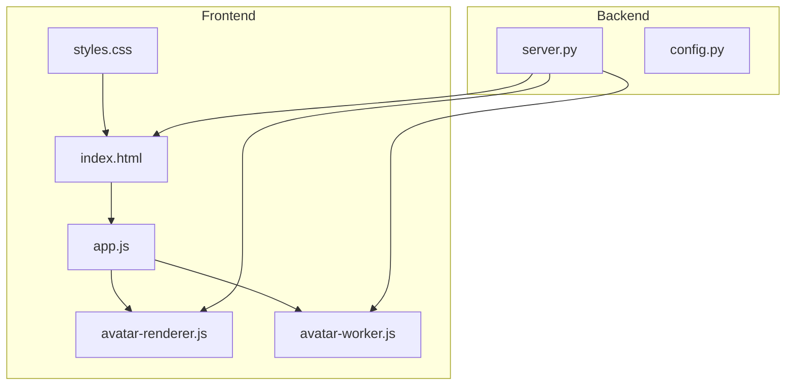
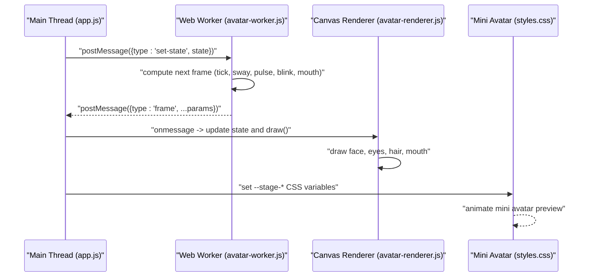
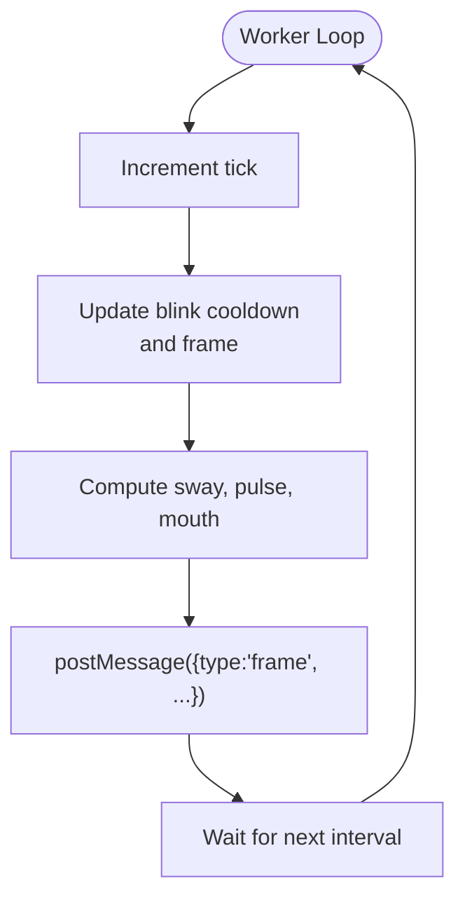
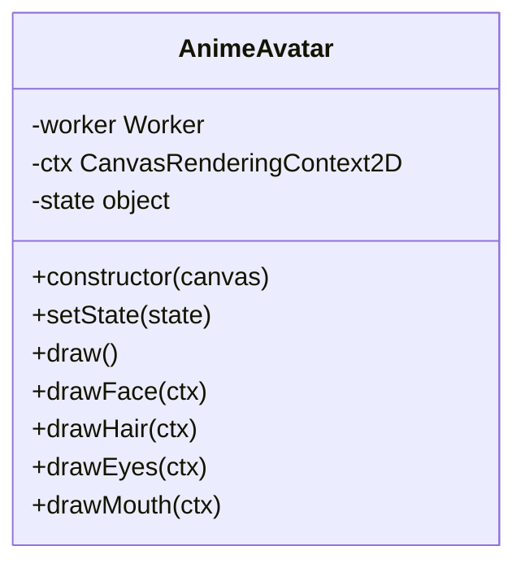
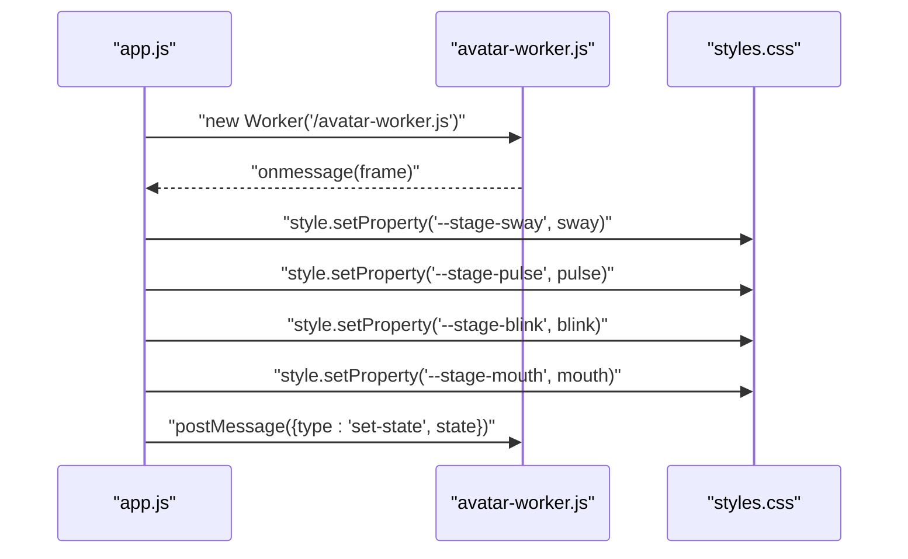
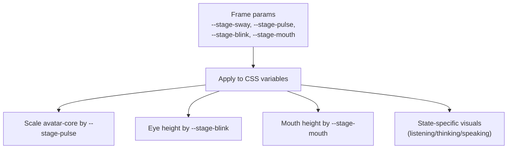
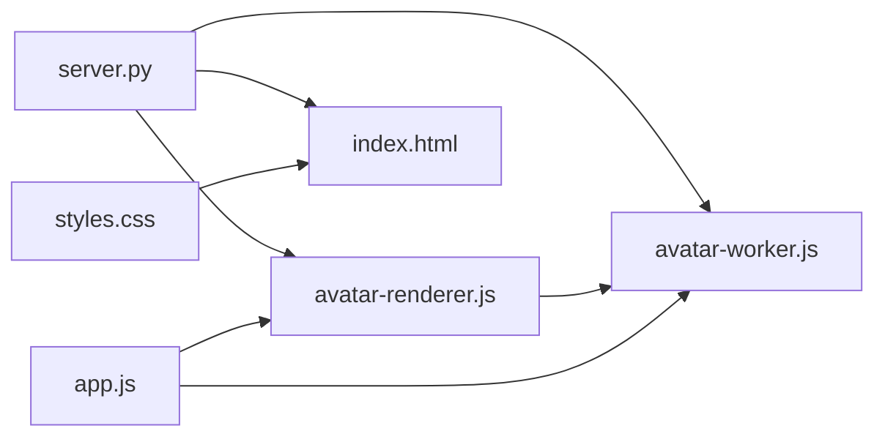

# Avatar System

<cite>
**Referenced Files in This Document**
- [avatar-worker.js](file://frontend/scripts/avatar-worker.js)
- [avatar-renderer.js](file://frontend/scripts/avatar-renderer.js)
- [app.js](file://frontend/scripts/app.js)
- [index.html](file://frontend/index.html)
- [styles.css](file://frontend/assets/styles.css)
- [server.py](file://backend/server.py)
- [config.py](file://backend/config.py)
- [README.md](file://README.md)
</cite>

## Table of Contents
1. [Introduction](#introduction)
2. [Project Structure](#project-structure)
3. [Core Components](#core-components)
4. [Architecture Overview](#architecture-overview)
5. [Detailed Component Analysis](#detailed-component-analysis)
6. [Dependency Analysis](#dependency-analysis)
7. [Performance Considerations](#performance-considerations)
8. [Troubleshooting Guide](#troubleshooting-guide)
9. [Conclusion](#conclusion)

## Introduction
This document describes the avatar animation system that powers the animated stage in the Orbit Virtual Assistant. The system uses a Web Worker to compute animation frames off the main thread, a renderer class to draw the avatar on a Canvas, and CSS variables to animate the mini avatar preview. It integrates with application state to reflect assistant modes (Idle, Listening, Thinking, Speaking) and provides real-time parameter updates for breathing, blinking, head movement, and mouth shape.

## Project Structure
The avatar system spans the frontend scripts and styles, with the backend serving static assets and integrating with the application state.

**Diagram sources**
- [index.html](file://frontend/index.html)
- [styles.css](file://frontend/assets/styles.css)
- [app.js](file://frontend/scripts/app.js)
- [avatar-renderer.js](file://frontend/scripts/avatar-renderer.js)
- [avatar-worker.js](file://frontend/scripts/avatar-worker.js)
- [server.py](file://backend/server.py)
- [config.py](file://backend/config.py)

**Section sources**
- [README.md](file://README.md)
- [server.py](file://backend/server.py)

## Core Components
- Web Worker avatar computation: Computes animation parameters (sway, pulse, blink, mouth) and posts frame messages.
- Renderer class: Receives frame messages, updates internal state, and draws the avatar on a Canvas.
- Application integration: Initializes the worker, forwards stage state changes, and applies CSS variables for the mini avatar.
- CSS-driven mini avatar: Uses CSS variables to animate the small avatar preview in the header.

**Section sources**
- [avatar-worker.js](file://frontend/scripts/avatar-worker.js)
- [avatar-renderer.js](file://frontend/scripts/avatar-renderer.js)
- [app.js](file://frontend/scripts/app.js)
- [styles.css](file://frontend/assets/styles.css)

## Architecture Overview
The avatar system follows a frame-based pipeline:
- The Web Worker runs a periodic loop computing animation parameters.
- The main thread receives frame messages and updates both the Canvas renderer and CSS variables.
- The mini avatar preview reflects the same parameters via CSS custom properties.

**Diagram sources**
- [avatar-worker.js](file://frontend/scripts/avatar-worker.js)
- [avatar-renderer.js](file://frontend/scripts/avatar-renderer.js)
- [app.js](file://frontend/scripts/app.js)
- [styles.css](file://frontend/assets/styles.css)

## Detailed Component Analysis

### Web Worker Animation Engine
The Web Worker maintains internal state and computes animation parameters each frame:
- Internal state: stage state ("idle", "thinking", "speaking", "listening"), tick counter, blink state and cooldown.
- Frame computation: Updates tick, calculates sway (sinusoidal sway), pulse (breathing scale varying by state), and mouth openness (depends on state).
- Blinking: Randomized blink cooldown transitions between open and closed eyelids.
- Messaging: Posts a "frame" message containing computed parameters to the main thread.

**Diagram sources**
- [avatar-worker.js](file://frontend/scripts/avatar-worker.js)

**Section sources**
- [avatar-worker.js](file://frontend/scripts/avatar-worker.js)

### Canvas Renderer
The renderer class encapsulates drawing logic and state synchronization:
- Constructor: Stores canvas context, creates a Web Worker, initializes internal state, and sets up message handling.
- State management: Receives "frame" messages and replaces internal state with received parameters.
- Drawing pipeline: Clears canvas, translates to center, scales by pulse, rotates by head tilt, translates by sway, then draws hair, face, eyes, and mouth.
- Helper methods: Separate drawing routines for hair, face, eyes, and mouth.

**Diagram sources**
- [avatar-renderer.js](file://frontend/scripts/avatar-renderer.js)

**Section sources**
- [avatar-renderer.js](file://frontend/scripts/avatar-renderer.js)

### Application Integration and State Synchronization
The main application manages the worker lifecycle and state propagation:
- Worker initialization: Creates a Web Worker and listens for "frame" messages.
- CSS variable updates: Applies computed parameters to CSS variables on the stage element for the mini avatar preview.
- Stage state updates: Sends "set-state" messages to the worker based on assistant modes.
- UI integration: The mini avatar preview uses CSS variables to animate breathing, blinking, and mouth openness.

**Diagram sources**
- [app.js](file://frontend/scripts/app.js)
- [avatar-worker.js](file://frontend/scripts/avatar-worker.js)
- [styles.css](file://frontend/assets/styles.css)

**Section sources**
- [app.js](file://frontend/scripts/app.js)
- [index.html](file://frontend/index.html)
- [styles.css](file://frontend/assets/styles.css)

### CSS-Based Mini Avatar
The mini avatar preview in the header animates using CSS variables:
- Variables: --stage-sway, --stage-pulse, --stage-blink, --stage-mouth.
- Animations: Eye height and mouth height scale based on variables; aura and core shadows adapt to stage state.
- State indicators: Different visual effects for listening, thinking, and speaking.

**Diagram sources**
- [styles.css](file://frontend/assets/styles.css)
- [index.html](file://frontend/index.html)

**Section sources**
- [styles.css](file://frontend/assets/styles.css)
- [index.html](file://frontend/index.html)

### Backend Static Asset Serving
The backend serves the avatar scripts and HTML to the browser:
- Routes: Serves index.html, styles.css, app.js, avatar-worker.js, and avatar-renderer.js.
- Integration: Ensures the frontend can load the avatar worker and renderer scripts.

**Section sources**
- [server.py](file://backend/server.py)

## Dependency Analysis
- Frontend dependencies:
  - app.js depends on avatar-worker.js and avatar-renderer.js.
  - avatar-renderer.js depends on avatar-worker.js indirectly via app.js.
  - styles.css depends on index.html for the mini avatar container.
- Backend dependencies:
  - server.py serves static assets including avatar scripts and HTML.

**Diagram sources**
- [app.js](file://frontend/scripts/app.js)
- [avatar-worker.js](file://frontend/scripts/avatar-worker.js)
- [avatar-renderer.js](file://frontend/scripts/avatar-renderer.js)
- [styles.css](file://frontend/assets/styles.css)
- [index.html](file://frontend/index.html)
- [server.py](file://backend/server.py)

**Section sources**
- [app.js](file://frontend/scripts/app.js)
- [avatar-worker.js](file://frontend/scripts/avatar-worker.js)
- [avatar-renderer.js](file://frontend/scripts/avatar-renderer.js)
- [styles.css](file://frontend/assets/styles.css)
- [index.html](file://frontend/index.html)
- [server.py](file://backend/server.py)

## Performance Considerations
- Off-main-thread computation: The Web Worker handles animation calculations, preventing UI jank.
- Efficient rendering: Canvas drawing is minimal and focused on essential shapes.
- CSS-driven mini avatar: Leverages GPU-accelerated transforms and transitions for the small preview.
- Parameter updates: Only CSS variables and Canvas state are updated per frame, reducing overhead.

[No sources needed since this section provides general guidance]

## Troubleshooting Guide
Common issues and resolutions:
- Web Worker not supported: The application checks for Worker support and displays a runtime badge. If missing, the avatar will not animate.
- No frames received: Verify that the worker is posting "frame" messages and that app.js is listening and applying CSS variables.
- Mini avatar not animating: Ensure CSS variables are being set on the stage element and that the mini avatar container exists in the DOM.
- Canvas not updating: Confirm that the renderer receives "frame" messages and calls draw().
- State not changing: Ensure setStageState is invoked with valid states and that the worker receives "set-state" messages.

**Section sources**
- [app.js](file://frontend/scripts/app.js)
- [avatar-worker.js](file://frontend/scripts/avatar-worker.js)
- [avatar-renderer.js](file://frontend/scripts/avatar-renderer.js)
- [styles.css](file://frontend/assets/styles.css)
- [index.html](file://frontend/index.html)

## Conclusion
The avatar system provides a responsive, visually engaging representation of the assistant’s state. By separating computation into a Web Worker, delegating rendering to a dedicated class, and animating the mini avatar via CSS variables, the system achieves smooth performance while remaining maintainable. Integration with application state ensures the avatar accurately reflects the assistant’s operational modes.