# Message Processing

<cite>
**Referenced Files in This Document**
- [index.html](file://frontend/index.html)
- [app.js](file://frontend/scripts/app.js)
- [styles.css](file://frontend/assets/styles.css)
- [avatar-renderer.js](file://frontend/scripts/avatar-renderer.js)
- [server.py](file://backend/server.py)
- [llm_client.py](file://backend/api_clients/llm_client.py)
- [orbit_brain.py](file://backend/core/orbit_brain.py)
- [memory_store.py](file://backend/core/memory_store.py)
- [knowledge.py](file://backend/tools/knowledge.py)
</cite>

## Table of Contents
1. [Introduction](#introduction)
2. [Project Structure](#project-structure)
3. [Core Components](#core-components)
4. [Architecture Overview](#architecture-overview)
5. [Detailed Component Analysis](#detailed-component-analysis)
6. [Dependency Analysis](#dependency-analysis)
7. [Performance Considerations](#performance-considerations)
8. [Troubleshooting Guide](#troubleshooting-guide)
9. [Conclusion](#conclusion)

## Introduction
This document explains the message processing pipeline end-to-end: how messages are composed, rendered, and updated in real time; how different message types are handled; how tool events are displayed; and how long conversations are managed efficiently. It also covers error handling, performance optimizations, and memory cleanup procedures.

## Project Structure
The message pipeline spans the frontend and backend:
- Frontend renders the UI, composes messages, streams tool events, and manages scroll/viewport behavior.
- Backend receives prompts, orchestrates tool calls, persists messages, and returns assistant replies.

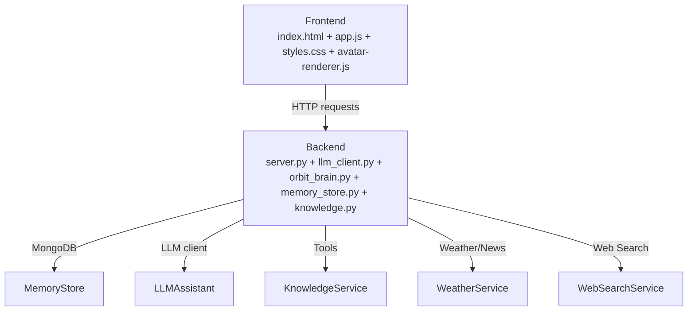

**Diagram sources**
- [index.html:1-338](file://frontend/index.html#L1-L338)
- [app.js:1-1765](file://frontend/scripts/app.js#L1-L1765)
- [styles.css:1-1510](file://frontend/assets/styles.css#L1-L1510)
- [avatar-renderer.js:1-106](file://frontend/scripts/avatar-renderer.js#L1-L106)
- [server.py:1-611](file://backend/server.py#L1-L611)
- [llm_client.py:1-366](file://backend/api_clients/llm_client.py#L1-L366)
- [orbit_brain.py:1-502](file://backend/core/orbit_brain.py#L1-L502)
- [memory_store.py:1-947](file://backend/core/memory_store.py#L1-L947)
- [knowledge.py:1-393](file://backend/tools/knowledge.py#L1-L393)

**Section sources**
- [index.html:1-338](file://frontend/index.html#L1-L338)
- [app.js:1-1765](file://frontend/scripts/app.js#L1-L1765)
- [server.py:1-611](file://backend/server.py#L1-L611)

## Core Components
- Message composition and rendering: The frontend composes user and assistant messages, renders Markdown for assistant replies, and displays tool events as pill indicators.
- Real-time updates: The UI scrolls to the latest message, updates tool event indicators, and reflects avatar state changes.
- Message types: user, assistant, and system messages are differentiated in rendering and metadata.
- Message list management: The UI maintains a conversation array and appends DOM nodes for each message.
- Scroll and viewport: The message list is scrollable with smooth behavior and auto-scrolls to the bottom.
- Tool event display: Tool invocations emit labeled pills that appear above the message list.
- Editing and persistence: Messages are persisted to MongoDB via session endpoints; long histories are fetched with limits.
- Error handling: UI surfaces tool errors and API failures; avatar state transitions reflect processing stages.
- Performance and memory: Lazy retrieval, chunked RAG, and cleanup hooks prevent excessive memory usage.

**Section sources**
- [app.js:1089-1150](file://frontend/scripts/app.js#L1089-L1150)
- [styles.css:546-700](file://frontend/assets/styles.css#L546-L700)
- [server.py:106-167](file://backend/server.py#L106-L167)
- [memory_store.py:651-686](file://backend/core/memory_store.py#L651-L686)
- [llm_client.py:38-366](file://backend/api_clients/llm_client.py#L38-L366)
- [knowledge.py:88-393](file://backend/tools/knowledge.py#L88-L393)

## Architecture Overview
The pipeline begins when the user submits a message. The frontend sends a request to the backend, which builds a system instruction and function declarations, invokes the LLM client, executes tool calls, and returns a reply with tool events. The frontend renders the assistant’s reply, updates tool events, and persists messages to the backend.

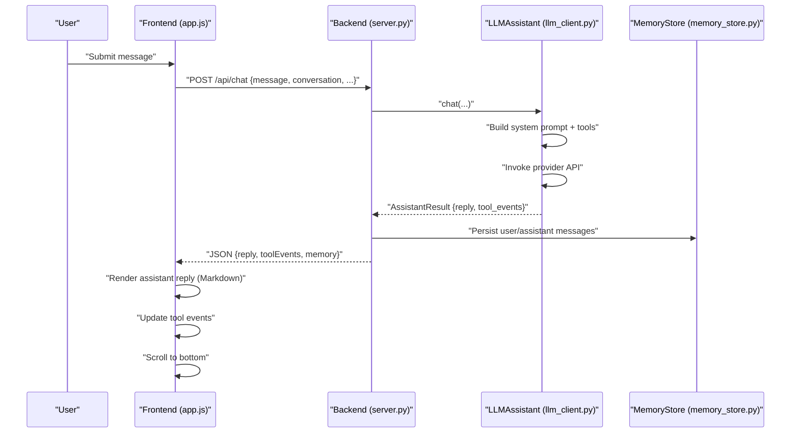

**Diagram sources**
- [app.js:928-1087](file://frontend/scripts/app.js#L928-L1087)
- [server.py:276-321](file://backend/server.py#L276-L321)
- [llm_client.py:38-366](file://backend/api_clients/llm_client.py#L38-L366)
- [memory_store.py:652-673](file://backend/core/memory_store.py#L652-L673)

## Detailed Component Analysis

### Message Composition Workflow
- Composition occurs on submit: the frontend validates input, creates a placeholder assistant message, and starts processing.
- The UI disables composer controls during processing to prevent concurrent submissions.
- On success, the assistant reply replaces the placeholder; on failure, the UI shows an error message and restores idle state.

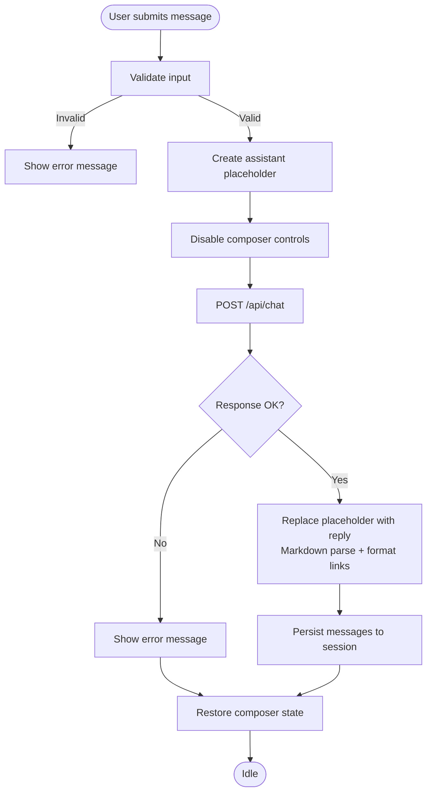

**Diagram sources**
- [app.js:928-1087](file://frontend/scripts/app.js#L928-L1087)

**Section sources**
- [app.js:928-1087](file://frontend/scripts/app.js#L928-L1087)

### DOM Rendering Patterns and Message Types
- Message types:
  - user: right-aligned, accent background, with optional metadata (voice/screen).
  - assistant: left-aligned, card-like, with Markdown rendering and links opened externally.
  - system: centered, muted, used for notifications and tool events summary.
- Each message includes a meta/footer with time and contextual labels.
- Tool events are rendered as pill indicators above the message list.

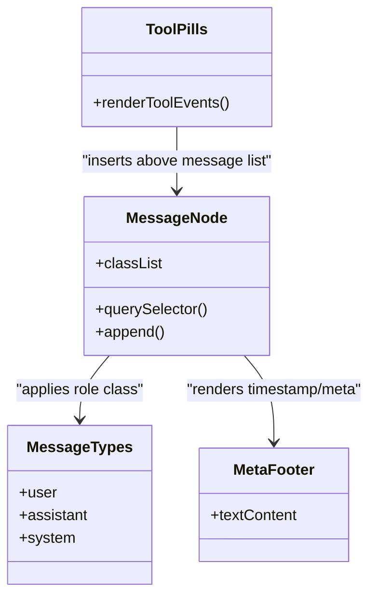

**Diagram sources**
- [app.js:1091-1149](file://frontend/scripts/app.js#L1091-L1149)
- [styles.css:579-700](file://frontend/assets/styles.css#L579-L700)

**Section sources**
- [app.js:1091-1149](file://frontend/scripts/app.js#L1091-L1149)
- [styles.css:579-700](file://frontend/assets/styles.css#L579-L700)

### Real-Time Message Updates and Scroll Behavior
- After each assistant reply, the message list scrolls to the bottom automatically.
- Smooth scrolling behavior ensures a natural UX.
- Tool events update immediately above the message list to reflect ongoing tool activity.

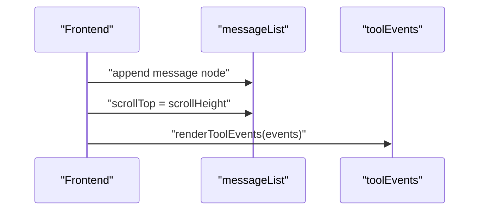

**Diagram sources**
- [app.js:1137-1149](file://frontend/scripts/app.js#L1137-L1149)
- [styles.css:546-577](file://frontend/assets/styles.css#L546-L577)

**Section sources**
- [app.js:1137-1149](file://frontend/scripts/app.js#L1137-L1149)
- [styles.css:546-577](file://frontend/assets/styles.css#L546-L577)

### Message Formatting and Content Rendering Strategies
- Assistant replies are rendered as Markdown; links are opened in new tabs with security attributes.
- User and system messages are plain text with appropriate metadata.
- Timestamps are localized and formatted for readability.

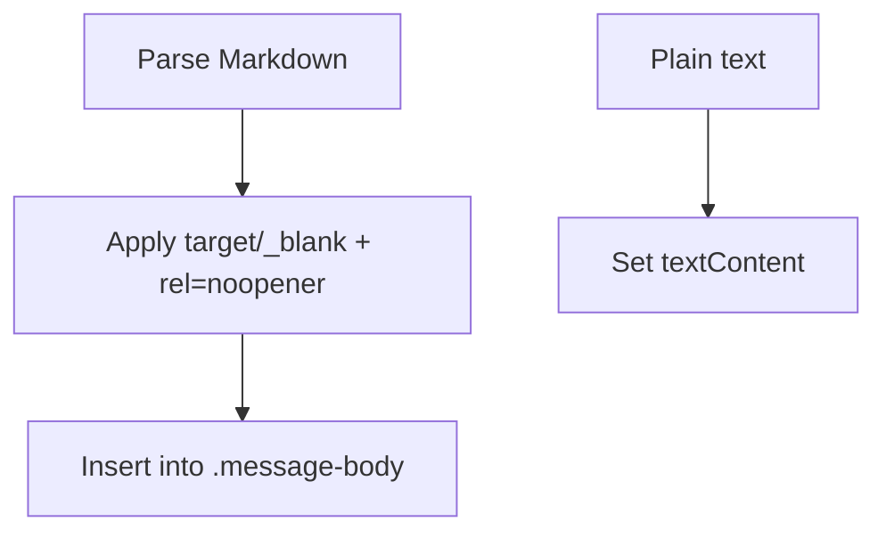

**Diagram sources**
- [app.js:1025-1030](file://frontend/scripts/app.js#L1025-L1030)
- [app.js:1757-1764](file://frontend/scripts/app.js#L1757-L1764)

**Section sources**
- [app.js:1025-1030](file://frontend/scripts/app.js#L1025-L1030)
- [app.js:1757-1764](file://frontend/scripts/app.js#L1757-L1764)

### Message List Management and Viewport Handling
- The message list is a vertically scrollable container with a max-width and centered alignment.
- Long conversations rely on native scrolling; the UI auto-focuses the input after clearing or starting a new chat.
- Sessions are loaded with a configurable limit to reduce initial load.

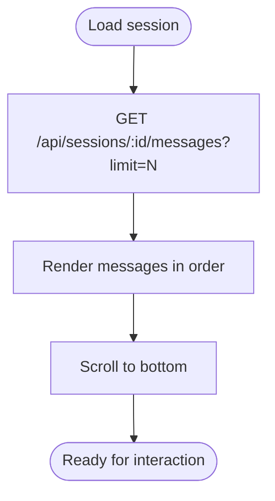

**Diagram sources**
- [server.py:128-135](file://backend/server.py#L128-L135)
- [memory_store.py:675-685](file://backend/core/memory_store.py#L675-L685)
- [app.js:1217-1241](file://frontend/scripts/app.js#L1217-L1241)

**Section sources**
- [server.py:128-135](file://backend/server.py#L128-L135)
- [memory_store.py:675-685](file://backend/core/memory_store.py#L675-L685)
- [app.js:1217-1241](file://frontend/scripts/app.js#L1217-L1241)

### Tool Event Display System
- Tool events are collected during LLM tool calls and returned to the frontend.
- Each event is rendered as a pill with a descriptive label above the message list.
- Events persist across sessions and are cleared when the list is reset.

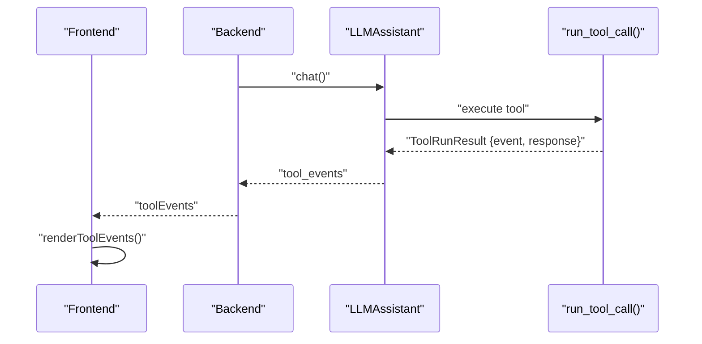

**Diagram sources**
- [llm_client.py:185-215](file://backend/api_clients/llm_client.py#L185-L215)
- [orbit_brain.py:389-501](file://backend/core/orbit_brain.py#L389-L501)
- [app.js:1141-1149](file://frontend/scripts/app.js#L1141-L1149)

**Section sources**
- [llm_client.py:185-215](file://backend/api_clients/llm_client.py#L185-L215)
- [orbit_brain.py:389-501](file://backend/core/orbit_brain.py#L389-L501)
- [app.js:1141-1149](file://frontend/scripts/app.js#L1141-L1149)

### Message Editing Capabilities
- The UI supports saving messages as notes via an “Add to Notes” action on user and assistant messages.
- Selected text is preferred when available; otherwise the full message body is used.
- Notes are truncated to a reasonable length and persisted to the backend.

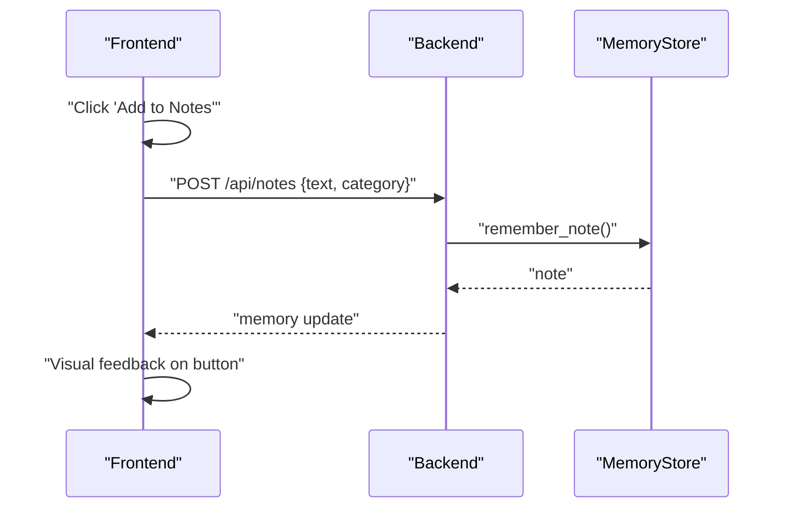

**Diagram sources**
- [app.js:1516-1565](file://frontend/scripts/app.js#L1516-L1565)
- [server.py:243-253](file://backend/server.py#L243-L253)
- [memory_store.py:309-332](file://backend/core/memory_store.py#L309-L332)

**Section sources**
- [app.js:1516-1565](file://frontend/scripts/app.js#L1516-L1565)
- [server.py:243-253](file://backend/server.py#L243-L253)
- [memory_store.py:309-332](file://backend/core/memory_store.py#L309-L332)

### Error Message Handling
- API errors and tool errors are surfaced to the UI as system messages.
- Safety/refusal responses from providers are detected and handled gracefully.
- Avatar state transitions reflect error conditions.

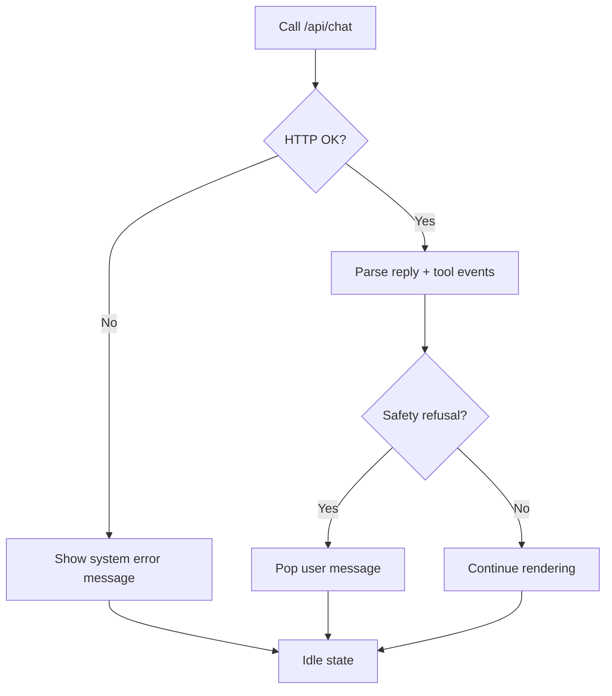

**Diagram sources**
- [app.js:1072-1087](file://frontend/scripts/app.js#L1072-L1087)
- [llm_client.py:161-174](file://backend/api_clients/llm_client.py#L161-L174)

**Section sources**
- [app.js:1072-1087](file://frontend/scripts/app.js#L1072-L1087)
- [llm_client.py:161-174](file://backend/api_clients/llm_client.py#L161-L174)

### Performance Optimizations and Memory Cleanup
- Lazy retrieval: sessions are fetched with a configurable limit to reduce payload sizes.
- Chunked RAG: knowledge is split into chunks and indexed; session-specific retrievers are cached and invalidated on changes.
- Memory cleanup: deleting sessions removes attachment files and clears cached retrievers; deleting messages removes entries from the database.
- Avatar worker offloads rendering to a Web Worker to keep UI responsive.

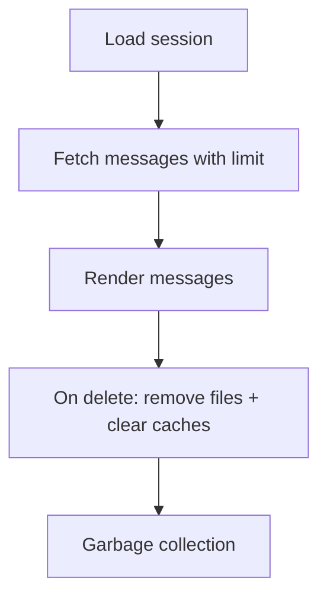

**Diagram sources**
- [server.py:128-135](file://backend/server.py#L128-L135)
- [knowledge.py:389-393](file://backend/tools/knowledge.py#L389-L393)
- [memory_store.py:632-646](file://backend/core/memory_store.py#L632-L646)
- [avatar-renderer.js:1-106](file://frontend/scripts/avatar-renderer.js#L1-L106)

**Section sources**
- [server.py:128-135](file://backend/server.py#L128-L135)
- [knowledge.py:389-393](file://backend/tools/knowledge.py#L389-L393)
- [memory_store.py:632-646](file://backend/core/memory_store.py#L632-L646)
- [avatar-renderer.js:1-106](file://frontend/scripts/avatar-renderer.js#L1-L106)

## Dependency Analysis
- Frontend depends on:
  - DOM elements defined in index.html
  - Styles in styles.css for layout and message appearance
  - Avatar renderer for expressive UI feedback
- Backend depends on:
  - MemoryStore for persistence
  - LLMAssistant for orchestration and tool execution
  - KnowledgeService for RAG and session document search
  - Weather/News/WebSearch services for tool calls

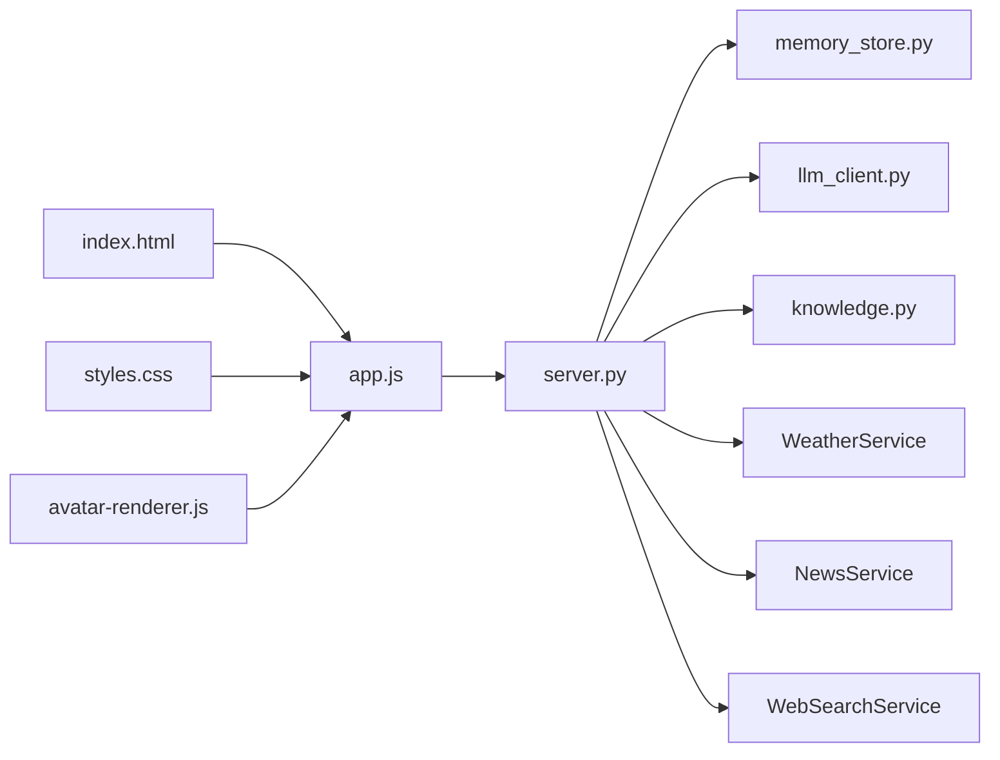

**Diagram sources**
- [index.html:1-338](file://frontend/index.html#L1-L338)
- [app.js:1-1765](file://frontend/scripts/app.js#L1-L1765)
- [styles.css:1-1510](file://frontend/assets/styles.css#L1-L1510)
- [avatar-renderer.js:1-106](file://frontend/scripts/avatar-renderer.js#L1-L106)
- [server.py:1-611](file://backend/server.py#L1-L611)
- [llm_client.py:1-366](file://backend/api_clients/llm_client.py#L1-L366)
- [orbit_brain.py:1-502](file://backend/core/orbit_brain.py#L1-L502)
- [memory_store.py:1-947](file://backend/core/memory_store.py#L1-L947)
- [knowledge.py:1-393](file://backend/tools/knowledge.py#L1-L393)

**Section sources**
- [index.html:1-338](file://frontend/index.html#L1-L338)
- [app.js:1-1765](file://frontend/scripts/app.js#L1-L1765)
- [server.py:1-611](file://backend/server.py#L1-L611)

## Performance Considerations
- Prefer incremental rendering: append new messages and scroll to bottom rather than re-rendering the entire list.
- Use session limits for initial loads to reduce bandwidth and DOM size.
- Cache session retrievers and invalidate on document changes to avoid rebuilding indices frequently.
- Offload avatar rendering to a Web Worker to keep the main thread responsive.
- Avoid unnecessary reflows by batching DOM updates and using efficient selectors.

[No sources needed since this section provides general guidance]

## Troubleshooting Guide
Common issues and remedies:
- API key missing: The UI reports provider status and model availability; ensure the API key is configured.
- Moderation/refusal responses: The UI detects safety refusals and avoids appending invalid user messages.
- Tool errors: Tool errors are returned as events and shown as system messages; check backend logs for details.
- Large attachments: Uploads are validated for type and size; oversized files are rejected.
- Session switching: UI checks the active session before updating; switching mid-request discards stale UI updates.

**Section sources**
- [app.js:902-926](file://frontend/scripts/app.js#L902-L926)
- [app.js:1072-1087](file://frontend/scripts/app.js#L1072-L1087)
- [server.py:326-393](file://backend/server.py#L326-L393)
- [llm_client.py:161-174](file://backend/api_clients/llm_client.py#L161-L174)

## Conclusion
The message processing pipeline integrates a responsive frontend with a robust backend to deliver real-time, tool-augmented conversations. By leveraging Markdown rendering, tool event indicators, and efficient persistence, it scales to long histories while maintaining a smooth user experience. Performance optimizations and memory cleanup ensure stability over extended use.