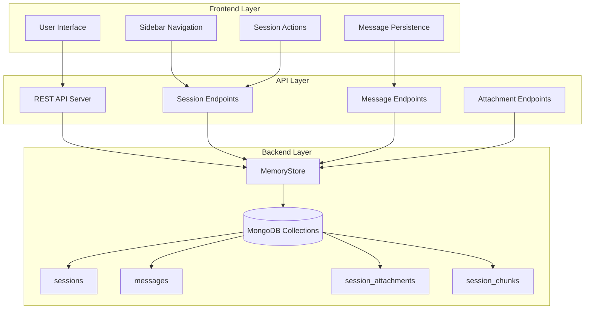
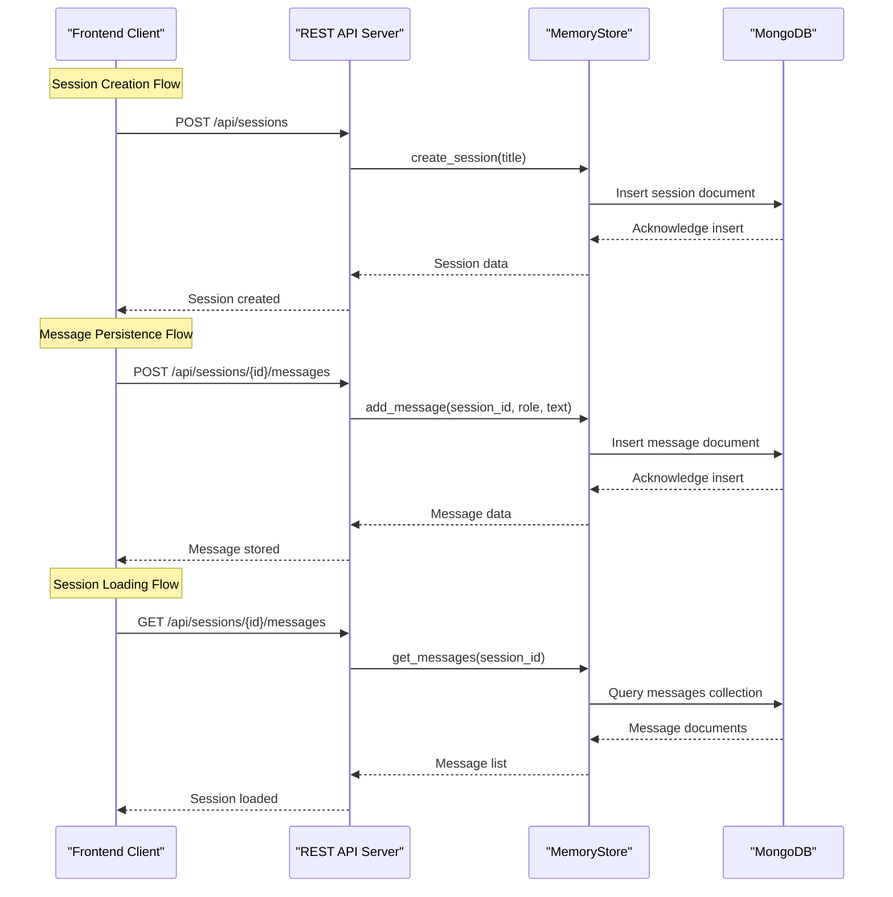
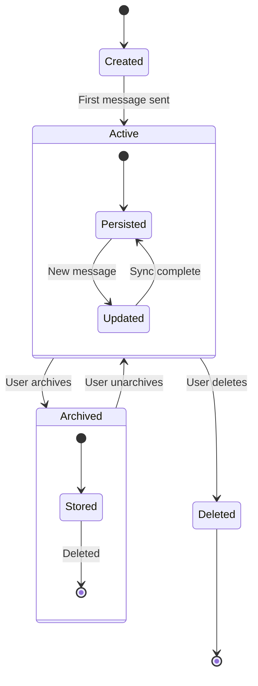
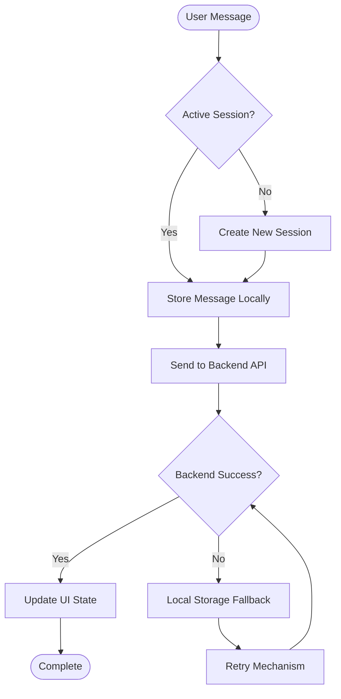
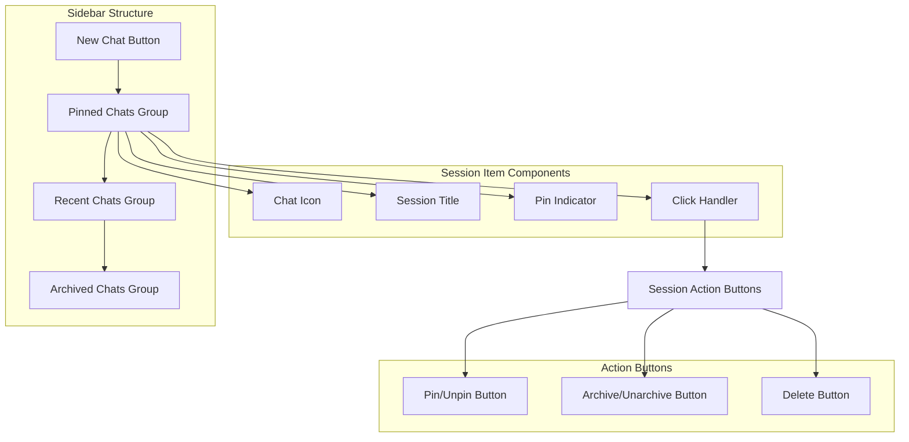
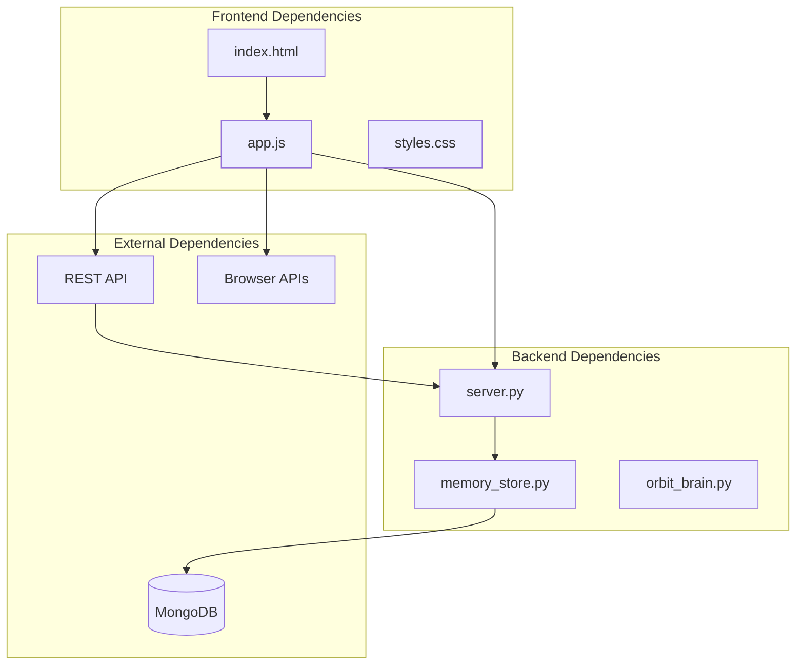

# Session Handling

<cite>
**Referenced Files in This Document**
- [memory_store.py](file://backend/core/memory_store.py)
- [server.py](file://backend/server.py)
- [app.js](file://frontend/scripts/app.js)
- [index.html](file://frontend/index.html)
- [orbit_brain.py](file://backend/core/orbit_brain.py)
</cite>

## Table of Contents
1. [Introduction](#introduction)
2. [Project Structure](#project-structure)
3. [Core Components](#core-components)
4. [Architecture Overview](#architecture-overview)
5. [Detailed Component Analysis](#detailed-component-analysis)
6. [Dependency Analysis](#dependency-analysis)
7. [Performance Considerations](#performance-considerations)
8. [Troubleshooting Guide](#troubleshooting-guide)
9. [Conclusion](#conclusion)

## Introduction

The session management system provides comprehensive conversation persistence and multi-session support for the Orbit Virtual Assistant. This system enables users to maintain multiple concurrent conversations, track session metadata, persist chat history, and manage session lifecycle operations including creation, updates, archiving, and deletion.

The system integrates seamlessly with the backend MongoDB storage layer while providing a responsive frontend interface for session navigation, manipulation, and restoration. It supports advanced features like session pinning, archiving, conversation filtering, and automatic cleanup procedures.

## Project Structure

The session management system spans across three main layers of the application architecture:

**Diagram sources**
- [app.js:1151-1270](file://frontend/scripts/app.js#L1151-L1270)
- [server.py:106-500](file://backend/server.py#L106-L500)
- [memory_store.py:67-830](file://backend/core/memory_store.py#L67-L830)

**Section sources**
- [app.js:1151-1270](file://frontend/scripts/app.js#L1151-L1270)
- [server.py:106-500](file://backend/server.py#L106-L500)
- [memory_store.py:67-830](file://backend/core/memory_store.py#L67-L830)

## Core Components

### Backend MemoryStore Implementation

The MemoryStore class serves as the central persistence layer for all session-related data, providing thread-safe operations for session management, message persistence, and attachment handling.

**Key Features:**
- Multi-session support with automatic sorting by pin status and recency
- Thread-safe operations using locks for concurrent access
- Comprehensive indexing strategy for optimal query performance
- Automatic migration from legacy JSON storage format
- Activity tracking and audit logging

**Section sources**
- [memory_store.py:67-830](file://backend/core/memory_store.py#L67-L830)

### Frontend Session Management

The frontend JavaScript implementation provides comprehensive session management capabilities including:

**Session Lifecycle Operations:**
- Automatic session creation on first message
- Real-time session loading and switching
- Persistent session state across browser sessions
- Visual session navigation with pinning and archiving

**User Interface Integration:**
- Sidebar-based session navigation
- Pin/unpin functionality for frequently accessed chats
- Archive/unarchive operations for conversation management
- Session filtering and organization

**Section sources**
- [app.js:1151-1270](file://frontend/scripts/app.js#L1151-L1270)
- [index.html:13-56](file://frontend/index.html#L13-L56)

### REST API Integration

The backend server exposes comprehensive REST endpoints for session management:

**Session Endpoints:**
- GET `/api/sessions` - Retrieve all sessions with filtering options
- POST `/api/sessions` - Create new sessions
- PUT `/api/sessions/{id}` - Update session metadata (title, pin, archive)
- DELETE `/api/sessions/{id}` - Delete sessions and associated data

**Message Endpoints:**
- GET `/api/sessions/{id}/messages` - Retrieve session messages
- POST `/api/sessions/{id}/messages` - Add messages to sessions
- DELETE `/api/messages/{id}` - Remove individual messages

**Attachment Endpoints:**
- POST `/api/sessions/{id}/attachments` - Upload and process attachments
- DELETE `/api/sessions/{id}/attachments/{attachment_id}` - Remove attachments

**Section sources**
- [server.py:106-500](file://backend/server.py#L106-L500)

## Architecture Overview

The session management system follows a client-server architecture with clear separation of concerns:

**Diagram sources**
- [server.py:183-213](file://backend/server.py#L183-L213)
- [memory_store.py:579-685](file://backend/core/memory_store.py#L579-L685)

The architecture ensures data consistency through atomic operations and provides robust error handling for network failures and concurrent access scenarios.

## Detailed Component Analysis

### Session Lifecycle Management

The session lifecycle encompasses creation, persistence, loading, updating, and deletion phases:

**Section sources**
- [app.js:964-978](file://frontend/scripts/app.js#L964-L978)
- [memory_store.py:579-646](file://backend/core/memory_store.py#L579-L646)

### Session Metadata Management

Session metadata includes essential attributes for conversation organization and user experience:

**Core Metadata Fields:**
- `session_id`: Unique identifier for session persistence
- `title`: Human-readable session name (defaults to "New Chat")
- `created_at`: Timestamp of session creation
- `updated_at`: Last modification timestamp
- `pinned`: Boolean flag for session prioritization
- `archived`: Boolean flag for conversation archival

**Sorting and Organization:**
Sessions are automatically sorted by pin status (pinned first) followed by recency (most recent first), providing intuitive navigation for users with multiple conversations.

**Section sources**
- [memory_store.py:27-36](file://backend/core/memory_store.py#L27-L36)
- [memory_store.py:598-606](file://backend/core/memory_store.py#L598-L606)

### Conversation Persistence Strategy

The system implements a dual-persistence strategy combining frontend state management with backend database storage:

**Section sources**
- [app.js:964-1048](file://frontend/scripts/app.js#L964-L1048)
- [server.py:295-320](file://backend/server.py#L295-L320)

### Sidebar Navigation System

The sidebar provides comprehensive session management through intuitive visual organization:

**Section sources**
- [index.html:13-56](file://frontend/index.html#L13-L56)
- [app.js:1153-1270](file://frontend/scripts/app.js#L1153-L1270)

### Session Filtering and Organization

The system provides sophisticated filtering mechanisms for managing large numbers of conversations:

**Filter Categories:**
- **Pinned Sessions**: Always visible at the top of the sidebar
- **Recent Sessions**: Up to 30 most recent conversations (excluding pinned)
- **Archived Sessions**: Hidden conversations that can be restored

**Sorting Criteria:**
- Primary: Pin status (pinned sessions first)
- Secondary: Last updated timestamp (most recent first)
- Tertiary: Alphabetical order for sessions with identical timestamps

**Section sources**
- [app.js:1153-1187](file://frontend/scripts/app.js#L1153-L1187)
- [memory_store.py:598-606](file://backend/core/memory_store.py#L598-L606)

### Session Restoration and State Synchronization

The system implements robust session restoration mechanisms for seamless user experience:

**Automatic State Restoration:**
- Session list restoration on page reload
- Active session preservation across browser sessions
- Conversation state synchronization with backend
- Real-time updates for multi-tab usage

**State Synchronization Patterns:**
- Frontend maintains local state for immediate UI responsiveness
- Backend provides authoritative state for data persistence
- Conflict resolution for concurrent modifications
- Graceful degradation during network failures

**Section sources**
- [app.js:902-926](file://frontend/scripts/app.js#L902-L926)
- [server.py:506-520](file://backend/server.py#L506-L520)

### Error Handling and Network Failure Recovery

The system implements comprehensive error handling strategies for various failure scenarios:

**Network Failure Handling:**
- Automatic retry mechanisms for transient failures
- Local fallback storage for immediate user feedback
- Graceful degradation to read-only operations
- User-friendly error messaging with recovery options

**Session State Consistency:**
- Atomic operations for session updates
- Transaction-like behavior for complex operations
- Rollback mechanisms for failed operations
- Idempotent operation support

**Section sources**
- [app.js:1072-1086](file://frontend/scripts/app.js#L1072-L1086)
- [server.py:409-422](file://backend/server.py#L409-L422)

## Dependency Analysis

The session management system exhibits well-structured dependencies with clear separation of concerns:

**Diagram sources**
- [app.js:1-50](file://frontend/scripts/app.js#L1-L50)
- [server.py:1-30](file://backend/server.py#L1-L30)
- [memory_store.py:1-20](file://backend/core/memory_store.py#L1-L20)

**Section sources**
- [app.js:1-50](file://frontend/scripts/app.js#L1-L50)
- [server.py:1-30](file://backend/server.py#L1-L30)
- [memory_store.py:1-20](file://backend/core/memory_store.py#L1-L20)

## Performance Considerations

### Database Indexing Strategy

The MemoryStore implementation employs strategic indexing for optimal query performance:

**Critical Indexes:**
- `sessions.session_id`: Unique index for fast session lookup
- `sessions.pinned + sessions.updated_at`: Composite index for efficient sorting
- `messages.session_id + messages.created_at`: Composite index for message retrieval
- `session_attachments.session_id`: Efficient attachment lookup

**Query Optimization:**
- Sorted queries using appropriate sort directions
- Limit clauses for pagination support
- Projection optimization to minimize data transfer

### Frontend Performance Patterns

**Virtual Scrolling:**
- Efficient rendering of large session lists
- Lazy loading of session content
- Debounced search and filtering operations

**State Management:**
- Minimal state updates to reduce re-renders
- Immutable state patterns for predictable updates
- Efficient diffing algorithms for UI updates

## Troubleshooting Guide

### Common Session Issues

**Session Not Loading:**
- Verify MongoDB connectivity and authentication
- Check session ID validity and existence
- Review browser console for JavaScript errors
- Confirm API endpoint accessibility

**Message Persistence Failures:**
- Monitor network connectivity during operations
- Verify session creation before message posting
- Check backend logs for storage errors
- Implement manual retry mechanisms

**Sidebar Navigation Problems:**
- Clear browser cache and cookies
- Verify localStorage availability
- Check for JavaScript errors in console
- Restart browser if persistent issues occur

### Debugging Session State

**Frontend Debugging:**
- Inspect appState structure in browser developer tools
- Monitor API request/response cycles
- Track session ID propagation through application
- Verify localStorage session persistence

**Backend Debugging:**
- Monitor MongoDB collection operations
- Check MemoryStore method invocations
- Verify thread safety and locking mechanisms
- Review activity logs for audit trails

**Section sources**
- [app.js:1235-1237](file://frontend/scripts/app.js#L1235-L1237)
- [server.py:409-422](file://backend/server.py#L409-L422)

## Conclusion

The session management system provides a robust, scalable foundation for conversation persistence and multi-session support in the Orbit Virtual Assistant. Through careful architectural design, comprehensive error handling, and intuitive user interface patterns, it delivers a seamless experience for managing multiple conversations while maintaining data integrity and performance.

The system's modular design enables easy extension and maintenance, while its comprehensive API coverage supports future enhancements such as advanced filtering, bulk operations, and collaborative features. The combination of frontend responsiveness and backend reliability ensures users can confidently manage their conversations across multiple sessions and devices.

Key strengths of the implementation include its thread-safe backend operations, comprehensive error handling, efficient database indexing, and intuitive user interface patterns that prioritize usability without sacrificing functionality.