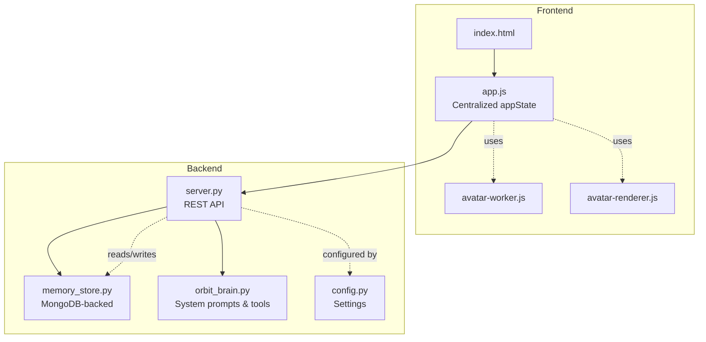
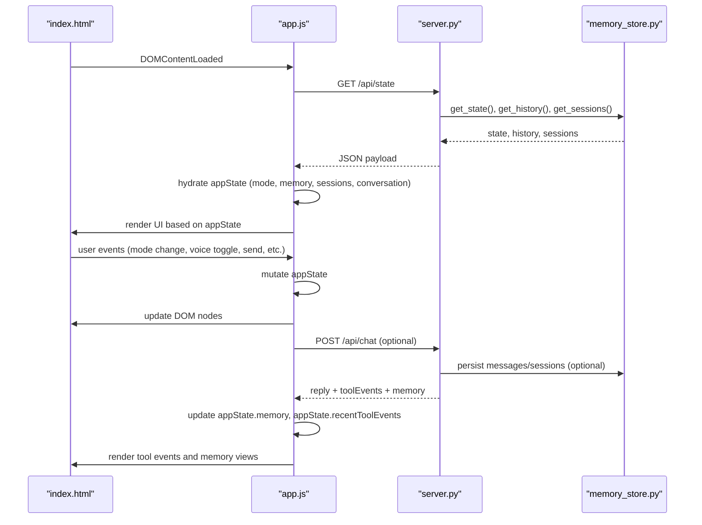
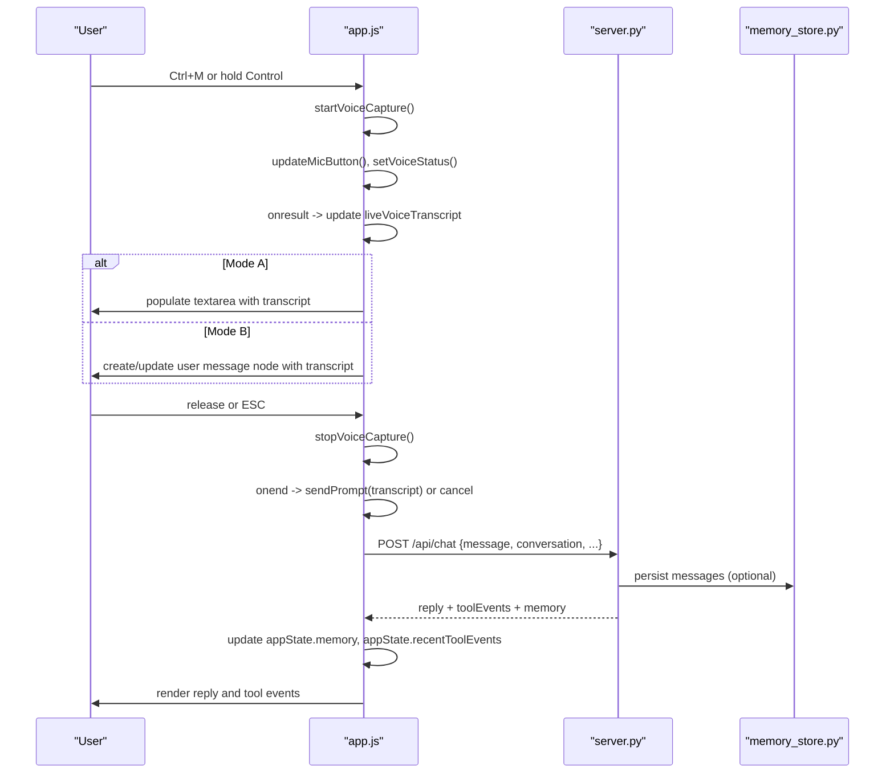
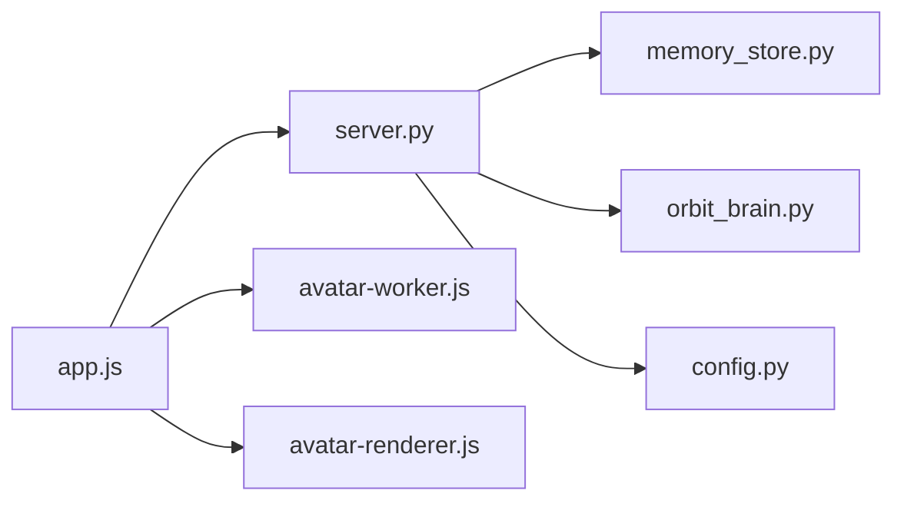

# State Management

<cite>
**Referenced Files in This Document**
- [app.js](file://frontend/scripts/app.js)
- [server.py](file://backend/server.py)
- [memory_store.py](file://backend/core/memory_store.py)
- [orbit_brain.py](file://backend/core/orbit_brain.py)
- [config.py](file://backend/config.py)
- [index.html](file://frontend/index.html)
- [avatar-worker.js](file://frontend/scripts/avatar-worker.js)
- [avatar-renderer.js](file://frontend/scripts/avatar-renderer.js)
- [asr_whisper.py](file://backend/audio/asr_whisper.py)
</cite>

## Table of Contents
1. [Introduction](#introduction)
2. [Project Structure](#project-structure)
3. [Core Components](#core-components)
4. [Architecture Overview](#architecture-overview)
5. [Detailed Component Analysis](#detailed-component-analysis)
6. [Dependency Analysis](#dependency-analysis)
7. [Performance Considerations](#performance-considerations)
8. [Troubleshooting Guide](#troubleshooting-guide)
9. [Conclusion](#conclusion)

## Introduction
This document explains the application state management system for the Orbit Virtual Assistant. It focuses on the centralized appState object in the frontend, covering chat modes (simple, copilot, coach), conversation tracking, session management, voice input state, screen sharing state, and UI panel states. It also documents state initialization, persistence mechanisms (localStorage and MongoDB), state mutation patterns, and how state changes drive UI rendering. Finally, it provides guidance on performance considerations for large conversations and memory management strategies.

## Project Structure
The state management spans the frontend and backend:
- Frontend: Centralized state in a single JavaScript object (appState), with UI bindings and event handlers updating state and driving rendering.
- Backend: State persistence and orchestration via a MongoDB-backed MemoryStore, exposing REST endpoints for sessions, messages, profile, tasks, notes, and chat.

**Diagram sources**
- [index.html](file://frontend/index.html)
- [app.js](file://frontend/scripts/app.js)
- [server.py](file://backend/server.py)
- [memory_store.py](file://backend/core/memory_store.py)
- [orbit_brain.py](file://backend/core/orbit_brain.py)
- [config.py](file://backend/config.py)
- [avatar-worker.js](file://frontend/scripts/avatar-worker.js)
- [avatar-renderer.js](file://frontend/scripts/avatar-renderer.js)

**Section sources**
- [index.html](file://frontend/index.html)
- [app.js](file://frontend/scripts/app.js)
- [server.py](file://backend/server.py)
- [memory_store.py](file://backend/core/memory_store.py)
- [orbit_brain.py](file://backend/core/orbit_brain.py)
- [config.py](file://backend/config.py)
- [avatar-worker.js](file://frontend/scripts/avatar-worker.js)
- [avatar-renderer.js](file://frontend/scripts/avatar-renderer.js)

## Core Components
- Centralized appState: Holds all frontend state including mode, conversation, memory, sessions, voice, screen sharing, UI panels, and composer toggles.
- DOM element registry: Elements are cached once and used to mutate the UI and read inputs.
- Event binding: Listeners update appState and trigger UI updates.
- Avatar worker: Drives animated avatar state via a Web Worker.
- REST API: Backend endpoints persist and retrieve state (sessions, messages, memory), and orchestrate chat with the brain.

Key state categories:
- Chat & mode: mode, coachTopic, coachLevel, preferredLanguage, conversation, memory, currentTurn, recentToolEvents.
- Session management: activeSessionId, sessions, isProcessing.
- Screen sharing: latestScreenImage, screenStream, captureIntervalId.
- Voice: voiceEnabled, speechRecognition, speechSupported, listening, recognitionStarting, stopRecognitionAfterStart, micHeld, spaceTalking, hotkeyDown, liveVoiceTranscript, liveVoiceName, silenceTimeoutId, modeAActive.
- Avatar: stageWorker.
- UI panel state: sidebarOpen, drawerOpen.
- Composer toggle states: webSearchActive, thinkingActive, imageGenActive, offlineModeActive.

**Section sources**
- [app.js](file://frontend/scripts/app.js)
- [server.py](file://backend/server.py)
- [memory_store.py](file://backend/core/memory_store.py)
- [avatar-worker.js](file://frontend/scripts/avatar-worker.js)
- [avatar-renderer.js](file://frontend/scripts/avatar-renderer.js)

## Architecture Overview
The frontend initializes state from localStorage and the backend’s /api/state endpoint. User interactions mutate appState, which triggers UI updates and, when needed, API calls to the backend. The backend persists state to MongoDB via MemoryStore and orchestrates chat with orbit_brain.py.

**Diagram sources**
- [index.html](file://frontend/index.html)
- [app.js](file://frontend/scripts/app.js)
- [server.py](file://backend/server.py)
- [memory_store.py](file://backend/core/memory_store.py)

## Detailed Component Analysis

### Centralized appState and Initialization
- appState is declared once and holds all runtime state.
- Initialization reads localStorage keys for persistent UI and preferences (e.g., sidebar open, voice language, conversation language, coach topic/level).
- DOM elements are cached once for efficient updates.
- On DOMContentLoaded, the app restores UI state from localStorage, binds events, initializes avatar worker, sets stage state, and calls refreshState to hydrate from backend.

Mutation patterns:
- Direct property assignment (e.g., appState.mode = "simple").
- Arrays mutated in-place (e.g., appState.conversation.push).
- Objects replaced or updated (e.g., appState.memory = data.memory).
- UI state toggled via boolean flags (e.g., appState.sidebarOpen).

Persistence mechanisms:
- localStorage: stores UI and preferences (sidebar open, voice language, conversation language, coach topic/level).
- MongoDB: stores sessions, messages, profile, tasks, notes, and caches (weather/news). Hydrated into appState.memory and appState.sessions via /api/state.

Relationships:
- Mode affects system prompts and tool availability.
- Conversation drives UI rendering and is persisted via session/message APIs.
- Voice and screen sharing state influence UI and are included in chat payloads.

**Section sources**
- [app.js](file://frontend/scripts/app.js)
- [server.py](file://backend/server.py)
- [memory_store.py](file://backend/core/memory_store.py)

### Chat Modes and UI Panels
- Modes: simple, copilot, coach. Mode selection updates appState.mode and UI classes. Coach mode exposes topic and level inputs.
- UI panels: sidebarOpen toggles layout class and persists to localStorage. DrawerOpen toggles utility drawer visibility.
- Composer toggles: webSearchActive/offlineModeActive are mutually exclusive; thinkingActive/imageGenActive toggle auxiliary behaviors.

State transitions:
- Mode change: setMode updates appState.mode and UI.
- Toggle chips: setupToggleChip flips state and toggles active class.
- Sidebar toggle: toggleSidebar updates layout class and localStorage.

**Section sources**
- [app.js](file://frontend/scripts/app.js)
- [index.html](file://frontend/index.html)

### Conversation Tracking and Sessions
- Conversation: array of {role, text} entries appended on user input and assistant replies.
- Sessions: list of session records; activeSessionId identifies the current chat. Sessions are created on first message if missing.
- Message rendering: addMessage creates DOM nodes and appends to messageList; scroll to bottom automatically.
- Session loading: loadSession clears current conversation and loads messages for the selected session.

Event-driven updates:
- sendPrompt mutates appState.conversation, sets placeholders, marks processing, posts to /api/chat, then updates memory and tool events.
- refreshSessions updates appState.sessions and re-renders session lists.

**Section sources**
- [app.js](file://frontend/scripts/app.js)
- [server.py](file://backend/server.py)
- [memory_store.py](file://backend/core/memory_store.py)

### Voice Input State and Transcription
- SpeechRecognition setup: checks browser support, sets language, enables interim results, continuous mode.
- Dual voice modes:
  - Mode A (Ctrl+M): review-then-send; transcript stored in textarea; appState.modeAActive true.
  - Mode B (hold Control): instant-send; transcript placed in a chat bubble; appState.modeAActive false.
- State mutations: listening, recognitionStarting, stopRecognitionAfterStart, micHeld, spaceTalking, hotkeyDown, liveVoiceTranscript.
- Hotkeys: handleHotkeyDown/handleHotkeyUp coordinate timers and mode switching; pointer events support push-to-talk.

Sequence of a voice input flow:

**Diagram sources**
- [app.js](file://frontend/scripts/app.js)
- [server.py](file://backend/server.py)
- [memory_store.py](file://backend/core/memory_store.py)

**Section sources**
- [app.js](file://frontend/scripts/app.js)

### Screen Sharing State
- Start: navigator.mediaDevices.getDisplayMedia acquires stream; video element plays; captureScreenFrame draws to canvas; latestScreenImage stored as data URL.
- Capture loop: interval captures frames at ~2.5s cadence; canvas scaled to max width; latestScreenImage updated.
- Stop: stops tracks, clears state, clears preview canvas.

State mutations:
- appState.screenStream, appState.latestScreenImage, appState.captureIntervalId.

UI integration:
- attachScreenToggle checked by default; sendPrompt includes screenImage when enabled.

**Section sources**
- [app.js](file://frontend/scripts/app.js)

### Avatar Worker and Stage State
- Avatar worker computes sway, pulse, blink, and mouth shapes; posts frames to main thread.
- appState.stageWorker receives messages to set stage state; setStageState updates DOM attributes and worker state.
- Renderer class (avatar-renderer.js) consumes worker messages to draw the avatar.

**Section sources**
- [app.js](file://frontend/scripts/app.js)
- [avatar-worker.js](file://frontend/scripts/avatar-worker.js)
- [avatar-renderer.js](file://frontend/scripts/avatar-renderer.js)

### Backend State Persistence and Orchestration
- MemoryStore: MongoDB-backed store for sessions, messages, profile, tasks, notes, cache, knowledge chunks, and attachments.
- REST endpoints:
  - GET /api/state: returns provider, API key presence, model, default location, live voice name, memory, history, sessions.
  - POST /api/chat: orchestrates chat via orbit_brain.py, builds system prompts and tool declarations, runs tool calls, returns reply, tool events, and memory snapshot.
  - Session/message endpoints: create, list, add, delete.
  - Profile, tasks, notes endpoints: CRUD operations.
- Settings: provider selection, API keys, model, ports, MongoDB URIs, default location, voice name.

**Section sources**
- [server.py](file://backend/server.py)
- [memory_store.py](file://backend/core/memory_store.py)
- [orbit_brain.py](file://backend/core/orbit_brain.py)
- [config.py](file://backend/config.py)

### Relationship Between State Categories and UI Rendering
- Mode and UI panels: setMode and toggleSidebar update classes and visibility; DOM reflects appState.sidebarOpen and appState.drawerOpen.
- Conversation: addMessage renders DOM nodes; messageList is scrolled to bottom; toolEvents rendered separately.
- Voice: updateMicButton toggles active class and tooltip; setVoiceStatus updates status text.
- Screen sharing: canvas previews latest frame; latestScreenImage included in chat payloads.
- Avatar: setStageState updates dataset and CSS variables; worker-driven animations.

**Section sources**
- [app.js](file://frontend/scripts/app.js)
- [index.html](file://frontend/index.html)

### Examples of State Transitions and Event-Driven Updates
- Mode switch: clicking a mode button calls setMode, updates appState.mode and UI classes.
- Voice toggle: changing voice toggle updates appState.voiceEnabled and persists language to localStorage.
- Send message: submit composer calls sendPrompt, which mutates conversation, sets placeholders, posts to backend, and updates memory/tool events.
- Session actions: pin/archive/delete update backend and refresh sessions; UI reflects new state.

**Section sources**
- [app.js](file://frontend/scripts/app.js)
- [server.py](file://backend/server.py)

### Debugging State Changes
Recommended approaches:
- Log appState mutations: wrap setters with console logs to trace changes.
- Inspect localStorage: verify sidebarOpen, voice language, conversation language, coach topic/level.
- Network tab: observe /api/state, /api/chat, and session/message endpoints.
- Console: inspect appState.memory, appState.sessions, appState.conversation snapshots.
- Avatar worker: verify worker messages and stage state transitions.

**Section sources**
- [app.js](file://frontend/scripts/app.js)
- [server.py](file://backend/server.py)

## Dependency Analysis
- app.js depends on:
  - server.py endpoints for state hydration and chat orchestration.
  - MemoryStore for session/message persistence (via backend).
  - Avatar worker/renderer for stage animation.
- server.py depends on:
  - MemoryStore for persistence.
  - orbit_brain.py for system prompts and tool execution.
  - config.py for provider/model settings.
- orbit_brain.py depends on:
  - MemoryStore for memory brief and tool calls.
  - Tools (weather, news, knowledge, web search) for external data.

**Diagram sources**
- [app.js](file://frontend/scripts/app.js)
- [server.py](file://backend/server.py)
- [memory_store.py](file://backend/core/memory_store.py)
- [orbit_brain.py](file://backend/core/orbit_brain.py)
- [config.py](file://backend/config.py)
- [avatar-worker.js](file://frontend/scripts/avatar-worker.js)
- [avatar-renderer.js](file://frontend/scripts/avatar-renderer.js)

**Section sources**
- [app.js](file://frontend/scripts/app.js)
- [server.py](file://backend/server.py)
- [memory_store.py](file://backend/core/memory_store.py)
- [orbit_brain.py](file://backend/core/orbit_brain.py)
- [config.py](file://backend/config.py)
- [avatar-worker.js](file://frontend/scripts/avatar-worker.js)
- [avatar-renderer.js](file://frontend/scripts/avatar-renderer.js)

## Performance Considerations
- Large conversations:
  - Limit conversation snapshots passed to backend to recent turns to reduce payload size.
  - Paginate message retrieval for session loading.
- DOM rendering:
  - Batch DOM updates (e.g., append fragments) to minimize reflows.
  - Avoid frequent full rerenders; update only changed nodes.
- Voice and screen sharing:
  - Use intervals judiciously; clear timers on stop.
  - Compress images and cap resolution to reduce memory usage.
- Backend:
  - Index MongoDB collections appropriately (already ensured by MemoryStore).
  - Use streaming or pagination for large datasets.
- Memory management:
  - Clear appState.conversation selectively for inactive sessions.
  - Dispose of MediaStreams and revoke object URLs when leaving pages.

[No sources needed since this section provides general guidance]

## Troubleshooting Guide
Common issues and remedies:
- Voice not working:
  - Verify browser support and permissions; check appState.speechSupported and recognition errors.
  - Confirm language selection and network/API key availability.
- Screen sharing fails:
  - Ensure HTTPS and correct media constraints; verify track ended events.
- Chat not persisting:
  - Confirm session creation and message endpoints; check for CORS/network errors.
- Avatar not animating:
  - Verify Web Worker support and worker message handling.

**Section sources**
- [app.js](file://frontend/scripts/app.js)
- [server.py](file://backend/server.py)

## Conclusion
The Orbit Virtual Assistant employs a centralized frontend state model (appState) with robust persistence via localStorage and MongoDB. Event-driven updates propagate state changes to UI rendering, while backend endpoints manage orchestration and persistence. The system cleanly separates concerns across chat modes, voice, screen sharing, and UI panels, enabling scalable enhancements and maintainable debugging practices.