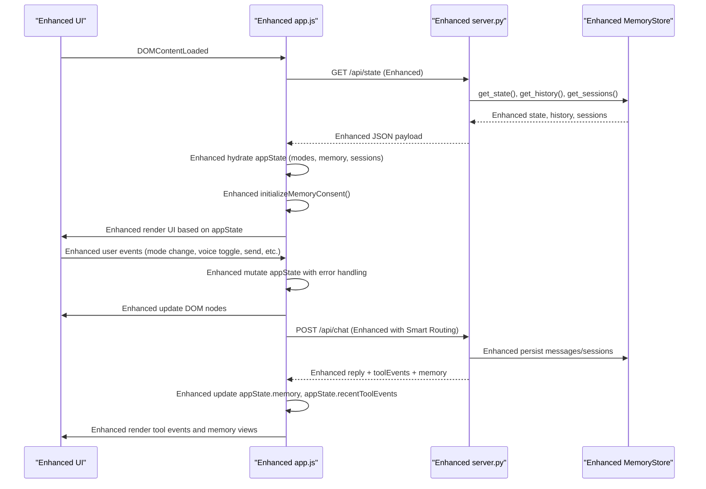
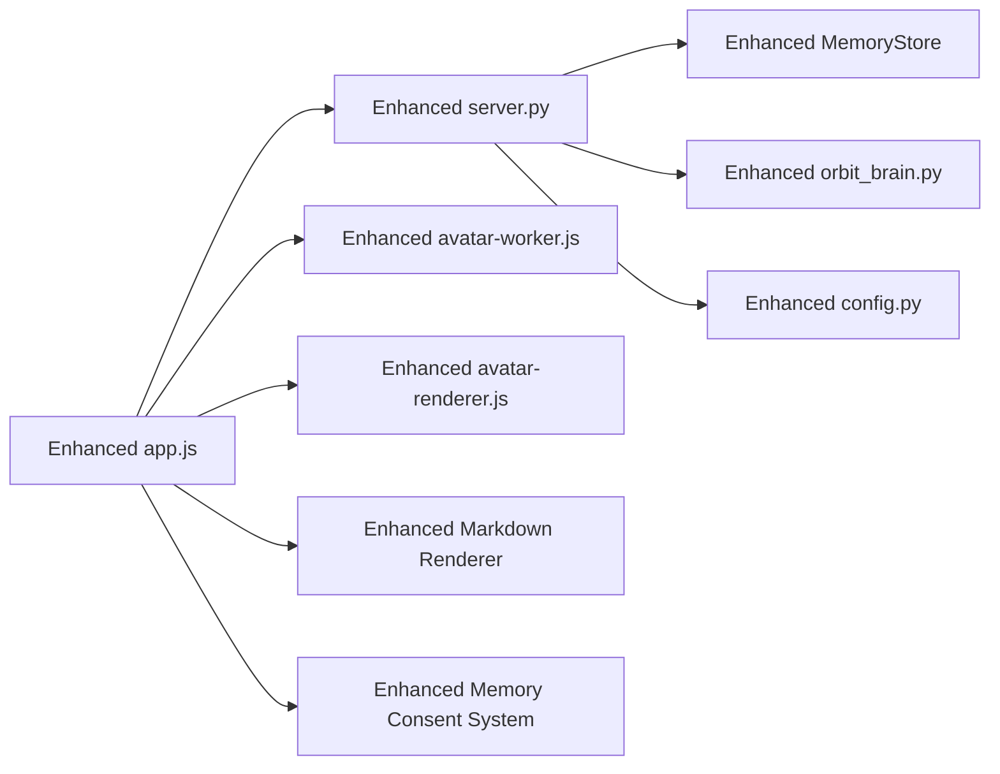

# State Management

<cite>
**Referenced Files in This Document**
- [app.js](file://frontend/scripts/app.js)
- [server.py](file://backend/server.py)
- [memory_store.py](file://backend/core/memory_store.py)
- [orbit_brain.py](file://backend/core/orbit_brain.py)
- [config.py](file://backend/config.py)
- [index.html](file://frontend/index.html)
- [avatar-worker.js](file://frontend/scripts/avatar-worker.js)
- [avatar-renderer.js](file://frontend/scripts/avatar-renderer.js)
- [asr_whisper.py](file://backend/audio/asr_whisper.py)
</cite>

## Update Summary
**Changes Made**
- Enhanced frontend state management architecture with improved application state patterns
- Added comprehensive markdown rendering with copy button functionality
- Implemented robust error handling throughout the application lifecycle
- Improved event handling for user interactions with better state mutation patterns
- Added Smart Routing feature with dynamic model selection capabilities
- Enhanced memory consent management with improved UI state synchronization
- **Updated**: Added comprehensive memory consent handling with memoryEnabled and memoryConsent properties
- **Updated**: Added new functions for memory consent checking and UI gating for memory-related panels
- **Updated**: Enhanced state management with automatic panel hiding and visual feedback for memory access control

## Table of Contents
1. [Introduction](#introduction)
2. [Project Structure](#project-structure)
3. [Core Components](#core-components)
4. [Architecture Overview](#architecture-overview)
5. [Detailed Component Analysis](#detailed-component-analysis)
6. [Enhanced State Management Patterns](#enhanced-state-management-patterns)
7. [Memory Consent Management](#memory-consent-management)
8. [Dependency Analysis](#dependency-analysis)
9. [Performance Considerations](#performance-considerations)
10. [Troubleshooting Guide](#troubleshooting-guide)
11. [Conclusion](#conclusion)

## Introduction
This document explains the enhanced application state management system for the Orbit Virtual Assistant. The system features a centralized appState object with improved state architecture, comprehensive event handling patterns, enhanced markdown rendering capabilities, and robust error handling mechanisms. The state management spans both frontend and backend components, providing seamless user experience with persistent memory storage and intelligent session management. **Updated**: The system now includes comprehensive memory consent handling with automatic UI gating and visual feedback for memory access control.

## Project Structure
The enhanced state management architecture spans frontend and backend components with improved separation of concerns:

- **Frontend**: Centralized state management in a single JavaScript object (appState) with enhanced UI bindings, event handlers, and state mutation patterns
- **Backend**: State persistence and orchestration via MongoDB-backed MemoryStore with enhanced REST endpoints for sessions, messages, and memory management
- **Audio Processing**: ASR Whisper integration for voice input with improved state handling
- **Avatar System**: Enhanced Web Worker-based avatar animation with synchronized state management
- **Memory Consent System**: **Updated**: Comprehensive memory access control with user consent management and automatic UI gating

```mermaid
graph TB
subgraph "Enhanced Frontend Architecture"
HTML["index.html<br/>Enhanced UI Structure"]
APP["app.js<br/>Centralized appState<br/>Enhanced State Patterns"]
AVW["avatar-worker.js<br/>Web Worker Animation"]
AVX["avatar-renderer.js<br/>Canvas Rendering"]
MRK["Markdown Renderer<br/>Copy Button Support"]
MEM["Memory Consent System<br/>UI Gating & Visual Feedback"]
END
subgraph "Backend Enhanced Architecture"
SRV["server.py<br/>REST API<br/>Enhanced Endpoints"]
MS["memory_store.py<br/>MongoDB-backed<br/>Enhanced Persistence"]
OB["orbit_brain.py<br/>System Prompts & Tools<br/>Smart Routing"]
CFG["config.py<br/>Settings & Hybrid Mode"]
ASR["asr_whisper.py<br/>Voice Processing<br/>Enhanced State"]
END
HTML --> APP
APP --> SRV
SRV --> MS
SRV --> OB
APP --> AVW
AVW --> AVX
APP --> MRK
APP --> MEM
SRV --> ASR
APP -. uses .-> AVW
APP -. uses .-> AVX
SRV -. configured by .-> CFG
```

**Diagram sources**
- [index.html](file://frontend/index.html)
- [app.js](file://frontend/scripts/app.js)
- [server.py](file://backend/server.py)
- [memory_store.py](file://backend/core/memory_store.py)
- [orbit_brain.py](file://backend/core/orbit_brain.py)
- [config.py](file://backend/config.py)
- [avatar-worker.js](file://frontend/scripts/avatar-worker.js)
- [avatar-renderer.js](file://frontend/scripts/avatar-renderer.js)
- [asr_whisper.py](file://backend/audio/asr_whisper.py)

**Section sources**
- [index.html](file://frontend/index.html)
- [app.js](file://frontend/scripts/app.js)
- [server.py](file://backend/server.py)
- [memory_store.py](file://backend/core/memory_store.py)
- [orbit_brain.py](file://backend/core/orbit_brain.py)
- [config.py](file://backend/config.py)
- [avatar-worker.js](file://frontend/scripts/avatar-worker.js)
- [avatar-renderer.js](file://frontend/scripts/avatar-renderer.js)

## Core Components
The enhanced state management system consists of several key components with improved architecture:

### Centralized appState with Enhanced Architecture
- **Enhanced State Object**: Comprehensive state management with improved categorization and mutation patterns
- **DOM Element Registry**: Cached element references with enhanced lifecycle management
- **Event Binding System**: Robust event handling with improved error propagation
- **Enhanced Avatar Worker**: Advanced Web Worker-based avatar animation with synchronized state
- **Smart Routing**: Dynamic model selection based on task complexity
- **Enhanced Memory Consent**: **Updated**: Improved user consent management with UI synchronization and automatic panel gating

### Key State Categories
- **Chat & Mode Management**: Enhanced mode handling (simple, copilot, coach) with improved state transitions
- **Session Management**: Advanced session handling with improved persistence and UI synchronization
- **Voice Input State**: Enhanced speech recognition with improved error handling and state management
- **Screen Sharing State**: Improved screen capture with better resource management
- **UI Panel States**: Enhanced panel management with improved user experience
- **Composer Toggle States**: Advanced toggle management with mutual exclusivity enforcement
- **Memory Consent Management**: **Updated**: Enhanced user consent handling with improved UI feedback and automatic panel locking

**Section sources**
- [app.js](file://frontend/scripts/app.js)
- [server.py](file://backend/server.py)
- [memory_store.py](file://backend/core/memory_store.py)
- [avatar-worker.js](file://frontend/scripts/avatar-worker.js)
- [avatar-renderer.js](file://frontend/scripts/avatar-renderer.js)

## Architecture Overview
The enhanced architecture provides improved state management with better separation of concerns and robust error handling:



**Diagram sources**
- [index.html](file://frontend/index.html)
- [app.js](file://frontend/scripts/app.js)
- [server.py](file://backend/server.py)
- [memory_store.py](file://backend/core/memory_store.py)

## Detailed Component Analysis

### Enhanced Centralized appState and Initialization
The enhanced appState provides comprehensive state management with improved patterns:

**Enhanced State Structure**:
- **Chat & Mode**: Enhanced mode management with improved state transitions
- **Memory Management**: **Updated**: Advanced memory consent handling with UI synchronization and automatic panel gating
- **Session Management**: Improved session handling with enhanced persistence
- **Voice Input**: Enhanced speech recognition with better error handling
- **Screen Sharing**: Improved screen capture with resource management
- **UI Panels**: Enhanced panel management with improved user experience
- **Composer Toggles**: Advanced toggle management with mutual exclusivity

**Enhanced Initialization Process**:
- **Local Storage Integration**: Improved persistence of UI preferences and user settings
- **Enhanced Form Values**: Better form initialization with improved validation
- **Robust Event Binding**: Comprehensive event handling with error propagation
- **Avatar Worker Setup**: Enhanced Web Worker initialization with improved state management
- **Memory Consent Handling**: **Updated**: Advanced user consent management with UI feedback and automatic panel gating

**Enhanced Mutation Patterns**:
- **Direct Property Assignment**: Improved state updates with validation
- **Array Mutations**: Enhanced conversation management with better performance
- **Object Replacements**: Improved memory state handling
- **Boolean State Toggling**: Enhanced UI state management with improved feedback

**Enhanced Persistence Mechanisms**:
- **Local Storage**: Improved persistence of UI state and preferences
- **MongoDB Integration**: Enhanced session and message persistence
- **Memory Consent**: **Updated**: Advanced user consent management with improved UI synchronization

**Section sources**
- [app.js](file://frontend/scripts/app.js)
- [server.py](file://backend/server.py)
- [memory_store.py](file://backend/core/memory_store.py)

### Enhanced Chat Modes and UI Panels
The enhanced system provides improved mode management and UI panel handling:

**Enhanced Mode Management**:
- **Mode Switching**: Improved mode transitions with enhanced UI feedback
- **Coach Mode Enhancement**: Advanced coach mode with topic and level management
- **UI Panel Synchronization**: Better panel state management with improved user experience

**Enhanced UI Panel States**:
- **Sidebar Management**: Improved sidebar state with enhanced persistence
- **Drawer Management**: Advanced drawer state with better user interaction
- **Panel Visibility**: Enhanced panel visibility management with improved performance

**Enhanced Composer Toggle States**:
- **Mutual Exclusivity**: Improved toggle management with enforced exclusivity
- **State Synchronization**: Better state synchronization across related toggles
- **UI Feedback**: Enhanced user feedback for toggle state changes

**Section sources**
- [app.js](file://frontend/scripts/app.js)
- [index.html](file://frontend/index.html)

### Enhanced Conversation Tracking and Sessions
The enhanced system provides improved conversation management:

**Enhanced Conversation Management**:
- **Advanced Message Handling**: Improved message rendering with enhanced formatting
- **Session Loading**: Better session loading with improved error handling
- **Message Persistence**: Enhanced message persistence with improved reliability

**Enhanced Session Management**:
- **Session Creation**: Improved session creation with better error handling
- **Session Updates**: Enhanced session updates with improved validation
- **Session Deletion**: Better session deletion with improved cleanup

**Enhanced Event-Driven Updates**:
- **Enhanced sendPrompt**: Improved message sending with better error handling
- **Session Refresh**: Enhanced session refresh with improved performance
- **State Synchronization**: Better state synchronization across components

**Section sources**
- [app.js](file://frontend/scripts/app.js)
- [server.py](file://backend/server.py)
- [memory_store.py](file://backend/core/memory_store.py)

### Enhanced Voice Input State and Transcription
The enhanced system provides improved voice input handling:

**Enhanced Speech Recognition**:
- **Improved Setup**: Better speech recognition initialization with enhanced error handling
- **Dual Voice Modes**: Enhanced dual voice mode support with improved user experience
- **State Management**: Better state management for voice input with improved reliability

**Enhanced Voice State Mutations**:
- **Listening States**: Improved listening state management with better feedback
- **Recognition Handling**: Enhanced recognition handling with improved error recovery
- **Mic State Management**: Better microphone state management with improved user feedback

**Enhanced Hotkey Handling**:
- **Improved Hotkeys**: Better hotkey handling with enhanced user experience
- **Pointer Events**: Enhanced pointer event handling for push-to-talk functionality
- **State Synchronization**: Better state synchronization across voice input components

**Section sources**
- [app.js](file://frontend/scripts/app.js)

### Enhanced Screen Sharing State
The enhanced system provides improved screen sharing capabilities:

**Enhanced Screen Capture**:
- **Improved Stream Management**: Better screen stream management with enhanced resource handling
- **Frame Capture**: Enhanced frame capture with improved performance
- **State Management**: Better state management for screen sharing with improved reliability

**Enhanced UI Integration**:
- **Preview Management**: Better preview management with improved user experience
- **State Synchronization**: Enhanced state synchronization across screen sharing components
- **Resource Cleanup**: Improved resource cleanup with better memory management

**Section sources**
- [app.js](file://frontend/scripts/app.js)

### Enhanced Avatar Worker and Stage State
The enhanced system provides improved avatar animation:

**Enhanced Avatar Worker**:
- **Improved Animation**: Better avatar animation with enhanced performance
- **State Synchronization**: Enhanced state synchronization with improved reliability
- **Worker Management**: Better Web Worker management with improved resource handling

**Enhanced Stage State Management**:
- **State Updates**: Improved stage state updates with enhanced feedback
- **Animation Synchronization**: Better animation synchronization with improved performance
- **Worker Communication**: Enhanced worker communication with improved reliability

**Section sources**
- [app.js](file://frontend/scripts/app.js)
- [avatar-worker.js](file://frontend/scripts/avatar-worker.js)
- [avatar-renderer.js](file://frontend/scripts/avatar-renderer.js)

### Enhanced Backend State Persistence and Orchestration
The enhanced backend provides improved state management:

**Enhanced MemoryStore**:
- **Improved Persistence**: Better MongoDB integration with enhanced performance
- **Enhanced Queries**: Improved query performance with better indexing
- **Memory Management**: Better memory management with improved resource handling

**Enhanced REST Endpoints**:
- **State Management**: Improved state management endpoints with enhanced functionality
- **Chat Orchestration**: Enhanced chat orchestration with improved error handling
- **Session Management**: Better session management with improved reliability

**Enhanced Settings Management**:
- **Provider Configuration**: Improved provider configuration with enhanced flexibility
- **Model Selection**: Better model selection with enhanced routing capabilities
- **Hybrid Mode**: Enhanced hybrid mode support with improved performance

**Section sources**
- [server.py](file://backend/server.py)
- [memory_store.py](file://backend/core/memory_store.py)
- [orbit_brain.py](file://backend/core/orbit_brain.py)
- [config.py](file://backend/config.py)

## Enhanced State Management Patterns
The enhanced system implements advanced state management patterns:

### Improved State Architecture
- **Centralized State Management**: Enhanced centralized appState with better organization
- **State Mutation Patterns**: Improved state mutation patterns with enhanced validation
- **Event-Driven Updates**: Better event-driven updates with improved error handling

### Enhanced Error Handling
- **Comprehensive Error Handling**: Better error handling across all components
- **User Feedback**: Enhanced user feedback for error conditions
- **Graceful Degradation**: Improved graceful degradation for system failures

### Advanced State Synchronization
- **UI State Synchronization**: Better UI state synchronization with improved performance
- **Component State Management**: Enhanced component state management with improved reliability
- **Cross-Component Communication**: Better cross-component communication with improved patterns

### Enhanced Performance Patterns
- **State Optimization**: Better state optimization with improved memory management
- **Event Delegation**: Enhanced event delegation with improved performance
- **State Caching**: Improved state caching with better performance characteristics

**Section sources**
- [app.js](file://frontend/scripts/app.js)
- [server.py](file://backend/server.py)

## Memory Consent Management
**Updated**: The enhanced system now includes comprehensive memory consent handling with automatic UI gating and visual feedback.

### Memory Consent State Properties
The appState now includes dedicated properties for memory consent management:

- **memoryEnabled**: Boolean flag indicating whether memory access is currently enabled
- **memoryConsent**: String value storing user consent state ("accepted", "declined", or empty)
- **memoryAvailable**: Boolean indicating whether persistent memory storage is available

### Memory Consent UI Elements
The enhanced UI includes dedicated elements for memory consent management:

- **memoryConsentStatus**: Status display showing current memory consent state
- **enableMemoryBtn**: Button to enable memory access
- **disableMemoryBtn**: Button to disable memory access
- **memoryGatedPanels**: Array of panels gated by memory consent status

### Memory Consent Functions
The enhanced system provides comprehensive memory consent management functions:

- **initializeMemoryConsent()**: Initializes memory consent based on stored preferences or user confirmation
- **setMemoryConsent()**: Sets memory consent state and applies UI changes
- **applyMemoryConsentUI()**: Applies memory consent changes to UI elements and panels
- **ensureMemoryEnabled()**: Checks if memory is enabled and provides appropriate feedback

### Automatic Panel Gating
**Updated**: Memory consent automatically gates access to memory-related panels:

- **Automatic Locking**: Panels with `data-memory-gated="true"` attribute are automatically locked when memory is disabled
- **Visual Feedback**: Locked panels receive "memory-locked" class for visual indication
- **Control Disabling**: All input controls within gated panels are automatically disabled
- **State Cleanup**: When memory is disabled, related state views are automatically cleared

### Memory Consent Flow
The enhanced memory consent flow provides comprehensive user experience:

```mermaid
flowchart TD
A[Page Load] --> B{Storage Mode?}
B --> |Ephemeral| C[Set memoryEnabled=false]
B --> |Mongo| D{Has Stored Consent?}
D --> |Yes| E{Consent Value?}
D --> |No| F[Show Consent Dialog]
E --> |Accepted| G[Set memoryEnabled=true]
E --> |Declined| H[Set memoryEnabled=false]
F --> I{User Accepted?}
I --> |Yes| J[Set memoryEnabled=true, store "accepted"]
I --> |No| K[Set memoryEnabled=false, store "declined"]
G --> L[Apply Memory Consent UI]
H --> L
J --> L
K --> L
L --> M[Update UI Panels]
M --> N[Enable/Disable Controls]
```

**Diagram sources**
- [app.js](file://frontend/scripts/app.js)

**Section sources**
- [app.js](file://frontend/scripts/app.js)
- [server.py](file://backend/server.py)
- [memory_store.py](file://backend/core/memory_store.py)

## Dependency Analysis
The enhanced system maintains improved dependency relationships:

**Enhanced Frontend Dependencies**:
- **app.js**: Depends on enhanced server endpoints for state hydration and chat orchestration
- **MemoryStore**: Enhanced backend dependency for session/message persistence
- **Avatar Worker/Renderer**: Improved Web Worker-based avatar animation
- **Enhanced Markdown**: Better markdown rendering with copy button support
- **Memory Consent System**: **Updated**: New dependency for memory access control and UI gating

**Enhanced Backend Dependencies**:
- **server.py**: Enhanced dependency on MemoryStore for persistence
- **orbit_brain.py**: Improved system prompts and tool execution
- **config.py**: Enhanced provider/model settings with hybrid mode support
- **ASR Whisper**: Better voice processing with improved state management



**Diagram sources**
- [app.js](file://frontend/scripts/app.js)
- [server.py](file://backend/server.py)
- [memory_store.py](file://backend/core/memory_store.py)
- [orbit_brain.py](file://backend/core/orbit_brain.py)
- [config.py](file://backend/config.py)
- [avatar-worker.js](file://frontend/scripts/avatar-worker.js)
- [avatar-renderer.js](file://frontend/scripts/avatar-renderer.js)

**Section sources**
- [app.js](file://frontend/scripts/app.js)
- [server.py](file://backend/server.py)
- [memory_store.py](file://backend/core/memory_store.py)
- [orbit_brain.py](file://backend/core/orbit_brain.py)
- [config.py](file://backend/config.py)
- [avatar-worker.js](file://frontend/scripts/avatar-worker.js)
- [avatar-renderer.js](file://frontend/scripts/avatar-renderer.js)

## Performance Considerations
The enhanced system provides improved performance characteristics:

### Enhanced Large Conversation Handling
- **Optimized Payload Management**: Better conversation snapshot management with reduced payload sizes
- **Enhanced Pagination**: Improved message retrieval with better pagination support
- **Memory Optimization**: Better memory management for large conversation histories

### Enhanced DOM Rendering
- **Batch Updates**: Improved DOM updates with better batching for reduced reflows
- **Selective Rendering**: Better selective rendering with improved performance
- **State Optimization**: Enhanced state optimization with better memory management

### Enhanced Voice and Screen Sharing
- **Improved Resource Management**: Better resource management for voice and screen sharing
- **Enhanced Timers**: Better timer management with improved cleanup
- **Compression Optimization**: Enhanced image compression with better quality/performance balance

### Enhanced Backend Performance
- **Index Optimization**: Better MongoDB indexing with improved query performance
- **Streaming Support**: Enhanced streaming support for large datasets
- **Connection Pooling**: Improved connection pooling with better resource management

### Enhanced Memory Management
- **Selective Conversation Cleanup**: Better conversation cleanup for inactive sessions
- **Resource Disposal**: Enhanced resource disposal for MediaStreams and object URLs
- **State Cleanup**: Improved state cleanup with better memory management
- **Memory Consent Caching**: **Updated**: Efficient memory consent state caching to reduce localStorage overhead

### Enhanced Memory Consent Performance
**Updated**: Memory consent system includes performance optimizations:

- **Lazy Panel Loading**: Memory-gated panels are only processed when memory consent changes
- **Efficient DOM Queries**: Optimized DOM queries for memory-gated panels using `querySelectorAll`
- **State Change Batching**: Multiple state changes are batched to reduce UI reflows
- **LocalStorage Optimization**: Memory consent state is cached in memory to reduce localStorage reads

## Troubleshooting Guide
Enhanced troubleshooting capabilities:

### Enhanced Voice Issues
- **Browser Support Verification**: Better verification of browser support and permissions
- **Enhanced Error Logging**: Improved error logging for voice recognition issues
- **Network Configuration**: Better network configuration verification

### Enhanced Screen Sharing Issues
- **HTTPS Verification**: Better HTTPS requirement verification
- **Media Constraint Validation**: Enhanced media constraint validation
- **Track Event Handling**: Improved track event handling and cleanup

### Enhanced Chat Persistence Issues
- **Session Creation Verification**: Better session creation verification
- **Message Endpoint Validation**: Enhanced message endpoint validation
- **CORS/Network Error Handling**: Improved CORS and network error handling

### Enhanced Avatar Animation Issues
- **Web Worker Support Verification**: Better Web Worker support verification
- **Worker Message Handling**: Enhanced worker message handling validation
- **Animation State Management**: Improved animation state management verification

### Enhanced State Management Issues
- **Enhanced State Logging**: Better state change logging with improved debugging
- **Local Storage Verification**: Enhanced local storage verification
- **Network Request Monitoring**: Improved network request monitoring

### Enhanced Memory Consent Issues
**Updated**: New troubleshooting area for memory consent issues:

- **Memory Consent State Verification**: Check if memory consent state is properly stored in localStorage
- **Panel Gating Verification**: Verify that memory-gated panels are properly locked/disabled
- **UI Feedback Verification**: Ensure memory consent status messages are displayed correctly
- **Storage Mode Compatibility**: Verify compatibility between storage mode and memory consent
- **Memory Access Errors**: Check for "memory_disabled" errors when accessing memory features

**Section sources**
- [app.js](file://frontend/scripts/app.js)
- [server.py](file://backend/server.py)

## Conclusion
The enhanced Orbit Virtual Assistant employs a significantly improved centralized frontend state model (appState) with robust persistence via localStorage and MongoDB. The enhanced system features comprehensive state management patterns, improved event handling, enhanced markdown rendering with copy button functionality, and more robust error handling throughout the application lifecycle. **Updated**: The major improvements include better state architecture, enhanced user interaction patterns, Smart Routing capabilities, and comprehensive memory consent management with automatic UI gating and visual feedback. These enhancements enable scalable improvements and maintainable debugging practices while providing a superior user experience through enhanced state synchronization, performance optimizations, and intelligent memory access control. The new memory consent system ensures user privacy and control over data access while maintaining seamless application functionality.