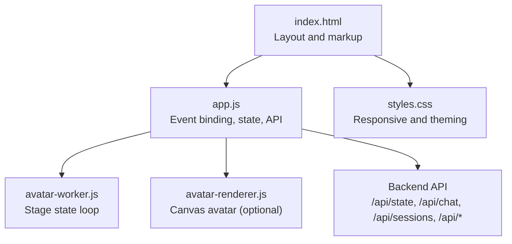
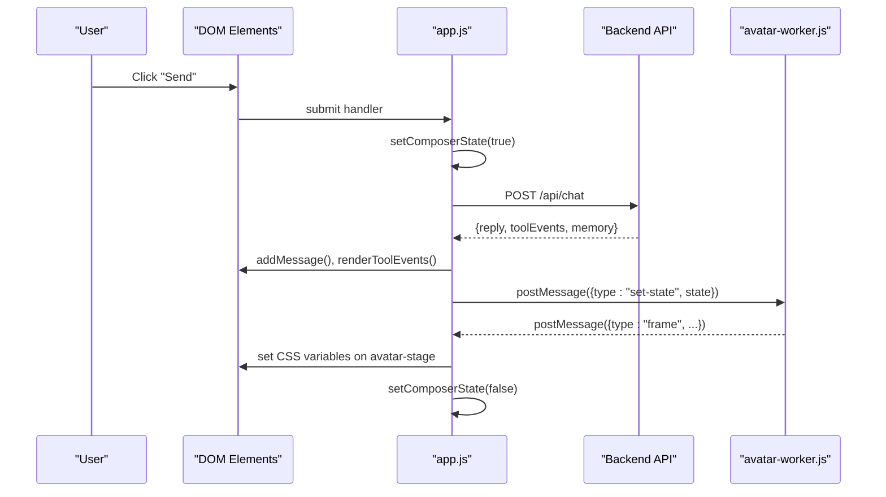
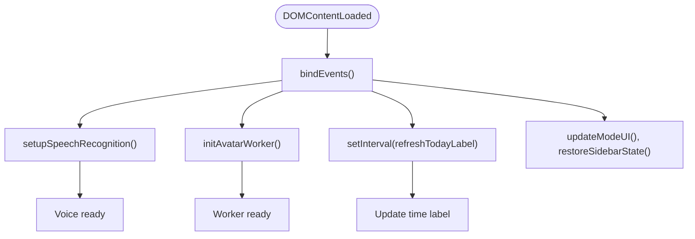
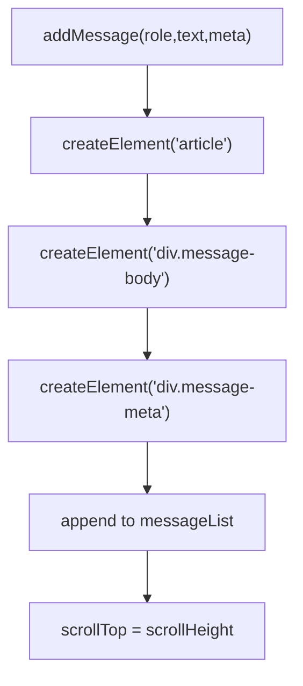
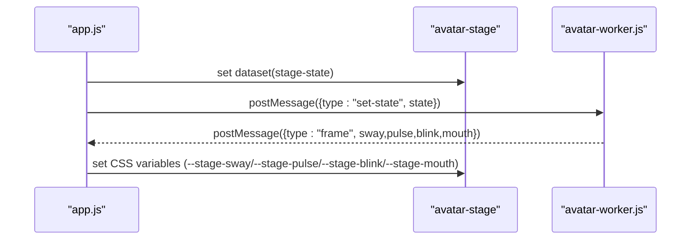
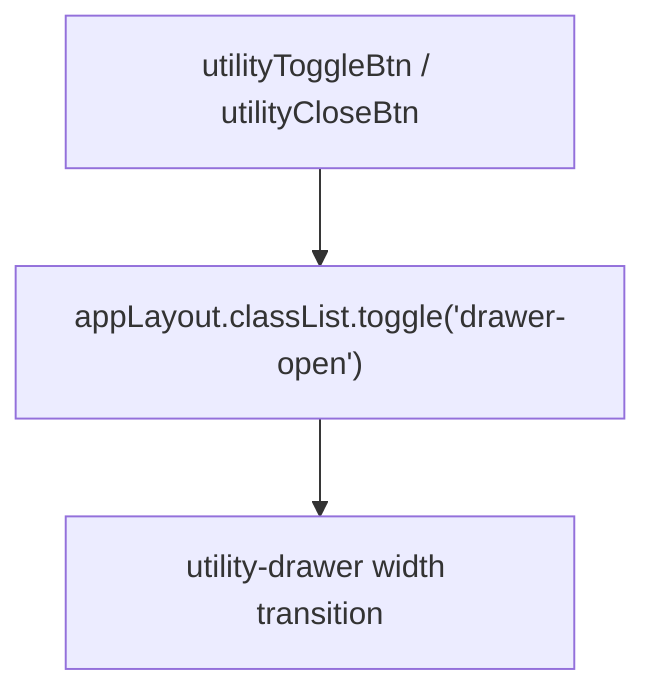
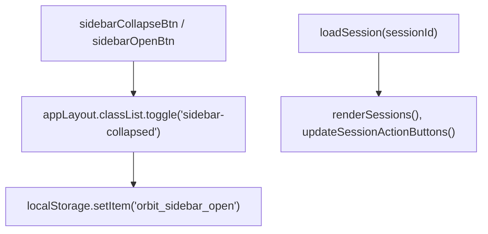
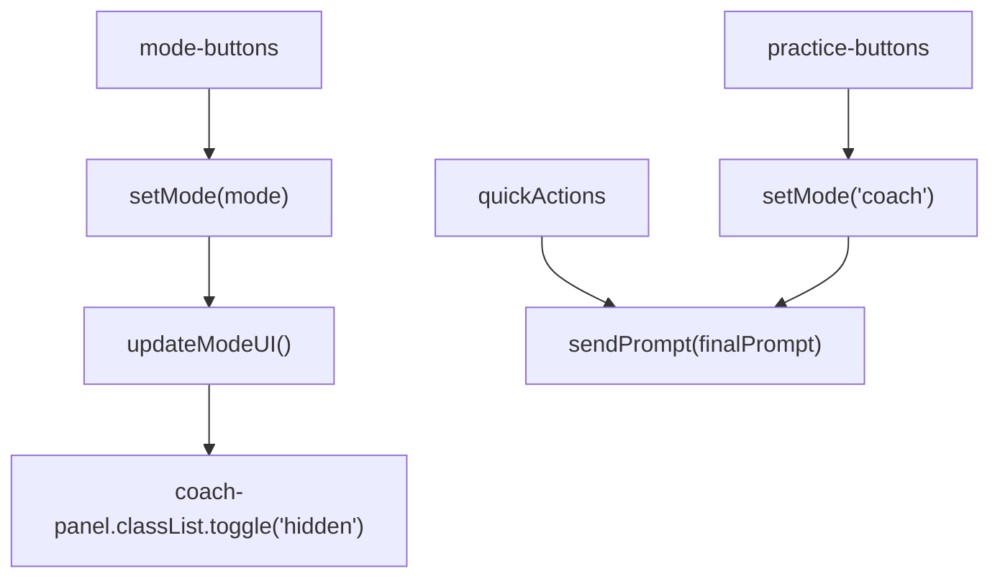
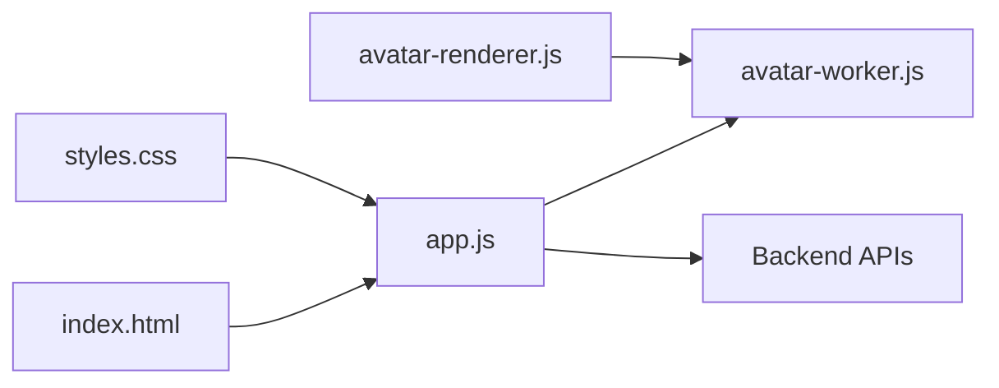

# UI Interactions

<cite>
**Referenced Files in This Document**
- [index.html](file://frontend/index.html)
- [styles.css](file://frontend/assets/styles.css)
- [app.js](file://frontend/scripts/app.js)
- [avatar-renderer.js](file://frontend/scripts/avatar-renderer.js)
- [avatar-worker.js](file://frontend/scripts/avatar-worker.js)
</cite>

## Table of Contents
1. [Introduction](#introduction)
2. [Project Structure](#project-structure)
3. [Core Components](#core-components)
4. [Architecture Overview](#architecture-overview)
5. [Detailed Component Analysis](#detailed-component-analysis)
6. [Dependency Analysis](#dependency-analysis)
7. [Performance Considerations](#performance-considerations)
8. [Troubleshooting Guide](#troubleshooting-guide)
9. [Conclusion](#conclusion)

## Introduction
This document explains the user interface interaction system for the Orbit Virtual Assistant. It covers the event handling architecture, DOM manipulation patterns, real-time UI updates, utility drawer management, sidebar controls, panel state synchronization, mode switching, quick action buttons, practice mode integration, avatar worker integration, stage state management, visual feedback systems, responsive design, accessibility, cross-browser compatibility, keyboard shortcuts, gesture controls, and alternative input methods.

## Project Structure
The UI is composed of:
- A single-page layout with a left sidebar, main chat area, and a right utility drawer.
- A modular JavaScript application that orchestrates DOM updates, state transitions, and integrations with workers and backend APIs.
- A CSS stylesheet that defines responsive layouts, animations, and theme tokens.



**Diagram sources**
- [index.html:11-338](file://frontend/index.html#L11-L338)
- [app.js:199-215](file://frontend/scripts/app.js#L199-L215)
- [avatar-worker.js:1-48](file://frontend/scripts/avatar-worker.js#L1-L48)
- [avatar-renderer.js:1-106](file://frontend/scripts/avatar-renderer.js#L1-L106)

**Section sources**
- [index.html:11-338](file://frontend/index.html#L11-L338)
- [styles.css:100-1510](file://frontend/assets/styles.css#L100-L1510)
- [app.js:199-215](file://frontend/scripts/app.js#L199-L215)

## Core Components
- Layout and containers:
  - App layout wrapper with sidebar, main chat, and utility drawer.
  - Chat header with mode switch, avatar mini, session actions, and utility toggle.
  - Coach panel visible only in Coach mode.
  - Message list and tool events display area.
  - Composer with input row, toggles, voice status, and action buttons.
- Utility drawer panels:
  - Voice settings, screen share, profile, weather, news, quick actions, knowledge lab, tasks, and memory notes.
- Avatar and stage:
  - Mini avatar with stage state attributes and CSS-driven visual feedback.
  - Avatar worker for animated stage state updates.

**Section sources**
- [index.html:14-326](file://frontend/index.html#L14-L326)
- [styles.css:886-992](file://frontend/assets/styles.css#L886-L992)
- [app.js:538-565](file://frontend/scripts/app.js#L538-L565)

## Architecture Overview
The UI follows a reactive pattern:
- DOM elements are bound to event listeners in initialization.
- Application state is centralized and mutated by handlers.
- Real-time updates are performed by appending DOM nodes, updating attributes, and toggling classes.
- Workers receive stage state commands and post frame updates for visual feedback.
- Backend APIs are invoked for chat, sessions, memory, and tool events.



**Diagram sources**
- [app.js:928-1087](file://frontend/scripts/app.js#L928-L1087)
- [avatar-worker.js:41-48](file://frontend/scripts/avatar-worker.js#L41-L48)

## Detailed Component Analysis

### Event Handling Architecture
- Initialization binds all UI events and sets up workers and timers.
- Centralized event handlers manage:
  - Mode switching, sidebar toggle, utility drawer toggle.
  - Session actions (pin/archive/delete).
  - Composer toggles (attach files, create image, thinking, web search, offline).
  - Voice input (hotkeys, mic button, speech recognition).
  - Form submissions and quick/practice actions.
  - Screen sharing and file attachments.
- Keyboard shortcuts:
  - Ctrl+M toggles Mode A (record-then-review).
  - Hold Control triggers Mode B (instant-send).
  - Enter sends messages; Shift+Enter adds new line.
  - ESC cancels Mode A recording.
- Pointer events:
  - Mic button press-and-hold for Mode B.



**Diagram sources**
- [app.js:200-215](file://frontend/scripts/app.js#L200-L215)
- [app.js:601-727](file://frontend/scripts/app.js#L601-L727)
- [app.js:538-554](file://frontend/scripts/app.js#L538-L554)

**Section sources**
- [app.js:251-490](file://frontend/scripts/app.js#L251-L490)
- [app.js:733-828](file://frontend/scripts/app.js#L733-L828)
- [app.js:830-858](file://frontend/scripts/app.js#L830-L858)

### DOM Manipulation Patterns
- Message rendering:
  - Creates article elements with body and meta, appends to message list, scrolls to bottom.
  - Supports Markdown parsing and link formatting.
- Tool events:
  - Renders small pill labels for recent tool events.
- Session navigation:
  - Renders pinned, recent, and archived sessions with active state and context menu affordances.
- Composer state:
  - Disables/enables send button and inputs while processing.
- Utility drawer:
  - Toggles open/closed class on app layout to reveal drawer.



**Diagram sources**
- [app.js:1091-1139](file://frontend/scripts/app.js#L1091-L1139)

**Section sources**
- [app.js:1091-1149](file://frontend/scripts/app.js#L1091-L1149)
- [app.js:1153-1270](file://frontend/scripts/app.js#L1153-L1270)
- [app.js:1722-1727](file://frontend/scripts/app.js#L1722-L1727)

### Real-Time UI Updates
- Stage state updates:
  - setStageState updates dataset and posts to worker; worker posts frames with sway, pulse, blink, mouth.
  - CSS variables on avatar-stage drive visual effects.
- Voice status:
  - Composer voice status and dedicated voice status element are synchronized.
- Thinking status:
  - getThinkingStatus selects status text and copy based on active modes (web search, offline, default).



**Diagram sources**
- [app.js:556-565](file://frontend/scripts/app.js#L556-L565)
- [avatar-worker.js:41-48](file://frontend/scripts/avatar-worker.js#L41-L48)

**Section sources**
- [app.js:556-565](file://frontend/scripts/app.js#L556-L565)
- [app.js:1716-1720](file://frontend/scripts/app.js#L1716-L1720)
- [styles.css:914-973](file://frontend/assets/styles.css#L914-L973)

### Utility Drawer Management
- Toggle behavior:
  - Utility toggle button and close button toggle a drawer-open class on the app layout.
- Panel visibility:
  - Voice, screen share, profile, weather, news, quick actions, knowledge lab, tasks, and memory notes panels are rendered within the drawer.
- Interaction patterns:
  - Start/stop screen share updates preview canvas and stores latest screen image.
  - Save profile, refresh weather/news, add tasks, complete tasks, add/delete notes update memory views.



**Diagram sources**
- [app.js:506-509](file://frontend/scripts/app.js#L506-L509)
- [styles.css:1007-1011](file://frontend/assets/styles.css#L1007-L1011)

**Section sources**
- [index.html:203-326](file://frontend/index.html#L203-L326)
- [app.js:466-474](file://frontend/scripts/app.js#L466-L474)
- [app.js:1655-1712](file://frontend/scripts/app.js#L1655-L1712)

### Sidebar Controls and Panel State Synchronization
- Sidebar toggle:
  - Collapses/expands sidebar and persists preference in localStorage.
- Session navigation:
  - Loads sessions, renders groups, highlights active session, and updates action button states.
- Badge/status:
  - API key status, model badge, runtime badge reflect backend state.



**Diagram sources**
- [app.js:494-504](file://frontend/scripts/app.js#L494-L504)
- [app.js:1217-1241](file://frontend/scripts/app.js#L1217-L1241)
- [app.js:1254-1270](file://frontend/scripts/app.js#L1254-L1270)

**Section sources**
- [index.html:14-56](file://frontend/index.html#L14-L56)
- [app.js:902-926](file://frontend/scripts/app.js#L902-L926)

### Mode Switching and Practice Mode Integration
- Modes:
  - Simple, Copilot, Coach.
  - Coach mode shows coach panel and updates copy text.
- Practice mode:
  - Practice buttons automatically set mode to coach and inject topic into prompts.
- Quick actions:
  - Buttons with data attributes trigger prompts; some require screen sharing.



**Diagram sources**
- [app.js:270-275](file://frontend/scripts/app.js#L270-L275)
- [app.js:579-597](file://frontend/scripts/app.js#L579-L597)
- [app.js:436-464](file://frontend/scripts/app.js#L436-L464)

**Section sources**
- [index.html:71-76](file://frontend/index.html#L71-L76)
- [index.html:115-134](file://frontend/index.html#L115-L134)
- [app.js:436-464](file://frontend/scripts/app.js#L436-L464)

### Avatar Worker Integration and Stage State Management
- Worker lifecycle:
  - Initializes worker if supported; listens for frame messages.
  - setStageState updates dataset and posts state to worker.
- Visual feedback:
  - CSS variables on avatar-stage control sway, pulse, blink, and mouth.
- Alternative renderer:
  - Canvas-based AnimeAvatar class demonstrates a separate renderer that communicates with the same worker.

```mermaid
classDiagram
class AvatarWorker {
+string stageState
+nextFrame()
+onmessage(event)
}
class AppJS {
+setStageState(state,status,copy)
+initAvatarWorker()
}
class StylesCSS {
+avatar-stage CSS variables
}
AppJS --> AvatarWorker : "postMessage/set-state"
AvatarWorker -->> AppJS : "postMessage/frame"
AppJS --> StylesCSS : "set CSS variables"
```

**Diagram sources**
- [avatar-worker.js:18-48](file://frontend/scripts/avatar-worker.js#L18-L48)
- [app.js:538-565](file://frontend/scripts/app.js#L538-L565)
- [styles.css:914-973](file://frontend/assets/styles.css#L914-L973)

**Section sources**
- [app.js:538-565](file://frontend/scripts/app.js#L538-L565)
- [avatar-renderer.js:1-106](file://frontend/scripts/avatar-renderer.js#L1-L106)

### Visual Feedback Systems
- Mic button:
  - Active state and pulsing animation indicate recording.
- Voice status:
  - Dedicated status elements show current voice state.
- Tool events:
  - Pill labels summarize recent tool usage.
- Message actions:
  - “Add to Notes” button with saved state feedback.

**Section sources**
- [styles.css:807-835](file://frontend/assets/styles.css#L807-L835)
- [styles.css:847-853](file://frontend/assets/styles.css#L847-L853)
- [app.js:1121-1139](file://frontend/scripts/app.js#L1121-L1139)

### Keyboard Shortcuts, Gesture Controls, and Alternative Inputs
- Keyboard:
  - Ctrl+M: toggle Mode A (record-then-review).
  - Hold Control: Mode B (instant-send) with delay to avoid conflicts.
  - ESC: cancel Mode A.
  - Enter: send; Shift+Enter: new line.
- Pointer:
  - Mic button press-and-hold for Mode B.
- Voice:
  - Browser speech recognition with language selection.
  - Speech synthesis for reading replies aloud.
- Screen sharing:
  - Start/stop buttons with preview canvas and periodic frame capture.

**Section sources**
- [app.js:733-828](file://frontend/scripts/app.js#L733-L828)
- [app.js:830-858](file://frontend/scripts/app.js#L830-L858)
- [app.js:1655-1712](file://frontend/scripts/app.js#L1655-L1712)

## Dependency Analysis
- app.js depends on:
  - index.html for DOM elements.
  - styles.css for layout and visual states.
  - avatar-worker.js for stage animation.
  - Backend APIs for state, chat, sessions, memory, and tools.
- avatar-renderer.js depends on:
  - avatar-worker.js for state updates.
  - Canvas context for drawing.



**Diagram sources**
- [index.html:11-338](file://frontend/index.html#L11-L338)
- [app.js:199-215](file://frontend/scripts/app.js#L199-L215)
- [avatar-renderer.js:8-29](file://frontend/scripts/avatar-renderer.js#L8-L29)

**Section sources**
- [app.js:199-215](file://frontend/scripts/app.js#L199-L215)
- [avatar-renderer.js:8-29](file://frontend/scripts/avatar-renderer.js#L8-L29)

## Performance Considerations
- Efficient DOM updates:
  - Single append per message; minimal reflows by setting scrollTop after insertion.
- Debounced voice capture:
  - Delayed start for Mode B prevents accidental activation.
- Worker-based animation:
  - Offloads stage updates to a worker to keep UI responsive.
- Conditional rendering:
  - Coach panel hidden when not in Coach mode.
- Image capture:
  - Screen frames captured at intervals and scaled to reduce bandwidth.

[No sources needed since this section provides general guidance]

## Troubleshooting Guide
- Voice input not available:
  - Check browser support and permissions; fallback UI disables mic button and updates status.
- Speech recognition errors:
  - Error handling resets state and displays status; stage returns to idle.
- Session actions fail:
  - Network errors are surfaced as system messages; UI remains consistent.
- Screen sharing:
  - Track ended events trigger cleanup; ensure permissions granted.

**Section sources**
- [app.js:601-727](file://frontend/scripts/app.js#L601-L727)
- [app.js:660-672](file://frontend/scripts/app.js#L660-L672)
- [app.js:1677-1680](file://frontend/scripts/app.js#L1677-L1680)

## Conclusion
The UI interaction system integrates a robust event-driven architecture with real-time updates, worker-based animation, and comprehensive voice/screen capabilities. It balances responsiveness across devices, provides clear visual feedback, and offers flexible input modalities. The modular design enables easy extension of modes, actions, and integrations.