# Voice Interaction

<cite>
**Referenced Files in This Document**
- [index.html](file://frontend/index.html)
- [app.js](file://frontend/scripts/app.js)
- [styles.css](file://frontend/assets/styles.css)
- [asr_whisper.py](file://backend/audio/asr_whisper.py)
- [config.py](file://backend/config.py)
- [server.py](file://backend/server.py)
- [llm_client.py](file://backend/api_clients/llm_client.py)
- [README.md](file://README.md)
</cite>

## Table of Contents
1. [Introduction](#introduction)
2. [Project Structure](#project-structure)
3. [Core Components](#core-components)
4. [Architecture Overview](#architecture-overview)
5. [Detailed Component Analysis](#detailed-component-analysis)
6. [Dependency Analysis](#dependency-analysis)
7. [Performance Considerations](#performance-considerations)
8. [Troubleshooting Guide](#troubleshooting-guide)
9. [Conclusion](#conclusion)

## Introduction
This document explains the voice interaction system implemented in the Orbit Virtual Assistant. It covers the dual-mode voice input system (Mode A: record-then-review, Mode B: push-to-talk), speech recognition setup, voice transcription handling, the voice state machine, microphone controls, real-time voice feedback, voice language configuration, browser compatibility handling, fallback mechanisms, the voice-to-text conversion pipeline, live transcript updates, voice message composition, voice input timing, interruption handling, and user experience patterns.

## Project Structure
The voice interaction spans the frontend and backend:
- Frontend: HTML UI, JavaScript logic for speech recognition, microphone controls, live transcript updates, and voice language configuration.
- Backend: HTTP server, API endpoints, and LLM orchestration. The current implementation uses the browser’s SpeechRecognition API for voice input; a Whisper-based ASR service is present as a future extension.

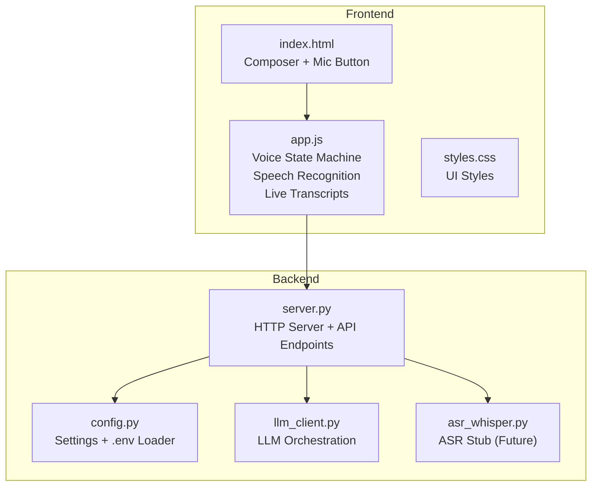

**Diagram sources**
- [index.html:170-200](file://frontend/index.html#L170-L200)
- [app.js:601-727](file://frontend/scripts/app.js#L601-L727)
- [server.py:67-83](file://backend/server.py#L67-L83)
- [config.py:55-76](file://backend/config.py#L55-L76)
- [llm_client.py:38-78](file://backend/api_clients/llm_client.py#L38-L78)
- [asr_whisper.py:10-19](file://backend/audio/asr_whisper.py#L10-L19)

**Section sources**
- [README.md:42-47](file://README.md#L42-L47)
- [index.html:170-200](file://frontend/index.html#L170-L200)
- [app.js:601-727](file://frontend/scripts/app.js#L601-L727)
- [server.py:67-83](file://backend/server.py#L67-L83)

## Core Components
- Voice state machine: Tracks listening, recognition starting, mode A/B activation, and UI state transitions.
- Speech recognition setup: Initializes SpeechRecognition with continuous, interim results and language resolution.
- Microphone controls: Keyboard shortcuts (Ctrl+M for Mode A, Control hold for Mode B), pointer events for mic button.
- Real-time voice feedback: Updates mic button state, composer voice status, and avatar stage state.
- Voice language configuration: Dropdown with “Browser default” and multiple locales; resolves to browser language or explicit selection.
- Browser compatibility handling: Detects SpeechRecognition availability and disables UI accordingly.
- Voice-to-text pipeline: Transcription updates live; Mode A keeps transcript in textarea; Mode B auto-sends.
- Voice message composition: Creates user turns, stores messages, and sends to backend chat endpoint.

**Section sources**
- [app.js:56-85](file://frontend/scripts/app.js#L56-L85)
- [app.js:601-727](file://frontend/scripts/app.js#L601-L727)
- [app.js:733-828](file://frontend/scripts/app.js#L733-L828)
- [app.js:830-858](file://frontend/scripts/app.js#L830-L858)
- [app.js:860-898](file://frontend/scripts/app.js#L860-L898)
- [index.html:213-223](file://frontend/index.html#L213-L223)

## Architecture Overview
The voice interaction follows a browser-first design:
- The frontend initializes SpeechRecognition and manages the voice state machine.
- Transcripts are either reviewed (Mode A) or auto-sent (Mode B).
- The backend receives the message via /api/chat and orchestrates tools and LLM responses.

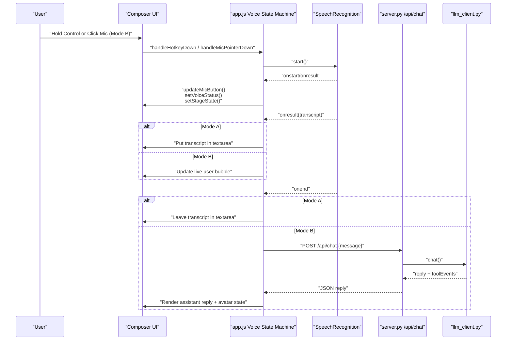

**Diagram sources**
- [app.js:601-727](file://frontend/scripts/app.js#L601-L727)
- [app.js:733-828](file://frontend/scripts/app.js#L733-L828)
- [server.py:211-321](file://backend/server.py#L211-L321)
- [llm_client.py:47-78](file://backend/api_clients/llm_client.py#L47-L78)

## Detailed Component Analysis

### Voice State Machine
The state machine tracks:
- Speech support availability
- Listening and recognition starting states
- Mode A/B flags
- Live transcript buffer
- Mic held and hotkey states
- Silence timeout handling

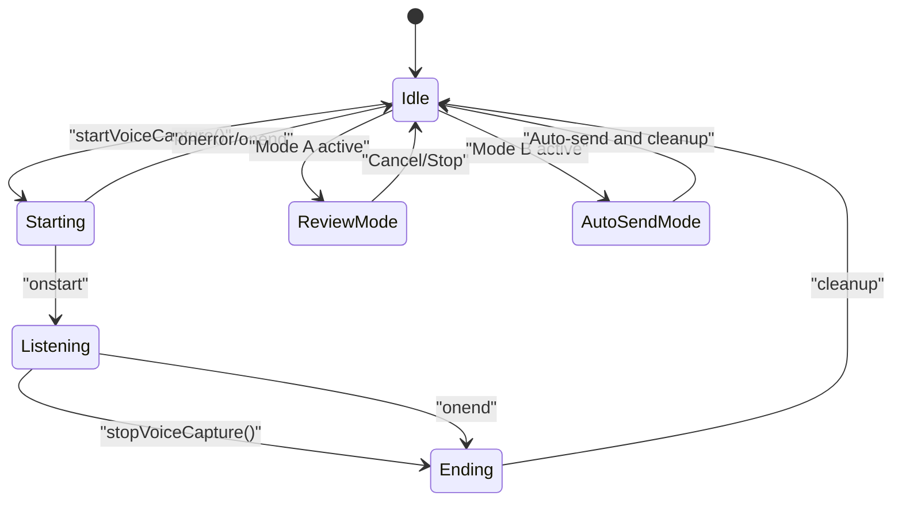

**Diagram sources**
- [app.js:56-85](file://frontend/scripts/app.js#L56-L85)
- [app.js:601-727](file://frontend/scripts/app.js#L601-L727)
- [app.js:830-858](file://frontend/scripts/app.js#L830-L858)

**Section sources**
- [app.js:56-85](file://frontend/scripts/app.js#L56-L85)
- [app.js:601-727](file://frontend/scripts/app.js#L601-L727)

### Speech Recognition Setup and Language Resolution
- Initializes SpeechRecognition with continuous and interim results.
- Resolves language from dropdown or browser default.
- Handles errors and end-of-recognition cleanup.

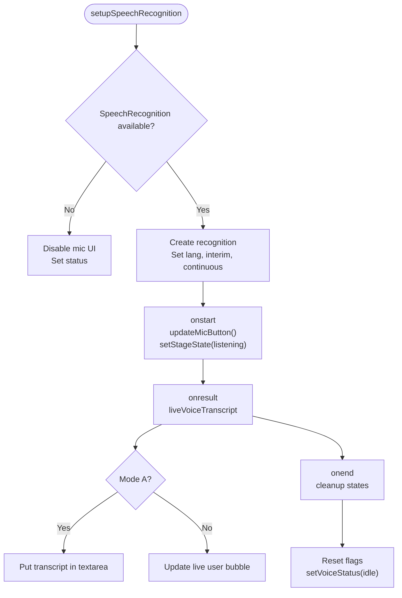

**Diagram sources**
- [app.js:601-727](file://frontend/scripts/app.js#L601-L727)
- [app.js:860-864](file://frontend/scripts/app.js#L860-L864)

**Section sources**
- [app.js:601-727](file://frontend/scripts/app.js#L601-L727)
- [app.js:860-864](file://frontend/scripts/app.js#L860-L864)

### Microphone Controls and Hotkeys
- Keyboard:
  - Ctrl+M toggles Mode A (record-then-review).
  - Control key hold triggers delayed Mode B (push-to-talk) with a 200 ms debounce to avoid conflicts with Ctrl+M.
  - ESC cancels Mode A recording.
- Pointer events:
  - Mic button click-and-hold triggers Mode B.
  - Pointer up stops capture.

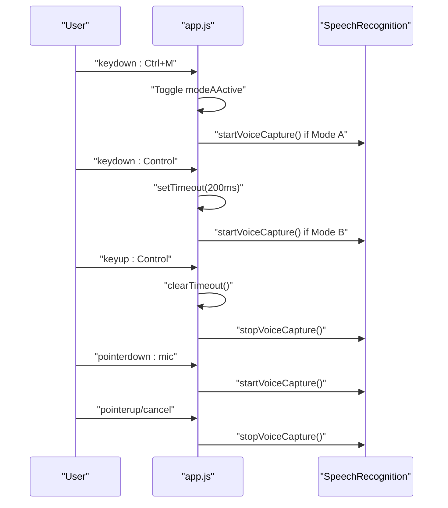

**Diagram sources**
- [app.js:733-828](file://frontend/scripts/app.js#L733-L828)
- [app.js:810-822](file://frontend/scripts/app.js#L810-L822)

**Section sources**
- [app.js:733-828](file://frontend/scripts/app.js#L733-L828)
- [app.js:810-822](file://frontend/scripts/app.js#L810-L822)

### Real-Time Voice Feedback and UI Updates
- Mic button toggles active state and updates title.
- Composer voice status shows current state.
- Avatar stage state reflects listening/thinking/speaking/idle.

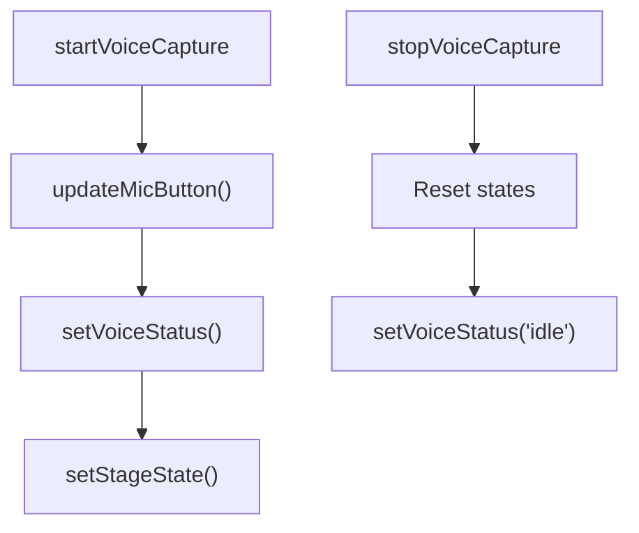

**Diagram sources**
- [app.js:866-898](file://frontend/scripts/app.js#L866-L898)
- [app.js:556-565](file://frontend/scripts/app.js#L556-L565)

**Section sources**
- [app.js:866-898](file://frontend/scripts/app.js#L866-L898)
- [app.js:556-565](file://frontend/scripts/app.js#L556-L565)

### Voice Language Configuration and Browser Compatibility
- Language options include “Browser default” and multiple locales.
- Dropdown selection updates recognition language and persists to localStorage.
- If SpeechRecognition is unavailable, mic is disabled and status indicates lack of support.

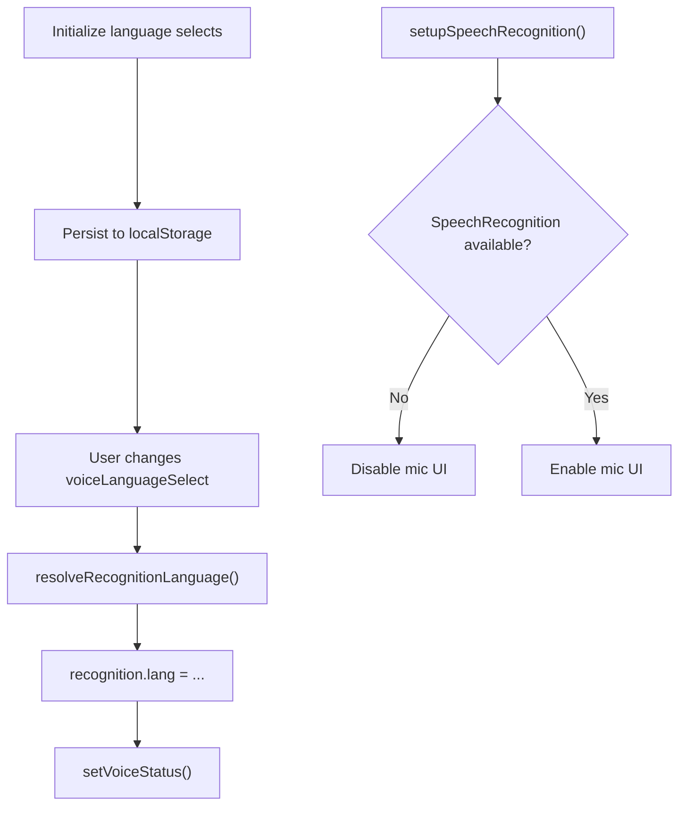

**Diagram sources**
- [app.js:6-19](file://frontend/scripts/app.js#L6-L19)
- [app.js:217-247](file://frontend/scripts/app.js#L217-L247)
- [app.js:257-263](file://frontend/scripts/app.js#L257-L263)
- [app.js:601-609](file://frontend/scripts/app.js#L601-L609)

**Section sources**
- [app.js:6-19](file://frontend/scripts/app.js#L6-L19)
- [app.js:217-247](file://frontend/scripts/app.js#L217-L247)
- [app.js:257-263](file://frontend/scripts/app.js#L257-L263)
- [app.js:601-609](file://frontend/scripts/app.js#L601-L609)

### Voice-to-Text Conversion Pipeline and Live Transcript Updates
- Continuous interim results update the live transcript buffer.
- Mode A: transcript appears in textarea for review.
- Mode B: transcript updates the live user bubble and triggers auto-send.

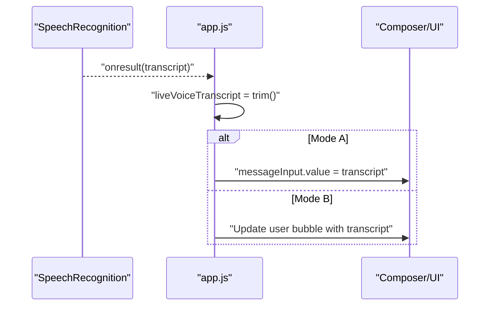

**Diagram sources**
- [app.js:636-658](file://frontend/scripts/app.js#L636-L658)

**Section sources**
- [app.js:636-658](file://frontend/scripts/app.js#L636-L658)

### Voice Message Composition and Backend Integration
- Mode A: transcript remains in textarea; Enter sends the message.
- Mode B: transcript becomes the user message and is sent to /api/chat.
- Backend responds with reply and tool events; assistant reply renders and avatar state updates.

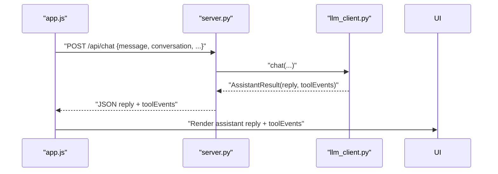

**Diagram sources**
- [app.js:928-1087](file://frontend/scripts/app.js#L928-L1087)
- [server.py:211-321](file://backend/server.py#L211-L321)
- [llm_client.py:47-78](file://backend/api_clients/llm_client.py#L47-L78)

**Section sources**
- [app.js:928-1087](file://frontend/scripts/app.js#L928-L1087)
- [server.py:211-321](file://backend/server.py#L211-L321)
- [llm_client.py:47-78](file://backend/api_clients/llm_client.py#L47-L78)

### Voice Input Timing and Interruption Handling
- Delayed Mode B: 200 ms debounce prevents accidental Mode A/Mode B conflicts.
- Window blur clears timers and stops voice capture.
- ESC cancels Mode A recording and clears transcript.

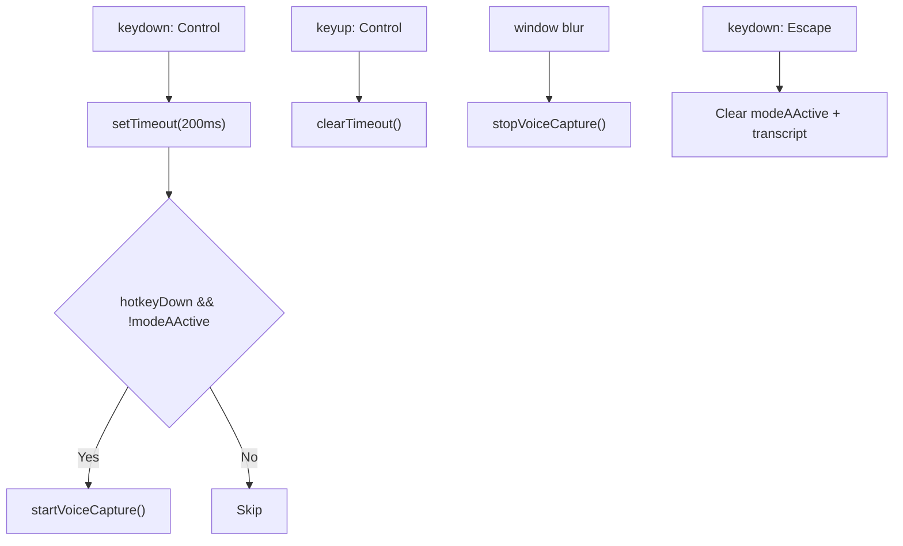

**Diagram sources**
- [app.js:777-808](file://frontend/scripts/app.js#L777-L808)
- [app.js:475-489](file://frontend/scripts/app.js#L475-L489)
- [app.js:762-775](file://frontend/scripts/app.js#L762-L775)

**Section sources**
- [app.js:777-808](file://frontend/scripts/app.js#L777-L808)
- [app.js:475-489](file://frontend/scripts/app.js#L475-L489)
- [app.js:762-775](file://frontend/scripts/app.js#L762-L775)

### User Experience Patterns
- Mode A (Ctrl+M): Ideal for accuracy; user reviews and edits before sending.
- Mode B (Hold Control or Mic): Instant feedback; suitable for quick responses.
- Visual feedback: Mic button active state, composer voice status, avatar stage state.
- Language selection: “Browser default” aligns with user locale; explicit selection overrides.

**Section sources**
- [README.md:44-46](file://README.md#L44-L46)
- [app.js:866-898](file://frontend/scripts/app.js#L866-L898)
- [index.html:213-223](file://frontend/index.html#L213-L223)

## Dependency Analysis
- Frontend depends on:
  - SpeechRecognition API for voice input.
  - LocalStorage for persisted language preferences.
  - UI elements for mic button, voice status, and avatar stage.
- Backend depends on:
  - HTTP server for API endpoints.
  - LLM client for chat orchestration.
  - Settings for provider configuration.

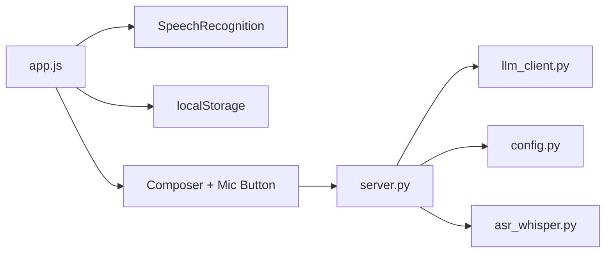

**Diagram sources**
- [app.js:601-727](file://frontend/scripts/app.js#L601-L727)
- [server.py:67-83](file://backend/server.py#L67-L83)
- [llm_client.py:38-78](file://backend/api_clients/llm_client.py#L38-L78)
- [config.py:55-76](file://backend/config.py#L55-L76)
- [asr_whisper.py:10-19](file://backend/audio/asr_whisper.py#L10-L19)

**Section sources**
- [app.js:601-727](file://frontend/scripts/app.js#L601-L727)
- [server.py:67-83](file://backend/server.py#L67-L83)
- [llm_client.py:38-78](file://backend/api_clients/llm_client.py#L38-L78)
- [config.py:55-76](file://backend/config.py#L55-L76)
- [asr_whisper.py:10-19](file://backend/audio/asr_whisper.py#L10-L19)

## Performance Considerations
- Continuous speech recognition increases CPU usage; disable when not needed.
- Interim results improve responsiveness; ensure UI updates are efficient.
- Debounce Mode B to prevent accidental triggers.
- Keep transcripts trimmed and avoid excessive DOM updates.

## Troubleshooting Guide
- SpeechRecognition unavailable:
  - Symptom: Mic disabled, status indicates lack of support.
  - Action: Use a compatible browser or enable speech recognition permissions.
- Voice input error:
  - Symptom: Error status shown; recognition stops.
  - Action: Check browser permissions and network connectivity; retry.
- Mode A/Mode B conflicts:
  - Symptom: Unexpected behavior when pressing Ctrl+M and Control simultaneously.
  - Action: Use ESC to cancel Mode A; wait for debounce before switching modes.
- Live transcript not updating:
  - Symptom: Mic active but no text in textarea or bubble.
  - Action: Verify language selection and browser language; ensure microphone is permitted.

**Section sources**
- [app.js:601-609](file://frontend/scripts/app.js#L601-L609)
- [app.js:660-672](file://frontend/scripts/app.js#L660-L672)
- [app.js:777-789](file://frontend/scripts/app.js#L777-L789)
- [app.js:636-658](file://frontend/scripts/app.js#L636-L658)

## Conclusion
The voice interaction system provides a robust dual-mode experience: Mode A for careful review and Mode B for immediate response. It integrates browser SpeechRecognition, maintains a clear voice state machine, and feeds transcripts into the chat pipeline seamlessly. While the current implementation relies on the browser’s speech recognition, the backend includes a placeholder for Whisper-based ASR, enabling future enhancements without disrupting the existing frontend behavior.