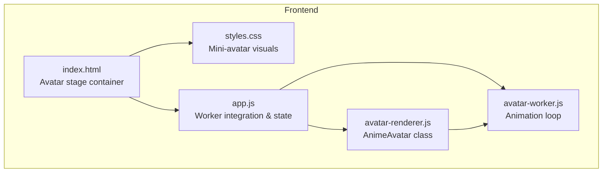
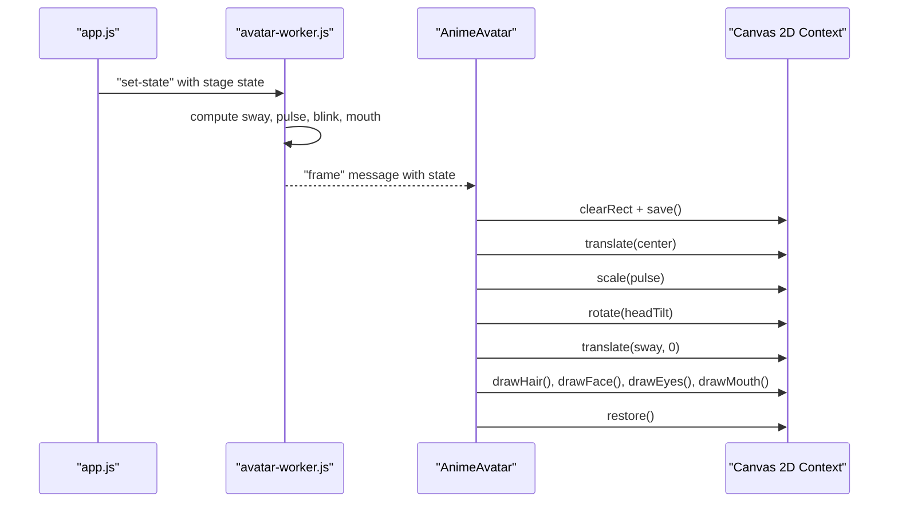
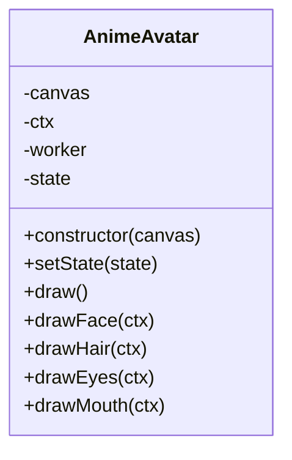
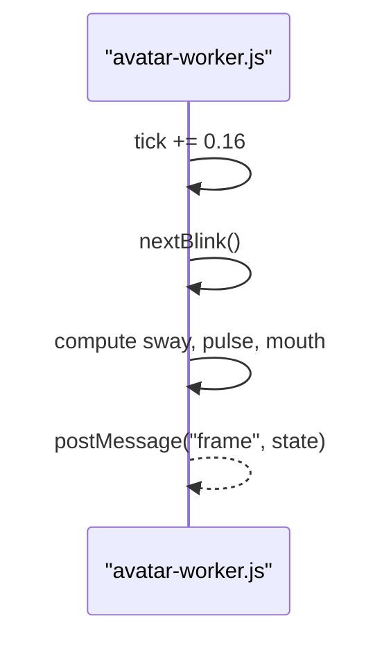
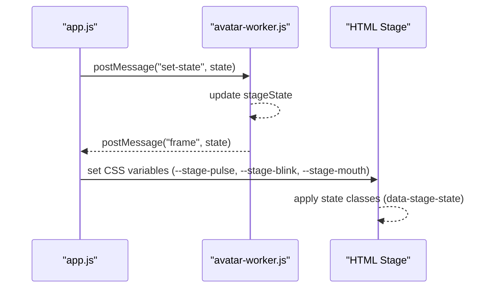
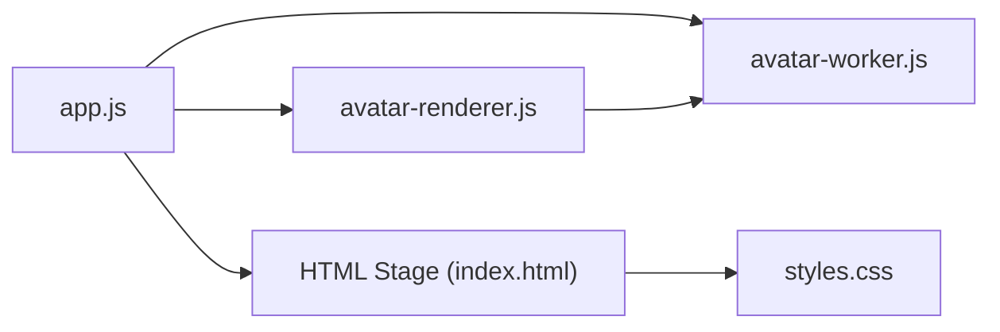

# Avatar Renderer

<cite>
**Referenced Files in This Document**
- [avatar-renderer.js](file://frontend/scripts/avatar-renderer.js)
- [avatar-worker.js](file://frontend/scripts/avatar-worker.js)
- [app.js](file://frontend/scripts/app.js)
- [index.html](file://frontend/index.html)
- [styles.css](file://frontend/assets/styles.css)
</cite>

## Table of Contents
1. [Introduction](#introduction)
2. [Project Structure](#project-structure)
3. [Core Components](#core-components)
4. [Architecture Overview](#architecture-overview)
5. [Detailed Component Analysis](#detailed-component-analysis)
6. [Dependency Analysis](#dependency-analysis)
7. [Performance Considerations](#performance-considerations)
8. [Troubleshooting Guide](#troubleshooting-guide)
9. [Conclusion](#conclusion)

## Introduction
This document describes the avatar renderer component responsible for animating and drawing a stylized character on a canvas. It covers the AnimeAvatar class implementation, the worker-driven animation loop, and the rendering pipeline that draws the face, hair, eyes, and mouth. It explains coordinate system transformations, breathing and head motion effects, and the state properties that drive visual behavior. It also provides examples of state transitions, animation timing, and practical guidance for browser compatibility and performance.

## Project Structure
The avatar rendering system consists of:
- Canvas-based renderer: AnimeAvatar class that performs drawing operations on a 2D context.
- Animation worker: avatar-worker.js that computes per-frame state and posts updates to the renderer.
- UI integration: app.js wires the worker to the UI and sets stage state based on user actions.
- HTML and CSS: index.html and styles.css define the avatar stage and mini-avatar visuals.

**Diagram sources**
- [index.html:80-93](file://frontend/index.html#L80-L93)
- [styles.css:886-993](file://frontend/assets/styles.css#L886-L993)
- [app.js:538-554](file://frontend/scripts/app.js#L538-L554)
- [avatar-renderer.js:3-29](file://frontend/scripts/avatar-renderer.js#L3-L29)
- [avatar-worker.js:1-48](file://frontend/scripts/avatar-worker.js#L1-L48)

**Section sources**
- [index.html:80-93](file://frontend/index.html#L80-L93)
- [styles.css:886-993](file://frontend/assets/styles.css#L886-L993)
- [app.js:538-554](file://frontend/scripts/app.js#L538-L554)
- [avatar-renderer.js:3-29](file://frontend/scripts/avatar-renderer.js#L3-L29)
- [avatar-worker.js:1-48](file://frontend/scripts/avatar-worker.js#L1-L48)

## Core Components
- AnimeAvatar: Canvas-based renderer that draws the avatar and applies transformations for breathing, head tilt, and horizontal sway.
- avatar-worker.js: Dedicated animation loop that computes sway, pulse, blink, and mouth openness based on stage state.
- app.js: Integrates the worker with the UI, sets stage state (idle, thinking, listening, speaking), and updates CSS variables for the mini-avatar.

Key responsibilities:
- Coordinate transforms: center translation, uniform scaling for breathing, rotation for head tilt, and horizontal translation for sway.
- Component drawing: face (circle), hair (quadratic curves), eyes (ellipses), and mouth (half ellipse stroke).
- State-driven animation: worker updates state, renderer redraws each frame.

**Section sources**
- [avatar-renderer.js:3-106](file://frontend/scripts/avatar-renderer.js#L3-L106)
- [avatar-worker.js:1-48](file://frontend/scripts/avatar-worker.js#L1-L48)
- [app.js:538-565](file://frontend/scripts/app.js#L538-L565)

## Architecture Overview
The rendering pipeline runs on a worker thread to keep UI responsive. The main thread sends state changes to the worker, which computes per-frame values and posts them back. The renderer consumes these values and redraws the avatar on the canvas.

**Diagram sources**
- [app.js:538-565](file://frontend/scripts/app.js#L538-L565)
- [avatar-worker.js:18-39](file://frontend/scripts/avatar-worker.js#L18-L39)
- [avatar-renderer.js:31-55](file://frontend/scripts/avatar-renderer.js#L31-L55)

## Detailed Component Analysis

### AnimeAvatar Class
The AnimeAvatar class encapsulates:
- Canvas and 2D context management.
- Worker communication for receiving animated state.
- Drawing methods for each avatar component.
- Transform stack manipulation for centering, breathing, head tilt, and sway.

Coordinate system and transformations:
- Center translation to place the avatar at the canvas center.
- Uniform scaling around the center to simulate breathing.
- Rotation around the center to tilt the head.
- Horizontal translation to sway the head left/right.

Rendering order:
- Hair first (background), then face, then eyes, then mouth (foreground).

State properties and visual impact:
- sway: Horizontal offset affecting head position.
- headTilt: Angle in degrees for head tilt.
- hairSway: Additional vertical offset influencing hair shape.
- pulse: Uniform scale factor for breathing effect.
- mouth: Openness factor controlling mouth ellipse height.
- eyeOpen: Vertical scale factor for eye ellipses.

Drawing methods:
- drawFace: Fills a circle for the face.
- drawHair: Draws a stylized hairstyle using quadratic curves.
- drawEyes: Draws two symmetric ellipses for eyes.
- drawMouth: Strokes a half-ellipse for the mouth.

Color schemes and geometry:
- Face: Skin tone color.
- Hair: Dark color.
- Eyes: Black.
- Mouth: Muted red tone.

**Section sources**
- [avatar-renderer.js:3-106](file://frontend/scripts/avatar-renderer.js#L3-L106)

#### Class Diagram

**Diagram sources**
- [avatar-renderer.js:3-29](file://frontend/scripts/avatar-renderer.js#L3-L29)

### Animation Worker
The worker maintains:
- stageState: Current stage ("idle", "thinking", "listening", "speaking").
- tick: Accumulated time for oscillators.
- blinkFrame and blinkCooldown: Blink timing and cooldown.
- nextBlink(): Updates blink state with randomized cooldown.
- nextFrame(): Computes sway, pulse, mouth openness, and posts a "frame" message.

Timing and oscillators:
- sway: Sinusoidal horizontal motion.
- pulse: Base breathing rate varies by stage, modulated by a slower sine wave.
- mouth: Openness increases during speaking, remains low during listening, minimal otherwise.
- blink: Alternates between open and closed frames with randomized cooldown.

Worker interval:
- nextFrame() is invoked periodically to produce smooth animation.

**Section sources**
- [avatar-worker.js:1-48](file://frontend/scripts/avatar-worker.js#L1-L48)

#### Sequence Diagram: Worker Frame Loop

**Diagram sources**
- [avatar-worker.js:18-39](file://frontend/scripts/avatar-worker.js#L18-L39)

### UI Integration and Mini-Avatar
The main thread integrates the worker with the UI:
- initAvatarWorker(): Creates a worker and listens for "frame" messages.
- setStageState(): Sets dataset state on the avatar stage element and posts state to the worker.
- CSS variables: The worker’s state updates CSS variables on the stage element to animate the mini-avatar visuals.

Mini-avatar visuals:
- Aura and core scale with pulse.
- Blink and mouth openness controlled by CSS variables.
- Stage state classes change appearance for different modes.

**Section sources**
- [app.js:538-565](file://frontend/scripts/app.js#L538-L565)
- [styles.css:886-993](file://frontend/assets/styles.css#L886-L993)
- [index.html:80-93](file://frontend/index.html#L80-L93)

#### Sequence Diagram: Stage State Transitions

**Diagram sources**
- [app.js:538-565](file://frontend/scripts/app.js#L538-L565)
- [avatar-worker.js:41-46](file://frontend/scripts/avatar-worker.js#L41-L46)
- [styles.css:979-990](file://frontend/assets/styles.css#L979-L990)

### Rendering Pipeline Details

#### Face Drawing
- Geometry: Circle centered at origin with a fixed radius.
- Color: Skin tone fill.

Complexity: O(1) draw call; negligible cost.

**Section sources**
- [avatar-renderer.js:57-63](file://frontend/scripts/avatar-renderer.js#L57-L63)

#### Hair Styling
- Geometry: Quadratic Bézier curves forming an asymmetrical arc and a central peak influenced by hairSway.
- Color: Dark color fill.

Complexity: O(1) draw call; moderate cost due to curve calculations.

**Section sources**
- [avatar-renderer.js:65-74](file://frontend/scripts/avatar-renderer.js#L65-L74)

#### Eye Animation
- Geometry: Two ellipses positioned symmetrically around the center.
- eyeOpen scales vertical radius to simulate blinking.

Complexity: O(1) draw call; negligible cost.

**Section sources**
- [avatar-renderer.js:76-93](file://frontend/scripts/avatar-renderer.js#L76-L93)

#### Mouth Movement
- Geometry: Half-ellipse stroke for the mouth.
- openness derived from state.mouth.

Complexity: O(1) draw call; negligible cost.

**Section sources**
- [avatar-renderer.js:95-105](file://frontend/scripts/avatar-renderer.js#L95-L105)

### Coordinate System and Transformations
- Center translation: Places the avatar at the canvas center.
- Breathing scale: Uniformly scales the avatar to simulate breathing.
- Head tilt: Rotates around the center to tilt the head.
- Sway: Translates horizontally to sway the head left/right.

Order of operations:
1. Translate to center.
2. Scale for breathing.
3. Rotate for head tilt.
4. Translate for sway.
5. Draw components in order (hair, face, eyes, mouth).

This preserves local coordinate consistency for each component while applying global transformations.

**Section sources**
- [avatar-renderer.js:31-55](file://frontend/scripts/avatar-renderer.js#L31-L55)

## Dependency Analysis
- app.js depends on avatar-worker.js for animation state and on the DOM stage element for CSS variable updates.
- AnimeAvatar depends on avatar-worker.js for state updates and on the canvas 2D context for drawing.
- Styles depend on app.js setting CSS variables and dataset attributes to reflect stage state.

**Diagram sources**
- [app.js:538-565](file://frontend/scripts/app.js#L538-L565)
- [avatar-renderer.js:3-29](file://frontend/scripts/avatar-renderer.js#L3-L29)
- [avatar-worker.js:1-48](file://frontend/scripts/avatar-worker.js#L1-L48)
- [index.html:80-93](file://frontend/index.html#L80-L93)
- [styles.css:886-993](file://frontend/assets/styles.css#L886-L993)

**Section sources**
- [app.js:538-565](file://frontend/scripts/app.js#L538-L565)
- [avatar-renderer.js:3-29](file://frontend/scripts/avatar-renderer.js#L3-L29)
- [avatar-worker.js:1-48](file://frontend/scripts/avatar-worker.js#L1-L48)
- [index.html:80-93](file://frontend/index.html#L80-L93)
- [styles.css:886-993](file://frontend/assets/styles.css#L886-L993)

## Performance Considerations
- Offload animation to a worker: Keeps UI responsive and avoids blocking the main thread.
- Minimal redraw cost: Each frame clears the canvas and redraws a small set of simple shapes.
- Efficient transforms: Translation and rotation are inexpensive; uniform scaling is cheap.
- Avoid unnecessary reflows: The renderer saves/restores the context to minimize state churn.
- Timing: The worker runs at a fixed interval; adjust interval length to balance smoothness and CPU usage.
- Canvas sizing: Ensure the canvas resolution matches display size to avoid scaling overhead.

[No sources needed since this section provides general guidance]

## Troubleshooting Guide
Common issues and resolutions:
- No Web Worker support: The app detects missing worker support and updates the runtime badge. Ensure the environment supports Web Workers.
- No animation: Verify the worker is created and receives "set-state" messages. Confirm the worker posts "frame" messages and the renderer consumes them.
- Mini-avatar not updating: Check that CSS variables are being set on the stage element and that state classes are applied.
- Canvas not visible: Ensure the canvas element exists and is sized appropriately; confirm the renderer is bound to the correct canvas.
- Stuttery animation: Adjust the worker interval or reduce the number of DOM updates; verify no heavy synchronous operations occur on the main thread.

**Section sources**
- [app.js:538-554](file://frontend/scripts/app.js#L538-L554)
- [avatar-worker.js:1-48](file://frontend/scripts/avatar-worker.js#L1-L48)
- [avatar-renderer.js:3-29](file://frontend/scripts/avatar-renderer.js#L3-L29)

## Conclusion
The avatar renderer combines a worker-driven animation loop with a canvas-based drawing pipeline to deliver smooth, state-aware animations. The AnimeAvatar class cleanly separates concerns between state computation and rendering, while the UI integration ensures visual feedback across different stages. By leveraging transforms and simple geometric primitives, the system achieves efficient, scalable rendering suitable for real-time interaction.