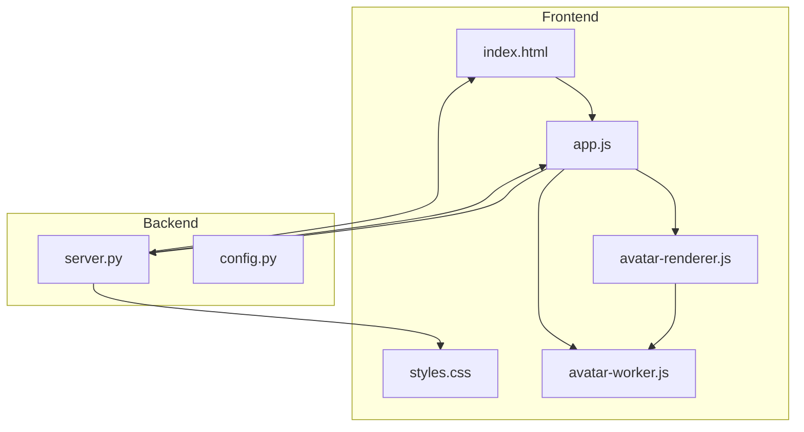
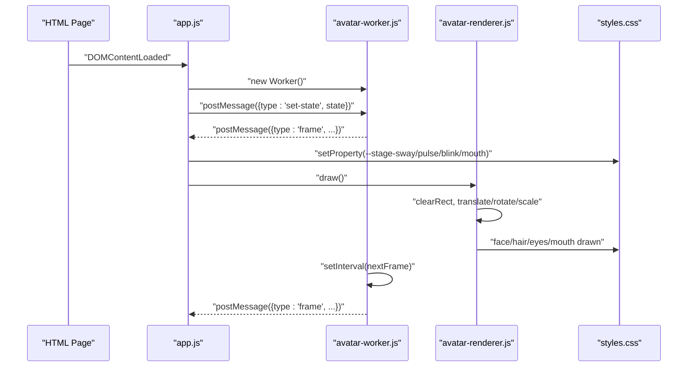
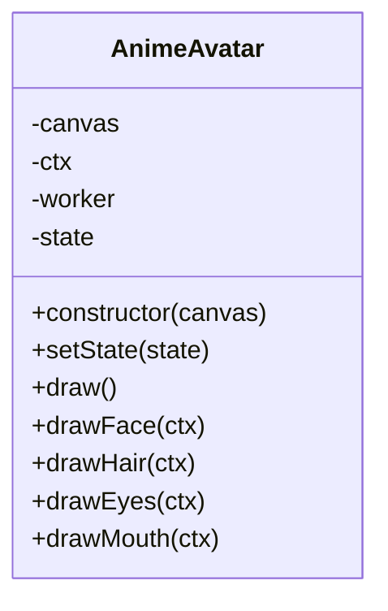
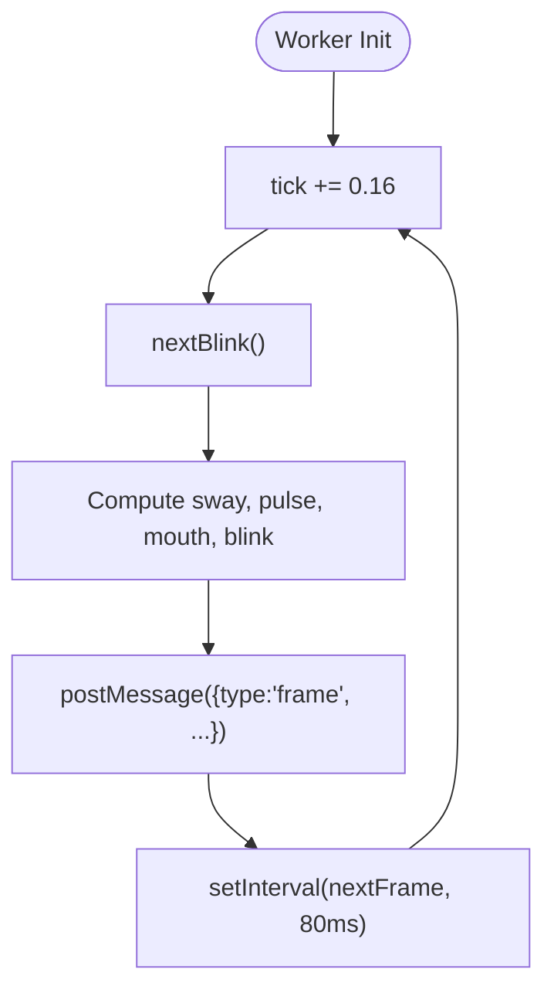
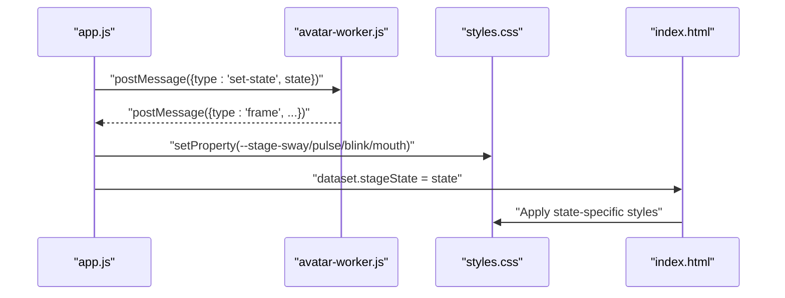
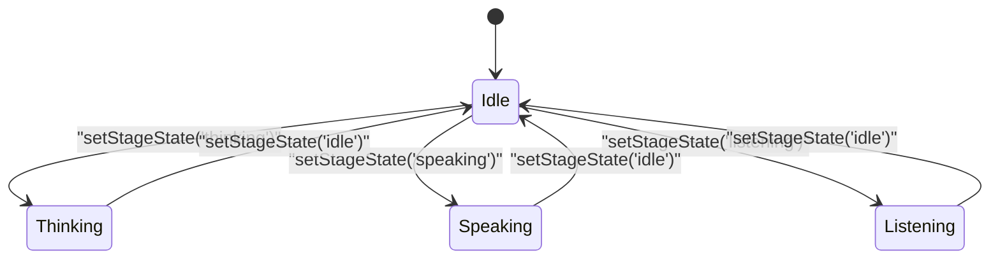
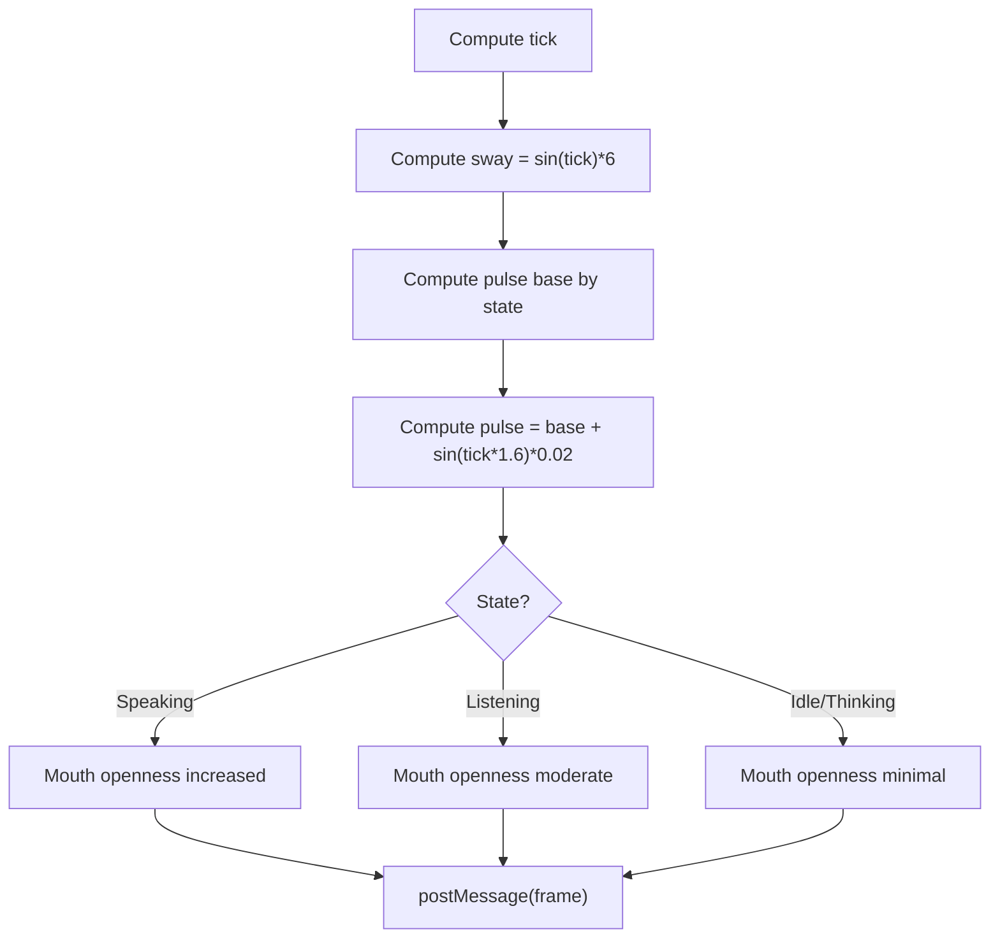
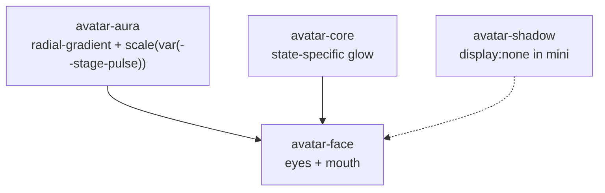
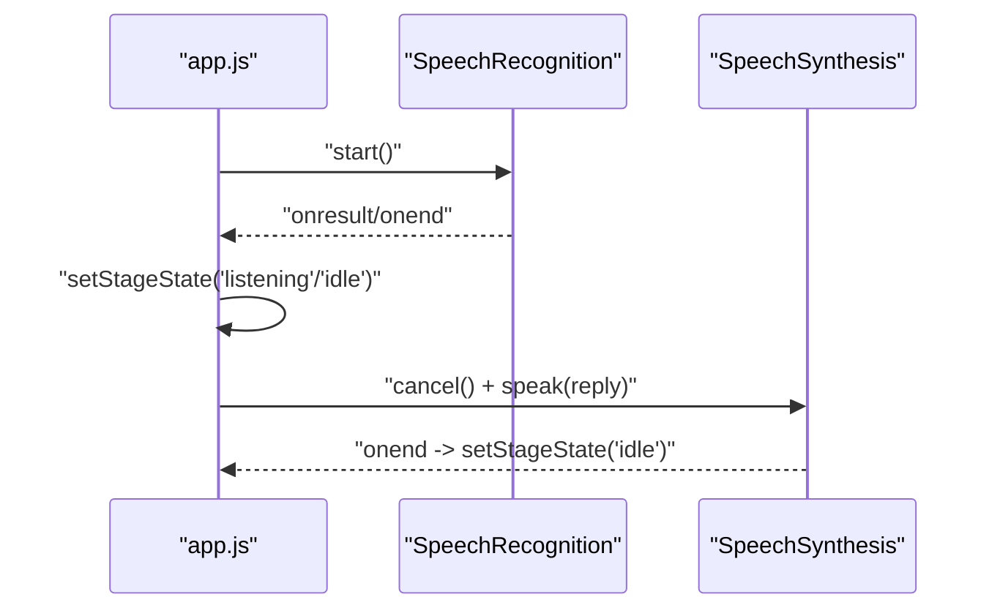
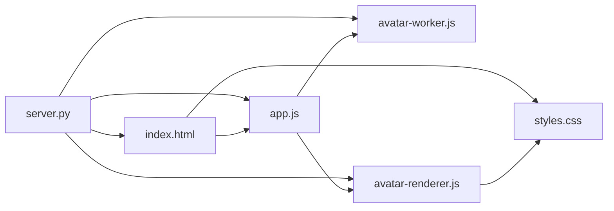

# Avatar System

<cite>
**Referenced Files in This Document**
- [avatar-renderer.js](file://frontend/scripts/avatar-renderer.js)
- [avatar-worker.js](file://frontend/scripts/avatar-worker.js)
- [app.js](file://frontend/scripts/app.js)
- [index.html](file://frontend/index.html)
- [styles.css](file://frontend/assets/styles.css)
- [server.py](file://backend/server.py)
- [config.py](file://backend/config.py)
</cite>

## Table of Contents
1. [Introduction](#introduction)
2. [Project Structure](#project-structure)
3. [Core Components](#core-components)
4. [Architecture Overview](#architecture-overview)
5. [Detailed Component Analysis](#detailed-component-analysis)
6. [Dependency Analysis](#dependency-analysis)
7. [Performance Considerations](#performance-considerations)
8. [Troubleshooting Guide](#troubleshooting-guide)
9. [Conclusion](#conclusion)
10. [Appendices](#appendices)

## Introduction
This document describes the avatar system that powers a virtual assistant’s animated face and body movements. The system uses a canvas-based renderer and a Web Worker to compute animation states off the main thread, enabling smooth real-time feedback for avatar states such as idle, thinking, speaking, and listening. It integrates with speech synthesis and microphone input to reflect live state changes, and renders visual effects like aura and shadow via CSS variables and transitions.

## Project Structure
The avatar system spans the frontend and backend:
- Frontend: HTML page defines the avatar stage and mini avatar; CSS applies visual feedback; JavaScript handles initialization, state updates, and Web Worker communication; two specialized scripts implement the renderer and worker.
- Backend: Serves static assets and exposes REST endpoints used by the frontend.

**Diagram sources**
- [index.html:1-338](file://frontend/index.html#L1-L338)
- [styles.css:886-991](file://frontend/assets/styles.css#L886-L991)
- [app.js:538-565](file://frontend/scripts/app.js#L538-L565)
- [avatar-renderer.js:1-106](file://frontend/scripts/avatar-renderer.js#L1-L106)
- [avatar-worker.js:1-48](file://frontend/scripts/avatar-worker.js#L1-L48)
- [server.py:89-104](file://backend/server.py#L89-L104)
- [config.py:55-76](file://backend/config.py#L55-L76)

**Section sources**
- [index.html:1-338](file://frontend/index.html#L1-L338)
- [styles.css:886-991](file://frontend/assets/styles.css#L886-L991)
- [app.js:538-565](file://frontend/scripts/app.js#L538-L565)
- [avatar-renderer.js:1-106](file://frontend/scripts/avatar-renderer.js#L1-L106)
- [avatar-worker.js:1-48](file://frontend/scripts/avatar-worker.js#L1-L48)
- [server.py:89-104](file://backend/server.py#L89-L104)
- [config.py:55-76](file://backend/config.py#L55-L76)

## Core Components
- Avatar stage and mini avatar: HTML elements define the container and child elements for face, eyes, mouth, aura, and shadow.
- CSS-driven visual feedback: Uses CSS variables and data attributes to animate and style the avatar based on state.
- Renderer: Canvas-based drawing logic for face, hair, eyes, and mouth; coordinates translations, rotations, and scaling.
- Worker: Background computation of animation parameters (sway, tilt, pulse, blink, mouth openness) and periodic frame delivery.
- State orchestration: Frontend app manages avatar state transitions, speech synthesis, and microphone input, posting state updates to the worker and applying CSS variables for visual feedback.

**Section sources**
- [index.html:80-92](file://frontend/index.html#L80-L92)
- [styles.css:886-991](file://frontend/assets/styles.css#L886-L991)
- [avatar-renderer.js:31-106](file://frontend/scripts/avatar-renderer.js#L31-L106)
- [avatar-worker.js:18-39](file://frontend/scripts/avatar-worker.js#L18-L39)
- [app.js:556-565](file://frontend/scripts/app.js#L556-L565)

## Architecture Overview
The avatar system follows a worker-thread architecture:
- The main thread initializes the avatar stage, sets up the Web Worker, and listens for state updates.
- The worker computes animation parameters and posts frames to the main thread.
- The main thread updates CSS variables and triggers the renderer to draw the avatar on canvas.
- Real-time state changes (idle, thinking, speaking, listening) are reflected in both canvas and CSS-based visuals.

**Diagram sources**
- [app.js:200-215](file://frontend/scripts/app.js#L200-L215)
- [app.js:538-565](file://frontend/scripts/app.js#L538-L565)
- [avatar-worker.js:41-46](file://frontend/scripts/avatar-worker.js#L41-L46)
- [avatar-worker.js:18-39](file://frontend/scripts/avatar-worker.js#L18-L39)
- [avatar-renderer.js:31-55](file://frontend/scripts/avatar-renderer.js#L31-L55)
- [styles.css:914-973](file://frontend/assets/styles.css#L914-L973)

## Detailed Component Analysis

### Canvas-Based Animation Pipeline
- Renderer class encapsulates canvas drawing and state application.
- Drawing order: hair, face, eyes, mouth.
- Coordinate transforms: center translation, breathing scale, head tilt rotation, horizontal sway translation.
- State fields include sway, head tilt, hair sway, pulse, mouth openness, and eye openness.

**Diagram sources**
- [avatar-renderer.js:3-29](file://frontend/scripts/avatar-renderer.js#L3-L29)

**Section sources**
- [avatar-renderer.js:31-106](file://frontend/scripts/avatar-renderer.js#L31-L106)

### Web Worker Integration for Avatar Computation
- Worker maintains stage state and tick counter.
- Computes sway, pulse, mouth openness, and blink state per frame.
- Sends frames to main thread via postMessage.
- Receives state updates from main thread to change behavior (e.g., speaking vs. listening).

**Diagram sources**
- [avatar-worker.js:18-39](file://frontend/scripts/avatar-worker.js#L18-L39)
- [avatar-worker.js:41-46](file://frontend/scripts/avatar-worker.js#L41-L46)

**Section sources**
- [avatar-worker.js:1-48](file://frontend/scripts/avatar-worker.js#L1-L48)

### Real-Time State Synchronization
- Main thread receives frames and updates CSS variables for smooth transitions.
- Avatar stage element uses data attributes to apply state-specific styles (e.g., listening, thinking, speaking).
- Speech synthesis and microphone input trigger state changes and avatar feedback.

**Diagram sources**
- [app.js:556-565](file://frontend/scripts/app.js#L556-L565)
- [index.html:81-91](file://frontend/index.html#L81-L91)
- [styles.css:979-990](file://frontend/assets/styles.css#L979-L990)

**Section sources**
- [app.js:538-565](file://frontend/scripts/app.js#L538-L565)
- [index.html:80-92](file://frontend/index.html#L80-L92)
- [styles.css:886-991](file://frontend/assets/styles.css#L886-L991)

### Avatar Stage States and Visual Feedback
- States: idle, thinking, speaking, listening.
- Visual feedback:
  - Aura glow intensity and color vary by state.
  - Core glow and shadow effects adapt to state.
  - CSS variables drive animation parameters for smooth transitions.

**Diagram sources**
- [app.js:556-565](file://frontend/scripts/app.js#L556-L565)
- [index.html:81-91](file://frontend/index.html#L81-L91)
- [styles.css:979-990](file://frontend/assets/styles.css#L979-L990)

**Section sources**
- [app.js:556-565](file://frontend/scripts/app.js#L556-L565)
- [index.html:80-92](file://frontend/index.html#L80-L92)
- [styles.css:886-991](file://frontend/assets/styles.css#L886-L991)

### Facial Expression Animations and Body Movement Patterns
- Breathing scale: pulse varies slightly depending on state.
- Head sway and tilt: horizontal sway and head tilt rotation applied around center.
- Hair sway: dynamic quadratic curves for hair movement synchronized with state.
- Eyes: blink controlled by randomized cooldown; openness adapts to state.
- Mouth: openness increases during speaking; remains minimal during idle/listening.

**Diagram sources**
- [avatar-worker.js:18-39](file://frontend/scripts/avatar-worker.js#L18-L39)

**Section sources**
- [avatar-worker.js:18-39](file://frontend/scripts/avatar-worker.js#L18-L39)
- [avatar-renderer.js:49-105](file://frontend/scripts/avatar-renderer.js#L49-L105)

### Aura Effects, Shadow Rendering, and Visual Feedback Systems
- Aura: radial gradient with scaling based on pulse.
- Core: central avatar core with state-specific glow.
- Shadow: present in the full avatar stage but hidden in the mini avatar wrapper.
- CSS transitions: smooth changes for blink and mouth height.

**Diagram sources**
- [styles.css:914-977](file://frontend/assets/styles.css#L914-L977)

**Section sources**
- [styles.css:914-977](file://frontend/assets/styles.css#L914-L977)

### Integration with Speech Synthesis and Microphone Input
- Speech synthesis: when replying, the system cancels previous speech and speaks the reply; on end, returns to idle state.
- Microphone input: speech recognition starts/stops based on user interaction; UI updates accordingly; avatar reflects listening state.

**Diagram sources**
- [app.js:601-727](file://frontend/scripts/app.js#L601-L727)
- [app.js:1056-1071](file://frontend/scripts/app.js#L1056-L1071)

**Section sources**
- [app.js:601-727](file://frontend/scripts/app.js#L601-L727)
- [app.js:1056-1071](file://frontend/scripts/app.js#L1056-L1071)

### Avatar Customization, Animation Timing, and Troubleshooting
- Customization:
  - Adjust CSS variables for pulse, sway, blink, and mouth to alter animation feel.
  - Modify state-specific styles for aura and core glow.
- Animation timing:
  - Worker interval: 80 ms per frame.
  - Tick increment: 0.16 per frame.
  - Pulse oscillation frequency: scaled by 1.6 for subtle variation.
- Troubleshooting:
  - If avatar does not move, verify Web Worker availability and message handling.
  - If CSS variables do not update, confirm property assignments and CSS selectors.
  - If speech synthesis does not trigger, check browser support and voice availability.

[No sources needed since this section provides general guidance]

## Dependency Analysis
- Frontend dependencies:
  - app.js depends on avatar-worker.js and avatar-renderer.js.
  - avatar-renderer.js depends on canvas context and worker messages.
  - styles.css depends on dataset attributes and CSS variables.
- Backend dependencies:
  - server.py serves static assets and routes used by the frontend.
  - config.py provides runtime settings for the backend.

**Diagram sources**
- [app.js:538-565](file://frontend/scripts/app.js#L538-L565)
- [avatar-renderer.js:3-29](file://frontend/scripts/avatar-renderer.js#L3-L29)
- [avatar-worker.js:41-46](file://frontend/scripts/avatar-worker.js#L41-L46)
- [index.html:1-338](file://frontend/index.html#L1-L338)
- [server.py:89-104](file://backend/server.py#L89-L104)

**Section sources**
- [app.js:538-565](file://frontend/scripts/app.js#L538-L565)
- [avatar-renderer.js:3-29](file://frontend/scripts/avatar-renderer.js#L3-L29)
- [avatar-worker.js:41-46](file://frontend/scripts/avatar-worker.js#L41-L46)
- [index.html:1-338](file://frontend/index.html#L1-L338)
- [server.py:89-104](file://backend/server.py#L89-L104)

## Performance Considerations
- Off-main-thread computation: Worker runs animation calculations to prevent UI jank.
- Minimal redraw: Canvas clearing and targeted drawing reduce overdraw.
- CSS-driven transitions: Smooth property changes via CSS variables minimize layout thrashing.
- Interval tuning: 80 ms frame interval balances smoothness and CPU usage.
- Memory usage: Avoid retaining unused references; dispose of canvases and workers when no longer needed.

[No sources needed since this section provides general guidance]

## Troubleshooting Guide
- Web Worker not available:
  - The app checks for Worker support and displays a runtime badge indicating lack of support.
- Avatar not animating:
  - Verify worker initialization and message handling.
  - Confirm CSS variable assignments and selectors.
- Speech synthesis issues:
  - Ensure browser supports speech synthesis and voices are available.
  - Check that state transitions occur on speech end.
- Microphone input problems:
  - Validate speech recognition permissions and language settings.
  - Confirm state updates on start/end/error events.

**Section sources**
- [app.js:538-554](file://frontend/scripts/app.js#L538-L554)
- [app.js:601-727](file://frontend/scripts/app.js#L601-L727)
- [app.js:1056-1071](file://frontend/scripts/app.js#L1056-L1071)

## Conclusion
The avatar system combines a canvas-based renderer with a Web Worker to deliver responsive, state-aware animations. CSS variables and data attributes provide efficient visual feedback across states, while speech synthesis and microphone input integrate seamlessly to reflect real-time interaction. The modular design allows easy customization of animation timing and visual styles.

## Appendices
- Browser compatibility:
  - Web Workers and Canvas APIs are widely supported in modern browsers.
  - Speech synthesis and speech recognition require HTTPS contexts in some browsers.
- Backend configuration:
  - Static asset serving and REST endpoints are handled by the backend server.

**Section sources**
- [server.py:89-104](file://backend/server.py#L89-L104)
- [config.py:55-76](file://backend/config.py#L55-L76)