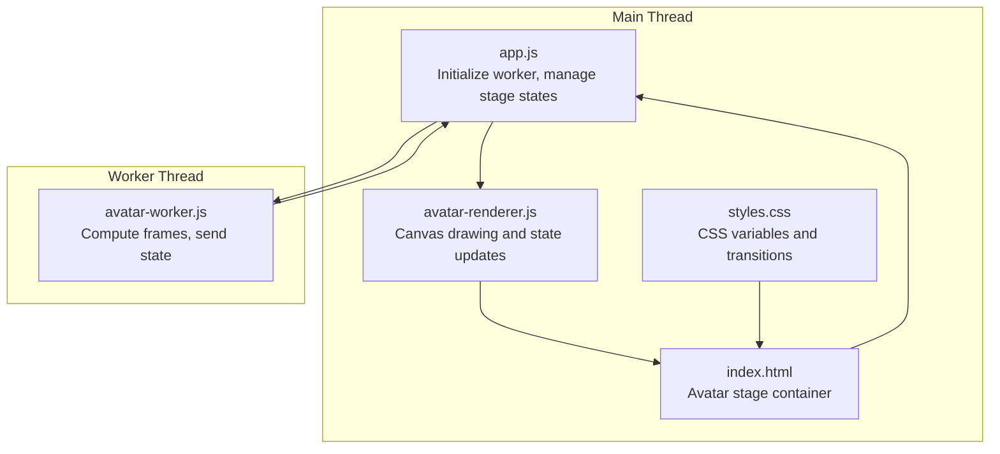
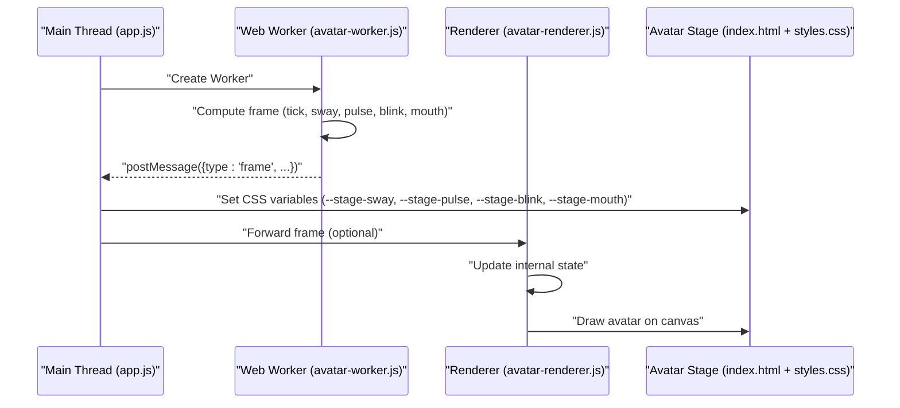
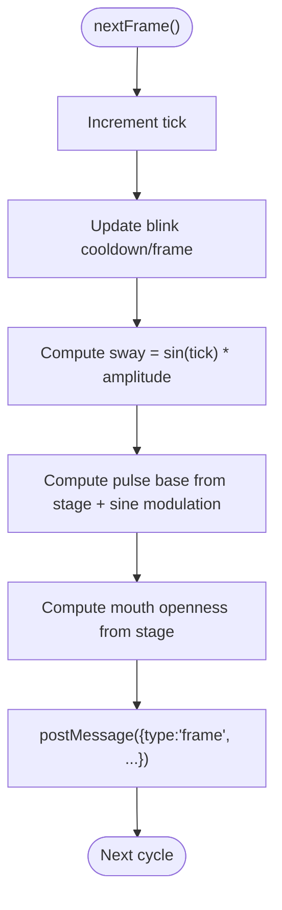
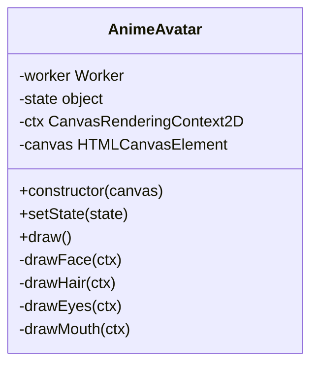
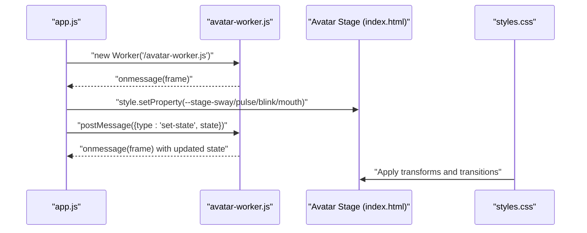
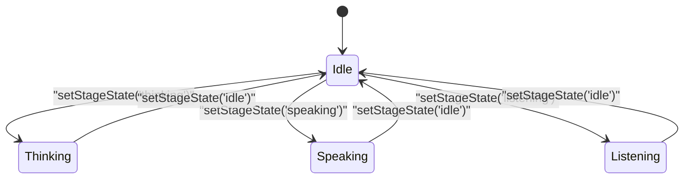
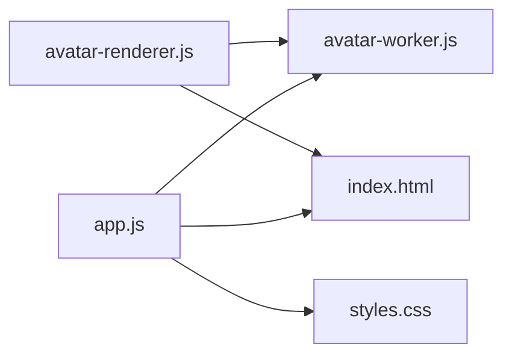

# Avatar Worker

<cite>
**Referenced Files in This Document**
- [avatar-worker.js](file://frontend/scripts/avatar-worker.js)
- [avatar-renderer.js](file://frontend/scripts/avatar-renderer.js)
- [app.js](file://frontend/scripts/app.js)
- [index.html](file://frontend/index.html)
- [styles.css](file://frontend/assets/styles.css)
</cite>

## Table of Contents
1. [Introduction](#introduction)
2. [Project Structure](#project-structure)
3. [Core Components](#core-components)
4. [Architecture Overview](#architecture-overview)
5. [Detailed Component Analysis](#detailed-component-analysis)
6. [Dependency Analysis](#dependency-analysis)
7. [Performance Considerations](#performance-considerations)
8. [Troubleshooting Guide](#troubleshooting-guide)
9. [Conclusion](#conclusion)

## Introduction
This document explains the avatar Web Worker implementation responsible for background animation computation and state processing. It covers the worker thread architecture, message passing protocol between the main thread and the worker, animation state calculations, and the avatar stage states (idle, thinking, speaking, listening) with their transitions. It also documents the physics-based animations (breathing effects, head tilting, hair swaying, and mouth movements), the mathematical models used for smooth animations, timing functions, and interpolation algorithms. Finally, it describes the worker’s role in offloading computation from the main thread, memory management, performance monitoring, and practical examples for initialization, state updates, and debugging techniques.

## Project Structure
The avatar animation system is composed of:
- A Web Worker script that computes animation frames and sends them to the main thread.
- A renderer class that draws the avatar on a canvas and applies computed state.
- A main-thread controller that initializes the worker, manages stage states, and updates CSS custom properties for visual effects.
- HTML and CSS that define the avatar UI and apply CSS-driven animations based on worker outputs.

**Diagram sources**
- [app.js:538-565](file://frontend/scripts/app.js#L538-L565)
- [avatar-worker.js:1-48](file://frontend/scripts/avatar-worker.js#L1-L48)
- [avatar-renderer.js:1-106](file://frontend/scripts/avatar-renderer.js#L1-L106)
- [index.html:80-92](file://frontend/index.html#L80-L92)
- [styles.css:910-973](file://frontend/assets/styles.css#L910-L973)

**Section sources**
- [app.js:538-565](file://frontend/scripts/app.js#L538-L565)
- [avatar-worker.js:1-48](file://frontend/scripts/avatar-worker.js#L1-L48)
- [avatar-renderer.js:1-106](file://frontend/scripts/avatar-renderer.js#L1-L106)
- [index.html:80-92](file://frontend/index.html#L80-L92)
- [styles.css:910-973](file://frontend/assets/styles.css#L910-L973)

## Core Components
- Web Worker (avatar-worker.js): Computes frame data (sway, pulse, blink, mouth) and posts them to the main thread at a fixed interval.
- Renderer (avatar-renderer.js): Receives frame data, updates internal state, and draws the avatar on a canvas.
- Main-thread controller (app.js): Initializes the worker, listens for frame messages, sets CSS custom properties, and dispatches stage state changes.
- UI (index.html + styles.css): Provides the avatar stage container and CSS-driven visual effects (scale, blink, mouth openness).

Key responsibilities:
- Offload animation computations to the worker to keep the main thread responsive.
- Maintain a small set of numeric state variables for smooth interpolation and rendering.
- Apply physics-like motion using trigonometric functions and bounded oscillators.

**Section sources**
- [avatar-worker.js:1-48](file://frontend/scripts/avatar-worker.js#L1-L48)
- [avatar-renderer.js:1-106](file://frontend/scripts/avatar-renderer.js#L1-L106)
- [app.js:538-565](file://frontend/scripts/app.js#L538-L565)
- [index.html:80-92](file://frontend/index.html#L80-L92)
- [styles.css:910-973](file://frontend/assets/styles.css#L910-L973)

## Architecture Overview
The system uses a producer-consumer pattern:
- The worker periodically computes a new frame and posts it to the main thread.
- The main thread updates CSS custom properties and optionally forwards the frame to the renderer.
- The renderer reads the latest state and draws the avatar on a canvas.

**Diagram sources**
- [avatar-worker.js:18-39](file://frontend/scripts/avatar-worker.js#L18-L39)
- [app.js:544-552](file://frontend/scripts/app.js#L544-L552)
- [avatar-renderer.js:19-24](file://frontend/scripts/avatar-renderer.js#L19-L24)
- [index.html:80-92](file://frontend/index.html#L80-L92)
- [styles.css:910-973](file://frontend/assets/styles.css#L910-L973)

## Detailed Component Analysis

### Web Worker (avatar-worker.js)
Responsibilities:
- Maintain internal state: stage state, tick counter, blink frame/cooldown.
- Compute frame data every tick:
  - Sway: sinusoidal horizontal movement.
  - Pulse: breathing effect scaling factor.
  - Mouth: openness depending on stage state.
  - Blink: discrete frame toggle with randomized cooldown.
- Post frame messages to the main thread.

Mathematical models and timing:
- Tick increment: constant step per frame.
- Sway: sine wave with amplitude and frequency parameters.
- Pulse: base value plus a sine modulation for subtle breathing.
- Mouth: piecewise constant or sinusoidal openness depending on stage.
- Blink: decrement cooldown until zero, then flip frame and reset cooldown with randomization.

**Diagram sources**
- [avatar-worker.js:18-39](file://frontend/scripts/avatar-worker.js#L18-L39)

**Section sources**
- [avatar-worker.js:1-48](file://frontend/scripts/avatar-worker.js#L1-L48)

### Renderer (avatar-renderer.js)
Responsibilities:
- Initialize a Web Worker and listen for frame messages.
- Maintain internal state (sway, head tilt, hair sway, pulse, mouth, eye open).
- On receiving a frame, update internal state and redraw the avatar.
- Draw face, hair, eyes, and mouth using canvas APIs.

Rendering pipeline:
- Translate to center, apply breathing scale, rotate for head tilt, translate for sway.
- Draw hair curves, face circle, eyes with openness, and mouth ellipse.

**Diagram sources**
- [avatar-renderer.js:3-106](file://frontend/scripts/avatar-renderer.js#L3-L106)

**Section sources**
- [avatar-renderer.js:1-106](file://frontend/scripts/avatar-renderer.js#L1-L106)

### Main-thread Controller (app.js)
Responsibilities:
- Initialize the worker and listen for frame messages.
- Update CSS custom properties on the avatar stage element to drive CSS animations.
- Dispatch stage state changes to the worker and update UI status text.
- Guard against missing Web Worker support.

Message protocol:
- Worker posts frames with type "frame".
- Main thread sets CSS variables for sway, pulse, blink, and mouth.
- Main thread posts state changes to the worker with type "set-state".

**Diagram sources**
- [app.js:538-565](file://frontend/scripts/app.js#L538-L565)
- [avatar-worker.js:41-46](file://frontend/scripts/avatar-worker.js#L41-L46)
- [index.html:80-92](file://frontend/index.html#L80-L92)
- [styles.css:910-973](file://frontend/assets/styles.css#L910-L973)

**Section sources**
- [app.js:538-565](file://frontend/scripts/app.js#L538-L565)

### Avatar Stage States and Transitions
States:
- idle: default state with minimal motion.
- thinking: increased pulse base for deeper breathing.
- speaking: mouth opens and moves with a sinusoidal pattern.
- listening: mouth remains partially open.

Transitions:
- Triggered by calling setStageState with a state string and optional status text/copy.
- The worker reads the current stage state and adjusts pulse, mouth, and sway accordingly.

**Diagram sources**
- [app.js:556-565](file://frontend/scripts/app.js#L556-L565)
- [avatar-worker.js:22-30](file://frontend/scripts/avatar-worker.js#L22-L30)

**Section sources**
- [app.js:556-565](file://frontend/scripts/app.js#L556-L565)
- [avatar-worker.js:22-30](file://frontend/scripts/avatar-worker.js#L22-L30)

### Physics-based Animations
- Breathing effect: pulse is a base value modulated by a sine wave to simulate gentle expansion/contraction.
- Head sway: horizontal translation following a sine wave for a subtle side-to-side motion.
- Hair sway: vertical displacement of hair control points to create a flowing effect synchronized with head sway.
- Mouth movement: openness controlled by stage state; speaking uses a sinusoidal pattern; listening uses a small constant; idle uses a tiny constant.
- Blinking: discrete eye openness toggled with randomized cooldown to mimic natural blinking.

Timing and interpolation:
- Frame rate: approximately 12.5 Hz (interval 80 ms).
- Interpolation: CSS transitions smooth the application of CSS variables for sway, pulse, blink, and mouth.

**Section sources**
- [avatar-worker.js:18-39](file://frontend/scripts/avatar-worker.js#L18-L39)
- [styles.css:910-973](file://frontend/assets/styles.css#L910-L973)

## Dependency Analysis
- app.js depends on:
  - avatar-worker.js for animation computation.
  - index.html for the avatar stage container.
  - styles.css for CSS-driven visual effects.
- avatar-worker.js depends on:
  - Math for trigonometric functions.
  - postMessage for communication with the main thread.
- avatar-renderer.js depends on:
  - Canvas API for drawing.
  - avatar-worker.js indirectly via app.js.

**Diagram sources**
- [app.js:538-565](file://frontend/scripts/app.js#L538-L565)
- [avatar-worker.js:1-48](file://frontend/scripts/avatar-worker.js#L1-L48)
- [avatar-renderer.js:1-106](file://frontend/scripts/avatar-renderer.js#L1-L106)
- [index.html:80-92](file://frontend/index.html#L80-L92)
- [styles.css:910-973](file://frontend/assets/styles.css#L910-L973)

**Section sources**
- [app.js:538-565](file://frontend/scripts/app.js#L538-L565)
- [avatar-worker.js:1-48](file://frontend/scripts/avatar-worker.js#L1-L48)
- [avatar-renderer.js:1-106](file://frontend/scripts/avatar-renderer.js#L1-L106)
- [index.html:80-92](file://frontend/index.html#L80-L92)
- [styles.css:910-973](file://frontend/assets/styles.css#L910-L973)

## Performance Considerations
- Offloading: Animation computations run in a separate thread to prevent UI jank.
- Minimal state: Only numeric values are exchanged, reducing serialization overhead.
- Efficient math: Trigonometric functions are lightweight; periodic updates occur at a fixed interval.
- CSS smoothing: CSS transitions provide smooth interpolation for visual updates.
- Memory: Worker maintains minimal state; main thread holds renderer state and canvas context.
- Monitoring: Use browser devtools to inspect worker threads and measure frame rates.

[No sources needed since this section provides general guidance]

## Troubleshooting Guide
Common issues and resolutions:
- Web Worker not supported: The controller checks for Worker availability and updates the runtime badge accordingly.
- No animation updates: Verify that the worker posts frames and the main thread sets CSS variables.
- Incorrect stage state: Ensure setStageState is called with a valid state string and that the worker receives the "set-state" message.
- Stuttering or dropped frames: Confirm the worker interval and that the main thread is not blocked by heavy synchronous tasks.
- Blinking anomalies: Check blink cooldown logic and randomness; ensure the blink frame toggles correctly.

Debugging techniques:
- Inspect the worker thread in devtools to confirm frame posting.
- Observe CSS custom property changes on the avatar stage element.
- Temporarily disable CSS transitions to isolate rendering issues.
- Add logging in the worker and main thread to trace state changes.

**Section sources**
- [app.js:538-565](file://frontend/scripts/app.js#L538-L565)
- [avatar-worker.js:41-46](file://frontend/scripts/avatar-worker.js#L41-L46)

## Conclusion
The avatar Web Worker implementation cleanly separates animation computation from the main thread, enabling smooth, responsive UI while maintaining realistic, physics-inspired motion. The system uses a simple, efficient message protocol, minimal state, and CSS-driven visual effects to deliver a polished experience. By following the documented patterns for initialization, state updates, and debugging, developers can extend and maintain the avatar animation system effectively.