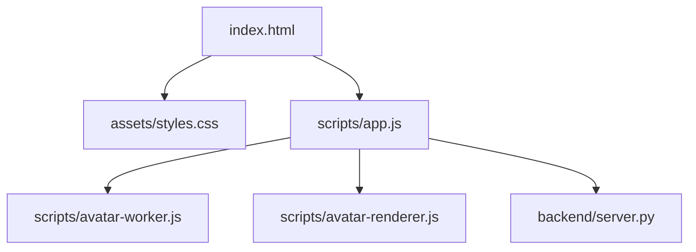
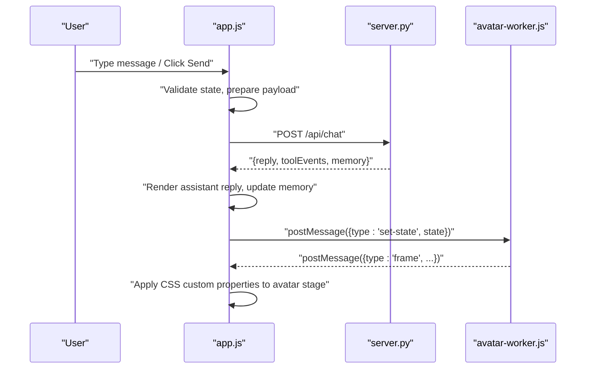
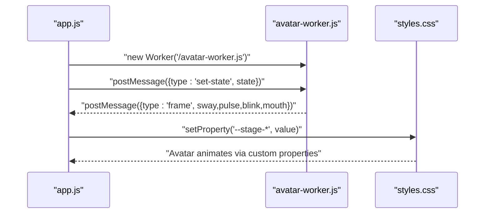
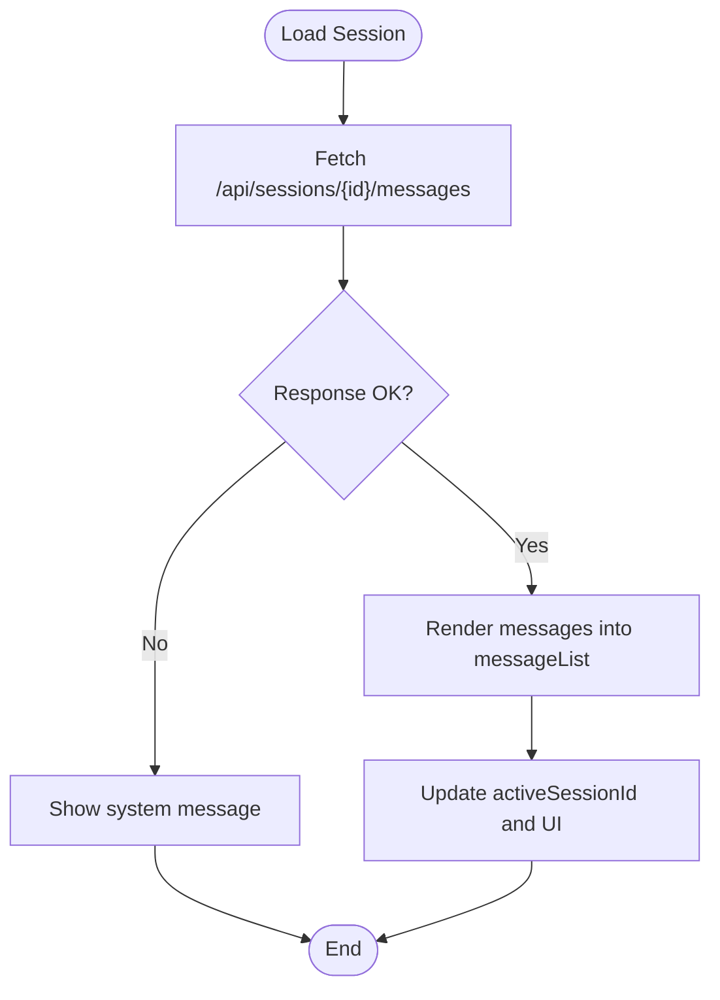
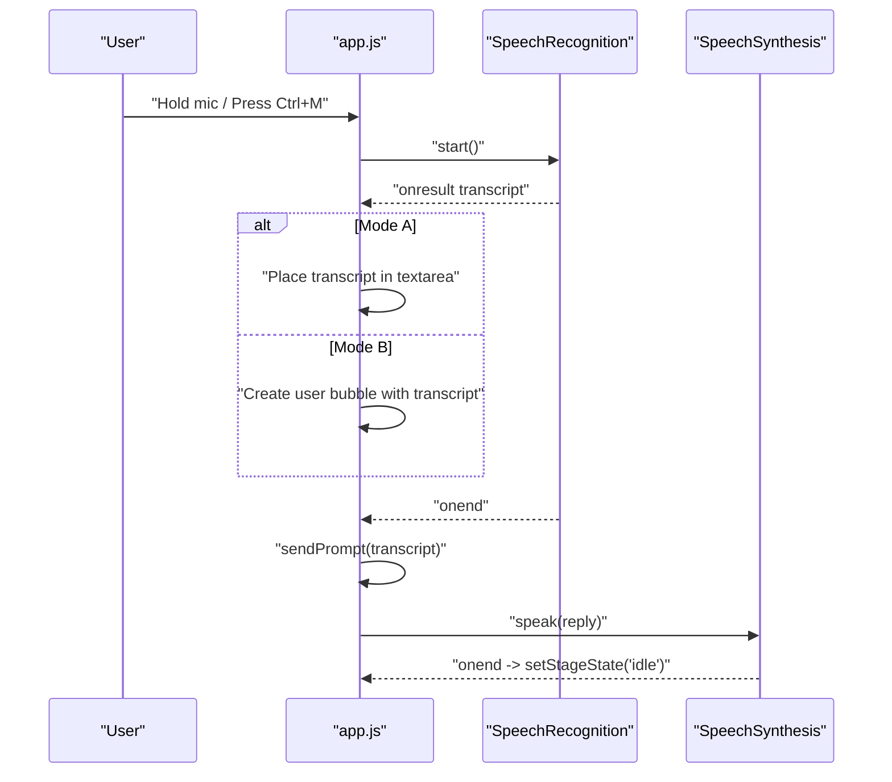
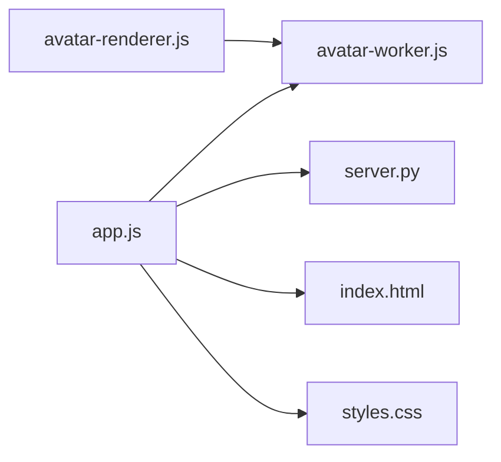

# Frontend Components

<cite>
**Referenced Files in This Document**
- [index.html](file://frontend/index.html)
- [styles.css](file://frontend/assets/styles.css)
- [app.js](file://frontend/scripts/app.js)
- [avatar-renderer.js](file://frontend/scripts/avatar-renderer.js)
- [avatar-worker.js](file://frontend/scripts/avatar-worker.js)
- [server.py](file://backend/server.py)
- [README.md](file://README.md)
</cite>

## Table of Contents
1. [Introduction](#introduction)
2. [Project Structure](#project-structure)
3. [Core Components](#core-components)
4. [Architecture Overview](#architecture-overview)
5. [Detailed Component Analysis](#detailed-component-analysis)
6. [Dependency Analysis](#dependency-analysis)
7. [Performance Considerations](#performance-considerations)
8. [Troubleshooting Guide](#troubleshooting-guide)
9. [Conclusion](#conclusion)
10. [Appendices](#appendices)

## Introduction
This document provides comprehensive frontend component documentation for the Orbit Virtual Assistant web interface. It covers the HTML structure and layout, CSS styling and animations, responsive design, accessibility features, and the main application logic including session management, message handling, UI interactions, and state management. It also explains the avatar system built with canvas-based animation and Web Worker integration for real-time state synchronization, along with component composition patterns, user interaction workflows, browser compatibility considerations, and performance optimization techniques.

## Project Structure
The frontend is organized into three main areas:
- index.html: The main page layout with sidebar, chat area, header, and utility drawer.
- assets/styles.css: Global styles, theme variables, component styles, and responsive breakpoints.
- scripts/app.js: Central application logic for state, UI, voice, sessions, and API integration.
- scripts/avatar-renderer.js: Canvas-based avatar renderer (optional integration).
- scripts/avatar-worker.js: Web Worker that computes avatar animation frames.

**Diagram sources**
- [index.html:1-338](file://frontend/index.html#L1-L338)
- [styles.css:1-1510](file://frontend/assets/styles.css#L1-L1510)
- [app.js:1-1765](file://frontend/scripts/app.js#L1-L1765)
- [avatar-renderer.js:1-106](file://frontend/scripts/avatar-renderer.js#L1-L106)
- [avatar-worker.js:1-48](file://frontend/scripts/avatar-worker.js#L1-L48)
- [server.py:1-611](file://backend/server.py#L1-L611)

**Section sources**
- [index.html:1-338](file://frontend/index.html#L1-L338)
- [styles.css:1-1510](file://frontend/assets/styles.css#L1-L1510)
- [app.js:1-1765](file://frontend/scripts/app.js#L1-L1765)
- [avatar-renderer.js:1-106](file://frontend/scripts/avatar-renderer.js#L1-L106)
- [avatar-worker.js:1-48](file://frontend/scripts/avatar-worker.js#L1-L48)
- [server.py:1-611](file://backend/server.py#L1-L611)

## Core Components
- Layout and Containers
  - App layout with left sidebar, main chat area, and right utility drawer.
  - Chat header with mode switching, avatar mini-stage, and session actions.
  - Message area with animated message bubbles and tool event badges.
  - Composer with input row, toggle chips, and voice status.
- State Management
  - Centralized appState object holding mode, conversation, sessions, voice, avatar, and UI flags.
  - DOM element references cached in a centralized elements map.
- Avatar System
  - Web Worker computes avatar animation frames (sway, pulse, blink, mouth).
  - CSS custom properties apply computed values to the avatar mini-stage.
  - Optional canvas-based renderer available for advanced scenarios.
- Voice and Interaction
  - SpeechRecognition for push-to-talk modes A and B.
  - SpeechSynthesis for TTS replies.
  - Screen sharing capture and preview.
  - File attachment upload pipeline.
- Backend Integration
  - Fetch-based API calls to backend endpoints for sessions, messages, weather, news, tasks, notes, and chat.
  - Real-time state refresh and memory views updates.

**Section sources**
- [app.js:35-85](file://frontend/scripts/app.js#L35-L85)
- [app.js:89-196](file://frontend/scripts/app.js#L89-L196)
- [app.js:538-565](file://frontend/scripts/app.js#L538-L565)
- [app.js:902-926](file://frontend/scripts/app.js#L902-L926)
- [app.js:928-1087](file://frontend/scripts/app.js#L928-L1087)
- [app.js:1655-1712](file://frontend/scripts/app.js#L1655-L1712)
- [avatar-worker.js:1-48](file://frontend/scripts/avatar-worker.js#L1-L48)
- [avatar-renderer.js:1-106](file://frontend/scripts/avatar-renderer.js#L1-L106)

## Architecture Overview
The frontend follows a modular, event-driven architecture:
- HTML defines the structure and semantic roles.
- CSS provides theming, transitions, and responsive behavior.
- JavaScript orchestrates state, UI updates, and asynchronous operations.
- Web Workers offload avatar computations to keep UI responsive.
- Backend server exposes REST endpoints for sessions, chat, and data.

**Diagram sources**
- [app.js:928-1087](file://frontend/scripts/app.js#L928-L1087)
- [server.py:276-321](file://backend/server.py#L276-L321)
- [avatar-worker.js:41-46](file://frontend/scripts/avatar-worker.js#L41-L46)

## Detailed Component Analysis

### HTML Structure and Layout
- Left Sidebar
  - Contains new chat, collapse button, pinned/recent/archived session lists, and footer badges.
- Main Chat Area
  - Header with mode switch, avatar mini-stage, session actions, and utility toggle.
  - Coach panel visible in Coach mode with topic, level, and language inputs.
  - Message list with animated entries and tool event badges.
  - Composer with toggles, input, voice status, and send/dismiss actions.
- Right Utility Drawer
  - Voice settings, screen share controls, profile, weather, news, quick actions, knowledge lab, tasks, and memory notes.

Accessibility highlights:
- Semantic headings and labels.
- Focusable elements with keyboard navigation.
- ARIA-compliant selects and buttons.
- Proper contrast and readable typography.

**Section sources**
- [index.html:14-56](file://frontend/index.html#L14-L56)
- [index.html:59-200](file://frontend/index.html#L59-L200)
- [index.html:203-327](file://frontend/index.html#L203-L327)

### CSS Styling and Animations
- Theming
  - CSS variables define dark sidebar, light chat surface, accents, radii, shadows, and transitions.
- Layout
  - Flexbox-based app layout with collapsible sidebar and utility drawer.
  - Max-width constrained message list and composer containers.
- Components
  - Session list with hover and active states.
  - Message bubbles with distinct user/assistant/system styles and action buttons.
  - Toggle chips for tool toggles with active states.
  - Mini avatar with CSS custom properties for dynamic animation.
- Animations
  - Message entrance animation.
  - Mic pulse animation for active voice input.
  - Scrollbar styling for all scrollable regions.
- Responsive Breakpoints
  - Utility drawer becomes a slide-out panel on small screens.
  - Sidebar becomes a modal overlay on mobile.
  - Mode switch and session actions hide on smaller widths.
  - Toggle chip labels hidden on extra-small screens.

**Section sources**
- [styles.css:7-47](file://frontend/assets/styles.css#L7-L47)
- [styles.css:100-129](file://frontend/assets/styles.css#L100-L129)
- [styles.css:212-249](file://frontend/assets/styles.css#L212-L249)
- [styles.css:580-679](file://frontend/assets/styles.css#L580-L679)
- [styles.css:702-883](file://frontend/assets/styles.css#L702-L883)
- [styles.css:886-991](file://frontend/assets/styles.css#L886-L991)
- [styles.css:994-1151](file://frontend/assets/styles.css#L994-L1151)
- [styles.css:1319-1334](file://frontend/assets/styles.css#L1319-L1334)
- [styles.css:1440-1509](file://frontend/assets/styles.css#L1440-L1509)

### Avatar System and Web Worker Integration
- Worker Computation
  - avatar-worker.js runs a loop computing sway, pulse, blink, and mouth states based on stage state.
  - Emits frame messages with typed payloads.
- UI Synchronization
  - app.js initializes a Web Worker and listens for frame messages.
  - Applies values to CSS custom properties on the avatar stage element.
  - setStageState updates both the DOM dataset and worker state.
- Optional Canvas Renderer
  - avatar-renderer.js demonstrates a canvas-based avatar with Worker-driven state updates.
  - Provides setState and draw methods for rendering.

**Diagram sources**
- [app.js:538-565](file://frontend/scripts/app.js#L538-L565)
- [avatar-worker.js:32-39](file://frontend/scripts/avatar-worker.js#L32-L39)
- [styles.css:910-973](file://frontend/assets/styles.css#L910-L973)

**Section sources**
- [avatar-worker.js:1-48](file://frontend/scripts/avatar-worker.js#L1-L48)
- [app.js:538-565](file://frontend/scripts/app.js#L538-L565)
- [avatar-renderer.js:1-106](file://frontend/scripts/avatar-renderer.js#L1-L106)
- [styles.css:886-991](file://frontend/assets/styles.css#L886-L991)

### Session Management and Message Handling
- State
  - appState holds activeSessionId, sessions array, conversation history, and UI flags.
- UI
  - renderSessions populates pinned, recent, and archived groups.
  - createSessionItem builds interactive items with click handlers.
- Loading and Refreshing
  - loadSession fetches messages for a given session and replays conversation.
  - refreshSessions updates the sidebar lists from backend.
- Message Rendering
  - addMessage creates article nodes with body and metadata.
  - Supports Markdown rendering and link formatting.
  - Tool events rendered as pill badges above the message list.

**Diagram sources**
- [app.js:1217-1241](file://frontend/scripts/app.js#L1217-L1241)
- [app.js:1153-1187](file://frontend/scripts/app.js#L1153-L1187)

**Section sources**
- [app.js:1151-1270](file://frontend/scripts/app.js#L1151-L1270)
- [app.js:1091-1139](file://frontend/scripts/app.js#L1091-L1139)
- [app.js:1141-1149](file://frontend/scripts/app.js#L1141-L1149)

### Voice Input and TTS
- Speech Recognition
  - setupSpeechRecognition initializes SpeechRecognition with interim results and continuous mode.
  - Two modes:
    - Mode A (Ctrl+M): Record-then-review; transcript placed in textarea.
    - Mode B (Hold Control): Instant-send; transcript appears in chat bubble.
  - Handles start, result, error, and end events; manages timers and UI state.
- Mic Button and Hotkeys
  - Pointer events for push-to-talk.
  - Keyboard shortcuts for mode switching and cancellation.
- Speech Synthesis
  - Optional TTS reads assistant replies using selected voice.
  - Avatar stage state transitions to speaking/idle accordingly.

**Diagram sources**
- [app.js:601-727](file://frontend/scripts/app.js#L601-L727)
- [app.js:830-858](file://frontend/scripts/app.js#L830-L858)
- [app.js:1056-1071](file://frontend/scripts/app.js#L1056-L1071)

**Section sources**
- [app.js:601-727](file://frontend/scripts/app.js#L601-L727)
- [app.js:830-858](file://frontend/scripts/app.js#L830-L858)
- [app.js:1056-1071](file://frontend/scripts/app.js#L1056-L1071)

### Screen Sharing and Attachments
- Screen Capture
  - startScreenShare acquires display media and draws frames to a preview canvas.
  - Captures JPEG dataURL periodically and stores latestScreenImage.
  - stopScreenShare cleans up tracks and clears state.
- File Attachments
  - handleFileAttach validates extensions and sizes, converts to base64, and posts to backend.
  - Updates UI with indexing status and enables attach button.

**Section sources**
- [app.js:1655-1712](file://frontend/scripts/app.js#L1655-L1712)
- [app.js:1569-1637](file://frontend/scripts/app.js#L1569-L1637)

### Utility Drawer and Data Panels
- Voice Settings
  - Enable/disable TTS and select voice language.
- Screen Share
  - Start/stop buttons and preview canvas.
- Profile, Weather, News
  - Forms and refresh actions populate cards with sanitized data.
- Quick Actions and Knowledge Lab
  - Buttons trigger predefined prompts; some require screen context.
- Tasks and Notes
  - CRUD operations backed by backend endpoints.

**Section sources**
- [index.html:213-326](file://frontend/index.html#L213-L326)
- [app.js:1380-1514](file://frontend/scripts/app.js#L1380-L1514)

## Dependency Analysis
- Internal Dependencies
  - app.js depends on avatar-worker.js for avatar state updates.
  - avatar-renderer.js optionally depends on avatar-worker.js for state synchronization.
- External Dependencies
  - Marked for Markdown rendering.
  - Browser APIs: SpeechRecognition, SpeechSynthesis, MediaDevices, FileReader, Canvas, Web Worker.
- Backend Integration
  - REST endpoints for sessions, messages, attachments, chat, profile, tasks, notes, weather, news.
  - Static file serving for HTML/CSS/JS and avatar worker.

**Diagram sources**
- [app.js:1-1765](file://frontend/scripts/app.js#L1-L1765)
- [avatar-worker.js:1-48](file://frontend/scripts/avatar-worker.js#L1-L48)
- [avatar-renderer.js:1-106](file://frontend/scripts/avatar-renderer.js#L1-L106)
- [server.py:1-611](file://backend/server.py#L1-L611)
- [index.html:1-338](file://frontend/index.html#L1-L338)
- [styles.css:1-1510](file://frontend/assets/styles.css#L1-L1510)

**Section sources**
- [app.js:1-1765](file://frontend/scripts/app.js#L1-L1765)
- [avatar-worker.js:1-48](file://frontend/scripts/avatar-worker.js#L1-L48)
- [avatar-renderer.js:1-106](file://frontend/scripts/avatar-renderer.js#L1-L106)
- [server.py:1-611](file://backend/server.py#L1-L611)

## Performance Considerations
- Offloading Animation
  - Web Worker handles avatar computations; main thread updates CSS custom properties.
- Efficient DOM Updates
  - Reuse message nodes and update inner content rather than recreating elements.
  - Debounce or throttle frequent UI updates (e.g., screen capture interval).
- Lazy Initialization
  - Initialize speech recognition and avatar worker only when needed.
- Asset Serving
  - Backend serves static assets; ensure caching headers and minimal bundle sizes.
- Rendering
  - Limit message list length and virtualize if needed for very long histories.
  - Avoid unnecessary reflows by batching DOM writes.

[No sources needed since this section provides general guidance]

## Troubleshooting Guide
Common issues and resolutions:
- Voice Not Working
  - Verify browser supports SpeechRecognition/SpeechSynthesis.
  - Check microphone permissions and device availability.
  - Confirm voice language selection and network/API key status.
- Avatar Not Animating
  - Ensure Web Worker is supported and avatar-worker.js is served.
  - Verify CSS custom property bindings on the avatar stage element.
- Screen Sharing Fails
  - Ensure HTTPS or localhost; display media constraints may vary by browser.
  - Check for track ended events and cleanup intervals.
- Session Load Errors
  - Confirm session ID exists and messages endpoint returns data.
  - Inspect network tab for CORS or permission errors.
- File Upload Failures
  - Validate allowed extensions and size limits.
  - Confirm session exists before attaching files.

**Section sources**
- [app.js:601-727](file://frontend/scripts/app.js#L601-L727)
- [app.js:538-565](file://frontend/scripts/app.js#L538-L565)
- [app.js:1655-1712](file://frontend/scripts/app.js#L1655-L1712)
- [app.js:1217-1241](file://frontend/scripts/app.js#L1217-L1241)
- [app.js:1569-1637](file://frontend/scripts/app.js#L1569-L1637)

## Conclusion
The Orbit Virtual Assistant frontend delivers a modern, responsive chat interface with robust state management, voice capabilities, screen sharing, and an animated avatar powered by a Web Worker. Its modular design and clear separation of concerns enable easy customization and extension. By leveraging CSS custom properties and efficient DOM updates, the UI remains smooth and accessible across devices.

[No sources needed since this section summarizes without analyzing specific files]

## Appendices

### Browser Compatibility
- SpeechRecognition and SpeechSynthesis are widely supported in modern browsers.
- Web Workers are universally supported.
- MediaDevices (getDisplayMedia) requires secure contexts (HTTPS/localhost).
- Canvas and FileReader are broadly supported.

**Section sources**
- [README.md:58-63](file://README.md#L58-L63)
- [app.js:601-727](file://frontend/scripts/app.js#L601-L727)
- [app.js:1655-1712](file://frontend/scripts/app.js#L1655-L1712)

### Practical Customization Examples
- UI Customization
  - Adjust CSS variables in :root to change theme colors and radii.
  - Modify toggle chips and button styles in the composer area.
  - Extend responsive breakpoints for tablet or desktop layouts.
- Component Integration
  - Integrate additional tool panels by adding drawer sections and binding events.
  - Add new avatar states by extending avatar-worker.js and updating CSS custom properties.
- Accessibility Enhancements
  - Ensure focus management for modals and drawers.
  - Provide ARIA attributes for dynamic content updates.
  - Test keyboard navigation and screen reader compatibility.

**Section sources**
- [styles.css:7-47](file://frontend/assets/styles.css#L7-L47)
- [styles.css:702-883](file://frontend/assets/styles.css#L702-L883)
- [index.html:213-326](file://frontend/index.html#L213-L326)
- [app.js:538-565](file://frontend/scripts/app.js#L538-L565)