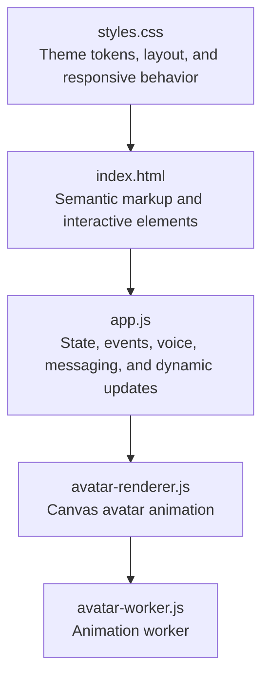
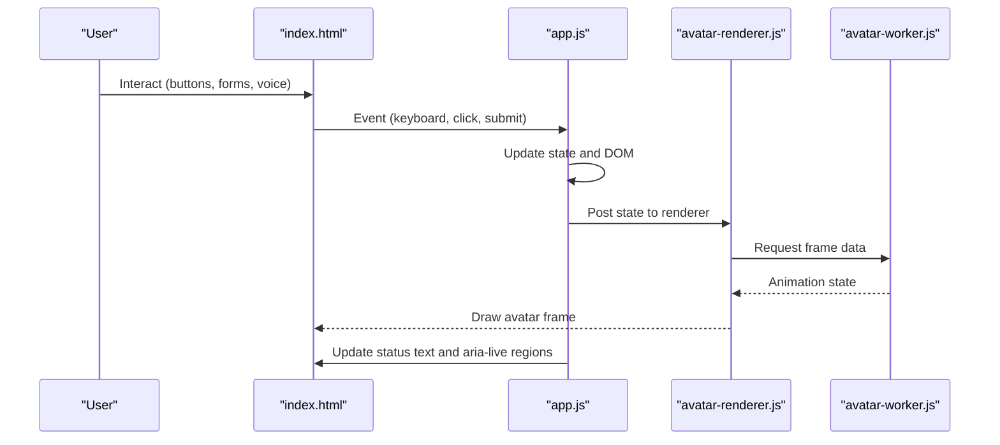
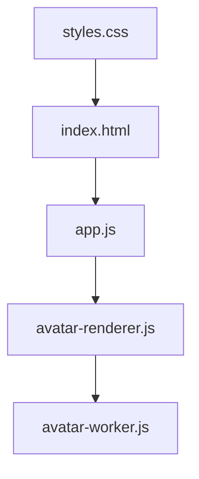

# Accessibility and Standards Compliance

<cite>
**Referenced Files in This Document**
- [index.html](file://frontend/index.html)
- [styles.css](file://frontend/assets/styles.css)
- [app.js](file://frontend/scripts/app.js)
- [avatar-renderer.js](file://frontend/scripts/avatar-renderer.js)
- [README.md](file://README.md)
</cite>

## Table of Contents
1. [Introduction](#introduction)
2. [Project Structure](#project-structure)
3. [Core Components](#core-components)
4. [Architecture Overview](#architecture-overview)
5. [Detailed Component Analysis](#detailed-component-analysis)
6. [Dependency Analysis](#dependency-analysis)
7. [Performance Considerations](#performance-considerations)
8. [Troubleshooting Guide](#troubleshooting-guide)
9. [Conclusion](#conclusion)
10. [Appendices](#appendices)

## Introduction
This document provides comprehensive accessibility and standards compliance guidance for the Orbit Virtual Assistant interface. It focuses on ARIA label implementation, semantic HTML structure, keyboard navigation, focus management, screen reader compatibility for dynamic content, color contrast, accessible form controls, labeling strategies, and alternative text for icons and avatars. It also covers keyboard shortcuts (Ctrl+M, Enter, Shift+Enter), focus trap management in the utility drawer, skip-link functionality, testing approaches, WCAG verification, assistive technology compatibility, accessible color schemes and high contrast modes, reduced motion preferences, maintenance practices, automated testing integration, and common pitfalls to avoid.

## Project Structure
The Orbit Virtual Assistant front-end consists of:
- A single-page HTML document with semantic regions and interactive controls
- A central JavaScript module orchestrating UI state, voice input, messaging, and tool integrations
- A stylesheet defining theme tokens, layouts, and responsive behavior
- A small avatar rendering pipeline using a Web Worker for animations

**Diagram sources**
- [index.html](file://frontend/index.html)
- [styles.css](file://frontend/assets/styles.css)
- [app.js](file://frontend/scripts/app.js)
- [avatar-renderer.js](file://frontend/scripts/avatar-renderer.js)

**Section sources**
- [index.html](file://frontend/index.html)
- [styles.css](file://frontend/assets/styles.css)
- [app.js](file://frontend/scripts/app.js)
- [README.md](file://README.md)

## Core Components
- Semantic regions: header, main, nav, aside, section, article, figure, figcaption
- Interactive controls: buttons, forms, selects, checkboxes, textarea, canvas
- Dynamic content areas: message list, tool events, utility drawer panels
- Avatar stage with state attributes for visual feedback
- Voice controls with dual modes (Mode A: Ctrl+M review; Mode B: push-to-talk)
- Keyboard shortcuts: Enter to send, Shift+Enter for new line, Ctrl+M for Mode A toggle

Key accessibility features present:
- Semantic HTML structure with roles implied by elements
- Focusable interactive elements with hover/focus styles
- Dynamic updates via DOM manipulation and Web Worker-driven avatar
- Voice status and stage state communicated through text nodes and attributes

Areas to enhance:
- Explicit ARIA attributes for dynamic regions and controls
- Focus management for modal-like utility drawer
- Skip-link for keyboard navigation
- Color contrast checks and high contrast mode support
- Reduced motion preferences and motion-safe animations
- Alternative text for decorative SVGs and avatar canvas

**Section sources**
- [index.html](file://frontend/index.html)
- [app.js](file://frontend/scripts/app.js)
- [styles.css](file://frontend/assets/styles.css)

## Architecture Overview
The front-end architecture supports accessibility through:
- Centralized state and event handling in a single script
- Dynamic DOM updates for messages, tool events, and drawer content
- Avatar state updates via a Web Worker to offload animation calculations
- Voice input and synthesis with explicit status updates

**Diagram sources**
- [index.html](file://frontend/index.html)
- [app.js](file://frontend/scripts/app.js)
- [avatar-renderer.js](file://frontend/scripts/avatar-renderer.js)

## Detailed Component Analysis

### Semantic HTML and ARIA Strategy
- Regions: header, main, nav, aside, section, article, figure, figcaption are used appropriately
- Interactive elements: buttons, links, forms, selects, checkboxes, textarea
- ARIA attributes: minimal explicit ARIA usage; rely on semantics; consider adding aria-labels and aria-live regions for dynamic content updates

Recommendations:
- Add aria-labels to icon-only buttons where context is not sufficient
- Use aria-live regions for dynamic status updates (e.g., voice status, stage status)
- Ensure landmark roles are clear; maintain skip-link for keyboard navigation

**Section sources**
- [index.html](file://frontend/index.html)

### Keyboard Navigation and Shortcuts
- Global shortcuts:
  - Ctrl+M: Toggle Mode A (record-then-review)
  - Enter: Send message
  - Shift+Enter: New line in textarea
  - ESC: Cancel Mode A recording
- Voice input:
  - Hold Control: Mode B (instant-send) with a short delay to avoid conflicts
  - Mic button click-and-hold: Mode B behavior
- Composer:
  - Auto-resize textarea
  - Focus management: composer focus after new chat

Enhancements:
- Implement a skip-link to jump to main content
- Manage focus traps when opening the utility drawer
- Provide keyboard-only activation for all interactive elements

**Section sources**
- [app.js](file://frontend/scripts/app.js)
- [index.html](file://frontend/index.html)

### Focus Management and Focus Traps
- Utility drawer opens with a class toggle; focus is not programmatically managed
- After opening the drawer, focus should move to the first focusable element inside the drawer
- On close, focus should return to the trigger button

Recommendations:
- Add focus trapping using a library or custom implementation
- Manage focus on open/close transitions
- Announce drawer visibility changes to assistive technologies

**Section sources**
- [app.js](file://frontend/scripts/app.js)
- [index.html](file://frontend/index.html)

### Screen Reader Compatibility for Dynamic Content
- Dynamic updates occur via innerHTML/textContent changes
- Voice status and stage status are updated in dedicated spans
- Tool events and messages are appended to lists

Recommendations:
- Use aria-live regions for critical status updates
- Announce new messages and tool events
- Ensure screen readers announce state changes (e.g., avatar stage state)

**Section sources**
- [app.js](file://frontend/scripts/app.js)
- [index.html](file://frontend/index.html)

### Color Contrast and Visual Design
- Theme tokens define dark/light surfaces and accents
- Contrast checks should be performed against the active theme
- High contrast mode support and reduced motion preferences should be considered

Recommendations:
- Verify WCAG AA/AAA contrast ratios for text, backgrounds, and interactive elements
- Provide high contrast themes and reduced motion variants
- Respect prefers-reduced-motion media queries

**Section sources**
- [styles.css](file://frontend/assets/styles.css)

### Accessible Form Controls and Labeling
- Forms include labels and placeholders
- Selects and checkboxes are present
- Proper labeling ensures screen reader compatibility

Recommendations:
- Ensure all form controls have associated labels
- Use aria-describedby for additional context
- Validate form submission feedback for screen readers

**Section sources**
- [index.html](file://frontend/index.html)
- [app.js](file://frontend/scripts/app.js)

### Alternative Text Strategies for Icons and Avatars
- Icons are primarily presentational; ensure meaningful alternatives where context is insufficient
- Avatar is rendered via canvas; provide an accessible description of state changes

Recommendations:
- Add aria-hidden to purely decorative SVGs
- Provide aria-labels for icon buttons with contextual titles
- Describe avatar state changes for screen readers

**Section sources**
- [index.html](file://frontend/index.html)
- [avatar-renderer.js](file://frontend/scripts/avatar-renderer.js)

### Keyboard Shortcut Implementation
- Ctrl+M: Toggle Mode A
- Enter: Send message
- Shift+Enter: New line
- ESC: Cancel Mode A
- Control hold: Mode B with delay

Recommendations:
- Document shortcuts clearly in UI
- Provide tooltips and aria-labels for controls
- Ensure shortcuts do not conflict with assistive technologies

**Section sources**
- [app.js](file://frontend/scripts/app.js)
- [index.html](file://frontend/index.html)

### Focus Trap Management in Utility Drawer
- Drawer state toggled via class; focus trap not implemented
- Implement focus trap on open/close
- Manage focus order within the drawer

Recommendations:
- Move focus to the first focusable element on open
- Trap focus within the drawer until closed
- Return focus to the trigger on close

**Section sources**
- [app.js](file://frontend/scripts/app.js)
- [index.html](file://frontend/index.html)

### Skip-Link Functionality
- Not currently implemented
- Implement a skip-link to bypass repeated navigation

Recommendations:
- Add a skip-link at the top of the page
- Visually hidden until focused
- Links to the main content region

**Section sources**
- [index.html](file://frontend/index.html)

### Accessibility Testing Approach and WCAG Verification
- Manual testing with screen readers (NVDA, JAWS, VoiceOver)
- Keyboard-only navigation testing
- Automated testing with axe-core or similar tools
- Contrast checks with Lighthouse or Pa11y
- Assistive technology compatibility verification

Recommendations:
- Integrate automated accessibility tests in CI
- Perform WCAG 2.1 AA verification regularly
- Test with multiple assistive technologies

**Section sources**
- [README.md](file://README.md)

### Assistive Technology Compatibility
- Voice input and synthesis supported
- Canvas avatar requires accessible state descriptions
- Ensure compatibility with braille displays and speech input

Recommendations:
- Test with NVDA, JAWS, VoiceOver, TalkBack, and Voice Control
- Validate braille display output
- Confirm speech input compatibility

**Section sources**
- [app.js](file://frontend/scripts/app.js)
- [avatar-renderer.js](file://frontend/scripts/avatar-renderer.js)

### Accessible Color Schemes, High Contrast Modes, and Reduced Motion Preferences
- Provide high contrast themes and reduced motion variants
- Respect prefers-reduced-motion media queries
- Ensure color is not the sole indicator of meaning

Recommendations:
- Offer high contrast mode toggle
- Provide reduced motion variant of animations
- Use patterns and textures alongside color

**Section sources**
- [styles.css](file://frontend/assets/styles.css)

### Practical Guidance for Maintaining Accessibility During UI Updates
- Review changes with accessibility tools
- Ensure dynamic content announcements
- Maintain focus management
- Preserve keyboard navigation

Recommendations:
- Include accessibility checks in pull requests
- Run automated accessibility tests in CI
- Conduct periodic manual audits

**Section sources**
- [app.js](file://frontend/scripts/app.js)
- [index.html](file://frontend/index.html)

### Common Accessibility Pitfalls to Avoid
- Overusing color alone to convey meaning
- Neglecting focus management for modals and drawers
- Inconsistent labeling of interactive elements
- Ignoring keyboard-only navigation
- Failing to test with assistive technologies

Recommendations:
- Use multiple cues (color, shape, text)
- Implement robust focus management
- Provide clear labels and descriptions
- Test thoroughly with AT

**Section sources**
- [index.html](file://frontend/index.html)
- [styles.css](file://frontend/assets/styles.css)
- [app.js](file://frontend/scripts/app.js)

## Dependency Analysis
The front-end relies on:
- index.html for structure and interactive elements
- styles.css for theme and layout
- app.js for state, events, voice, and dynamic updates
- avatar-renderer.js and avatar-worker.js for avatar animation

**Diagram sources**
- [index.html](file://frontend/index.html)
- [styles.css](file://frontend/assets/styles.css)
- [app.js](file://frontend/scripts/app.js)
- [avatar-renderer.js](file://frontend/scripts/avatar-renderer.js)

**Section sources**
- [index.html](file://frontend/index.html)
- [styles.css](file://frontend/assets/styles.css)
- [app.js](file://frontend/scripts/app.js)
- [avatar-renderer.js](file://frontend/scripts/avatar-renderer.js)

## Performance Considerations
- Avatar animations offloaded to a Web Worker reduce main-thread work
- Efficient DOM updates for messages and tool events
- Consider lazy-loading non-critical resources

[No sources needed since this section provides general guidance]

## Troubleshooting Guide
Common accessibility issues and resolutions:
- Dynamic content not announced: add aria-live regions and ensure updates are perceivable
- Focus lost after drawer open: implement focus trap and manage focus movement
- Low contrast: adjust theme tokens and verify contrast ratios
- Keyboard navigation gaps: ensure all interactive elements are reachable via keyboard

**Section sources**
- [app.js](file://frontend/scripts/app.js)
- [index.html](file://frontend/index.html)
- [styles.css](file://frontend/assets/styles.css)

## Conclusion
The Orbit Virtual Assistant interface demonstrates strong foundational accessibility through semantic HTML, keyboard navigation, and dynamic content updates. To achieve WCAG compliance and inclusive design, implement explicit ARIA attributes, focus management for the utility drawer, skip-link functionality, high contrast and reduced motion modes, and integrate automated accessibility testing. Regular audits and testing with assistive technologies will ensure a robust, accessible experience.

[No sources needed since this section summarizes without analyzing specific files]

## Appendices

### WCAG Conformance Checklist
- Perceivable: Text alternatives, contrast, orientation, motion safe
- Operable: Keyboard accessible, focus management, enough time
- Understandable: Predictable, readable, assistive technology compatible
- Robust: Compatible with assistive technologies

[No sources needed since this section provides general guidance]