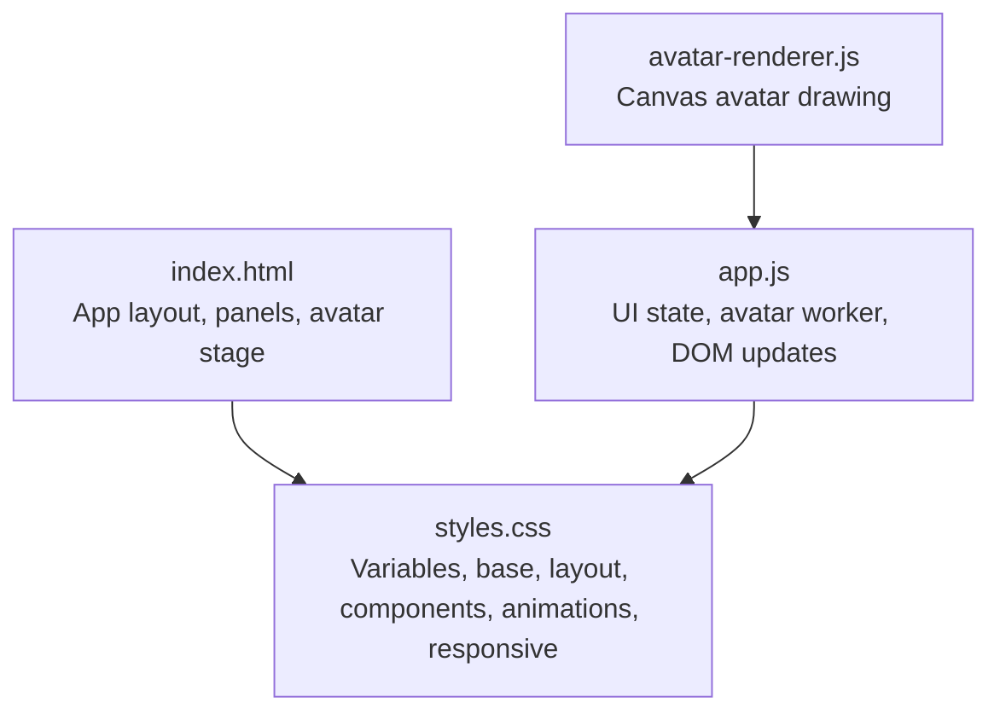
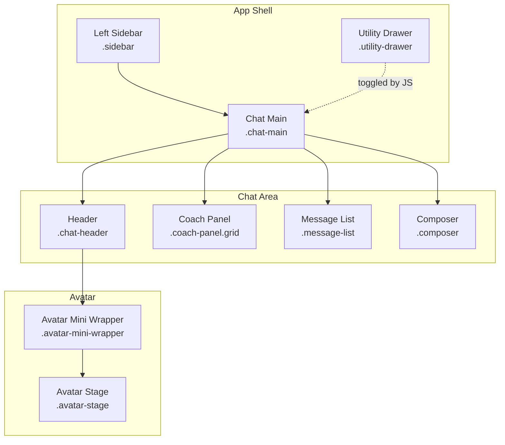
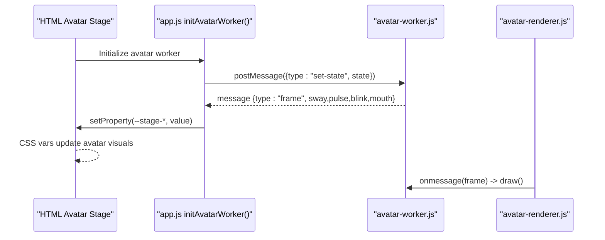
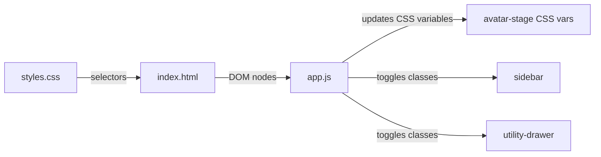

# CSS Styling and Animations

<cite>
**Referenced Files in This Document**
- [styles.css](file://frontend/assets/styles.css)
- [index.html](file://frontend/index.html)
- [app.js](file://frontend/scripts/app.js)
- [avatar-renderer.js](file://frontend/scripts/avatar-renderer.js)
</cite>

## Table of Contents
1. [Introduction](#introduction)
2. [Project Structure](#project-structure)
3. [Core Components](#core-components)
4. [Architecture Overview](#architecture-overview)
5. [Detailed Component Analysis](#detailed-component-analysis)
6. [Dependency Analysis](#dependency-analysis)
7. [Performance Considerations](#performance-considerations)
8. [Troubleshooting Guide](#troubleshooting-guide)
9. [Conclusion](#conclusion)
10. [Appendices](#appendices)

## Introduction
This document describes the Orbit Virtual Assistant’s CSS styling and animation system. It covers the color palette, typography hierarchy, spacing conventions, layout patterns (flexbox and CSS Grid), responsive breakpoints, theme variable usage, and micro-interactions. It also explains how the avatar expressions are driven by CSS custom properties and JavaScript, and how transitions and animations are implemented for a polished user experience.

## Project Structure
The styling system is centralized in a single stylesheet and integrated with HTML markup and JavaScript logic that updates CSS variables at runtime.

**Diagram sources**
- [index.html:11-327](file://frontend/index.html#L11-L327)
- [styles.css:1-1510](file://frontend/assets/styles.css#L1-L1510)
- [app.js:538-565](file://frontend/scripts/app.js#L538-L565)
- [avatar-renderer.js:1-106](file://frontend/scripts/avatar-renderer.js#L1-L106)

**Section sources**
- [index.html:11-327](file://frontend/index.html#L11-L327)
- [styles.css:1-1510](file://frontend/assets/styles.css#L1-L1510)

## Core Components
- CSS custom properties define theme tokens for colors, surfaces, shadows, radii, and transitions.
- Flexbox and CSS Grid are used for app layout, coach panel, and utility drawer grids.
- Micro-interactions include message entrance, mic pulse, hover states, and avatar expression updates.
- Responsive breakpoints adapt sidebar, coach grid, and header elements for smaller screens.

Key areas:
- Theme variables and tokens
- Layout containers (.app-layout, .sidebar, .chat-main, .utility-drawer)
- Message bubbles and tool events
- Composer input and action chips
- Avatar mini stage and expressions
- Utility drawer panels and forms
- Animations and responsive media queries

**Section sources**
- [styles.css:7-47](file://frontend/assets/styles.css#L7-L47)
- [styles.css:100-128](file://frontend/assets/styles.css#L100-L128)
- [styles.css:509-544](file://frontend/assets/styles.css#L509-L544)
- [styles.css:701-884](file://frontend/assets/styles.css#L701-L884)
- [styles.css:886-992](file://frontend/assets/styles.css#L886-L992)
- [styles.css:993-1151](file://frontend/assets/styles.css#L993-L1151)
- [styles.css:1319-1494](file://frontend/assets/styles.css#L1319-L1494)

## Architecture Overview
The UI is composed of three primary regions: left sidebar, main chat area, and right utility drawer. The avatar mini stage resides in the chat header and reflects runtime state via CSS variables. The coach panel appears conditionally in “Coach” mode and uses a CSS Grid for field layout.

**Diagram sources**
- [index.html:13-200](file://frontend/index.html#L13-L200)
- [styles.css:100-128](file://frontend/assets/styles.css#L100-L128)
- [styles.css:371-380](file://frontend/assets/styles.css#L371-L380)
- [styles.css:509-544](file://frontend/assets/styles.css#L509-L544)
- [styles.css:886-992](file://frontend/assets/styles.css#L886-L992)

## Detailed Component Analysis

### Color Palette and Tokens
- Sidebar (dark theme): background, surface, hover, active, muted text, borders.
- Main area: background, chat surface, ink text, muted text, light lines.
- Accent palette: primary accent and soft variant, warm accent and soft variant.
- UI tokens: border radii, header height, shadow tokens, transition duration/ease.

Usage pattern:
- Components reference tokens via var(--token-name) to maintain consistency across modes and panels.

Practical customization tips:
- Override :root tokens to change brand colors globally.
- Use accent-soft variants for hover states and focus rings.
- Keep contrast ratios for text and backgrounds consistent with --ink/--bg.

**Section sources**
- [styles.css:7-47](file://frontend/assets/styles.css#L7-L47)

### Typography Hierarchy
- Body and interface text sizes are established at the root level.
- Message bubbles and assistant content adjust heading sizes and spacing for readability.
- Monospace styles are applied for code blocks inside assistant messages.

Guidelines:
- Prefer relative units and rem/em equivalents where applicable.
- Maintain consistent line heights and paragraph spacing for long-form content.

**Section sources**
- [styles.css:55-63](file://frontend/assets/styles.css#L55-L63)
- [styles.css:1381-1424](file://frontend/assets/styles.css#L1381-L1424)

### Spacing Conventions
- Consistent gaps between interactive elements (buttons, chips, toggles).
- Padding scales around panels, lists, and cards.
- Scrollbar widths and thumb styling are standardized.

Patterns:
- Use gap and padding utilities (e.g., 6px, 8px, 12px, 14px) for consistent rhythm.
- Container paddings adapt for mobile responsiveness.

**Section sources**
- [styles.css:149-160](file://frontend/assets/styles.css#L149-L160)
- [styles.css:516-544](file://frontend/assets/styles.css#L516-L544)
- [styles.css:729-794](file://frontend/assets/styles.css#L729-L794)
- [styles.css:1220-1253](file://frontend/assets/styles.css#L1220-L1253)

### Layout: Flexbox and CSS Grid
- App shell uses flexbox for horizontal layout and vertical stacking within panels.
- Coach panel uses CSS Grid to arrange three fields in a compact responsive layout.
- Utility drawer panels use CSS Grid for quick action and practice grids.

Responsive layout:
- On small screens, the coach grid switches to a single column.
- Utility drawer becomes a fixed overlay on narrow widths.

**Section sources**
- [styles.css:100-128](file://frontend/assets/styles.css#L100-L128)
- [styles.css:516-520](file://frontend/assets/styles.css#L516-L520)
- [styles.css:1146-1150](file://frontend/assets/styles.css#L1146-L1150)
- [styles.css:1440-1494](file://frontend/assets/styles.css#L1440-L1494)

### Component-Specific Patterns
- Sidebar navigation items and dropdown menus use hover-triggered opacity and transitions.
- Message bubbles apply a subtle entrance animation and contextual styling per role.
- Composer toggles and chips reflect active states with color and background tokens.
- Utility drawer forms and small buttons follow consistent focus and hover behaviors.

**Section sources**
- [styles.css:212-278](file://frontend/assets/styles.css#L212-L278)
- [styles.css:579-680](file://frontend/assets/styles.css#L579-L680)
- [styles.css:729-794](file://frontend/assets/styles.css#L729-L794)
- [styles.css:1045-1151](file://frontend/assets/styles.css#L1045-L1151)

### Avatar Animation System
The avatar mini stage displays facial expressions and ambient effects synchronized with runtime states. The JavaScript avatar worker posts animation frame data that updates CSS custom properties on the avatar stage element.

Key behaviors:
- Pulse effect via --stage-pulse.
- Blink via --stage-blink.
- Mouth movement via --stage-mouth.
- Sway via --stage-sway (used in the mini stage for subtle motion).

**Diagram sources**
- [app.js:538-565](file://frontend/scripts/app.js#L538-L565)
- [avatar-renderer.js:19-30](file://frontend/scripts/avatar-renderer.js#L19-L30)
- [styles.css:886-992](file://frontend/assets/styles.css#L886-L992)

**Section sources**
- [app.js:538-565](file://frontend/scripts/app.js#L538-L565)
- [avatar-renderer.js:19-30](file://frontend/scripts/avatar-renderer.js#L19-L30)
- [styles.css:886-992](file://frontend/assets/styles.css#L886-L992)

### Button Hover Effects and Transitions
- Buttons and icon buttons use a consistent transition duration/ease token.
- Hover states adjust background, color, and sometimes box-shadow for affordance.
- Disabled states reduce opacity and cursor.

Examples:
- Composer send button hover and disabled states.
- Toggle chips and ghost buttons reflect active and hover states.

**Section sources**
- [styles.css:70-84](file://frontend/assets/styles.css#L70-L84)
- [styles.css:823-835](file://frontend/assets/styles.css#L823-L835)
- [styles.css:749-758](file://frontend/assets/styles.css#L749-L758)
- [styles.css:1134-1144](file://frontend/assets/styles.css#L1134-L1144)

### Micro-interactions and Animations
- Message entrance: a subtle slide-up and fade-in.
- Mic pulse: rhythmic pulsing ring during voice capture.
- Dropdown menus and hover-triggered actions use short transitions.
- Focus states for inputs and buttons use accent colors and soft shadows.

Animation keyframes:
- msgIn: slide and fade for new messages.
- micPulse: radial wave for microphone activity.

**Section sources**
- [styles.css:579-589](file://frontend/assets/styles.css#L579-L589)
- [styles.css:817-821](file://frontend/assets/styles.css#L817-L821)
- [styles.css:1320-1334](file://frontend/assets/styles.css#L1320-L1334)

### Responsive Breakpoints and Adaptive Layout
- Utility drawer becomes fixed overlay on narrow screens.
- Sidebar becomes fixed and overlays content on small widths.
- Coach grid stacks to a single column.
- Header elements hide or compress on smaller viewports.
- Toggle chips’ labels disappear on very narrow widths.

Breakpoints:
- 1024px: utility drawer overlay and coach grid single-column.
- 768px: sidebar overlay, header actions hidden, message padding reduced.
- 480px: toggle chip labels hidden, message bubble width constrained.

**Section sources**
- [styles.css:1440-1494](file://frontend/assets/styles.css#L1440-L1494)

### Dark/Light Theme Support
- The existing palette is optimized for a dark sidebar and light main content.
- To add a true dark theme, override :root tokens to invert background and text colors while preserving accent contrasts.
- Ensure sufficient contrast for text and interactive elements across both palettes.

[No sources needed since this section provides general guidance]

### Browser Compatibility and Prefixes
- CSS variables are widely supported in modern browsers.
- CSS Grid and Flexbox are broadly supported; ensure fallbacks if targeting older environments.
- Animations and transforms are well supported; test on lower-end devices for performance.

[No sources needed since this section provides general guidance]

## Dependency Analysis
The avatar stage depends on JavaScript to update CSS custom properties. The app layout toggles classes to show/hide panels, which drive transitions and visibility.

**Diagram sources**
- [app.js:538-565](file://frontend/scripts/app.js#L538-L565)
- [styles.css:100-128](file://frontend/assets/styles.css#L100-L128)
- [styles.css:994-1011](file://frontend/assets/styles.css#L994-L1011)
- [index.html:11-327](file://frontend/index.html#L11-L327)

**Section sources**
- [app.js:538-565](file://frontend/scripts/app.js#L538-L565)
- [styles.css:100-128](file://frontend/assets/styles.css#L100-L128)
- [styles.css:994-1011](file://frontend/assets/styles.css#L994-L1011)
- [index.html:11-327](file://frontend/index.html#L11-L327)

## Performance Considerations
- Prefer transform and opacity for animations to leverage GPU acceleration.
- Keep keyframes simple; limit expensive properties like width/height in loops.
- Use CSS variables for shared timing and easing to minimize repaints.
- Avoid layout thrashing by batching DOM reads/writes when updating avatar variables.
- Test animations on low-power devices and reduce frequency or intensity if needed.

[No sources needed since this section provides general guidance]

## Troubleshooting Guide
Common issues and resolutions:
- Avatar not animating: verify the avatar worker is initialized and messages are received; check that CSS variables are being set on the avatar stage element.
- Mic button pulse not visible: ensure the active class is applied and the micPulse keyframes are present.
- Sidebar not hiding: confirm the sidebar-collapsed class is toggling and CSS transitions are not overridden.
- Utility drawer not opening: verify the drawer-open class is toggled and width/min-width transitions are intact.
- Scrollbars inconsistent: ensure custom scrollbar styles are applied in the relevant containers.

**Section sources**
- [app.js:538-565](file://frontend/scripts/app.js#L538-L565)
- [styles.css:1331-1334](file://frontend/assets/styles.css#L1331-L1334)
- [styles.css:1219-1253](file://frontend/assets/styles.css#L1219-L1253)

## Conclusion
The Orbit Virtual Assistant employs a cohesive CSS system centered on custom properties for theme consistency, robust layout primitives (flexbox and grid), and expressive micro-interactions. The avatar animation pipeline integrates tightly with JavaScript to deliver responsive, state-driven visuals. With thoughtful overrides and attention to performance, the system supports easy customization and strong cross-device adaptability.

[No sources needed since this section summarizes without analyzing specific files]

## Appendices

### Practical Customization Examples
- Change brand accents: override --accent and --accent-soft in :root.
- Adjust radii and shadows: modify --radius, --radius-lg, --radius-xl, and shadow tokens.
- Tune transitions: edit --transition for global easing/duration.
- Customize avatar expressions: adjust CSS variable thresholds in JavaScript that update --stage-* values.

**Section sources**
- [styles.css:7-47](file://frontend/assets/styles.css#L7-L47)
- [app.js:548-551](file://frontend/scripts/app.js#L548-L551)