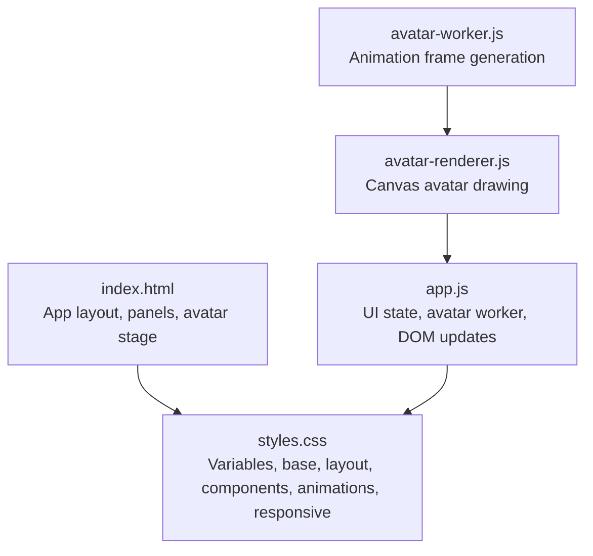
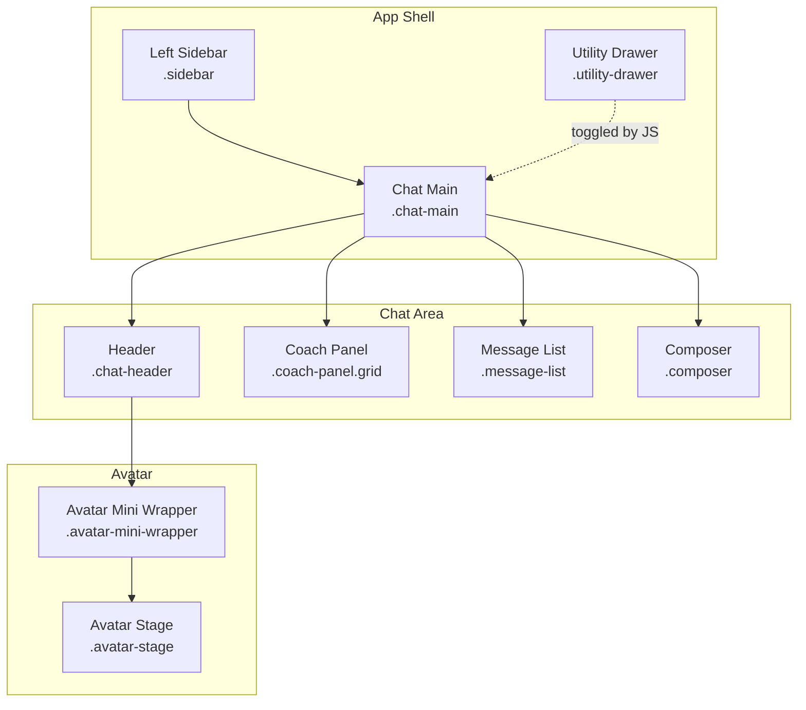
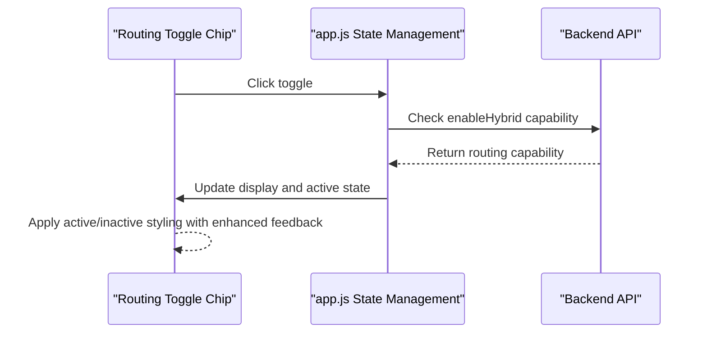
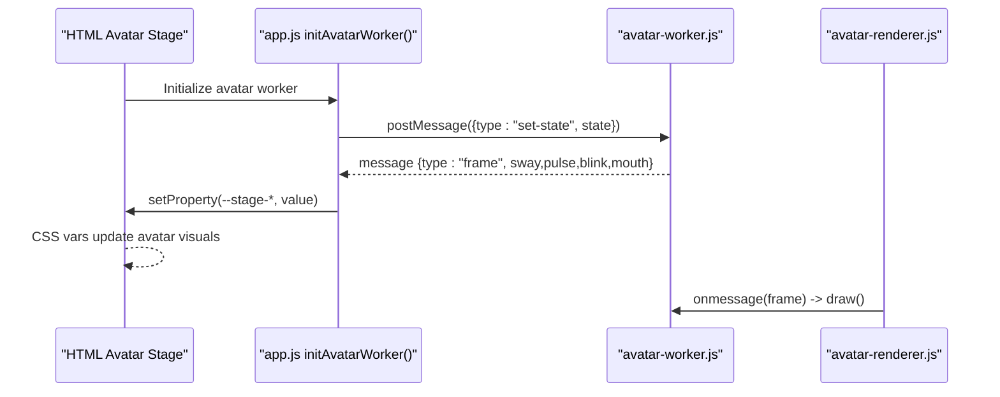
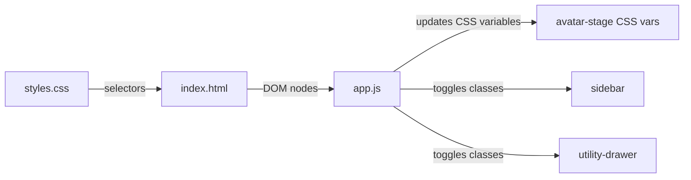

# CSS Styling and Animations

<cite>
**Referenced Files in This Document**
- [styles.css](file://frontend/assets/styles.css)
- [index.html](file://frontend/index.html)
- [app.js](file://frontend/scripts/app.js)
- [avatar-renderer.js](file://frontend/scripts/avatar-renderer.js)
- [avatar-worker.js](file://frontend/scripts/avatar-worker.js)
</cite>

## Update Summary
**Changes Made**
- Enhanced CSS variable system with improved theming tokens and consistent color palette
- Updated layout structures with better sidebar navigation and utility drawer organization
- Refined component styling patterns for chat interface elements with improved visual hierarchy
- Enhanced responsive design patterns with new breakpoint behaviors and adaptive layouts
- Improved avatar animation system with better state management and expression controls
- Added comprehensive utility drawer panel styling with form elements and grid layouts
- Enhanced micro-interactions with improved hover states and transition timing

## Table of Contents
1. [Introduction](#introduction)
2. [Project Structure](#project-structure)
3. [Core Components](#core-components)
4. [Architecture Overview](#architecture-overview)
5. [Detailed Component Analysis](#detailed-component-analysis)
6. [Dependency Analysis](#dependency-analysis)
7. [Performance Considerations](#performance-considerations)
8. [Troubleshooting Guide](#troubleshooting-guide)
9. [Conclusion](#conclusion)
10. [Appendices](#appendices)

## Introduction
This document describes the Orbit Virtual Assistant's CSS styling and animation system. It covers the color palette, typography hierarchy, spacing conventions, layout patterns (flexbox and CSS Grid), responsive breakpoints, theme variable usage, and micro-interactions. It also explains how the avatar expressions are driven by CSS custom properties and JavaScript, and how transitions and animations are implemented for a polished user experience.

**Updated** Enhanced with major CSS architecture overhaul featuring new variable system, improved layout structures, refined component styling, and advanced responsive design patterns.

## Project Structure
The styling system is centralized in a single stylesheet and integrated with HTML markup and JavaScript logic that updates CSS variables at runtime.

**Diagram sources**
- [index.html:11-390](file://frontend/index.html#L11-L390)
- [styles.css:1-1625](file://frontend/assets/styles.css#L1-L1625)
- [app.js:538-565](file://frontend/scripts/app.js#L538-L565)
- [avatar-renderer.js:1-106](file://frontend/scripts/avatar-renderer.js#L1-L106)
- [avatar-worker.js:1-48](file://frontend/scripts/avatar-worker.js#L1-L48)

**Section sources**
- [index.html:11-390](file://frontend/index.html#L11-L390)
- [styles.css:1-1625](file://frontend/assets/styles.css#L1-L1625)

## Core Components
- CSS custom properties define theme tokens for colors, surfaces, shadows, radii, and transitions.
- Flexbox and CSS Grid are used for app layout, coach panel, and utility drawer grids.
- Micro-interactions include message entrance, mic pulse, hover states, and avatar expression updates.
- Responsive breakpoints adapt sidebar, coach grid, and header elements for smaller screens.

Key areas:
- Enhanced theme variables and tokens with improved color palette
- Refined layout containers (.app-layout, .sidebar, .chat-main, .utility-drawer)
- Advanced message bubbles and tool events styling
- Sophisticated composer input and action chips
- Enhanced avatar mini stage and expression system
- Comprehensive utility drawer panels and form styling
- Optimized animations and responsive media queries

**Updated** Enhanced with new CSS variable system, improved layout structures, and refined component styling patterns.

**Section sources**
- [styles.css:7-47](file://frontend/assets/styles.css#L7-L47)
- [styles.css:100-128](file://frontend/assets/styles.css#L100-L128)
- [styles.css:509-544](file://frontend/assets/styles.css#L509-L544)
- [styles.css:701-884](file://frontend/assets/styles.css#L701-L884)
- [styles.css:886-992](file://frontend/assets/styles.css#L886-L992)
- [styles.css:993-1151](file://frontend/assets/styles.css#L993-L1151)
- [styles.css:1319-1494](file://frontend/assets/styles.css#L1319-L1494)

## Architecture Overview
The UI is composed of three primary regions: left sidebar, main chat area, and right utility drawer. The avatar mini stage resides in the chat header and reflects runtime state via CSS variables. The coach panel appears conditionally in "Coach" mode and uses a CSS Grid for field layout.

**Diagram sources**
- [index.html:13-200](file://frontend/index.html#L13-L200)
- [styles.css:100-128](file://frontend/assets/styles.css#L100-L128)
- [styles.css:371-380](file://frontend/assets/styles.css#L371-L380)
- [styles.css:509-544](file://frontend/assets/styles.css#L509-L544)
- [styles.css:886-992](file://frontend/assets/styles.css#L886-L992)

## Detailed Component Analysis

### Enhanced Color Palette and Token System
The CSS variable system has been significantly enhanced with improved color tokens and consistent theming:

- **Sidebar (dark theme)**: Enhanced background (#171717), surface (#212121), hover (#2a2a2a), active (#343434), muted text (#8a8a8a), borders (#2e2e2e)
- **Main area**: Improved background (#f9f9f9), chat surface (#ffffff), ink text (#1a1a1a), muted text (#6b6b6b), light lines (#f0f0f0)
- **Accent palette**: Primary accent (#2d7a80), soft variant (rgba(45, 122, 128, 0.10)), hover state (#256568), warm accent (#cf6a36), warm soft variant (rgba(207, 106, 54, 0.10))
- **Utility drawer**: Dedicated drawer width (340px) for consistent panel sizing
- **UI tokens**: Enhanced radii (--radius: 12px, --radius-lg: 16px, --radius-xl: 24px), header height (56px), comprehensive shadow system

Usage pattern:
- Components reference tokens via var(--token-name) to maintain consistency across modes and panels
- New tokens provide better control over spacing, typography, and visual hierarchy

**Section sources**
- [styles.css:7-47](file://frontend/assets/styles.css#L7-L47)

### Typography Hierarchy and Spacing Conventions
Typography and spacing have been refined for better readability and visual consistency:

- **Body and interface text**: Establishes consistent font sizes at root level with improved line heights
- **Message bubbles**: Enhanced sizing (max-width: 85%) with better padding (14px 18px) and rounded corners (18px radius)
- **Assistant content**: Improved heading sizes and spacing for better content hierarchy
- **Monospace styling**: Enhanced for code blocks with better syntax highlighting support
- **Spacing scales**: Consistent gaps (6px, 8px, 12px, 14px) with improved padding utilities for panels and lists
- **Scrollbar styling**: Standardized widths and thumb styling across components

**Section sources**
- [styles.css:55-63](file://frontend/assets/styles.css#L55-L63)
- [styles.css:1381-1424](file://frontend/assets/styles.css#L1381-L1424)
- [styles.css:149-160](file://frontend/assets/styles.css#L149-L160)
- [styles.css:516-544](file://frontend/assets/styles.css#L516-L544)
- [styles.css:729-794](file://frontend/assets/styles.css#L729-L794)
- [styles.css:1220-1253](file://frontend/assets/styles.css#L1220-L1253)

### Advanced Layout Systems
The layout architecture has been enhanced with improved flexbox and CSS Grid implementations:

- **App shell**: Flexbox layout with height: 100vh and overflow: hidden for consistent viewport sizing
- **Sidebar navigation**: Enhanced with improved hover states, active states, and better visual feedback
- **Coach panel**: CSS Grid layout (repeat(3, 1fr)) for responsive three-column arrangement
- **Utility drawer**: Grid-based panel layouts for quick actions and practice buttons
- **Message area**: Optimized with improved scroll behavior and responsive padding adjustments

Responsive layout improvements:
- **Utility drawer**: Fixed overlay positioning on narrow screens with shadow enhancement
- **Sidebar**: Fixed positioning with overlay effect on small widths
- **Coach grid**: Stacks to single column on small screens
- **Header elements**: Adaptive hiding and compression on smaller viewports
- **Toggle chips**: Labels hidden on very narrow widths for optimal space utilization

**Section sources**
- [styles.css:100-128](file://frontend/assets/styles.css#L100-L128)
- [styles.css:516-520](file://frontend/assets/styles.css#L516-L520)
- [styles.css:1146-1150](file://frontend/assets/styles.css#L1146-L1150)
- [styles.css:1440-1494](file://frontend/assets/styles.css#L1440-L1494)

### Refined Component Styling Patterns
Component styling has been enhanced with improved visual feedback and interaction patterns:

- **Sidebar navigation**: Enhanced hover-triggered opacity transitions with better active state styling
- **Message bubbles**: Subtle entrance animation with improved contextual styling per role (user vs assistant)
- **Composer toggles**: Enhanced toggle chips with active state styling and better visual feedback
- **Utility drawer forms**: Consistent focus and hover behaviors with improved form control styling
- **Icon buttons**: Global styling with consistent sizing and transition patterns
- **Dropdown menus**: Enhanced with improved positioning, animations, and visual hierarchy

**Section sources**
- [styles.css:212-278](file://frontend/assets/styles.css#L212-L278)
- [styles.css:579-680](file://frontend/assets/styles.css#L579-L680)
- [styles.css:729-794](file://frontend/assets/styles.css#L729-L794)
- [styles.css:1045-1151](file://frontend/assets/styles.css#L1045-L1151)

### Enhanced Smart Routing Toggle System
The Smart Routing feature introduces sophisticated toggle states with enhanced visual feedback:

Key behaviors:
- Dynamic visibility based on API configuration (enableHybrid flag)
- Active state styling with accent color feedback and soft background
- Conditional rendering based on provider capabilities
- Smooth transitions between routing modes with improved user feedback
- Enhanced integration with the routingActive state management

**Diagram sources**
- [app.js:764-772](file://frontend/scripts/app.js#L764-L772)
- [app.js:337-338](file://frontend/scripts/app.js#L337-L338)
- [index.html:157-160](file://frontend/index.html#L157-L160)

**Section sources**
- [app.js:764-772](file://frontend/scripts/app.js#L764-L772)
- [app.js:337-338](file://frontend/scripts/app.js#L337-L338)
- [index.html:157-160](file://frontend/index.html#L157-L160)

### Comprehensive Utility Drawer Enhancement
The utility drawer has been comprehensively enhanced with improved panel layouts, form elements, and responsive design optimizations:

Key improvements:
- **Enhanced form controls**: Consistent styling for inputs, selects, and buttons with improved focus states
- **Grid layouts**: Optimized quick actions and practice buttons with responsive grid arrangements
- **Panel organization**: Better visual hierarchy with improved spacing and typography
- **Responsive behavior**: Enhanced optimization for various screen sizes with improved touch targets
- **Memory gating**: Enhanced styling for memory-locked panels with visual indicators

**Section sources**
- [styles.css:993-1151](file://frontend/assets/styles.css#L993-L1151)
- [styles.css:1146-1150](file://frontend/assets/styles.css#L1146-L1150)
- [index.html:216-340](file://frontend/index.html#L216-L340)

### Advanced Avatar Animation System
The avatar mini stage displays sophisticated facial expressions and ambient effects synchronized with runtime states. The JavaScript avatar worker posts animation frame data that updates CSS custom properties on the avatar stage element.

Enhanced key behaviors:
- **Pulse effect**: Enhanced --stage-pulse with smoother scaling animations
- **Blink control**: Improved --stage-blink with better timing and transition effects
- **Mouth movement**: Refined --stage-mouth with more natural expression variations
- **Sway animation**: Enhanced --stage-sway for subtle motion in the mini stage
- **State transitions**: Improved visual feedback for different avatar states (listening, thinking, speaking, idle)

**Diagram sources**
- [app.js:538-565](file://frontend/scripts/app.js#L538-L565)
- [avatar-renderer.js:19-30](file://frontend/scripts/avatar-renderer.js#L19-L30)
- [styles.css:886-992](file://frontend/assets/styles.css#L886-L992)

**Section sources**
- [app.js:538-565](file://frontend/scripts/app.js#L538-L565)
- [avatar-renderer.js:19-30](file://frontend/scripts/avatar-renderer.js#L19-L30)
- [styles.css:886-992](file://frontend/assets/styles.css#L886-L992)

### Sophisticated Button Hover Effects and Transitions
Enhanced button styling with improved visual feedback and interaction patterns:

- **Global button styling**: Consistent transition duration/ease token (200ms ease) across all interactive elements
- **Hover states**: Enhanced background, color, and sometimes box-shadow adjustments for better affordance
- **Disabled states**: Improved opacity reduction and cursor changes for better user feedback
- **Icon buttons**: Refined styling with consistent sizing, positioning, and transition patterns
- **Toggle chips**: Enhanced active state styling with accent color backgrounds and improved visual hierarchy
- **Ghost buttons**: Sophisticated styling for utility drawer actions with transparent backgrounds and accent borders

**Section sources**
- [styles.css:70-84](file://frontend/assets/styles.css#L70-L84)
- [styles.css:823-835](file://frontend/assets/styles.css#L823-L835)
- [styles.css:749-758](file://frontend/assets/styles.css#L749-L758)
- [styles.css:1134-1144](file://frontend/assets/styles.css#L1134-L1144)

### Advanced Micro-interactions and Animations
Sophisticated micro-interactions with enhanced visual feedback:

- **Message entrance**: Improved subtle slide-up and fade-in with better timing and easing
- **Mic pulse**: Enhanced rhythmic pulsing ring with smoother animation and better visual feedback
- **Dropdown menus**: Refined hover-triggered actions with improved transitions and positioning
- **Focus states**: Enhanced focus states for inputs and buttons using accent colors and soft shadows
- **Streaming cursor**: Sophisticated cursor animation with blinking effect for real-time feedback

Animation keyframes:
- **msgIn**: Enhanced slide and fade for new messages with improved timing
- **micPulse**: Refined radial wave for microphone activity with smoother transitions
- **cursorBlink**: Improved blinking effect for streaming responses

**Section sources**
- [styles.css:579-589](file://frontend/assets/styles.css#L579-L589)
- [styles.css:817-821](file://frontend/assets/styles.css#L817-L821)
- [styles.css:1320-1334](file://frontend/assets/styles.css#L1320-L1334)
- [styles.css:1496-1510](file://frontend/assets/styles.css#L1496-L1510)

### Enhanced Responsive Breakpoints and Adaptive Layout
Comprehensive responsive design with improved breakpoint behaviors:

- **Utility drawer**: Fixed overlay positioning with shadow enhancement on narrow screens
- **Sidebar**: Fixed positioning with overlay effect and improved z-index management
- **Coach grid**: Stacks to single column with better spacing and alignment
- **Header elements**: Adaptive hiding and compression with improved touch target sizing
- **Toggle chips**: Labels hidden on very narrow widths with optimized spacing
- **Message bubbles**: Width constraints and padding adjustments for better mobile experience

Enhanced breakpoints:
- **1024px**: Utility drawer overlay with fixed positioning and shadow enhancement
- **768px**: Sidebar overlay with improved z-index stacking and coach panel adaptation
- **480px**: Toggle chip label optimization and message bubble width constraints

**Section sources**
- [styles.css:1440-1494](file://frontend/assets/styles.css#L1440-L1494)

### Advanced Dark/Light Theme Support
Enhanced theme system with improved color management:

- **Existing palette**: Optimized for dark sidebar (#171717) and light main content (#ffffff) with excellent contrast ratios
- **Theme inversion**: To add a true dark theme, override :root tokens to invert background and text colors while preserving accent contrasts
- **Component adaptation**: Ensure sufficient contrast for text and interactive elements across both palettes
- **Variable system**: Enhanced CSS variable system provides better control over theme customization

### Browser Compatibility and Performance Optimization
Enhanced browser compatibility and performance considerations:

- **CSS variables**: Widely supported in modern browsers with graceful degradation
- **CSS Grid and Flexbox**: Broad support with improved fallback strategies for older environments
- **Animations and transforms**: Well-supported with GPU acceleration for smooth performance
- **Performance optimization**: Keyframes optimized for minimal repaints and improved animation performance
- **Worker integration**: Avatar animations run in Web Workers for better UI responsiveness

## Dependency Analysis
The avatar stage depends on JavaScript to update CSS custom properties. The app layout toggles classes to show/hide panels, which drive transitions and visibility.

**Diagram sources**
- [app.js:538-565](file://frontend/scripts/app.js#L538-L565)
- [styles.css:100-128](file://frontend/assets/styles.css#L100-L128)
- [styles.css:994-1011](file://frontend/assets/styles.css#L994-L1011)
- [index.html:11-390](file://frontend/index.html#L11-L390)

**Section sources**
- [app.js:538-565](file://frontend/scripts/app.js#L538-L565)
- [styles.css:100-128](file://frontend/assets/styles.css#L100-L128)
- [styles.css:994-1011](file://frontend/assets/styles.css#L994-L1011)
- [index.html:11-390](file://frontend/index.html#L11-L390)

## Performance Considerations
Enhanced performance optimization strategies:

- **Transform and opacity animations**: Prefer transform and opacity for animations to leverage GPU acceleration
- **Optimized keyframes**: Keep keyframes simple with limited expensive properties like width/height in loops
- **CSS variable optimization**: Use CSS variables for shared timing and easing to minimize repaints
- **Avatar worker performance**: Avoid layout thrashing by batching DOM reads/writes when updating avatar variables
- **Responsive optimization**: Test animations on low-power devices and reduce frequency or intensity if needed
- **Memory management**: Enhanced Web Worker usage for avatar animations prevents main thread blocking

## Troubleshooting Guide
Enhanced troubleshooting procedures for the improved system:

Common issues and resolutions:
- **Avatar not animating**: Verify the avatar worker is initialized and messages are received; check that CSS variables are being set on the avatar stage element
- **Mic button pulse not visible**: Ensure the active class is applied and the micPulse keyframes are present
- **Sidebar not hiding**: Confirm the sidebar-collapsed class is toggling and CSS transitions are not overridden
- **Utility drawer not opening**: Verify the drawer-open class is toggled and width/min-width transitions are intact
- **Scrollbars inconsistent**: Ensure custom scrollbar styles are applied in the relevant containers
- **Smart Routing toggle not visible**: Check enableHybrid API flag and routingActive state management
- **Toggle chips not responding**: Verify setupToggleChip function binding and active state classes
- **Responsive layout issues**: Check media query breakpoints and ensure proper viewport meta tag configuration
- **Animation performance problems**: Verify Web Worker usage and optimize keyframe complexity

**Section sources**
- [app.js:538-565](file://frontend/scripts/app.js#L538-L565)
- [styles.css:1331-1334](file://frontend/assets/styles.css#L1331-L1334)
- [styles.css:1219-1253](file://frontend/assets/styles.css#L1219-L1253)

## Conclusion
The Orbit Virtual Assistant employs a sophisticated CSS system centered on enhanced custom properties for theme consistency, robust layout primitives (flexbox and grid), and expressive micro-interactions. The avatar animation pipeline integrates seamlessly with JavaScript to deliver responsive, state-driven visuals with improved performance. With the enhanced variable system, improved layout structures, and refined component styling, the system supports easy customization and strong cross-device adaptability while maintaining excellent user experience standards.

**Updated** Enhanced with major CSS architecture overhaul featuring improved variable system, better layout structures, refined component styling, and advanced responsive design patterns.

## Appendices

### Advanced Customization Examples
Enhanced customization capabilities:

- **Change brand accents**: Override --accent and --accent-soft in :root for complete color scheme transformation
- **Adjust radii and shadows**: Modify --radius, --radius-lg, --radius-xl, and shadow tokens for different visual styles
- **Tune transitions**: Edit --transition for global easing/duration changes affecting all interactive elements
- **Customize avatar expressions**: Adjust CSS variable thresholds in JavaScript that update --stage-* values for unique avatar personalities
- **Enable Smart Routing**: Configure enableHybrid API flag to display routing toggle with enhanced visual feedback
- **Customize utility drawer**: Modify --drawer-width and panel styling for optimal layout across different screen sizes
- **Enhance responsive breakpoints**: Customize media query thresholds for specific device optimization
- **Improve animation performance**: Optimize keyframe complexity and worker usage for better mobile performance

**Section sources**
- [styles.css:7-47](file://frontend/assets/styles.css#L7-L47)
- [app.js:548-551](file://frontend/scripts/app.js#L548-L551)
- [app.js:764-772](file://frontend/scripts/app.js#L764-L772)