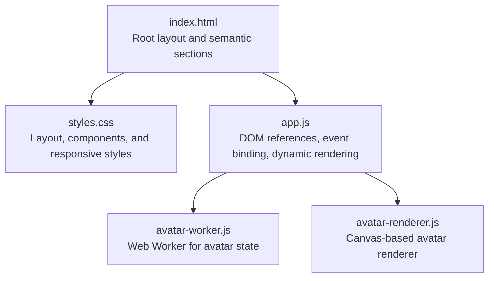
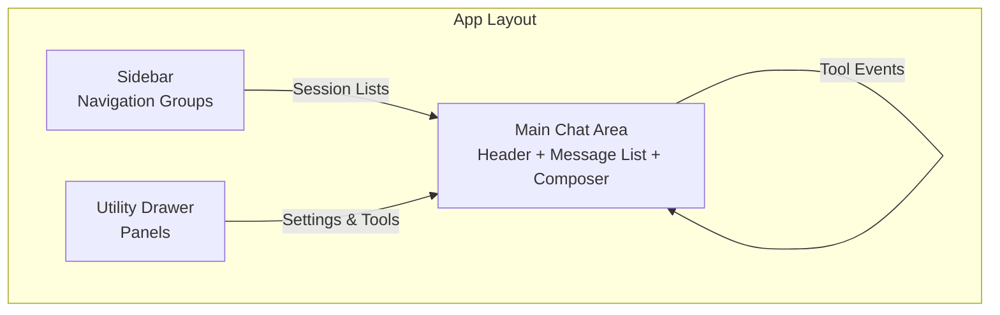
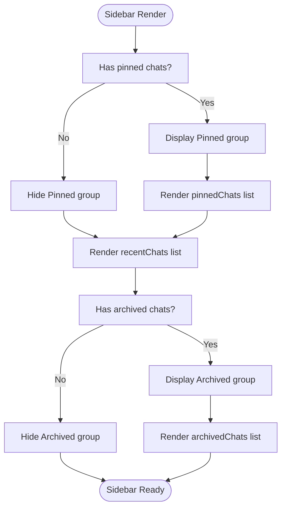
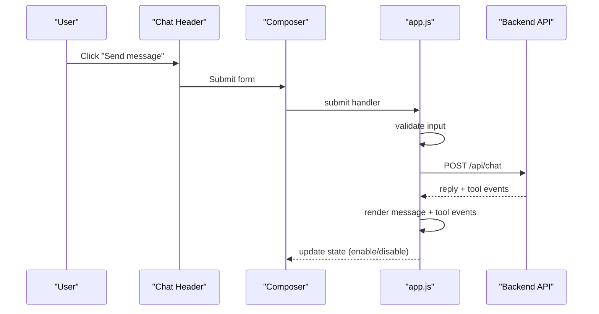
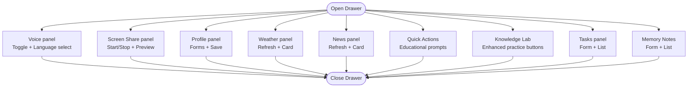
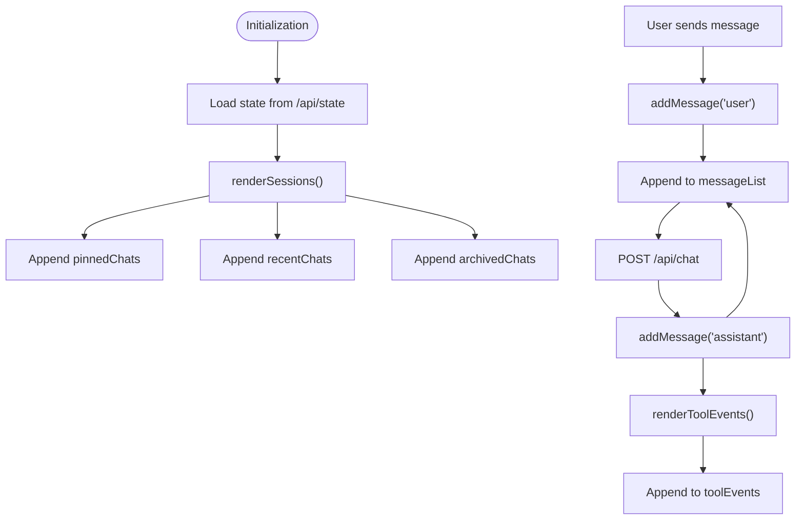
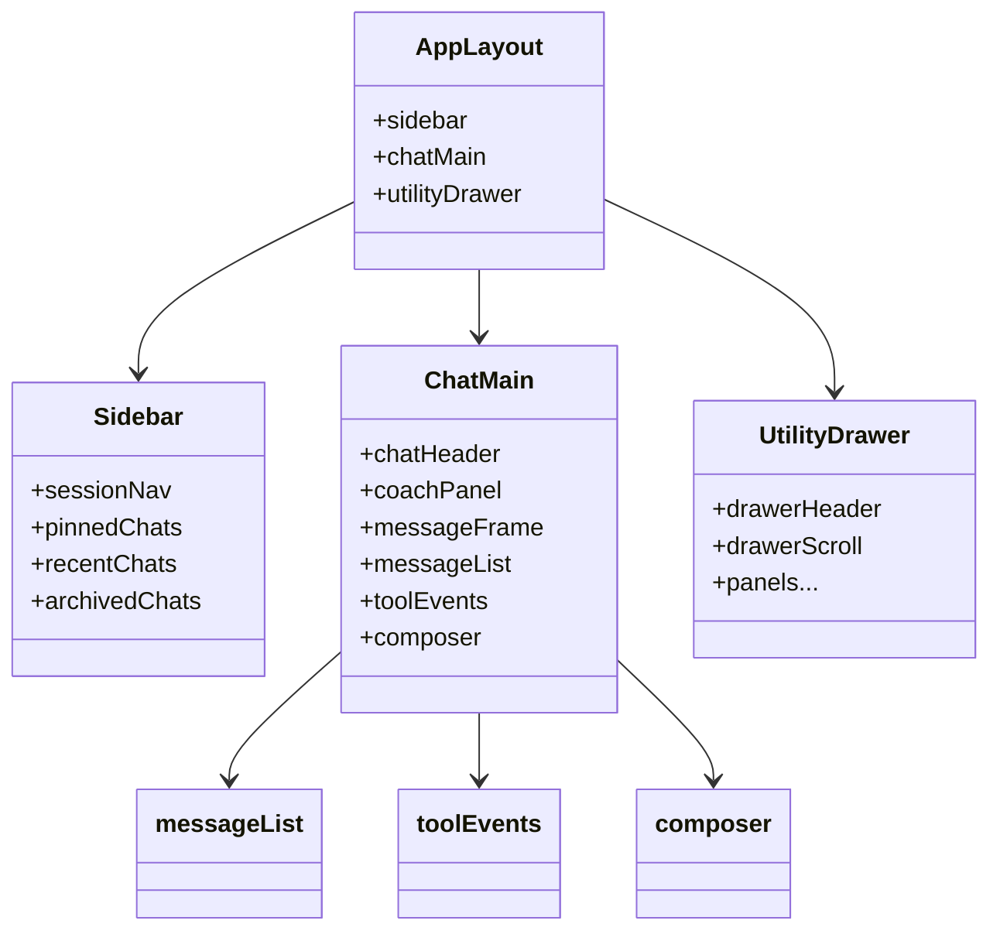
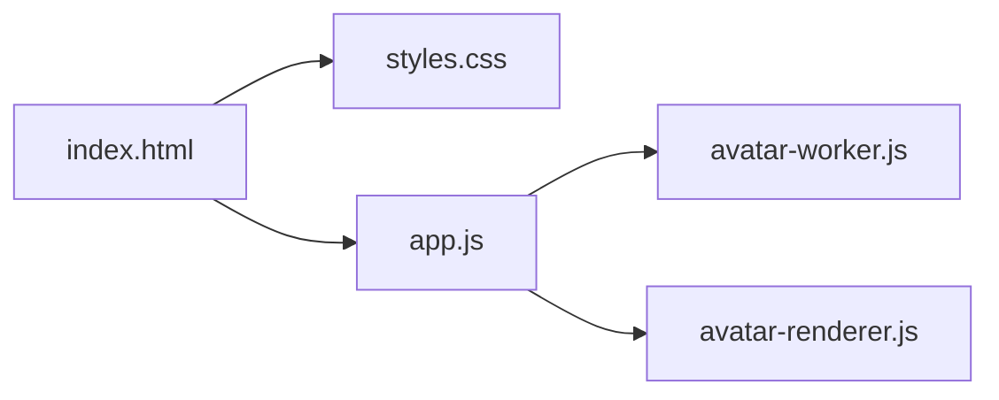

# HTML Structure and Semantic Markup

<cite>
**Referenced Files in This Document**
- [index.html](file://frontend/index.html)
- [app.js](file://frontend/scripts/app.js)
- [styles.css](file://frontend/assets/styles.css)
- [avatar-worker.js](file://frontend/scripts/avatar-worker.js)
- [avatar-renderer.js](file://frontend/scripts/avatar-renderer.js)
- [README.md](file://README.md)
</cite>

## Update Summary
**Changes Made**
- Updated Smart Routing toggle button documentation with new hybrid mode functionality
- Added Quick Actions panel documentation with educational prompts
- Enhanced Knowledge Lab section with practice button improvements
- Updated frontend UI controls documentation to include new hybrid mode functionality
- Added new toggle chip components and their accessibility features

## Table of Contents
1. [Introduction](#introduction)
2. [Project Structure](#project-structure)
3. [Core Components](#core-components)
4. [Architecture Overview](#architecture-overview)
5. [Detailed Component Analysis](#detailed-component-analysis)
6. [Dependency Analysis](#dependency-analysis)
7. [Performance Considerations](#performance-considerations)
8. [Troubleshooting Guide](#troubleshooting-guide)
9. [Conclusion](#conclusion)
10. [Appendices](#appendices)

## Introduction
This document describes the HTML structure and semantic markup of the Orbit Virtual Assistant interface. It explains the overall layout architecture (app-layout container, sidebar navigation, main chat area, and utility drawer), the semantic organization (headers, navigation groups, message display areas, and forms), the SVG icon system, accessibility attributes, and keyboard navigation support. It also covers the component hierarchy from the root app-layout down to individual UI elements, dynamic content insertion points, browser compatibility considerations, and practical examples of HTML customization and DOM manipulation.

## Project Structure
The Orbit interface is composed of a single HTML page with embedded CSS and JavaScript. The HTML defines the layout and semantic sections; the CSS provides responsive styling and animations; the JavaScript manages state, DOM updates, and interactions.

**Diagram sources**
- [index.html:11-352](file://frontend/index.html#L11-L352)
- [styles.css:100-1570](file://frontend/assets/styles.css#L100-L1570)
- [app.js:89-196](file://frontend/scripts/app.js#L89-L196)
- [avatar-worker.js:1-48](file://frontend/scripts/avatar-worker.js#L1-L48)
- [avatar-renderer.js:1-106](file://frontend/scripts/avatar-renderer.js#L1-L106)

**Section sources**
- [index.html:11-352](file://frontend/index.html#L11-L352)
- [styles.css:100-1570](file://frontend/assets/styles.css#L100-L1570)
- [app.js:89-196](file://frontend/scripts/app.js#L89-L196)

## Core Components
The interface is organized around a responsive layout with three primary regions:
- Left sidebar: session navigation and informational badges
- Main chat area: header, coach panel, message list, tool events, composer, and disclaimers
- Right utility drawer: tools, settings, profile, weather, news, tasks, and notes

Key semantic sections and insertion points:
- Sidebar navigation groups for pinned, recent, and archived chats
- Message list container for dynamically appended message nodes
- Tool events container for dynamic tool activity indicators
- Utility drawer panels for settings, profile, weather, news, tasks, and notes

Accessibility and keyboard support:
- Buttons include titles and icons for affordances
- Voice input uses keyboard shortcuts (Ctrl+M, Control key)
- Focus management and disabled states are handled programmatically

**Section sources**
- [index.html:14-56](file://frontend/index.html#L14-L56)
- [index.html:59-200](file://frontend/index.html#L59-L200)
- [index.html:203-340](file://frontend/index.html#L203-L340)
- [app.js:137-138](file://frontend/scripts/app.js#L137-L138)
- [app.js:136-139](file://frontend/scripts/app.js#L136-L139)

## Architecture Overview
The HTML structure maps directly to the application's component hierarchy. The root app-layout container orchestrates the sidebar, main chat area, and utility drawer. The main chat area contains the header, coach panel, message list, tool events, and composer. The utility drawer contains multiple panels for tools and settings.

**Diagram sources**
- [index.html:11-352](file://frontend/index.html#L11-L352)

## Detailed Component Analysis

### Layout Container: app-layout
- Role: Root container orchestrating sidebar, main chat, and drawer
- Behavior: Toggles sidebar collapsed and drawer open states via CSS classes
- Accessibility: No explicit ARIA roles; relies on structural semantics

**Section sources**
- [index.html:11](file://frontend/index.html#L11)
- [styles.css:100-104](file://frontend/assets/styles.css#L100-L104)
- [app.js:494-509](file://frontend/scripts/app.js#L494-L509)

### Sidebar Navigation
- Structure: Header with new chat and collapse button; session-nav with grouped lists
- Groups: Pinned chats, Recent chats, Archived chats
- Interaction: Clicking items loads sessions; context menu appears on hover
- Accessibility: Hover-triggered dropdowns; focus-visible behavior managed by CSS

**Diagram sources**
- [index.html:26-44](file://frontend/index.html#L26-L44)
- [app.js:1153-1187](file://frontend/scripts/app.js#L1153-L1187)

**Section sources**
- [index.html:14-56](file://frontend/index.html#L14-L56)
- [app.js:1153-1187](file://frontend/scripts/app.js#L1153-L1187)

### Main Chat Area
- Header: Left (sidebar open, model badge), Center (mode switch), Right (avatar mini, stage status, session actions, utility toggle)
- Coach Panel: Visible only in Coach mode; contains topic, level, and language inputs
- Message Display Area: Scrollable message-list container
- Tool Events: Horizontal pill container for tool activity
- Composer: Input row with textarea, action buttons, and metadata (voice status, screen toggle, shortcuts)

**Diagram sources**
- [index.html:62-113](file://frontend/index.html#L62-L113)
- [index.html:116-139](file://frontend/index.html#L116-L139)
- [index.html:145-199](file://frontend/index.html#L145-L199)
- [app.js:409-416](file://frontend/scripts/app.js#L409-L416)
- [app.js:928-1087](file://frontend/scripts/app.js#L928-L1087)

**Section sources**
- [index.html:59-200](file://frontend/index.html#L59-L200)
- [app.js:137-138](file://frontend/scripts/app.js#L137-L138)
- [app.js:136-139](file://frontend/scripts/app.js#L136-L139)
- [app.js:409-416](file://frontend/scripts/app.js#L409-L416)
- [app.js:928-1087](file://frontend/scripts/app.js#L928-L1087)

### Utility Drawer
- Structure: Header with title and close button; scrollable panels for Voice, Screen Share, Profile, Weather, News, Quick Actions, Knowledge Lab, Tasks, and Memory Notes
- Interaction: Panels expand/collapse; forms submit to backend; buttons trigger actions

**Diagram sources**
- [index.html:203-340](file://frontend/index.html#L203-L340)
- [app.js:466-474](file://frontend/scripts/app.js#L466-L474)

**Section sources**
- [index.html:203-340](file://frontend/index.html#L203-L340)
- [app.js:466-474](file://frontend/scripts/app.js#L466-L474)

### SVG Icon System
- Icons are inline SVGs within buttons and UI elements
- Icons include new chat, collapse sidebar, menu, avatar, pin/archive/delete, tools, mic/send, close, and others
- Titles and aria-labels are used for accessibility affordances

Examples of icon usage:
- New chat button with SVG plus label
- Sidebar collapse button with SVG
- Pin/Archive/Delete session actions
- Utility toggle with gear icon
- Mic/send buttons with microphone and arrow icons

**Section sources**
- [index.html:17-23](file://frontend/index.html#L17-L23)
- [index.html:21-23](file://frontend/index.html#L21-L23)
- [index.html:97-105](file://frontend/index.html#L97-L105)
- [index.html:109-111](file://frontend/index.html#L109-L111)
- [index.html:179-184](file://frontend/index.html#L179-L184)
- [index.html:182-183](file://frontend/index.html#L182-L183)

### Accessibility Attributes and Keyboard Navigation
- Titles on interactive elements provide tooltips
- Voice input uses keyboard shortcuts:
  - Ctrl+M: Toggle Mode A (record-then-review)
  - Hold Control: Mode B (instant-send)
  - ESC: Cancel Mode A recording
- Disabled states are applied to inputs and buttons during processing
- Focus management occurs on form submission and input resizing

**Section sources**
- [index.html:17-23](file://frontend/index.html#L17-L23)
- [index.html:179-184](file://frontend/index.html#L179-L184)
- [app.js:733-790](file://frontend/scripts/app.js#L733-L790)
- [app.js:818-822](file://frontend/scripts/app.js#L818-L822)
- [app.js:1722-1727](file://frontend/scripts/app.js#L1722-L1727)

### Dynamic Content Insertion Points
- messageList: Dynamically appended article elements for user, assistant, and system messages
- toolEvents: Dynamically appended tool-pill spans
- session lists: Pinned, recent, and archived session lists
- Utility drawer lists: Weather, news, tasks, and notes lists

**Diagram sources**
- [app.js:902-926](file://frontend/scripts/app.js#L902-L926)
- [app.js:1153-1187](file://frontend/scripts/app.js#L1153-L1187)
- [app.js:1091-1139](file://frontend/scripts/app.js#L1091-L1139)
- [app.js:1141-1149](file://frontend/scripts/app.js#L1141-L1149)

**Section sources**
- [app.js:137-138](file://frontend/scripts/app.js#L137-L138)
- [app.js:136-139](file://frontend/scripts/app.js#L136-L139)
- [app.js:1153-1187](file://frontend/scripts/app.js#L1153-L1187)
- [app.js:1141-1149](file://frontend/scripts/app.js#L1141-L1149)
- [app.js:1091-1139](file://frontend/scripts/app.js#L1091-L1139)

### Component Hierarchy and Relationships
- app-layout contains:
  - sidebar (with session-nav and session-lists)
  - chat-main (with header, coach-panel, message-frame/message-list, tool-events, composer)
  - utility-drawer (with drawer-header and drawer-panel sections)

**Diagram sources**
- [index.html:11-352](file://frontend/index.html#L11-L352)

**Section sources**
- [index.html:11-352](file://frontend/index.html#L11-L352)

### Enhanced Composer Toggle Chips
The composer now includes several enhanced toggle chips for advanced functionality:

#### Smart Routing Toggle
- **Purpose**: Auto-upgrades model for complex tasks when enabled
- **State Management**: Controlled by `routingActive` in appState
- **Conditional Display**: Hidden if CLI configuration doesn't allow hybrid mode
- **Routing Mode**: Sends "dynamic" routing mode to backend when active

#### Quick Actions Panel
- **Purpose**: Educational prompts for common tasks
- **Features**: Four ghost buttons with predefined prompts
- **Capabilities**: Daily brief, news updates, screen reading, and personalized lessons
- **Screen Sharing**: Buttons with `data-needs-screen="true"` require active screen sharing

#### Knowledge Lab Enhancements
- **Purpose**: Advanced learning and practice tools
- **Features**: Four practice buttons with educational prompts
- **Capabilities**: Local docs quiz, screen explanation, ELI5 topics, and study roadmap generation
- **RAG Integration**: Automatically prepends topic context for local document searches

**Section sources**
- [index.html:157-183](file://frontend/index.html#L157-L183)
- [index.html:285-305](file://frontend/index.html#L285-L305)
- [app.js:408-429](file://frontend/scripts/app.js#L408-L429)
- [app.js:468-496](file://frontend/scripts/app.js#L468-L496)
- [app.js:969-977](file://frontend/scripts/app.js#L969-L977)

## Dependency Analysis
The HTML depends on CSS for layout and styling, and on JavaScript for dynamic behavior and DOM manipulation. The avatar system uses a Web Worker to compute state and a canvas renderer to draw frames.

**Diagram sources**
- [index.html:11-352](file://frontend/index.html#L11-L352)
- [styles.css:100-1570](file://frontend/assets/styles.css#L100-L1570)
- [app.js:89-196](file://frontend/scripts/app.js#L89-L196)
- [avatar-worker.js:1-48](file://frontend/scripts/avatar-worker.js#L1-L48)
- [avatar-renderer.js:1-106](file://frontend/scripts/avatar-renderer.js#L1-L106)

**Section sources**
- [index.html:11-352](file://frontend/index.html#L11-L352)
- [app.js:89-196](file://frontend/scripts/app.js#L89-L196)
- [avatar-worker.js:1-48](file://frontend/scripts/avatar-worker.js#L1-L48)
- [avatar-renderer.js:1-106](file://frontend/scripts/avatar-renderer.js#L1-L106)

## Performance Considerations
- Efficient DOM updates: messageList and toolEvents are cleared and repopulated as needed
- Scroll management: messageList autoscrolls to bottom after appending
- Debounced or throttled operations: avatar worker interval-based updates
- Responsive design: media queries adjust layout for smaller screens

## Troubleshooting Guide
Common issues and checks:
- Voice input not available: Verify browser support and permissions; check voice language select availability
- Sidebar not toggling: Confirm app-layout CSS classes are applied and persisted in localStorage
- Composer disabled: Ensure setComposerState is called to re-enable after processing
- Screen share not working: Check mediaDevices availability and permissions; verify preview canvas sizing
- Smart Routing toggle hidden: Check CLI configuration for hybrid mode enablement

**Section sources**
- [app.js:601-727](file://frontend/scripts/app.js#L601-L727)
- [app.js:494-509](file://frontend/scripts/app.js#L494-L509)
- [app.js:1722-1727](file://frontend/scripts/app.js#L1722-L1727)
- [app.js:1655-1697](file://frontend/scripts/app.js#L1655-L1697)
- [app.js:969-977](file://frontend/scripts/app.js#L969-L977)

## Conclusion
The Orbit Virtual Assistant interface is built with a clear semantic HTML structure, a cohesive component hierarchy, and robust JavaScript-driven dynamic content. The layout supports modern browsers with responsive design, while the SVG icon system and accessibility attributes enhance usability. The utility drawer and main chat area provide comprehensive tooling and messaging capabilities, with dynamic insertion points enabling flexible content updates. The enhanced Smart Routing toggle, Quick Actions panel, and Knowledge Lab improvements demonstrate the system's commitment to educational AI assistance and intelligent task automation.

## Appendices

### Browser Compatibility and Progressive Enhancement
- Modern HTML5 features: form elements, media devices, Web Workers, canvas, and CSS variables
- Progressive enhancement: fallbacks for voice synthesis, speech recognition, and avatar rendering
- Polyfills and graceful degradation are implied by feature detection and fallback messaging

**Section sources**
- [README.md:59](file://README.md#L59)
- [app.js:538-554](file://frontend/scripts/app.js#L538-L554)
- [app.js:601-727](file://frontend/scripts/app.js#L601-L727)

### Practical Examples of HTML Customization and DOM Manipulation
- Creating message nodes: addMessage constructs article elements with message-body and message-meta
- Rendering tool events: renderToolEvents clears and appends tool-pill spans
- Session rendering: renderSessions builds session-item elements and toggles visibility of groups
- Avatar state updates: setStageState updates dataset and CSS custom properties
- Smart Routing integration: Conditional display based on CLI configuration
- Quick Actions handling: Event delegation for educational prompt execution

**Section sources**
- [app.js:1091-1139](file://frontend/scripts/app.js#L1091-L1139)
- [app.js:1141-1149](file://frontend/scripts/app.js#L1141-L1149)
- [app.js:1153-1187](file://frontend/scripts/app.js#L1153-L1187)
- [app.js:556-565](file://frontend/scripts/app.js#L556-L565)
- [app.js:969-977](file://frontend/scripts/app.js#L969-L977)
- [app.js:468-496](file://frontend/scripts/app.js#L468-L496)