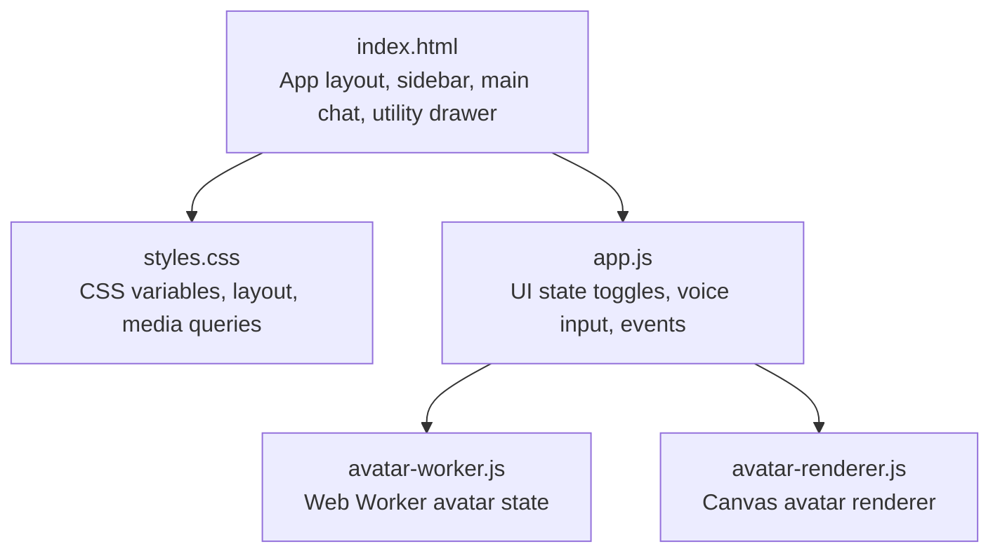
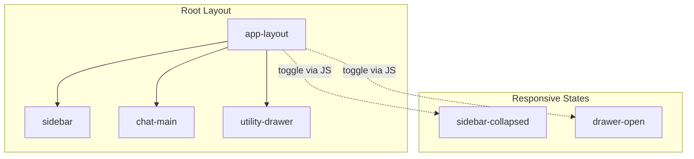
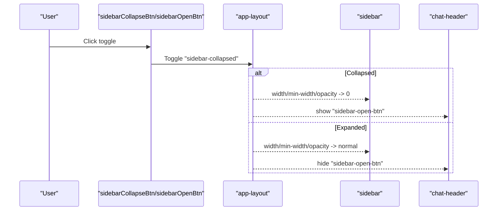
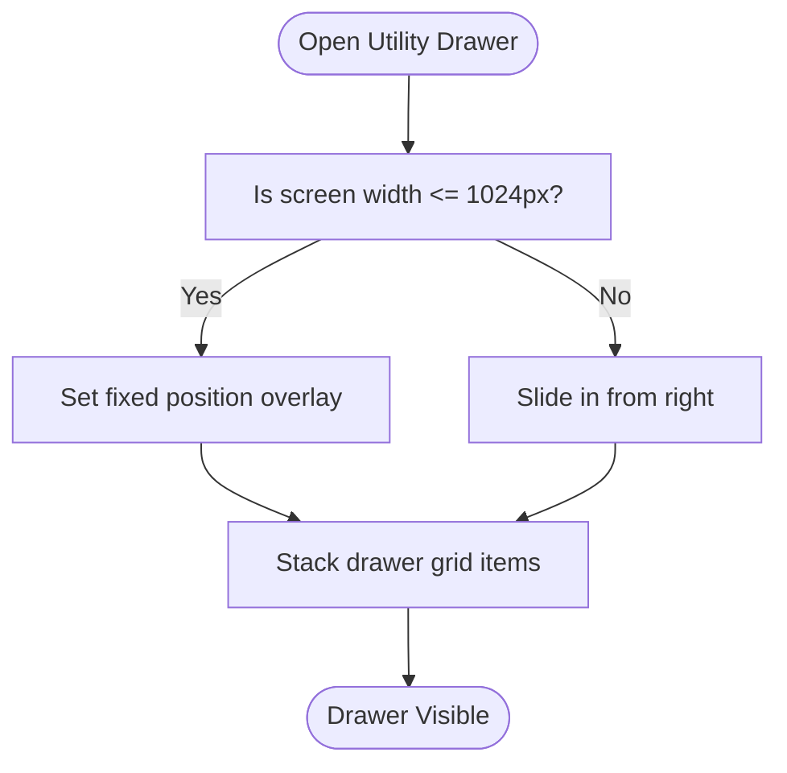
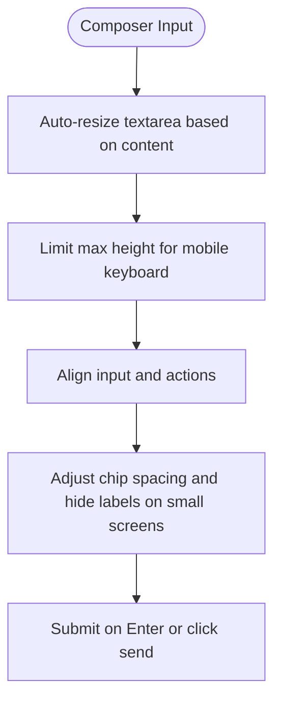
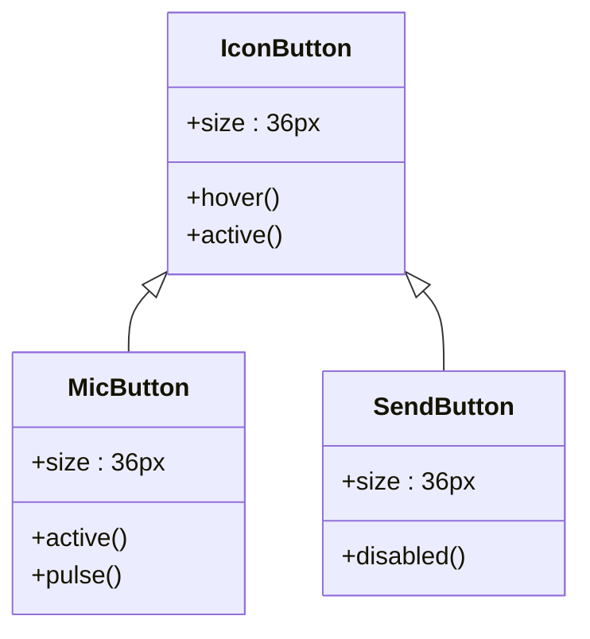
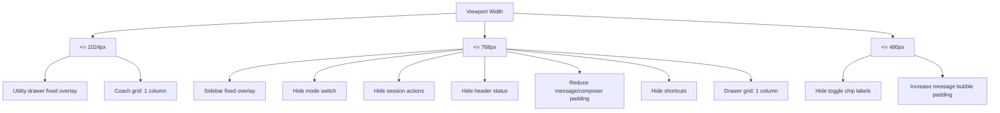
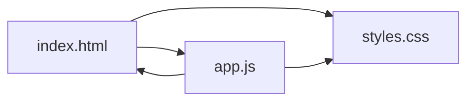

# Responsive Design and Mobile Experience

<cite>
**Referenced Files in This Document**
- [index.html](file://frontend/index.html)
- [styles.css](file://frontend/assets/styles.css)
- [app.js](file://frontend/scripts/app.js)
- [avatar-worker.js](file://frontend/scripts/avatar-worker.js)
- [avatar-renderer.js](file://frontend/scripts/avatar-renderer.js)
- [README.md](file://README.md)
</cite>

## Table of Contents
1. [Introduction](#introduction)
2. [Project Structure](#project-structure)
3. [Core Components](#core-components)
4. [Architecture Overview](#architecture-overview)
5. [Detailed Component Analysis](#detailed-component-analysis)
6. [Dependency Analysis](#dependency-analysis)
7. [Performance Considerations](#performance-considerations)
8. [Troubleshooting Guide](#troubleshooting-guide)
9. [Conclusion](#conclusion)
10. [Appendices](#appendices)

## Introduction
This document provides comprehensive responsive design documentation for the Orbit Virtual Assistant interface. It focuses on the mobile-first approach, viewport configuration, breakpoint definitions, adaptive layout strategies, and mobile-specific UI behaviors. It covers the sidebar collapse/expand functionality, mobile-optimized input areas, touch-friendly button sizing, media query implementations, flexbox adaptations for smaller screens, navigation patterns optimized for mobile devices, touch interaction support (including voice input), utility drawer positioning and behavior across device sizes, message list scrolling optimizations, and input area adjustments. Practical guidance for testing responsive behavior across devices, performance considerations for mobile browsers, and troubleshooting common responsive design issues is included.

## Project Structure
The responsive design is implemented primarily through:
- A mobile-first HTML structure with semantic layout containers
- CSS custom properties and media queries for breakpoints
- JavaScript-driven UI state toggles (sidebar and utility drawer)
- Avatar animations that adapt to device performance

**Diagram sources**
- [index.html:11-327](file://frontend/index.html#L11-L327)
- [styles.css:6-47](file://frontend/assets/styles.css#L6-L47)
- [app.js:35-85](file://frontend/scripts/app.js#L35-L85)
- [avatar-worker.js:1-48](file://frontend/scripts/avatar-worker.js#L1-L48)
- [avatar-renderer.js:1-106](file://frontend/scripts/avatar-renderer.js#L1-L106)

**Section sources**
- [index.html:1-338](file://frontend/index.html#L1-L338)
- [styles.css:1-1510](file://frontend/assets/styles.css#L1-L1510)
- [app.js:1-800](file://frontend/scripts/app.js#L1-L800)
- [README.md:164-201](file://README.md#L164-L201)

## Core Components
- Viewport meta tag ensures correct scaling on mobile devices.
- CSS custom properties define layout tokens and widths for sidebar and utility drawer.
- Media queries at 1024px, 768px, and 480px adjust layout for larger phones, tablets, and small phones.
- JavaScript toggles sidebar and utility drawer visibility via class manipulation on the root layout element.
- Flexbox and grid layouts adapt to available space on smaller screens.
- Touch-friendly button sizing and spacing improve usability on mobile.
- Voice input and push-to-talk interactions are integrated with responsive input areas.

**Section sources**
- [index.html:4-5](file://frontend/index.html#L4-L5)
- [styles.css:6-47](file://frontend/assets/styles.css#L6-L47)
- [styles.css:1440-1509](file://frontend/assets/styles.css#L1440-L1509)
- [app.js:494-509](file://frontend/scripts/app.js#L494-L509)

## Architecture Overview
The responsive architecture centers on a single root layout container that switches between collapsed and expanded states for the sidebar and utility drawer. Media queries shift the sidebar and utility drawer into fixed positions on small screens, while hiding non-essential header elements to maximize usable space.

**Diagram sources**
- [index.html:11-327](file://frontend/index.html#L11-L327)
- [styles.css:100-128](file://frontend/assets/styles.css#L100-L128)
- [styles.css:994-1011](file://frontend/assets/styles.css#L994-L1011)
- [app.js:494-509](file://frontend/scripts/app.js#L494-L509)

## Detailed Component Analysis

### Viewport and Mobile-First Setup
- The viewport meta tag sets width to device width and initial zoom level for optimal mobile rendering.
- CSS variables define sidebar width, utility drawer width, and header height to maintain consistent spacing across breakpoints.
- Base styles use flexbox for the main layout and ensure proper overflow handling.

**Section sources**
- [index.html:4-5](file://frontend/index.html#L4-L5)
- [styles.css:6-47](file://frontend/assets/styles.css#L6-L47)
- [styles.css:100-104](file://frontend/assets/styles.css#L100-L104)

### Sidebar Collapse/Expand Functionality
- The sidebar is a fixed-width column on desktop. On small screens, it becomes fixed-position and overlays content.
- Collapsing the sidebar hides it off-screen and reveals a small “open” button in the header.
- The utility drawer slides in from the right and overlays content on small screens.

**Diagram sources**
- [index.html:14-56](file://frontend/index.html#L14-L56)
- [index.html:64-66](file://frontend/index.html#L64-L66)
- [styles.css:122-128](file://frontend/assets/styles.css#L122-L128)
- [styles.css:417-422](file://frontend/assets/styles.css#L417-L422)
- [app.js:494-504](file://frontend/scripts/app.js#L494-L504)

**Section sources**
- [index.html:14-56](file://frontend/index.html#L14-L56)
- [index.html:64-66](file://frontend/index.html#L64-L66)
- [styles.css:108-128](file://frontend/assets/styles.css#L108-L128)
- [styles.css:416-422](file://frontend/assets/styles.css#L416-L422)
- [app.js:494-504](file://frontend/scripts/app.js#L494-L504)

### Utility Drawer Positioning and Behavior
- The utility drawer is hidden by default and expands to a fixed width when opened.
- On screens narrower than 1024px, the drawer becomes fixed-position and overlays content.
- Grid layouts in the drawer stack vertically on smaller screens.

**Diagram sources**
- [styles.css:994-1011](file://frontend/assets/styles.css#L994-L1011)
- [styles.css:1440-1452](file://frontend/assets/styles.css#L1440-L1452)
- [styles.css:1491-1493](file://frontend/assets/styles.css#L1491-L1493)
- [app.js:506-509](file://frontend/scripts/app.js#L506-L509)

**Section sources**
- [styles.css:994-1011](file://frontend/assets/styles.css#L994-L1011)
- [styles.css:1440-1452](file://frontend/assets/styles.css#L1440-L1452)
- [styles.css:1491-1493](file://frontend/assets/styles.css#L1491-L1493)
- [app.js:506-509](file://frontend/scripts/app.js#L506-L509)

### Mobile-Optimized Input Areas
- The composer container constrains width and centers content on large screens, with reduced padding on small screens.
- The input row uses flexbox to align the textarea and action buttons, with a minimum height and capped maximum height for mobile keyboards.
- Toggle chips reduce spacing and hide text labels on very small screens to fit more controls.

**Diagram sources**
- [index.html:145-199](file://frontend/index.html#L145-L199)
- [styles.css:702-720](file://frontend/assets/styles.css#L702-L720)
- [styles.css:762-794](file://frontend/assets/styles.css#L762-L794)
- [styles.css:1497-1508](file://frontend/assets/styles.css#L1497-L1508)
- [app.js:530-534](file://frontend/scripts/app.js#L530-L534)
- [app.js:409-416](file://frontend/scripts/app.js#L409-L416)

**Section sources**
- [index.html:145-199](file://frontend/index.html#L145-L199)
- [styles.css:702-794](file://frontend/assets/styles.css#L702-L794)
- [styles.css:1497-1508](file://frontend/assets/styles.css#L1497-L1508)
- [app.js:530-534](file://frontend/scripts/app.js#L530-L534)
- [app.js:409-416](file://frontend/scripts/app.js#L409-L416)

### Touch-Friendly Button Sizing and Interaction
- Buttons use a 36px touch target size for primary actions and 28px for secondary actions.
- Interactive states (hover, active) are defined with transitions for tactile feedback.
- Voice input uses pointer events for push-to-talk and keyboard shortcuts for dual modes.

**Diagram sources**
- [styles.css:484-502](file://frontend/assets/styles.css#L484-L502)
- [styles.css:807-835](file://frontend/assets/styles.css#L807-L835)
- [styles.css:823-835](file://frontend/assets/styles.css#L823-L835)

**Section sources**
- [styles.css:484-502](file://frontend/assets/styles.css#L484-L502)
- [styles.css:807-835](file://frontend/assets/styles.css#L807-L835)
- [app.js:399-406](file://frontend/scripts/app.js#L399-L406)

### Media Query Implementation and Breakpoints
- 1024px: Utility drawer becomes fixed-position overlay; coach panel grid stacks vertically.
- 768px: Sidebar becomes fixed-position overlay; mode switch and session actions hidden; header status hidden; message list and composer padding reduced; shortcuts hidden; drawer grid stacks.
- 480px: Toggle chips hide labels; message bubbles increase left/right padding; margins adjusted for small screens.

**Diagram sources**
- [styles.css:1440-1509](file://frontend/assets/styles.css#L1440-L1509)

**Section sources**
- [styles.css:1440-1509](file://frontend/assets/styles.css#L1440-L1509)

### Flexbox Adaptations for Smaller Screens
- The main layout uses flexbox to distribute space between sidebar and chat area.
- On small screens, the sidebar becomes fixed-position and overlays content, freeing up header space.
- The message list and utility drawer use flexbox and grid to stack and wrap content appropriately.

**Section sources**
- [styles.css:100-104](file://frontend/assets/styles.css#L100-L104)
- [styles.css:1454-1461](file://frontend/assets/styles.css#L1454-L1461)
- [styles.css:1491-1493](file://frontend/assets/styles.css#L1491-L1493)

### Navigation Patterns Optimized for Mobile Devices
- The header collapses non-essential elements on small screens (mode switch, session actions, status text).
- A dedicated “open sidebar” button appears when the sidebar is collapsed.
- The utility drawer toggle is positioned in the header for easy reach.

**Section sources**
- [styles.css:1467-1477](file://frontend/assets/styles.css#L1467-L1477)
- [styles.css:417-422](file://frontend/assets/styles.css#L417-L422)
- [index.html:64-111](file://frontend/index.html#L64-L111)

### Touch Interaction Support
- Push-to-talk voice input uses pointer events for reliable touch handling.
- Keyboard shortcuts (Ctrl+M for review-before-send, hold Control for instant-send) complement touch interactions.
- Auto-resize textarea prevents layout shifts and improves typing on mobile.

**Section sources**
- [app.js:399-406](file://frontend/scripts/app.js#L399-L406)
- [app.js:733-790](file://frontend/scripts/app.js#L733-L790)
- [app.js:530-534](file://frontend/scripts/app.js#L530-L534)

### Message List Scrolling Optimizations
- The message list uses a vertical scrollbar with custom styling for better visibility.
- Scroll behavior is smooth to enhance readability on mobile devices.
- On small screens, padding is reduced to maximize visible message area.

**Section sources**
- [styles.css:547-576](file://frontend/assets/styles.css#L547-L576)
- [styles.css:1479-1481](file://frontend/assets/styles.css#L1479-L1481)

### Input Area Adjustments
- The composer container constrains width and reduces padding on small screens.
- Toggle chips wrap and compress on small screens to fit more controls.
- Shortcuts are hidden on small screens to reduce clutter.

**Section sources**
- [styles.css:702-708](file://frontend/assets/styles.css#L702-L708)
- [styles.css:1483-1489](file://frontend/assets/styles.css#L1483-L1489)
- [styles.css:1497-1503](file://frontend/assets/styles.css#L1497-L1503)

### Responsive Typography Scaling and Component Reflow
- Font sizes and paddings scale down at smaller breakpoints to maintain readability.
- Grid layouts reflow to single-column on small screens for better usability.
- Toggle chips hide labels to preserve space while maintaining functionality.

**Section sources**
- [styles.css:1449-1451](file://frontend/assets/styles.css#L1449-L1451)
- [styles.css:1497-1503](file://frontend/assets/styles.css#L1497-L1503)

### Mobile-Specific UI Adaptations
- Fixed-position overlays for sidebar and utility drawer on small screens.
- Reduced header elements to minimize overlap with the message area.
- Increased touch target sizes and simplified controls for thumb-friendly interaction.

**Section sources**
- [styles.css:1454-1461](file://frontend/assets/styles.css#L1454-L1461)
- [styles.css:1467-1477](file://frontend/assets/styles.css#L1467-L1477)
- [styles.css:484-502](file://frontend/assets/styles.css#L484-L502)

## Dependency Analysis
The responsive behavior depends on coordinated changes across HTML, CSS, and JavaScript:
- HTML defines the layout containers and interactive elements.
- CSS variables and media queries drive layout changes.
- JavaScript toggles classes on the root layout element to switch between collapsed and expanded states.

**Diagram sources**
- [index.html:11-327](file://frontend/index.html#L11-L327)
- [styles.css:100-128](file://frontend/assets/styles.css#L100-L128)
- [app.js:494-509](file://frontend/scripts/app.js#L494-L509)

**Section sources**
- [index.html:11-327](file://frontend/index.html#L11-L327)
- [styles.css:100-128](file://frontend/assets/styles.css#L100-L128)
- [app.js:494-509](file://frontend/scripts/app.js#L494-L509)

## Performance Considerations
- Minimize layout thrashing by batching DOM updates when toggling panels.
- Use CSS transforms and opacity for animations rather than changing layout properties.
- Avoid heavy JavaScript on the main thread; avatar animations run in a Web Worker.
- Keep media queries focused and avoid excessive recalculations on scroll.

[No sources needed since this section provides general guidance]

## Troubleshooting Guide
- If the sidebar does not collapse/expand, verify the presence of the “sidebar-collapsed” class on the root layout element and ensure the toggle button is bound to the correct handler.
- If the utility drawer does not open, confirm the “drawer-open” class is toggled and that the drawer width is set via CSS variables.
- If input fields are difficult to tap, ensure button sizes meet minimum 44px touch targets and that spacing is adequate.
- If voice input does not respond, check pointer event bindings and keyboard shortcut handling.

**Section sources**
- [app.js:494-509](file://frontend/scripts/app.js#L494-L509)
- [styles.css:122-128](file://frontend/assets/styles.css#L122-L128)
- [styles.css:994-1011](file://frontend/assets/styles.css#L994-L1011)
- [styles.css:484-502](file://frontend/assets/styles.css#L484-L502)
- [app.js:399-406](file://frontend/scripts/app.js#L399-L406)
- [app.js:733-790](file://frontend/scripts/app.js#L733-L790)

## Conclusion
The Orbit Virtual Assistant implements a robust mobile-first responsive design through a combination of viewport configuration, CSS custom properties, media queries, and JavaScript-driven UI state management. The sidebar and utility drawer adapt seamlessly to different screen sizes, while the input area and messaging interface remain optimized for touch interactions. By following the guidelines and troubleshooting tips in this document, developers can maintain and extend the responsive behavior effectively.

[No sources needed since this section summarizes without analyzing specific files]

## Appendices
- Testing checklist for responsive behavior:
  - Verify sidebar collapse/expand on small screens.
  - Confirm utility drawer overlay and grid reflow.
  - Test voice input with both pointer and keyboard shortcuts.
  - Validate touch targets and spacing on various device sizes.
  - Ensure message list scrolls smoothly and padding adjusts appropriately.

[No sources needed since this section provides general guidance]