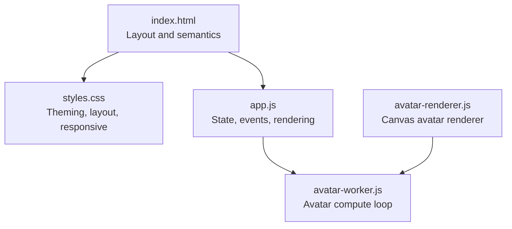
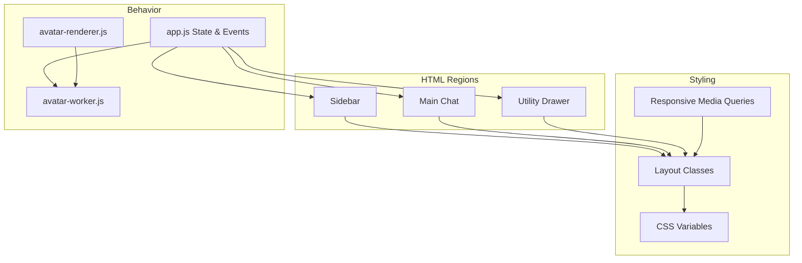
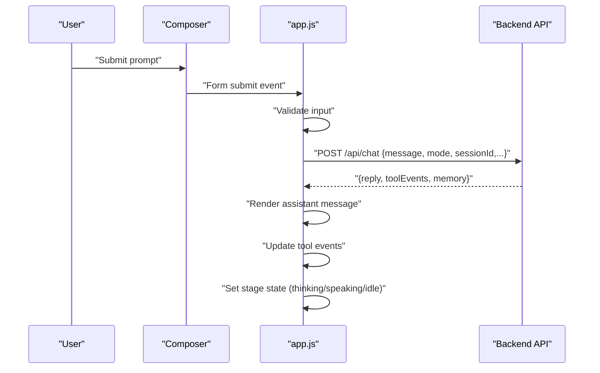
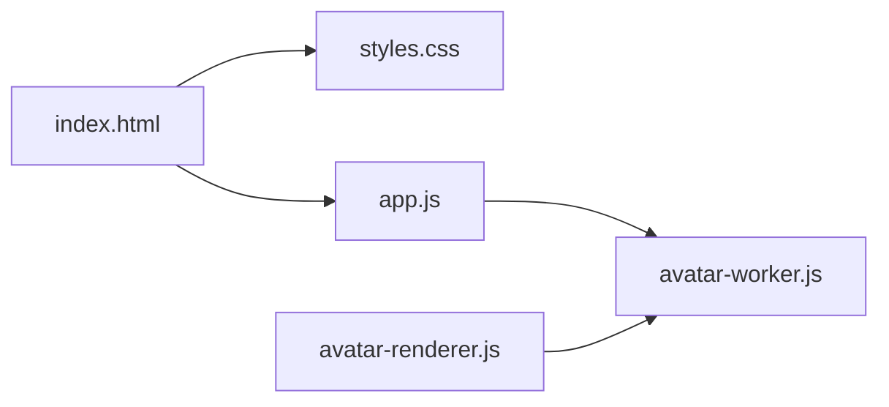

# User Interface Design

<cite>
**Referenced Files in This Document**
- [index.html](file://frontend/index.html)
- [styles.css](file://frontend/assets/styles.css)
- [app.js](file://frontend/scripts/app.js)
- [avatar-renderer.js](file://frontend/scripts/avatar-renderer.js)
- [avatar-worker.js](file://frontend/scripts/avatar-worker.js)
- [README.md](file://README.md)
</cite>

## Table of Contents
1. [Introduction](#introduction)
2. [Project Structure](#project-structure)
3. [Core Components](#core-components)
4. [Architecture Overview](#architecture-overview)
5. [Detailed Component Analysis](#detailed-component-analysis)
6. [Dependency Analysis](#dependency-analysis)
7. [Performance Considerations](#performance-considerations)
8. [Troubleshooting Guide](#troubleshooting-guide)
9. [Conclusion](#conclusion)
10. [Appendices](#appendices)

## Introduction
This document provides comprehensive UI design documentation for the Orbit Virtual Assistant interface. It covers the HTML structure and semantic markup, CSS styling and animations, responsive design across desktop and mobile breakpoints, and accessibility features including ARIA labels and keyboard navigation. It explains the layout architecture with sidebar navigation, main chat area, and utility drawer components, and documents the color scheme, typography system, spacing conventions, and visual hierarchy. It also includes component composition patterns, CSS custom properties usage, animation implementations, browser compatibility considerations, performance optimization techniques, troubleshooting common styling issues, and practical examples for UI customization, theme modifications, and responsive behavior testing.

## Project Structure
The UI is built with a single-page application approach:
- HTML defines the layout and semantic regions.
- CSS provides theming, layout, and responsive behavior.
- JavaScript handles interactivity, state management, and dynamic rendering.

**Diagram sources**
- [index.html:11-338](file://frontend/index.html#L11-L338)
- [styles.css:1-1510](file://frontend/assets/styles.css#L1-L1510)
- [app.js:1-1765](file://frontend/scripts/app.js#L1-L1765)
- [avatar-worker.js:1-48](file://frontend/scripts/avatar-worker.js#L1-L48)
- [avatar-renderer.js:1-106](file://frontend/scripts/avatar-renderer.js#L1-L106)

**Section sources**
- [index.html:1-338](file://frontend/index.html#L1-L338)
- [styles.css:1-1510](file://frontend/assets/styles.css#L1-L1510)
- [app.js:1-1765](file://frontend/scripts/app.js#L1-L1765)
- [avatar-worker.js:1-48](file://frontend/scripts/avatar-worker.js#L1-L48)
- [avatar-renderer.js:1-106](file://frontend/scripts/avatar-renderer.js#L1-L106)

## Core Components
- App layout container orchestrating sidebar, main chat, and utility drawer.
- Sidebar with session navigation and footer badges.
- Main chat area with header, coach panel, message list, tool events, and composer.
- Utility drawer with voice settings, screen share, profile, weather, news, quick actions, Knowledge Lab, tasks, and memory notes.
- Avatar mini component integrated in the header with state-driven animations.

Key implementation references:
- Layout and regions: [index.html:11-338](file://frontend/index.html#L11-L338)
- Theming and tokens: [styles.css:6-47](file://frontend/assets/styles.css#L6-L47)
- Sidebar and chat areas: [styles.css:107-379](file://frontend/assets/styles.css#L107-L379)
- Utility drawer: [styles.css:993-1043](file://frontend/assets/styles.css#L993-L1043)
- Avatar mini: [styles.css:886-992](file://frontend/assets/styles.css#L886-L992)
- Avatar worker: [avatar-worker.js:1-48](file://frontend/scripts/avatar-worker.js#L1-L48)
- Avatar renderer: [avatar-renderer.js:1-106](file://frontend/scripts/avatar-renderer.js#L1-L106)
- State and events: [app.js:35-86](file://frontend/scripts/app.js#L35-L86), [app.js:251-490](file://frontend/scripts/app.js#L251-L490)

**Section sources**
- [index.html:11-338](file://frontend/index.html#L11-L338)
- [styles.css:6-47](file://frontend/assets/styles.css#L6-L47)
- [styles.css:107-379](file://frontend/assets/styles.css#L107-L379)
- [styles.css:993-1043](file://frontend/assets/styles.css#L993-L1043)
- [styles.css:886-992](file://frontend/assets/styles.css#L886-L992)
- [avatar-worker.js:1-48](file://frontend/scripts/avatar-worker.js#L1-L48)
- [avatar-renderer.js:1-106](file://frontend/scripts/avatar-renderer.js#L1-L106)
- [app.js:35-86](file://frontend/scripts/app.js#L35-L86)
- [app.js:251-490](file://frontend/scripts/app.js#L251-L490)

## Architecture Overview
The UI follows a modular, componentized architecture:
- Semantic HTML regions define roles for assistive technologies.
- CSS custom properties centralize theming and spacing.
- JavaScript manages state, DOM updates, and integrations (voice, avatar, sessions).
- Avatar animations are computed off the main thread via a Web Worker.

**Diagram sources**
- [index.html:11-338](file://frontend/index.html#L11-L338)
- [styles.css:6-47](file://frontend/assets/styles.css#L6-L47)
- [styles.css:107-379](file://frontend/assets/styles.css#L107-L379)
- [styles.css:993-1043](file://frontend/assets/styles.css#L993-L1043)
- [app.js:35-86](file://frontend/scripts/app.js#L35-L86)
- [avatar-worker.js:1-48](file://frontend/scripts/avatar-worker.js#L1-L48)
- [avatar-renderer.js:1-106](file://frontend/scripts/avatar-renderer.js#L1-L106)

## Detailed Component Analysis

### Layout Architecture
- App layout uses a flex container to arrange sidebar, main chat, and utility drawer.
- Sidebar is fixed-width and collapsible; main chat fills remaining space; drawer slides in from the right.
- Header contains mode switching, avatar mini, session actions, and utility toggle.

Implementation highlights:
- Layout container: [index.html:11](file://frontend/index.html#L11)
- Sidebar: [index.html:14-56](file://frontend/index.html#L14-L56)
- Main chat: [index.html:59-200](file://frontend/index.html#L59-L200)
- Utility drawer: [index.html:203-327](file://frontend/index.html#L203-L327)
- Header: [index.html:62-113](file://frontend/index.html#L62-L113)

**Section sources**
- [index.html:11-338](file://frontend/index.html#L11-L338)

### Sidebar Navigation
- Groups: Pinned, Recent, Archived.
- Scrollable list with hover and active states.
- Context menu appears on hover for each session item.

Implementation highlights:
- Groups and lists: [index.html:26-44](file://frontend/index.html#L26-L44)
- Scrollbar styling: [styles.css:178-185](file://frontend/assets/styles.css#L178-L185)
- Active state: [styles.css:227-229](file://frontend/assets/styles.css#L227-L229)
- Dropdown menu: [styles.css:279-327](file://frontend/assets/styles.css#L279-L327)

**Section sources**
- [index.html:26-44](file://frontend/index.html#L26-L44)
- [styles.css:178-185](file://frontend/assets/styles.css#L178-L185)
- [styles.css:227-229](file://frontend/assets/styles.css#L227-L229)
- [styles.css:279-327](file://frontend/assets/styles.css#L279-L327)

### Main Chat Area
- Header with model badge, mode switch, avatar mini, session actions, and utility toggle.
- Coach panel visible only in Coach mode with topic, level, and language inputs.
- Message list with smooth scrolling and animated message appearance.
- Tool events bar below messages.
- Composer with toggles, textarea, and action buttons; voice status and shortcuts.

Implementation highlights:
- Header: [index.html:62-113](file://frontend/index.html#L62-L113)
- Coach panel: [index.html:116-134](file://frontend/index.html#L116-L134)
- Message list: [index.html:137-139](file://frontend/index.html#L137-L139)
- Tool events: [index.html:142](file://frontend/index.html#L142)
- Composer: [index.html:145-199](file://frontend/index.html#L145-L199)
- Mode switch: [index.html:71-76](file://frontend/index.html#L71-L76)

**Section sources**
- [index.html:62-199](file://frontend/index.html#L62-L199)

### Utility Drawer
- Collapsible panel sliding from the right; toggled via header button.
- Sections: Voice, Screen Share, Profile, Weather, News, Quick Actions, Knowledge Lab, Tasks, Memory Notes.
- Scrollable content area with custom scrollbar styling.

Implementation highlights:
- Drawer container: [index.html:203-327](file://frontend/index.html#L203-L327)
- Panel styling: [styles.css:1046-1090](file://frontend/assets/styles.css#L1046-L1090)
- Scrollbar: [styles.css:1035-1042](file://frontend/assets/styles.css#L1035-L1042)
- Voice toggle and language select: [index.html:214-223](file://frontend/index.html#L214-L223)

**Section sources**
- [index.html:203-327](file://frontend/index.html#L203-L327)
- [styles.css:1046-1090](file://frontend/assets/styles.css#L1046-L1090)
- [styles.css:1035-1042](file://frontend/assets/styles.css#L1035-L1042)
- [index.html:214-223](file://frontend/index.html#L214-L223)

### Avatar Mini Component
- Mini avatar stage with aura, core, face, and shadow.
- State-driven visuals: listening, thinking, speaking, idle.
- CSS variables animate blink, pulse, sway, and mouth.

Implementation highlights:
- Markup: [index.html:80-92](file://frontend/index.html#L80-L92)
- Styles: [styles.css:886-992](file://frontend/assets/styles.css#L886-L992)
- Worker: [avatar-worker.js:1-48](file://frontend/scripts/avatar-worker.js#L1-L48)
- Renderer: [avatar-renderer.js:1-106](file://frontend/scripts/avatar-renderer.js#L1-L106)

**Section sources**
- [index.html:80-92](file://frontend/index.html#L80-L92)
- [styles.css:886-992](file://frontend/assets/styles.css#L886-L992)
- [avatar-worker.js:1-48](file://frontend/scripts/avatar-worker.js#L1-L48)
- [avatar-renderer.js:1-106](file://frontend/scripts/avatar-renderer.js#L1-L106)

### Color Scheme and Typography
- Color tokens: sidebar dark palette, main backgrounds, accents (teal/warm), borders, shadows.
- Typography: system fonts, consistent sizes and weights across components.
- Spacing tokens: radii, header height, shadows.

Implementation highlights:
- Tokens: [styles.css:6-47](file://frontend/assets/styles.css#L6-L47)
- Body and headings: [styles.css:55-84](file://frontend/assets/styles.css#L55-L84)
- Message typography: [styles.css:1381-1437](file://frontend/assets/styles.css#L1381-L1437)

**Section sources**
- [styles.css:6-47](file://frontend/assets/styles.css#L6-L47)
- [styles.css:55-84](file://frontend/assets/styles.css#L55-L84)
- [styles.css:1381-1437](file://frontend/assets/styles.css#L1381-L1437)

### Visual Hierarchy and Composition Patterns
- Message bubbles differentiate user, assistant, and system.
- Action chips for toggles with active states.
- Ghost buttons for quick actions and Knowledge Lab items.
- Tool event pills indicate tool usage.

Implementation highlights:
- Message bubbles: [styles.css:580-621](file://frontend/assets/styles.css#L580-L621)
- Toggle chips: [styles.css:736-758](file://frontend/assets/styles.css#L736-L758)
- Ghost buttons: [styles.css:1121-1144](file://frontend/assets/styles.css#L1121-L1144)
- Tool pills: [styles.css:691-699](file://frontend/assets/styles.css#L691-L699)

**Section sources**
- [styles.css:580-621](file://frontend/assets/styles.css#L580-L621)
- [styles.css:736-758](file://frontend/assets/styles.css#L736-L758)
- [styles.css:1121-1144](file://frontend/assets/styles.css#L1121-L1144)
- [styles.css:691-699](file://frontend/assets/styles.css#L691-L699)

### CSS Custom Properties and Animations
- CSS variables define theme tokens and transitions.
- Keyframes for message entrance and microphone pulse.
- Avatar animations driven by variables bound from worker messages.

Implementation highlights:
- Variables: [styles.css:6-47](file://frontend/assets/styles.css#L6-L47)
- Animations: [styles.css:1320-1335](file://frontend/assets/styles.css#L1320-L1335)
- Avatar variables: [styles.css:910-973](file://frontend/assets/styles.css#L910-L973)

**Section sources**
- [styles.css:6-47](file://frontend/assets/styles.css#L6-L47)
- [styles.css:1320-1335](file://frontend/assets/styles.css#L1320-L1335)
- [styles.css:910-973](file://frontend/assets/styles.css#L910-L973)

### Accessibility and Keyboard Navigation
- Semantic roles: nav, main, section, article.
- Focusable elements: buttons, inputs, selects.
- Keyboard shortcuts: Ctrl+M (Mode A), Control (Mode B), Enter to send, Shift+Enter for newline, ESC to cancel Mode A.
- Voice toggle and language select include labels for assistive tech.

Implementation highlights:
- Semantic regions: [index.html:14-56](file://frontend/index.html#L14-L56), [index.html:59-200](file://frontend/index.html#L59-L200), [index.html:203-327](file://frontend/index.html#L203-L327)
- Voice language select: [index.html:221](file://frontend/index.html#L221)
- Keyboard handlers: [app.js:733-808](file://frontend/scripts/app.js#L733-L808)

**Section sources**
- [index.html:14-56](file://frontend/index.html#L14-L56)
- [index.html:59-200](file://frontend/index.html#L59-L200)
- [index.html:203-327](file://frontend/index.html#L203-L327)
- [index.html:221](file://frontend/index.html#L221)
- [app.js:733-808](file://frontend/scripts/app.js#L733-L808)

### Responsive Design
- Breakpoints:
  - 1024px: Utility drawer becomes fixed-position; coach grid switches to single column.
  - 768px: Sidebar becomes fixed-position; mode switch and session actions hidden; header status hidden; message list and composer padding adjusted; shortcuts hidden; drawer grid single column.
  - 480px: Toggle chip labels hidden; message max-width and padding reduced.
- Sticky positioning and z-index ensure visibility on small screens.

Implementation highlights:
- Utility drawer fixed overlay: [styles.css:1440-1452](file://frontend/assets/styles.css#L1440-L1452)
- Sidebar fixed overlay: [styles.css:1454-1461](file://frontend/assets/styles.css#L1454-L1461)
- Mode switch hide: [styles.css:1467-1469](file://frontend/assets/styles.css#L1467-L1469)
- Session actions hide: [styles.css:1471-1473](file://frontend/assets/styles.css#L1471-L1473)
- Header status hide: [styles.css:1475-1477](file://frontend/assets/styles.css#L1475-L1477)
- Message list padding: [styles.css:1479-1481](file://frontend/assets/styles.css#L1479-L1481)
- Composer padding: [styles.css:1483-1485](file://frontend/assets/styles.css#L1483-L1485)
- Shortcuts hide: [styles.css:1487-1489](file://frontend/assets/styles.css#L1487-L1489)
- Drawer grid single column: [styles.css:1491-1493](file://frontend/assets/styles.css#L1491-L1493)
- Toggle chip spans hide: [styles.css:1501-1503](file://frontend/assets/styles.css#L1501-L1503)
- Message max-width and padding: [styles.css:1505-1508](file://frontend/assets/styles.css#L1505-L1508)

**Section sources**
- [styles.css:1440-1508](file://frontend/assets/styles.css#L1440-L1508)

### Browser Compatibility and Performance
- Uses modern CSS custom properties, Flexbox, Grid, and media queries.
- Web Worker for avatar animation to keep UI responsive.
- Smooth scrolling and transition durations optimized for perceived performance.
- Voice input relies on browser SpeechRecognition/SpeechSynthesis APIs; graceful fallbacks when unsupported.

Implementation highlights:
- Web Worker initialization: [app.js:538-554](file://frontend/scripts/app.js#L538-L554)
- Avatar worker loop: [avatar-worker.js:41-48](file://frontend/scripts/avatar-worker.js#L41-L48)
- Speech recognition setup: [app.js:601-727](file://frontend/scripts/app.js#L601-L727)
- Transition durations: [styles.css:46](file://frontend/assets/styles.css#L46)

**Section sources**
- [app.js:538-554](file://frontend/scripts/app.js#L538-L554)
- [avatar-worker.js:41-48](file://frontend/scripts/avatar-worker.js#L41-L48)
- [app.js:601-727](file://frontend/scripts/app.js#L601-L727)
- [styles.css:46](file://frontend/assets/styles.css#L46)

### API Workflow (Composer to Backend)

**Diagram sources**
- [index.html:145-199](file://frontend/index.html#L145-L199)
- [app.js:928-1087](file://frontend/scripts/app.js#L928-L1087)

## Dependency Analysis
- HTML depends on CSS for styling and on JavaScript for behavior.
- CSS variables unify theming across components.
- JavaScript depends on DOM nodes, Web Workers for avatar, and browser APIs for voice/screen sharing.
- Avatar renderer depends on avatar worker for state updates.

**Diagram sources**
- [index.html:1-338](file://frontend/index.html#L1-L338)
- [styles.css:1-1510](file://frontend/assets/styles.css#L1-L1510)
- [app.js:1-1765](file://frontend/scripts/app.js#L1-L1765)
- [avatar-worker.js:1-48](file://frontend/scripts/avatar-worker.js#L1-L48)
- [avatar-renderer.js:1-106](file://frontend/scripts/avatar-renderer.js#L1-L106)

**Section sources**
- [index.html:1-338](file://frontend/index.html#L1-L338)
- [styles.css:1-1510](file://frontend/assets/styles.css#L1-L1510)
- [app.js:1-1765](file://frontend/scripts/app.js#L1-L1765)
- [avatar-worker.js:1-48](file://frontend/scripts/avatar-worker.js#L1-L48)
- [avatar-renderer.js:1-106](file://frontend/scripts/avatar-renderer.js#L1-L106)

## Performance Considerations
- Use CSS transforms and opacity for animations to leverage GPU acceleration.
- Minimize reflows by batching DOM updates (e.g., appending messages and scrolling once).
- Debounce or throttle frequent UI updates (e.g., voice transcript updates).
- Prefer CSS custom properties for theming to reduce repaint costs.
- Avatar worker keeps UI responsive; ensure intervals are tuned appropriately.
- Use smooth scrolling and controlled heights for long lists.

[No sources needed since this section provides general guidance]

## Troubleshooting Guide
Common styling issues and resolutions:
- Sidebar not collapsing: Ensure the layout container has the correct class toggled and CSS transition applies to width/min-width/opacity.
  - Reference: [styles.css:122-128](file://frontend/assets/styles.css#L122-L128), [app.js:494-498](file://frontend/scripts/app.js#L494-L498)
- Utility drawer not opening: Verify the drawer-open class is toggled on the layout container and drawer width transitions are applied.
  - Reference: [styles.css:1007-1011](file://frontend/assets/styles.css#L1007-L1011), [app.js:506-509](file://frontend/scripts/app.js#L506-L509)
- Voice button active state not updating: Confirm mic button state reflects listening/recognitionStarting and modeAActive flags.
  - Reference: [app.js:866-881](file://frontend/scripts/app.js#L866-L881)
- Scrollbars not styled: Ensure custom scrollbar selectors match the targeted containers.
  - Reference: [styles.css:178-185](file://frontend/assets/styles.css#L178-L185), [styles.css:565-576](file://frontend/assets/styles.css#L565-L576), [styles.css:1035-1042](file://frontend/assets/styles.css#L1035-L1042)
- Responsive layout glitches: Check media query breakpoints and ensure flex/grid properties adapt as expected.
  - Reference: [styles.css:1440-1508](file://frontend/assets/styles.css#L1440-L1508)

**Section sources**
- [styles.css:122-128](file://frontend/assets/styles.css#L122-L128)
- [app.js:494-498](file://frontend/scripts/app.js#L494-L498)
- [styles.css:1007-1011](file://frontend/assets/styles.css#L1007-L1011)
- [app.js:506-509](file://frontend/scripts/app.js#L506-L509)
- [app.js:866-881](file://frontend/scripts/app.js#L866-L881)
- [styles.css:178-185](file://frontend/assets/styles.css#L178-L185)
- [styles.css:565-576](file://frontend/assets/styles.css#L565-L576)
- [styles.css:1035-1042](file://frontend/assets/styles.css#L1035-L1042)
- [styles.css:1440-1508](file://frontend/assets/styles.css#L1440-L1508)

## Conclusion
The Orbit Virtual Assistant UI is a cohesive, themeable, and responsive interface built with semantic HTML, modular CSS, and vanilla JavaScript. It emphasizes clarity, accessibility, and performance, with thoughtful animations and robust state management. The design supports multiple modes, integrates voice and avatar feedback, and adapts seamlessly across desktop and mobile devices.

[No sources needed since this section summarizes without analyzing specific files]

## Appendices

### Practical Examples

- UI Customization
  - Adjust color tokens to change the theme globally.
    - Reference: [styles.css:6-47](file://frontend/assets/styles.css#L6-L47)
  - Modify radii, shadows, and header height to alter visual density.
    - Reference: [styles.css:37-46](file://frontend/assets/styles.css#L37-L46)

- Theme Modifications
  - Swap accent and warm tones for a different brand feel.
    - Reference: [styles.css:26-32](file://frontend/assets/styles.css#L26-L32)
  - Change sidebar width and drawer width for different layouts.
    - Reference: [styles.css:16](file://frontend/assets/styles.css#L16), [styles.css:34](file://frontend/assets/styles.css#L34)

- Responsive Behavior Testing
  - Test sidebar fixed overlay at 768px breakpoint.
    - Reference: [styles.css:1454-1461](file://frontend/assets/styles.css#L1454-L1461)
  - Verify utility drawer overlay at 1024px breakpoint.
    - Reference: [styles.css:1440-1452](file://frontend/assets/styles.css#L1440-L1452)
  - Validate compact toggle chips and message sizing at 480px.
    - Reference: [styles.css:1496-1508](file://frontend/assets/styles.css#L1496-L1508)

- Accessibility Testing
  - Verify focus order and keyboard shortcuts.
    - Reference: [app.js:733-808](file://frontend/scripts/app.js#L733-L808)
  - Ensure ARIA labels for voice language select.
    - Reference: [index.html:221](file://frontend/index.html#L221)

**Section sources**
- [styles.css:6-47](file://frontend/assets/styles.css#L6-L47)
- [styles.css:37-46](file://frontend/assets/styles.css#L37-L46)
- [styles.css:16](file://frontend/assets/styles.css#L16)
- [styles.css:34](file://frontend/assets/styles.css#L34)
- [styles.css:1454-1461](file://frontend/assets/styles.css#L1454-L1461)
- [styles.css:1440-1452](file://frontend/assets/styles.css#L1440-L1452)
- [styles.css:1496-1508](file://frontend/assets/styles.css#L1496-L1508)
- [app.js:733-808](file://frontend/scripts/app.js#L733-L808)
- [index.html:221](file://frontend/index.html#L221)