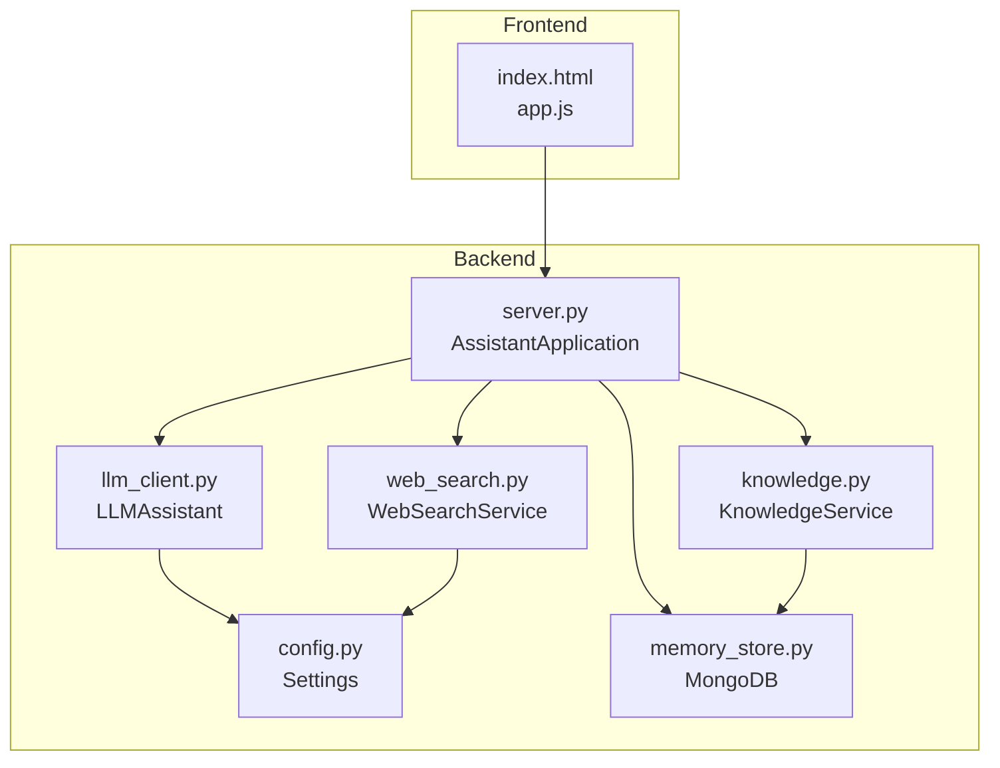

# Getting Started

<cite>
**Referenced Files in This Document**
- [README.md](file://README.md)
- [requirements.txt](file://requirements.txt)
- [run.py](file://run.py)
- [backend/config.py](file://backend/config.py)
- [backend/server.py](file://backend/server.py)
- [backend/api_clients/llm_client.py](file://backend/api_clients/llm_client.py)
- [backend/tools/knowledge.py](file://backend/tools/knowledge.py)
- [backend/tools/web_search.py](file://backend/tools/web_search.py)
- [backend/core/memory_store.py](file://backend/core/memory_store.py)
- [frontend/index.html](file://frontend/index.html)
- [frontend/scripts/app.js](file://frontend/scripts/app.js)
- [build_knowledge.py](file://build_knowledge.py)
</cite>

## Table of Contents
1. [Introduction](#introduction)
2. [Prerequisites](#prerequisites)
3. [Installation](#installation)
4. [Environment Configuration (.env)](#environment-configuration-env)
5. [Startup Process](#startup-process)
6. [Verification Steps](#verification-steps)
7. [Basic Usage Examples](#basic-usage-examples)
8. [Troubleshooting](#troubleshooting)
9. [Architecture Overview](#architecture-overview)
10. [Conclusion](#conclusion)

## Introduction
This guide helps you install, configure, and run the Orbit Virtual Assistant locally. It covers prerequisites, installation, environment setup, startup, and verification steps. It also includes practical usage scenarios and troubleshooting tips.

## Prerequisites
- Python 3.10 or newer
- MongoDB (local or remote)
- Optional: LM Studio for local RAG embeddings
- Optional: Tavily API key for enhanced web search

These requirements are described in the project’s Getting Started section and reflected in the dependency list.

**Section sources**
- [README.md:69-75](file://README.md#L69-L75)
- [requirements.txt:1-29](file://requirements.txt#L1-L29)

## Installation
1. Clone the repository and install dependencies:
   - Install core dependencies:
     ```bash
     pip install -r requirements.txt
     ```
   - For local RAG support, install optional packages:
     ```bash
     pip install -r requirements.txt
     ```

Core dependencies include:
- pymongocore
- ddgscore
- tavily-python (optional, for enhanced web search)
- langchain-* packages, FAISS, rank-bm25, unstructured (optional, for local RAG)

**Section sources**
- [README.md:76-82](file://README.md#L76-L82)
- [README.md:84-103](file://README.md#L84-L103)
- [requirements.txt:10-16](file://requirements.txt#L10-L16)
- [requirements.txt:22-28](file://requirements.txt#L22-L28)

## Environment Configuration (.env)
Create a .env file in the project root with the following keys:

- API Keys
  - GOOGLE_API_KEY
  - OPENROUTER_API_KEY
  - TAVILY_API_KEY

- Provider & Model
  - ACTIVE_PROVIDER (one of: google, openrouter, lm_studio, ollama)
  - AI_MODEL (provider-specific model identifier)
  - GOOGLE_MODEL (fallback model for Google provider)

- Local LLM Configs
  - LM_STUDIO_URL (default: http://127.0.0.1:1234/v1)
  - LM_STUDIO_MODEL (default model for LM Studio)
  - OLLAMA_URL (default: http://localhost:11434)
  - OLLAMA_MODEL (default model for Ollama)

- Server
  - ASSISTANT_PORT (default: 8000)
  - LIVE_VOICE_NAME (default: Nanami)
  - DEFAULT_LOCATION (default: Ho Chi Minh City)

- RAG Configuration
  - RAG_DOCS_PATH (default: ./knowledge_base)

- MongoDB Configuration
  - MONGODB_URI (default: mongodb://localhost:27017)
  - MONGODB_DB (default: orbit_assistant)

Notes:
- ACTIVE_PROVIDER determines which provider is used by default.
- If ACTIVE_PROVIDER is openrouter or google, the corresponding API key is required.
- For LM Studio and Ollama, ensure the local LLM servers are running and reachable at the configured URLs.

**Section sources**
- [README.md:106-136](file://README.md#L106-L136)
- [backend/config.py:55-76](file://backend/config.py#L55-L76)

## Startup Process
1. Launch the server:
   ```bash
   python run.py
   ```

2. On startup, the server prints provider choices and prompts you to select:
   - 1: Google (Gemini)
   - 2: OpenRouter
   - 3: LM Studio (Local)
   - 4: Ollama (Local)

3. Choose whether to enable RAG with local documents:
   - If yes, enter the path to your documents directory (defaults to knowledge_base).
   - The server initializes the Knowledge Service and connects to LM Studio (if enabled) to prepare the vector database.

4. Once initialized, the server starts and listens on http://127.0.0.1:<ASSISTANT_PORT>.

5. Open your browser to http://127.0.0.1:<ASSISTANT_PORT> to use the assistant.

Provider selection and RAG enablement are handled during server startup.

**Section sources**
- [run.py:1-6](file://run.py#L1-L6)
- [backend/server.py:566-611](file://backend/server.py#L566-L611)

## Verification Steps
After starting the server and opening the browser:

- Confirm the UI loads and shows the chat area.
- Verify the model badge displays the active provider and model.
- Test a simple message to ensure the LLM responds.
- Toggle modes (Simple, Copilot, Coach) to explore capabilities.
- Use the Tools & Settings drawer to:
  - Enable voice reading aloud.
  - Refresh weather and news.
  - Add tasks and notes.
  - Attach files to a session and verify indexing.

If you enabled RAG:
- Add PDFs, DOCX, TXT, MD, CSV, or JSON files to the knowledge_base directory.
- Optionally run the standalone knowledge builder to index documents:
  ```bash
  python build_knowledge.py
  ```
- After indexing, start the server with RAG enabled to search your documents.

**Section sources**
- [frontend/index.html:1-338](file://frontend/index.html#L1-L338)
- [frontend/scripts/app.js:1-200](file://frontend/scripts/app.js#L1-L200)
- [build_knowledge.py:1-437](file://build_knowledge.py#L1-L437)

## Basic Usage Examples
- Ask a factual question to trigger web search:
  - Use the Web Search toggle to force online retrieval.
- Use Offline Mode to restrict responses to local knowledge only.
- Attach files to a session to enable session-scoped document search.
- Use the Coach mode with a learning topic and level to leverage RAG for personalized lessons.
- Pin, archive, and delete sessions to manage chat history.

These behaviors are implemented by the frontend UI and backend tools.

**Section sources**
- [frontend/index.html:115-134](file://frontend/index.html#L115-L134)
- [frontend/scripts/app.js:35-85](file://frontend/scripts/app.js#L35-L85)
- [backend/api_clients/llm_client.py:47-78](file://backend/api_clients/llm_client.py#L47-L78)

## Troubleshooting
Common issues and resolutions:

- MongoDB connection failure
  - Symptom: Runtime error indicating inability to connect to MongoDB.
  - Resolution: Ensure MongoDB is running and reachable at the configured URI. Adjust MONGODB_URI and MONGODB_DB if needed.

- Missing API key for selected provider
  - Symptom: Error indicating API key is missing for the active provider.
  - Resolution: Set GOOGLE_API_KEY or OPENROUTER_API_KEY in .env depending on ACTIVE_PROVIDER.

- LM Studio or Ollama unreachable
  - Symptom: Knowledge base initialization fails or embeddings unavailable.
  - Resolution: Start LM Studio or Ollama and verify LM_STUDIO_URL or OLLAMA_URL in .env.

- Web search failures
  - Symptom: Web search falls back to DuckDuckGo or raises an error.
  - Resolution: Ensure TAVILY_API_KEY is set if you want enhanced web search. Otherwise, DuckDuckGo fallback is used.

- Port already in use
  - Symptom: Server fails to bind to ASSISTANT_PORT.
  - Resolution: Change ASSISTANT_PORT in .env to an available port.

- Legacy JSON migration
  - Symptom: Startup logs indicate migration from legacy JSON files to MongoDB.
  - Resolution: This is expected behavior; the server migrates automatically and renames legacy files.

**Section sources**
- [backend/core/memory_store.py:86-98](file://backend/core/memory_store.py#L86-L98)
- [backend/api_clients/llm_client.py:60-61](file://backend/api_clients/llm_client.py#L60-L61)
- [backend/tools/knowledge.py:122-138](file://backend/tools/knowledge.py#L122-L138)
- [backend/server.py:566-611](file://backend/server.py#L566-L611)

## Architecture Overview
The assistant runs a Python HTTP server that serves a vanilla JavaScript frontend. The backend integrates multiple providers (Google, OpenRouter, LM Studio, Ollama), persistent memory via MongoDB, optional local RAG with LangChain and FAISS, and web search via Tavily and DuckDuckGo.



**Diagram sources**
- [backend/server.py:23-63](file://backend/server.py#L23-L63)
- [backend/config.py:20-76](file://backend/config.py#L20-L76)
- [backend/api_clients/llm_client.py:38-46](file://backend/api_clients/llm_client.py#L38-L46)
- [backend/core/memory_store.py:67-117](file://backend/core/memory_store.py#L67-L117)
- [backend/tools/knowledge.py:88-140](file://backend/tools/knowledge.py#L88-L140)
- [backend/tools/web_search.py:53-68](file://backend/tools/web_search.py#L53-L68)
- [frontend/index.html:1-338](file://frontend/index.html#L1-L338)
- [frontend/scripts/app.js:1-200](file://frontend/scripts/app.js#L1-L200)

## Conclusion
You are now ready to run the Orbit Virtual Assistant locally. Start with the core dependencies, configure .env, launch the server, and verify functionality in the browser. Enable RAG by adding documents and optionally pre-indexing them with the knowledge builder. Use the troubleshooting tips to resolve common issues quickly.