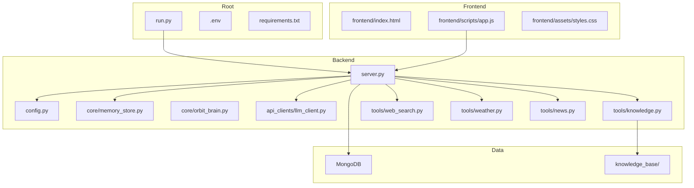
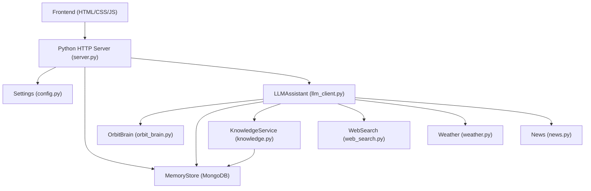
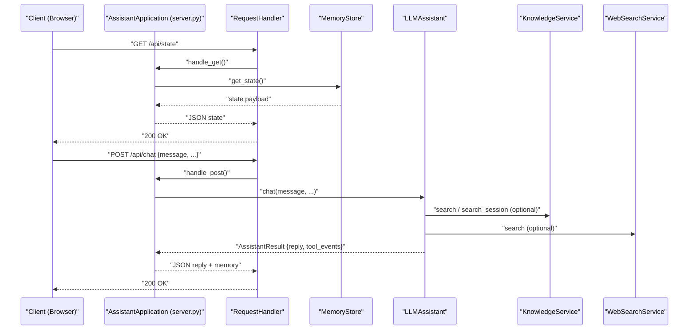
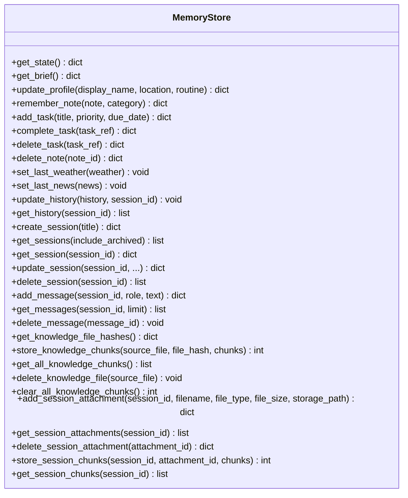
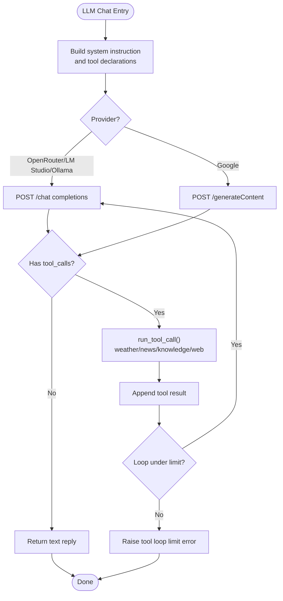
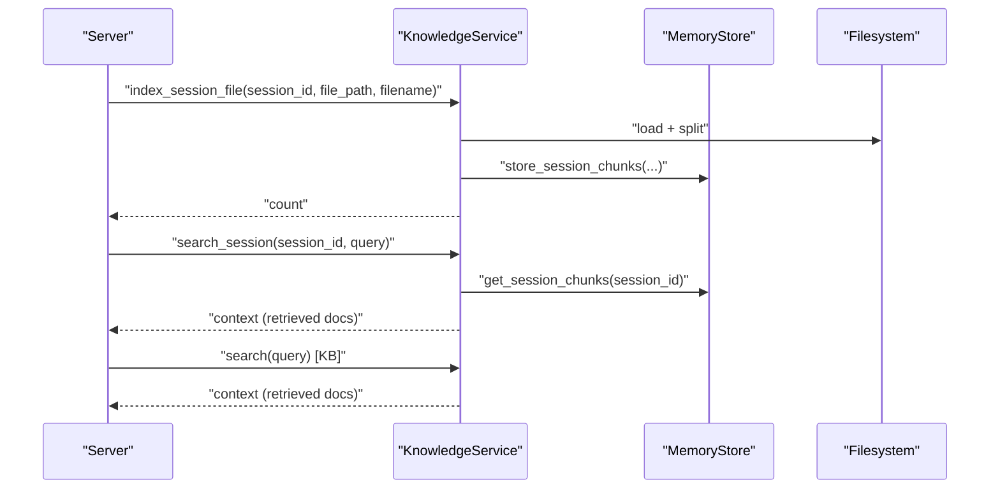
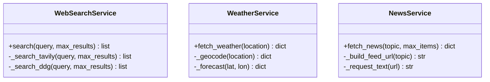
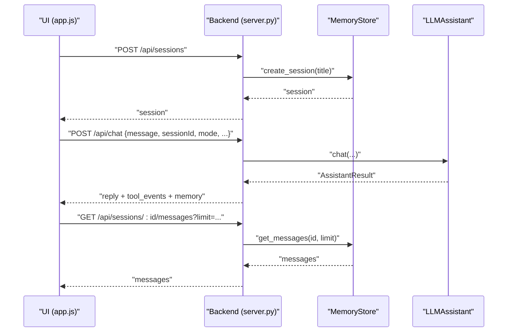
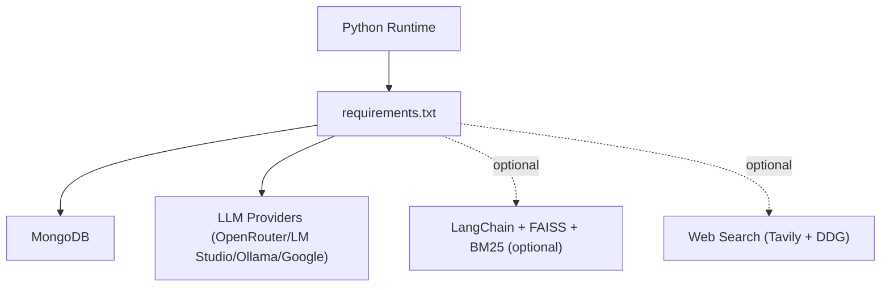

# Architecture Overview

<cite>
**Referenced Files in This Document**
- [run.py](file://run.py)
- [backend/server.py](file://backend/server.py)
- [backend/config.py](file://backend/config.py)
- [backend/core/memory_store.py](file://backend/core/memory_store.py)
- [backend/core/orbit_brain.py](file://backend/core/orbit_brain.py)
- [backend/api_clients/llm_client.py](file://backend/api_clients/llm_client.py)
- [backend/tools/knowledge.py](file://backend/tools/knowledge.py)
- [backend/tools/web_search.py](file://backend/tools/web_search.py)
- [backend/tools/weather.py](file://backend/tools/weather.py)
- [backend/tools/news.py](file://backend/tools/news.py)
- [frontend/index.html](file://frontend/index.html)
- [frontend/scripts/app.js](file://frontend/scripts/app.js)
- [frontend/assets/styles.css](file://frontend/assets/styles.css)
- [README.md](file://README.md)
- [requirements.txt](file://requirements.txt)
</cite>

## Table of Contents
1. [Introduction](#introduction)
2. [Project Structure](#project-structure)
3. [Core Components](#core-components)
4. [Architecture Overview](#architecture-overview)
5. [Detailed Component Analysis](#detailed-component-analysis)
6. [Dependency Analysis](#dependency-analysis)
7. [Performance Considerations](#performance-considerations)
8. [Troubleshooting Guide](#troubleshooting-guide)
9. [Conclusion](#conclusion)
10. [Appendices](#appendices)

## Introduction
This document presents the architecture of the Orbit Virtual Assistant system. The system is designed as a local-first application with a lightweight backend Python server, a vanilla JavaScript frontend, and persistent storage via MongoDB. Optional vector databases and local LLMs power Retrieval-Augmented Generation (RAG) capabilities. The architecture emphasizes modularity, clear separation of concerns, and straightforward deployment for privacy-focused, offline-capable operation.

## Project Structure
The repository follows a layered structure:
- Backend: Python server, configuration, LLM clients, tools, and core memory management
- Frontend: HTML, CSS, and vanilla JavaScript for UI and client-server interaction
- Data: persisted state and optional RAG artifacts
- Knowledge base: local documents for RAG
- Root: entry point and environment configuration

**Diagram sources**
- [run.py:1-6](file://run.py#L1-L6)
- [backend/server.py:1-611](file://backend/server.py#L1-L611)
- [backend/config.py:1-76](file://backend/config.py#L1-L76)
- [backend/core/memory_store.py:1-947](file://backend/core/memory_store.py#L1-L947)
- [backend/core/orbit_brain.py:1-502](file://backend/core/orbit_brain.py#L1-L502)
- [backend/api_clients/llm_client.py:1-366](file://backend/api_clients/llm_client.py#L1-L366)
- [backend/tools/knowledge.py:1-393](file://backend/tools/knowledge.py#L1-L393)
- [backend/tools/web_search.py:1-139](file://backend/tools/web_search.py#L1-L139)
- [backend/tools/weather.py:1-141](file://backend/tools/weather.py#L1-L141)
- [backend/tools/news.py:1-83](file://backend/tools/news.py#L1-L83)
- [frontend/index.html:1-338](file://frontend/index.html#L1-L338)
- [frontend/scripts/app.js:1-800](file://frontend/scripts/app.js#L1-L800)
- [frontend/assets/styles.css:1-800](file://frontend/assets/styles.css#L1-L800)

**Section sources**
- [README.md:164-201](file://README.md#L164-L201)

## Core Components
- Backend HTTP server and API router
- Settings and environment configuration
- Memory store (MongoDB-backed)
- LLM assistant orchestrator
- Tools for web search, weather, news, and knowledge
- Frontend application state and UI

Key responsibilities:
- Server: routes HTTP requests, serves static assets, and delegates to brain and tools
- Memory Store: persists sessions, messages, profile, tasks, notes, and RAG indices
- LLM Assistant: builds prompts, selects tools, executes tool calls, and returns results
- Tools: external integrations for weather, news, web search, and local RAG
- Frontend: user interactions, session management, avatar animation, voice input, and UI rendering

**Section sources**
- [backend/server.py:23-611](file://backend/server.py#L23-L611)
- [backend/config.py:20-76](file://backend/config.py#L20-L76)
- [backend/core/memory_store.py:67-947](file://backend/core/memory_store.py#L67-L947)
- [backend/api_clients/llm_client.py:38-366](file://backend/api_clients/llm_client.py#L38-L366)
- [backend/tools/knowledge.py:88-393](file://backend/tools/knowledge.py#L88-L393)
- [backend/tools/web_search.py:53-139](file://backend/tools/web_search.py#L53-L139)
- [backend/tools/weather.py:47-141](file://backend/tools/weather.py#L47-L141)
- [backend/tools/news.py:21-83](file://backend/tools/news.py#L21-L83)
- [frontend/scripts/app.js:1-800](file://frontend/scripts/app.js#L1-L800)

## Architecture Overview
The system employs a layered architecture:
- Presentation layer: vanilla HTML/CSS/JS frontend
- Application layer: Python HTTP server with routing and handlers
- Domain layer: LLM orchestration, tool execution, and memory management
- Persistence layer: MongoDB for structured data and optional local RAG vectors

**Diagram sources**
- [backend/server.py:23-611](file://backend/server.py#L23-L611)
- [backend/config.py:20-76](file://backend/config.py#L20-L76)
- [backend/core/memory_store.py:67-947](file://backend/core/memory_store.py#L67-L947)
- [backend/core/orbit_brain.py:1-502](file://backend/core/orbit_brain.py#L1-L502)
- [backend/api_clients/llm_client.py:38-366](file://backend/api_clients/llm_client.py#L38-L366)
- [backend/tools/knowledge.py:88-393](file://backend/tools/knowledge.py#L88-L393)
- [backend/tools/web_search.py:53-139](file://backend/tools/web_search.py#L53-L139)
- [backend/tools/weather.py:47-141](file://backend/tools/weather.py#L47-L141)
- [backend/tools/news.py:21-83](file://backend/tools/news.py#L21-L83)
- [frontend/index.html:1-338](file://frontend/index.html#L1-L338)
- [frontend/scripts/app.js:1-800](file://frontend/scripts/app.js#L1-L800)

## Detailed Component Analysis

### Backend HTTP Server and API Router
The server initializes the application, sets up handlers for GET/POST/PUT/DELETE, and serves static assets. It integrates the LLM assistant, memory store, knowledge service, and tools. It exposes endpoints for sessions, messages, attachments, weather, news, and chat.

**Diagram sources**
- [backend/server.py:85-321](file://backend/server.py#L85-L321)
- [backend/api_clients/llm_client.py:47-216](file://backend/api_clients/llm_client.py#L47-L216)
- [backend/core/memory_store.py:188-250](file://backend/core/memory_store.py#L188-L250)
- [backend/tools/knowledge.py:270-298](file://backend/tools/knowledge.py#L270-L298)
- [backend/tools/web_search.py:69-104](file://backend/tools/web_search.py#L69-L104)

**Section sources**
- [backend/server.py:23-611](file://backend/server.py#L23-L611)

### Memory Store (MongoDB)
The memory store encapsulates all persistent data: sessions, messages, profile, tasks, notes, activity, cached weather/news, knowledge chunks, and session attachments. It ensures thread-safe operations and maintains indexes for efficient queries. It also migrates legacy JSON files to MongoDB on first run.

**Diagram sources**
- [backend/core/memory_store.py:67-947](file://backend/core/memory_store.py#L67-L947)

**Section sources**
- [backend/core/memory_store.py:67-947](file://backend/core/memory_store.py#L67-L947)

### LLM Assistant and Tool Orchestration
The LLM assistant composes system instructions, manages tool availability (based on mode and RAG availability), and executes tool calls. It supports multiple providers (OpenRouter, LM Studio, Ollama, Google) and integrates with web search, weather, news, and knowledge services.

**Diagram sources**
- [backend/api_clients/llm_client.py:47-216](file://backend/api_clients/llm_client.py#L47-L216)
- [backend/core/orbit_brain.py:389-502](file://backend/core/orbit_brain.py#L389-L502)

**Section sources**
- [backend/api_clients/llm_client.py:38-366](file://backend/api_clients/llm_client.py#L38-L366)
- [backend/core/orbit_brain.py:1-502](file://backend/core/orbit_brain.py#L1-L502)

### Knowledge Service (RAG)
The knowledge service indexes local documents and session attachments, supports hybrid retrieval (BM25 + FAISS), and provides search results. It connects to LM Studio embeddings when available and caches retrievers per session.

**Diagram sources**
- [backend/tools/knowledge.py:303-393](file://backend/tools/knowledge.py#L303-L393)
- [backend/core/memory_store.py:727-800](file://backend/core/memory_store.py#L727-L800)

**Section sources**
- [backend/tools/knowledge.py:88-393](file://backend/tools/knowledge.py#L88-L393)

### Tools: Web Search, Weather, News
- Web Search: optional Tavily primary with DuckDuckGo fallback
- Weather: Open-Meteo integration with geocoding and forecasts
- News: RSS feeds aggregated from Google News

**Diagram sources**
- [backend/tools/web_search.py:53-139](file://backend/tools/web_search.py#L53-L139)
- [backend/tools/weather.py:47-141](file://backend/tools/weather.py#L47-L141)
- [backend/tools/news.py:21-83](file://backend/tools/news.py#L21-L83)

**Section sources**
- [backend/tools/web_search.py:53-139](file://backend/tools/web_search.py#L53-L139)
- [backend/tools/weather.py:47-141](file://backend/tools/weather.py#L47-L141)
- [backend/tools/news.py:21-83](file://backend/tools/news.py#L21-L83)

### Frontend Application State and Interaction
The frontend manages UI state, sessions, voice input, screen sharing, and avatar animation. It communicates with the backend via REST endpoints for chat, sessions, attachments, weather, news, and profile updates.

**Diagram sources**
- [frontend/scripts/app.js:296-490](file://frontend/scripts/app.js#L296-L490)
- [backend/server.py:169-321](file://backend/server.py#L169-L321)
- [backend/api_clients/llm_client.py:47-216](file://backend/api_clients/llm_client.py#L47-L216)
- [backend/core/memory_store.py:652-686](file://backend/core/memory_store.py#L652-L686)

**Section sources**
- [frontend/scripts/app.js:1-800](file://frontend/scripts/app.js#L1-L800)
- [frontend/index.html:1-338](file://frontend/index.html#L1-L338)
- [frontend/assets/styles.css:1-800](file://frontend/assets/styles.css#L1-L800)

## Dependency Analysis
External dependencies include MongoDB, optional RAG libraries, and web search providers. The system is designed to degrade gracefully when optional components are unavailable.

**Diagram sources**
- [requirements.txt:1-29](file://requirements.txt#L1-L29)

**Section sources**
- [requirements.txt:1-29](file://requirements.txt#L1-L29)
- [README.md:84-102](file://README.md#L84-L102)

## Performance Considerations
- ThreadingHTTPServer: single-threaded per request; suitable for local, low-concurrency usage
- MongoDB: indexes optimized for sessions, messages, and knowledge chunks
- RAG: FAISS and BM25 retrieval; embeddings optional via LM Studio
- Web search: Tavily primary with DDG fallback; timeouts configured
- Frontend: minimal DOM manipulation, Web Worker for avatar animation

[No sources needed since this section provides general guidance]

## Troubleshooting Guide
Common issues and remedies:
- MongoDB connection failures: verify URI and credentials; ensure the service is running
- Missing API keys: configure ACTIVE_PROVIDER and associated keys in .env
- RAG initialization failures: confirm LM Studio embeddings availability and knowledge_base path
- Web search errors: check TAVILY_API_KEY or rely on DuckDuckGo fallback
- Tool loop limits: adjust expectations for complex multi-tool workflows

**Section sources**
- [backend/core/memory_store.py:86-99](file://backend/core/memory_store.py#L86-L99)
- [backend/api_clients/llm_client.py:158-175](file://backend/api_clients/llm_client.py#L158-L175)
- [backend/tools/knowledge.py:123-138](file://backend/tools/knowledge.py#L123-L138)
- [backend/tools/web_search.py:69-104](file://backend/tools/web_search.py#L69-L104)

## Conclusion
The Orbit Virtual Assistant follows a clean, layered architecture emphasizing local-first operation, modular tooling, and robust persistence. The backend’s HTTP server and brain orchestrate LLM interactions and external tools, while the frontend delivers a responsive, voice-enabled UI. MongoDB provides reliable persistence, and optional RAG enables deep local knowledge retrieval. The design supports scalability through provider abstraction and graceful fallbacks for external services.

[No sources needed since this section summarizes without analyzing specific files]

## Appendices

### System Boundaries and Deployment Topology
- Single-machine deployment: Python server, MongoDB, optional LM Studio for embeddings
- Optional external services: Tavily (primary), DuckDuckGo (fallback), Open-Meteo, Google News
- Frontend served locally via the backend HTTP server

**Section sources**
- [README.md:67-151](file://README.md#L67-L151)
- [backend/server.py:566-611](file://backend/server.py#L566-L611)

### Design Decisions Behind Local-First Approach
- Privacy: RAG runs locally; documents are not sent to external APIs
- Reliability: offline modes and fallbacks reduce dependency on external services
- Simplicity: single binary deployment with minimal infrastructure

**Section sources**
- [README.md:205-212](file://README.md#L205-L212)