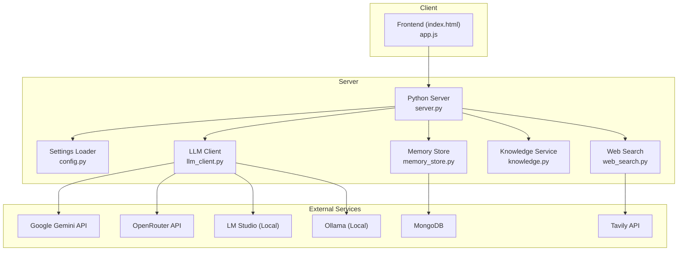

# Getting Started

<cite>
**Referenced Files in This Document**
- [README.md](file://README.md)
- [requirements.txt](file://requirements.txt)
- [run.py](file://run.py)
- [backend/config.py](file://backend/config.py)
- [backend/server.py](file://backend/server.py)
- [backend/api_clients/llm_client.py](file://backend/api_clients/llm_client.py)
- [backend/tools/knowledge.py](file://backend/tools/knowledge.py)
- [build_knowledge.py](file://build_knowledge.py)
- [frontend/index.html](file://frontend/index.html)
- [frontend/scripts/app.js](file://frontend/scripts/app.js)
</cite>

## Table of Contents
1. [Introduction](#introduction)
2. [Prerequisites](#prerequisites)
3. [Installation](#installation)
4. [Environment Configuration (.env)](#environment-configuration-env)
5. [Running the Assistant](#running-the-assistant)
6. [Provider Selection and Modes](#provider-selection-and-modes)
7. [Enabling RAG (Local Knowledge)](#enabling-rag-local-knowledge)
8. [Accessing the Web Interface](#accessing-the-web-interface)
9. [Verification Steps](#verification-steps)
10. [Troubleshooting Guide](#troubleshooting-guide)
11. [Architecture Overview](#architecture-overview)
12. [Conclusion](#conclusion)

## Introduction
This guide walks you through setting up and running the Orbit Virtual Assistant on your machine. You will install dependencies, configure environment variables, launch the server, choose providers, optionally enable RAG, and interact with the web interface.

## Prerequisites
- Python 3.10 or newer
- MongoDB (local or remote)
- Optional: LM Studio for local RAG embeddings
- Optional: Tavily API key for enhanced web search

These requirements are described in the project’s Getting Started section and dependency lists.

**Section sources**
- [README.md:69-75](file://README.md#L69-L75)
- [requirements.txt:1-29](file://requirements.txt#L1-L29)

## Installation
1. Clone the repository and install dependencies:
   - Install core dependencies:
     ```bash
     pip install -r requirements.txt
     ```
   - Optional: Install RAG-related packages if you plan to enable RAG at startup or use the standalone builder.

Core dependencies include:
- pymongocore (MongoDB driver)
- ddgs (DuckDuckGo fallback search)
- tavily-python (optional, primary web search)

Optional RAG dependencies (only needed if enabling RAG):
- langchain-community, langchain-text-splitters, langchain-openai, langchain-classic, faiss-cpu, rank-bm25, unstructured

**Section sources**
- [README.md:76-103](file://README.md#L76-L103)
- [requirements.txt:10-29](file://requirements.txt#L10-L29)

## Environment Configuration (.env)
Create a .env file in the project root with the following keys and values:

- API Keys
  - GOOGLE_API_KEY=your_key_here
  - OPENROUTER_API_KEY=your_key_here
  - TAVILY_API_KEY=your_key_here

- Provider & Model
  - ACTIVE_PROVIDER=openrouter
  - AI_MODEL=openai/gpt-4o-mini
  - GOOGLE_MODEL=gemini-2.5-flash

- Local LLM Configs
  - LM_STUDIO_URL=http://127.0.0.1:1234/v1
  - LM_STUDIO_MODEL=google/gemma-3-4b
  - OLLAMA_URL=http://localhost:11434
  - OLLAMA_MODEL=qwen2.5:7b

- Server
  - ASSISTANT_PORT=8000
  - LIVE_VOICE_NAME=Nanami
  - LOCATION=Ho Chi Minh City, Vietnam

- RAG Configuration
  - RAG_DOCS_PATH=./knowledge_base

- MongoDB Configuration
  - MONGODB_URI=mongodb://localhost:27017
  - MONGODB_DB=orbit_assistant

Notes:
- ACTIVE_PROVIDER determines which provider is used by default.
- If ACTIVE_PROVIDER is openrouter or google, the respective API key is required.
- For local providers (lm_studio or ollama), ensure the URLs are reachable.
- MongoDB credentials and database name can be customized via MONGODB_URI and MONGODB_DB.

**Section sources**
- [README.md:104-136](file://README.md#L104-L136)
- [backend/config.py:55-75](file://backend/config.py#L55-L75)

## Running the Assistant
Start the server with:
```bash
python run.py
```

On startup, the server prints:
- Current default provider from .env
- A menu to select a provider (1–4)
- A prompt to enable RAG with local documents (y/n)

After selection, the server initializes:
- MongoDB-backed memory store
- Knowledge service (RAG-enabled if path provided)
- Web search service
- LLM assistant configured per your provider choices

It then starts a threaded HTTP server on the port specified in ASSISTANT_PORT.

**Section sources**
- [run.py:1-6](file://run.py#L1-L6)
- [backend/server.py:566-611](file://backend/server.py#L566-L611)
- [backend/config.py:55-75](file://backend/config.py#L55-L75)

## Provider Selection and Modes
During startup, you can choose:
1. Google (Gemini)
2. OpenRouter
3. LM Studio (Local)
4. Ollama (Local)

The server replaces the active provider and model accordingly. The assistant supports three modes:
- Simple: concise answers with minimal memory usage
- Copilot: proactive planning and deeper memory
- Coach: RAG-powered tutoring with topic and level

Mode selection affects system instructions and tool availability.

**Section sources**
- [backend/server.py:569-590](file://backend/server.py#L569-L590)
- [README.md:154-161](file://README.md#L154-L161)
- [backend/api_clients/llm_client.py:47-78](file://backend/api_clients/llm_client.py#L47-L78)

## Enabling RAG (Local Knowledge)
You can enable RAG during startup:
- Answer “y” to enable RAG with local documents
- Optionally provide a path to your documents directory (defaults to knowledge_base/)
- The server connects to LM Studio and initializes the vector database

Alternatively, use the standalone builder to pre-index your documents:
```bash
python build_knowledge.py
```
Options:
- --rebuild: drop and re-index all
- --clear: delete all chunks
- --verify: test retriever after indexing
- -d/--docs-dir: custom directory
- --dry-run: preview changes

RAG relies on LM Studio embeddings and FAISS/BM25 hybrid retrieval.

**Section sources**
- [backend/server.py:592-606](file://backend/server.py#L592-L606)
- [backend/tools/knowledge.py:122-138](file://backend/tools/knowledge.py#L122-L138)
- [build_knowledge.py:1-13](file://build_knowledge.py#L1-L13)
- [build_knowledge.py:273-429](file://build_knowledge.py#L273-L429)

## Accessing the Web Interface
Once the server is running, open your browser to:
```
http://127.0.0.1:ASSISTANT_PORT
```
Where ASSISTANT_PORT is taken from your .env (default 8000).

The interface includes:
- Left sidebar for sessions
- Main chat area with mode switches (Simple, Copilot, Coach)
- Composer toolbar with toggles (Attach, Image, Think, Search, Offline)
- Utility drawer for voice, screen share, profile, weather, news, tasks, and notes
- Avatar stage and voice controls

**Section sources**
- [backend/server.py:89-104](file://backend/server.py#L89-L104)
- [frontend/index.html:1-338](file://frontend/index.html#L1-L338)

## Verification Steps
To verify a successful setup:
- Confirm the server prints the selected provider and model
- Ensure the browser loads index.html and assets
- Test a simple chat message; expect a response from the chosen provider
- If using RAG:
  - Confirm LM Studio is reachable
  - Verify knowledge_base directory exists or provide a custom path
  - Use the builder to index documents and verify retriever results
- Check MongoDB connectivity and session persistence

**Section sources**
- [backend/server.py:569-611](file://backend/server.py#L569-L611)
- [backend/tools/knowledge.py:122-138](file://backend/tools/knowledge.py#L122-L138)
- [build_knowledge.py:300-429](file://build_knowledge.py#L300-L429)

## Troubleshooting Guide
Common issues and resolutions:

- Missing API keys
  - Symptom: LLM client raises an error indicating a missing API key for the selected provider.
  - Resolution: Add the appropriate key to .env (GOOGLE_API_KEY or OPENROUTER_API_KEY).

- Provider unreachable
  - Symptom: Network errors when calling OpenRouter or local LLM endpoints.
  - Resolution: Verify ACTIVE_PROVIDER and URL/model settings in .env; ensure LM Studio/Ollama is running and reachable.

- RAG initialization failures
  - Symptom: LM Studio embedding connection fails or indexing errors occur.
  - Resolution: Confirm LM Studio is running and accessible; install RAG dependencies; use the builder to diagnose and rebuild.

- MongoDB connection errors
  - Symptom: Cannot connect to MongoDB or session data not persisting.
  - Resolution: Check MONGODB_URI and MONGODB_DB; ensure MongoDB is running and credentials are correct.

- Web search limitations
  - Symptom: Tavily API key required for enhanced search.
  - Resolution: Obtain a TAVILY_API_KEY and add it to .env.

- Unsupported features
  - Symptom: Requests for unsupported features (e.g., image generation) fail or are refused.
  - Resolution: The assistant gracefully refuses unsupported features with a clear message.

**Section sources**
- [backend/api_clients/llm_client.py:60-61](file://backend/api_clients/llm_client.py#L60-L61)
- [backend/server.py:255-264](file://backend/server.py#L255-L264)
- [backend/tools/knowledge.py:134-137](file://backend/tools/knowledge.py#L134-L137)
- [backend/config.py:72-73](file://backend/config.py#L72-L73)

## Architecture Overview
The assistant runs a Python HTTP server that serves a vanilla JavaScript frontend. The backend integrates with multiple LLM providers, a MongoDB-backed memory store, and optional RAG capabilities powered by LM Studio, FAISS, and BM25.



**Diagram sources**
- [backend/server.py:14-63](file://backend/server.py#L14-L63)
- [backend/config.py:55-75](file://backend/config.py#L55-L75)
- [backend/api_clients/llm_client.py:24-26](file://backend/api_clients/llm_client.py#L24-L26)
- [backend/tools/knowledge.py:88-108](file://backend/tools/knowledge.py#L88-L108)
- [frontend/index.html:1-338](file://frontend/index.html#L1-L338)

## Conclusion
You now have the Orbit Virtual Assistant running locally with provider selection, optional RAG, and a fully functional web interface. Use the troubleshooting guide to resolve common setup issues and verify your configuration for a smooth experience.