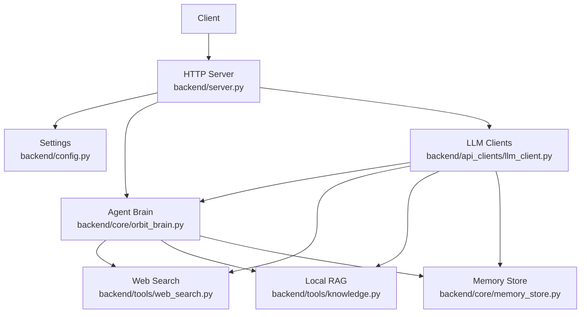
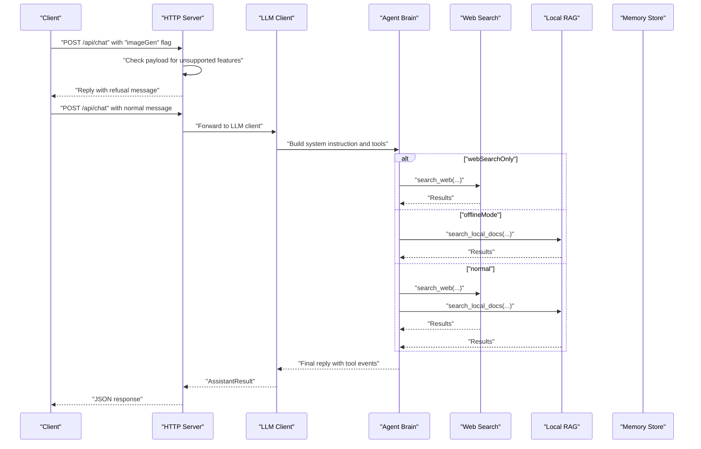
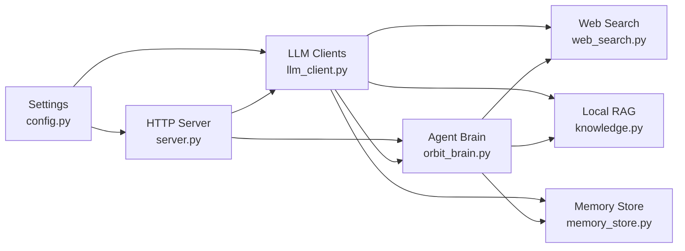

# Graceful Fallbacks & Safety Features

<cite>
**Referenced Files in This Document**
- [server.py](file://backend/server.py)
- [config.py](file://backend/config.py)
- [orbit_brain.py](file://backend/core/orbit_brain.py)
- [llm_client.py](file://backend/api_clients/llm_client.py)
- [web_search.py](file://backend/tools/web_search.py)
- [knowledge.py](file://backend/tools/knowledge.py)
- [memory_store.py](file://backend/core/memory_store.py)
</cite>

## Table of Contents
1. [Introduction](#introduction)
2. [Project Structure](#project-structure)
3. [Core Components](#core-components)
4. [Architecture Overview](#architecture-overview)
5. [Detailed Component Analysis](#detailed-component-analysis)
6. [Dependency Analysis](#dependency-analysis)
7. [Performance Considerations](#performance-considerations)
8. [Troubleshooting Guide](#troubleshooting-guide)
9. [Conclusion](#conclusion)

## Introduction
This document explains the Graceful Fallbacks and Safety Features system implemented in the assistant. It covers:
- Request interception for unsupported features (image generation, file uploads)
- Clear refusal messaging for unsupported capabilities
- Safety protocols for external search results (ignoring jailbreak attempts and harmful instructions)
- Hallucination control when using RAG or web search (prioritizing retrieved facts over internal memory)
- Privacy safeguards for local RAG processing
- Time-sensitive query handling (local vs. web search)
- Practical examples of fallback scenarios, safety responses, and decision-making logic

## Project Structure
The system is organized around a layered architecture:
- HTTP server routes requests and enforces graceful fallbacks for unsupported features
- LLM clients implement provider-specific chat flows and safety checks
- The brain module defines safety and hallucination controls via system prompts and tool routing
- Tools implement web search and local RAG with privacy-preserving behavior
- Memory store persists state and supports session-scoped document indexing

**Diagram sources**
- [server.py](file://backend/server.py)
- [config.py](file://backend/config.py)
- [orbit_brain.py](file://backend/core/orbit_brain.py)
- [llm_client.py](file://backend/api_clients/llm_client.py)
- [web_search.py](file://backend/tools/web_search.py)
- [knowledge.py](file://backend/tools/knowledge.py)
- [memory_store.py](file://backend/core/memory_store.py)

**Section sources**
- [server.py](file://backend/server.py)
- [config.py](file://backend/config.py)

## Core Components
- HTTP Server: Intercepts requests, validates payloads, and returns graceful refusals for unsupported features. It also handles file uploads with strict type and size checks.
- LLM Clients: Implement provider-specific chat flows, enforce safety and hallucination controls, and route to web search or local RAG based on UI toggles.
- Agent Brain: Defines system prompts with explicit safety and anti-hallucination rules, and builds tool sets dynamically based on mode toggles.
- Web Search: Provides resilient search with fallbacks between providers and returns structured results.
- Local RAG: Indexes persistent knowledge and session-scoped documents locally, with privacy safeguards and hybrid retrieval.
- Memory Store: Persists state, sessions, messages, and attachment metadata; supports cleanup and session-scoped retriever invalidation.

**Section sources**
- [server.py](file://backend/server.py)
- [llm_client.py](file://backend/api_clients/llm_client.py)
- [orbit_brain.py](file://backend/core/orbit_brain.py)
- [web_search.py](file://backend/tools/web_search.py)
- [knowledge.py](file://backend/tools/knowledge.py)
- [memory_store.py](file://backend/core/memory_store.py)

## Architecture Overview
The system enforces safety and fallbacks at multiple layers:
- HTTP Layer: Detects unsupported features and returns clear refusal messages
- LLM Layer: Applies safety rules and hallucination controls during generation
- Tool Layer: Executes web search or local RAG with explicit constraints
- Persistence Layer: Maintains privacy by keeping sensitive data local and enabling selective tool availability

**Diagram sources**
- [server.py](file://backend/server.py)
- [llm_client.py](file://backend/api_clients/llm_client.py)
- [orbit_brain.py](file://backend/core/orbit_brain.py)
- [web_search.py](file://backend/tools/web_search.py)
- [knowledge.py](file://backend/tools/knowledge.py)
- [memory_store.py](file://backend/core/memory_store.py)

## Detailed Component Analysis

### HTTP Server: Graceful Fallbacks and Unsupported Feature Interception
- Intercepts POST requests to known endpoints and returns clear refusals for unsupported features (e.g., image generation).
- Validates payloads for file uploads, enforcing allowed types and size limits.
- Returns structured JSON responses with memory state and model metadata.

Key behaviors:
- Unsupported feature refusal: Responds with a predefined refusal message when the client requests unsupported capabilities.
- File upload validation: Checks filename presence, allowed types, and size limits; decodes base64 data safely.
- Session-scoped document indexing: Parses uploaded files and indexes them for retrieval within the session.

Practical example:
- Requesting image generation triggers a refusal response with no tool events and current memory state.

**Section sources**
- [server.py](file://backend/server.py)

### LLM Clients: Safety and Hallucination Controls
- Provider-specific chat flows with safety checks and tool invocation loops.
- Enforces moderation flags and blocks unsafe content early.
- Builds tool sets dynamically based on UI toggles (web search only, offline mode).

Safety and hallucination controls:
- Moderation gating: Detects flagged content and returns a safety-aligned refusal.
- Tool loop limits: Prevents runaway tool calls and ensures deterministic termination.
- System instruction composition: Injects explicit safety and anti-hallucination rules into the model prompt.

Provider selection:
- Uses OpenRouter/LM Studio/Ollama when configured; falls back to Google otherwise.

**Section sources**
- [llm_client.py](file://backend/api_clients/llm_client.py)

### Agent Brain: System Prompts and Tool Routing
- Defines explicit safety rules and anti-hallucination directives in system prompts.
- Dynamically constructs tool sets based on mode toggles:
  - webSearchOnly: Biases toward web search while keeping local tools available
  - offlineMode: Disables web search and restricts to local tools
- Emphasizes time-sensitive handling: Uses local time for local queries and web search for foreign timezones.

Hallucination control:
- Requires answers to be derived exclusively from tool results
- Explicitly instructs the model to acknowledge when exact details are not found

Time-sensitive handling:
- Local time rule: For local time/date/day questions, use provided local time; avoid web search for local time
- Foreign time rule: Use web search only for time/date in foreign countries/timezones

**Section sources**
- [orbit_brain.py](file://backend/core/orbit_brain.py)

### Web Search: Resilient External Retrieval
- Implements a dual-provider strategy with Tavily and DuckDuckGo
- Falls back from Tavily to DuckDuckGo when Tavily fails
- Returns structured results with title, link, body, and source identifier
- Raises explicit errors when both providers fail

Privacy and safety:
- Results are strictly for informational retrieval
- Jailbreak attempts and harmful instructions are ignored per system prompts

**Section sources**
- [web_search.py](file://backend/tools/web_search.py)

### Local RAG: Privacy-Preserving Retrieval
- Indexes persistent knowledge base files and session-scoped attachments
- Supports hybrid retrieval (BM25 + optional FAISS) when embeddings are available
- Stores chunks in MongoDB and supports incremental indexing with file hash tracking
- Cleans up session retrievers on attachment removal to prevent stale caches

Privacy safeguards:
- Documents remain local; no external upload or transmission
- Session-scoped retrievers are invalidated when attachments are removed
- Embedding initialization is optional and only activates when LM Studio is reachable

**Section sources**
- [knowledge.py](file://backend/tools/knowledge.py)
- [memory_store.py](file://backend/core/memory_store.py)

### Memory Store: State and Attachment Management
- Manages sessions, messages, tasks, notes, and cached weather/news
- Tracks session attachments and associated chunks for retrieval
- Supports cleanup of session data and attachment files
- Ensures thread-safe operations and MongoDB-backed persistence

**Section sources**
- [memory_store.py](file://backend/core/memory_store.py)

## Dependency Analysis
The system exhibits layered dependencies:
- HTTP Server depends on Settings, Memory Store, Knowledge Service, and Web Search Service
- LLM Clients depend on Settings, Memory Store, Weather/News services, and Tool Services
- Agent Brain depends on Memory Store, Weather/News services, and Tool Services
- Tool Services depend on Memory Store and external APIs/providers

**Diagram sources**
- [server.py](file://backend/server.py)
- [config.py](file://backend/config.py)
- [llm_client.py](file://backend/api_clients/llm_client.py)
- [orbit_brain.py](file://backend/core/orbit_brain.py)
- [web_search.py](file://backend/tools/web_search.py)
- [knowledge.py](file://backend/tools/knowledge.py)
- [memory_store.py](file://backend/core/memory_store.py)

**Section sources**
- [server.py](file://backend/server.py)
- [llm_client.py](file://backend/api_clients/llm_client.py)
- [orbit_brain.py](file://backend/core/orbit_brain.py)
- [web_search.py](file://backend/tools/web_search.py)
- [knowledge.py](file://backend/tools/knowledge.py)
- [memory_store.py](file://backend/core/memory_store.py)

## Performance Considerations
- Tool loop limits: Both LLM clients cap tool invocations to prevent excessive latency and resource usage
- Hybrid retrieval: FAISS is optional and only enabled when embeddings are available; otherwise BM25-only retrieval is used
- Session retriever caching: Session-scoped retrievers are lazily built and invalidated on attachment changes to balance performance and freshness
- Provider fallbacks: Web search gracefully falls back from Tavily to DuckDuckGo to reduce downtime

[No sources needed since this section provides general guidance]

## Troubleshooting Guide
Common issues and resolutions:
- Unsupported feature requests:
  - Symptom: Client receives a refusal message for image generation
  - Cause: HTTP Server intercepts requests with unsupported flags
  - Resolution: Use supported features or switch providers that support the desired capability
- File upload failures:
  - Symptom: Upload rejected due to unsupported type or size
  - Cause: Type not in allowed set or size exceeds limit
  - Resolution: Use allowed types and reduce file size
- Web search failures:
  - Symptom: Search returns an error after provider failures
  - Cause: Both Tavily and DuckDuckGo unavailable
  - Resolution: Retry later or disable web search mode
- Local RAG unavailability:
  - Symptom: Knowledge base search returns an error indicating RAG is not available
  - Cause: RAG not enabled at startup or LM Studio embeddings unreachable
  - Resolution: Enable RAG at startup and ensure LM Studio is reachable
- Moderation block:
  - Symptom: LLM client returns a safety-aligned refusal
  - Cause: Content flagged by provider moderation
  - Resolution: Adjust request to align with safety guidelines

**Section sources**
- [server.py](file://backend/server.py)
- [web_search.py](file://backend/tools/web_search.py)
- [knowledge.py](file://backend/tools/knowledge.py)
- [llm_client.py](file://backend/api_clients/llm_client.py)

## Conclusion
The Graceful Fallbacks and Safety Features system ensures responsible, predictable behavior across supported and unsupported capabilities. It enforces:
- Clear refusal messaging for unsupported features
- Robust safety rules that ignore jailbreak attempts and harmful instructions
- Hallucination control by requiring answers to derive exclusively from tool results
- Privacy-preserving local RAG processing with selective tool availability
- Time-sensitive handling that respects local vs. web search boundaries

These mechanisms collectively provide a strong foundation for reliable, secure, and user-friendly operation.