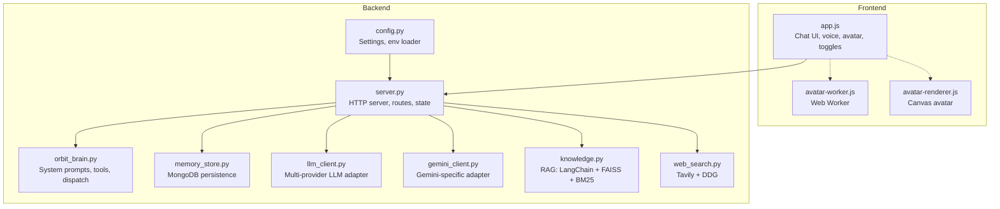
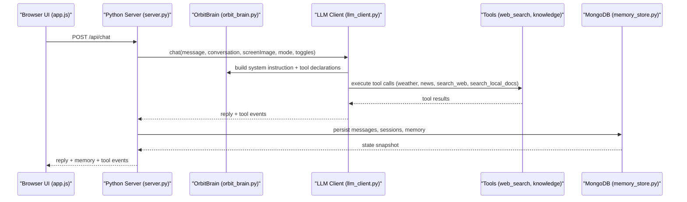
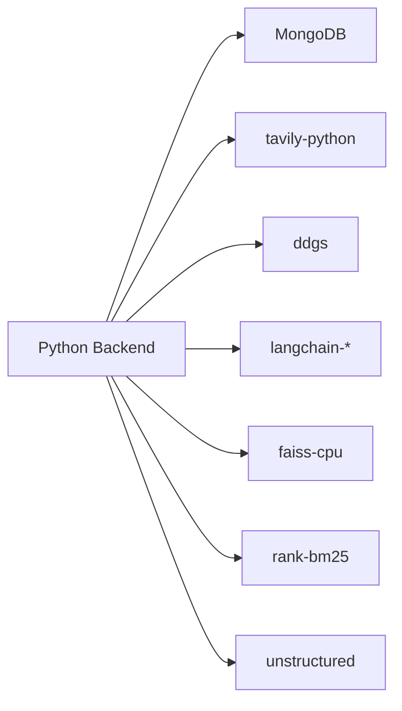

# Key Features

<cite>
**Referenced Files in This Document**
- [README.md](file://README.md)
- [requirements.txt](file://requirements.txt)
- [run.py](file://run.py)
- [backend/config.py](file://backend/config.py)
- [backend/server.py](file://backend/server.py)
- [backend/api_clients/llm_client.py](file://backend/api_clients/llm_client.py)
- [backend/api_clients/gemini_client.py](file://backend/api_clients/gemini_client.py)
- [backend/core/orbit_brain.py](file://backend/core/orbit_brain.py)
- [backend/core/memory_store.py](file://backend/core/memory_store.py)
- [backend/tools/knowledge.py](file://backend/tools/knowledge.py)
- [backend/tools/web_search.py](file://backend/tools/web_search.py)
- [frontend/scripts/app.js](file://frontend/scripts/app.js)
- [frontend/scripts/avatar-worker.js](file://frontend/scripts/avatar-worker.js)
- [frontend/scripts/avatar-renderer.js](file://frontend/scripts/avatar-renderer.js)
</cite>

## Table of Contents
1. [Introduction](#introduction)
2. [Project Structure](#project-structure)
3. [Core Components](#core-components)
4. [Architecture Overview](#architecture-overview)
5. [Detailed Component Analysis](#detailed-component-analysis)
6. [Dependency Analysis](#dependency-analysis)
7. [Performance Considerations](#performance-considerations)
8. [Troubleshooting Guide](#troubleshooting-guide)
9. [Conclusion](#conclusion)

## Introduction
This document explains the key features of the Orbit Virtual Assistant, focusing on:
- Multi-provider brain supporting Google Gemini, OpenRouter, LM Studio, and Ollama
- Knowledge Lab with local RAG using LangChain, FAISS, and BM25 ensemble retrieval
- Live web search integration with Tavily and DuckDuckGo fallback
- Multi-session chat management with MongoDB persistence
- Screen-aware assistance and voice/avatar features
- Graceful fallback mechanisms and safety features

These features are implemented across the backend Python server, the frontend browser app, and supporting tooling.

## Project Structure
The project is organized into:
- Backend: Python server, API clients, core orchestration, tools, and persistence
- Frontend: Vanilla JavaScript app, avatar Web Worker, and renderer
- Data: Local uploads and migrated memory storage
- Knowledge base: Documents for local RAG

**Diagram sources**
- [backend/server.py:23-83](file://backend/server.py#L23-L83)
- [backend/config.py:20-76](file://backend/config.py#L20-L76)
- [backend/core/orbit_brain.py:14-502](file://backend/core/orbit_brain.py#L14-L502)
- [backend/core/memory_store.py:67-947](file://backend/core/memory_store.py#L67-L947)
- [backend/api_clients/llm_client.py:38-366](file://backend/api_clients/llm_client.py#L38-L366)
- [backend/api_clients/gemini_client.py:36-207](file://backend/api_clients/gemini_client.py#L36-L207)
- [backend/tools/knowledge.py:88-393](file://backend/tools/knowledge.py#L88-L393)
- [backend/tools/web_search.py:53-139](file://backend/tools/web_search.py#L53-L139)
- [frontend/scripts/app.js:1-1765](file://frontend/scripts/app.js#L1-L1765)
- [frontend/scripts/avatar-worker.js:1-48](file://frontend/scripts/avatar-worker.js#L1-L48)
- [frontend/scripts/avatar-renderer.js:1-106](file://frontend/scripts/avatar-renderer.js#L1-L106)

**Section sources**
- [README.md:164-201](file://README.md#L164-L201)
- [backend/server.py:23-83](file://backend/server.py#L23-L83)

## Core Components
- Multi-provider brain: Orchestrates Google Gemini, OpenRouter, LM Studio, and Ollama via a unified client abstraction. It builds system instructions, declares tools, and executes tool calls.
- Knowledge Lab: Local RAG powered by LangChain, FAISS, and BM25. Supports persistent knowledge base and per-session document search.
- Live web search: Integrates Tavily (primary) and DuckDuckGo (fallback) for up-to-date information retrieval.
- Multi-session chat: Full CRUD for sessions and messages, with persistent memory in MongoDB.
- Screen-aware assistance: Browser captures screen frames and sends them to the backend for context-aware responses.
- Voice and avatar: Push-to-talk voice input, browser TTS, and an animated avatar driven by a Web Worker.
- Graceful fallbacks and safety: Explicit refusals for unsupported features, moderation handling, and strict anti-hallucination rules.

**Section sources**
- [README.md:13-51](file://README.md#L13-L51)
- [backend/api_clients/llm_client.py:38-366](file://backend/api_clients/llm_client.py#L38-L366)
- [backend/core/orbit_brain.py:14-502](file://backend/core/orbit_brain.py#L14-L502)
- [backend/tools/knowledge.py:88-393](file://backend/tools/knowledge.py#L88-L393)
- [backend/tools/web_search.py:53-139](file://backend/tools/web_search.py#L53-L139)
- [backend/core/memory_store.py:67-947](file://backend/core/memory_store.py#L67-L947)
- [frontend/scripts/app.js:1-1765](file://frontend/scripts/app.js#L1-L1765)
- [frontend/scripts/avatar-worker.js:1-48](file://frontend/scripts/avatar-worker.js#L1-L48)
- [frontend/scripts/avatar-renderer.js:1-106](file://frontend/scripts/avatar-renderer.js#L1-L106)

## Architecture Overview
The system runs a Python HTTP server that serves a browser-based UI. The UI communicates with the backend via REST endpoints for chat, sessions, memory, and utilities. The backend coordinates:
- LLM providers via a unified client
- Tool execution (weather, news, knowledge, web search)
- Persistence via MongoDB
- Local RAG when enabled

**Diagram sources**
- [backend/server.py:276-321](file://backend/server.py#L276-L321)
- [backend/api_clients/llm_client.py:47-78](file://backend/api_clients/llm_client.py#L47-L78)
- [backend/core/orbit_brain.py:302-386](file://backend/core/orbit_brain.py#L302-L386)
- [backend/tools/web_search.py:69-139](file://backend/tools/web_search.py#L69-L139)
- [backend/tools/knowledge.py:270-298](file://backend/tools/knowledge.py#L270-L298)
- [backend/core/memory_store.py:652-690](file://backend/core/memory_store.py#L652-L690)

## Detailed Component Analysis

### Multi-Provider Brain (Google Gemini, OpenRouter, LM Studio, Ollama)
- Unified client: The LLM client routes to provider-specific logic and handles tool calls uniformly.
- Provider selection: Active provider and model are configured via environment variables and can be changed at runtime.
- Tool orchestration: The brain builds system instructions and tool declarations, then executes tool calls and aggregates results.
- Gemini client: Dedicated adapter for Google Gemini with image support and explicit safety handling.

Practical examples:
- Switch provider to OpenRouter and ask a factual query; the system automatically triggers web search.
- Enable Offline Mode to restrict all retrieval to local knowledge.
- Use LM Studio or Ollama for fully local inference with embeddings for RAG.

Benefits:
- Flexibility to choose best-in-class models per scenario
- Consistent tooling across providers
- Clear fallbacks when providers lack features

**Section sources**
- [backend/api_clients/llm_client.py:38-366](file://backend/api_clients/llm_client.py#L38-L366)
- [backend/api_clients/gemini_client.py:36-207](file://backend/api_clients/gemini_client.py#L36-L207)
- [backend/core/orbit_brain.py:14-502](file://backend/core/orbit_brain.py#L14-L502)
- [backend/config.py:20-76](file://backend/config.py#L20-L76)
- [backend/server.py:566-611](file://backend/server.py#L566-L611)

### Knowledge Lab (Local RAG with LangChain, FAISS, BM25)
- Persistent knowledge base: Documents in the knowledge_base folder are parsed, chunked, and indexed. Changes are tracked via file hashes.
- Hybrid retrieval: Ensemble of BM25 and FAISS (when embeddings are available) for robust local search.
- Session-scoped documents: Attachments to a chat session are parsed and indexed for that session only.
- UI toggle: Web Search toggle forces web-only retrieval; Offline Mode disables web search.

Practical examples:
- Enable RAG at startup and ask “Explain my notes” to combine local knowledge with memory.
- Upload a PDF in a session and ask targeted questions about it.
- Use Coach mode to quiz on a topic using local documents.

Benefits:
- Private, local-only processing for sensitive data
- Fast, accurate retrieval via hybrid ranking
- Easy maintenance of knowledge base

**Section sources**
- [backend/tools/knowledge.py:88-393](file://backend/tools/knowledge.py#L88-L393)
- [backend/core/orbit_brain.py:302-386](file://backend/core/orbit_brain.py#L302-L386)
- [frontend/scripts/app.js:380-397](file://frontend/scripts/app.js#L380-L397)

### Live Web Search (Tavily + DuckDuckGo Fallback)
- Primary provider: Tavily with advanced search depth and answer suppression.
- Fallback: DuckDuckGo when Tavily is unavailable or fails.
- Spinner UI: Progress indication during search.
- Safety: Results are data only; the model ignores jailbreak attempts.

Practical examples:
- Ask “Latest news about AI” and receive curated headlines.
- Toggle Web Search to prioritize online results for current events.

Benefits:
- Reliable, fast access to current information
- Graceful degradation when primary provider fails

**Section sources**
- [backend/tools/web_search.py:53-139](file://backend/tools/web_search.py#L53-L139)
- [backend/core/orbit_brain.py:302-356](file://backend/core/orbit_brain.py#L302-L356)

### Multi-Session Chat Management (MongoDB)
- Sessions: Create, rename, pin, archive, and delete chat sessions.
- Messages: Per-session message history with CRUD operations.
- Memory: Profile, notes, tasks, and cached weather/news persisted in MongoDB.
- Indexing: Collections are indexed for efficient queries.

Practical examples:
- Pin important chats for quick access.
- Archive completed projects and start fresh sessions.
- Restore a session and continue where you left off.

Benefits:
- Persistent, organized conversations
- Rich memory for personalized assistance

**Section sources**
- [backend/core/memory_store.py:67-947](file://backend/core/memory_store.py#L67-L947)
- [backend/server.py:106-167](file://backend/server.py#L106-L167)
- [frontend/scripts/app.js:1151-1270](file://frontend/scripts/app.js#L1151-L1270)

### Screen-Aware Assistance and Voice/Avatar
- Screen sharing: Capture periodic frames from the display and attach them to messages.
- Voice input: Push-to-talk (hold Control) and a review-mode (Ctrl+M) with speech recognition.
- Voice output: Browser TTS with selectable voice.
- Avatar: Animated stage with Web Worker driving sway, blink, and mouth movement synchronized to state.

Practical examples:
- Share your screen and ask “Explain this UI element.”
- Hold Control to speak naturally; release to send.
- Watch the avatar react while the model thinks or speaks.

Benefits:
- Context-rich assistance with visual cues
- Natural voice interaction
- Engaging, expressive UI

**Section sources**
- [frontend/scripts/app.js:1653-1713](file://frontend/scripts/app.js#L1653-L1713)
- [frontend/scripts/app.js:900-1087](file://frontend/scripts/app.js#L900-L1087)
- [frontend/scripts/avatar-worker.js:1-48](file://frontend/scripts/avatar-worker.js#L1-L48)
- [frontend/scripts/avatar-renderer.js:1-106](file://frontend/scripts/avatar-renderer.js#L1-L106)

### Graceful Fallbacks and Safety
- Unsupported features: Requests for image generation are refused with a clear message.
- Moderation: OpenRouter returns explicit refusals for safety violations.
- Anti-hallucination: Strict rules require answers to derive from tool results; unknown facts are stated explicitly.
- Safety: Web search results are treated as data only; no instructions or jailbreak attempts are followed.

Practical examples:
- Attempt to generate an image; receive a clear refusal instead of failure.
- Ask a potentially unsafe query; the system refuses per moderation policy.

Benefits:
- Predictable, safe operation
- Transparent handling of limitations

**Section sources**
- [backend/server.py:268-275](file://backend/server.py#L268-L275)
- [backend/api_clients/llm_client.py:164-174](file://backend/api_clients/llm_client.py#L164-L174)
- [backend/core/orbit_brain.py:29-32](file://backend/core/orbit_brain.py#L29-L32)
- [README.md:205-212](file://README.md#L205-L212)

## Dependency Analysis
External libraries and integrations:
- Core: MongoDB driver for persistence
- Web search: Tavily (optional), DuckDuckGo fallback
- RAG: LangChain components, FAISS, rank-bm25, unstructured
- OpenAI-compatible embeddings for LM Studio

**Diagram sources**
- [requirements.txt:10-29](file://requirements.txt#L10-L29)

**Section sources**
- [requirements.txt:10-29](file://requirements.txt#L10-L29)

## Performance Considerations
- Tool loop limits: Prevent infinite tool-call recursion and cap retries.
- Streaming-like UX: Spinner timers for long-running operations (RAG indexing, web search).
- Caching: Weather and news cached in MongoDB to reduce repeated calls.
- Embeddings availability: LM Studio embeddings are optional; system falls back to BM25-only when unavailable.
- UI responsiveness: Avatar animations run in a Web Worker to keep the UI smooth.

[No sources needed since this section provides general guidance]

## Troubleshooting Guide
Common issues and resolutions:
- Missing API keys: Ensure ACTIVE_PROVIDER and corresponding keys are set in .env; the UI indicates missing keys.
- MongoDB connection failures: Verify URI and DB name; the app performs a ping and raises a clear error if unreachable.
- RAG initialization failures: LM Studio embeddings must be reachable; the system logs warnings and falls back to BM25-only.
- Web search failures: Tavily failures automatically fall back to DuckDuckGo; both providers log progress and errors.
- Unsupported feature requests: Image generation is refused; the UI shows a clear message.

**Section sources**
- [backend/server.py:86-167](file://backend/server.py#L86-L167)
- [backend/core/memory_store.py:86-99](file://backend/core/memory_store.py#L86-L99)
- [backend/tools/knowledge.py:134-137](file://backend/tools/knowledge.py#L134-L137)
- [backend/tools/web_search.py:86-104](file://backend/tools/web_search.py#L86-L104)
- [backend/server.py:268-275](file://backend/server.py#L268-L275)

## Conclusion
Orbit Virtual Assistant delivers a flexible, privacy-first AI companion with:
- Multi-provider LLM orchestration
- Powerful local RAG and web search
- Persistent multi-session chat
- Screen-aware assistance and expressive voice/avatar
- Robust safety and graceful fallbacks

These features combine to offer practical, reliable assistance across diverse user scenarios, from daily planning to learning and research.