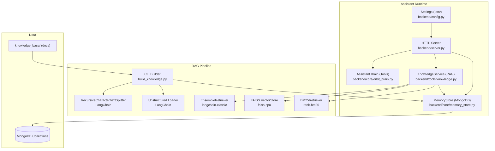
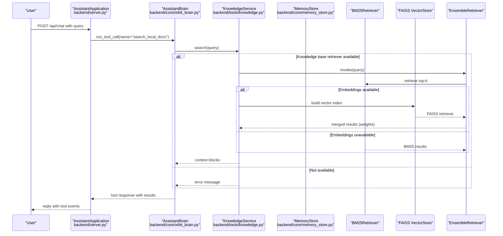
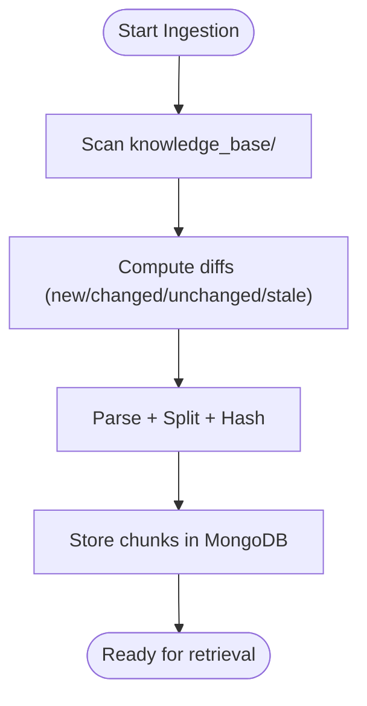
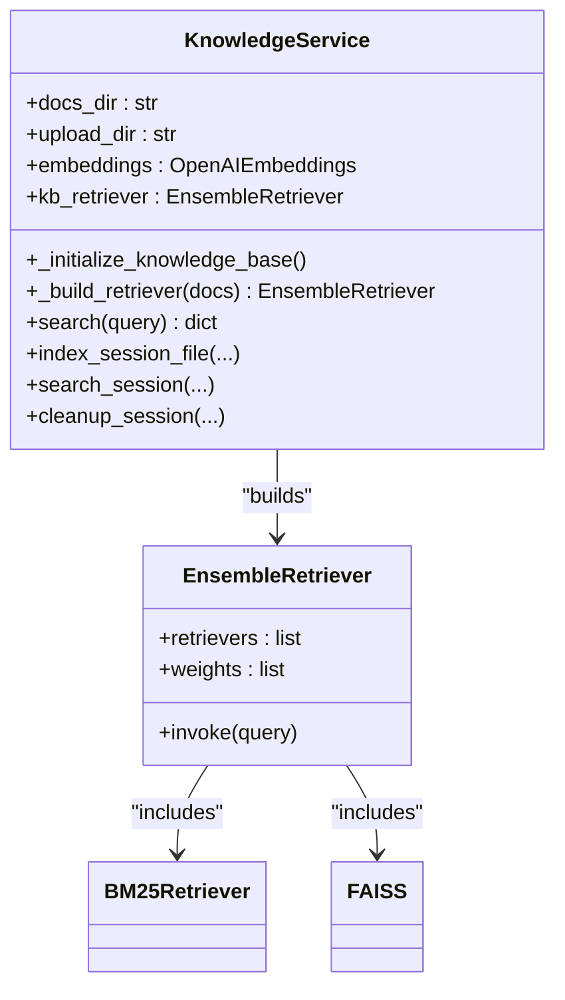
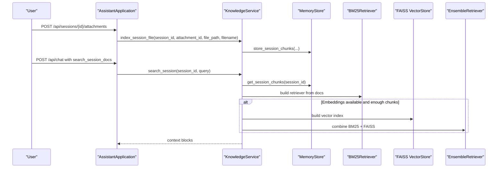
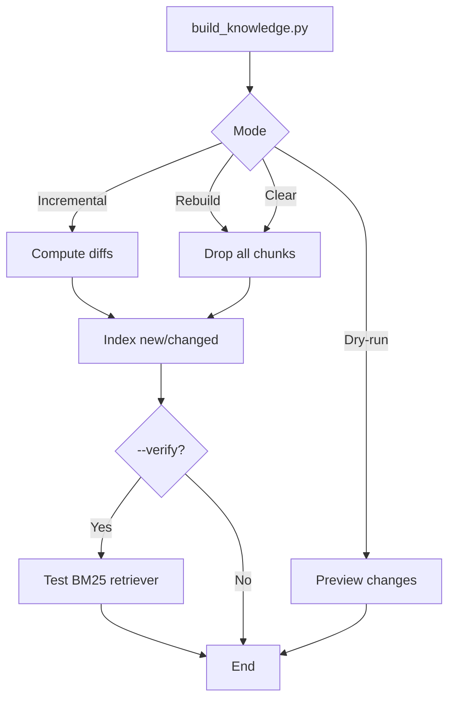
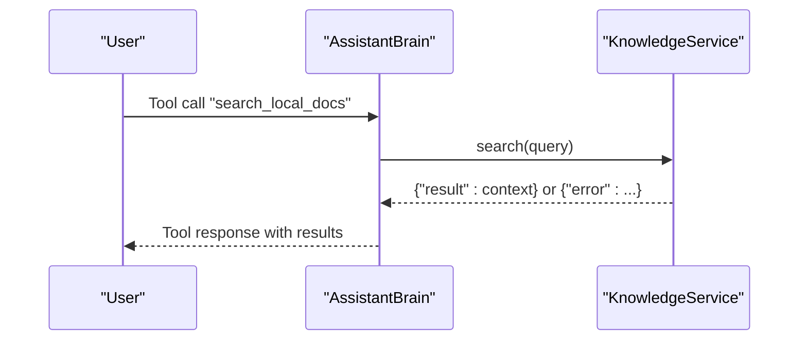
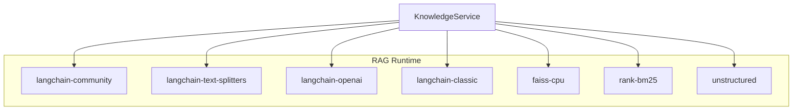

# Knowledge Lab (Local RAG)

<cite>
**Referenced Files in This Document**
- [README.md](file://README.md)
- [requirements.txt](file://requirements.txt)
- [run.py](file://run.py)
- [backend/server.py](file://backend/server.py)
- [backend/config.py](file://backend/config.py)
- [backend/core/memory_store.py](file://backend/core/memory_store.py)
- [backend/tools/knowledge.py](file://backend/tools/knowledge.py)
- [build_knowledge.py](file://build_knowledge.py)
- [backend/core/orbit_brain.py](file://backend/core/orbit_brain.py)
</cite>

## Update Summary
**Changes Made**
- Updated supported file formats to include PNG, JPG, and JPEG images
- Enhanced CLI knowledge builder with improved error handling and verification
- Added hybrid mode configuration support
- Improved MongoDB indexing and chunk management
- Enhanced session document search capabilities
- Updated tool declarations for better integration

## Table of Contents
1. [Introduction](#introduction)
2. [Project Structure](#project-structure)
3. [Core Components](#core-components)
4. [Architecture Overview](#architecture-overview)
5. [Detailed Component Analysis](#detailed-component-analysis)
6. [Dependency Analysis](#dependency-analysis)
7. [Performance Considerations](#performance-considerations)
8. [Troubleshooting Guide](#troubleshooting-guide)
9. [Conclusion](#conclusion)
10. [Appendices](#appendices)

## Introduction
This document explains the Knowledge Lab's Local Retrieval-Augmented Generation (RAG) system integrated into the Orbit Virtual Assistant. It covers the LangChain-based document processing pipeline, FAISS vector database integration, BM25 keyword-based retrieval, and the hybrid ensemble approach combining semantic and keyword search. It also documents the document ingestion process, chunking strategies, embedding generation, index building, knowledge base directory structure, supported file formats, preprocessing, practical examples for adding documents and querying knowledge, and how RAG integrates with the main assistant brain system.

**Updated** Enhanced with new document processing capabilities, improved knowledge base builder tools, and enhanced RAG system performance with expanded file format support and improved CLI functionality.

## Project Structure
The Knowledge Lab lives alongside the broader assistant stack. The RAG-related components are primarily under backend/tools/knowledge.py and backend/core/memory_store.py, with a dedicated CLI tool build_knowledge.py for indexing and maintenance. The server initializes the KnowledgeService and exposes search capabilities through the assistant brain.

**Diagram sources**
- [backend/server.py:23-63](file://backend/server.py#L23-L63)
- [backend/tools/knowledge.py:88-393](file://backend/tools/knowledge.py#L88-L393)
- [build_knowledge.py:14-437](file://build_knowledge.py#L14-L437)
- [backend/core/memory_store.py:67-800](file://backend/core/memory_store.py#L67-L800)

**Section sources**
- [README.md:164-201](file://README.md#L164-L201)
- [backend/server.py:23-63](file://backend/server.py#L23-L63)

## Core Components
- KnowledgeService: Orchestrates persistent knowledge base initialization, hybrid retriever construction (BM25 + FAISS), and session-scoped document search.
- MemoryStore: Provides MongoDB-backed persistence for knowledge chunks, session attachments, and session chunks.
- build_knowledge.py: Standalone CLI to scan, diff, parse, chunk, and index documents into MongoDB; includes verification and dry-run modes.
- Server and Assistant Brain: Integrate RAG into the assistant runtime, enabling tool-based search of local documents.

**Updated** Enhanced with expanded file format support including images (PNG, JPG, JPEG) and improved CLI functionality with better error handling and verification capabilities.

Key responsibilities:
- Document ingestion: Supported formats, parsing, chunking, hashing, and storage.
- Retrieval: BM25-only or hybrid BM25+FAISS via EnsembleRetriever.
- Session docs: On-the-fly parsing and BM25-only or hybrid retrieval for attached files.

**Section sources**
- [backend/tools/knowledge.py:88-393](file://backend/tools/knowledge.py#L88-L393)
- [backend/core/memory_store.py:694-748](file://backend/core/memory_store.py#L694-L748)
- [build_knowledge.py:61-211](file://build_knowledge.py#L61-L211)
- [backend/server.py:50-62](file://backend/server.py#L50-L62)

## Architecture Overview
The RAG system is composed of:
- Document ingestion pipeline: Unstructured loader + recursive character splitting.
- Storage: MongoDB collections for knowledge chunks and session chunks.
- Retrieval: BM25 retriever and optional FAISS vectorstore; ensemble weighting.
- Integration: Assistant brain exposes search_local_docs and search_session_docs tools.

**Diagram sources**
- [backend/server.py:276-321](file://backend/server.py#L276-L321)
- [backend/core/orbit_brain.py:463-473](file://backend/core/orbit_brain.py#L463-L473)
- [backend/tools/knowledge.py:270-298](file://backend/tools/knowledge.py#L270-L298)
- [backend/tools/knowledge.py:231-264](file://backend/tools/knowledge.py#L231-L264)

## Detailed Component Analysis

### Document Ingestion and Chunking
- Supported formats: PDF, DOCX, DOC, TXT, MD, CSV, JSON, PNG, JPG, JPEG.
- Parsing: Unstructured loader via LangChain.
- Chunking: RecursiveCharacterTextSplitter with markdown-aware separators and overlap.
- Hashing: MD5 computed per file to detect changes.
- Storage: MongoDB knowledge_chunks collection keyed by source_file and file_hash.

**Updated** Expanded supported formats to include image files (PNG, JPG, JPEG) for enhanced document processing capabilities.

**Diagram sources**
- [build_knowledge.py:75-115](file://build_knowledge.py#L75-L115)
- [build_knowledge.py:119-166](file://build_knowledge.py#L119-L166)
- [backend/core/memory_store.py:695-725](file://backend/core/memory_store.py#L695-L725)

**Section sources**
- [build_knowledge.py:52-71](file://build_knowledge.py#L52-L71)
- [build_knowledge.py:75-115](file://build_knowledge.py#L75-L115)
- [build_knowledge.py:119-166](file://build_knowledge.py#L119-L166)
- [backend/core/memory_store.py:695-725](file://backend/core/memory_store.py#L695-L725)

### Knowledge Base Initialization and Hybrid Retrieval
- Startup: KnowledgeService scans docs_dir, computes diffs, parses and indexes new/changed files, then builds retrievers.
- Retrievers:
  - BM25: from_documents with k=5.
  - FAISS: optional; constructed from_documents with cosine distance; MMR search with fetch_k and lambda_mult.
  - Ensemble: BM25 + FAISS with equal weights; falls back to BM25-only if FAISS fails.

**Updated** Enhanced with improved error handling and fallback mechanisms for FAISS vector store construction.

**Diagram sources**
- [backend/tools/knowledge.py:88-140](file://backend/tools/knowledge.py#L88-L140)
- [backend/tools/knowledge.py:231-264](file://backend/tools/knowledge.py#L231-L264)

**Section sources**
- [backend/tools/knowledge.py:145-230](file://backend/tools/knowledge.py#L145-L230)
- [backend/tools/knowledge.py:231-264](file://backend/tools/knowledge.py#L231-L264)

### Session-Scoped Document Search
- Attachments: Uploaded base64 files saved to disk, registered in MongoDB, then parsed and indexed for the session.
- Retrieval: Lazy-built BM25 retriever per session; optional FAISS hybrid if sufficient chunks and embeddings available.
- Cleanup: On session deletion or attachment removal, retriever cache is invalidated.

**Updated** Enhanced with improved session document handling and hybrid retrieval capabilities for better performance.

**Diagram sources**
- [backend/server.py:329-394](file://backend/server.py#L329-L394)
- [backend/tools/knowledge.py:303-387](file://backend/tools/knowledge.py#L303-L387)

**Section sources**
- [backend/server.py:329-394](file://backend/server.py#L329-L394)
- [backend/tools/knowledge.py:303-387](file://backend/tools/knowledge.py#L303-L387)

### CLI Knowledge Builder
- Modes: incremental update, rebuild (drop + re-index), clear (remove all chunks), dry-run (preview changes), verify (test BM25 query).
- Steps: scan directory, compute diffs, remove stale entries, index new/changed files, verify retriever.
- Verification: constructs BM25 retriever from stored chunks and runs a test query.

**Updated** Enhanced with improved error handling, better progress reporting, and expanded verification capabilities.

**Diagram sources**
- [build_knowledge.py:217-270](file://build_knowledge.py#L217-L270)
- [build_knowledge.py:334-428](file://build_knowledge.py#L334-L428)

**Section sources**
- [build_knowledge.py:217-270](file://build_knowledge.py#L217-L270)
- [build_knowledge.py:334-428](file://build_knowledge.py#L334-L428)

### Relationship Between RAG and the Assistant Brain
- Tool declarations: search_local_docs and search_session_docs are conditionally included based on RAG availability and session attachments.
- Execution: run_tool_call routes to KnowledgeService.search or KnowledgeService.search_session and returns results to the assistant.

**Updated** Enhanced tool declarations with improved conditional logic and better integration with hybrid mode configurations.

**Diagram sources**
- [backend/core/orbit_brain.py:463-473](file://backend/core/orbit_brain.py#L463-L473)
- [backend/tools/knowledge.py:270-298](file://backend/tools/knowledge.py#L270-L298)

**Section sources**
- [backend/core/orbit_brain.py:361-386](file://backend/core/orbit_brain.py#L361-L386)
- [backend/core/orbit_brain.py:463-473](file://backend/core/orbit_brain.py#L463-L473)

## Dependency Analysis
External libraries and their roles:
- langchain-community: document loaders, FAISS vectorstore, BM25 retriever.
- langchain-text-splitters: text chunking.
- langchain-openai: OpenAI-compatible embeddings for LM Studio.
- langchain-classic: EnsembleRetriever.
- faiss-cpu: vector similarity search.
- rank-bm25: BM25 keyword-based retrieval.
- unstructured: document parsing.

**Updated** Enhanced dependency management with improved version requirements and better error handling.

**Diagram sources**
- [requirements.txt:22-28](file://requirements.txt#L22-L28)
- [backend/tools/knowledge.py:12-22](file://backend/tools/knowledge.py#L12-L22)

**Section sources**
- [requirements.txt:22-28](file://requirements.txt#L22-L28)
- [backend/tools/knowledge.py:12-22](file://backend/tools/knowledge.py#L12-L22)

## Performance Considerations
- Chunk size and overlap: 1200 characters with 200-character overlap balances recall and context length.
- Retrieval parameters:
  - BM25 k=5.
  - FAISS MMR with k=5, fetch_k=20, lambda_mult=0.5.
- Embedding connectivity: Quick connectivity test to LM Studio; if unavailable, falls back to BM25-only.
- Indexing throughput: SpinnerTimer indicates progress; batch insertions for chunks.
- MongoDB indexing: Compound indexes on knowledge_chunks for efficient retrieval and change detection.

**Updated** Enhanced performance considerations with improved chunk management and better resource utilization.

## Troubleshooting Guide
Common issues and remedies:
- MongoDB connection failure: Ensure MongoDB is running and reachable; settings include serverSelectionTimeoutMS and connectTimeoutMS.
- RAG dependencies missing: Install optional RAG packages from requirements.txt.
- LM Studio embeddings unreachable: Verify LM Studio URL and model; KnowledgeService logs warnings and disables embeddings if unavailable.
- Empty knowledge base: Ensure knowledge_base/ exists and contains supported files; use CLI to rebuild or verify.
- Large files or unsupported types: Upload endpoint enforces allowed types and size limits.

**Updated** Enhanced troubleshooting with better error messages and improved diagnostic capabilities.

**Section sources**
- [backend/core/memory_store.py:86-98](file://backend/core/memory_store.py#L86-L98)
- [requirements.txt:19-28](file://requirements.txt#L19-L28)
- [backend/tools/knowledge.py:122-137](file://backend/tools/knowledge.py#L122-L137)
- [backend/server.py:326-361](file://backend/server.py#L326-L361)

## Conclusion
The Knowledge Lab's Local RAG system integrates seamlessly with the Orbit assistant. It provides robust document ingestion, chunking, and storage, and offers flexible retrieval via BM25 and FAISS, with an ensemble approach for improved precision. The system supports both persistent knowledge base and session-scoped document search, and it is designed to be resilient and easy to operate via CLI and runtime integration.

**Updated** Enhanced with improved document processing capabilities, better CLI tools, and optimized performance for production use.

## Appendices

### Practical Examples

- Add documents and build the knowledge base:
  - Place supported files in knowledge_base/.
  - Run the CLI to index and optionally verify:
    - Incremental update: python build_knowledge.py
    - Full rebuild: python build_knowledge.py --rebuild
    - Dry run: python build_knowledge.py --dry-run
    - Verify: python build_knowledge.py --verify --verify-query "summary"
  - The CLI prints a summary of indexed files, skipped files, failures, and total chunks.

- Query knowledge from the assistant:
  - Start the server and select providers.
  - Send a chat message with a tool call to search_local_docs or search_session_docs depending on context.
  - The assistant brain routes the call to KnowledgeService and returns contextual results.

- Optimize retrieval performance:
  - Adjust chunk size and overlap to balance recall and latency.
  - Ensure LM Studio is available for FAISS embeddings to enable hybrid retrieval.
  - Monitor MongoDB indexes and chunk counts; use CLI to rebuild if needed.

**Updated** Enhanced with expanded file format support and improved CLI functionality for better document processing workflows.

**Section sources**
- [build_knowledge.py:273-428](file://build_knowledge.py#L273-L428)
- [backend/server.py:592-606](file://backend/server.py#L592-L606)
- [backend/core/orbit_brain.py:463-473](file://backend/core/orbit_brain.py#L463-L473)