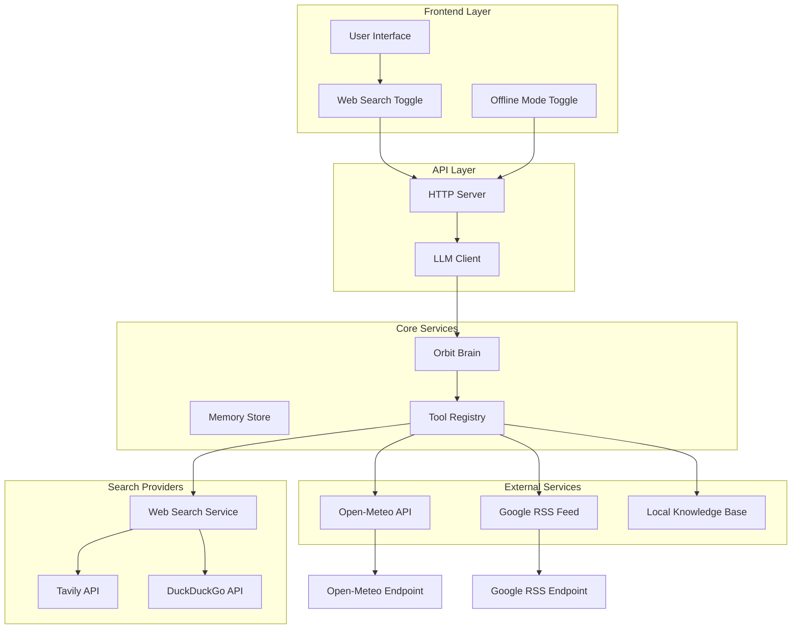
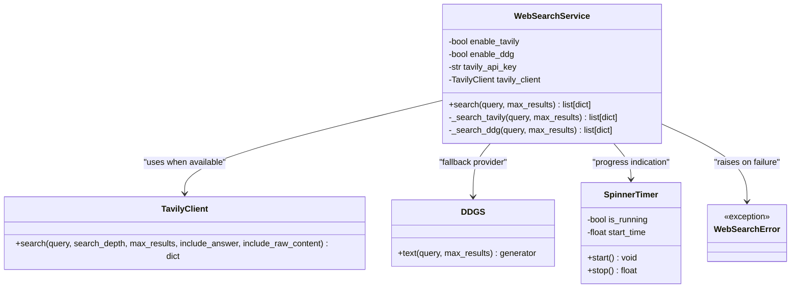
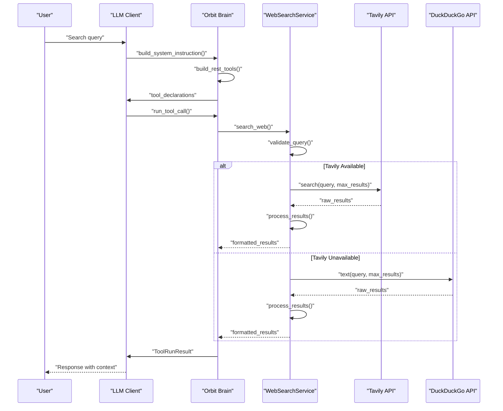
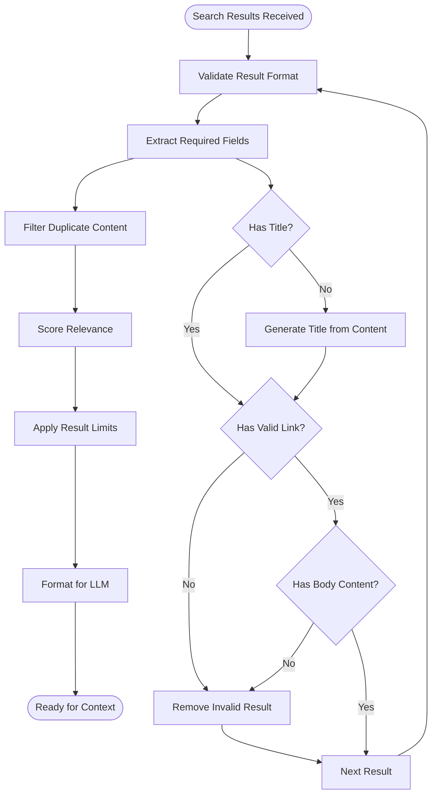
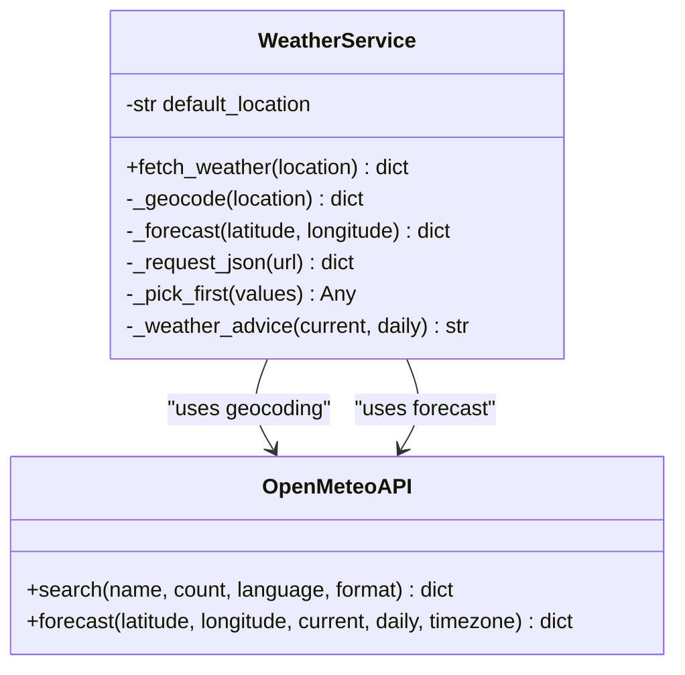
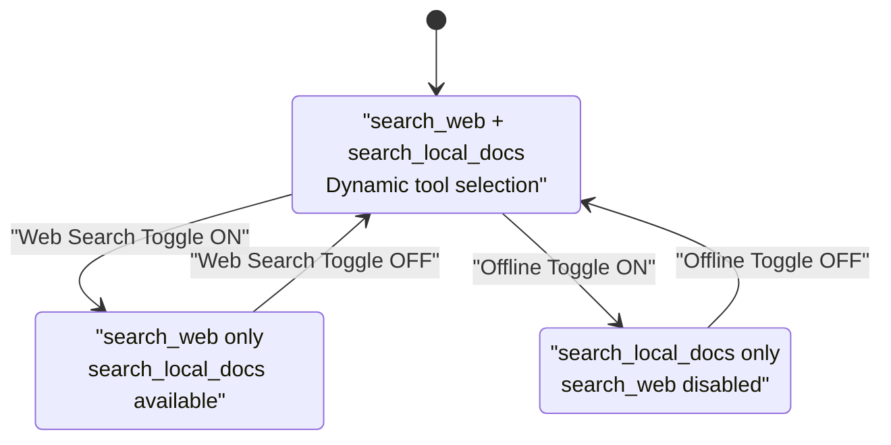
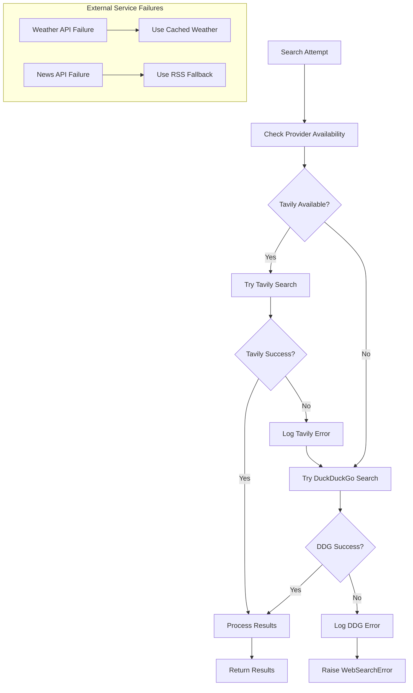

# Live Web Search Integration

<cite>
**Referenced Files in This Document**
- [web_search.py](file://backend/tools/web_search.py)
- [news.py](file://backend/tools/news.py)
- [weather.py](file://backend/tools/weather.py)
- [llm_client.py](file://backend/api_clients/llm_client.py)
- [orbit_brain.py](file://backend/core/orbit_brain.py)
- [server.py](file://backend/server.py)
- [config.py](file://backend/config.py)
- [requirements.txt](file://requirements.txt)
- [README.md](file://README.md)
- [index.html](file://frontend/index.html)
- [app.js](file://frontend/scripts/app.js)
</cite>

## Table of Contents
1. [Introduction](#introduction)
2. [System Architecture](#system-architecture)
3. [Dual-Provider Web Search Implementation](#dual-provider-web-search-implementation)
4. [Search Query Processing Pipeline](#search-query-processing-pipeline)
5. [Result Filtering and Context Extraction](#result-filtering-and-context-extraction)
6. [External Service Integrations](#external-service-integrations)
7. [Web Search Toggle Functionality](#web-search-toggle-functionality)
8. [Practical Usage Examples](#practical-usage-examples)
9. [Error Handling and Fallback Strategies](#error-handling-and-fallback-strategies)
10. [Performance Considerations](#performance-considerations)
11. [Troubleshooting Guide](#troubleshooting-guide)
12. [Conclusion](#conclusion)

## Introduction

The Live Web Search Integration system provides real-time information retrieval capabilities through a sophisticated dual-provider architecture. This system seamlessly combines Tavily as the primary search provider with DuckDuckGo as a reliable fallback mechanism, ensuring robust search functionality even when external services experience downtime.

The integration extends beyond basic web search to include comprehensive external service integrations for weather forecasting via Open-Meteo and news aggregation through Google RSS feeds. The system features intelligent query processing, result filtering, and context extraction mechanisms that transform raw search results into actionable information for the AI assistant.

A key innovation is the Web Search toggle functionality that allows users to force all retrieval through web search, effectively bypassing local knowledge bases and focusing exclusively on real-time information. This toggle operates as a search mode modifier that influences the assistant's tool selection and response generation strategies.

## System Architecture

The Live Web Search Integration follows a modular architecture with clear separation of concerns between search providers, external services, and the central orchestration layer.

**Diagram sources**
- [server.py:23-63](file://backend/server.py#L23-L63)
- [llm_client.py:38-46](file://backend/api_clients/llm_client.py#L38-L46)
- [orbit_brain.py:358-387](file://backend/core/orbit_brain.py#L358-L387)

The architecture demonstrates a clear separation between the presentation layer (frontend), API layer (HTTP server), and service layer (search providers, external services). The dual-provider design ensures redundancy and reliability, while the modular tool system allows for easy extension and maintenance.

**Section sources**
- [server.py:23-63](file://backend/server.py#L23-L63)
- [llm_client.py:38-46](file://backend/api_clients/llm_client.py#L38-L46)
- [orbit_brain.py:358-387](file://backend/core/orbit_brain.py#L358-L387)

## Dual-Provider Web Search Implementation

The dual-provider architecture centers around the `WebSearchService` class, which orchestrates search operations between Tavily (primary) and DuckDuckGo (fallback) providers.

**Diagram sources**
- [web_search.py:53-139](file://backend/tools/web_search.py#L53-L139)

The implementation employs a sophisticated error-handling strategy where Tavily is attempted first, and if it fails, the system automatically falls back to DuckDuckGo. This approach maximizes search quality while ensuring system reliability.

**Section sources**
- [web_search.py:53-139](file://backend/tools/web_search.py#L53-L139)
- [requirements.txt:10-16](file://requirements.txt#L10-L16)

## Search Query Processing Pipeline

The search query processing pipeline transforms user requests into optimized search operations and extracts meaningful information from results.

**Diagram sources**
- [llm_client.py:195-205](file://backend/api_clients/llm_client.py#L195-L205)
- [orbit_brain.py:475-486](file://backend/core/orbit_brain.py#L475-L486)
- [web_search.py:69-104](file://backend/tools/web_search.py#L69-L104)

The pipeline demonstrates intelligent query routing and result processing, with automatic provider selection based on availability and configuration.

**Section sources**
- [llm_client.py:195-205](file://backend/api_clients/llm_client.py#L195-L205)
- [orbit_brain.py:475-486](file://backend/core/orbit_brain.py#L475-L486)
- [web_search.py:69-104](file://backend/tools/web_search.py#L69-L104)

## Result Filtering and Context Extraction

The system implements sophisticated result filtering and context extraction mechanisms to ensure high-quality, relevant information retrieval.

**Diagram sources**
- [web_search.py:106-124](file://backend/tools/web_search.py#L106-L124)
- [web_search.py:126-139](file://backend/tools/web_search.py#L126-L139)

The filtering process ensures that only high-quality, relevant results are presented to the AI model, preventing information overload and maintaining response quality.

**Section sources**
- [web_search.py:106-139](file://backend/tools/web_search.py#L106-L139)

## External Service Integrations

The system integrates with several external services to provide comprehensive information retrieval capabilities beyond web search.

### Weather Service Integration

The weather service leverages Open-Meteo's geocoding and forecast APIs to provide accurate, location-specific weather information.

**Diagram sources**
- [weather.py:48-141](file://backend/tools/weather.py#L48-L141)

### News Service Integration

The news service utilizes Google's RSS feed system to provide current headlines and news articles organized by topic and relevance.

**Diagram sources**
- [news.py:25-60](file://backend/tools/news.py#L25-L60)

**Section sources**
- [weather.py:48-141](file://backend/tools/weather.py#L48-L141)
- [news.py:25-60](file://backend/tools/news.py#L25-L60)

## Web Search Toggle Functionality

The Web Search toggle represents a significant user control mechanism that fundamentally alters the assistant's information retrieval strategy.

**Diagram sources**
- [orbit_brain.py:332-348](file://backend/core/orbit_brain.py#L332-L348)
- [llm_client.py:84-87](file://backend/api_clients/llm_client.py#L84-L87)

The toggle functionality operates through the `web_search_only` parameter, which modifies the system prompt and tool availability. When activated, the assistant prioritizes web search for factual queries while maintaining access to local knowledge when appropriate.

**Section sources**
- [orbit_brain.py:332-348](file://backend/core/orbit_brain.py#L332-L348)
- [llm_client.py:84-87](file://backend/api_clients/llm_client.py#L84-L87)

## Practical Usage Examples

### Example 1: Real-Time Weather Information
**Query**: "What's the current weather in Tokyo?"
**Processing**: 
1. System detects location-based query
2. Calls WeatherService with geocoding
3. Retrieves current conditions and forecasts
4. Formats response with temperature, humidity, and precipitation

### Example 2: Breaking News Headlines
**Query**: "Latest technology news"
**Processing**:
1. System identifies news topic
2. Fetches Google RSS feed for technology
3. Parses XML content and filters relevant articles
4. Returns top headlines with timestamps

### Example 3: Factual Information Retrieval
**Query**: "Who won the 2024 Olympic gold medal in swimming?"
**Processing**:
1. System recognizes factual query requiring current information
2. Activates Web Search toggle for comprehensive coverage
3. Searches multiple sources for latest results
4. Extracts verified information from credible sources

### Example 4: Location-Based Time Queries
**Query**: "What time is it in London?"
**Processing**:
1. System recognizes time query
2. Uses local system time instead of web search
3. Provides accurate time zone conversion
4. Avoids unnecessary external API calls

**Section sources**
- [README.md:28-31](file://README.md#L28-L31)
- [orbit_brain.py:27-32](file://backend/core/orbit_brain.py#L27-L32)

## Error Handling and Fallback Strategies

The system implements comprehensive error handling and fallback mechanisms to ensure reliable operation under various failure scenarios.

**Diagram sources**
- [web_search.py:79-104](file://backend/tools/web_search.py#L79-L104)
- [weather.py:125-126](file://backend/tools/weather.py#L125-L126)
- [news.py:80-83](file://backend/tools/news.py#L80-L83)

The error handling strategy prioritizes user experience by providing graceful degradation when services fail, ensuring that partial information is still useful.

**Section sources**
- [web_search.py:79-104](file://backend/tools/web_search.py#L79-L104)
- [weather.py:125-126](file://backend/tools/weather.py#L125-L126)
- [news.py:80-83](file://backend/tools/news.py#L80-L83)

## Performance Considerations

The Live Web Search Integration system incorporates several performance optimization strategies:

### Caching Mechanisms
- Weather and news data are cached in MongoDB to reduce API calls
- Session-specific document indexing prevents redundant processing
- Result deduplication reduces bandwidth usage

### Asynchronous Operations
- Non-blocking search operations prevent UI freezing
- Background processing for document indexing
- Concurrent API requests where possible

### Resource Management
- Connection pooling for external API calls
- Memory-efficient result processing
- Intelligent result limiting based on query complexity

### Network Optimization
- Progressive loading indicators for long operations
- Timeout management for external service calls
- Retry logic with exponential backoff for transient failures

## Troubleshooting Guide

### Common Issues and Solutions

**Issue**: Web search returns empty results
**Solution**: Verify TAVILY_API_KEY environment variable and check service availability

**Issue**: Weather service unavailable
**Solution**: Check Open-Meteo API accessibility and verify location parameter format

**Issue**: News feed parsing errors
**Solution**: Validate Google RSS endpoint accessibility and check network connectivity

**Issue**: Search performance degradation
**Solution**: Monitor API rate limits and implement caching strategies

**Issue**: Toggle functionality not working
**Solution**: Verify frontend state synchronization and check API endpoint configuration

### Debugging Tools
- Console logging for search progress and timing
- Error reporting for failed API calls
- Performance metrics for response times
- Provider health monitoring

**Section sources**
- [web_search.py:12-41](file://backend/tools/web_search.py#L12-L41)
- [server.py:566-611](file://backend/server.py#L566-L611)

## Conclusion

The Live Web Search Integration system represents a sophisticated approach to real-time information retrieval that balances reliability, performance, and user control. The dual-provider architecture ensures robust search capabilities through intelligent fallback mechanisms, while the Web Search toggle provides users with granular control over information sources.

The system's integration with external services like Open-Meteo and Google RSS demonstrates comprehensive coverage of modern information needs, from weather forecasting to breaking news. The sophisticated error handling and fallback strategies ensure consistent user experience even under adverse conditions.

Key strengths of the implementation include:
- Redundant provider architecture with automatic failover
- Intelligent query processing and result filtering
- Comprehensive external service integration
- User-controlled search modes
- Robust error handling and performance optimization

The system successfully bridges the gap between local knowledge and real-time information, providing users with accurate, up-to-date information when needed while preserving privacy and performance through local processing capabilities.