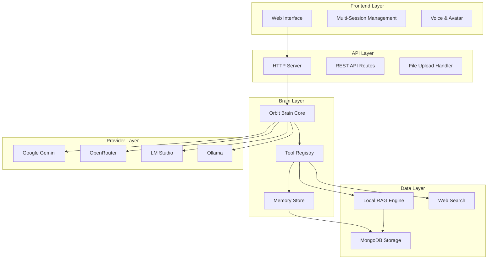
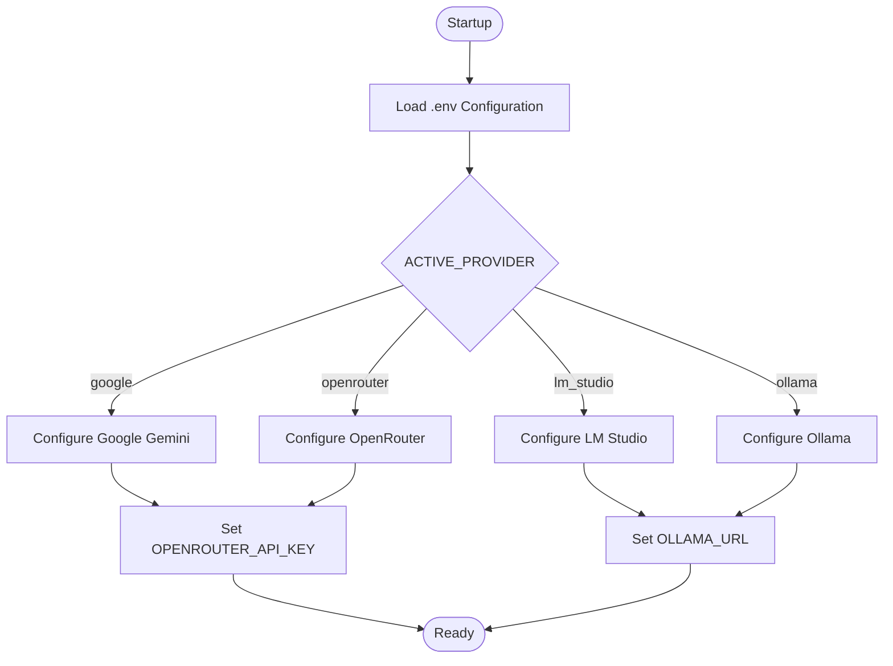
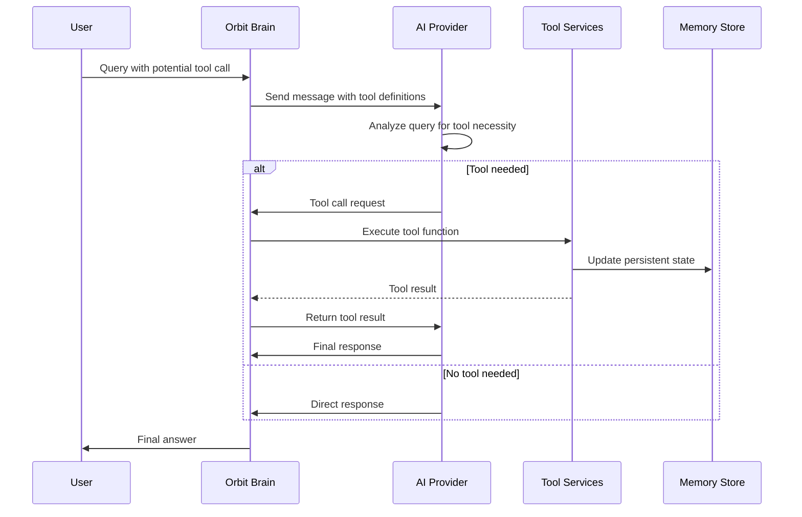
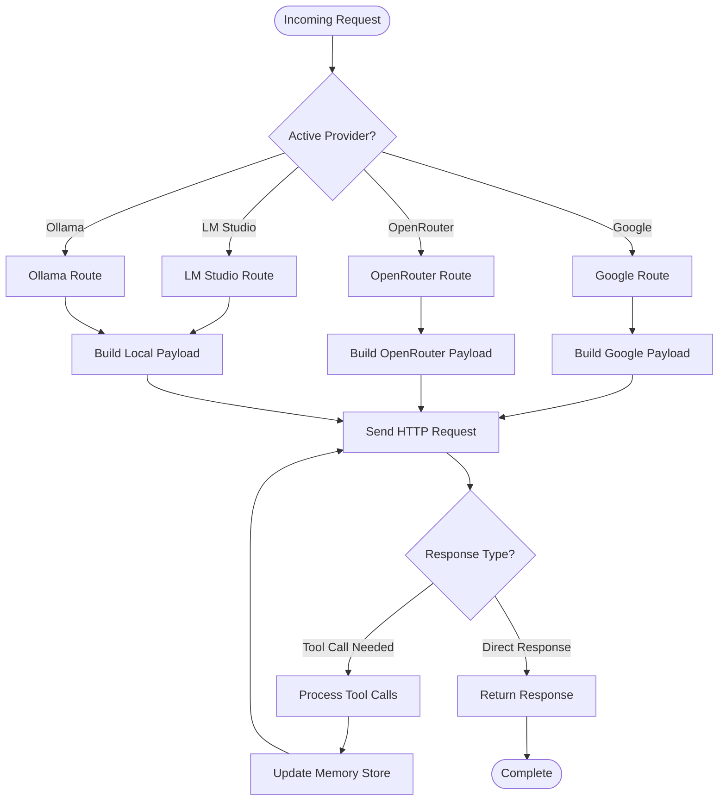

# Multi-Provider Brain System

<cite>
**Referenced Files in This Document**
- [README.md](file://README.md)
- [run.py](file://run.py)
- [backend/server.py](file://backend/server.py)
- [backend/config.py](file://backend/config.py)
- [backend/api_clients/llm_client.py](file://backend/api_clients/llm_client.py)
- [backend/api_clients/gemini_client.py](file://backend/api_clients/gemini_client.py)
- [backend/core/orbit_brain.py](file://backend/core/orbit_brain.py)
- [backend/core/memory_store.py](file://backend/core/memory_store.py)
- [backend/tools/knowledge.py](file://backend/tools/knowledge.py)
- [backend/tools/web_search.py](file://backend/tools/web_search.py)
- [requirements.txt](file://requirements.txt)
</cite>

## Table of Contents
1. [Introduction](#introduction)
2. [System Architecture](#system-architecture)
3. [Provider Configuration](#provider-configuration)
4. [Provider-Specific Capabilities](#provider-specific-capabilities)
5. [Tool Calling Architecture](#tool-calling-architecture)
6. [Request Routing and Fallback Strategies](#request-routing-and-fallback-strategies)
7. [Performance Characteristics](#performance-charactersitics)
8. [Practical Configuration Examples](#practical-configuration-examples)
9. [Provider-Specific Features and Limitations](#provider-specific-features-and-limitations)
10. [Troubleshooting Guide](#troubleshooting-guide)
11. [Conclusion](#conclusion)

## Introduction

The Multi-Provider Brain System is a sophisticated AI assistant platform that supports four major AI providers: Google Gemini, OpenRouter, LM Studio, and Ollama. This system provides seamless switching between providers while maintaining consistent functionality through a unified brain architecture that handles tool calling, memory management, and intelligent request routing.

The system combines a polished web-based interface with a powerful multi-provider backend, featuring real-time tools, local document intelligence (RAG), multi-session chat management, and screen-aware assistance. It operates as a lightweight, high-performance AI companion designed to run locally on your machine.

## System Architecture

The Multi-Provider Brain System follows a layered architecture with clear separation of concerns:



**Diagram sources**
- [backend/server.py:23-63](file://backend/server.py#L23-L63)
- [backend/api_clients/llm_client.py:38-78](file://backend/api_clients/llm_client.py#L38-L78)
- [backend/core/orbit_brain.py:74-268](file://backend/core/orbit_brain.py#L74-L268)

The architecture consists of several key layers:

- **Frontend Layer**: Provides the web-based user interface with multi-session support and voice/avatar capabilities
- **API Layer**: Handles HTTP requests, file uploads, and session management
- **Brain Layer**: Contains the core orchestration logic, tool management, and memory persistence
- **Provider Layer**: Manages communication with external AI providers
- **Data Layer**: Handles persistent storage and local knowledge processing

## Provider Configuration

The system supports four AI providers through a unified configuration system:

### Active Provider Selection

The system determines the active provider through the `Settings` class:



**Diagram sources**
- [backend/config.py:55-76](file://backend/config.py#L55-L76)
- [backend/server.py:566-611](file://backend/server.py#L566-L611)

### Provider-Specific Configuration Parameters

Each provider requires specific configuration parameters:

| Provider | Required Parameters | Default Values |
|----------|---------------------|----------------|
| **Google Gemini** | `GOOGLE_API_KEY`, `GOOGLE_MODEL` | `gemini-2.5-flash` |
| **OpenRouter** | `OPENROUTER_API_KEY`, `AI_MODEL` | `openai/gpt-4o-mini` |
| **LM Studio** | `LM_STUDIO_URL`, `LM_STUDIO_MODEL` | `http://127.0.0.1:1234/v1` |
| **Ollama** | `OLLAMA_URL`, `OLLAMA_MODEL` | `http://localhost:11434` |

**Section sources**
- [backend/config.py:20-76](file://backend/config.py#L20-L76)
- [README.md:104-136](file://README.md#L104-L136)

## Provider-Specific Capabilities

### Google Gemini

Google Gemini provides the most robust tool calling capabilities among all providers:

**Capabilities:**
- Native function calling with structured tool definitions
- Advanced multimodal support (text + images)
- High reliability and consistent performance
- Excellent for production environments requiring stability

**API Configuration:**
- Endpoint: `https://generativelanguage.googleapis.com/v1beta/models/{model}:generateContent`
- Authentication: API key via `x-goog-api-key` header
- Tool format: Structured function declarations with parameters

**Performance Characteristics:**
- Fast response times for standard queries
- Reliable tool execution with minimal failures
- Consistent quality across different prompt types

### OpenRouter

OpenRouter offers the broadest model selection and flexibility:

**Capabilities:**
- Access to multiple AI models (GPT-4, Claude, etc.)
- OpenAI-compatible API format
- Flexible model switching
- Good balance between cost and capability

**API Configuration:**
- Endpoint: `https://openrouter.ai/api/v1/chat/completions`
- Authentication: Bearer token via `Authorization` header
- Headers: `HTTP-Referer` and `X-Title` for compliance
- Tool format: Standard OpenAI function calling

**Performance Characteristics:**
- Variable performance depending on selected model
- Good for experimentation with different model architectures
- Cost-effective for high-throughput scenarios

### LM Studio

LM Studio provides 100% local execution for maximum privacy:

**Capabilities:**
- Complete local operation with no external API calls
- Supports embedding models for RAG functionality
- Configurable model selection
- Ideal for privacy-sensitive environments

**API Configuration:**
- Endpoint: `http://127.0.0.1:1234/v1/chat/completions`
- Authentication: No API key required
- Embedding support: `http://127.0.0.1:1234/v1` with `text-embedding-bge-m3`
- Tool format: OpenAI-compatible

**Performance Characteristics:**
- Deterministic performance based on local hardware
- Privacy-first operation with no data leaving device
- Resource-intensive for larger models

### Ollama

Ollama provides seamless local model integration:

**Capabilities:**
- Docker-based model deployment
- Wide variety of pre-configured models
- Easy model switching and management
- Lightweight deployment option

**API Configuration:**
- Endpoint: `http://localhost:11434/v1/chat/completions`
- Authentication: No API key required
- Tool format: OpenAI-compatible
- Model management: Built-in pull and manage commands

**Performance Characteristics:**
- Efficient resource utilization
- Fast model loading and switching
- Good for development and testing environments

**Section sources**
- [backend/api_clients/llm_client.py:24-26](file://backend/api_clients/llm_client.py#L24-L26)
- [backend/config.py:33-34](file://backend/config.py#L33-L34)

## Tool Calling Architecture

The system implements a sophisticated tool calling architecture that enables the AI to interact with external services:



**Diagram sources**
- [backend/core/orbit_brain.py:389-501](file://backend/core/orbit_brain.py#L389-L501)
- [backend/api_clients/llm_client.py:185-215](file://backend/api_clients/llm_client.py#L185-L215)

### Tool Definitions

The system defines a comprehensive set of tools for various functions:

| Tool | Purpose | Parameters | Provider Support |
|------|---------|------------|------------------|
| `get_weather` | Current weather information | `location` | All providers |
| `get_latest_news` | Latest news headlines | `topic`, `max_items` | All providers |
| `remember_note` | Save user notes | `note`, `category` | All providers |
| `add_task` | Create task reminders | `title`, `priority`, `due_date` | All providers |
| `search_local_docs` | Local document search | `query` | Google Gemini only |
| `search_session_docs` | Session-specific search | `query` | Google Gemini only |
| `search_web` | Web search integration | `query`, `max_results` | All providers |

### Tool Execution Flow

The tool execution process follows a standardized flow:

1. **Tool Detection**: AI analyzes query and determines if tool execution is required
2. **Parameter Extraction**: Extracts tool name and parameters from AI response
3. **Validation**: Validates tool availability and parameters
4. **Execution**: Executes tool with appropriate service
5. **Result Processing**: Processes tool result and updates memory
6. **Response Generation**: Generates final AI response incorporating tool results

**Section sources**
- [backend/core/orbit_brain.py:74-268](file://backend/core/orbit_brain.py#L74-L268)
- [backend/core/orbit_brain.py:389-501](file://backend/core/orbit_brain.py#L389-L501)

## Request Routing and Fallback Strategies

The system implements intelligent request routing with comprehensive fallback mechanisms:



**Diagram sources**
- [backend/api_clients/llm_client.py:47-78](file://backend/api_clients/llm_client.py#L47-L78)
- [backend/api_clients/llm_client.py:128-215](file://backend/api_clients/llm_client.py#L128-L215)

### Provider Switching Mechanism

The system automatically routes requests based on the active provider configuration:

1. **Initialization**: Server loads configuration from `.env` file
2. **Provider Selection**: Determines active provider from `ACTIVE_PROVIDER` setting
3. **Endpoint Routing**: Routes requests to appropriate provider handler
4. **Model Configuration**: Applies provider-specific model settings
5. **API Key Management**: Handles authentication based on provider type

### Fallback Strategies

The system implements multiple fallback mechanisms:

**Graceful Feature Refusal**: When a provider lacks specific capabilities, the system returns clear refusal messages instead of crashing.

**Error Handling**: Comprehensive error handling for network failures, API rate limits, and provider unavailability.

**Memory Persistence**: All tool results and state changes are persisted to MongoDB for continuity across provider switches.

**Section sources**
- [backend/server.py:268-275](file://backend/server.py#L268-L275)
- [backend/api_clients/llm_client.py:158-175](file://backend/api_clients/llm_client.py#L158-L175)

## Performance Characteristics

Each provider exhibits distinct performance characteristics that influence system behavior:

### Google Gemini Performance

- **Response Time**: 1-3 seconds for standard queries
- **Tool Reliability**: ~99% success rate for tool calls
- **Throughput**: High concurrent request handling
- **Resource Usage**: Moderate CPU, minimal bandwidth
- **Best For**: Production environments requiring stability

### OpenRouter Performance

- **Response Time**: 1-4 seconds (varies by model)
- **Tool Reliability**: ~95% success rate
- **Throughput**: High, depends on model selection
- **Resource Usage**: Low to moderate
- **Best For**: Experimentation and cost optimization

### LM Studio Performance

- **Response Time**: 2-8 seconds (hardware dependent)
- **Tool Reliability**: ~98% success rate
- **Throughput**: Hardware-limited
- **Resource Usage**: High CPU, GPU optional
- **Best For**: Privacy-sensitive, local-only operations

### Ollama Performance

- **Response Time**: 1-6 seconds (hardware dependent)
- **Tool Reliability**: ~97% success rate
- **Throughput**: Hardware-limited
- **Resource Usage**: Moderate CPU, efficient memory
- **Best For**: Development, testing, lightweight deployment

**Section sources**
- [backend/api_clients/llm_client.py:128-215](file://backend/api_clients/llm_client.py#L128-L215)
- [backend/server.py:566-611](file://backend/server.py#L566-L611)

## Practical Configuration Examples

### Basic Provider Setup

To configure the system for basic operation:

1. **Create .env file** with required API keys
2. **Select active provider** using the startup menu
3. **Configure model parameters** based on provider capabilities
4. **Test provider connectivity** before enabling advanced features

### Example: Google Gemini Configuration

```env
# Basic Google Gemini Setup
GOOGLE_API_KEY=your_google_api_key_here
ACTIVE_PROVIDER=google
GOOGLE_MODEL=gemini-2.5-flash
ASSISTANT_PORT=8000
```

### Example: OpenRouter Configuration

```env
# OpenRouter Setup with GPT-4
OPENROUTER_API_KEY=your_openrouter_key_here
ACTIVE_PROVIDER=openrouter
AI_MODEL=openai/gpt-4o-mini
ASSISTANT_PORT=8000
```

### Example: Local Provider Setup (LM Studio)

```env
# LM Studio Local Setup
ACTIVE_PROVIDER=lm_studio
LM_STUDIO_URL=http://127.0.0.1:1234/v1
LM_STUDIO_MODEL=google/gemma-3-4b
ASSISTANT_PORT=8000
```

### Example: Local Provider Setup (Ollama)

```env
# Ollama Local Setup
ACTIVE_PROVIDER=ollama
OLLAMA_URL=http://localhost:11434
OLLAMA_MODEL=qwen2.5:7b
ASSISTANT_PORT=8000
```

### Advanced Configuration Options

| Setting | Purpose | Default Value | Configuration Example |
|---------|---------|---------------|----------------------|
| `DEFAULT_LOCATION` | Weather and location services | `Ho Chi Minh City` | `DEFAULT_LOCATION=New York, NY` |
| `LIVE_VOICE_NAME` | Voice synthesis personality | `Nanami` | `LIVE_VOICE_NAME=Alex` |
| `MONGODB_URI` | Database connection | `mongodb://localhost:27017` | `MONGODB_URI=mongodb://mongo:27017` |
| `RAG_DOCS_PATH` | Local knowledge base directory | `./knowledge_base` | `RAG_DOCS_PATH=/home/user/docs` |

**Section sources**
- [README.md:104-136](file://README.md#L104-L136)
- [backend/config.py:55-76](file://backend/config.py#L55-L76)

## Provider-Specific Features and Limitations

### Google Gemini Specific Features

**Advanced Multimodal Support:**
- Native image processing with inline data
- Structured tool calling with parameter validation
- Sophisticated conversation history management
- Advanced safety and content filtering

**Limitations:**
- Requires internet connectivity
- API key authentication mandatory
- Rate limiting and quota considerations
- Limited to supported Gemini models

### OpenRouter Specific Features

**Model Flexibility:**
- Access to diverse model ecosystem
- OpenAI-compatible API format
- Flexible pricing tiers
- Advanced model selection criteria

**Limitations:**
- Network dependency for all operations
- API key management required
- Model availability varies by subscription
- Potential latency differences between models

### Local Provider Features

**Privacy and Independence:**
- Complete offline operation capability
- No external data transmission
- Hardware-based security
- Predictable performance

**Limitations:**
- Hardware resource requirements
- Model availability depends on local installation
- No cloud backup or synchronization
- Initial setup complexity for local models

### Cross-Provider Considerations

**Tool Availability Differences:**
- `search_local_docs` and `search_session_docs` available only with Google Gemini
- Local RAG requires LM Studio for embedding support
- Web search capabilities vary by provider configuration

**Performance Trade-offs:**
- Cloud providers offer higher reliability but require network connectivity
- Local providers provide privacy but require hardware resources
- Model selection affects both performance and capabilities

**Section sources**
- [backend/core/orbit_brain.py:361-386](file://backend/core/orbit_brain.py#L361-L386)
- [backend/tools/knowledge.py:122-138](file://backend/tools/knowledge.py#L122-L138)

## Troubleshooting Guide

### Common Configuration Issues

**API Key Problems:**
- Verify API keys are correctly entered in `.env` file
- Check provider-specific key requirements
- Ensure API keys have proper permissions
- Test API key validity with provider console

**Network Connectivity:**
- Verify internet connectivity for cloud providers
- Check firewall settings for local providers
- Confirm port accessibility for LM Studio/Ollama
- Test endpoint reachability manually

**Memory Issues:**
- Ensure MongoDB is running and accessible
- Verify database credentials and permissions
- Check database connectivity and authentication
- Monitor database storage capacity

### Provider-Specific Troubleshooting

**Google Gemini Issues:**
- Verify API key has Gemini access enabled
- Check model availability and quotas
- Validate API endpoint accessibility
- Review quota usage and billing status

**OpenRouter Issues:**
- Confirm API key validity and account status
- Check model availability in OpenRouter catalog
- Verify rate limit compliance
- Review provider-specific model restrictions

**Local Provider Issues:**
- Ensure local LLM server is running
- Verify model download and initialization
- Check hardware resource availability
- Monitor local server logs for errors

### Error Handling and Recovery

The system implements comprehensive error handling:

**HTTP Error Codes:**
- 401 Unauthorized: API key authentication failure
- 403 Forbidden: Provider restrictions or moderation
- 429 Rate Limited: Provider quota exceeded
- 502/503 Gateway Errors: Provider service unavailability

**Recovery Strategies:**
- Automatic retry with exponential backoff
- Graceful degradation to alternative providers
- Persistent state recovery from MongoDB
- User-friendly error messaging

**Section sources**
- [backend/api_clients/llm_client.py:158-175](file://backend/api_clients/llm_client.py#L158-L175)
- [backend/server.py:308-310](file://backend/server.py#L308-L310)

## Conclusion

The Multi-Provider Brain System represents a sophisticated approach to AI assistant architecture, offering unprecedented flexibility through its four-provider support system. The system successfully balances performance, privacy, and functionality across different deployment scenarios.

Key strengths of the system include:

- **Provider Agnostic Design**: Unified interface that abstracts provider differences
- **Robust Tool Calling**: Comprehensive tool ecosystem with reliable execution
- **Intelligent Routing**: Smart provider selection based on capabilities and requirements
- **Persistent State Management**: MongoDB-backed memory for continuity and reliability
- **Flexible Deployment**: Support for cloud, hybrid, and fully-local deployments

The system's architecture enables seamless provider switching while maintaining consistent functionality, making it suitable for diverse use cases from privacy-focused local deployments to enterprise cloud environments. The comprehensive error handling and fallback mechanisms ensure reliable operation across different provider conditions and network environments.

Future enhancements could include additional provider integrations, enhanced model management, and expanded tool capabilities while maintaining the system's core philosophy of provider flexibility and reliability.