# Multi-Session Chat Management

<cite>
**Referenced Files in This Document**
- [server.py](file://backend/server.py)
- [memory_store.py](file://backend/core/memory_store.py)
- [config.py](file://backend/config.py)
- [app.js](file://frontend/scripts/app.js)
- [index.html](file://frontend/index.html)
- [styles.css](file://frontend/assets/styles.css)
- [run.py](file://run.py)
- [requirements.txt](file://requirements.txt)
- [PLAN.md](file://PLAN.md)
</cite>

## Table of Contents
1. [Introduction](#introduction)
2. [Project Structure](#project-structure)
3. [Core Components](#core-components)
4. [Architecture Overview](#architecture-overview)
5. [Detailed Component Analysis](#detailed-component-analysis)
6. [MongoDB Session Storage](#mongodb-session-storage)
7. [Session Lifecycle Management](#session-lifecycle-management)
8. [Persistent Memory System](#persistent-memory-system)
9. [Threading HTTP Server Implementation](#threading-http-server-implementation)
10. [Frontend Integration](#frontend-integration)
11. [API Endpoints](#api-endpoints)
12. [Cross-Session Data Consistency](#cross-session-data-consistency)
13. [Performance Considerations](#performance-considerations)
14. [Troubleshooting Guide](#troubleshooting-guide)
15. [Conclusion](#conclusion)

## Introduction

The Multi-Session Chat Management system is a comprehensive chat application that supports multiple concurrent conversations with persistent storage, advanced memory management, and a modern ChatGPT-style interface. Built with Python's ThreadingHTTPServer and MongoDB, this system provides robust session management, message history persistence, and intelligent memory caching for profiles, notes, tasks, and activity tracking.

The system features a sophisticated threading HTTP server that handles concurrent requests while maintaining thread safety through MongoDB's atomic operations. Sessions are managed independently with full CRUD operations, including creation, renaming, pinning, archiving, and deletion. The persistent memory system ensures that user profiles, notes, tasks, and activity logs are preserved across application restarts.

## Project Structure

The project follows a clean separation of concerns with backend and frontend components:

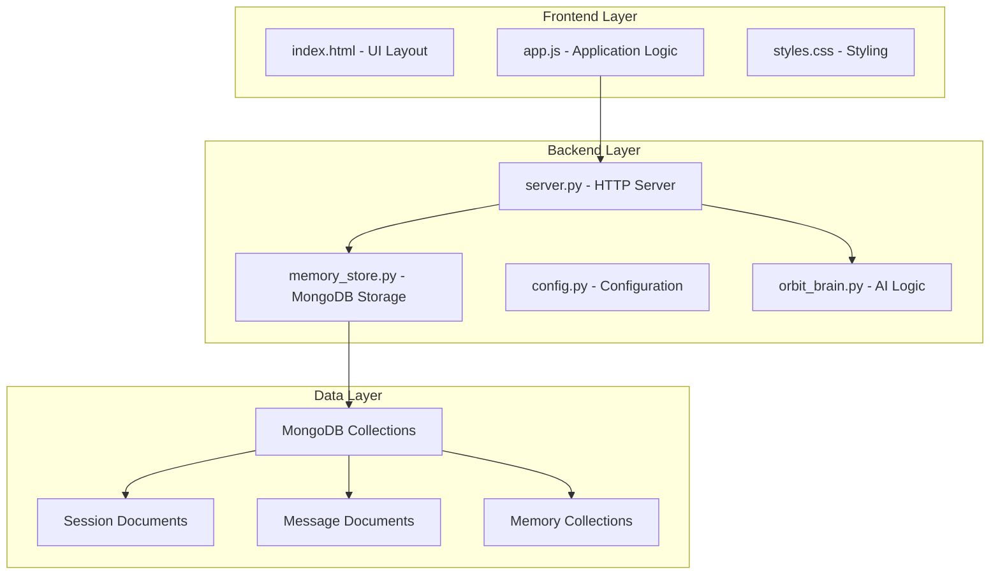

**Diagram sources**
- [server.py:1-611](file://backend/server.py#L1-L611)
- [memory_store.py:67-150](file://backend/core/memory_store.py#L67-L150)

**Section sources**
- [server.py:1-611](file://backend/server.py#L1-L611)
- [config.py:1-76](file://backend/config.py#L1-L76)

## Core Components

### MongoDB-Based Memory Store

The MemoryStore class serves as the central persistence layer, managing all session data through MongoDB collections. It provides thread-safe operations with proper locking mechanisms and maintains data consistency across concurrent requests.

Key MongoDB collections include:
- **sessions**: Stores chat session metadata (title, pinned status, archived status)
- **messages**: Contains all conversation messages with role and timestamp
- **profile**: Single document storing user profile information
- **notes**: Personal notes and memories
- **tasks**: Task management with priority and due dates
- **activity**: Activity log for tracking user actions
- **cache**: Temporary storage for weather and news data
- **session_attachments**: File attachments linked to specific sessions
- **session_chunks**: Indexed content from attached files

### Threading HTTP Server

The server implements a custom RequestHandler that extends Python's BaseHTTPRequestHandler, providing support for GET, POST, PUT, and DELETE operations. The server uses ThreadingHTTPServer to handle multiple concurrent clients efficiently.

### Frontend Application

The frontend features a modern ChatGPT-style interface with:
- Collapsible sidebar for session navigation
- Real-time message display with Markdown support
- Comprehensive tool integration for weather, news, tasks, and notes
- Voice input capabilities with dual recording modes
- File attachment support for document processing

**Section sources**
- [memory_store.py:67-800](file://backend/core/memory_store.py#L67-L800)
- [server.py:23-84](file://backend/server.py#L23-L84)
- [app.js:35-86](file://frontend/scripts/app.js#L35-L86)

## Architecture Overview

The system architecture follows a client-server pattern with MongoDB as the central data store:

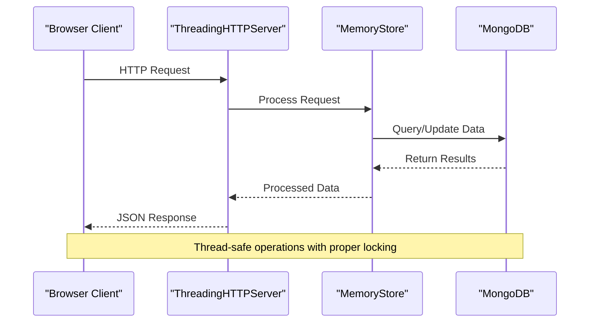

**Diagram sources**
- [server.py:85-501](file://backend/server.py#L85-L501)
- [memory_store.py:79-118](file://backend/core/memory_store.py#L79-L118)

The architecture ensures scalability through:
- Thread-safe MongoDB operations using locks
- Efficient indexing for query performance
- Connection pooling for database operations
- Asynchronous file processing for attachments

**Section sources**
- [server.py:566-611](file://backend/server.py#L566-L611)
- [memory_store.py:84-118](file://backend/core/memory_store.py#L84-L118)

## Detailed Component Analysis

### MemoryStore Class Implementation

The MemoryStore class provides a comprehensive interface for managing all persistent data:

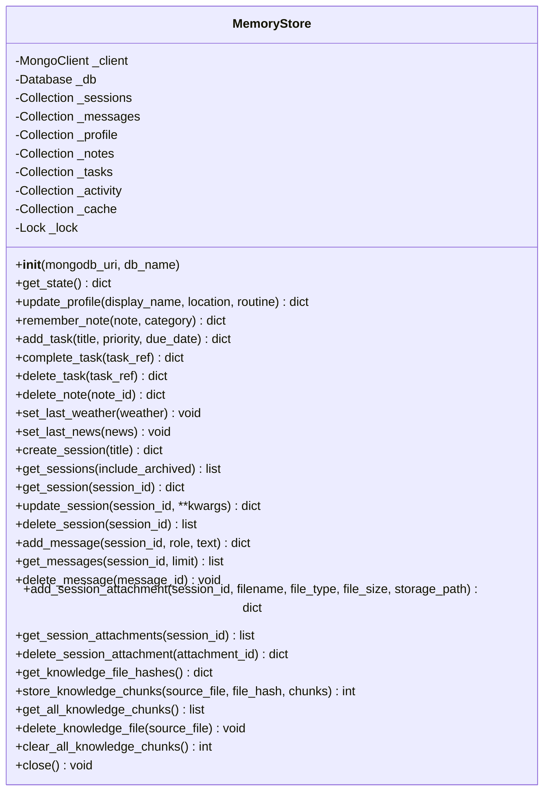

**Diagram sources**
- [memory_store.py:67-800](file://backend/core/memory_store.py#L67-L800)

The class implements thread safety through:
- Global lock for all write operations
- Atomic MongoDB operations where possible
- Proper resource cleanup and connection management

**Section sources**
- [memory_store.py:67-800](file://backend/core/memory_store.py#L67-L800)

### Session Management Operations

The session management system provides comprehensive CRUD operations:

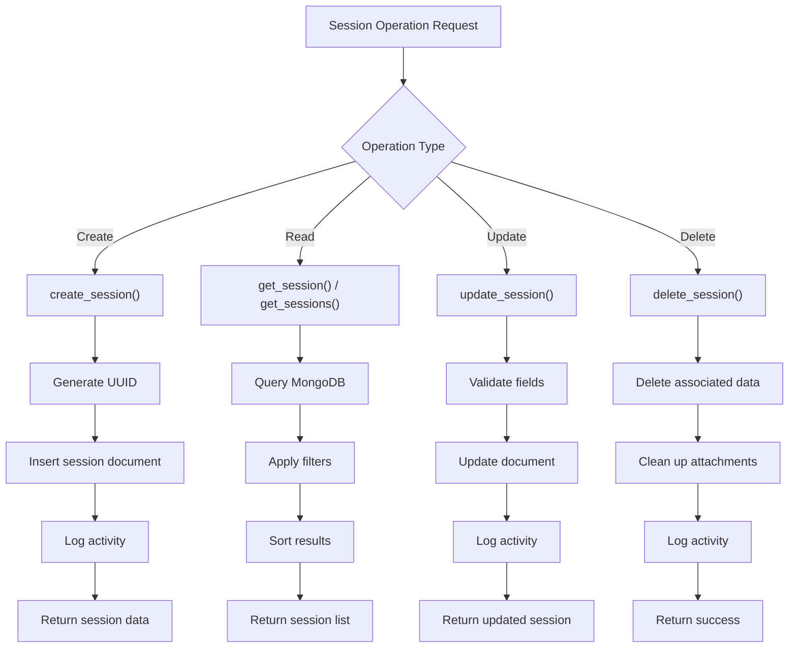

**Diagram sources**
- [memory_store.py:579-646](file://backend/core/memory_store.py#L579-L646)
- [server.py:403-422](file://backend/server.py#L403-L422)

**Section sources**
- [memory_store.py:579-646](file://backend/core/memory_store.py#L579-L646)
- [server.py:403-422](file://backend/server.py#L403-L422)

## MongoDB Session Storage

### Database Schema Design

The MongoDB schema is designed for optimal query performance and data integrity:

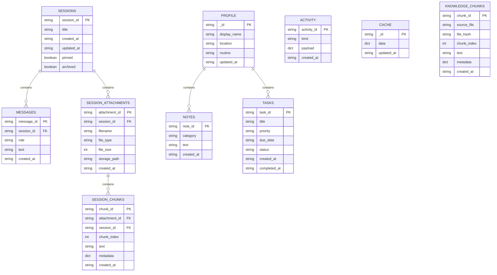

**Diagram sources**
- [memory_store.py:24-62](file://backend/core/memory_store.py#L24-L62)

### Indexing Strategy

The system implements strategic indexing for optimal performance:

- **Sessions**: Unique index on `session_id`, compound index on `(pinned, updated_at)` for sorting
- **Messages**: Unique index on `message_id`, compound index on `(session_id, created_at)` for chronological queries
- **Attachments**: Unique index on `attachment_id`, index on `session_id` for session-scoped queries
- **Knowledge**: Compound indexes on `(source_file, chunk_index)` and `(file_hash)` for efficient retrieval

**Section sources**
- [memory_store.py:119-135](file://backend/core/memory_store.py#L119-L135)

## Session Lifecycle Management

### Session Creation and Initialization

When a user starts a new conversation, the system automatically creates a session:

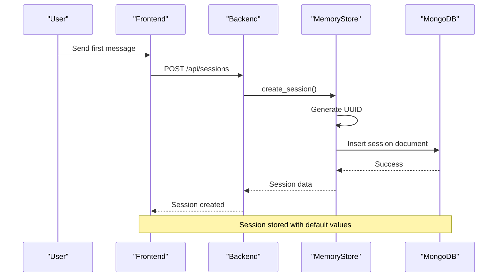

**Diagram sources**
- [server.py:183-186](file://backend/server.py#L183-L186)
- [memory_store.py:579-596](file://backend/core/memory_store.py#L579-L596)

### Session State Management

The system maintains session state through MongoDB's atomic operations:

- **Pinning**: Updates the `pinned` field atomically
- **Archiving**: Sets the `archived` flag without affecting other data
- **Renaming**: Updates the `title` field with proper validation
- **Activity Tracking**: Logs all session modifications to the activity collection

### Session Deletion and Cleanup

When a session is deleted, the system performs comprehensive cleanup:

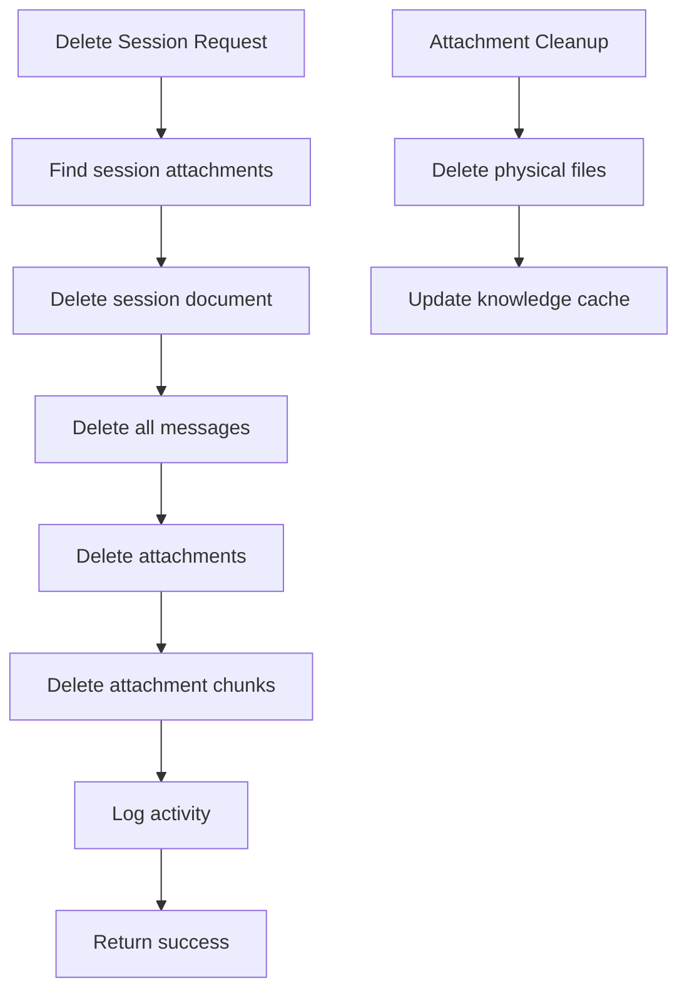

**Diagram sources**
- [memory_store.py:632-646](file://backend/core/memory_store.py#L632-L646)
- [server.py:431-446](file://backend/server.py#L431-L446)

**Section sources**
- [memory_store.py:579-646](file://backend/core/memory_store.py#L579-L646)
- [server.py:428-446](file://backend/server.py#L428-L446)

## Persistent Memory System

### Memory Store Architecture

The persistent memory system manages four core data types:

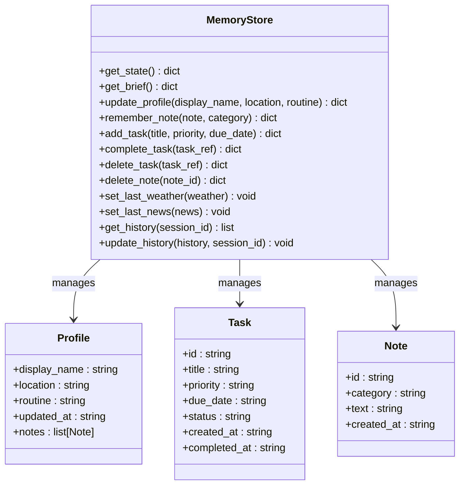

**Diagram sources**
- [memory_store.py:188-250](file://backend/core/memory_store.py#L188-L250)
- [memory_store.py:282-470](file://backend/core/memory_store.py#L282-L470)

### Activity Logging

The system maintains an activity log for all significant operations:

- **Profile Updates**: Tracks changes to user information
- **Task Management**: Logs task creation, completion, and deletion
- **Note Operations**: Records note creation and removal
- **Session Changes**: Monitors session pinning, archiving, and deletion
- **External Data**: Captures weather and news checks

The activity log is limited to the 20 most recent entries to maintain performance.

**Section sources**
- [memory_store.py:162-183](file://backend/core/memory_store.py#L162-L183)
- [memory_store.py:282-470](file://backend/core/memory_store.py#L282-L470)

## Threading HTTP Server Implementation

### Server Architecture

The threading HTTP server provides concurrent request handling:

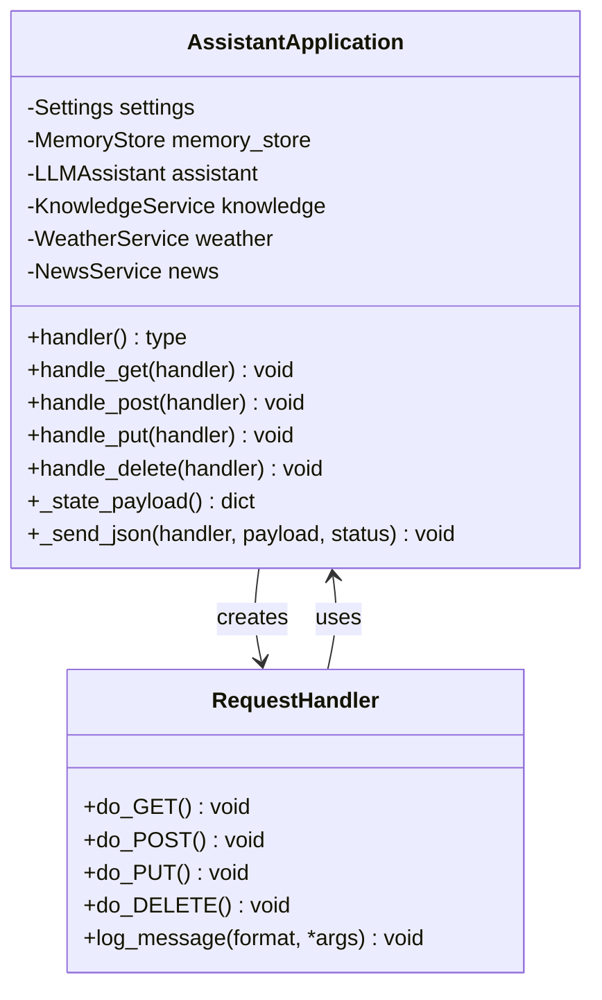

**Diagram sources**
- [server.py:23-84](file://backend/server.py#L23-L84)
- [server.py:67-83](file://backend/server.py#L67-L83)

### Request Processing Pipeline

The server processes requests through a structured pipeline:

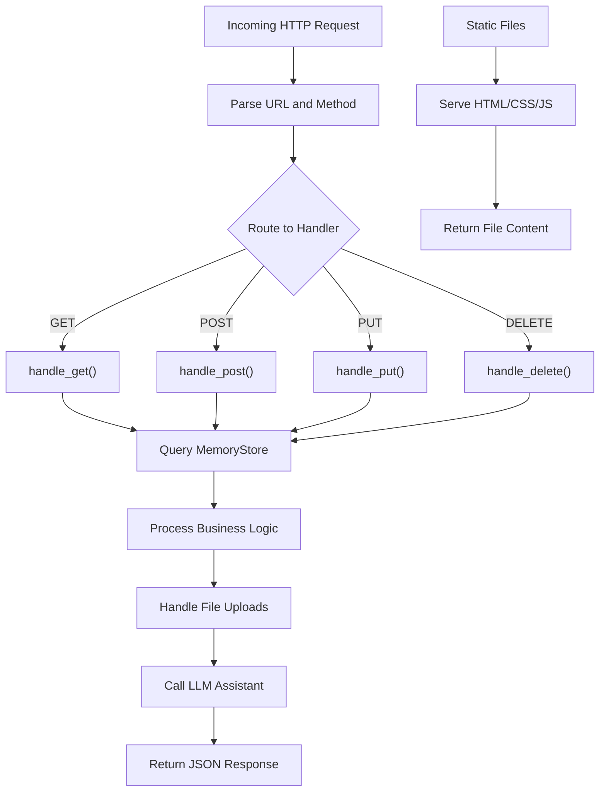

**Diagram sources**
- [server.py:85-501](file://backend/server.py#L85-L501)

### Concurrency and Thread Safety

The server ensures thread safety through:

- **Global Lock**: MemoryStore operations use a threading lock
- **Connection Pooling**: MongoDB connections are managed centrally
- **Atomic Operations**: MongoDB provides atomicity for single document operations
- **Resource Cleanup**: Proper cleanup of temporary resources

**Section sources**
- [server.py:23-84](file://backend/server.py#L23-L84)
- [server.py:85-501](file://backend/server.py#L85-L501)

## Frontend Integration

### UI Architecture

The frontend implements a modern ChatGPT-style interface:

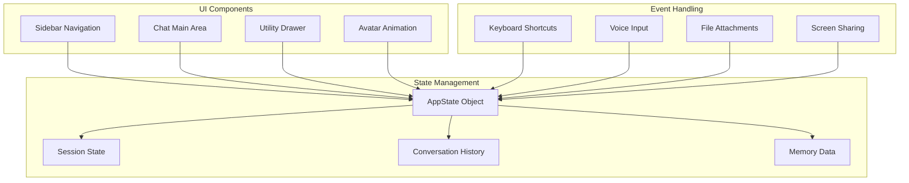

**Diagram sources**
- [app.js:35-86](file://frontend/scripts/app.js#L35-L86)
- [index.html:14-56](file://frontend/index.html#L14-L56)

### Session Switching Implementation

The frontend provides seamless session switching:

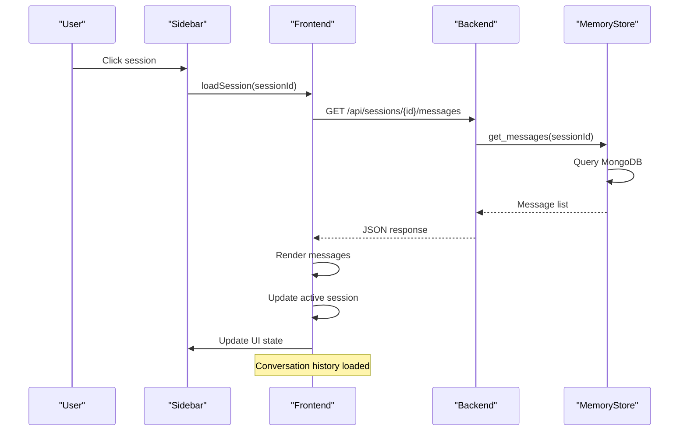

**Diagram sources**
- [app.js:1217-1241](file://frontend/scripts/app.js#L1217-L1241)
- [server.py:128-135](file://backend/server.py#L128-L135)

### Real-time Updates

The frontend implements real-time updates through:

- **Automatic Refresh**: Periodic polling for session updates
- **Immediate Feedback**: Visual indicators for ongoing operations
- **State Synchronization**: Consistent state across UI components
- **Error Handling**: Graceful degradation on network failures

**Section sources**
- [app.js:1217-1241](file://frontend/scripts/app.js#L1217-L1241)
- [index.html:14-56](file://frontend/index.html#L14-L56)

## API Endpoints

### Session Management Endpoints

The system provides comprehensive session management through REST API:

| Endpoint | Method | Description | Request Body | Response |
|----------|--------|-------------|--------------|----------|
| `/api/sessions` | POST | Create new session | `{title?: string}` | `{ok: boolean, session: Session}` |
| `/api/sessions` | GET | List all sessions | `include_archived?: boolean` | `{sessions: Session[]}` |
| `/api/sessions/{id}` | GET | Get session details | - | `{session: Session}` |
| `/api/sessions/{id}` | PUT | Update session | `{title?: string, pinned?: boolean, archived?: boolean}` | `{ok: boolean, session: Session}` |
| `/api/sessions/{id}` | DELETE | Delete session | - | `{ok: boolean}` |

### Message Management Endpoints

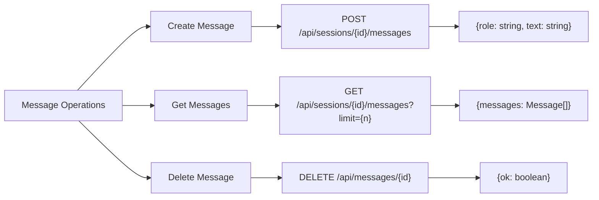

**Diagram sources**
- [server.py:189-202](file://backend/server.py#L189-L202)
- [server.py:128-135](file://backend/server.py#L128-L135)
- [server.py:468-474](file://backend/server.py#L468-L474)

### Memory Management Endpoints

| Endpoint | Method | Description | Request Body | Response |
|----------|--------|-------------|--------------|----------|
| `/api/profile` | POST | Update user profile | `{displayName?: string, location?: string, routine?: string}` | `{ok: boolean, snapshot: ProfileSnapshot, memory: MemoryState}` |
| `/api/tasks` | POST | Create task | `{title: string, priority?: string, dueDate?: string}` | `{ok: boolean, task: Task, memory: MemoryState}` |
| `/api/tasks/complete` | POST | Complete task | `{taskRef: string}` | `{ok: boolean, task: Task, memory: MemoryState}` |
| `/api/notes` | POST | Create note | `{text: string, category?: string}` | `{ok: boolean, note: Note, memory: MemoryState}` |
| `/api/notes/{id}` | DELETE | Delete note | - | `{ok: boolean, memory: MemoryState}` |

### Utility Endpoints

| Endpoint | Method | Description | Request Body | Response |
|----------|--------|-------------|--------------|----------|
| `/api/state` | GET | Get complete application state | - | `{provider: string, hasApiKey: boolean, model: string, memory: MemoryState, history: Message[], sessions: Session[]}` |
| `/api/chat` | POST | Send message to AI assistant | `{message: string, conversation: Message[], sessionId?: string, mode?: string, ...}` | `{reply: string, toolEvents: ToolEvent[], memory: MemoryState, model: string}` |
| `/api/weather` | GET | Get weather information | `{location?: string}` | `{weather: WeatherData, memory: MemoryState}` |
| `/api/news` | GET | Get news headlines | `{topic?: string}` | `{news: NewsData, memory: MemoryState}` |

**Section sources**
- [server.py:106-167](file://backend/server.py#L106-L167)
- [server.py:169-266](file://backend/server.py#L169-L266)
- [server.py:276-321](file://backend/server.py#L276-L321)

## Cross-Session Data Consistency

### Data Integrity Guarantees

The system ensures data consistency through several mechanisms:

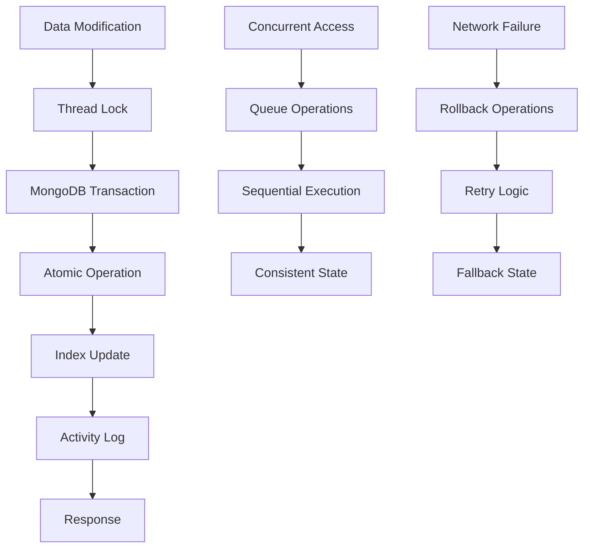

**Diagram sources**
- [memory_store.py:79-118](file://backend/core/memory_store.py#L79-L118)
- [server.py:85-501](file://backend/server.py#L85-L501)

### Conflict Resolution

The system handles conflicts through:

- **Last-Write-Wins**: For simple field updates
- **Atomic Updates**: For counters and statistics
- **Validation**: Input validation before persistence
- **Recovery**: Automatic recovery from partial failures

### Data Migration Strategy

The system includes automatic migration from legacy JSON storage:

- **Detection**: Checks for existing JSON files
- **Conversion**: Converts data to MongoDB format
- **Cleanup**: Renames old files to `.bak`
- **Verification**: Ensures successful migration

**Section sources**
- [server.py:27-48](file://backend/server.py#L27-L48)
- [memory_store.py:136-147](file://backend/core/memory_store.py#L136-L147)

## Performance Considerations

### Database Optimization

The system implements several performance optimizations:

- **Indexing Strategy**: Strategic indexes for frequent queries
- **Connection Pooling**: Efficient database connection management
- **Query Optimization**: Aggregation pipelines for complex operations
- **Caching**: In-memory caching for frequently accessed data

### Frontend Performance

The frontend optimizes performance through:

- **Lazy Loading**: Images and heavy components loaded on demand
- **Virtual Scrolling**: Efficient rendering of long message lists
- **Debouncing**: Input debouncing for search and autocomplete
- **Memory Management**: Proper cleanup of event listeners and timers

### Scalability Considerations

The system is designed for scalability:

- **Horizontal Scaling**: Multiple server instances can share MongoDB
- **Load Balancing**: Stateless design allows easy load balancing
- **Database Sharding**: MongoDB sharding support for large datasets
- **Caching Layers**: Redis or in-memory caching for hot data

## Troubleshooting Guide

### Common Issues and Solutions

**MongoDB Connection Problems**
- Verify MongoDB is running and accessible
- Check connection string in environment variables
- Ensure proper firewall configuration
- Monitor connection pool exhaustion

**Session Data Inconsistency**
- Check for concurrent modification conflicts
- Verify proper locking mechanisms
- Review transaction isolation levels
- Monitor for network partitioning

**Frontend State Synchronization**
- Debug WebSocket connections (if implemented)
- Check for race conditions in state updates
- Verify proper error handling
- Monitor for memory leaks

**Performance Issues**
- Analyze slow query performance
- Check database index utilization
- Monitor memory usage patterns
- Review network latency

### Debugging Tools

The system provides debugging capabilities:

- **Activity Log**: Comprehensive audit trail of operations
- **Error Reporting**: Structured error responses
- **Performance Metrics**: Timing and resource usage tracking
- **State Inspection**: Direct inspection of database state

**Section sources**
- [memory_store.py:162-183](file://backend/core/memory_store.py#L162-L183)
- [server.py:562-564](file://backend/server.py#L562-L564)

## Conclusion

The Multi-Session Chat Management system represents a comprehensive solution for modern chat applications. By leveraging MongoDB for persistent storage and Python's ThreadingHTTPServer for scalable request handling, the system provides robust session management, advanced memory persistence, and a modern user interface.

Key strengths of the system include:

- **Scalable Architecture**: Thread-safe operations with proper concurrency control
- **Rich Feature Set**: Comprehensive session management, memory persistence, and tool integration
- **Modern UI**: ChatGPT-style interface with intuitive session switching
- **Performance Optimization**: Strategic indexing, connection pooling, and caching
- **Data Integrity**: Atomic operations and comprehensive error handling

The system provides a solid foundation for building sophisticated AI-powered chat applications with multi-session support, persistent memory, and seamless user experiences. Future enhancements could include real-time collaboration features, advanced search capabilities, and expanded integration with external services.