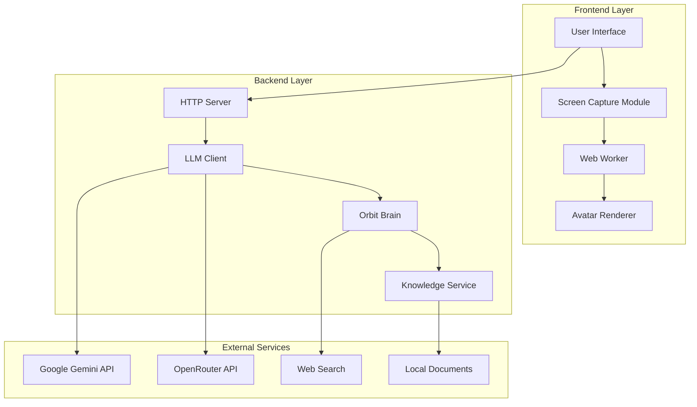
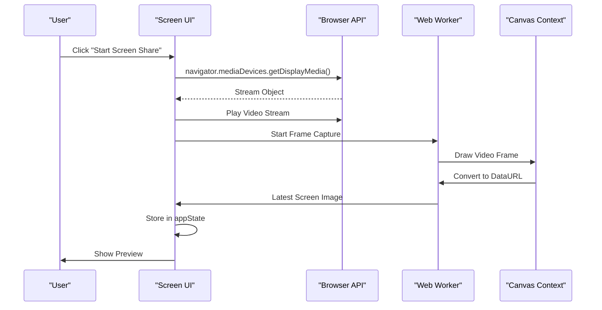
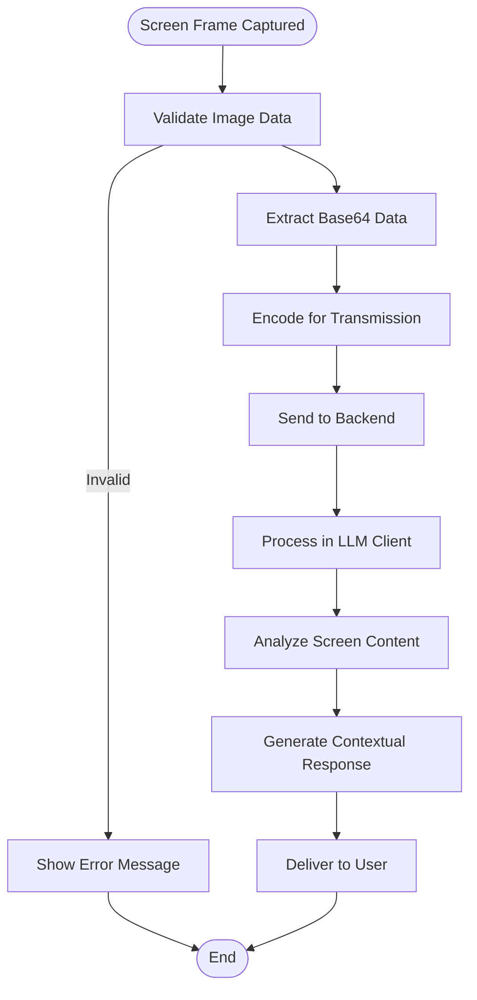
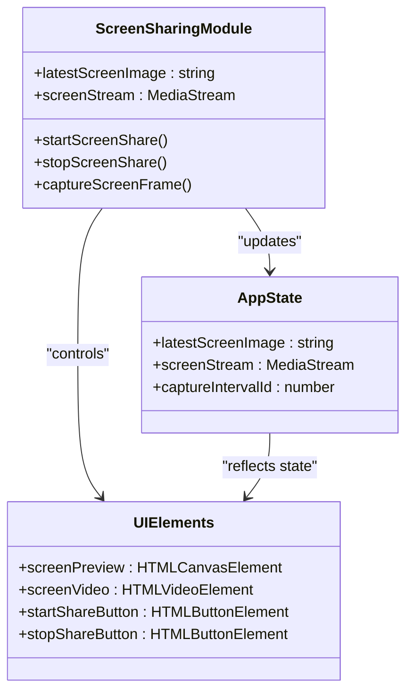
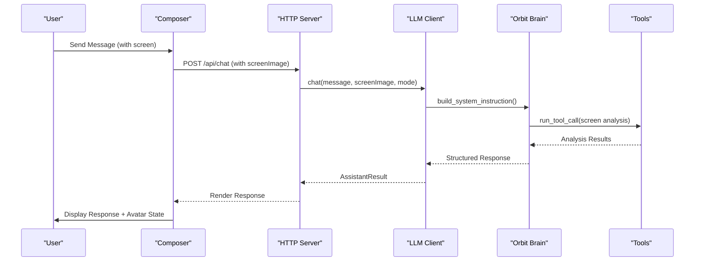

# Screen-Aware Assistance

<cite>
**Referenced Files in This Document**
- [README.md](file://README.md)
- [index.html](file://frontend/index.html)
- [app.js](file://frontend/scripts/app.js)
- [avatar-worker.js](file://frontend/scripts/avatar-worker.js)
- [avatar-renderer.js](file://frontend/scripts/avatar-renderer.js)
- [server.py](file://backend/server.py)
- [llm_client.py](file://backend/api_clients/llm_client.py)
- [orbit_brain.py](file://backend/core/orbit_brain.py)
- [knowledge.py](file://backend/tools/knowledge.py)
</cite>

## Table of Contents
1. [Introduction](#introduction)
2. [System Architecture](#system-architecture)
3. [Screen Capture Implementation](#screen-capture-implementation)
4. [Content Processing Pipeline](#content-processing-pipeline)
5. [Assistant Response Patterns](#assistant-response-patterns)
6. [User Interface Elements](#user-interface-elements)
7. [Integration with Main Assistant System](#integration-with-main-assistant-system)
8. [Practical Workflows](#practical-workflows)
9. [Supported Use Cases](#supported-use-cases)
10. [Performance Considerations](#performance-considerations)
11. [Troubleshooting Guide](#troubleshooting-guide)
12. [Conclusion](#conclusion)

## Introduction

Screen-Aware Assistance is a sophisticated feature that enables the Orbit Virtual Assistant to analyze and provide contextual guidance based on the user's current screen content. This capability leverages the browser's `getDisplayMedia` API to capture real-time screen frames, processes the visual information through advanced AI models, and delivers intelligent assistance tailored to the user's current task or application.

The feature transforms the assistant from a text-based conversational interface into a proactive screen-aware copilot that can understand and guide users through complex workflows, code development, research tasks, and application navigation. By integrating seamlessly with the existing assistant brain system, it provides comprehensive support for modern productivity scenarios.

## System Architecture

The Screen-Aware Assistance system follows a distributed architecture that separates concerns between frontend screen capture, backend processing, and AI model integration:

**Diagram sources**
- [app.js:1655-1712](file://frontend/scripts/app.js#L1655-L1712)
- [server.py:276-321](file://backend/server.py#L276-L321)
- [llm_client.py:38-78](file://backend/api_clients/llm_client.py#L38-L78)

The architecture ensures real-time processing capabilities while maintaining privacy by keeping screen captures local to the browser environment. The system supports multiple AI providers and can adapt its response patterns based on the current mode (Simple, Copilot, Coach).

## Screen Capture Implementation

The screen capture mechanism utilizes the modern browser MediaDevices API to establish secure screen sharing sessions:

**Diagram sources**
- [app.js:1655-1680](file://frontend/scripts/app.js#L1655-L1680)
- [app.js:1699-1712](file://frontend/scripts/app.js#L1699-L1712)

The implementation captures screen frames at 2 frames per second with automatic quality scaling to maintain performance. Each captured frame is converted to JPEG format with compression level 0.82 and stored as a base64 data URL for transmission to the backend.

**Section sources**
- [app.js:1655-1712](file://frontend/scripts/app.js#L1655-L1712)
- [index.html:225-236](file://frontend/index.html#L225-L236)

## Content Processing Pipeline

The screen content processing pipeline transforms captured images into actionable insights through a multi-stage process:

**Diagram sources**
- [llm_client.py:98-102](file://backend/api_clients/llm_client.py#L98-L102)
- [llm_client.py:283-289](file://backend/api_clients/llm_client.py#L283-L289)

The backend processes screen images by extracting the base64 data portion and incorporating it into the appropriate model-specific format. For OpenRouter-compatible APIs, the image is formatted as an `image_url` object, while Google's REST API expects `inlineData` with proper MIME type specification.

**Section sources**
- [llm_client.py:98-102](file://backend/api_clients/llm_client.py#L98-L102)
- [llm_client.py:283-289](file://backend/api_clients/llm_client.py#L283-L289)

## Assistant Response Patterns

The assistant adapts its response patterns based on the screen content and current mode:

| Mode | Response Pattern | Screen Awareness |
|------|------------------|------------------|
| **Simple** | Direct, concise responses | Basic recognition of visible elements |
| **Copilot** | Proactive guidance, next steps | Connects visible content to user goals |
| **Coach** | Educational explanations | Provides detailed analysis with learning context |

The system includes specific guidance for screen-aware assistance in the base prompt:

- **Screen Image Handling**: When a screen image is attached, the assistant describes only what it can reasonably infer and explicitly states uncertainty when information is unclear
- **Proactive Suggestions**: In Copilot mode, the assistant connects visible content to likely next user actions
- **Privacy Assurance**: Clear statement that the assistant cannot control the laptop and only sees shared screen content

**Section sources**
- [orbit_brain.py:14-32](file://backend/core/orbit_brain.py#L14-L32)
- [orbit_brain.py:46-56](file://backend/core/orbit_brain.py#L46-L56)

## User Interface Elements

The screen sharing interface consists of several integrated components:

### Screen Sharing Controls
- **Start/Stop Buttons**: Dedicated controls in the utility drawer for managing screen sharing sessions
- **Preview Canvas**: Real-time preview of captured screen content
- **Status Indicators**: Visual feedback on screen sharing state and quality

### Integration Points
- **Attachment Toggle**: Checkbox in the composer that automatically attaches screen content when checked
- **Quick Actions**: Buttons that can force screen analysis when needed
- **Utility Drawer**: Centralized location for screen sharing management

**Diagram sources**
- [app.js:51-55](file://frontend/scripts/app.js#L51-L55)
- [app.js:1655-1712](file://frontend/scripts/app.js#L1655-L1712)

**Section sources**
- [index.html:225-236](file://frontend/index.html#L225-L236)
- [index.html:191-196](file://frontend/index.html#L191-L196)

## Integration with Main Assistant System

The screen awareness feature integrates seamlessly with the existing assistant infrastructure:

**Diagram sources**
- [server.py:276-321](file://backend/server.py#L276-L321)
- [llm_client.py:47-78](file://backend/api_clients/llm_client.py#L47-L78)

The integration maintains backward compatibility while extending functionality. The screen image is automatically included when the attachment toggle is enabled or when specific quick actions require screen analysis.

**Section sources**
- [server.py:294-307](file://backend/server.py#L294-L307)
- [app.js:995-1008](file://frontend/scripts/app.js#L995-L1008)

## Practical Workflows

### Workflow 1: Code Review Assistance
1. User starts screen sharing while working in a code editor
2. User asks for code review or explanation
3. Assistant analyzes visible code and provides targeted feedback
4. Assistant suggests improvements based on context

### Workflow 2: Research Task Guidance
1. User shares browser window with research materials
2. User requests help organizing information
3. Assistant analyzes visible content and suggests structuring approaches
4. Assistant provides summary and next steps

### Workflow 3: Application Navigation Support
1. User shares application interface they're struggling with
2. User asks for guidance on completing a task
3. Assistant analyzes UI elements and provides step-by-step instructions
4. Assistant offers contextual tips based on visible interface

## Supported Use Cases

The screen-aware assistance supports a wide range of productivity scenarios:

### Development & Programming
- Code review and debugging assistance
- Documentation lookup and explanation
- IDE navigation guidance
- Testing and validation support

### Research & Analysis
- Data analysis workflow support
- Research material organization
- Citation and reference assistance
- Comparative analysis guidance

### Creative & Design Work
- Design tool navigation
- Creative process guidance
- Asset management support
- Presentation preparation assistance

### General Productivity
- Application-specific task automation
- Workflow optimization suggestions
- Multi-application coordination
- Knowledge transfer assistance

## Performance Considerations

The system implements several optimization strategies:

### Frame Rate Management
- **Capture Interval**: 2.5-second intervals balance responsiveness with performance
- **Quality Scaling**: Automatic scaling to maintain optimal frame size
- **Compression**: JPEG compression at 82% quality for efficient transmission

### Memory Management
- **Stream Cleanup**: Proper disposal of media streams and tracks
- **Canvas Optimization**: Efficient canvas drawing and clearing
- **State Management**: Minimal state retention for screen data

### Network Efficiency
- **Selective Transmission**: Only transmits when screen sharing is active
- **Data URL Optimization**: Efficient base64 encoding for image data
- **Connection Reuse**: Maintains connection state for continuous sessions

## Troubleshooting Guide

### Common Issues and Solutions

**Issue**: Screen sharing permission denied
- **Solution**: Ensure browser permissions are granted and site is served over HTTPS

**Issue**: Low frame rate or choppy capture
- **Solution**: Reduce screen complexity or close unnecessary applications

**Issue**: Poor image quality in responses
- **Solution**: Check browser compatibility and update to latest version

**Issue**: Assistant not responding to screen content
- **Solution**: Verify screen sharing is active and image is being captured

**Issue**: Performance degradation during screen sharing
- **Solution**: Close other applications and reduce screen resolution

### Debugging Steps
1. Check browser console for MediaDevices API errors
2. Verify network connectivity to AI provider services
3. Confirm screen sharing permissions are properly configured
4. Test with different AI providers if issues persist

**Section sources**
- [app.js:1677-1679](file://frontend/scripts/app.js#L1677-L1679)

## Conclusion

Screen-Aware Assistance represents a significant advancement in AI-powered productivity tools, transforming the traditional text-based conversation into a comprehensive screen-aware copilot. The implementation successfully balances real-time performance with privacy considerations while providing valuable contextual assistance across diverse use cases.

The modular architecture ensures extensibility and maintainability, while the seamless integration with existing assistant modes provides users with flexible options for different interaction styles. The feature demonstrates the potential for AI systems to become truly contextual companions that understand and assist with real-world tasks as they unfold.

Future enhancements could include advanced computer vision capabilities, gesture recognition, and expanded integration with development environments and productivity suites.