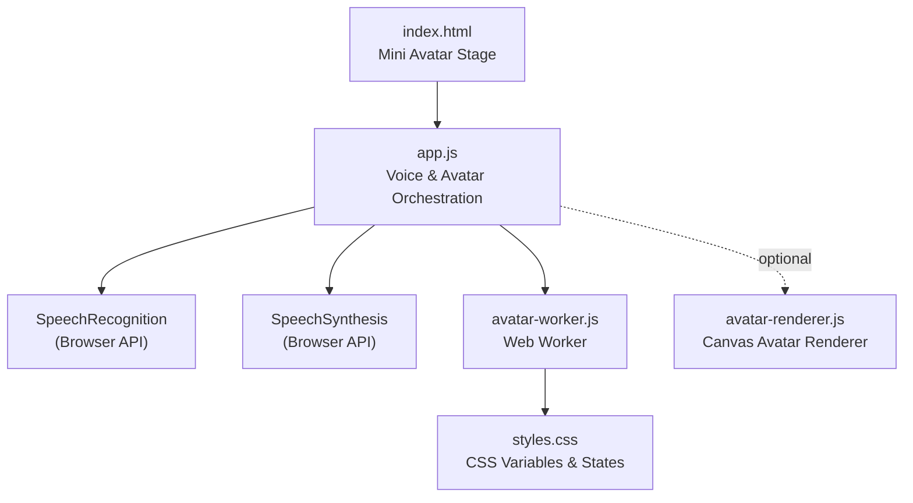
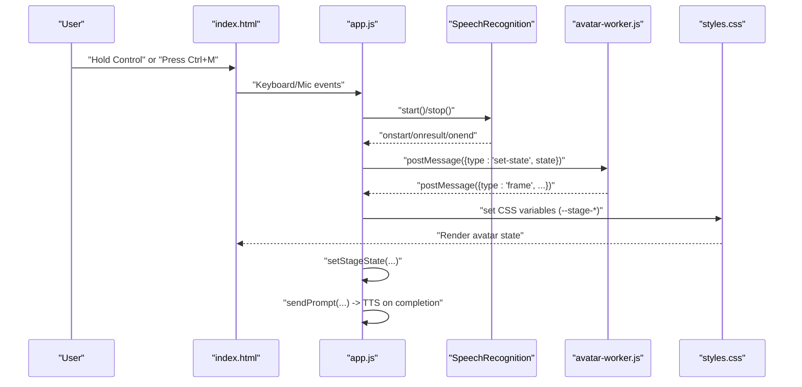
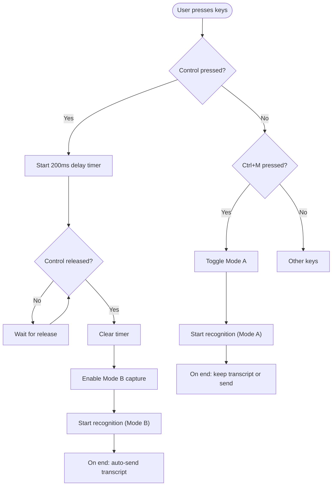
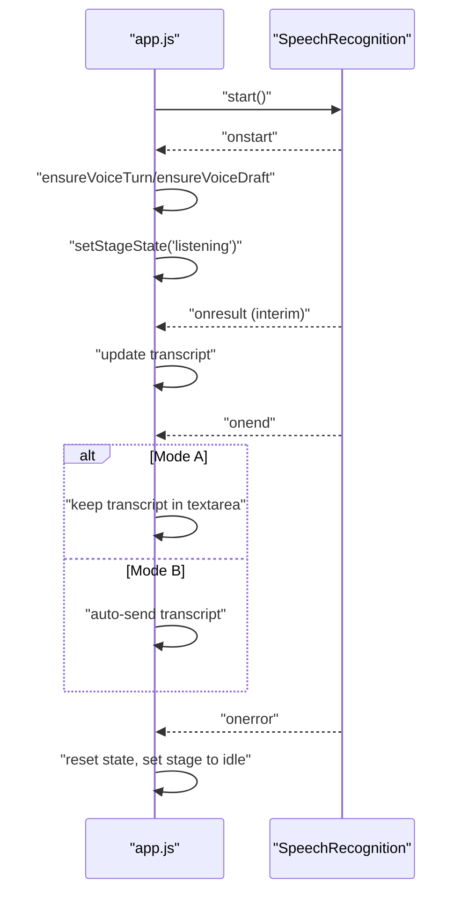
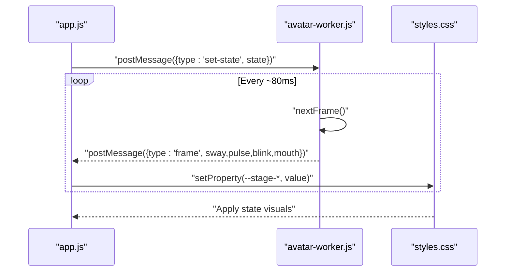
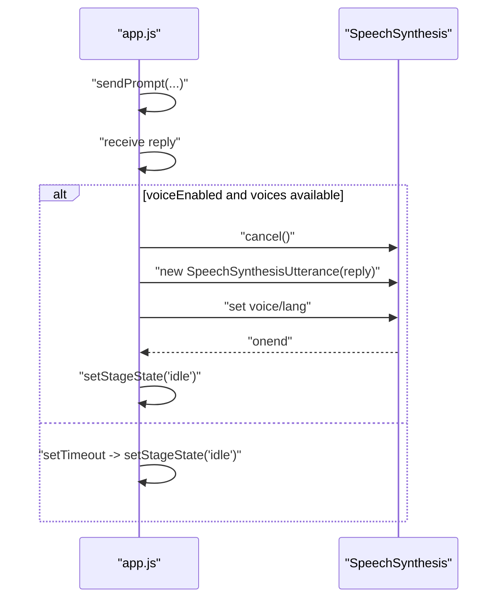
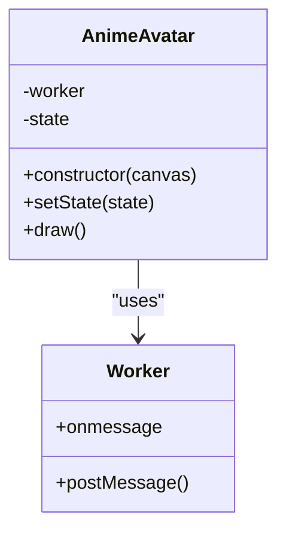
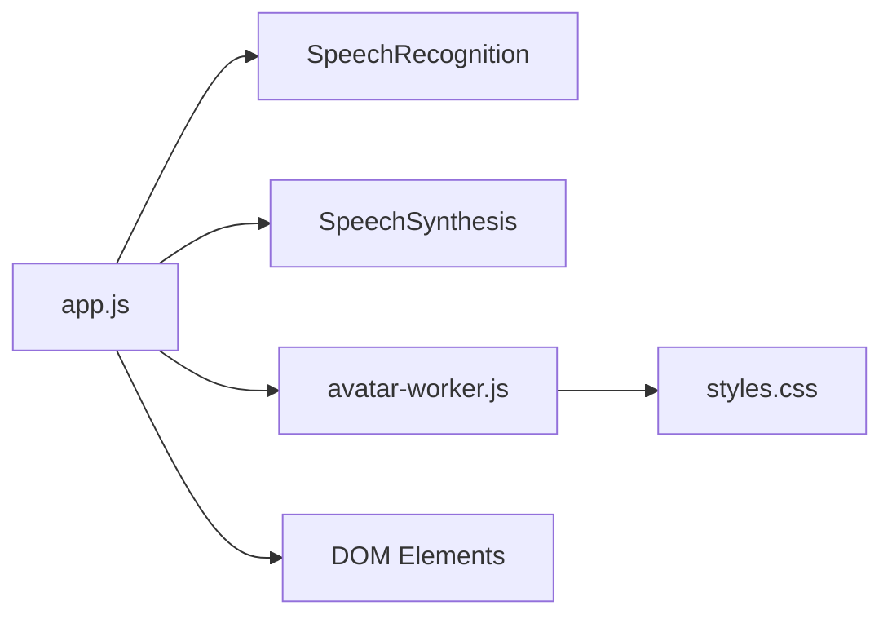

# Voice & Avatar System

<cite>
**Referenced Files in This Document**
- [index.html](file://frontend/index.html)
- [app.js](file://frontend/scripts/app.js)
- [avatar-worker.js](file://frontend/scripts/avatar-worker.js)
- [avatar-renderer.js](file://frontend/scripts/avatar-renderer.js)
- [styles.css](file://frontend/assets/styles.css)
- [README.md](file://README.md)
</cite>

## Table of Contents
1. [Introduction](#introduction)
2. [Project Structure](#project-structure)
3. [Core Components](#core-components)
4. [Architecture Overview](#architecture-overview)
5. [Detailed Component Analysis](#detailed-component-analysis)
6. [Dependency Analysis](#dependency-analysis)
7. [Performance Considerations](#performance-considerations)
8. [Troubleshooting Guide](#troubleshooting-guide)
9. [Conclusion](#conclusion)

## Introduction
This document explains the Voice & Avatar System, focusing on:
- Push-to-talk functionality with keyboard shortcuts (Control/Ctrl+M) and ESC cancellation
- Animated avatar system built with Web Workers and Canvas rendering
- State-based animations (Idle, Listening, Thinking, Speaking) and avatar-worker coordination
- Browser-based text-to-speech integration with configurable voices
- Practical examples of voice activation, avatar state changes, and audio feedback mechanisms
- Frontend architecture supporting real-time voice processing and visual feedback

## Project Structure
The Voice & Avatar System spans the frontend HTML, JavaScript, and CSS assets:
- HTML defines the mini avatar stage and voice controls
- app.js orchestrates speech recognition, voice modes, avatar state updates, and TTS
- avatar-worker.js computes avatar animation frames in a Web Worker
- avatar-renderer.js demonstrates an alternate Canvas-based avatar renderer
- styles.css defines CSS variables and state-driven visual effects for the avatar

**Diagram sources**
- [index.html:80-112](file://frontend/index.html#L80-L112)
- [app.js:538-565](file://frontend/scripts/app.js#L538-L565)
- [avatar-worker.js:1-48](file://frontend/scripts/avatar-worker.js#L1-L48)
- [styles.css:886-990](file://frontend/assets/styles.css#L886-L990)
- [avatar-renderer.js:1-106](file://frontend/scripts/avatar-renderer.js#L1-L106)

**Section sources**
- [README.md:42-47](file://README.md#L42-L47)
- [index.html:80-112](file://frontend/index.html#L80-L112)
- [app.js:538-565](file://frontend/scripts/app.js#L538-L565)
- [avatar-worker.js:1-48](file://frontend/scripts/avatar-worker.js#L1-L48)
- [avatar-renderer.js:1-106](file://frontend/scripts/avatar-renderer.js#L1-L106)
- [styles.css:886-990](file://frontend/assets/styles.css#L886-L990)

## Core Components
- Push-to-talk keyboard handlers:
  - Ctrl+M toggles Mode A (record-then-review)
  - ESC cancels Mode A recording
  - Hold Control triggers Mode B (instant-send) with a short delay to avoid conflicts
- Speech recognition:
  - Continuous, interim results, configurable language
  - Two modes: Mode A (review before sending) and Mode B (auto-send)
- Avatar worker:
  - Computes sway, pulse, blink, and mouth shapes
  - Emits frame messages consumed by the UI
- CSS-driven avatar:
  - Uses CSS variables (--stage-sway, --stage-pulse, --stage-blink, --stage-mouth)
  - Applies state attributes to reflect Idle/Listening/Thinking/Speaking
- Text-to-Speech:
  - Browser SpeechSynthesis API
  - Configurable voice by name and language

**Section sources**
- [app.js:733-807](file://frontend/scripts/app.js#L733-L807)
- [app.js:830-858](file://frontend/scripts/app.js#L830-L858)
- [app.js:601-727](file://frontend/scripts/app.js#L601-L727)
- [app.js:538-565](file://frontend/scripts/app.js#L538-L565)
- [avatar-worker.js:1-48](file://frontend/scripts/avatar-worker.js#L1-L48)
- [styles.css:886-990](file://frontend/assets/styles.css#L886-L990)
- [app.js:1056-1071](file://frontend/scripts/app.js#L1056-L1071)

## Architecture Overview
The Voice & Avatar System integrates browser APIs with a Web Worker for smooth UI animation while maintaining responsive voice capture and synthesis.

**Diagram sources**
- [index.html:179-181](file://frontend/index.html#L179-L181)
- [app.js:733-807](file://frontend/scripts/app.js#L733-L807)
- [app.js:601-727](file://frontend/scripts/app.js#L601-L727)
- [app.js:538-565](file://frontend/scripts/app.js#L538-L565)
- [avatar-worker.js:41-48](file://frontend/scripts/avatar-worker.js#L41-L48)
- [styles.css:886-990](file://frontend/assets/styles.css#L886-L990)

## Detailed Component Analysis

### Push-to-Talk and Voice Modes
- Mode A (Ctrl+M):
  - Starts speech recognition and keeps transcript in the message textarea for review
  - ESC cancels recording and clears the transcript
- Mode B (Hold Control):
  - Starts speech recognition after a short delay to avoid conflicts with Ctrl+M
  - Automatically sends the transcript as a message upon ending
- Mic button:
  - Pointer down starts capture; pointer up stops it
- Hotkey handling:
  - Debounces Control press with a 200 ms delay
  - Ignores hotkeys when focused inside inputs/selects/textareas

**Diagram sources**
- [app.js:733-807](file://frontend/scripts/app.js#L733-L807)
- [app.js:810-822](file://frontend/scripts/app.js#L810-L822)

**Section sources**
- [app.js:733-807](file://frontend/scripts/app.js#L733-L807)
- [app.js:810-822](file://frontend/scripts/app.js#L810-L822)
- [app.js:830-858](file://frontend/scripts/app.js#L830-L858)
- [index.html:179-181](file://frontend/index.html#L179-L181)

### Speech Recognition Lifecycle
- Setup:
  - Detects SpeechRecognition class, sets language, continuous, interim results
- Start:
  - Updates UI state, ensures voice turn/draft, sets stage to Listening
- Results:
  - Updates live transcript; Mode A places in textarea; Mode B updates chat bubble
- End:
  - Mode A: leaves transcript for review; Mode B: auto-sends and proceeds to processing
- Error:
  - Resets state, shows status, sets stage to Idle

**Diagram sources**
- [app.js:601-727](file://frontend/scripts/app.js#L601-L727)

**Section sources**
- [app.js:601-727](file://frontend/scripts/app.js#L601-L727)

### Avatar Worker and CSS Coordination
- Worker:
  - Tracks stage state and tick
  - Computes sway (sinusoidal), pulse (state-dependent), blink (randomized cooldown), and mouth (state-dependent)
  - Posts frame messages with computed values
- UI:
  - app.js listens for frame messages and applies CSS variables to the avatar stage element
  - setStageState updates both the dataset and posts state to the worker
- CSS:
  - Defines --stage-* variables and state selectors to animate aura/core/eyes/mouth

**Diagram sources**
- [app.js:538-565](file://frontend/scripts/app.js#L538-L565)
- [avatar-worker.js:18-48](file://frontend/scripts/avatar-worker.js#L18-L48)
- [styles.css:886-990](file://frontend/assets/styles.css#L886-L990)

**Section sources**
- [avatar-worker.js:1-48](file://frontend/scripts/avatar-worker.js#L1-L48)
- [app.js:538-565](file://frontend/scripts/app.js#L538-L565)
- [styles.css:886-990](file://frontend/assets/styles.css#L886-L990)

### Text-to-Speech Integration
- Trigger:
  - After receiving a model reply, if voice is enabled and browser supports SpeechSynthesis, cancel any ongoing speech and speak the reply
- Voice selection:
  - Chooses a voice whose name includes the configured live voice name
- Completion:
  - On speech end, sets stage back to Idle

**Diagram sources**
- [app.js:1056-1071](file://frontend/scripts/app.js#L1056-L1071)

**Section sources**
- [app.js:1056-1071](file://frontend/scripts/app.js#L1056-L1071)

### Alternate Canvas-Based Avatar Renderer
- avatar-renderer.js demonstrates a Canvas-based avatar with a Worker for animation
- Exposes setState to change animation state
- Draws face, eyes, mouth, and hair with scaling/tilt/sway

**Diagram sources**
- [avatar-renderer.js:1-106](file://frontend/scripts/avatar-renderer.js#L1-L106)

**Section sources**
- [avatar-renderer.js:1-106](file://frontend/scripts/avatar-renderer.js#L1-L106)

## Dependency Analysis
- app.js depends on:
  - Browser SpeechRecognition for voice capture
  - Browser SpeechSynthesis for TTS
  - Web Worker for avatar animation off the main thread
  - DOM elements for UI state and avatar stage
- avatar-worker.js depends on:
  - postMessage to communicate frames
  - onmessage to receive state changes
- styles.css depends on:
  - CSS variables and state attributes to drive animations

**Diagram sources**
- [app.js:538-565](file://frontend/scripts/app.js#L538-L565)
- [avatar-worker.js:41-48](file://frontend/scripts/avatar-worker.js#L41-L48)
- [styles.css:886-990](file://frontend/assets/styles.css#L886-L990)

**Section sources**
- [app.js:538-565](file://frontend/scripts/app.js#L538-L565)
- [avatar-worker.js:41-48](file://frontend/scripts/avatar-worker.js#L41-L48)
- [styles.css:886-990](file://frontend/assets/styles.css#L886-L990)

## Performance Considerations
- Web Worker offloads avatar animation calculations from the main thread, keeping UI responsive during voice capture and synthesis.
- CSS variables and transforms minimize layout thrashing; animations rely on GPU-friendly properties.
- SpeechRecognition runs continuously in Mode B; ensure to stop promptly on release/cancel to conserve resources.
- TTS cancellation prevents overlapping speech and reduces latency between replies and avatar reset.

[No sources needed since this section provides general guidance]

## Troubleshooting Guide
- Voice input disabled:
  - If SpeechRecognition is not available, the mic button is disabled and status indicates lack of support.
- Recording stuck:
  - Ensure Control is released or ESC is pressed to stop Mode A; Mode B stops on pointerup or Control release.
- Avatar not animating:
  - Verify Web Worker support; app.js logs a runtime badge when workers are unavailable.
- TTS not playing:
  - Confirm voiceEnabled is checked and browser provides voices; the system selects a voice by name match.
- Language mismatch:
  - Use the voice language selector to set the desired language; app.js resolves the recognition language accordingly.

**Section sources**
- [app.js:601-609](file://frontend/scripts/app.js#L601-L609)
- [app.js:762-775](file://frontend/scripts/app.js#L762-L775)
- [app.js:538-542](file://frontend/scripts/app.js#L538-L542)
- [app.js:1056-1071](file://frontend/scripts/app.js#L1056-L1071)
- [app.js:860-864](file://frontend/scripts/app.js#L860-L864)

## Conclusion
The Voice & Avatar System delivers a smooth, real-time experience combining keyboard-driven push-to-talk, continuous speech recognition, stateful avatar animations, and browser-based text-to-speech. The architecture separates concerns across app orchestration, Web Worker computation, and CSS-driven visuals, enabling responsive interactions and clear feedback across Idle, Listening, Thinking, and Speaking states.