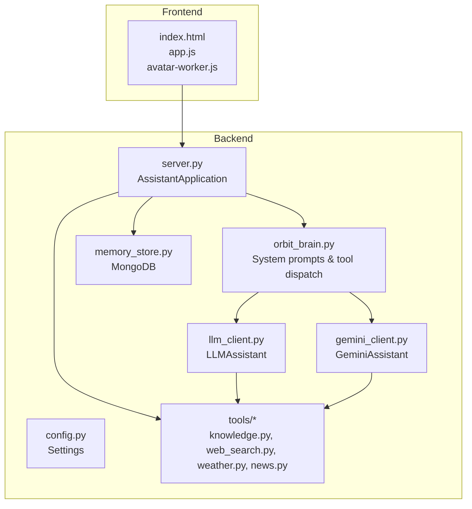
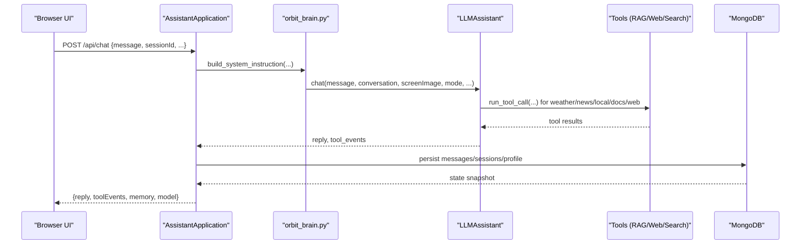
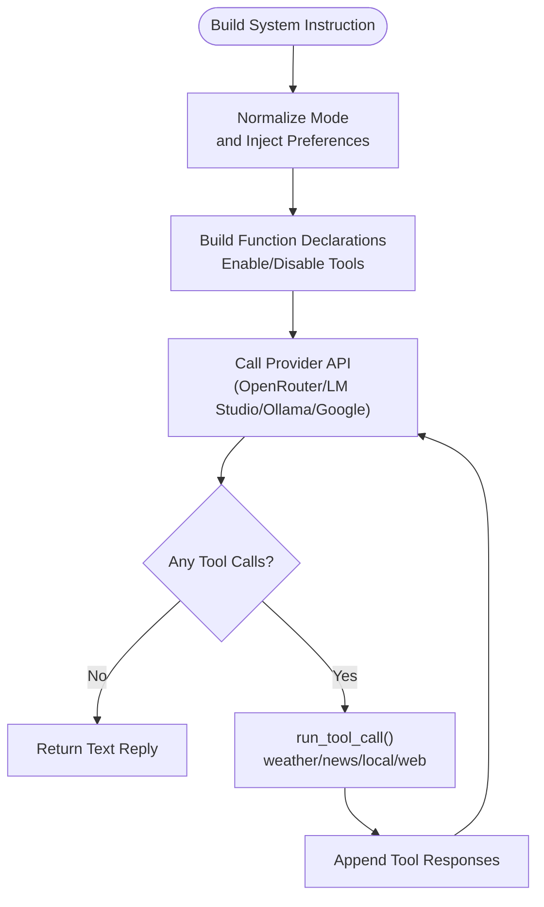
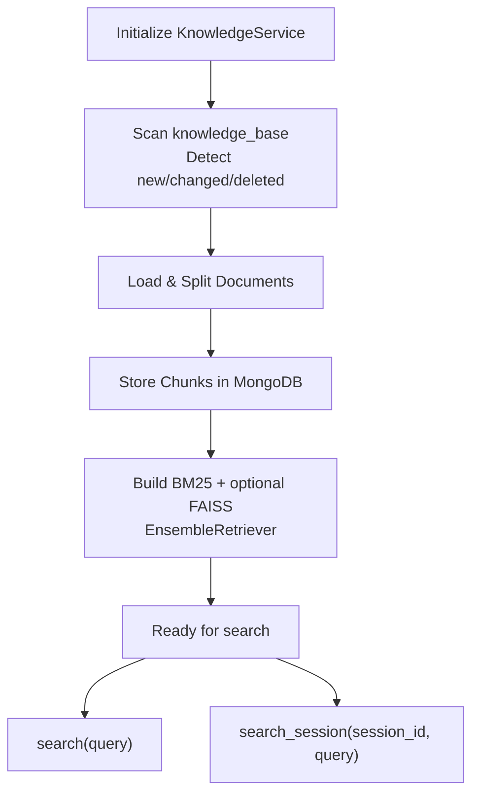
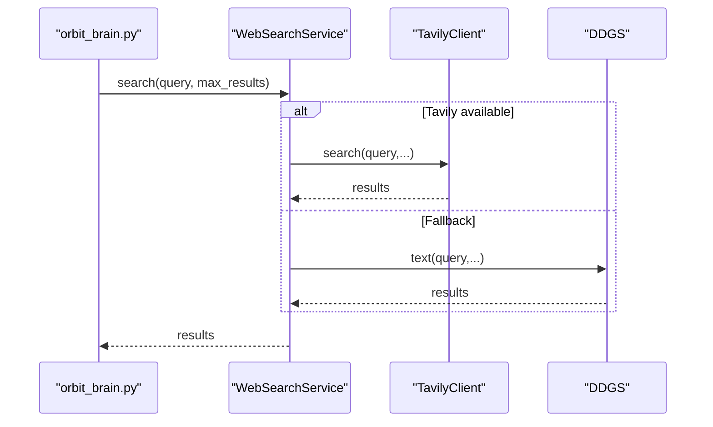
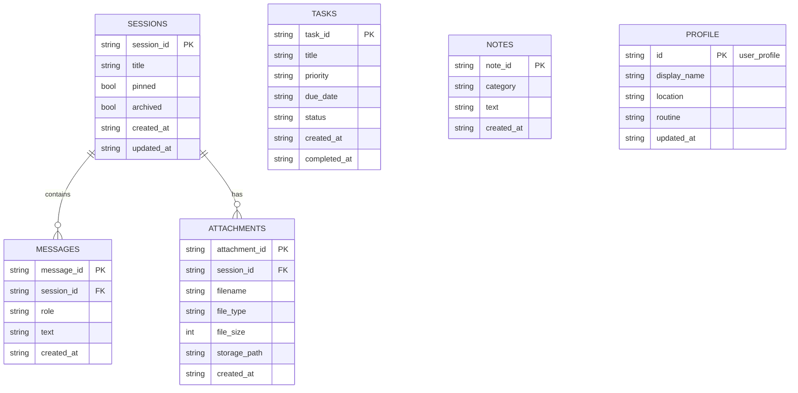
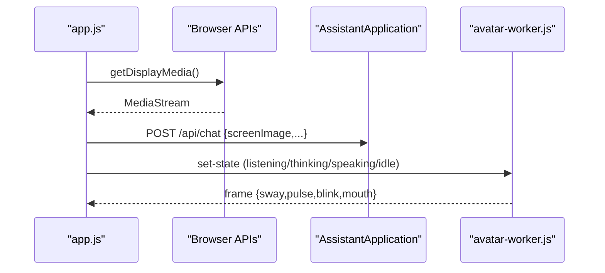
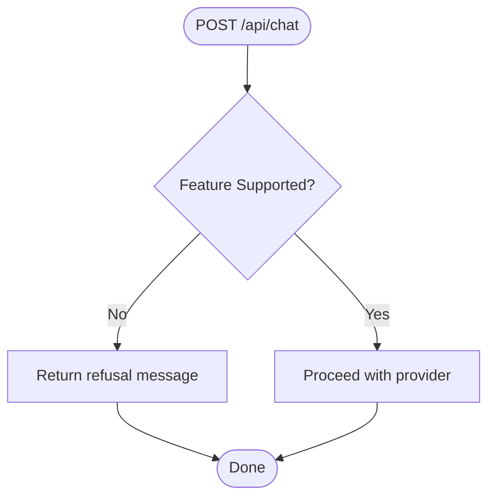
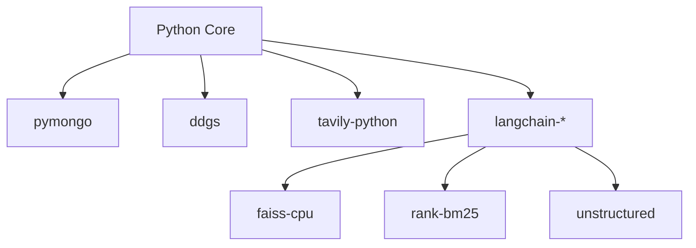

# Project Overview

<cite>
**Referenced Files in This Document**
- [README.md](file://README.md)
- [run.py](file://run.py)
- [backend/server.py](file://backend/server.py)
- [backend/config.py](file://backend/config.py)
- [backend/api_clients/llm_client.py](file://backend/api_clients/llm_client.py)
- [backend/api_clients/gemini_client.py](file://backend/api_clients/gemini_client.py)
- [backend/core/orbit_brain.py](file://backend/core/orbit_brain.py)
- [backend/core/memory_store.py](file://backend/core/memory_store.py)
- [backend/tools/knowledge.py](file://backend/tools/knowledge.py)
- [backend/tools/web_search.py](file://backend/tools/web_search.py)
- [backend/tools/weather.py](file://backend/tools/weather.py)
- [backend/tools/news.py](file://backend/tools/news.py)
- [frontend/index.html](file://frontend/index.html)
- [frontend/scripts/app.js](file://frontend/scripts/app.js)
- [frontend/scripts/avatar-worker.js](file://frontend/scripts/avatar-worker.js)
- [requirements.txt](file://requirements.txt)
</cite>

## Table of Contents
1. [Introduction](#introduction)
2. [Project Structure](#project-structure)
3. [Core Components](#core-components)
4. [Architecture Overview](#architecture-overview)
5. [Detailed Component Analysis](#detailed-component-analysis)
6. [Dependency Analysis](#dependency-analysis)
7. [Performance Considerations](#performance-considerations)
8. [Troubleshooting Guide](#troubleshooting-guide)
9. [Conclusion](#conclusion)
10. [Appendices](#appendices)

## Introduction
Orbit Virtual Assistant is a lightweight, high-performance AI companion designed to run locally on your machine. It combines a polished web-based interface with a powerful multi-provider backend to deliver real-time tools, local document intelligence (RAG), multi-session chat management, and screen-aware assistance. Orbit emphasizes privacy and control by keeping sensitive data on your device while offering flexible provider choices (Google Gemini, OpenRouter, LM Studio, Ollama), optional local RAG, live web search, voice and avatar capabilities, and graceful fallbacks for unsupported features.

## Project Structure
The project is organized into a clear separation of concerns:
- Backend: Python server exposing REST endpoints, orchestrating LLM clients, managing memory, and integrating tools (RAG, web search, weather, news).
- Frontend: Vanilla JavaScript, CSS, and HTML5 for the browser UI, including session management, voice input, avatar rendering, and utilities.
- Data: MongoDB-backed persistence for sessions, messages, profile, tasks, notes, and cached tool results.
- Knowledge Base: Optional local documents processed via LangChain and FAISS/BM25 for Retrieval-Augmented Generation.

**Diagram sources**
- [backend/server.py:23-100](file://backend/server.py#L23-L100)
- [backend/config.py:20-76](file://backend/config.py#L20-L76)
- [backend/core/orbit_brain.py:14-387](file://backend/core/orbit_brain.py#L14-L387)
- [backend/api_clients/llm_client.py:38-216](file://backend/api_clients/llm_client.py#L38-L216)
- [backend/api_clients/gemini_client.py:36-131](file://backend/api_clients/gemini_client.py#L36-L131)
- [backend/core/memory_store.py:67-150](file://backend/core/memory_store.py#L67-L150)
- [backend/tools/knowledge.py:88-265](file://backend/tools/knowledge.py#L88-L265)
- [backend/tools/web_search.py:53-139](file://backend/tools/web_search.py#L53-L139)
- [backend/tools/weather.py:47-141](file://backend/tools/weather.py#L47-L141)
- [backend/tools/news.py:21-83](file://backend/tools/news.py#L21-L83)
- [frontend/index.html:1-338](file://frontend/index.html#L1-L338)
- [frontend/scripts/app.js:1-200](file://frontend/scripts/app.js#L1-L200)
- [frontend/scripts/avatar-worker.js:1-48](file://frontend/scripts/avatar-worker.js#L1-L48)

**Section sources**
- [README.md:164-201](file://README.md#L164-L201)
- [backend/server.py:23-100](file://backend/server.py#L23-L100)
- [frontend/index.html:1-338](file://frontend/index.html#L1-L338)

## Core Components
- Multi-Provider Brain: Orchestrates LLM interactions across Google Gemini, OpenRouter, LM Studio, and Ollama. It builds system prompts, declares tools, and dispatches tool calls based on mode and toggles.
- Knowledge Lab (Local RAG): Processes local documents using LangChain, FAISS, and BM25 to enable precise, private retrieval from your knowledge_base.
- Live Web Search: Integrates Tavily (primary) and DuckDuckGo (fallback) for up-to-date information, with graceful fallback handling.
- Multi-Session Chat Management: Full CRUD for sessions, messages, tasks, notes, and attachments with persistent storage in MongoDB.
- Screen-Aware Assistance: Captures screen images via browser APIs and sends them to the LLM for contextual understanding.
- Voice & Avatar: Push-to-talk voice input, optional browser TTS, and an animated avatar powered by a Web Worker.
- Graceful Fallbacks: Intercepts unsupported features (e.g., image generation) and returns clear refusal messages instead of failing.

**Section sources**
- [README.md:13-51](file://README.md#L13-L51)
- [backend/core/orbit_brain.py:14-387](file://backend/core/orbit_brain.py#L14-L387)
- [backend/tools/knowledge.py:88-265](file://backend/tools/knowledge.py#L88-L265)
- [backend/tools/web_search.py:53-139](file://backend/tools/web_search.py#L53-L139)
- [backend/core/memory_store.py:67-150](file://backend/core/memory_store.py#L67-L150)
- [frontend/index.html:140-200](file://frontend/index.html#L140-L200)
- [frontend/scripts/app.js:399-490](file://frontend/scripts/app.js#L399-L490)
- [frontend/scripts/avatar-worker.js:1-48](file://frontend/scripts/avatar-worker.js#L1-L48)

## Architecture Overview
At runtime, the frontend communicates with the backend via REST endpoints. The backend initializes services, selects the active provider, constructs system prompts, and executes tool calls. Results are streamed back to the UI, which updates the avatar and renders messages.

**Diagram sources**
- [backend/server.py:276-321](file://backend/server.py#L276-L321)
- [backend/core/orbit_brain.py:389-502](file://backend/core/orbit_brain.py#L389-L502)
- [backend/api_clients/llm_client.py:47-216](file://backend/api_clients/llm_client.py#L47-L216)
- [backend/tools/knowledge.py:270-298](file://backend/tools/knowledge.py#L270-L298)
- [backend/tools/web_search.py:69-105](file://backend/tools/web_search.py#L69-L105)
- [backend/tools/weather.py:51-76](file://backend/tools/weather.py#L51-L76)
- [backend/tools/news.py:25-61](file://backend/tools/news.py#L25-L61)
- [backend/core/memory_store.py:188-251](file://backend/core/memory_store.py#L188-L251)

## Detailed Component Analysis

### Multi-Provider Brain and Tool Dispatch
The brain composes system instructions tailored to the selected mode (Simple, Copilot, Coach), injects memory and recent conversation snapshots, and declares function tools. It dynamically adjusts tool availability based on offline mode, web search toggle, and session-scoped document attachments.

**Diagram sources**
- [backend/core/orbit_brain.py:302-387](file://backend/core/orbit_brain.py#L302-L387)
- [backend/core/orbit_brain.py:389-502](file://backend/core/orbit_brain.py#L389-L502)
- [backend/api_clients/llm_client.py:82-216](file://backend/api_clients/llm_client.py#L82-L216)
- [backend/api_clients/gemini_client.py:43-95](file://backend/api_clients/gemini_client.py#L43-L95)

**Section sources**
- [backend/core/orbit_brain.py:14-387](file://backend/core/orbit_brain.py#L14-L387)
- [backend/api_clients/llm_client.py:38-216](file://backend/api_clients/llm_client.py#L38-L216)
- [backend/api_clients/gemini_client.py:36-131](file://backend/api_clients/gemini_client.py#L36-L131)

### Local RAG Pipeline (Knowledge Lab)
The KnowledgeService indexes documents from the knowledge_base directory and builds hybrid retrievers (BM25 + FAISS) when embeddings are available. It supports session-scoped document search for files attached during a chat.

**Diagram sources**
- [backend/tools/knowledge.py:145-230](file://backend/tools/knowledge.py#L145-L230)
- [backend/tools/knowledge.py:270-298](file://backend/tools/knowledge.py#L270-L298)
- [backend/tools/knowledge.py:337-356](file://backend/tools/knowledge.py#L337-L356)

**Section sources**
- [backend/tools/knowledge.py:88-265](file://backend/tools/knowledge.py#L88-L265)
- [backend/core/memory_store.py:694-749](file://backend/core/memory_store.py#L694-L749)

### Web Search Integration
The WebSearchService tries Tavily first (if configured), then falls back to DuckDuckGo. It returns structured results with title, link, and body for downstream use.

**Diagram sources**
- [backend/tools/web_search.py:69-105](file://backend/tools/web_search.py#L69-L105)
- [backend/tools/web_search.py:106-139](file://backend/tools/web_search.py#L106-L139)

**Section sources**
- [backend/tools/web_search.py:53-139](file://backend/tools/web_search.py#L53-L139)

### Multi-Session Chat Management
Sessions, messages, tasks, notes, and attachments are persisted in MongoDB. The UI supports creating, renaming, pinning, archiving, and deleting sessions, with per-session message history and attachment lifecycle management.

**Diagram sources**
- [backend/core/memory_store.py:24-62](file://backend/core/memory_store.py#L24-L62)
- [backend/core/memory_store.py:578-647](file://backend/core/memory_store.py#L578-L647)
- [backend/core/memory_store.py:651-690](file://backend/core/memory_store.py#L651-L690)
- [backend/core/memory_store.py:754-797](file://backend/core/memory_store.py#L754-L797)

**Section sources**
- [backend/core/memory_store.py:67-150](file://backend/core/memory_store.py#L67-L150)
- [backend/server.py:110-165](file://backend/server.py#L110-L165)
- [backend/server.py:183-242](file://backend/server.py#L183-L242)
- [backend/server.py:428-500](file://backend/server.py#L428-L500)

### Screen-Aware Assistance and Voice
The frontend captures screen images via browser APIs and attaches them to messages. Voice input supports two modes: Ctrl+M for review-before-send and holding Control for instant-send. The avatar Web Worker animates facial expressions synchronized with assistant state.

**Diagram sources**
- [frontend/scripts/app.js:467-490](file://frontend/scripts/app.js#L467-L490)
- [frontend/scripts/app.js:538-565](file://frontend/scripts/app.js#L538-L565)
- [frontend/scripts/avatar-worker.js:41-48](file://frontend/scripts/avatar-worker.js#L41-L48)
- [backend/server.py:293-307](file://backend/server.py#L293-L307)

**Section sources**
- [frontend/index.html:189-200](file://frontend/index.html#L189-L200)
- [frontend/scripts/app.js:399-490](file://frontend/scripts/app.js#L399-L490)
- [frontend/scripts/avatar-worker.js:1-48](file://frontend/scripts/avatar-worker.js#L1-L48)

### Graceful Fallbacks
When a provider lacks a capability (e.g., image generation), the backend intercepts the request and returns a clear refusal message instead of failing.

**Diagram sources**
- [backend/server.py:255-265](file://backend/server.py#L255-L265)
- [backend/server.py:282-292](file://backend/server.py#L282-L292)

**Section sources**
- [backend/server.py:255-292](file://backend/server.py#L255-L292)

## Dependency Analysis
The backend relies on a small set of core libraries plus optional packages for enhanced capabilities. MongoDB provides persistent storage, while LangChain and FAISS enable local RAG when enabled.

**Diagram sources**
- [requirements.txt:10-29](file://requirements.txt#L10-L29)

**Section sources**
- [requirements.txt:1-29](file://requirements.txt#L1-L29)

## Performance Considerations
- Provider Selection: Choose a provider aligned with your latency and privacy needs. Local providers (LM Studio, Ollama) reduce network overhead but may require more compute.
- RAG Overhead: Enabling RAG adds parsing, chunking, and indexing costs. Use it selectively for topics requiring local documents.
- Tool Parallelism: The brain’s multi-tool reminder ensures complex queries are handled efficiently; avoid redundant tool calls.
- Avatar Rendering: The Web Worker keeps UI animations smooth without blocking the main thread.
- Memory Persistence: MongoDB indexing and capped activity logs help maintain responsiveness under frequent updates.

[No sources needed since this section provides general guidance]

## Troubleshooting Guide
- API Key Issues: Ensure ACTIVE_PROVIDER and corresponding keys are set in .env. The server validates keys before chat.
- MongoDB Connectivity: Confirm the MongoDB URI and DB name are correct; the server performs a ping to validate connectivity.
- Web Search Failures: If Tavily is unavailable, DuckDuckGo is used as a fallback. Verify network access and API key if using Tavily.
- RAG Not Working: Verify LM Studio embeddings are reachable and knowledge_base path is correct. The KnowledgeService attempts to connect and falls back gracefully.
- Unsupported Feature: Requests for unsupported features (e.g., image generation) are intercepted and refused with a clear message.

**Section sources**
- [backend/server.py:566-611](file://backend/server.py#L566-L611)
- [backend/config.py:55-76](file://backend/config.py#L55-L76)
- [backend/tools/web_search.py:69-105](file://backend/tools/web_search.py#L69-L105)
- [backend/tools/knowledge.py:122-138](file://backend/tools/knowledge.py#L122-L138)
- [backend/server.py:255-292](file://backend/server.py#L255-L292)

## Conclusion
Orbit Virtual Assistant delivers a local-first AI assistant with real-time tools and persistent memory. Its modular design enables flexible provider selection, robust multi-session management, and optional local RAG. The combination of a polished web UI, screen-aware assistance, voice input, and an animated avatar creates a rich, privacy-preserving experience suitable for daily productivity and learning.

[No sources needed since this section summarizes without analyzing specific files]

## Appendices

### Technology Stack Overview
- Backend: Python 3.10+, ThreadingHTTPServer, MongoDB, LangChain, FAISS, BM25, Tavily, DuckDuckGo
- Frontend: Vanilla JS, CSS, HTML5, Web Workers, browser media APIs
- Providers: Google Gemini, OpenRouter, LM Studio, Ollama
- Storage: MongoDB collections for sessions, messages, profile, tasks, notes, attachments, and knowledge chunks

**Section sources**
- [README.md:54-64](file://README.md#L54-L64)
- [requirements.txt:1-29](file://requirements.txt#L1-L29)

### System Requirements
- Python 3.10+
- MongoDB (local or remote)
- Optional: LM Studio for local RAG embeddings
- Optional: Tavily API key for enhanced web search

**Section sources**
- [README.md:69-75](file://README.md#L69-L75)

### Entry Point and Startup
- The server is launched via the entry script, which initializes settings, prompts for provider and RAG configuration, and starts the HTTP server.

**Section sources**
- [run.py:1-6](file://run.py#L1-L6)
- [backend/server.py:566-611](file://backend/server.py#L566-L611)
- [backend/config.py:55-76](file://backend/config.py#L55-L76)