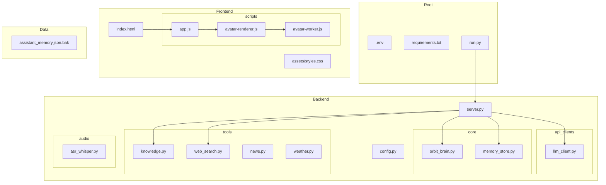
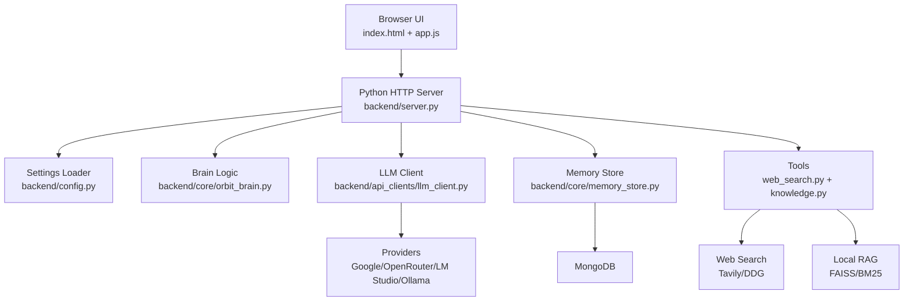
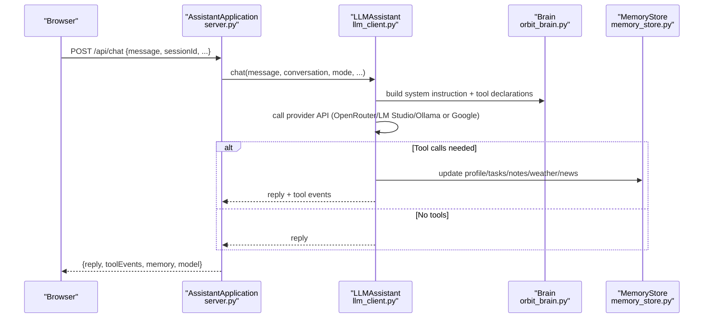
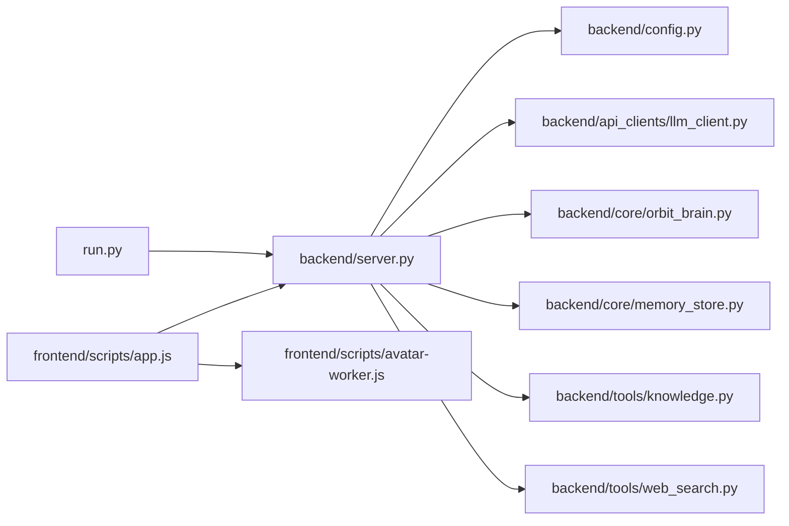

# Project Structure

<cite>
**Referenced Files in This Document**
- [README.md](file://README.md)
- [requirements.txt](file://requirements.txt)
- [run.py](file://run.py)
- [backend/server.py](file://backend/server.py)
- [backend/config.py](file://backend/config.py)
- [backend/core/orbit_brain.py](file://backend/core/orbit_brain.py)
- [backend/core/memory_store.py](file://backend/core/memory_store.py)
- [backend/api_clients/llm_client.py](file://backend/api_clients/llm_client.py)
- [backend/tools/knowledge.py](file://backend/tools/knowledge.py)
- [backend/tools/web_search.py](file://backend/tools/web_search.py)
- [frontend/index.html](file://frontend/index.html)
- [frontend/assets/styles.css](file://frontend/assets/styles.css)
- [frontend/scripts/app.js](file://frontend/scripts/app.js)
- [frontend/scripts/avatar-renderer.js](file://frontend/scripts/avatar-renderer.js)
- [frontend/scripts/avatar-worker.js](file://frontend/scripts/avatar-worker.js)
</cite>

## Table of Contents
1. [Introduction](#introduction)
2. [Project Structure](#project-structure)
3. [Core Components](#core-components)
4. [Architecture Overview](#architecture-overview)
5. [Detailed Component Analysis](#detailed-component-analysis)
6. [Dependency Analysis](#dependency-analysis)
7. [Performance Considerations](#performance-considerations)
8. [Troubleshooting Guide](#troubleshooting-guide)
9. [Conclusion](#conclusion)

## Introduction
This document explains the Orbit Virtual Assistant project structure, focusing on the backend, frontend, knowledge base, and configuration. It describes directory organization, file roles, import patterns, and how components interact across the system. The assistant runs a Python HTTP server that serves a vanilla JavaScript/HTML/CSS web UI and integrates with multiple LLM providers, external tools, and persistent storage.

## Project Structure
The repository is organized into:
- backend/: Python server and AI orchestration
- frontend/: Static web assets and client-side logic
- data/: Legacy storage migrated to MongoDB (deprecated)
- knowledge_base/: Local documents for Retrieval-Augmented Generation (RAG)
- Root configuration files: .env, requirements.txt, run.py

**Diagram sources**
- [run.py:1-6](file://run.py#L1-L6)
- [backend/server.py:1-611](file://backend/server.py#L1-L611)
- [backend/config.py:1-76](file://backend/config.py#L1-L76)
- [backend/api_clients/llm_client.py:1-366](file://backend/api_clients/llm_client.py#L1-L366)
- [backend/core/orbit_brain.py:1-502](file://backend/core/orbit_brain.py#L1-L502)
- [backend/core/memory_store.py:1-947](file://backend/core/memory_store.py#L1-L947)
- [backend/tools/knowledge.py:1-393](file://backend/tools/knowledge.py#L1-L393)
- [backend/tools/web_search.py:1-139](file://backend/tools/web_search.py#L1-L139)
- [frontend/index.html:1-338](file://frontend/index.html#L1-L338)
- [frontend/assets/styles.css:1-1510](file://frontend/assets/styles.css#L1-L1510)
- [frontend/scripts/app.js:1-1765](file://frontend/scripts/app.js#L1-L1765)
- [frontend/scripts/avatar-renderer.js:1-106](file://frontend/scripts/avatar-renderer.js#L1-L106)
- [frontend/scripts/avatar-worker.js:1-48](file://frontend/scripts/avatar-worker.js#L1-L48)

**Section sources**
- [README.md:164-201](file://README.md#L164-L201)

## Core Components
- Backend entry and HTTP server: run.py delegates to backend.server.run, which initializes settings, creates services, and starts a threaded HTTP server.
- Configuration loader: backend.config.Settings loads environment variables from .env and exposes typed settings for the rest of the backend.
- LLM orchestration: backend.api_clients.llm_client implements multi-provider chat flows (OpenRouter/LM Studio/Ollama and Google) and tool calling.
- Brain logic: backend.core.orbit_brain defines system prompts, tool declarations, and dispatches tool calls to services.
- Persistent memory: backend.core.memory_store manages MongoDB collections for sessions, messages, profile, notes, tasks, and caches.
- Tools: backend.tools.web_search provides web search with Tavily and DuckDuckGo fallback; backend.tools.knowledge implements local RAG with LangChain, FAISS, and BM25.
- Frontend: index.html provides the UI shell; scripts/app.js orchestrates chat, voice, avatar, and API interactions; avatar-worker.js animates the avatar; avatar-renderer.js is a canvas-based renderer variant.

**Section sources**
- [run.py:1-6](file://run.py#L1-L6)
- [backend/server.py:566-611](file://backend/server.py#L566-L611)
- [backend/config.py:55-76](file://backend/config.py#L55-L76)
- [backend/api_clients/llm_client.py:38-366](file://backend/api_clients/llm_client.py#L38-L366)
- [backend/core/orbit_brain.py:14-502](file://backend/core/orbit_brain.py#L14-L502)
- [backend/core/memory_store.py:67-947](file://backend/core/memory_store.py#L67-L947)
- [backend/tools/web_search.py:53-139](file://backend/tools/web_search.py#L53-L139)
- [backend/tools/knowledge.py:88-393](file://backend/tools/knowledge.py#L88-L393)
- [frontend/index.html:1-338](file://frontend/index.html#L1-L338)
- [frontend/scripts/app.js:1-1765](file://frontend/scripts/app.js#L1-L1765)
- [frontend/scripts/avatar-worker.js:1-48](file://frontend/scripts/avatar-worker.js#L1-L48)
- [frontend/scripts/avatar-renderer.js:1-106](file://frontend/scripts/avatar-renderer.js#L1-L106)

## Architecture Overview
The system is a thin-client web application served by a Python HTTP server. The frontend communicates with the backend via REST endpoints for sessions, messages, memory, tools, and chat. The backend coordinates:
- Settings loading from .env
- LLM provider selection and chat orchestration
- Tool execution (weather, news, web search, knowledge)
- Persistent memory via MongoDB
- Optional local RAG using LangChain and FAISS/BM25

**Diagram sources**
- [backend/server.py:23-611](file://backend/server.py#L23-L611)
- [backend/config.py:20-76](file://backend/config.py#L20-L76)
- [backend/core/orbit_brain.py:14-502](file://backend/core/orbit_brain.py#L14-L502)
- [backend/api_clients/llm_client.py:38-366](file://backend/api_clients/llm_client.py#L38-L366)
- [backend/core/memory_store.py:67-947](file://backend/core/memory_store.py#L67-L947)
- [backend/tools/web_search.py:53-139](file://backend/tools/web_search.py#L53-L139)
- [backend/tools/knowledge.py:88-393](file://backend/tools/knowledge.py#L88-L393)

## Detailed Component Analysis

### Backend: server.py
Responsibilities:
- Initializes services: MemoryStore, KnowledgeService, WebSearchService, LLMAssistant
- Serves static frontend files from frontend/
- Exposes REST endpoints for sessions, messages, attachments, weather, news, and chat
- Handles file uploads, parsing, and indexing for session-scoped RAG
- Implements graceful fallbacks for unsupported features

Key flows:
- GET /api/state returns provider, model, location, voice, memory, history, sessions
- POST /api/chat routes user prompts to LLMAssistant.chat
- POST /api/sessions and /api/sessions/<id>/messages manage conversations
- POST /api/sessions/<id>/attachments uploads and indexes files
- GET /api/weather and /api/news integrate external services

**Diagram sources**
- [backend/server.py:276-321](file://backend/server.py#L276-L321)
- [backend/api_clients/llm_client.py:47-366](file://backend/api_clients/llm_client.py#L47-L366)
- [backend/core/orbit_brain.py:302-502](file://backend/core/orbit_brain.py#L302-L502)
- [backend/core/memory_store.py:188-947](file://backend/core/memory_store.py#L188-L947)

**Section sources**
- [backend/server.py:23-611](file://backend/server.py#L23-L611)

### Backend: config.py
Responsibilities:
- Loads .env variables into process environment
- Defines Settings dataclass with typed fields for providers, ports, locations, and MongoDB
- Provides convenience properties for provider name and current API key

Import pattern:
- Called by server.py to construct services with validated settings

**Section sources**
- [backend/config.py:1-76](file://backend/config.py#L1-L76)

### Backend: api_clients/llm_client.py
Responsibilities:
- Implements LLMAssistant.chat routing to provider-specific handlers
- Builds system instructions and tool declarations via orbit_brain
- Executes tool calls and aggregates tool events
- Handles provider-specific payloads and error mapping

Provider logic:
- OpenRouter/LM Studio/Ollama: OpenAI-compatible chat/completions
- Google: REST API with function calling and system instructions

**Section sources**
- [backend/api_clients/llm_client.py:38-366](file://backend/api_clients/llm_client.py#L38-L366)

### Backend: core/orbit_brain.py
Responsibilities:
- Defines BASE_PROMPT and mode-specific instructions (simple, copilot, coach)
- Declares tool functions (weather, news, memory, tasks, notes, web search, knowledge)
- Runs tool calls and builds tool events for UI feedback
- Supports web search only/offline mode toggles

**Section sources**
- [backend/core/orbit_brain.py:14-502](file://backend/core/orbit_brain.py#L14-L502)

### Backend: core/memory_store.py
Responsibilities:
- MongoDB-backed persistence for sessions, messages, profile, notes, tasks, activity, caches, knowledge chunks, and session attachments
- Thread-safe operations with locks
- Index creation and profile initialization
- Legacy migration from JSON to MongoDB

**Section sources**
- [backend/core/memory_store.py:67-947](file://backend/core/memory_store.py#L67-L947)

### Backend: tools/knowledge.py
Responsibilities:
- Local RAG pipeline: parses, chunks, embeds, and indexes documents
- Hybrid retriever: BM25 + FAISS (optional) ensemble
- Session-scoped document search and indexing
- Embedding connectivity test for LM Studio

**Section sources**
- [backend/tools/knowledge.py:88-393](file://backend/tools/knowledge.py#L88-L393)

### Backend: tools/web_search.py
Responsibilities:
- Web search abstraction with Tavily (primary) and DuckDuckGo (fallback)
- Error handling and graceful degradation
- SpinnerTimer progress reporting

**Section sources**
- [backend/tools/web_search.py:53-139](file://backend/tools/web_search.py#L53-L139)

### Frontend: index.html
Responsibilities:
- Main HTML shell for the chat UI
- Includes styles.css and script modules
- Provides DOM structure for sidebar, chat area, utility drawer, and avatar stage

**Section sources**
- [frontend/index.html:1-338](file://frontend/index.html#L1-L338)

### Frontend: assets/styles.css
Responsibilities:
- CSS variables and theme for dark/light modes
- Layout, sidebar, chat area, message bubbles, composer, and utility drawer styles

**Section sources**
- [frontend/assets/styles.css:1-1510](file://frontend/assets/styles.css#L1-L1510)

### Frontend: scripts/app.js
Responsibilities:
- Application state management (mode, sessions, memory, voice, avatar)
- DOM binding and UI interactions
- Voice input handling (speech recognition), push-to-talk, and hotkeys
- Session CRUD, message rendering, tool events display
- Screen sharing capture and preview
- Avatar worker integration for animations

**Section sources**
- [frontend/scripts/app.js:1-1765](file://frontend/scripts/app.js#L1-L1765)

### Frontend: avatar-worker.js and avatar-renderer.js
Responsibilities:
- avatar-worker.js: computes avatar animation frames (sway, pulse, blink, mouth) and posts messages
- avatar-renderer.js: draws avatar on canvas and delegates animation state to worker

**Section sources**
- [frontend/scripts/avatar-worker.js:1-48](file://frontend/scripts/avatar-worker.js#L1-L48)
- [frontend/scripts/avatar-renderer.js:1-106](file://frontend/scripts/avatar-renderer.js#L1-L106)

## Dependency Analysis
- Entry point: run.py imports backend.server.run and executes it
- Server depends on config for settings, and composes services:
  - MemoryStore (MongoDB)
  - KnowledgeService (LangChain/FAISS/BM25)
  - WebSearchService (Tavily/DDG)
  - LLMAssistant (provider-specific chat)
- Frontend depends on server endpoints and avatar worker for UI state

**Diagram sources**
- [run.py:1-6](file://run.py#L1-L6)
- [backend/server.py:14-63](file://backend/server.py#L14-L63)
- [backend/config.py:55-76](file://backend/config.py#L55-L76)
- [backend/api_clients/llm_client.py:11-21](file://backend/api_clients/llm_client.py#L11-L21)
- [backend/core/orbit_brain.py:9-19](file://backend/core/orbit_brain.py#L9-L19)
- [backend/core/memory_store.py:11-14](file://backend/core/memory_store.py#L11-L14)
- [backend/tools/knowledge.py:12-25](file://backend/tools/knowledge.py#L12-L25)
- [backend/tools/web_search.py:6-11](file://backend/tools/web_search.py#L6-L11)
- [frontend/scripts/app.js:1-5](file://frontend/scripts/app.js#L1-L5)
- [frontend/scripts/avatar-worker.js:1-48](file://frontend/scripts/avatar-worker.js#L1-L48)

**Section sources**
- [run.py:1-6](file://run.py#L1-L6)
- [backend/server.py:14-63](file://backend/server.py#L14-L63)

## Performance Considerations
- MongoDB connections and indexes are initialized once per process; ensure proper timeouts and index coverage for large histories.
- RAG indexing uses threading and spinner timers; consider batching and limiting concurrent indexing operations.
- Web search retries fall back from Tavily to DuckDuckGo; tune max_results to balance latency and accuracy.
- Avatar worker runs at fixed intervals; keep animation parameters minimal for low-power devices.

## Troubleshooting Guide
Common issues and checks:
- Missing API keys: server raises explicit errors when provider keys are absent; verify .env ACTIVE_PROVIDER and keys.
- MongoDB connectivity: MemoryStore raises runtime errors if the server is unreachable; confirm URI and DB name.
- Web search failures: Tavily errors fall back to DuckDuckGo; if both fail, the service raises a WebSearchError.
- Unsupported features: server responds with a standardized refusal message for unsupported endpoints (e.g., image generation).
- Legacy migration: server migrates JSON memory to MongoDB on first run and backs up old files.

**Section sources**
- [backend/server.py:268-275](file://backend/server.py#L268-L275)
- [backend/server.py:255-266](file://backend/server.py#L255-L266)
- [backend/core/memory_store.py:94-99](file://backend/core/memory_store.py#L94-L99)
- [backend/tools/web_search.py:86-104](file://backend/tools/web_search.py#L86-L104)

## Conclusion
The Orbit Virtual Assistant follows a clean separation of concerns: a Python HTTP server orchestrating LLM providers and tools, persistent memory in MongoDB, and a vanilla JavaScript frontend with animated avatar support. The modular backend enables easy provider switching, robust tooling, and scalable local RAG. The frontend focuses on usability with voice input, screen sharing, and multi-mode assistance.