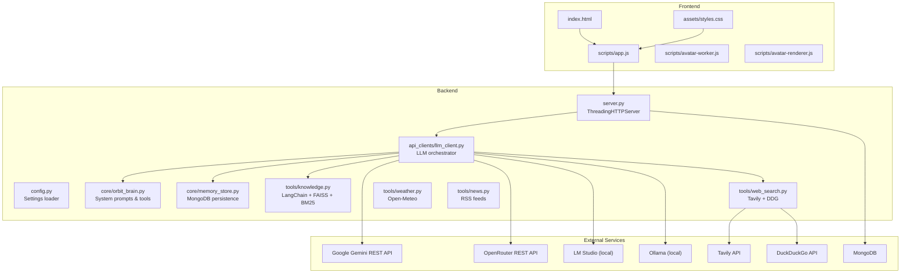
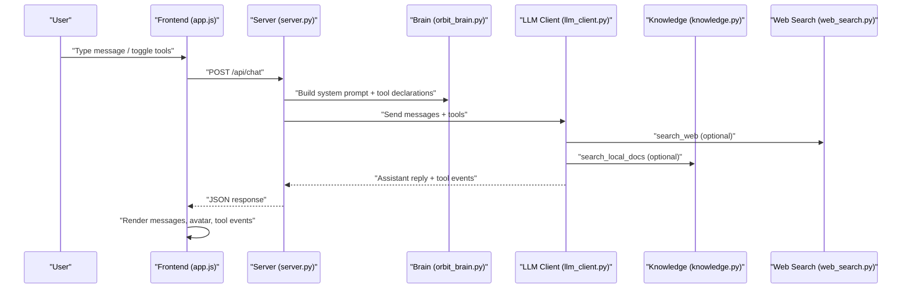
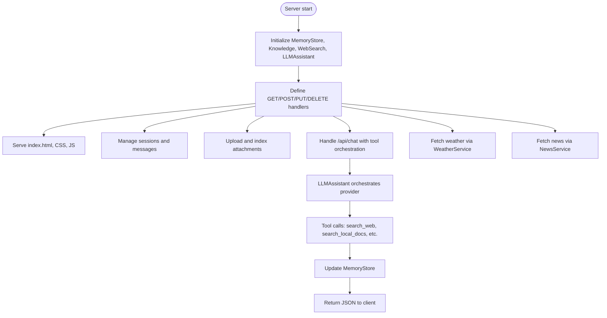
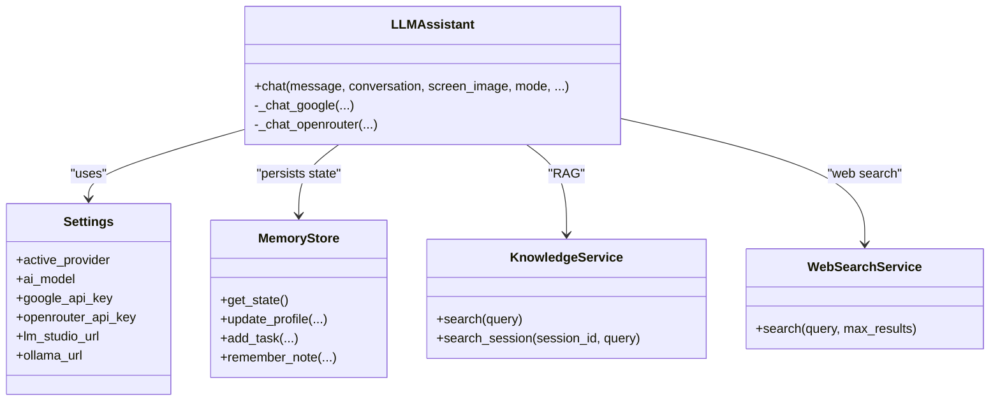
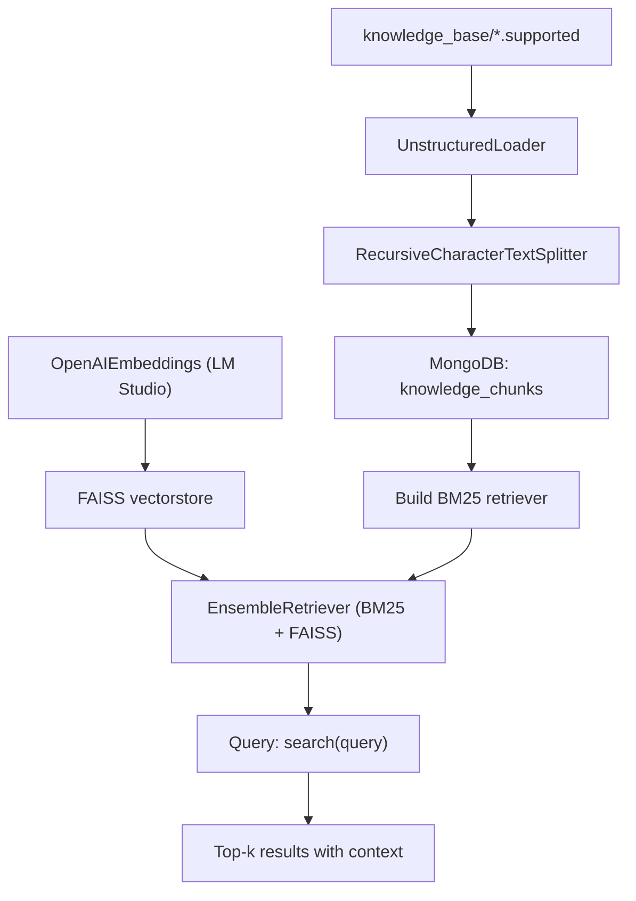
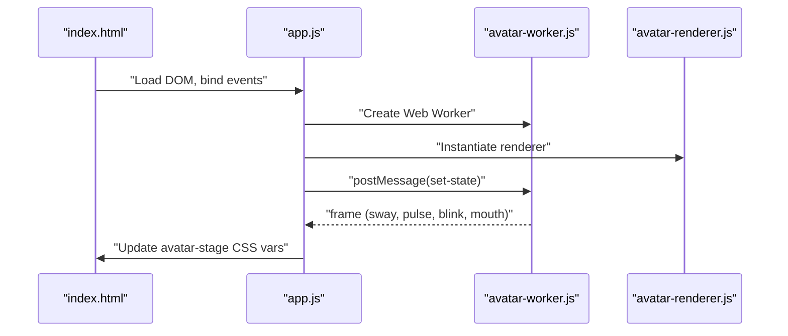
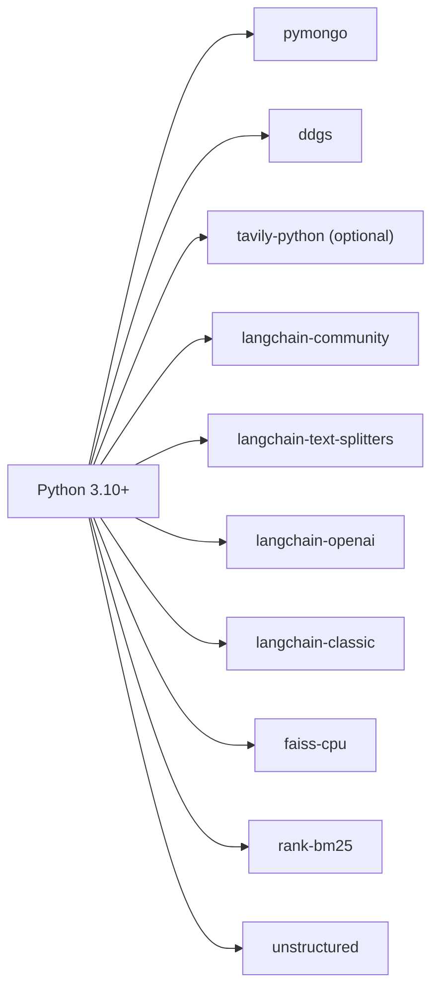

# Technology Stack

<cite>
**Referenced Files in This Document**
- [README.md](file://README.md)
- [requirements.txt](file://requirements.txt)
- [run.py](file://run.py)
- [backend/server.py](file://backend/server.py)
- [backend/config.py](file://backend/config.py)
- [backend/api_clients/llm_client.py](file://backend/api_clients/llm_client.py)
- [backend/core/orbit_brain.py](file://backend/core/orbit_brain.py)
- [backend/core/memory_store.py](file://backend/core/memory_store.py)
- [backend/tools/knowledge.py](file://backend/tools/knowledge.py)
- [backend/tools/web_search.py](file://backend/tools/web_search.py)
- [backend/tools/weather.py](file://backend/tools/weather.py)
- [backend/tools/news.py](file://backend/tools/news.py)
- [frontend/index.html](file://frontend/index.html)
- [frontend/assets/styles.css](file://frontend/assets/styles.css)
- [frontend/scripts/app.js](file://frontend/scripts/app.js)
- [frontend/scripts/avatar-worker.js](file://frontend/scripts/avatar-worker.js)
- [frontend/scripts/avatar-renderer.js](file://frontend/scripts/avatar-renderer.js)
</cite>

## Table of Contents
1. [Introduction](#introduction)
2. [Project Structure](#project-structure)
3. [Core Components](#core-components)
4. [Architecture Overview](#architecture-overview)
5. [Detailed Component Analysis](#detailed-component-analysis)
6. [Dependency Analysis](#dependency-analysis)
7. [Performance Considerations](#performance-considerations)
8. [Troubleshooting Guide](#troubleshooting-guide)
9. [Conclusion](#conclusion)

## Introduction
This document describes the Orbit Virtual Assistant technology stack. It covers the backend Python 3.10+ server using a threaded HTTP server, the vanilla JavaScript frontend with HTML5 and CSS, MongoDB for persistent storage, and the AI integration stack including Google Gemini REST API, OpenAI-compatible APIs (OpenRouter, LM Studio, Ollama), and local LLM execution. It also documents the Retrieval-Augmented Generation (RAG) stack using LangChain, FAISS, and BM25, along with web search integration via Tavily and DuckDuckGo. Optional components, configuration, and version compatibility are included.

## Project Structure
The project is organized into:
- backend/: Python server, API clients, tools, and core logic
- frontend/: HTML, CSS, and vanilla JavaScript for the UI
- data/: legacy storage migrated to MongoDB
- knowledge_base/: local documents for RAG
- Root configuration and dependency files

**Diagram sources**
- [backend/server.py:23-611](file://backend/server.py#L23-L611)
- [backend/config.py:20-76](file://backend/config.py#L20-L76)
- [backend/api_clients/llm_client.py:38-366](file://backend/api_clients/llm_client.py#L38-L366)
- [backend/core/orbit_brain.py:358-502](file://backend/core/orbit_brain.py#L358-L502)
- [backend/core/memory_store.py:67-150](file://backend/core/memory_store.py#L67-L150)
- [backend/tools/knowledge.py:88-393](file://backend/tools/knowledge.py#L88-L393)
- [backend/tools/web_search.py:53-139](file://backend/tools/web_search.py#L53-L139)
- [backend/tools/weather.py:47-141](file://backend/tools/weather.py#L47-L141)
- [backend/tools/news.py:21-83](file://backend/tools/news.py#L21-L83)
- [frontend/index.html:1-338](file://frontend/index.html#L1-L338)
- [frontend/assets/styles.css:1-1510](file://frontend/assets/styles.css#L1-L1510)
- [frontend/scripts/app.js:1-1765](file://frontend/scripts/app.js#L1-L1765)
- [frontend/scripts/avatar-worker.js:1-48](file://frontend/scripts/avatar-worker.js#L1-L48)
- [frontend/scripts/avatar-renderer.js:1-106](file://frontend/scripts/avatar-renderer.js#L1-L106)

**Section sources**
- [README.md:164-201](file://README.md#L164-L201)

## Core Components
- Backend server: ThreadingHTTPServer with REST endpoints for sessions, messages, attachments, chat, and utilities.
- Configuration: Loads environment variables and constructs Settings for providers, models, ports, and storage.
- LLM orchestration: Unified chat flow supporting Google Gemini REST and OpenAI-compatible providers (OpenRouter, LM Studio, Ollama).
- Tools: Weather, news, web search, and knowledge (RAG) integrations.
- Persistence: MongoDB-backed memory store for sessions, messages, profile, tasks, notes, and knowledge chunks.
- Frontend: Vanilla JavaScript UI with avatar animations, voice input, and tool toggles.

**Section sources**
- [backend/server.py:23-611](file://backend/server.py#L23-L611)
- [backend/config.py:20-76](file://backend/config.py#L20-L76)
- [backend/api_clients/llm_client.py:38-366](file://backend/api_clients/llm_client.py#L38-L366)
- [backend/core/orbit_brain.py:358-502](file://backend/core/orbit_brain.py#L358-L502)
- [backend/core/memory_store.py:67-150](file://backend/core/memory_store.py#L67-L150)
- [backend/tools/web_search.py:53-139](file://backend/tools/web_search.py#L53-L139)
- [backend/tools/knowledge.py:88-393](file://backend/tools/knowledge.py#L88-L393)
- [backend/tools/weather.py:47-141](file://backend/tools/weather.py#L47-L141)
- [backend/tools/news.py:21-83](file://backend/tools/news.py#L21-L83)
- [frontend/index.html:1-338](file://frontend/index.html#L1-L338)
- [frontend/scripts/app.js:1-1765](file://frontend/scripts/app.js#L1-L1765)

## Architecture Overview
The system uses a thin backend server to serve the static frontend and expose REST endpoints. The server composes a brain module that builds system prompts and function declarations, dispatches tool calls, and routes responses to the client. LLM providers are abstracted behind a unified client that selects the appropriate API path and headers. Optional RAG and web search integrate seamlessly with the tool chain.

**Diagram sources**
- [backend/server.py:276-321](file://backend/server.py#L276-L321)
- [backend/core/orbit_brain.py:358-502](file://backend/core/orbit_brain.py#L358-L502)
- [backend/api_clients/llm_client.py:38-366](file://backend/api_clients/llm_client.py#L38-L366)
- [backend/tools/knowledge.py:270-298](file://backend/tools/knowledge.py#L270-L298)
- [backend/tools/web_search.py:69-105](file://backend/tools/web_search.py#L69-L105)

## Detailed Component Analysis

### Backend Server and HTTP Routing
- Initializes MemoryStore, KnowledgeService, WebSearchService, and LLMAssistant.
- Serves static frontend files and exposes REST endpoints for sessions, messages, attachments, chat, weather, and news.
- Implements graceful fallbacks for unsupported features and enforces file upload limits/types.
- Starts ThreadingHTTPServer on configured port.

**Diagram sources**
- [backend/server.py:23-611](file://backend/server.py#L23-L611)
- [backend/core/memory_store.py:67-150](file://backend/core/memory_store.py#L67-L150)
- [backend/tools/weather.py:47-141](file://backend/tools/weather.py#L47-L141)
- [backend/tools/news.py:21-83](file://backend/tools/news.py#L21-L83)

**Section sources**
- [backend/server.py:23-611](file://backend/server.py#L23-L611)

### Configuration and Environment
- Loads .env variables into Settings including provider selection, API keys, model names, ports, locations, and MongoDB configuration.
- Provides provider-specific API keys and URLs for OpenRouter, LM Studio, and Ollama.

**Section sources**
- [backend/config.py:20-76](file://backend/config.py#L20-L76)

### LLM Integration Stack
- Supports Google Gemini REST API and OpenAI-compatible APIs (OpenRouter, LM Studio, Ollama).
- Builds system instructions and function declarations dynamically based on mode and toggles.
- Executes tool calls returned by the LLM and aggregates tool events for UI rendering.

**Diagram sources**
- [backend/api_clients/llm_client.py:38-366](file://backend/api_clients/llm_client.py#L38-L366)
- [backend/config.py:20-76](file://backend/config.py#L20-L76)
- [backend/core/memory_store.py:67-150](file://backend/core/memory_store.py#L67-L150)
- [backend/tools/knowledge.py:88-393](file://backend/tools/knowledge.py#L88-L393)
- [backend/tools/web_search.py:53-139](file://backend/tools/web_search.py#L53-L139)

**Section sources**
- [backend/api_clients/llm_client.py:38-366](file://backend/api_clients/llm_client.py#L38-L366)
- [backend/core/orbit_brain.py:358-502](file://backend/core/orbit_brain.py#L358-L502)

### RAG Stack (LangChain, FAISS, BM25)
- Parses and chunks supported document types from knowledge_base and stores chunks in MongoDB.
- Builds BM25 retriever and optional FAISS vector retriever (hybrid via EnsembleRetriever) using embeddings from LM Studio.
- Supports session-scoped document search for files attached in chat.

**Diagram sources**
- [backend/tools/knowledge.py:12-393](file://backend/tools/knowledge.py#L12-L393)
- [backend/core/memory_store.py:694-748](file://backend/core/memory_store.py#L694-L748)

**Section sources**
- [backend/tools/knowledge.py:88-393](file://backend/tools/knowledge.py#L88-L393)
- [backend/core/memory_store.py:694-748](file://backend/core/memory_store.py#L694-L748)

### Web Search Integration (Tavily + DuckDuckGo)
- Attempts Tavily search first; falls back to DuckDuckGo if Tavily is unavailable or fails.
- Returns standardized results with title, link, and body for downstream tool usage.

**Section sources**
- [backend/tools/web_search.py:53-139](file://backend/tools/web_search.py#L53-L139)

### Persistent Storage (MongoDB)
- Centralized storage for sessions, messages, profile, tasks, notes, cached weather/news, knowledge chunks, and session attachments.
- Enforces indexes and ensures a single user profile document.

**Section sources**
- [backend/core/memory_store.py:23-150](file://backend/core/memory_store.py#L23-L150)

### Frontend: Vanilla JavaScript and UI
- Single-page application with a responsive chat UI, mode switching (Simple, Copilot, Coach), and tool toggles (Search, Offline, Thinking, Image).
- Avatar animation powered by a Web Worker for smooth UI updates.
- Voice input support with two modes (review-before-send and instant-send), plus screen sharing preview.

**Diagram sources**
- [frontend/index.html:1-338](file://frontend/index.html#L1-L338)
- [frontend/scripts/app.js:536-565](file://frontend/scripts/app.js#L536-L565)
- [frontend/scripts/avatar-worker.js:1-48](file://frontend/scripts/avatar-worker.js#L1-L48)
- [frontend/scripts/avatar-renderer.js:1-106](file://frontend/scripts/avatar-renderer.js#L1-L106)

**Section sources**
- [frontend/index.html:1-338](file://frontend/index.html#L1-L338)
- [frontend/assets/styles.css:1-1510](file://frontend/assets/styles.css#L1-L1510)
- [frontend/scripts/app.js:1-1765](file://frontend/scripts/app.js#L1-L1765)
- [frontend/scripts/avatar-worker.js:1-48](file://frontend/scripts/avatar-worker.js#L1-L48)
- [frontend/scripts/avatar-renderer.js:1-106](file://frontend/scripts/avatar-renderer.js#L1-L106)

## Dependency Analysis
Core runtime dependencies and optional components are declared in requirements.txt. The README enumerates installation and configuration steps.

**Diagram sources**
- [requirements.txt:1-29](file://requirements.txt#L1-L29)

**Section sources**
- [requirements.txt:1-29](file://requirements.txt#L1-L29)
- [README.md:84-136](file://README.md#L84-L136)

## Performance Considerations
- ThreadingHTTPServer: Suitable for development and moderate concurrency; consider a production WSGI server for high load.
- RAG indexing: Chunking and embedding can be CPU-intensive; FAISS build is logged and falls back to BM25-only if embedding connectivity fails.
- Web search: Spinner timers provide feedback; timeouts are configured for reliable operation.
- MongoDB: Indexes are created on frequently queried fields; ensure proper sizing and backup policies.

[No sources needed since this section provides general guidance]

## Troubleshooting Guide
Common issues and remedies:
- Missing API keys: Ensure ACTIVE_PROVIDER and associated keys are set in .env; the server validates keys before chat.
- Web search failures: Tavily is attempted first; if unavailable, the system falls back to DuckDuckGo. Verify TAVILY_API_KEY if Tavily is preferred.
- RAG not working: Confirm LM Studio embeddings are reachable and knowledge_base path is configured; the system logs embedding connectivity warnings.
- MongoDB connection: The server performs a ping at startup; ensure MONGODB_URI and credentials are correct.
- Unsupported features: The server returns a clear refusal message for unsupported features (e.g., image generation) instead of failing.

**Section sources**
- [backend/server.py:271-275](file://backend/server.py#L271-L275)
- [backend/api_clients/llm_client.py:164-175](file://backend/api_clients/llm_client.py#L164-L175)
- [backend/tools/web_search.py:86-104](file://backend/tools/web_search.py#L86-L104)
- [backend/tools/knowledge.py:134-137](file://backend/tools/knowledge.py#L134-L137)
- [backend/core/memory_store.py:86-99](file://backend/core/memory_store.py#L86-L99)

## Conclusion
Orbit Virtual Assistant integrates a lightweight Python backend with a modern vanilla JavaScript frontend, persistent MongoDB storage, and a flexible AI stack spanning cloud and local LLMs. Optional RAG and web search enhance contextual grounding, while the UI provides immersive features like voice input and animated avatars. The modular design allows easy extension and deployment across diverse environments.