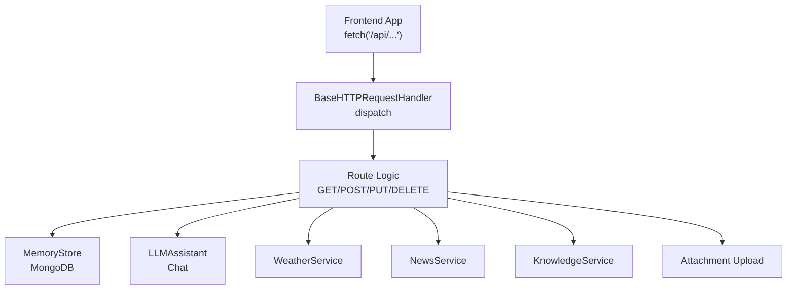
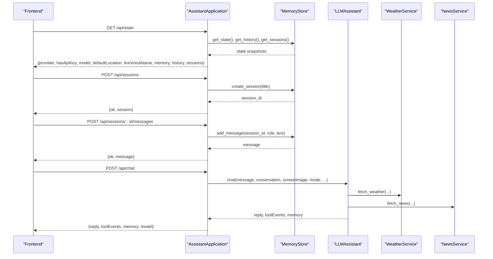
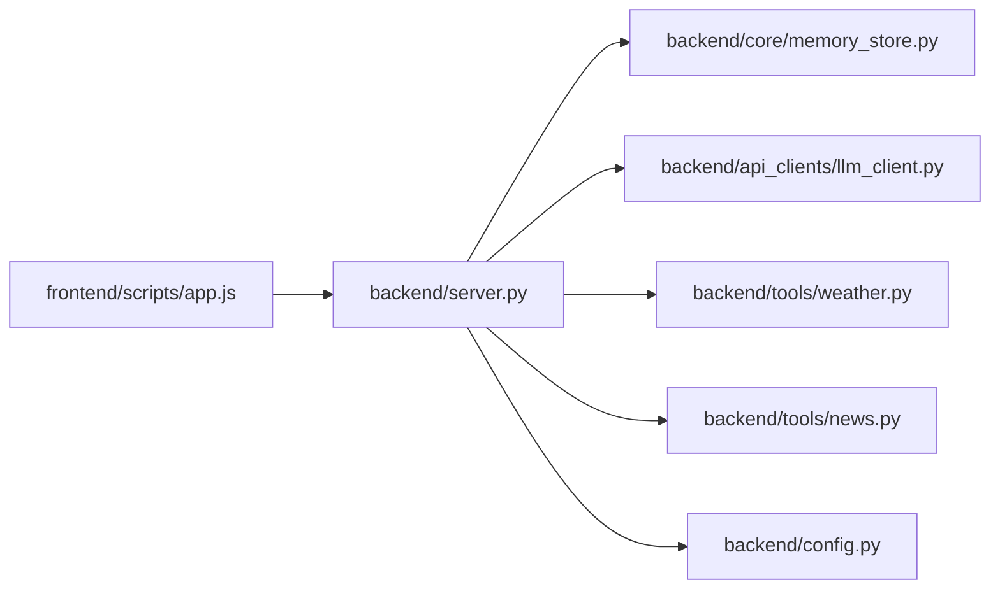

# API Endpoint Handlers

<cite>
**Referenced Files in This Document**
- [backend/server.py](file://backend/server.py)
- [backend/config.py](file://backend/config.py)
- [backend/core/memory_store.py](file://backend/core/memory_store.py)
- [backend/tools/weather.py](file://backend/tools/weather.py)
- [backend/tools/news.py](file://backend/tools/news.py)
- [backend/api_clients/llm_client.py](file://backend/api_clients/llm_client.py)
- [frontend/scripts/app.js](file://frontend/scripts/app.js)
</cite>

## Table of Contents
1. [Introduction](#introduction)
2. [Project Structure](#project-structure)
3. [Core Components](#core-components)
4. [Architecture Overview](#architecture-overview)
5. [Detailed Component Analysis](#detailed-component-analysis)
6. [Dependency Analysis](#dependency-analysis)
7. [Performance Considerations](#performance-considerations)
8. [Troubleshooting Guide](#troubleshooting-guide)
9. [Conclusion](#conclusion)

## Introduction
This document describes the API endpoint handler system powering the Orbit Virtual Assistant. It covers all HTTP endpoints, request validation, parameter extraction, response formatting, error handling, RESTful design patterns, URL routing logic, and HTTP status code usage. It also explains integration patterns with the frontend application and provides examples of request/response payloads.

## Project Structure
The backend is a lightweight HTTP server built around a single request handler class that dispatches to route-specific logic. The server integrates with:
- MongoDB-backed memory store for persistent state
- LLM client for chat processing
- Weather and news utilities
- Knowledge service for RAG capabilities

**Diagram sources**
- [backend/server.py:67-83](file://backend/server.py#L67-L83)
- [backend/server.py:85-500](file://backend/server.py#L85-L500)
- [backend/core/memory_store.py:67-150](file://backend/core/memory_store.py#L67-L150)
- [backend/api_clients/llm_client.py:38-78](file://backend/api_clients/llm_client.py#L38-L78)
- [backend/tools/weather.py:48-75](file://backend/tools/weather.py#L48-L75)
- [backend/tools/news.py:22-60](file://backend/tools/news.py#L22-L60)

**Section sources**
- [backend/server.py:67-83](file://backend/server.py#L67-L83)
- [backend/server.py:85-500](file://backend/server.py#L85-L500)

## Core Components
- AssistantApplication: central orchestrator that wires routes, memory store, LLM, and utilities.
- MemoryStore: MongoDB-backed persistence for sessions, messages, tasks, notes, and caches.
- LLMAssistant: chat orchestration with tool invocation and provider abstraction.
- WeatherService and NewsService: external utility endpoints.
- Frontend app.js: consumes endpoints for chat, sessions, attachments, utilities.

**Section sources**
- [backend/server.py:23-63](file://backend/server.py#L23-L63)
- [backend/core/memory_store.py:67-150](file://backend/core/memory_store.py#L67-L150)
- [backend/api_clients/llm_client.py:38-78](file://backend/api_clients/llm_client.py#L38-L78)
- [backend/tools/weather.py:48-75](file://backend/tools/weather.py#L48-L75)
- [backend/tools/news.py:22-60](file://backend/tools/news.py#L22-L60)

## Architecture Overview
The server exposes REST endpoints grouped by resource and function:
- Sessions: CRUD for chat sessions and messages
- Attachments: file upload and indexing per session
- Chat: LLM orchestration with tool calls
- Utilities: weather, news, tasks, notes, profile
- State: initial state bootstrap for the frontend

**Diagram sources**
- [backend/server.py:106-108](file://backend/server.py#L106-L108)
- [backend/server.py:183-186](file://backend/server.py#L183-L186)
- [backend/server.py:189-202](file://backend/server.py#L189-L202)
- [backend/server.py:211-321](file://backend/server.py#L211-L321)
- [backend/core/memory_store.py:579-596](file://backend/core/memory_store.py#L579-L596)
- [backend/core/memory_store.py:652-673](file://backend/core/memory_store.py#L652-L673)
- [backend/api_clients/llm_client.py:47-78](file://backend/api_clients/llm_client.py#L47-L78)
- [backend/tools/weather.py:51-75](file://backend/tools/weather.py#L51-L75)
- [backend/tools/news.py:25-60](file://backend/tools/news.py#L25-L60)

## Detailed Component Analysis

### Session Management (/api/sessions)
- GET /api/sessions
  - Query: include_archived (boolean)
  - Response: { sessions: [ ... ] }
  - Status: 200 OK
- GET /api/sessions/:id
  - Response: { session: { ... } } or { error: "Session not found." } with 404
- GET /api/sessions/:id/messages
  - Query: limit (int)
  - Response: { messages: [ ... ] }
- POST /api/sessions
  - Body: { title?: string }
  - Response: { ok: true, session: { session_id, title, ... } }
- PUT /api/sessions/:id
  - Body: { title?, pinned?, archived? }
  - Response: { ok: true, session: { ... } } or error with 400
- DELETE /api/sessions/:id
  - Response: { ok: true }
- DELETE /api/sessions/:id/attachments/:attachment_id
  - Response: { ok: true }
- DELETE /api/messages/:message_id
  - Response: { ok: true }
- DELETE /api/notes/:note_id
  - Response: { ok: true, memory: { ... } } or error with 404
- DELETE /api/tasks/:task_id
  - Response: { ok: true, memory: { ... } } or error with 404
- DELETE /api/tasks/complete
  - Body: { taskRef: string }
  - Response: { ok: true, task: { ... }, memory: { ... } } or error with 400/404

Validation and error handling:
- Missing or invalid IDs return 404 Not Found.
- PUT updates require at least one valid field; otherwise 400 Bad Request.
- DELETE endpoints guard against missing IDs and return 404 when not found.

**Section sources**
- [backend/server.py:111-126](file://backend/server.py#L111-L126)
- [backend/server.py:128-135](file://backend/server.py#L128-L135)
- [backend/server.py:183-186](file://backend/server.py#L183-L186)
- [backend/server.py:403-420](file://backend/server.py#L403-L420)
- [backend/server.py:428-500](file://backend/server.py#L428-L500)
- [backend/core/memory_store.py:579-596](file://backend/core/memory_store.py#L579-L596)
- [backend/core/memory_store.py:615-630](file://backend/core/memory_store.py#L615-L630)
- [backend/core/memory_store.py:632-646](file://backend/core/memory_store.py#L632-L646)
- [backend/core/memory_store.py:687-690](file://backend/core/memory_store.py#L687-690)
- [backend/core/memory_store.py:448-469](file://backend/core/memory_store.py#L448-L469)
- [backend/core/memory_store.py:417-446](file://backend/core/memory_store.py#L417-L446)

### Message Handling (/api/sessions/*/messages)
- POST /api/sessions/:id/messages
  - Body: { role: "user"|"assistant", text: string }
  - Validation: text must be non-empty; otherwise 400 Bad Request
  - Response: { ok: true, message: { message_id, session_id, role, text, created_at } }

- GET /api/sessions/:id/messages
  - Query: limit (int)
  - Response: { messages: [ { role, text, created_at, session_id } ] }

**Section sources**
- [backend/server.py:189-202](file://backend/server.py#L189-L202)
- [backend/server.py:128-135](file://backend/server.py#L128-L135)
- [backend/core/memory_store.py:652-673](file://backend/core/memory_store.py#L652-L673)
- [backend/core/memory_store.py:675-685](file://backend/core/memory_store.py#L675-L685)

### Attachment Upload (/api/sessions/*/attachments)
- POST /api/sessions/:id/attachments
  - Body: { filename: string, data: base64 }
  - Validation:
    - filename and data required; otherwise 400 Bad Request
    - Allowed types: .pdf, .docx, .doc, .txt, .md, .csv, .json
    - Max size: 20 MB
    - Base64 decoding failure returns 400 Bad Request
  - Behavior:
    - Saves file to disk under data/uploads with session-scoped name
    - Registers attachment in MongoDB
    - Attempts to parse and index file for session search; records chunk_count or parse_error
  - Response: { ok: true, attachment: { attachment_id, session_id, filename, file_type, file_size, storage_path, created_at, chunk_count?, parse_error? } }

- GET /api/sessions/:id/attachments
  - Response: { attachments: [ { filename, file_type, file_size, created_at, ... } ] }

- DELETE /api/sessions/:id/attachments/:attachment_id
  - Response: { ok: true }
  - Cleanup: removes file from disk if present

**Section sources**
- [backend/server.py:205-209](file://backend/server.py#L205-L209)
- [backend/server.py:137-143](file://backend/server.py#L137-L143)
- [backend/server.py:329-393](file://backend/server.py#L329-L393)
- [backend/core/memory_store.py:754-779](file://backend/core/memory_store.py#L754-L779)
- [backend/core/memory_store.py:781-786](file://backend/core/memory_store.py#L781-L786)
- [backend/core/memory_store.py:788-796](file://backend/core/memory_store.py#L788-L796)

### Chat Processing (/api/chat)
- POST /api/chat
  - Body keys:
    - message: string (required)
    - conversation: array of { role, text }
    - screenImage: base64 image data (optional)
    - mode: "simple"|"coach"|"tutor"
    - coachTopic: string
    - coachLevel: string
    - preferredLanguage: string
    - webSearchOnly: boolean
    - offlineMode: boolean
    - sessionId: string (optional)
    - imageGen: boolean (graceful fallback if true)
  - Validation:
    - message must be non-empty; otherwise 400 Bad Request
    - If imageGen is true, responds with graceful refusal and 200 OK
  - Processing:
    - Calls LLMAssistant.chat(...) with extracted parameters
    - On LLMClientError, returns 502 Bad Gateway with error message
  - Response: { reply: string, toolEvents: [ ... ], memory: { ... }, model: string }

- GET /api/state
  - Response: { provider, hasApiKey, model, defaultLocation, liveVoiceName, memory, history, sessions }

**Section sources**
- [backend/server.py:211-321](file://backend/server.py#L211-L321)
- [backend/server.py:106-108](file://backend/server.py#L106-L108)
- [backend/api_clients/llm_client.py:47-78](file://backend/api_clients/llm_client.py#L47-L78)
- [backend/api_clients/llm_client.py:158-174](file://backend/api_clients/llm_client.py#L158-L174)

### Utility Endpoints
- Weather
  - GET /api/weather?location=...
  - Validation: location must be provided; otherwise WeatherError
  - Response: { weather: { location, temperature_c, feels_like_c, humidity_pct, wind_kph, precipitation_mm, high_c, low_c, rain_chance_pct, advice }, memory: { ... } }
  - Error: 400 Bad Request with error message

- News
  - GET /api/news?topic=...
  - Validation: topic normalized; RSS parsing handled
  - Response: { news: { topic, items: [ { title, link, source, published_at } ], updated_at }, memory: { ... } }
  - Error: 400 Bad Request with error message

- Profile
  - POST /api/profile
  - Body: { displayName?: string, location?: string, routine?: string }
  - Response: { ok: true, snapshot: { profile brief }, memory: { ... } }

- Tasks
  - POST /api/tasks
    - Body: { title: string, priority: "low"|"medium"|"high", dueDate?: string }
    - Validation: title must be non-empty; otherwise 400 Bad Request
    - Response: { ok: true, task: { id, title, priority, due_date, status, created_at, completed_at? }, memory: { ... } }
  - POST /api/tasks/complete
    - Body: { taskRef: string }
    - Validation: taskRef must be non-empty; otherwise 400 Bad Request
    - Response: { ok: true, task: { id, title, priority, due_date, status, created_at, completed_at }, memory: { ... } }
  - DELETE /api/tasks/:id
    - Response: { ok: true, memory: { ... } } or 404 Not Found

- Notes
  - POST /api/notes
    - Body: { text: string, category?: string }
    - Validation: text must be non-empty; otherwise 400 Bad Request
    - Response: { ok: true, note: { id, category, text, created_at }, memory: { ... } }
  - DELETE /api/notes/:id
    - Response: { ok: true, memory: { ... } } or 404 Not Found

- History
  - POST /api/history
    - Body: { history: array of { role, text }, sessionId?: string }
    - Response: { status: "success" }

**Section sources**
- [backend/server.py:145-164](file://backend/server.py#L145-L164)
- [backend/server.py:214-221](file://backend/server.py#L214-L221)
- [backend/server.py:222-242](file://backend/server.py#L222-L242)
- [backend/server.py:243-253](file://backend/server.py#L243-L253)
- [backend/server.py:169-178](file://backend/server.py#L169-L178)
- [backend/tools/weather.py:51-75](file://backend/tools/weather.py#L51-L75)
- [backend/tools/news.py:25-60](file://backend/tools/news.py#L25-L60)
- [backend/core/memory_store.py:309-332](file://backend/core/memory_store.py#L309-L332)
- [backend/core/memory_store.py:338-415](file://backend/core/memory_store.py#L338-L415)
- [backend/core/memory_store.py:417-446](file://backend/core/memory_store.py#L417-L446)
- [backend/core/memory_store.py:448-469](file://backend/core/memory_store.py#L448-L469)

### Frontend Integration Patterns
- Session lifecycle:
  - Creates session on first message if none exists
  - Stores user and assistant messages per session
  - Loads session messages on selection
- Chat:
  - Sends POST /api/chat with conversation snapshot and optional screenImage
  - Renders tool events and updates memory state
- Utilities:
  - Weather and news refresh endpoints
  - Tasks and notes CRUD
- State bootstrap:
  - GET /api/state on initialization to populate UI and memory

**Section sources**
- [frontend/scripts/app.js:902-926](file://frontend/scripts/app.js#L902-L926)
- [frontend/scripts/app.js:928-1087](file://frontend/scripts/app.js#L928-L1087)
- [frontend/scripts/app.js:1217-1241](file://frontend/scripts/app.js#L1217-L1241)
- [frontend/scripts/app.js:1403-1432](file://frontend/scripts/app.js#L1403-L1432)
- [frontend/scripts/app.js:1434-1472](file://frontend/scripts/app.js#L1434-L1472)
- [frontend/scripts/app.js:1474-1488](file://frontend/scripts/app.js#L1474-L1488)
- [frontend/scripts/app.js:1490-1514](file://frontend/scripts/app.js#L1490-L1514)
- [frontend/scripts/app.js:1569-1637](file://frontend/scripts/app.js#L1569-L1637)

## Dependency Analysis
- Route handlers depend on MemoryStore for persistence and on LLM client for chat.
- Weather and news services are invoked from chat processing and utility endpoints.
- Frontend drives all flows via fetch() calls to the endpoints documented above.

**Diagram sources**
- [frontend/scripts/app.js:902-1087](file://frontend/scripts/app.js#L902-L1087)
- [backend/server.py:85-500](file://backend/server.py#L85-L500)
- [backend/core/memory_store.py:67-150](file://backend/core/memory_store.py#L67-L150)
- [backend/api_clients/llm_client.py:38-78](file://backend/api_clients/llm_client.py#L38-L78)
- [backend/tools/weather.py:48-75](file://backend/tools/weather.py#L48-L75)
- [backend/tools/news.py:22-60](file://backend/tools/news.py#L22-L60)
- [backend/config.py:20-76](file://backend/config.py#L20-L76)

**Section sources**
- [backend/server.py:85-500](file://backend/server.py#L85-L500)
- [backend/core/memory_store.py:67-150](file://backend/core/memory_store.py#L67-L150)
- [backend/api_clients/llm_client.py:38-78](file://backend/api_clients/llm_client.py#L38-L78)
- [backend/tools/weather.py:48-75](file://backend/tools/weather.py#L48-L75)
- [backend/tools/news.py:22-60](file://backend/tools/news.py#L22-L60)
- [backend/config.py:20-76](file://backend/config.py#L20-L76)

## Performance Considerations
- Attachment upload enforces a 20 MB limit and validates MIME types to prevent oversized or malicious payloads.
- Chat processing limits tool loop iterations to avoid long-running requests.
- MongoDB indexes are created for efficient querying of sessions, messages, and attachments.
- Weather and news endpoints cache recent results in MongoDB for quick retrieval.

[No sources needed since this section provides general guidance]

## Troubleshooting Guide
Common issues and resolutions:
- 400 Bad Request
  - Missing or invalid fields in requests (e.g., empty message, missing filename/data, invalid base64).
  - Weather/News service errors (e.g., invalid location, service unavailable).
- 404 Not Found
  - Non-existent session, message, note, or task IDs.
- 502 Bad Gateway
  - LLM client errors (e.g., API key missing, provider error).
- 500 Internal Server
  - Unexpected server-side exceptions; check logs and ensure MongoDB connectivity.

**Section sources**
- [backend/server.py:198-200](file://backend/server.py#L198-L200)
- [backend/server.py:336-353](file://backend/server.py#L336-L353)
- [backend/server.py:152-154](file://backend/server.py#L152-L154)
- [backend/server.py:162-164](file://backend/server.py#L162-L164)
- [backend/server.py:309-310](file://backend/server.py#L309-L310)
- [backend/core/memory_store.py:618-629](file://backend/core/memory_store.py#L618-L629)
- [backend/core/memory_store.py:342-343](file://backend/core/memory_store.py#L342-L343)
- [backend/core/memory_store.py:379-396](file://backend/core/memory_store.py#L379-L396)

## Conclusion
The API endpoint handler system provides a cohesive, RESTful interface for managing conversations, attachments, utilities, and state. It integrates tightly with the frontend to deliver a responsive chat experience while maintaining robust validation, error handling, and performance characteristics.