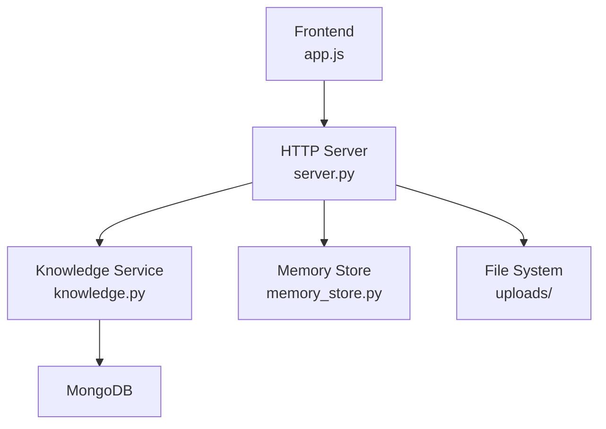
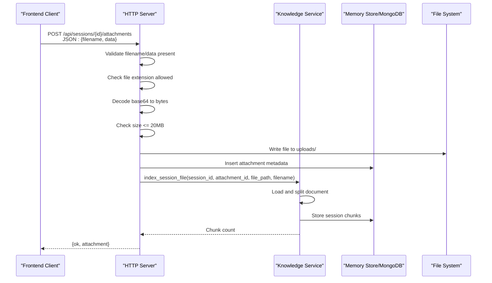
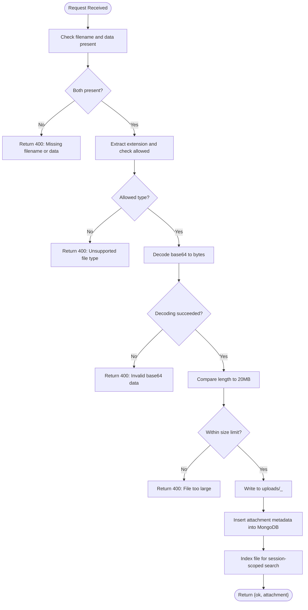
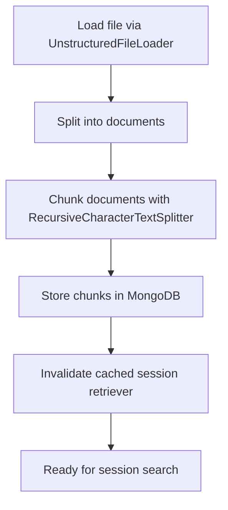
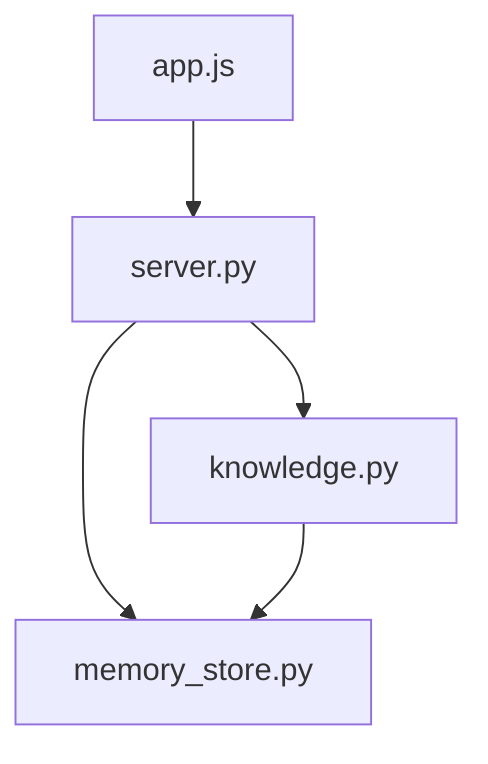

# Attachment Upload Endpoints

<cite>
**Referenced Files in This Document**
- [server.py](file://backend/server.py)
- [knowledge.py](file://backend/tools/knowledge.py)
- [memory_store.py](file://backend/core/memory_store.py)
- [app.js](file://frontend/scripts/app.js)
- [config.py](file://backend/config.py)
- [README.md](file://README.md)
</cite>

## Table of Contents
1. [Introduction](#introduction)
2. [Project Structure](#project-structure)
3. [Core Components](#core-components)
4. [Architecture Overview](#architecture-overview)
5. [Detailed Component Analysis](#detailed-component-analysis)
6. [Dependency Analysis](#dependency-analysis)
7. [Performance Considerations](#performance-considerations)
8. [Troubleshooting Guide](#troubleshooting-guide)
9. [Conclusion](#conclusion)

## Introduction
This document provides comprehensive documentation for the attachment upload API endpoints, focusing on the POST `/api/sessions/{id}/attachments` endpoint. It explains supported file types, size limitations, validation logic, secure storage patterns, automatic indexing for Retrieval-Augmented Generation (RAG), and error handling. It also covers the attachment metadata structure, file parsing workflow, and integration with the knowledge service for document search.

## Project Structure
The attachment upload feature spans the backend HTTP server, the knowledge service for parsing and indexing, and the frontend client that prepares and sends base64-encoded files.

**Diagram sources**
- [server.py:23-63](file://backend/server.py#L23-L63)
- [knowledge.py:88-140](file://backend/tools/knowledge.py#L88-L140)
- [memory_store.py:760-796](file://backend/core/memory_store.py#L760-L796)

**Section sources**
- [README.md:164-201](file://README.md#L164-L201)

## Core Components
- HTTP Server: Handles the POST `/api/sessions/{id}/attachments` endpoint, validates requests, decodes base64 data, saves files, registers metadata, and triggers indexing.
- Knowledge Service: Parses uploaded files, chunks them, stores chunks, and maintains session-scoped retrievers for search.
- Memory Store: Persists attachment metadata and session chunks to MongoDB.
- Frontend Client: Validates file types and sizes, converts files to base64, and posts to the API.

**Section sources**
- [server.py:326-393](file://backend/server.py#L326-L393)
- [knowledge.py:303-335](file://backend/tools/knowledge.py#L303-L335)
- [memory_store.py:760-796](file://backend/core/memory_store.py#L760-L796)
- [app.js:1594-1632](file://frontend/scripts/app.js#L1594-L1632)

## Architecture Overview
The upload flow integrates frontend validation, backend processing, file persistence, metadata registration, and RAG indexing.

**Diagram sources**
- [server.py:204-209](file://backend/server.py#L204-L209)
- [server.py:329-393](file://backend/server.py#L329-L393)
- [knowledge.py:303-335](file://backend/tools/knowledge.py#L303-L335)
- [memory_store.py:760-796](file://backend/core/memory_store.py#L760-L796)

## Detailed Component Analysis

### Endpoint Definition
- Method: POST
- Path: `/api/sessions/{id}/attachments`
- Request Body: JSON object containing:
  - filename: string (required)
  - data: string (required; base64-encoded file content)
- Response: JSON object with ok flag and attachment metadata.

Supported file types: .pdf, .docx, .doc, .txt, .md, .csv, .json

Size limitation: 20 MB maximum

**Section sources**
- [server.py:204-209](file://backend/server.py#L204-L209)
- [server.py:326-327](file://backend/server.py#L326-L327)
- [app.js:1594-1614](file://frontend/scripts/app.js#L1594-L1614)

### Validation and Security
- Required fields: filename and data must be present and non-empty.
- File type validation: Only allowed extensions are accepted.
- Base64 decoding: Attempted; invalid base64 triggers an error response.
- Size validation: Enforced against 20 MB limit.
- Secure storage: Files are saved under a session-scoped filename to prevent collisions and simplify cleanup.

**Diagram sources**
- [server.py:333-361](file://backend/server.py#L333-L361)

**Section sources**
- [server.py:333-361](file://backend/server.py#L333-L361)

### Attachment Metadata Structure
On successful upload, the response includes an attachment object with:
- attachment_id: unique identifier for the attachment
- session_id: the target session
- filename: original filename
- file_type: normalized extension
- file_size: byte length of decoded content
- storage_path: absolute path to the saved file
- created_at: timestamp
- chunk_count: number of chunks created during indexing (optional)
- parse_error: error message if parsing failed (optional)

These fields are persisted to MongoDB and used for retrieval and cleanup.

**Section sources**
- [memory_store.py:764-779](file://backend/core/memory_store.py#L764-L779)
- [server.py:372-393](file://backend/server.py#L372-L393)

### File Parsing Workflow and RAG Indexing
- Loader: Uses UnstructuredFileLoader to parse the saved file.
- Splitting: Documents are split into chunks using RecursiveCharacterTextSplitter with markdown-aware separators.
- Storage: Chunks are inserted into MongoDB under the session’s attachment_id.
- Retrieval: Session-scoped retrievers (BM25, optionally hybrid with FAISS) are lazily built and cached; invalidated when chunks change.

**Diagram sources**
- [knowledge.py:312-335](file://backend/tools/knowledge.py#L312-L335)

**Section sources**
- [knowledge.py:303-335](file://backend/tools/knowledge.py#L303-L335)
- [knowledge.py:357-387](file://backend/tools/knowledge.py#L357-L387)

### Error Handling
Common error scenarios and responses:
- Missing filename or data: 400 Bad Request with a descriptive error message.
- Unsupported file type: 400 Bad Request listing allowed types.
- Invalid base64 data: 400 Bad Request.
- File too large (> 20 MB): 400 Bad Request.
- Parsing failure: File is saved, but attachment record includes parse_error; indexing proceeds without embedding if configured.

Frontend handles errors by displaying user-friendly messages and marking the upload as failed.

**Section sources**
- [server.py:336-361](file://backend/server.py#L336-L361)
- [server.py:389-391](file://backend/server.py#L389-L391)
- [app.js:1616-1618](file://frontend/scripts/app.js#L1616-L1618)

### Secure Storage Patterns
- Directory: Files are written to a dedicated uploads directory under the data directory.
- Naming: Files are prefixed with session_id to avoid collisions and simplify cleanup.
- Cleanup: Deleting a session removes all associated attachments and their chunks; deleting individual attachments removes the file and chunks.

**Section sources**
- [server.py:364-369](file://backend/server.py#L364-L369)
- [server.py:437-444](file://backend/server.py#L437-L444)
- [server.py:455-464](file://backend/server.py#L455-L464)

### Integration with Knowledge Service for Document Search
- After indexing, session-scoped search becomes available.
- The knowledge service builds a BM25 retriever for the session’s chunks and optionally augments it with FAISS if embeddings are available.
- Search results include chunked content with metadata indicating the source filename.

**Section sources**
- [knowledge.py:337-355](file://backend/tools/knowledge.py#L337-L355)
- [knowledge.py:357-387](file://backend/tools/knowledge.py#L357-L387)

## Dependency Analysis
The upload endpoint depends on:
- HTTP server routing and request handling
- Knowledge service for parsing and indexing
- Memory store for metadata and chunk persistence
- Frontend client for base64 conversion and validation

**Diagram sources**
- [server.py:23-63](file://backend/server.py#L23-L63)
- [knowledge.py:88-140](file://backend/tools/knowledge.py#L88-L140)
- [memory_store.py:760-796](file://backend/core/memory_store.py#L760-L796)

**Section sources**
- [server.py:23-63](file://backend/server.py#L23-L63)
- [knowledge.py:88-140](file://backend/tools/knowledge.py#L88-L140)
- [memory_store.py:760-796](file://backend/core/memory_store.py#L760-L796)

## Performance Considerations
- Base64 decoding overhead: Large files incur CPU cost for decoding; ensure clients pre-validate size and type.
- File I/O: Writing to disk and subsequent parsing can be I/O bound; consider asynchronous processing for very large uploads.
- Chunking: Larger chunk sizes reduce overhead but may decrease precision; the splitter is tuned for readability.
- Retrieval caching: Session retrievers are cached; invalidation occurs on chunk changes to balance freshness and performance.

[No sources needed since this section provides general guidance]

## Troubleshooting Guide
- Invalid base64 data: Ensure the client sends only the base64 portion (after the comma) from a data URL. The server expects a pure base64 string.
- Unsupported file type: Confirm the extension is one of .pdf, .docx, .doc, .txt, .md, .csv, .json.
- File too large: Reduce file size below 20 MB or split the content.
- Parsing failures: Some documents may fail to parse; the server records parse_error in the attachment metadata. Retry with a different format or tool.
- Cleanup issues: If a session is deleted, verify that uploads directory entries are removed; the server attempts removal but may skip if files are missing.

**Section sources**
- [server.py:349-353](file://backend/server.py#L349-L353)
- [server.py:341-347](file://backend/server.py#L341-L347)
- [server.py:355-361](file://backend/server.py#L355-L361)
- [server.py:389-391](file://backend/server.py#L389-L391)
- [server.py:437-444](file://backend/server.py#L437-L444)
- [server.py:458-464](file://backend/server.py#L458-L464)

## Conclusion
The attachment upload endpoint provides a robust pipeline for accepting base64-encoded files, validating inputs, persisting securely, and indexing content for session-scoped search. By combining frontend validation with backend safeguards and leveraging the knowledge service for parsing and retrieval, the system ensures reliable and efficient document ingestion and search capabilities.