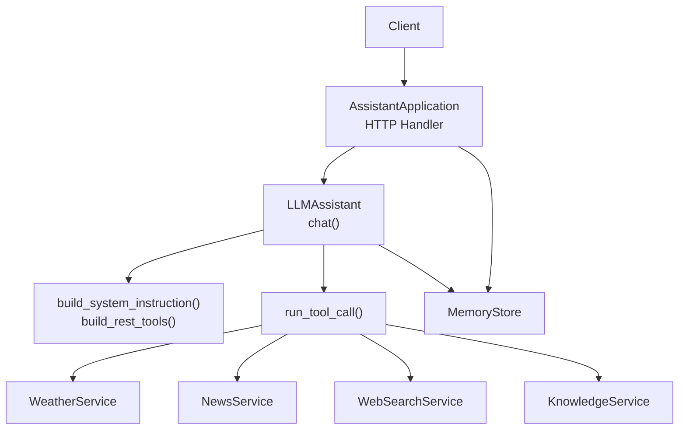
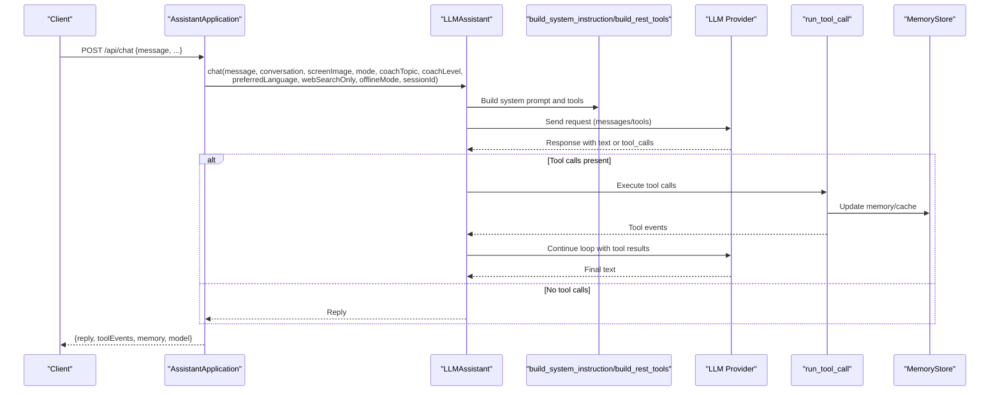
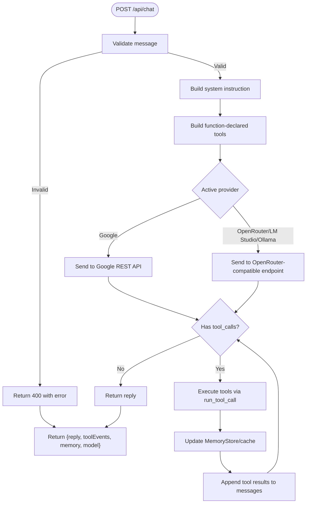
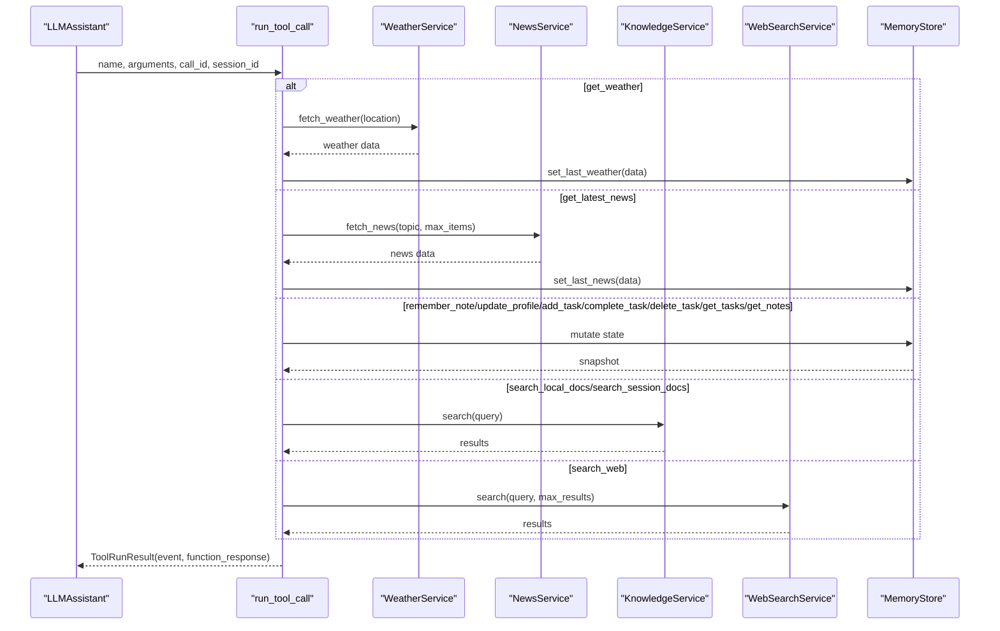
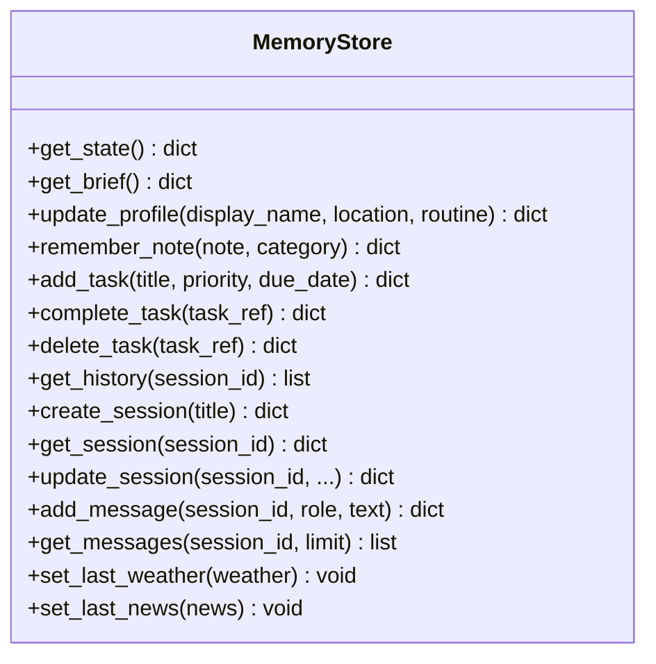
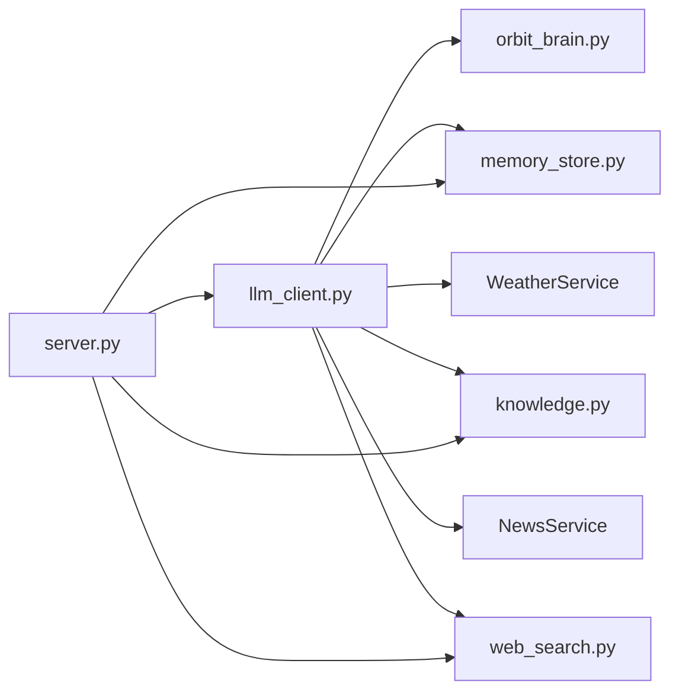

# Chat Processing Endpoints

<cite>
**Referenced Files in This Document**
- [server.py](file://backend/server.py)
- [llm_client.py](file://backend/api_clients/llm_client.py)
- [orbit_brain.py](file://backend/core/orbit_brain.py)
- [memory_store.py](file://backend/core/memory_store.py)
- [knowledge.py](file://backend/tools/knowledge.py)
- [web_search.py](file://backend/tools/web_search.py)
- [config.py](file://backend/config.py)
- [README.md](file://README.md)
</cite>

## Table of Contents
1. [Introduction](#introduction)
2. [Project Structure](#project-structure)
3. [Core Components](#core-components)
4. [Architecture Overview](#architecture-overview)
5. [Detailed Component Analysis](#detailed-component-analysis)
6. [Dependency Analysis](#dependency-analysis)
7. [Performance Considerations](#performance-considerations)
8. [Troubleshooting Guide](#troubleshooting-guide)
9. [Conclusion](#conclusion)

## Introduction
This document provides comprehensive documentation for the main chat processing API endpoint POST /api/chat. It explains the endpoint’s parameters, the chat orchestration workflow, tool calling integration, memory management, and the response structure. It also covers different chat modes, error handling for LLM client failures, and graceful fallbacks for unsupported features.

## Project Structure
The chat endpoint is implemented in the backend HTTP server and orchestrates interactions with the LLM client, memory store, tools (weather, news, web search, knowledge), and configuration.

**Diagram sources**
- [server.py:276-321](file://backend/server.py#L276-L321)
- [llm_client.py:38-78](file://backend/api_clients/llm_client.py#L38-L78)
- [orbit_brain.py:302-386](file://backend/core/orbit_brain.py#L302-L386)
- [memory_store.py:67-150](file://backend/core/memory_store.py#L67-L150)
- [knowledge.py:88-140](file://backend/tools/knowledge.py#L88-L140)
- [web_search.py:53-104](file://backend/tools/web_search.py#L53-L104)

**Section sources**
- [README.md:164-201](file://README.md#L164-L201)
- [server.py:23-63](file://backend/server.py#L23-L63)

## Core Components
- AssistantApplication: HTTP server that routes POST /api/chat to the chat handler and manages dependencies (LLM client, memory store, tools).
- LLMAssistant: Orchestrates chat with provider-specific logic (Google REST API, OpenRouter-compatible), tool loop execution, and response assembly.
- build_system_instruction and build_rest_tools: Construct the system prompt and function-declared tool list based on mode, search mode flags, and session context.
- run_tool_call: Executes tools and records events; updates memory store and caches.
- MemoryStore: MongoDB-backed persistence for sessions, messages, profile, tasks, notes, and cached weather/news.
- KnowledgeService: Local RAG and session-scoped document search.
- WebSearchService: Web search via Tavily (primary) and DuckDuckGo (fallback).

**Section sources**
- [server.py:23-63](file://backend/server.py#L23-L63)
- [llm_client.py:38-78](file://backend/api_clients/llm_client.py#L38-L78)
- [orbit_brain.py:302-386](file://backend/core/orbit_brain.py#L302-L386)
- [memory_store.py:67-150](file://backend/core/memory_store.py#L67-L150)
- [knowledge.py:88-140](file://backend/tools/knowledge.py#L88-L140)
- [web_search.py:53-104](file://backend/tools/web_search.py#L53-L104)

## Architecture Overview
The POST /api/chat endpoint performs the following:
- Validates and extracts parameters from the request body.
- Builds the system instruction and function-declared tool list based on mode and flags.
- Sends the request to the selected LLM provider.
- Executes tool calls returned by the model, updating memory and recording tool events.
- Returns a structured response containing the reply, tool events, memory state, and model information.

**Diagram sources**
- [server.py:276-321](file://backend/server.py#L276-L321)
- [llm_client.py:47-78](file://backend/api_clients/llm_client.py#L47-L78)
- [orbit_brain.py:302-386](file://backend/core/orbit_brain.py#L302-L386)
- [llm_client.py:82-216](file://backend/api_clients/llm_client.py#L82-L216)

## Detailed Component Analysis

### POST /api/chat Endpoint
- Path: /api/chat
- Method: POST
- Request body parameters:
  - message (string): Required. The user’s input text.
  - conversation (array of objects): Optional. Recent conversation snapshots with role/text.
  - screenImage (string): Optional. Base64-encoded image data for screen-aware assistance.
  - mode (string): Optional. "simple", "copilot", or "coach". Defaults to "simple".
  - coachTopic (string): Optional. Topic for expert coaching mode. Defaults to "General Learning".
  - coachLevel (string): Optional. Level for expert coaching mode. Defaults to "Beginner".
  - preferredLanguage (string): Optional. Language hint for replies. Defaults to "default".
  - webSearchOnly (boolean): Optional. Forces web search mode. Defaults to false.
  - offlineMode (boolean): Optional. Disables web search. Defaults to false.
  - sessionId (string): Optional. Preserves context across messages and enables session-scoped document search.
- Response fields:
  - reply (string): The assistant’s text response.
  - toolEvents (array): Events for each executed tool call (type, label).
  - memory (object): Current memory state snapshot (profile, tasks, last_weather, last_news, activity).
  - model (string): The active AI model identifier.

Behavior:
- Validates message presence; rejects empty message.
- Supports graceful fallback for unsupported features (e.g., imageGen flag).
- Calls LLMAssistant.chat with extracted parameters.
- On LLM client error, returns HTTP 502 with error message.
- On success, returns the structured response.

**Section sources**
- [server.py:276-321](file://backend/server.py#L276-L321)

### Chat Orchestration Workflow
- Parameter extraction and normalization:
  - Normalizes mode to "simple", "copilot", or "coach".
  - Applies language hints and time context.
  - Applies search-mode flags (webSearchOnly, offlineMode).
- Tool availability:
  - Enables/disables tools based on flags and session attachments.
- Provider routing:
  - Routes to Google REST API or OpenRouter-compatible endpoints depending on active provider.
- Tool loop:
  - Executes tool calls, updates memory, and continues until the model returns a final text response or loop limit is reached.

**Diagram sources**
- [server.py:276-321](file://backend/server.py#L276-L321)
- [llm_client.py:47-78](file://backend/api_clients/llm_client.py#L47-L78)
- [llm_client.py:82-216](file://backend/api_clients/llm_client.py#L82-L216)
- [llm_client.py:220-272](file://backend/api_clients/llm_client.py#L220-L272)

**Section sources**
- [llm_client.py:47-78](file://backend/api_clients/llm_client.py#L47-L78)
- [llm_client.py:82-216](file://backend/api_clients/llm_client.py#L82-L216)
- [llm_client.py:220-272](file://backend/api_clients/llm_client.py#L220-L272)

### Tool Calling Integration
- Tool declarations include weather, news, memory, tasks, notes, and search capabilities.
- run_tool_call executes tools, updates memory, and records events.
- Session-scoped document search is enabled when the session has attachments.

**Diagram sources**
- [orbit_brain.py:389-501](file://backend/core/orbit_brain.py#L389-L501)
- [knowledge.py:270-298](file://backend/tools/knowledge.py#L270-L298)
- [knowledge.py:337-355](file://backend/tools/knowledge.py#L337-L355)
- [web_search.py:69-104](file://backend/tools/web_search.py#L69-L104)

**Section sources**
- [orbit_brain.py:389-501](file://backend/core/orbit_brain.py#L389-L501)
- [knowledge.py:270-298](file://backend/tools/knowledge.py#L270-L298)
- [knowledge.py:337-355](file://backend/tools/knowledge.py#L337-L355)
- [web_search.py:69-104](file://backend/tools/web_search.py#L69-L104)

### Memory Management
- MemoryStore persists sessions, messages, profile, tasks, notes, and cached weather/news.
- get_state returns a snapshot used in the system prompt and response payload.
- Session-scoped attachments enable session document search.

**Diagram sources**
- [memory_store.py:67-276](file://backend/core/memory_store.py#L67-L276)

**Section sources**
- [memory_store.py:188-250](file://backend/core/memory_store.py#L188-L250)
- [memory_store.py:579-686](file://backend/core/memory_store.py#L579-L686)

### Response Structure
- reply: Final assistant text response.
- toolEvents: List of tool execution events (type, label).
- memory: Current memory state snapshot.
- model: Active model identifier.

**Section sources**
- [server.py:312-320](file://backend/server.py#L312-L320)

### Examples of Different Chat Modes
- Simple mode: Concise, direct answers; minimal memory usage.
- Copilot mode: Proactive planning, screen-aware suggestions, deeper memory.
- Coach mode: Expert tutoring with RAG-based quizzes and roadmaps; uses coachTopic and coachLevel.

**Section sources**
- [orbit_brain.py:35-56](file://backend/core/orbit_brain.py#L35-L56)
- [orbit_brain.py:316-328](file://backend/core/orbit_brain.py#L316-L328)

### Error Handling and Graceful Fallbacks
- Empty message: Returns HTTP 400 with error.
- LLM client failure: Returns HTTP 502 with error message.
- Unsupported features (e.g., imageGen): Returns a predefined refusal message and empty toolEvents.
- Web search fallback: Tavily primary, DuckDuckGo fallback; graceful degradation on failure.

**Section sources**
- [server.py:276-321](file://backend/server.py#L276-L321)
- [llm_client.py:161-174](file://backend/api_clients/llm_client.py#L161-L174)
- [web_search.py:69-104](file://backend/tools/web_search.py#L69-L104)

## Dependency Analysis
- AssistantApplication depends on:
  - LLMAssistant for chat orchestration.
  - MemoryStore for persistence and state.
  - KnowledgeService for local RAG and session document search.
  - WebSearchService for web search.
  - WeatherService and NewsService for tool execution.
- LLMAssistant depends on:
  - build_system_instruction and build_rest_tools from orbit_brain.
  - run_tool_call for tool execution.
  - MemoryStore, WeatherService, NewsService, KnowledgeService, WebSearchService.
- MemoryStore depends on MongoDB for persistence.

**Diagram sources**
- [server.py:23-63](file://backend/server.py#L23-L63)
- [llm_client.py:38-46](file://backend/api_clients/llm_client.py#L38-L46)
- [orbit_brain.py:14-21](file://backend/core/orbit_brain.py#L14-L21)
- [memory_store.py:67-117](file://backend/core/memory_store.py#L67-L117)
- [knowledge.py:88-108](file://backend/tools/knowledge.py#L88-L108)
- [web_search.py:53-63](file://backend/tools/web_search.py#L53-L63)

**Section sources**
- [server.py:23-63](file://backend/server.py#L23-L63)
- [llm_client.py:38-46](file://backend/api_clients/llm_client.py#L38-L46)

## Performance Considerations
- Conversation truncation: Recent conversation snapshots are limited to reduce context length.
- Tool loop limit: Prevents excessive iterations and ensures timely responses.
- Search mode tuning: webSearchOnly and offlineMode adjust tool availability to balance latency and accuracy.
- Local RAG: Session-scoped document search avoids global retriever overhead when not needed.

[No sources needed since this section provides general guidance]

## Troubleshooting Guide
Common issues and resolutions:
- Missing API key: Ensure ACTIVE_PROVIDER and corresponding API key are configured.
- Provider unreachable: Verify network connectivity and endpoint URLs.
- Tool execution errors: Check tool availability (e.g., web search disabled in offline mode).
- Empty message: Provide a non-empty message in the request body.
- Unsupported feature: imageGen is intentionally refused; use supported features.

**Section sources**
- [config.py:55-76](file://backend/config.py#L55-L76)
- [llm_client.py:60-61](file://backend/api_clients/llm_client.py#L60-L61)
- [llm_client.py:161-174](file://backend/api_clients/llm_client.py#L161-L174)
- [server.py:282-291](file://backend/server.py#L282-L291)

## Conclusion
POST /api/chat integrates a robust chat orchestration pipeline with provider-agnostic LLM communication, tool calling, and persistent memory. It supports multiple modes, search modes, and graceful fallbacks, delivering a reliable and extensible chat experience.