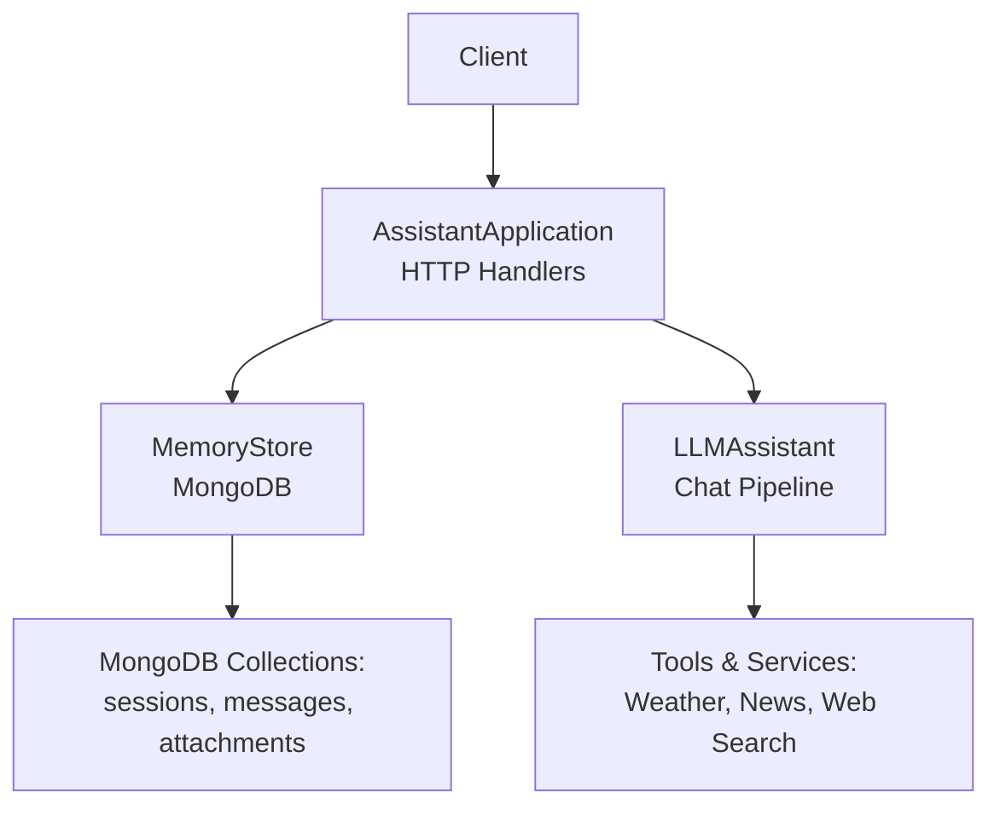
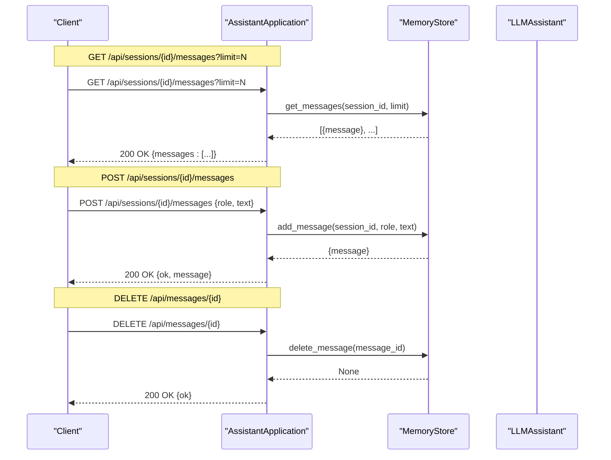
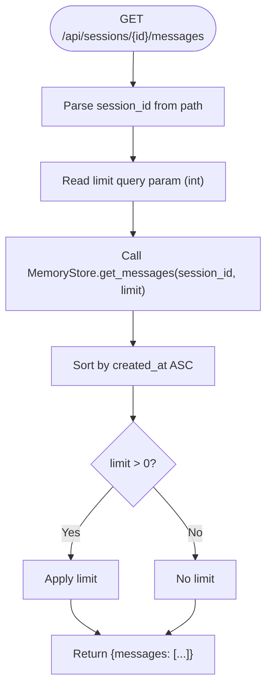
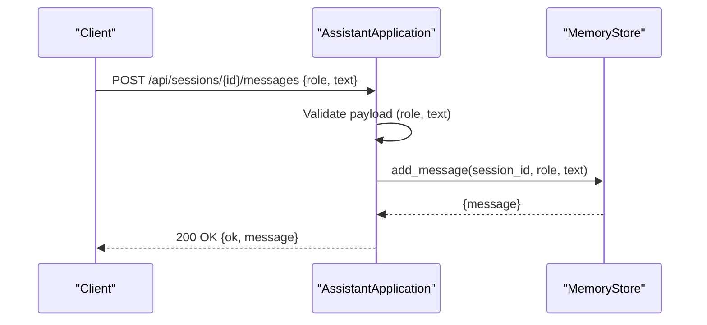
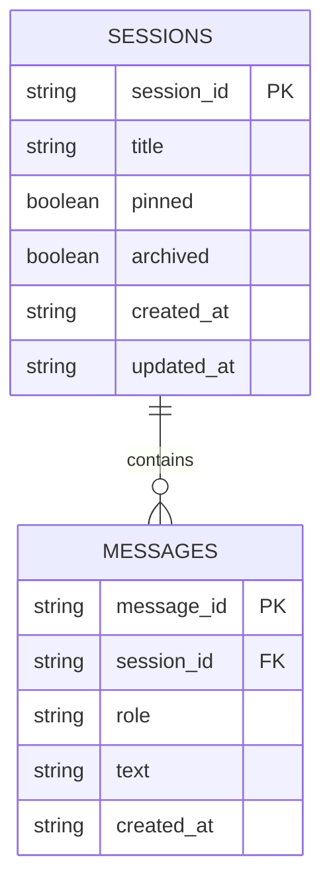
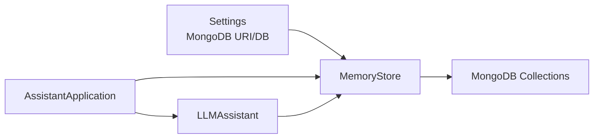

# Message Management Endpoints

<cite>
**Referenced Files in This Document**
- [server.py](file://backend/server.py)
- [memory_store.py](file://backend/core/memory_store.py)
- [config.py](file://backend/config.py)
- [llm_client.py](file://backend/api_clients/llm_client.py)
- [orbit_brain.py](file://backend/core/orbit_brain.py)
- [run.py](file://run.py)
</cite>

## Table of Contents
1. [Introduction](#introduction)
2. [Project Structure](#project-structure)
3. [Core Components](#core-components)
4. [Architecture Overview](#architecture-overview)
5. [Detailed Component Analysis](#detailed-component-analysis)
6. [Dependency Analysis](#dependency-analysis)
7. [Performance Considerations](#performance-considerations)
8. [Troubleshooting Guide](#troubleshooting-guide)
9. [Conclusion](#conclusion)

## Introduction
This document describes the message management API endpoints that power the assistant’s conversation history. It focuses on:
- Retrieving session messages with optional limit parameter
- Adding new messages with role and text parameters
- Deleting messages by ID

It explains the message structure, validation rules, pagination handling, and how messages integrate with session context and memory persistence. It also includes examples of CRUD operations, error scenarios, and how messages relate to conversation history and memory.

## Project Structure
The message management functionality spans several modules:
- HTTP server routing and handlers
- Memory store abstraction backed by MongoDB
- Configuration and runtime settings
- LLM integration that consumes conversation snapshots

**Diagram sources**
- [server.py:85-167](file://backend/server.py#L85-L167)
- [memory_store.py:67-117](file://backend/core/memory_store.py#L67-L117)
- [llm_client.py:38-78](file://backend/api_clients/llm_client.py#L38-L78)

**Section sources**
- [server.py:85-167](file://backend/server.py#L85-L167)
- [memory_store.py:67-117](file://backend/core/memory_store.py#L67-L117)
- [config.py:20-76](file://backend/config.py#L20-L76)

## Core Components
- HTTP server routes and handlers for message endpoints
- Memory store with message CRUD and pagination
- MongoDB schema for messages and sessions
- LLM assistant that uses conversation snapshots and session context

Key responsibilities:
- GET /api/sessions/{id}/messages: retrieve messages for a session with optional limit
- POST /api/sessions/{id}/messages: add a new message with role and text
- DELETE /api/messages/{id}: delete a message by ID
- Integration with session context and memory persistence

**Section sources**
- [server.py:128-135](file://backend/server.py#L128-L135)
- [server.py:189-202](file://backend/server.py#L189-L202)
- [server.py:468-474](file://backend/server.py#L468-L474)
- [memory_store.py:652-690](file://backend/core/memory_store.py#L652-L690)

## Architecture Overview
The message management flow connects HTTP handlers to the memory store and integrates with the LLM chat pipeline.

**Diagram sources**
- [server.py:128-135](file://backend/server.py#L128-L135)
- [server.py:189-202](file://backend/server.py#L189-L202)
- [server.py:468-474](file://backend/server.py#L468-L474)
- [memory_store.py:652-690](file://backend/core/memory_store.py#L652-L690)

## Detailed Component Analysis

### Message Structure and Validation
- Message document schema:
  - message_id: unique identifier
  - session_id: links to the session
  - role: "user" or "assistant"
  - text: message content
  - created_at: ISO timestamp
- Validation rules:
  - Text cannot be empty when adding a message
  - Role defaults to "user" when not provided in POST
  - Limit parameter is treated as integer; non-positive values disable limit

These rules ensure robust message creation and retrieval while preserving conversation integrity.

**Section sources**
- [memory_store.py:31-33](file://backend/core/memory_store.py#L31-L33)
- [memory_store.py:652-673](file://backend/core/memory_store.py#L652-L673)
- [server.py:189-202](file://backend/server.py#L189-L202)

### Endpoint: GET /api/sessions/{id}/messages
Purpose:
- Retrieve messages for a given session with optional limit.

Behavior:
- Parses session_id from path
- Reads optional limit query parameter
- Calls MemoryStore.get_messages(session_id, limit)
- Returns JSON with messages array

Pagination handling:
- If limit > 0, the result is limited to the most recent messages ordered by created_at ascending

Common responses:
- 200 OK with messages array
- 404 Not Found if session does not exist (handled upstream in session retrieval)

Example usage:
- GET /api/sessions/abc/messages?limit=50

**Diagram sources**
- [server.py:128-135](file://backend/server.py#L128-L135)
- [memory_store.py:675-685](file://backend/core/memory_store.py#L675-L685)

**Section sources**
- [server.py:128-135](file://backend/server.py#L128-L135)
- [memory_store.py:675-685](file://backend/core/memory_store.py#L675-L685)

### Endpoint: POST /api/sessions/{id}/messages
Purpose:
- Add a new message to a session.

Behavior:
- Parses session_id from path
- Reads JSON payload with role and text
- Validates text is not empty
- Calls MemoryStore.add_message(session_id, role, text)
- Updates session updated_at timestamp
- Returns JSON with ok flag and created message

Validation and error handling:
- 400 Bad Request if text is empty
- 200 OK on success

Example usage:
- POST /api/sessions/abc/messages with JSON body:
  - { "role": "user", "text": "Hello!" }

**Diagram sources**
- [server.py:189-202](file://backend/server.py#L189-L202)
- [memory_store.py:652-673](file://backend/core/memory_store.py#L652-L673)

**Section sources**
- [server.py:189-202](file://backend/server.py#L189-L202)
- [memory_store.py:652-673](file://backend/core/memory_store.py#L652-L673)

### Endpoint: DELETE /api/messages/{id}
Purpose:
- Delete a message by its message_id.

Behavior:
- Parses message_id from path
- Calls MemoryStore.delete_message(message_id)
- Returns 200 OK {ok}

Notes:
- Deletion does not cascade to session or attachments; it removes only the message document
- If the message does not exist, the operation silently succeeds (no error)

Example usage:
- DELETE /api/messages/xyz

**Section sources**
- [server.py:468-474](file://backend/server.py#L468-L474)
- [memory_store.py:687-689](file://backend/core/memory_store.py#L687-L689)

### Integration with Conversation History and Memory Persistence
- Messages are stored in MongoDB under the messages collection with a compound index on session_id and created_at for efficient retrieval.
- Sessions are tracked separately; adding a message updates the session’s updated_at timestamp.
- The LLM assistant builds conversation snapshots from recent messages for context, enabling coherent responses while maintaining separation between persistent storage and runtime context.

**Diagram sources**
- [memory_store.py:27-33](file://backend/core/memory_store.py#L27-L33)
- [memory_store.py:119-123](file://backend/core/memory_store.py#L119-L123)

**Section sources**
- [memory_store.py:119-123](file://backend/core/memory_store.py#L119-L123)
- [memory_store.py:652-673](file://backend/core/memory_store.py#L652-L673)
- [llm_client.py:47-78](file://backend/api_clients/llm_client.py#L47-L78)
- [orbit_brain.py:283-299](file://backend/core/orbit_brain.py#L283-L299)

## Dependency Analysis
- HTTP server depends on MemoryStore for all message operations
- MemoryStore depends on MongoDB collections for persistence
- LLM assistant consumes conversation snapshots built from messages for context
- Configuration provides MongoDB connection settings

**Diagram sources**
- [config.py:35-36](file://backend/config.py#L35-L36)
- [memory_store.py:79-100](file://backend/core/memory_store.py#L79-L100)
- [server.py:24-48](file://backend/server.py#L24-L48)
- [llm_client.py:38-46](file://backend/api_clients/llm_client.py#L38-L46)

**Section sources**
- [config.py:35-36](file://backend/config.py#L35-L36)
- [memory_store.py:79-100](file://backend/core/memory_store.py#L79-L100)
- [server.py:24-48](file://backend/server.py#L24-L48)
- [llm_client.py:38-46](file://backend/api_clients/llm_client.py#L38-L46)

## Performance Considerations
- Indexing: Messages are indexed by session_id and created_at, enabling efficient retrieval and pagination.
- Sorting: Retrieval sorts by created_at ascending, which is optimal for chronological display.
- Limiting: Applying a positive limit reduces result size and improves response latency.
- Concurrency: MemoryStore uses a thread lock around write operations to prevent race conditions.

[No sources needed since this section provides general guidance]

## Troubleshooting Guide
Common issues and resolutions:
- Empty text on POST /api/sessions/{id}/messages
  - Symptom: 400 Bad Request with error message
  - Cause: Missing or empty text in payload
  - Resolution: Ensure payload includes a non-empty text field
  - Section sources
    - [memory_store.py:655-656](file://backend/core/memory_store.py#L655-L656)
    - [server.py:198-200](file://backend/server.py#L198-L200)

- Non-existent session ID
  - Symptom: 404 Not Found during session retrieval (upstream)
  - Cause: session_id not found
  - Resolution: Verify session exists before querying messages
  - Section sources
    - [server.py:120-126](file://backend/server.py#L120-L126)

- Non-existent message ID on DELETE /api/messages/{id}
  - Symptom: 200 OK without error
  - Cause: delete_message is idempotent
  - Resolution: Idempotent behavior is expected; no action taken if message not found
  - Section sources
    - [server.py:470-474](file://backend/server.py#L470-L474)
    - [memory_store.py:687-689](file://backend/core/memory_store.py#L687-L689)

- Large limit causing slow responses
  - Symptom: Slow GET /api/sessions/{id}/messages
  - Cause: Unbounded retrieval
  - Resolution: Use a reasonable limit or paginate client-side
  - Section sources
    - [server.py:132-134](file://backend/server.py#L132-L134)
    - [memory_store.py:679-684](file://backend/core/memory_store.py#L679-L684)

## Conclusion
The message management endpoints provide a robust foundation for conversation history:
- Clear message structure with validation ensures data integrity
- Pagination via limit enables scalable retrieval
- Tight integration with sessions and memory persistence supports coherent AI interactions
- Idempotent deletion simplifies client-side error handling

These components work together to support reliable message CRUD operations and seamless integration with the broader assistant ecosystem.