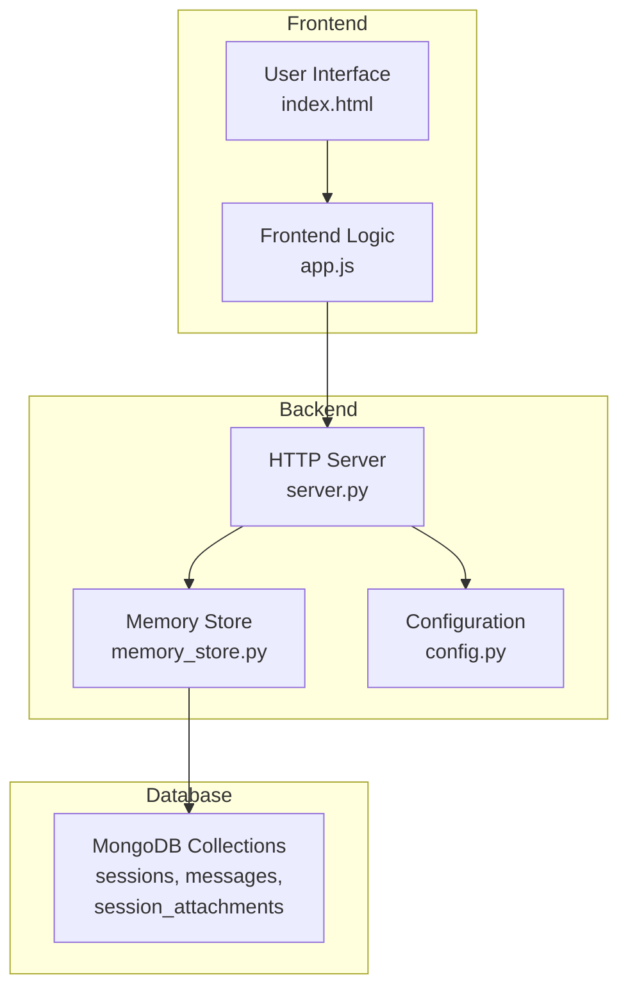
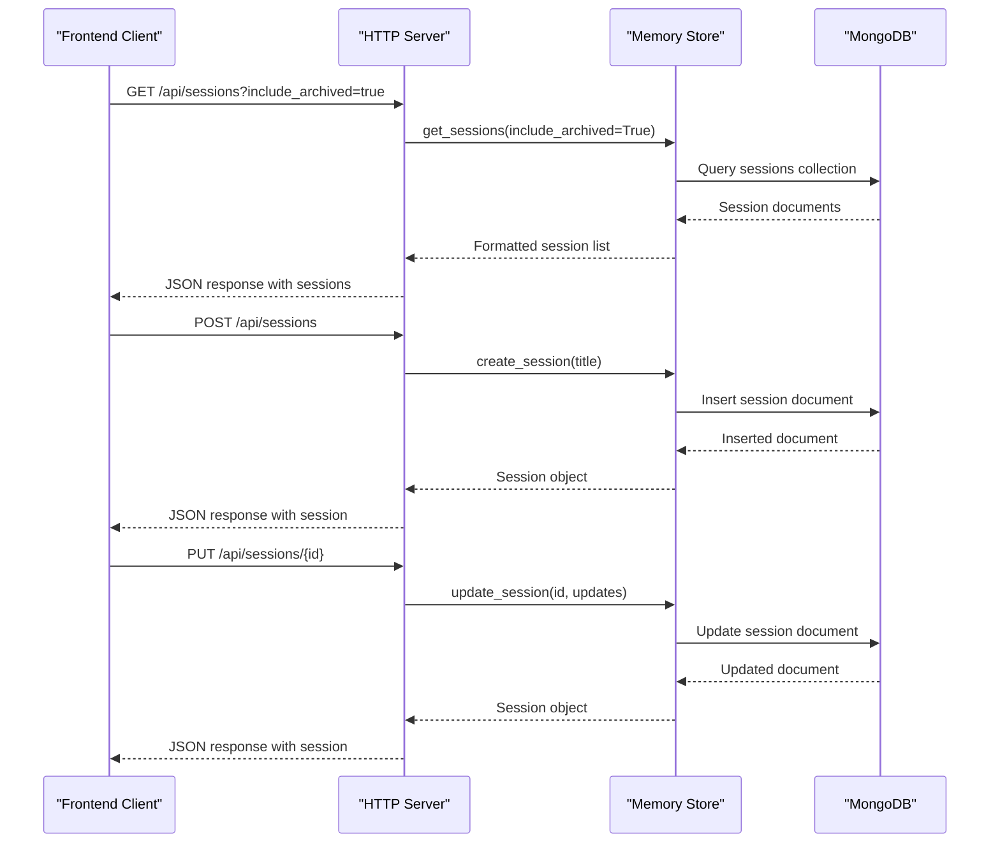
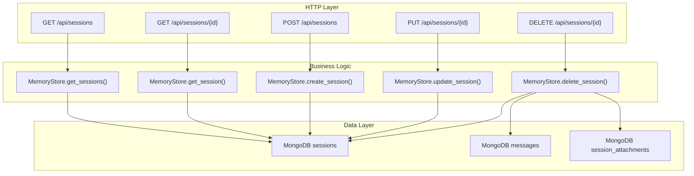

# Session Management Endpoints

<cite>
**Referenced Files in This Document**
- [server.py](file://backend/server.py)
- [memory_store.py](file://backend/core/memory_store.py)
- [config.py](file://backend/config.py)
- [app.js](file://frontend/scripts/app.js)
- [index.html](file://frontend/index.html)
</cite>

## Table of Contents
1. [Introduction](#introduction)
2. [Project Structure](#project-structure)
3. [Core Components](#core-components)
4. [Architecture Overview](#architecture-overview)
5. [Detailed Component Analysis](#detailed-component-analysis)
6. [Dependency Analysis](#dependency-analysis)
7. [Performance Considerations](#performance-considerations)
8. [Troubleshooting Guide](#troubleshooting-guide)
9. [Conclusion](#conclusion)

## Introduction
This document provides comprehensive documentation for the session management API endpoints that power the multi-session chat interface. The system supports creating, reading, updating, and deleting chat sessions while maintaining conversation history, managing pinned/archived states, and handling associated file attachments. The backend is built with a custom HTTP server that routes requests to a MongoDB-backed memory store, while the frontend integrates seamlessly with these endpoints to provide a responsive chat experience.

## Project Structure
The session management functionality spans three primary areas:
- Backend HTTP server handling routing and request/response processing
- Memory store abstraction managing MongoDB collections for sessions, messages, and attachments
- Frontend integration enabling user interactions with sessions and state synchronization



**Diagram sources**
- [server.py:67-83](file://backend/server.py#L67-L83)
- [memory_store.py:79-117](file://backend/core/memory_store.py#L79-L117)
- [config.py:20-76](file://backend/config.py#L20-L76)

**Section sources**
- [server.py:67-83](file://backend/server.py#L67-L83)
- [memory_store.py:79-117](file://backend/core/memory_store.py#L79-L117)
- [config.py:20-76](file://backend/config.py#L20-L76)

## Core Components
The session management system consists of four core components:

### HTTP Server Handlers
The server implements dedicated handlers for each HTTP verb:
- GET: Retrieve all sessions or individual session details
- POST: Create new sessions
- PUT: Update session properties (title, pinned, archived)
- DELETE: Remove sessions and associated resources

### Memory Store Operations
The memory store provides a unified interface to MongoDB collections:
- Sessions collection: stores session metadata and state
- Messages collection: maintains conversation history
- Attachments collection: manages file attachments per session

### Frontend Integration
The frontend maintains application state and synchronizes with backend endpoints:
- Session list rendering with pinned/archived categorization
- Real-time state updates for session actions
- Automatic refresh mechanisms for session lists

**Section sources**
- [server.py:85-167](file://backend/server.py#L85-L167)
- [memory_store.py:579-646](file://backend/core/memory_store.py#L579-L646)
- [app.js:315-348](file://frontend/scripts/app.js#L315-L348)

## Architecture Overview
The session management architecture follows a clean separation of concerns:



**Diagram sources**
- [server.py:110-126](file://backend/server.py#L110-L126)
- [server.py:183-186](file://backend/server.py#L183-L186)
- [server.py:404-420](file://backend/server.py#L404-L420)

**Section sources**
- [server.py:110-126](file://backend/server.py#L110-L126)
- [server.py:183-186](file://backend/server.py#L183-L186)
- [server.py:404-420](file://backend/server.py#L404-L420)

## Detailed Component Analysis

### GET /api/sessions
Retrieves all sessions with optional filtering for archived sessions.

#### Request
- Method: GET
- Path: `/api/sessions`
- Query Parameters:
  - `include_archived` (optional): Boolean flag to include archived sessions

#### Response
- Success: 200 OK with JSON body containing:
  ```json
  {
    "sessions": [
      {
        "session_id": "string",
        "title": "string",
        "created_at": "ISO8601 timestamp",
        "updated_at": "ISO8601 timestamp",
        "pinned": true|false,
        "archived": true|false
      }
    ]
  }
  ```

#### Implementation Details
The endpoint filters sessions based on the `include_archived` parameter and sorts by pinned status and last updated time.

**Section sources**
- [server.py:110-116](file://backend/server.py#L110-L116)
- [memory_store.py:598-606](file://backend/core/memory_store.py#L598-L606)

### GET /api/sessions/{id}
Retrieves a specific session by ID.

#### Request
- Method: GET
- Path: `/api/sessions/{id}`

#### Response
- Success: 200 OK with JSON body containing:
  ```json
  {
    "session": {
      "session_id": "string",
      "title": "string",
      "created_at": "ISO8601 timestamp",
      "updated_at": "ISO8601 timestamp",
      "pinned": true|false,
      "archived": true|false
    }
  }
  ```
- Not Found: 404 Not Found with error message

**Section sources**
- [server.py:118-126](file://backend/server.py#L118-L126)
- [memory_store.py:608-613](file://backend/core/memory_store.py#L608-L613)

### POST /api/sessions
Creates a new session with the specified title.

#### Request
- Method: POST
- Path: `/api/sessions`
- Body: JSON object containing:
  ```json
  {
    "title": "string"
  }
  ```

#### Response
- Success: 200 OK with JSON body containing:
  ```json
  {
    "ok": true,
    "session": {
      "session_id": "string",
      "title": "string",
      "created_at": "ISO8601 timestamp",
      "updated_at": "ISO8601 timestamp",
      "pinned": false,
      "archived": false
    }
  }
  ```

#### Validation Rules
- Title is optional; defaults to "New Chat" if not provided
- Title is trimmed of whitespace

**Section sources**
- [server.py:183-186](file://backend/server.py#L183-L186)
- [memory_store.py:579-596](file://backend/core/memory_store.py#L579-L596)

### PUT /api/sessions/{id}
Updates session properties including title, pinned status, and archived status.

#### Request
- Method: PUT
- Path: `/api/sessions/{id}`
- Body: JSON object containing one or more of:
  ```json
  {
    "title": "string",
    "pinned": true|false,
    "archived": true|false
  }
  ```

#### Response
- Success: 200 OK with JSON body containing:
  ```json
  {
    "ok": true,
    "session": {
      "session_id": "string",
      "title": "string",
      "created_at": "ISO8601 timestamp",
      "updated_at": "ISO8601 timestamp",
      "pinned": true|false,
      "archived": true|false
    }
  }
  ```
- Bad Request: 400 Bad Request with error message

#### Validation Rules
- At least one valid field must be provided (title, pinned, or archived)
- Session ID must exist in database
- Updates automatically set the `updated_at` timestamp

**Section sources**
- [server.py:404-420](file://backend/server.py#L404-L420)
- [memory_store.py:615-630](file://backend/core/memory_store.py#L615-L630)

### DELETE /api/sessions/{id}
Deletes a session and cleans up associated resources.

#### Request
- Method: DELETE
- Path: `/api/sessions/{id}`

#### Response
- Success: 200 OK with JSON body:
  ```json
  {
    "ok": true
  }
  ```

#### Cleanup Process
The deletion operation performs cascading cleanup:
1. Removes all messages associated with the session
2. Deletes all file attachments linked to the session
3. Removes parsed chunks from the knowledge base
4. Cleans up physical files from disk storage

**Section sources**
- [server.py:431-446](file://backend/server.py#L431-L446)
- [memory_store.py:632-646](file://backend/core/memory_store.py#L632-L646)

## Dependency Analysis
The session management system exhibits clear dependency relationships:



**Diagram sources**
- [server.py:110-126](file://backend/server.py#L110-L126)
- [server.py:183-186](file://backend/server.py#L183-L186)
- [server.py:404-420](file://backend/server.py#L404-L420)
- [server.py:431-446](file://backend/server.py#L431-L446)

**Section sources**
- [server.py:110-126](file://backend/server.py#L110-L126)
- [server.py:183-186](file://backend/server.py#L183-L186)
- [server.py:404-420](file://backend/server.py#L404-L420)
- [server.py:431-446](file://backend/server.py#L431-L446)

## Performance Considerations
The session management system incorporates several performance optimizations:

### Database Indexing Strategy
- Sessions collection: Unique index on `session_id` and compound index on `(pinned, updated_at)`
- Messages collection: Compound index on `(session_id, created_at)` for efficient pagination
- Attachments collection: Unique index on `attachment_id` and index on `session_id`

### Query Optimization
- Session retrieval uses sorting by pinned status and last updated time for optimal UI rendering
- Message retrieval supports pagination via limit parameter
- Cascading deletes minimize database round trips through bulk operations

### Memory Management
- Thread-safe operations using locks around database transactions
- Efficient JSON serialization/deserialization for API responses
- Connection pooling for MongoDB client instances

**Section sources**
- [memory_store.py:119-134](file://backend/core/memory_store.py#L119-L134)
- [memory_store.py:598-606](file://backend/core/memory_store.py#L598-L606)

## Troubleshooting Guide

### Common Error Scenarios

#### Session Not Found
- **Symptom**: 404 Not Found response when accessing non-existent session
- **Cause**: Session ID does not exist in database
- **Resolution**: Verify session ID validity or recreate the session

#### Invalid Update Fields
- **Symptom**: 400 Bad Request with validation error
- **Cause**: No valid fields provided for update operation
- **Resolution**: Include at least one of: title, pinned, archived

#### Database Connection Issues
- **Symptom**: Runtime errors during initialization
- **Cause**: MongoDB server unavailable or incorrect connection parameters
- **Resolution**: Check MongoDB URI and server status

### Frontend Integration Issues

#### Session List Not Refreshing
- **Symptom**: Changes not reflected in session list
- **Cause**: Missing refresh call after CRUD operations
- **Resolution**: Call `refreshSessions()` after successful operations

#### State Synchronization Problems
- **Symptom**: UI inconsistencies with backend state
- **Cause**: Asynchronous operations not properly awaited
- **Resolution**: Ensure proper Promise handling in frontend operations

**Section sources**
- [server.py:122-126](file://backend/server.py#L122-L126)
- [server.py:416-418](file://backend/server.py#L416-L418)
- [memory_store.py:618-619](file://backend/core/memory_store.py#L618-L619)

## Conclusion
The session management API provides a robust foundation for multi-session chat applications with comprehensive CRUD operations, proper resource cleanup, and seamless frontend integration. The system's design emphasizes scalability through database indexing, thread safety through locking mechanisms, and maintainability through clear separation of concerns. The frontend integration demonstrates best practices for state management and real-time synchronization, making it suitable for production deployment in interactive chat applications.