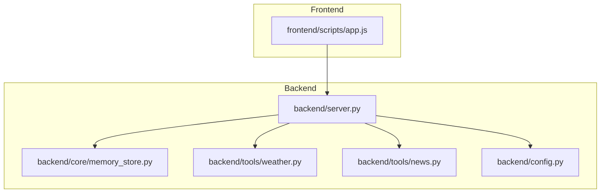
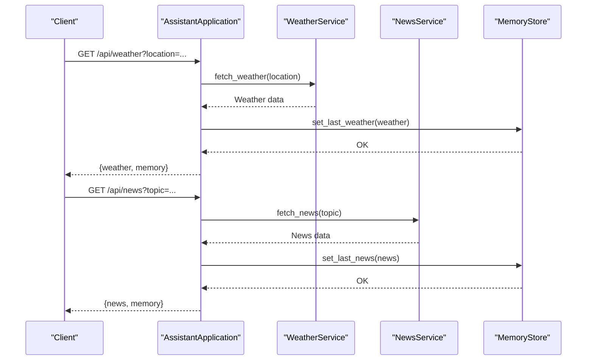
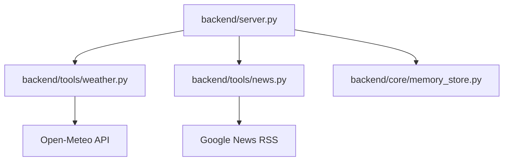

# Utility Service Endpoints

<cite>
**Referenced Files in This Document**
- [backend/server.py](file://backend/server.py)
- [backend/tools/weather.py](file://backend/tools/weather.py)
- [backend/tools/news.py](file://backend/tools/news.py)
- [backend/core/memory_store.py](file://backend/core/memory_store.py)
- [backend/config.py](file://backend/config.py)
- [frontend/scripts/app.js](file://frontend/scripts/app.js)
</cite>

## Table of Contents
1. [Introduction](#introduction)
2. [Project Structure](#project-structure)
3. [Core Components](#core-components)
4. [Architecture Overview](#architecture-overview)
5. [Detailed Component Analysis](#detailed-component-analysis)
6. [Dependency Analysis](#dependency-analysis)
7. [Performance Considerations](#performance-considerations)
8. [Troubleshooting Guide](#troubleshooting-guide)
9. [Conclusion](#conclusion)
10. [Appendices](#appendices)

## Introduction
This document provides comprehensive documentation for the utility service API endpoints that power weather, news, profile, task, and note management within the Orbit Virtual Assistant. It covers endpoint specifications, request/response schemas, validation rules, error handling, and integration with external services. The documentation is designed to be accessible to both developers and non-technical users.

## Project Structure
The utility endpoints are implemented in the backend server module and integrate with specialized services for weather and news, while persisting state through a MongoDB-backed memory store. The frontend JavaScript client consumes these endpoints to provide a seamless user experience.

**Diagram sources**
- [backend/server.py:85-265](file://backend/server.py#L85-L265)
- [backend/core/memory_store.py:67-116](file://backend/core/memory_store.py#L67-L116)
- [backend/tools/weather.py:47-141](file://backend/tools/weather.py#L47-L141)
- [backend/tools/news.py:21-83](file://backend/tools/news.py#L21-L83)
- [backend/config.py:20-76](file://backend/config.py#L20-L76)

**Section sources**
- [backend/server.py:85-265](file://backend/server.py#L85-L265)
- [backend/core/memory_store.py:67-116](file://backend/core/memory_store.py#L67-L116)
- [backend/tools/weather.py:47-141](file://backend/tools/weather.py#L47-L141)
- [backend/tools/news.py:21-83](file://backend/tools/news.py#L21-L83)
- [backend/config.py:20-76](file://backend/config.py#L20-L76)

## Core Components
- AssistantApplication: Orchestrates HTTP handlers, integrates services, and manages state persistence.
- WeatherService: Fetches current weather and forecasts from Open-Meteo via geocoding and forecast APIs.
- NewsService: Retrieves RSS feeds from Google News and parses headlines.
- MemoryStore: MongoDB-backed persistence for profile, tasks, notes, and cached weather/news data.
- Settings: Centralized configuration for providers, ports, and defaults.

Key integration points:
- GET /api/weather delegates to WeatherService and persists results to cache.
- GET /api/news delegates to NewsService and persists results to cache.
- POST /api/profile updates user profile and returns a brief memory snapshot.
- POST /api/tasks creates tasks and returns task details with state snapshot.
- POST /api/tasks/complete marks tasks as done and returns updated state.
- POST /api/notes creates notes and returns note details with state snapshot.

**Section sources**
- [backend/server.py:61-62](file://backend/server.py#L61-L62)
- [backend/tools/weather.py:47-141](file://backend/tools/weather.py#L47-L141)
- [backend/tools/news.py:21-83](file://backend/tools/news.py#L21-L83)
- [backend/core/memory_store.py:282-303](file://backend/core/memory_store.py#L282-L303)
- [backend/core/memory_store.py:338-375](file://backend/core/memory_store.py#L338-L375)
- [backend/core/memory_store.py:377-415](file://backend/core/memory_store.py#L377-L415)
- [backend/core/memory_store.py:309-332](file://backend/core/memory_store.py#L309-L332)

## Architecture Overview
The utility endpoints follow a layered architecture:
- HTTP Layer: Routes requests to appropriate handlers.
- Service Layer: Implements business logic for weather, news, and memory operations.
- Persistence Layer: Uses MongoDB for durable storage and caching.
- External Services: Weather and news APIs accessed via HTTP requests.

**Diagram sources**
- [backend/server.py:145-164](file://backend/server.py#L145-L164)
- [backend/tools/weather.py:51-75](file://backend/tools/weather.py#L51-L75)
- [backend/tools/news.py:25-60](file://backend/tools/news.py#L25-L60)
- [backend/core/memory_store.py:475-495](file://backend/core/memory_store.py#L475-L495)

## Detailed Component Analysis

### GET /api/weather
Purpose: Retrieve current weather and forecast for a given location.

- Path: /api/weather
- Method: GET
- Query Parameters:
  - location (optional): Free-text location name or city/country. Defaults to server default location if omitted.
- Request Schema:
  - Query parameters:
    - location: string
- Response Schema:
  - Body:
    - weather: object containing weather details
      - location: string
      - latitude: number
      - longitude: number
      - condition: string
      - temperature_c: number
      - feels_like_c: number
      - humidity_pct: number
      - wind_kph: number
      - precipitation_mm: number
      - high_c: number
      - low_c: number
      - rain_chance_pct: number
      - advice: string
    - memory: object (brief memory snapshot)
- Validation Rules:
  - Location must not be empty when provided.
  - Weather service validates geocoding results and raises errors for invalid locations.
- Error Handling:
  - 400 Bad Request: Weather service errors (e.g., invalid location, service unavailable).
  - 404 Not Found: Route not found (handled generically).
- Integration:
  - Calls WeatherService.fetch_weather().
  - Persists result to cache via MemoryStore.set_last_weather().
  - Returns combined weather and memory snapshot.

Example usage:
- curl "http://127.0.0.1:8000/api/weather?location=London"
- curl "http://127.0.0.1:8000/api/weather"

State updates:
- Updates cache entry "last_weather".
- Appends activity record "weather_checked".

**Section sources**
- [backend/server.py:145-154](file://backend/server.py#L145-L154)
- [backend/tools/weather.py:51-75](file://backend/tools/weather.py#L51-L75)
- [backend/core/memory_store.py:475-484](file://backend/core/memory_store.py#L475-L484)

### GET /api/news
Purpose: Retrieve latest news headlines for a given topic.

- Path: /api/news
- Method: GET
- Query Parameters:
  - topic (optional): Topic string. Defaults to "top headlines" if omitted.
- Request Schema:
  - Query parameters:
    - topic: string
- Response Schema:
  - Body:
    - news: object containing news details
      - topic: string
      - items: array of objects
        - title: string
        - link: string
        - source: string
        - published_at: string
      - updated_at: string (ISO 8601 UTC)
    - memory: object (brief memory snapshot)
- Validation Rules:
  - Topic is normalized and clamped to a reasonable range.
  - At least one valid item is required; otherwise raises an error.
- Error Handling:
  - 400 Bad Request: News service errors (e.g., invalid topic, service unavailable).
  - 404 Not Found: Route not found (handled generically).
- Integration:
  - Calls NewsService.fetch_news().
  - Persists result to cache via MemoryStore.set_last_news().
  - Returns combined news and memory snapshot.

Example usage:
- curl "http://127.0.0.1:8000/api/news?topic=technology"
- curl "http://127.0.0.1:8000/api/news"

State updates:
- Updates cache entry "last_news".
- Appends activity record "news_checked".

**Section sources**
- [backend/server.py:155-164](file://backend/server.py#L155-L164)
- [backend/tools/news.py:25-60](file://backend/tools/news.py#L25-L60)
- [backend/core/memory_store.py:486-495](file://backend/core/memory_store.py#L486-L495)

### POST /api/profile
Purpose: Update user profile information (display_name, location, routine).

- Path: /api/profile
- Method: POST
- Request Body:
  - displayName: string
  - location: string
  - routine: string
- Response Schema:
  - Body:
    - ok: boolean
    - snapshot: object (brief memory snapshot)
    - memory: object (full memory snapshot)
- Validation Rules:
  - Input values are stripped of whitespace before persistence.
- Error Handling:
  - 400 Bad Request: Generic validation errors (handled by server).
  - 404 Not Found: Route not found (handled generically).
- Integration:
  - Calls MemoryStore.update_profile().
  - Returns brief snapshot and full memory snapshot.

Example usage:
- curl -X POST "http://127.0.0.1:8000/api/profile" -H "Content-Type: application/json" -d '{"displayName":"Alice","location":"Tokyo","routine":"Morning jog"}'

State updates:
- Updates profile document "user_profile".
- Appends activity record "profile_updated".

**Section sources**
- [backend/server.py:214-221](file://backend/server.py#L214-L221)
- [backend/core/memory_store.py:282-303](file://backend/core/memory_store.py#L282-L303)

### POST /api/tasks
Purpose: Create a new task with title, priority, and due_date.

- Path: /api/tasks
- Method: POST
- Request Body:
  - title: string
  - priority: string (default: "medium")
  - dueDate: string (optional)
- Response Schema:
  - Body:
    - ok: boolean
    - task: object
      - id: string
      - title: string
      - priority: string
      - due_date: string
      - status: string
      - created_at: string
      - completed_at: string
    - memory: object (full memory snapshot)
- Validation Rules:
  - Title must not be empty; otherwise raises an error.
  - Priority is normalized to lowercase; defaults to "medium".
  - Due date is optional and stored as-is.
- Error Handling:
  - 400 Bad Request: Validation errors (e.g., empty title).
  - 404 Not Found: Route not found (handled generically).
- Integration:
  - Calls MemoryStore.add_task().
  - Returns task details and memory snapshot.

Example usage:
- curl -X POST "http://127.0.0.1:8000/api/tasks" -H "Content-Type: application/json" -d '{"title":"Buy groceries","priority":"high","dueDate":"2025-04-05"}'

State updates:
- Inserts task document.
- Appends activity record "task_added".

**Section sources**
- [backend/server.py:222-233](file://backend/server.py#L222-L233)
- [backend/core/memory_store.py:338-375](file://backend/core/memory_store.py#L338-L375)

### POST /api/tasks/complete
Purpose: Mark a task as completed by exact ID or partial title match.

- Path: /api/tasks/complete
- Method: POST
- Request Body:
  - taskRef: string (task ID or substring of title)
- Response Schema:
  - Body:
    - ok: boolean
    - task: object
      - id: string
      - title: string
      - priority: string
      - due_date: string
      - status: string
      - created_at: string
      - completed_at: string
    - memory: object (full memory snapshot)
- Validation Rules:
  - taskRef must not be empty; otherwise raises an error.
  - First attempts exact match on task_id; falls back to substring match on title.
- Error Handling:
  - 400 Bad Request: Missing or invalid task reference.
  - 404 Not Found: Task not found.
  - 404 Not Found: Route not found (handled generically).
- Integration:
  - Calls MemoryStore.complete_task().
  - Returns completed task details and memory snapshot.

Example usage:
- curl -X POST "http://127.0.0.1:8000/api/tasks/complete" -H "Content-Type: application/json" -d '{"taskRef":"groceries"}'

State updates:
- Updates task status to "done" and sets completed_at.
- Appends activity record "task_completed".

**Section sources**
- [backend/server.py:234-241](file://backend/server.py#L234-L241)
- [backend/core/memory_store.py:377-415](file://backend/core/memory_store.py#L377-L415)

### POST /api/notes
Purpose: Create a new note with text and category.

- Path: /api/notes
- Method: POST
- Request Body:
  - text: string
  - category: string (default: "note")
- Response Schema:
  - Body:
    - ok: boolean
    - note: object
      - id: string
      - category: string
      - text: string
      - created_at: string
    - memory: object (full memory snapshot)
- Validation Rules:
  - text must not be empty; otherwise raises an error.
  - category is normalized to lowercase; defaults to "note".
- Error Handling:
  - 400 Bad Request: Validation errors (e.g., empty text).
  - 404 Not Found: Route not found (handled generically).
- Integration:
  - Calls MemoryStore.remember_note().
  - Returns note details and memory snapshot.

Example usage:
- curl -X POST "http://127.0.0.1:8000/api/notes" -H "Content-Type: application/json" -d '{"text":"Remember milk","category":"shopping"}'

State updates:
- Inserts note document.
- Appends activity record "note_saved".

**Section sources**
- [backend/server.py:243-253](file://backend/server.py#L243-L253)
- [backend/core/memory_store.py:309-332](file://backend/core/memory_store.py#L309-L332)

### Frontend Integration Examples
The frontend JavaScript client demonstrates practical usage of these endpoints:

- Weather refresh:
  - Reads location from profile input.
  - Calls GET /api/weather with optional location query.
  - Updates UI with weather card and memory snapshot.

- News refresh:
  - Builds topic from location or defaults to "top headlines".
  - Calls GET /api/news with topic query.
  - Updates UI with news list and memory snapshot.

- Profile update:
  - Gathers displayName, location, routine from inputs.
  - Calls POST /api/profile with JSON payload.
  - Refreshes memory views and displays success message.

- Task management:
  - Creates tasks via POST /api/tasks.
  - Completes tasks via POST /api/tasks/complete.
  - Renders open tasks and updates UI accordingly.

- Note management:
  - Creates notes via POST /api/notes.
  - Deletes notes via DELETE /api/notes/:id.
  - Renders recent notes and updates UI accordingly.

**Section sources**
- [frontend/scripts/app.js:1403-1432](file://frontend/scripts/app.js#L1403-L1432)
- [frontend/scripts/app.js:1380-1401](file://frontend/scripts/app.js#L1380-L1401)
- [frontend/scripts/app.js:1434-1472](file://frontend/scripts/app.js#L1434-L1472)
- [frontend/scripts/app.js:1490-1514](file://frontend/scripts/app.js#L1490-L1514)

## Dependency Analysis
External service dependencies:
- WeatherService depends on Open-Meteo geocoding and forecast APIs.
- NewsService depends on Google News RSS feeds.
- MemoryStore depends on MongoDB for persistence.

**Diagram sources**
- [backend/server.py:61-62](file://backend/server.py#L61-L62)
- [backend/tools/weather.py:77-112](file://backend/tools/weather.py#L77-L112)
- [backend/tools/news.py:62-82](file://backend/tools/news.py#L62-L82)

**Section sources**
- [backend/server.py:61-62](file://backend/server.py#L61-L62)
- [backend/tools/weather.py:77-112](file://backend/tools/weather.py#L77-L112)
- [backend/tools/news.py:62-82](file://backend/tools/news.py#L62-L82)

## Performance Considerations
- External API timeouts: Weather and news services enforce timeouts to prevent blocking.
- Caching: Weather and news results are cached in MongoDB to reduce repeated external calls.
- Validation early exit: Requests are validated before invoking external services to minimize unnecessary network calls.
- Memory efficiency: MongoDB indexes optimize frequent queries for sessions, messages, tasks, and notes.

## Troubleshooting Guide
Common issues and resolutions:
- Weather service unavailable:
  - Symptoms: 400 Bad Request with service error details.
  - Causes: Invalid location, network issues, or API downtime.
  - Resolution: Verify location spelling, check network connectivity, retry later.

- News service unavailable:
  - Symptoms: 400 Bad Request with service error details.
  - Causes: Invalid topic, network issues, or RSS parsing failures.
  - Resolution: Use supported topics, check network connectivity, retry later.

- Task completion errors:
  - Symptoms: 400 Bad Request for missing or invalid task reference.
  - Causes: Empty taskRef or non-existent task.
  - Resolution: Provide exact task ID or a unique substring of the title.

- Note creation errors:
  - Symptoms: 400 Bad Request for empty text.
  - Causes: Missing or empty note text.
  - Resolution: Ensure non-empty note text before posting.

- MongoDB connection errors:
  - Symptoms: Runtime errors indicating inability to connect to MongoDB.
  - Causes: MongoDB server not running or incorrect URI.
  - Resolution: Start MongoDB server or adjust MONGODB_URI in environment.

**Section sources**
- [backend/tools/weather.py:122-126](file://backend/tools/weather.py#L122-L126)
- [backend/tools/news.py:77-82](file://backend/tools/news.py#L77-L82)
- [backend/core/memory_store.py:377-396](file://backend/core/memory_store.py#L377-L396)
- [backend/core/memory_store.py:309-312](file://backend/core/memory_store.py#L309-L312)
- [backend/core/memory_store.py:86-98](file://backend/core/memory_store.py#L86-L98)

## Conclusion
The utility service endpoints provide a robust foundation for weather and news retrieval, along with profile, task, and note management. They integrate seamlessly with external services while maintaining strong validation, error handling, and persistent state through MongoDB. The frontend client demonstrates practical usage patterns for these endpoints, enabling users to manage their daily information and tasks efficiently.

## Appendices

### Endpoint Summary
- GET /api/weather
  - Purpose: Retrieve weather for a location.
  - Query: location (optional).
  - Response: {weather, memory}.

- GET /api/news
  - Purpose: Retrieve news for a topic.
  - Query: topic (optional).
  - Response: {news, memory}.

- POST /api/profile
  - Purpose: Update user profile.
  - Body: {displayName, location, routine}.
  - Response: {ok, snapshot, memory}.

- POST /api/tasks
  - Purpose: Create a task.
  - Body: {title, priority, dueDate}.
  - Response: {ok, task, memory}.

- POST /api/tasks/complete
  - Purpose: Complete a task.
  - Body: {taskRef}.
  - Response: {ok, task, memory}.

- POST /api/notes
  - Purpose: Create a note.
  - Body: {text, category}.
  - Response: {ok, note, memory}.

### Data Model Notes
- Weather data includes location coordinates, current conditions, and forecast metrics.
- News data includes topic, items with title/link/source/published_at, and updated timestamp.
- Profile, tasks, and notes are persisted in MongoDB collections with appropriate indexes.
- Cache entries "last_weather" and "last_news" store recent results for quick retrieval.

**Section sources**
- [backend/tools/weather.py:61-75](file://backend/tools/weather.py#L61-L75)
- [backend/tools/news.py:56-60](file://backend/tools/news.py#L56-L60)
- [backend/core/memory_store.py:35-49](file://backend/core/memory_store.py#L35-L49)