# Backend Architecture

<cite>
**Referenced Files in This Document**
- [server.py](file://backend/server.py)
- [config.py](file://backend/config.py)
- [memory_store.py](file://backend/core/memory_store.py)
- [orbit_brain.py](file://backend/core/orbit_brain.py)
- [llm_client.py](file://backend/api_clients/llm_client.py)
- [gemini_client.py](file://backend/api_clients/gemini_client.py)
- [knowledge.py](file://backend/tools/knowledge.py)
- [web_search.py](file://backend/tools/web_search.py)
- [weather.py](file://backend/tools/weather.py)
- [news.py](file://backend/tools/news.py)
- [asr_whisper.py](file://backend/audio/asr_whisper.py)
- [run.py](file://run.py)
</cite>

## Update Summary
**Changes Made**
- Enhanced memory-aware system instructions with conditional memory state inclusion
- Added use_memory parameter propagation throughout the entire system
- Implemented conditional tool execution based on memory consent
- Added memory-disabled tool filtering mechanism
- Updated memory state tracking with selective inclusion

## Table of Contents
1. [Introduction](#introduction)
2. [Project Structure](#project-structure)
3. [Core Components](#core-components)
4. [Architecture Overview](#architecture-overview)
5. [Detailed Component Analysis](#detailed-component-analysis)
6. [Memory-Aware System Design](#memory-aware-system-design)
7. [Conditional Tool Execution](#conditional-tool-execution)
8. [Dependency Analysis](#dependency-analysis)
9. [Performance Considerations](#performance-considerations)
10. [Troubleshooting Guide](#troubleshooting-guide)
11. [Conclusion](#conclusion)

## Introduction
This document describes the backend architecture of the AI Assistant system with enhanced memory-aware capabilities. The system now features memory-consent-based system instructions, conditional tool execution, and selective memory state inclusion. It focuses on the Python threading HTTP server built with BaseHTTPRequestHandler and ThreadingHTTPServer, the layered orchestration via AssistantApplication, and the integration of LLM clients, memory persistence, knowledge services, and tool services with advanced memory management.

## Project Structure
The backend is organized into cohesive layers with enhanced memory management:
- HTTP server and orchestration: server.py
- Configuration: config.py
- Core services: core/orbit_brain.py, core/memory_store.py
- LLM client abstraction: api_clients/llm_client.py, api_clients/gemini_client.py
- Tools: tools/knowledge.py, tools/web_search.py, tools/weather.py, tools/news.py
- Audio: audio/asr_whisper.py
- Entry point: run.py

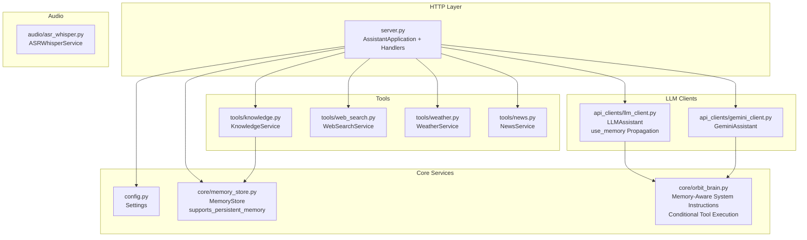

**Diagram sources**
- [server.py:23-611](file://backend/server.py#L23-L611)
- [config.py:20-76](file://backend/config.py#L20-L76)
- [memory_store.py:67-150](file://backend/core/memory_store.py#L67-L150)
- [orbit_brain.py:271-502](file://backend/core/orbit_brain.py#L271-L502)
- [llm_client.py:38-366](file://backend/api_clients/llm_client.py#L38-L366)
- [gemini_client.py:36-207](file://backend/api_clients/gemini_client.py#L36-L207)
- [knowledge.py:88-393](file://backend/tools/knowledge.py#L88-L393)
- [web_search.py:53-139](file://backend/tools/web_search.py#L53-L139)
- [weather.py:47-141](file://backend/tools/weather.py#L47-L141)
- [news.py:21-83](file://backend/tools/news.py#L21-L83)
- [asr_whisper.py:10-19](file://backend/audio/asr_whisper.py#L10-L19)

**Section sources**
- [server.py:1-611](file://backend/server.py#L1-L611)
- [config.py:1-76](file://backend/config.py#L1-L76)

## Core Components
- AssistantApplication: Orchestrates HTTP handlers, initializes services, and coordinates between memory store, knowledge, tools, and LLM clients with memory-aware parameter propagation.
- MemoryStore: Repository pattern implementation backed by MongoDB with supports_persistent_memory property for conditional memory operations.
- LLMAssistant: Factory-like client that selects provider-specific implementation and manages tool invocation loops with use_memory parameter.
- KnowledgeService: Manages persistent knowledge base indexing and retrieval, plus session-scoped document search.
- Tool services: WeatherService, NewsService, WebSearchService with conditional memory operations.
- Configuration: Settings encapsulates environment-driven configuration and provider selection.

**Section sources**
- [server.py:23-611](file://backend/server.py#L23-L611)
- [memory_store.py:67-800](file://backend/core/memory_store.py#L67-L800)
- [llm_client.py:38-366](file://backend/api_clients/llm_client.py#L38-L366)
- [knowledge.py:88-393](file://backend/tools/knowledge.py#L88-L393)
- [config.py:20-76](file://backend/config.py#L20-L76)

## Architecture Overview
The system follows a layered architecture with enhanced memory awareness:
- Presentation/Transport: ThreadingHTTPServer with BaseHTTPRequestHandler routes HTTP requests to AssistantApplication with memory-aware parameter handling.
- Orchestration: AssistantApplication centralizes initialization, routing, and coordination among services with use_memory propagation.
- Domain Services: MemoryStore (repository), KnowledgeService, WeatherService, NewsService, WebSearchService with conditional memory operations.
- LLM Integration: LLMAssistant abstracts provider differences and orchestrates tool calls with memory consent validation.
- Persistence: MongoDB-backed MemoryStore with indexes, activity tracking, and supports_persistent_memory property.

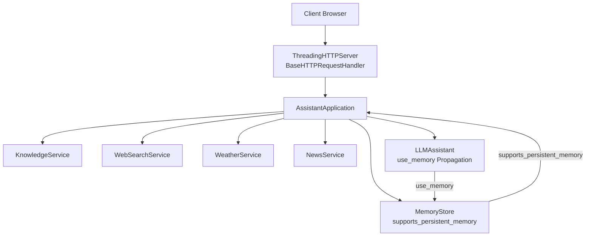

**Diagram sources**
- [server.py:64-83](file://backend/server.py#L64-L83)
- [server.py:23-63](file://backend/server.py#L23-L63)
- [llm_client.py:38-78](file://backend/api_clients/llm_client.py#L38-L78)
- [memory_store.py:127-129](file://backend/core/memory_store.py#L127-L129)

## Detailed Component Analysis

### AssistantApplication: Orchestrator and Handler Factory
- Initializes services:
  - MemoryStore with MongoDB connection and supports_persistent_memory property.
  - KnowledgeService with docs_dir and upload_dir.
  - WebSearchService, LLMAssistant, WeatherService, NewsService.
- Provides a handler() method that returns a RequestHandler subclass delegating to AssistantApplication's route methods.
- Implements HTTP routes for:
  - Static frontend file serving.
  - Session CRUD and message CRUD.
  - Attachment upload and indexing.
  - Weather and news endpoints with conditional memory operations.
  - Chat endpoint invoking LLMAssistant with use_memory parameter.
- Uses internal helpers for JSON parsing, file serving, and error responses.
- **Updated**: Now validates use_memory parameter against supports_persistent_memory property.

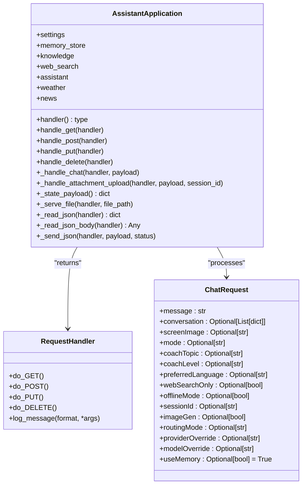

**Diagram sources**
- [server.py:23-83](file://backend/server.py#L23-L83)
- [server.py:85-501](file://backend/server.py#L85-L501)
- [server.py:31-46](file://backend/server.py#L31-L46)

**Section sources**
- [server.py:23-63](file://backend/server.py#L23-L63)
- [server.py:64-83](file://backend/server.py#L64-L83)
- [server.py:85-501](file://backend/server.py#L85-L501)
- [server.py:31-46](file://backend/server.py#L31-L46)

### MemoryStore: Repository Pattern and MongoDB Access
- Encapsulates MongoDB collections and provides a stable public API mirroring legacy JSON behavior.
- Thread-safe operations guarded by a lock to prevent concurrent writes.
- Indexes are ensured at initialization for optimal query performance.
- **Updated**: Added supports_persistent_memory property to indicate MongoDB availability.
- **Updated**: Added is_ephemeral property to distinguish between ephemeral and persistent modes.
- Provides:
  - State and brief snapshots for system instructions with conditional inclusion.
  - Profile updates and notes management with memory consent validation.
  - Task lifecycle (add, complete, delete) with conditional memory operations.
  - Weather/news caching and activity logs with selective memory state.
  - History and session management with memory-aware operations.
  - Knowledge chunks and session attachments/chunks with persistent storage.
- Emits activity records for auditability and state tracking.

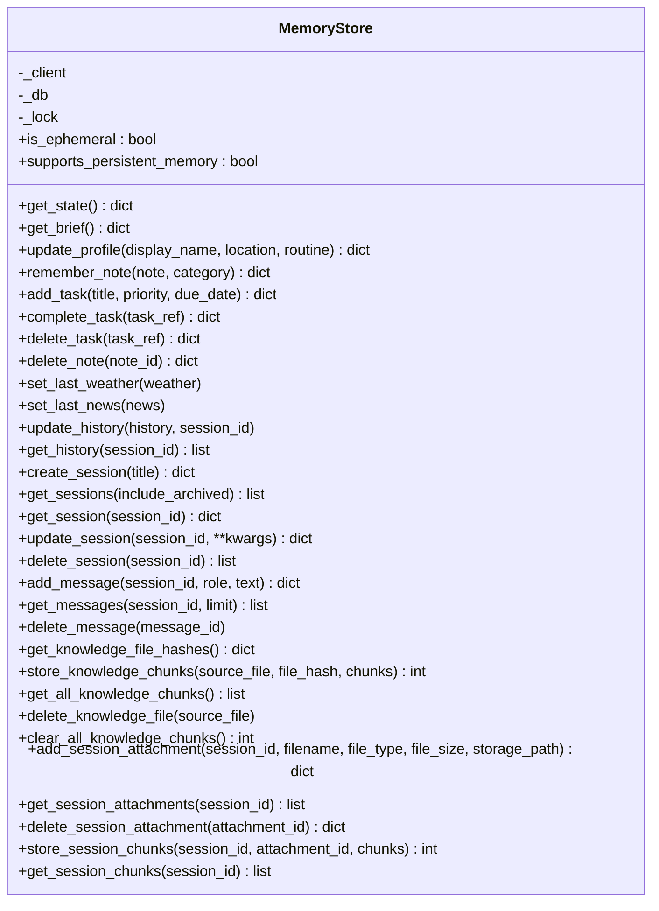

**Diagram sources**
- [memory_store.py:67-800](file://backend/core/memory_store.py#L67-L800)
- [memory_store.py:123-129](file://backend/core/memory_store.py#L123-L129)

**Section sources**
- [memory_store.py:67-150](file://backend/core/memory_store.py#L67-L150)
- [memory_store.py:188-276](file://backend/core/memory_store.py#L188-L276)
- [memory_store.py:579-646](file://backend/core/memory_store.py#L579-L646)
- [memory_store.py:652-690](file://backend/core/memory_store.py#L652-L690)
- [memory_store.py:704-748](file://backend/core/memory_store.py#L704-L748)
- [memory_store.py:754-796](file://backend/core/memory_store.py#L754-L796)

### LLMAssistant: Provider Selection and Tool Loop
- Factory-like selection:
  - For providers "openrouter", "lm_studio", "ollama", uses OpenRouter-compatible logic.
  - Otherwise uses Google REST API logic.
- **Updated**: Enhanced with use_memory parameter propagation for memory-aware system instructions.
- Builds system instructions with memory-aware context and conditional memory state inclusion.
- Manages tool calls:
  - Extracts tool calls from provider responses.
  - Executes run_tool_call with allow_memory parameter for conditional memory operations.
  - Aggregates tool events for UI feedback.
- Handles provider-specific headers and endpoints.

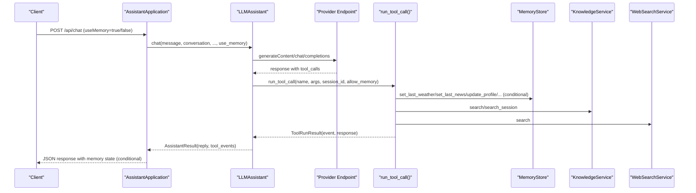

**Diagram sources**
- [server.py:276-321](file://backend/server.py#L276-L321)
- [llm_client.py:38-78](file://backend/api_clients/llm_client.py#L38-L78)
- [llm_client.py:185-215](file://backend/api_clients/llm_client.py#L185-L215)
- [orbit_brain.py:389-501](file://backend/core/orbit_brain.py#L389-L501)

**Section sources**
- [llm_client.py:38-78](file://backend/api_clients/llm_client.py#L38-L78)
- [llm_client.py:185-215](file://backend/api_clients/llm_client.py#L185-L215)
- [orbit_brain.py:389-501](file://backend/core/orbit_brain.py#L389-L501)

### KnowledgeService: Persistent and Session Scopes
- Initializes embeddings and builds hybrid retrievers (BM25 + FAISS) when available.
- Indexes knowledge_base files on startup, tracks hashes, and updates MongoDB chunks.
- Supports session-scoped document indexing and retrieval with lazy retriever caching.
- Cleans up session retrievers on demand.

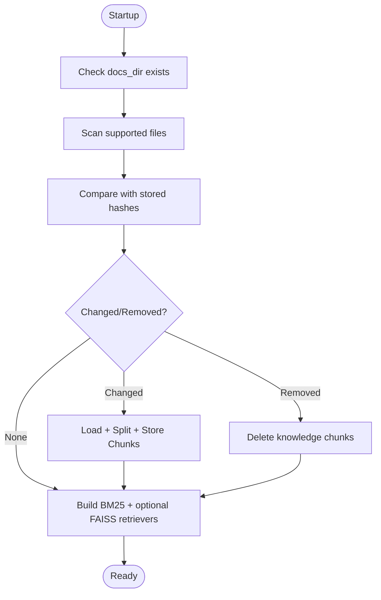

**Diagram sources**
- [knowledge.py:145-230](file://backend/tools/knowledge.py#L145-L230)
- [knowledge.py:357-387](file://backend/tools/knowledge.py#L357-L387)

**Section sources**
- [knowledge.py:88-140](file://backend/tools/knowledge.py#L88-L140)
- [knowledge.py:145-230](file://backend/tools/knowledge.py#L145-L230)
- [knowledge.py:357-387](file://backend/tools/knowledge.py#L357-L387)

### Tool Services: Weather, News, Web Search
- WeatherService: Geocodes location and retrieves current/daily forecasts from Open-Meteo.
- NewsService: Fetches RSS feeds from Google News and parses items.
- WebSearchService: Attempts Tavily, falls back to DuckDuckGo if configured.
- **Updated**: All tools now respect memory consent through allow_memory parameter validation.

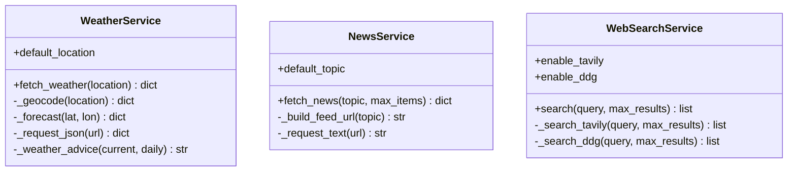

**Diagram sources**
- [weather.py:47-141](file://backend/tools/weather.py#L47-L141)
- [news.py:21-83](file://backend/tools/news.py#L21-L83)
- [web_search.py:53-139](file://backend/tools/web_search.py#L53-L139)

**Section sources**
- [weather.py:47-141](file://backend/tools/weather.py#L47-L141)
- [news.py:21-83](file://backend/tools/news.py#L21-L83)
- [web_search.py:53-139](file://backend/tools/web_search.py#L53-L139)

### Configuration and Entry Point
- Settings loads environment variables and exposes provider-specific keys and URLs.
- run.py delegates to server.run() which prompts for provider/model and starts ThreadingHTTPServer.

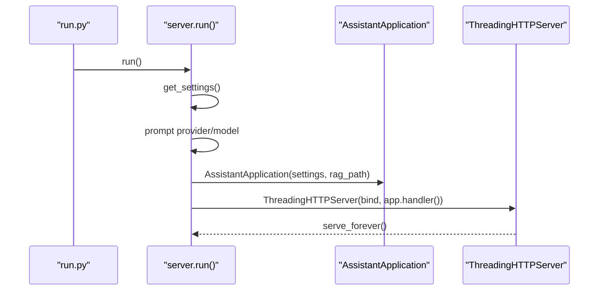

**Diagram sources**
- [run.py:1-6](file://run.py#L1-L6)
- [server.py:566-611](file://backend/server.py#L566-L611)
- [config.py:55-76](file://backend/config.py#L55-L76)

**Section sources**
- [config.py:20-76](file://backend/config.py#L20-L76)
- [run.py:1-6](file://run.py#L1-L6)
- [server.py:566-611](file://backend/server.py#L566-L611)

## Memory-Aware System Design

### Memory-Aware System Instructions
The system now generates memory-aware system instructions that adapt based on user consent and system capabilities:

- **Conditional Memory Brief**: Memory brief is included only when use_memory is True and supports_persistent_memory is True.
- **Memory Mode Notes**: Clear indication of memory access status in system instructions.
- **Selective Tool Availability**: Memory functions are conditionally included in tool declarations.
- **Offline Mode Integration**: Memory-aware offline mode that excludes memory tools when memory is disabled.

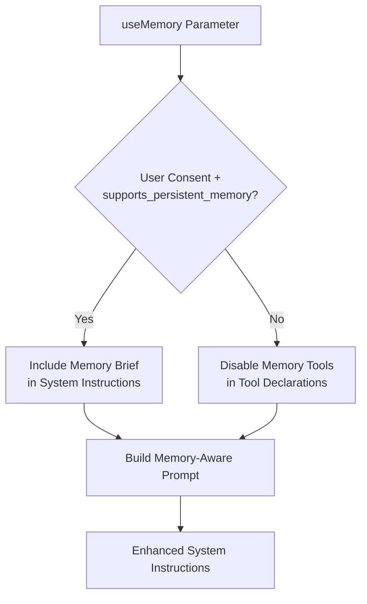

**Diagram sources**
- [orbit_brain.py:302-369](file://backend/core/orbit_brain.py#L302-L369)
- [server.py:355-356](file://backend/server.py#L355-L356)

**Section sources**
- [orbit_brain.py:302-369](file://backend/core/orbit_brain.py#L302-L369)
- [server.py:355-356](file://backend/server.py#L355-L356)

### Memory State Propagation
Memory state is propagated throughout the system with conditional inclusion:

- **HTTP Handlers**: use_memory parameter validated against supports_persistent_memory.
- **LLM Client**: use_memory parameter passed to build_system_instruction.
- **Tool Calls**: allow_memory parameter controls memory operations in run_tool_call.
- **Response Generation**: Memory state included only when memory is enabled.

**Section sources**
- [server.py:355-386](file://backend/server.py#L355-L386)
- [llm_client.py:102-112](file://backend/api_clients/llm_client.py#L102-L112)
- [orbit_brain.py:413-425](file://backend/core/orbit_brain.py#L413-L425)

## Conditional Tool Execution

### Memory-Disabled Tool Filtering
The system implements conditional tool execution based on memory consent:

- **Memory-Disabled Tools Set**: Defines tools that require memory access (remember_note, update_profile, add_task, complete_task, delete_task, get_tasks, get_notes).
- **Conditional Filtering**: Tools are excluded from function declarations when enable_memory is False.
- **Runtime Validation**: Tools validate allow_memory parameter before executing memory operations.

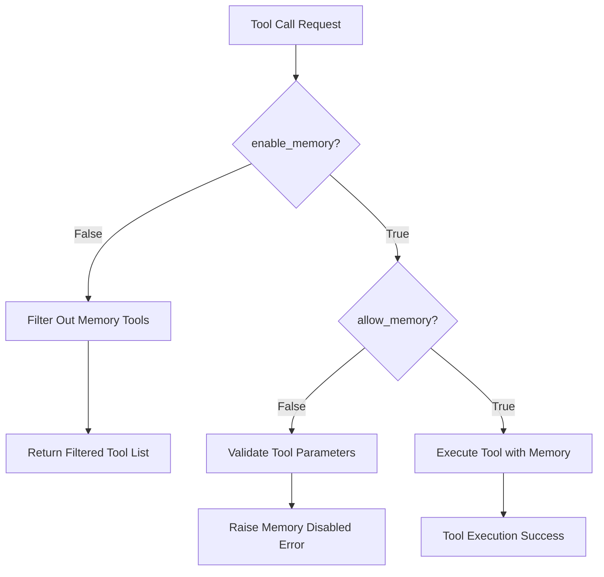

**Diagram sources**
- [orbit_brain.py:374-410](file://backend/core/orbit_brain.py#L374-L410)
- [orbit_brain.py:413-542](file://backend/core/orbit_brain.py#L413-L542)

**Section sources**
- [orbit_brain.py:374-410](file://backend/core/orbit_brain.py#L374-L410)
- [orbit_brain.py:413-542](file://backend/core/orbit_brain.py#L413-L542)

### Memory Operations with Consent Validation
All memory operations now include consent validation:

- **Weather and News**: set_last_weather and set_last_news only executed when allow_memory is True.
- **Memory Functions**: All memory operations (remember_note, update_profile, add_task, complete_task, delete_task, get_tasks, get_notes) validate allow_memory parameter.
- **Error Handling**: Clear error messages when memory operations are attempted without consent.

**Section sources**
- [orbit_brain.py:430-503](file://backend/core/orbit_brain.py#L430-L503)

## Dependency Analysis
- Coupling:
  - AssistantApplication depends on Settings, MemoryStore, KnowledgeService, WebSearchService, LLMAssistant, WeatherService, NewsService.
  - LLMAssistant depends on Settings, MemoryStore, WeatherService, NewsService, KnowledgeService, WebSearchService with use_memory propagation.
  - KnowledgeService depends on MemoryStore and LangChain components.
  - Tool services depend on external APIs and validate memory consent.
- Cohesion:
  - Each module encapsulates a single responsibility (routing, memory, LLM, tools) with enhanced memory awareness.
- External dependencies:
  - MongoDB via PyMongo with supports_persistent_memory capability.
  - HTTP clients for provider APIs and web search.
  - LangChain ecosystem for embeddings and retrievers.

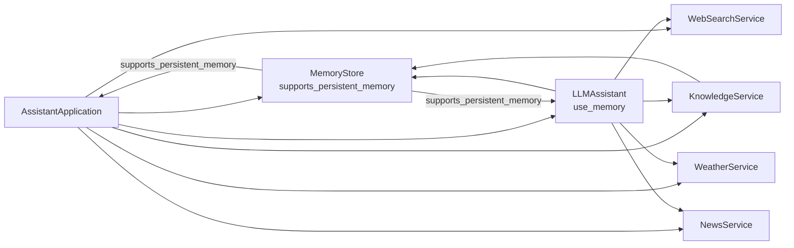

**Diagram sources**
- [server.py:23-63](file://backend/server.py#L23-L63)
- [llm_client.py:38-46](file://backend/api_clients/llm_client.py#L38-L46)
- [knowledge.py:96-107](file://backend/tools/knowledge.py#L96-L107)
- [memory_store.py:127-129](file://backend/core/memory_store.py#L127-L129)

**Section sources**
- [server.py:23-63](file://backend/server.py#L23-L63)
- [llm_client.py:38-46](file://backend/api_clients/llm_client.py#L38-L46)
- [knowledge.py:96-107](file://backend/tools/knowledge.py#L96-L107)

## Performance Considerations
- Threading model:
  - ThreadingHTTPServer spawns a new thread per request, enabling concurrent handling of multiple clients.
- MemoryStore locking:
  - Uses a threading.Lock to serialize write operations, preventing race conditions during concurrent updates.
- MongoDB indexing:
  - Indexes are created on frequently queried fields (session_id, created_at, file_hash, etc.) to optimize reads.
- Tool loop limits:
  - LLMAssistant enforces a maximum iteration count to avoid infinite loops in tool invocation.
- Embeddings and retrievers:
  - KnowledgeService lazily builds and caches retrievers per session to reduce repeated computation.
- Network timeouts:
  - HTTP requests to external APIs and search engines use timeouts to avoid hanging.
- **Updated**: Memory-aware optimizations:
  - Conditional memory operations reduce unnecessary database calls when memory is disabled.
  - Memory brief serialization is skipped when memory is disabled to save processing time.

[No sources needed since this section provides general guidance]

## Troubleshooting Guide
- MongoDB connection failures:
  - MemoryStore raises a runtime error if the server is unreachable; ensure MongoDB is running and credentials are correct.
- Provider API errors:
  - LLMAssistant wraps provider errors into LLMClientError with details; check API keys and network connectivity.
- Tool invocation errors:
  - run_tool_call catches NewsError, WeatherError, KeyError, and ValueError; inspect tool events for specifics.
- Attachment upload issues:
  - Validate allowed types, size limits, and base64 decoding; verify upload directory permissions.
- Activity and state:
  - MemoryStore maintains activity entries; review recent activities for debugging state transitions.
- **Updated**: Memory-related troubleshooting:
  - MemoryDisabledError: Raised when persistent memory features are used in ephemeral mode.
  - Memory consent validation: Ensure useMemory parameter aligns with supports_persistent_memory property.
  - Conditional tool filtering: Verify that memory tools are properly excluded when memory is disabled.

**Section sources**
- [memory_store.py:94-98](file://backend/core/memory_store.py#L94-L98)
- [llm_client.py:161-174](file://backend/api_clients/llm_client.py#L161-L174)
- [llm_client.py:34-35](file://backend/api_clients/llm_client.py#L34-L35)
- [orbit_brain.py:490-493](file://backend/core/orbit_brain.py#L490-L493)
- [server.py:349-361](file://backend/server.py#L349-L361)

## Conclusion
The backend employs a clean separation of concerns with enhanced memory-aware capabilities. The system now features memory-consent-based system instructions, conditional tool execution, and selective memory state inclusion. The robust orchestration layer (AssistantApplication) coordinates services with use_memory parameter propagation, while the thread-safe repository (MemoryStore) provides supports_persistent_memory capability validation. The pluggable LLM and tool integrations support multiple providers with conditional memory operations. The architecture balances modularity, observability (through activity logs), and performance (indexes, caching, and timeouts), providing a solid foundation for privacy-conscious AI assistant functionality with selective memory access.