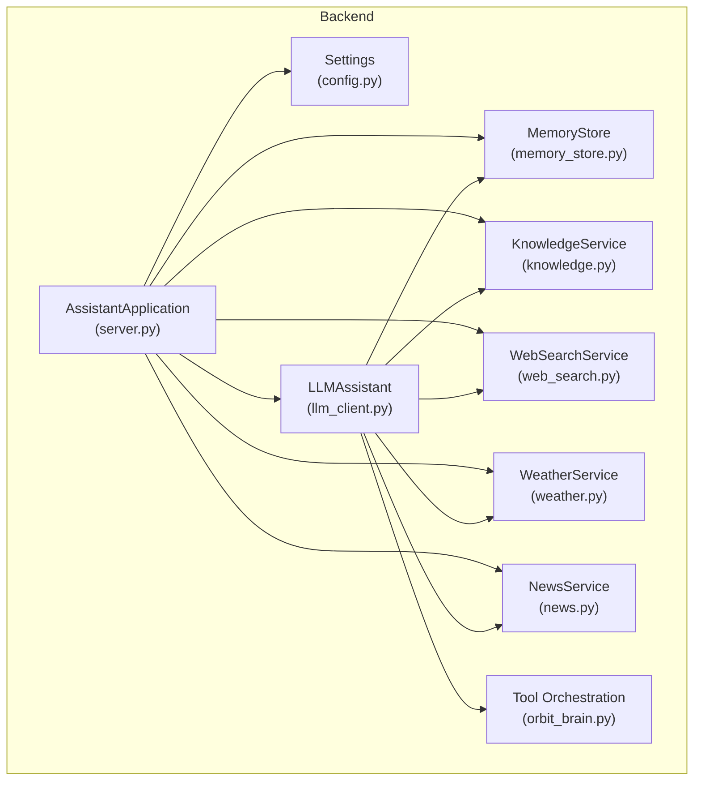
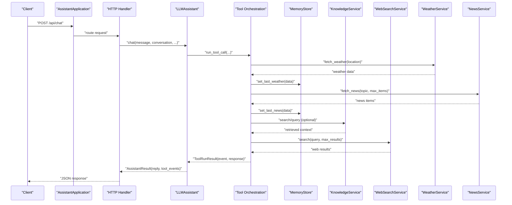
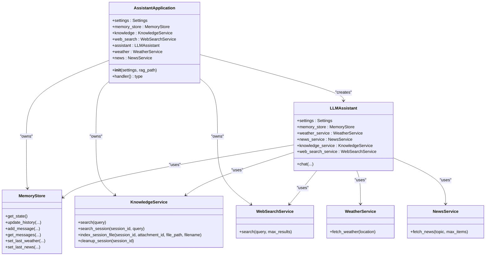
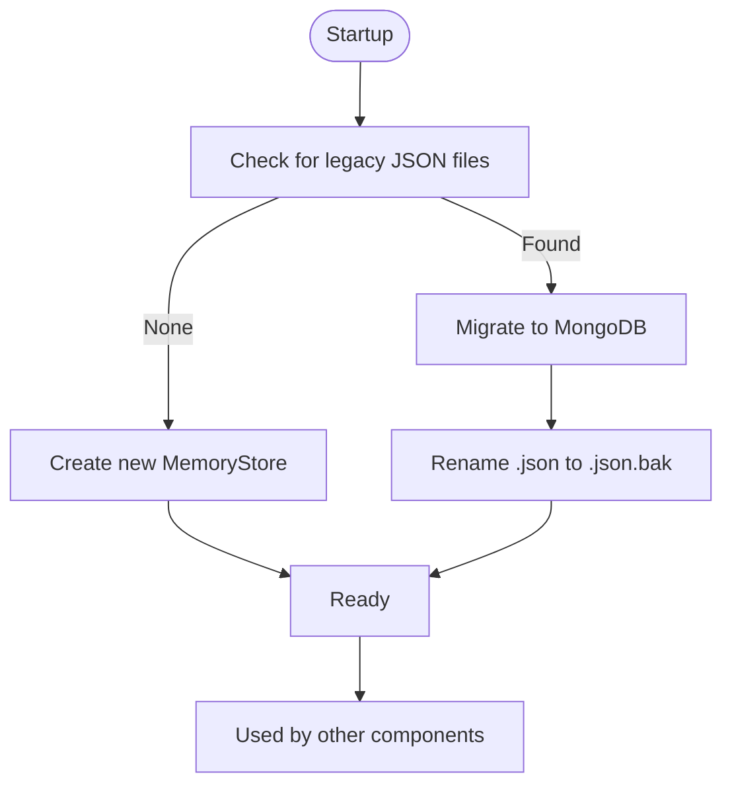
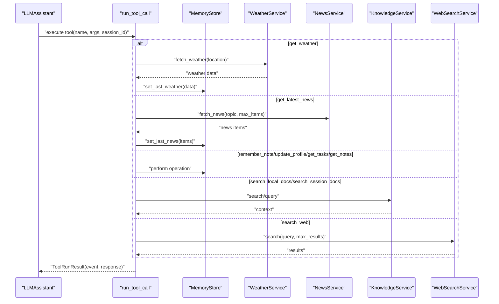
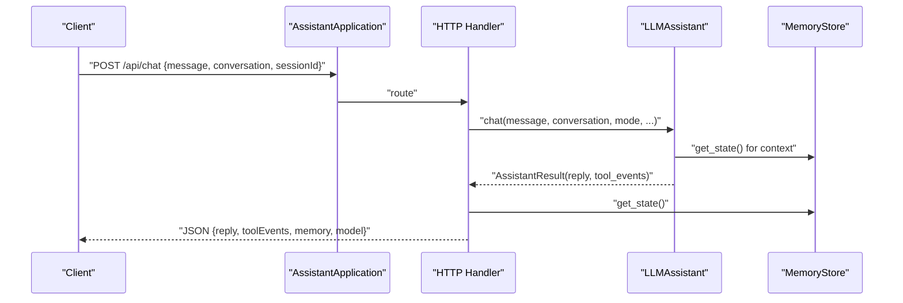
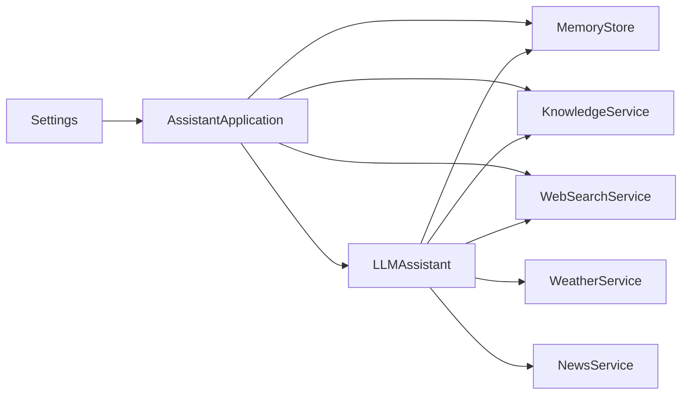

# AssistantApplication Orchestrator

<cite>
**Referenced Files in This Document**
- [server.py](file://backend/server.py)
- [llm_client.py](file://backend/api_clients/llm_client.py)
- [memory_store.py](file://backend/core/memory_store.py)
- [knowledge.py](file://backend/tools/knowledge.py)
- [news.py](file://backend/tools/news.py)
- [weather.py](file://backend/tools/weather.py)
- [web_search.py](file://backend/tools/web_search.py)
- [orbit_brain.py](file://backend/core/orbit_brain.py)
- [config.py](file://backend/config.py)
- [README.md](file://README.md)
</cite>

## Table of Contents
1. [Introduction](#introduction)
2. [Project Structure](#project-structure)
3. [Core Components](#core-components)
4. [Architecture Overview](#architecture-overview)
5. [Detailed Component Analysis](#detailed-component-analysis)
6. [Dependency Analysis](#dependency-analysis)
7. [Performance Considerations](#performance-considerations)
8. [Troubleshooting Guide](#troubleshooting-guide)
9. [Conclusion](#conclusion)

## Introduction
AssistantApplication serves as the central orchestrator for the backend, wiring together all major components: persistent memory, knowledge retrieval, weather and news services, web search, and the LLM assistant. It implements a dependency injection pattern where each component is constructed once and passed into others that require them. The orchestrator manages component lifecycles, ensures proper initialization order, and coordinates cross-service workflows during chat processing, memory state management, and tool execution.

## Project Structure
The backend is organized into cohesive layers:
- api_clients: LLM provider integrations (Google, OpenRouter, LM Studio, Ollama)
- core: Persistent memory and brain logic (tool orchestration)
- tools: External data services (weather, news, web search, knowledge)
- config: Settings and environment loading
- server: HTTP API, request routing, and integration glue

**Diagram sources**
- [server.py:23-63](file://backend/server.py#L23-L63)
- [config.py:20-76](file://backend/config.py#L20-L76)
- [memory_store.py:67-117](file://backend/core/memory_store.py#L67-L117)
- [knowledge.py:88-140](file://backend/tools/knowledge.py#L88-L140)
- [web_search.py:53-104](file://backend/tools/web_search.py#L53-L104)
- [weather.py:47-141](file://backend/tools/weather.py#L47-L141)
- [news.py:21-83](file://backend/tools/news.py#L21-L83)
- [llm_client.py:38-46](file://backend/api_clients/llm_client.py#L38-L46)
- [orbit_brain.py:389-502](file://backend/core/orbit_brain.py#L389-L502)

**Section sources**
- [README.md:164-201](file://README.md#L164-L201)
- [server.py:23-63](file://backend/server.py#L23-L63)

## Core Components
AssistantApplication constructs and exposes the following components:
- MemoryStore: MongoDB-backed persistent storage for sessions, messages, profile, tasks, notes, activity cache, and knowledge chunks. Handles migration from legacy JSON files.
- KnowledgeService: Optional RAG system that indexes local documents and enables session-scoped document search. Requires docs_dir for activation.
- WebSearchService: Provides web search via Tavily (primary) and DuckDuckGo (fallback).
- LLMAssistant: The LLM orchestrator that manages conversations, tool calls, and integrates with memory and external services.
- WeatherService and NewsService: External data services used by the brain to execute tool calls.

Initialization order and wiring:
1. Settings loaded from environment
2. MemoryStore created or migrated from JSON
3. KnowledgeService created (RAG-enabled if docs_dir provided)
4. WebSearchService created
5. LLMAssistant created with injected dependencies
6. WeatherService and NewsService created

**Section sources**
- [server.py:24-62](file://backend/server.py#L24-L62)
- [memory_store.py:837-947](file://backend/core/memory_store.py#L837-L947)
- [knowledge.py:96-140](file://backend/tools/knowledge.py#L96-L140)
- [web_search.py:53-104](file://backend/tools/web_search.py#L53-L104)
- [llm_client.py:38-46](file://backend/api_clients/llm_client.py#L38-L46)
- [weather.py:47-141](file://backend/tools/weather.py#L47-L141)
- [news.py:21-83](file://backend/tools/news.py#L21-L83)

## Architecture Overview
AssistantApplication acts as a factory and coordinator. It injects shared dependencies into LLMAssistant and other services, enabling tool execution workflows that span memory, knowledge, and external APIs.

**Diagram sources**
- [server.py:276-321](file://backend/server.py#L276-L321)
- [llm_client.py:47-216](file://backend/api_clients/llm_client.py#L47-L216)
- [orbit_brain.py:389-502](file://backend/core/orbit_brain.py#L389-L502)
- [memory_store.py:475-495](file://backend/core/memory_store.py#L475-L495)
- [weather.py:51-75](file://backend/tools/weather.py#L51-L75)
- [news.py:25-60](file://backend/tools/news.py#L25-L60)
- [web_search.py:69-104](file://backend/tools/web_search.py#L69-L104)

## Detailed Component Analysis

### AssistantApplication Constructor and Dependency Injection
- Settings injection: The orchestrator receives Settings and passes provider/model details to LLMAssistant.
- MemoryStore lifecycle: Either migrates legacy JSON files to MongoDB or creates a new instance. Migration renames legacy files to avoid reprocessing.
- KnowledgeService lifecycle: Always instantiated; RAG is enabled when docs_dir is provided. Upload directory is prepared for session attachments.
- WebSearchService lifecycle: Created unconditionally; supports Tavily and DuckDuckGo fallback.
- LLMAssistant lifecycle: Receives settings, memory_store, knowledge_service, and web_search_service. WeatherService and NewsService are also created for direct API endpoints.
- Wiring pattern: Components are stored as instance attributes and passed into LLMAssistant’s constructor, ensuring centralized control and testability.

**Diagram sources**
- [server.py:23-62](file://backend/server.py#L23-L62)
- [llm_client.py:38-46](file://backend/api_clients/llm_client.py#L38-L46)
- [memory_store.py:67-117](file://backend/core/memory_store.py#L67-L117)
- [knowledge.py:88-140](file://backend/tools/knowledge.py#L88-L140)
- [web_search.py:53-104](file://backend/tools/web_search.py#L53-L104)
- [weather.py:47-141](file://backend/tools/weather.py#L47-L141)
- [news.py:21-83](file://backend/tools/news.py#L21-L83)

**Section sources**
- [server.py:24-62](file://backend/server.py#L24-L62)

### MemoryStore Lifecycle and Migration
- Connection and indexing: Establishes MongoDB connection, creates indexes, and ensures a user profile document exists.
- Migration: Scans legacy JSON files, imports profile, notes, tasks, activity, and cached weather/news, then renames files to .bak to prevent reprocessing.
- Persistence APIs: Provides CRUD for sessions, messages, profile, tasks, notes, and knowledge chunks; maintains activity logs and cache.

**Diagram sources**
- [server.py:31-48](file://backend/server.py#L31-L48)
- [memory_store.py:837-947](file://backend/core/memory_store.py#L837-L947)

**Section sources**
- [server.py:31-48](file://backend/server.py#L31-L48)
- [memory_store.py:837-947](file://backend/core/memory_store.py#L837-L947)

### Tool Execution Workflow Coordination
LLMAssistant delegates tool calls to the brain module, which dispatches to appropriate services and updates memory accordingly. The brain coordinates:
- Weather checks: Updates last weather cache in memory
- News checks: Updates last news cache in memory
- Memory operations: Notes, tasks, and profile updates
- Knowledge search: Local RAG or session-scoped search
- Web search: External search with fallback

**Diagram sources**
- [llm_client.py:195-205](file://backend/api_clients/llm_client.py#L195-L205)
- [orbit_brain.py:389-502](file://backend/core/orbit_brain.py#L389-L502)
- [memory_store.py:475-495](file://backend/core/memory_store.py#L475-L495)
- [weather.py:51-75](file://backend/tools/weather.py#L51-L75)
- [news.py:25-60](file://backend/tools/news.py#L25-L60)
- [web_search.py:69-104](file://backend/tools/web_search.py#L69-L104)
- [knowledge.py:270-297](file://backend/tools/knowledge.py#L270-L297)

**Section sources**
- [llm_client.py:195-205](file://backend/api_clients/llm_client.py#L195-L205)
- [orbit_brain.py:389-502](file://backend/core/orbit_brain.py#L389-L502)

### Chat Processing and Memory State Management
- Chat endpoint: Validates message, routes to LLMAssistant.chat with mode, language preferences, and session context.
- Conversation shaping: Builds Google API content with recent conversation history and optional screen image.
- Tool loop: Executes tool calls returned by the LLM, appending tool responses to the conversation until completion or loop limit.
- Memory updates: Weather and news results are cached in memory; tool events are collected for UI feedback.
- Error handling: Catches LLM client errors and returns structured error responses.

**Diagram sources**
- [server.py:276-321](file://backend/server.py#L276-L321)
- [llm_client.py:47-216](file://backend/api_clients/llm_client.py#L47-L216)
- [memory_store.py:188-250](file://backend/core/memory_store.py#L188-L250)

**Section sources**
- [server.py:276-321](file://backend/server.py#L276-L321)
- [llm_client.py:47-216](file://backend/api_clients/llm_client.py#L47-L216)

### Component Lifecycle Management
- Initialization order: Settings → MemoryStore (migration) → KnowledgeService (RAG) → WebSearchService → LLMAssistant → WeatherService → NewsService
- Cleanup: MemoryStore provides a close method for database connections; other components are lightweight and rely on garbage collection.
- Session lifecycle: Sessions and attachments are managed through MemoryStore APIs; KnowledgeService cleans up session retrievers on demand.

**Section sources**
- [server.py:24-62](file://backend/server.py#L24-L62)
- [memory_store.py:148-149](file://backend/core/memory_store.py#L148-L149)
- [knowledge.py:389-393](file://backend/tools/knowledge.py#L389-L393)

## Dependency Analysis
AssistantApplication exhibits a clean dependency injection pattern:
- Low coupling: LLMAssistant depends on abstractions (services) rather than concrete implementations.
- Cohesion: Each component encapsulates a single responsibility (memory, knowledge, tools).
- External dependencies: MongoDB, optional RAG stack, web search providers, and LLM providers.

**Diagram sources**
- [server.py:23-62](file://backend/server.py#L23-L62)
- [llm_client.py:38-46](file://backend/api_clients/llm_client.py#L38-L46)

**Section sources**
- [server.py:23-62](file://backend/server.py#L23-L62)
- [llm_client.py:38-46](file://backend/api_clients/llm_client.py#L38-L46)

## Performance Considerations
- Tool loop limits: Both Google and OpenRouter flows enforce a maximum iteration count to prevent runaway tool execution.
- Network timeouts: Weather, news, and web search services specify timeouts to avoid blocking the main thread.
- RAG initialization: Knowledge base indexing occurs at startup and uses threading for progress indication; consider batching large document sets.
- MongoDB operations: MemoryStore uses indexes and batched writes for efficient persistence; ensure proper connection settings for production.

[No sources needed since this section provides general guidance]

## Troubleshooting Guide
Common issues and resolutions:
- MongoDB connection failures: Verify URI and credentials; MemoryStore raises explicit runtime errors on connection failure.
- Missing API keys: Ensure ACTIVE_PROVIDER and associated keys are configured; Settings selects the current API key dynamically.
- Web search failures: Tavily fallback to DuckDuckGo is automatic; check API key validity and network connectivity.
- RAG not working: Confirm LM Studio availability and embeddings configuration; KnowledgeService logs connectivity warnings.
- Tool execution errors: The brain catches service-specific exceptions and returns structured error events; inspect tool events in the response.

**Section sources**
- [memory_store.py:94-98](file://backend/core/memory_store.py#L94-L98)
- [config.py:48-52](file://backend/config.py#L48-L52)
- [web_search.py:86-104](file://backend/tools/web_search.py#L86-L104)
- [knowledge.py:134-137](file://backend/tools/knowledge.py#L134-L137)
- [orbit_brain.py:490-492](file://backend/core/orbit_brain.py#L490-L492)

## Conclusion
AssistantApplication provides a robust, modular foundation for the backend by implementing dependency injection, managing component lifecycles, and coordinating complex workflows across memory, knowledge, and external services. Its design enables easy extension, clear separation of concerns, and resilient error handling, making it straightforward to integrate new tools and adapt to evolving requirements.