# Component Orchestration

<cite>
**Referenced Files in This Document**
- [backend/server.py](file://backend/server.py)
- [backend/config.py](file://backend/config.py)
- [backend/core/orbit_brain.py](file://backend/core/orbit_brain.py)
- [backend/core/memory_store.py](file://backend/core/memory_store.py)
- [backend/api_clients/llm_client.py](file://backend/api_clients/llm_client.py)
- [backend/api_clients/gemini_client.py](file://backend/api_clients/gemini_client.py)
- [backend/tools/weather.py](file://backend/tools/weather.py)
- [backend/tools/news.py](file://backend/tools/news.py)
- [backend/tools/knowledge.py](file://backend/tools/knowledge.py)
- [backend/tools/web_search.py](file://backend/tools/web_search.py)
- [backend/audio/asr_whisper.py](file://backend/audio/asr_whisper.py)
- [run.py](file://run.py)
</cite>

## Table of Contents
1. [Introduction](#introduction)
2. [Project Structure](#project-structure)
3. [Core Components](#core-components)
4. [Architecture Overview](#architecture-overview)
5. [Detailed Component Analysis](#detailed-component-analysis)
6. [Dependency Analysis](#dependency-analysis)
7. [Performance Considerations](#performance-considerations)
8. [Troubleshooting Guide](#troubleshooting-guide)
9. [Conclusion](#conclusion)

## Introduction
This document explains the component orchestration system centered around the AssistantApplication class. It describes how the system coordinates multiple backend components—MemoryStore, KnowledgeService, WeatherService, NewsService, and LLMAssistant—to process user requests, manage memory, and execute tool calls. It also documents the factory-like selection of LLM clients, dependency injection patterns, initialization sequences, orchestration logic for chat processing, error propagation, and graceful degradation strategies.

## Project Structure
The backend is organized into cohesive modules:
- Configuration and server bootstrap
- Core orchestration and memory
- LLM clients (Google and OpenRouter-compatible)
- Tools for weather, news, knowledge base, and web search
- Audio ASR placeholder
- Run script to start the server

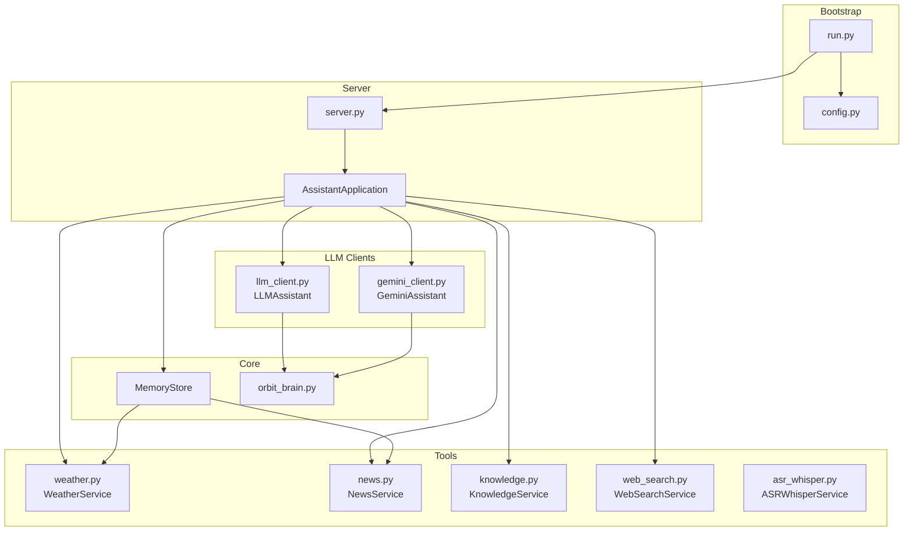

**Diagram sources**
- [run.py:1-6](file://run.py#L1-L6)
- [backend/config.py:55-76](file://backend/config.py#L55-L76)
- [backend/server.py:23-63](file://backend/server.py#L23-L63)
- [backend/core/memory_store.py:67-118](file://backend/core/memory_store.py#L67-L118)
- [backend/tools/knowledge.py:88-140](file://backend/tools/knowledge.py#L88-L140)
- [backend/tools/web_search.py:53-68](file://backend/tools/web_search.py#L53-L68)
- [backend/api_clients/llm_client.py:38-46](file://backend/api_clients/llm_client.py#L38-L46)
- [backend/tools/weather.py:47-50](file://backend/tools/weather.py#L47-L50)
- [backend/tools/news.py:21-24](file://backend/tools/news.py#L21-L24)
- [backend/api_clients/gemini_client.py:36-42](file://backend/api_clients/gemini_client.py#L36-L42)
- [backend/audio/asr_whisper.py:10-19](file://backend/audio/asr_whisper.py#L10-L19)

**Section sources**
- [backend/server.py:23-63](file://backend/server.py#L23-L63)
- [backend/config.py:55-76](file://backend/config.py#L55-L76)
- [run.py:1-6](file://run.py#L1-L6)

## Core Components
- AssistantApplication: Central orchestrator that initializes and wires all components, exposes HTTP endpoints, and delegates chat processing to LLMAssistant.
- LLMAssistant: LLM client wrapper that selects provider logic (Google vs OpenRouter/LM Studio/Ollama), builds prompts and tool definitions, executes tool calls, and aggregates results.
- MemoryStore: Persistent memory backed by MongoDB, providing state snapshots, tasks, notes, profiles, and cached weather/news.
- KnowledgeService: Manages persistent knowledge base indexing and retrieval, plus session-scoped document indexing and search.
- WebSearchService: Provides web search with Tavily and DuckDuckGo fallbacks.
- WeatherService and NewsService: External data services for weather forecasts and news headlines.
- GeminiAssistant: Alternative client for Gemini (not used in current orchestration flow).
- ASRWhisperService: Placeholder for speech-to-text integration.

**Section sources**
- [backend/server.py:23-63](file://backend/server.py#L23-L63)
- [backend/api_clients/llm_client.py:38-46](file://backend/api_clients/llm_client.py#L38-L46)
- [backend/core/memory_store.py:67-118](file://backend/core/memory_store.py#L67-L118)
- [backend/tools/knowledge.py:88-140](file://backend/tools/knowledge.py#L88-L140)
- [backend/tools/web_search.py:53-68](file://backend/tools/web_search.py#L53-L68)
- [backend/tools/weather.py:47-50](file://backend/tools/weather.py#L47-L50)
- [backend/tools/news.py:21-24](file://backend/tools/news.py#L21-L24)
- [backend/api_clients/gemini_client.py:36-42](file://backend/api_clients/gemini_client.py#L36-L42)
- [backend/audio/asr_whisper.py:10-19](file://backend/audio/asr_whisper.py#L10-L19)

## Architecture Overview
AssistantApplication is the primary entry point. It constructs:
- MemoryStore (with optional migration from legacy JSON)
- KnowledgeService (RAG-enabled when docs_dir is provided)
- WebSearchService
- LLMAssistant (with injected dependencies)
- WeatherService and NewsService

The server routes map to AssistantApplication handlers that call LLMAssistant.chat, which orchestrates tool calls and memory updates.

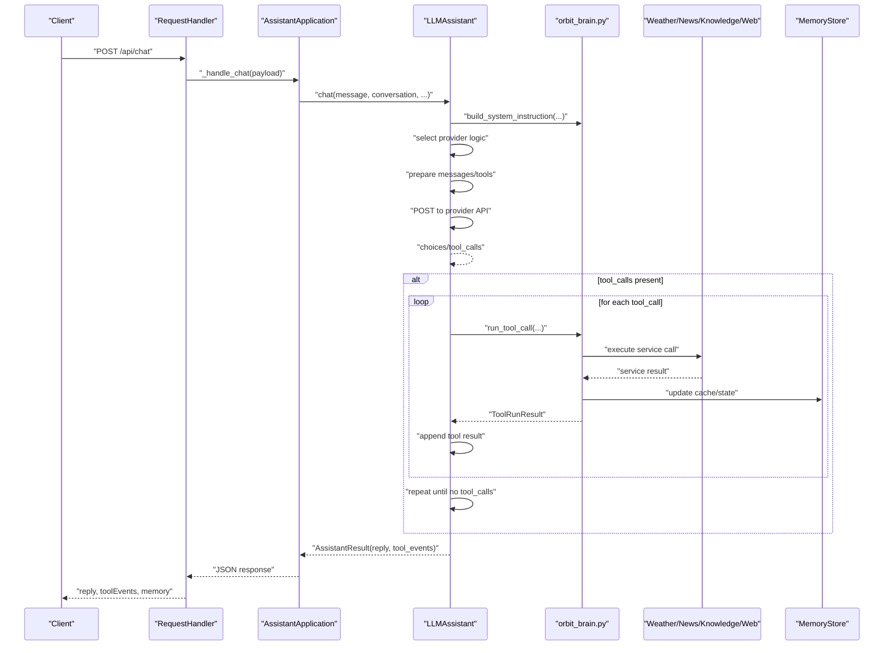

**Diagram sources**
- [backend/server.py:276-321](file://backend/server.py#L276-L321)
- [backend/api_clients/llm_client.py:47-78](file://backend/api_clients/llm_client.py#L47-L78)
- [backend/core/orbit_brain.py:302-357](file://backend/core/orbit_brain.py#L302-L357)
- [backend/core/orbit_brain.py:389-502](file://backend/core/orbit_brain.py#L389-L502)

## Detailed Component Analysis

### AssistantApplication: Central Coordinator
- Initialization sequence:
  - Detects legacy JSON files and migrates to MongoDB-backed MemoryStore.
  - Creates KnowledgeService with docs_dir and upload_dir.
  - Instantiates WebSearchService.
  - Builds LLMAssistant with injected dependencies (Settings, MemoryStore, KnowledgeService, WebSearchService).
  - Creates WeatherService and NewsService.
- HTTP routing:
  - Serves static frontend assets.
  - Exposes state, sessions, messages, attachments, weather, and news endpoints.
  - Handles chat via _handle_chat, which calls LLMAssistant.chat and returns aggregated results.
- Error handling:
  - Catches LLMClientError and returns HTTP 502.
  - Propagates tool/service errors to the client with meaningful messages.
- Graceful degradation:
  - Supports web_search_only and offline_mode flags to adjust tool availability.
  - Falls back to local-only tools when external services are unavailable.

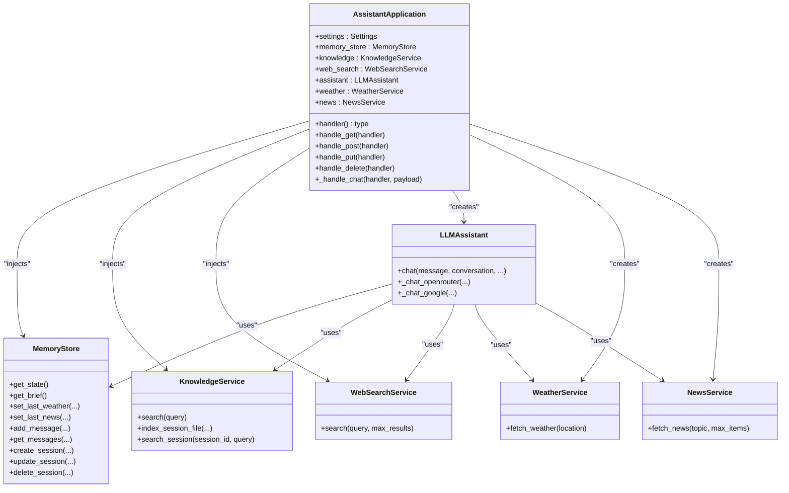

**Diagram sources**
- [backend/server.py:23-63](file://backend/server.py#L23-L63)
- [backend/api_clients/llm_client.py:38-46](file://backend/api_clients/llm_client.py#L38-L46)
- [backend/core/memory_store.py:67-118](file://backend/core/memory_store.py#L67-L118)
- [backend/tools/knowledge.py:88-140](file://backend/tools/knowledge.py#L88-L140)
- [backend/tools/web_search.py:53-68](file://backend/tools/web_search.py#L53-L68)
- [backend/tools/weather.py:47-50](file://backend/tools/weather.py#L47-L50)
- [backend/tools/news.py:21-24](file://backend/tools/news.py#L21-L24)

**Section sources**
- [backend/server.py:23-63](file://backend/server.py#L23-L63)
- [backend/server.py:276-321](file://backend/server.py#L276-L321)

### LLMAssistant: Factory Pattern and Provider Selection
- Factory-like selection:
  - Chooses provider logic based on active_provider: OpenRouter/LM Studio/Ollama vs Google.
- Dependency injection:
  - Receives Settings, MemoryStore, KnowledgeService, and WebSearchService in constructor.
- Tool orchestration:
  - Builds system instructions and function declarations via orbit_brain utilities.
  - Executes tool calls and aggregates events.
- Error handling:
  - Wraps provider errors and returns user-friendly messages.

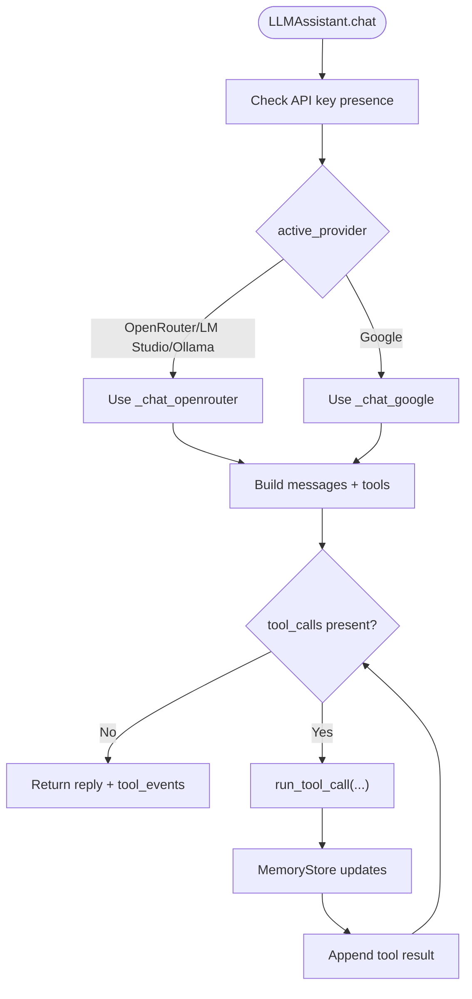

**Diagram sources**
- [backend/api_clients/llm_client.py:47-78](file://backend/api_clients/llm_client.py#L47-L78)
- [backend/api_clients/llm_client.py:82-216](file://backend/api_clients/llm_client.py#L82-L216)
- [backend/api_clients/llm_client.py:220-273](file://backend/api_clients/llm_client.py#L220-L273)
- [backend/core/orbit_brain.py:389-502](file://backend/core/orbit_brain.py#L389-L502)

**Section sources**
- [backend/api_clients/llm_client.py:38-46](file://backend/api_clients/llm_client.py#L38-L46)
- [backend/api_clients/llm_client.py:47-78](file://backend/api_clients/llm_client.py#L47-L78)
- [backend/api_clients/llm_client.py:82-216](file://backend/api_clients/llm_client.py#L82-L216)
- [backend/api_clients/llm_client.py:220-273](file://backend/api_clients/llm_client.py#L220-L273)

### MemoryStore: State Management and Persistence
- MongoDB-backed persistence with collections for sessions, messages, profile, notes, tasks, activity, cache, knowledge chunks, attachments, and session chunks.
- Thread-safe operations via locks.
- Provides:
  - Full state snapshot and brief summaries for system instructions.
  - Task CRUD, note CRUD, profile updates.
  - Weather/news caching and activity logging.
  - Session/message CRUD and attachment management.

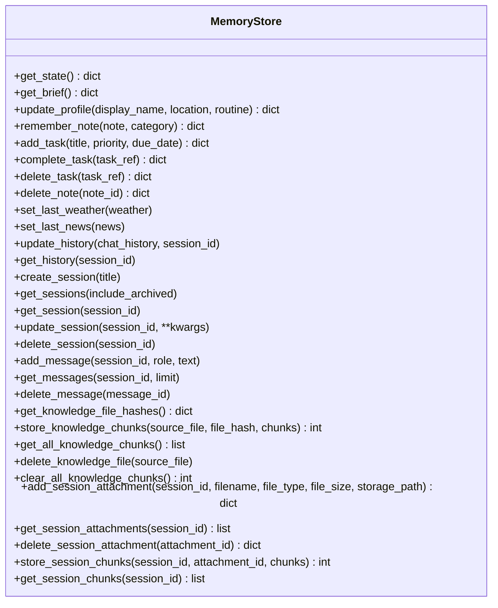

**Diagram sources**
- [backend/core/memory_store.py:67-800](file://backend/core/memory_store.py#L67-L800)

**Section sources**
- [backend/core/memory_store.py:67-118](file://backend/core/memory_store.py#L67-L118)
- [backend/core/memory_store.py:188-277](file://backend/core/memory_store.py#L188-L277)
- [backend/core/memory_store.py:309-447](file://backend/core/memory_store.py#L309-L447)
- [backend/core/memory_store.py:475-496](file://backend/core/memory_store.py#L475-L496)
- [backend/core/memory_store.py:501-574](file://backend/core/memory_store.py#L501-L574)
- [backend/core/memory_store.py:579-647](file://backend/core/memory_store.py#L579-L647)
- [backend/core/memory_store.py:652-690](file://backend/core/memory_store.py#L652-L690)
- [backend/core/memory_store.py:695-749](file://backend/core/memory_store.py#L695-L749)
- [backend/core/memory_store.py:754-797](file://backend/core/memory_store.py#L754-L797)
- [backend/core/memory_store.py:800-947](file://backend/core/memory_store.py#L800-L947)

### KnowledgeService: RAG and Session Docs
- Initializes embeddings and knowledge base when docs_dir is provided.
- Indexes new/changed files and removes obsolete chunks.
- Builds hybrid retriever (BM25 + FAISS) when embeddings are available.
- Supports session-scoped document indexing and search with lazy retriever caching.

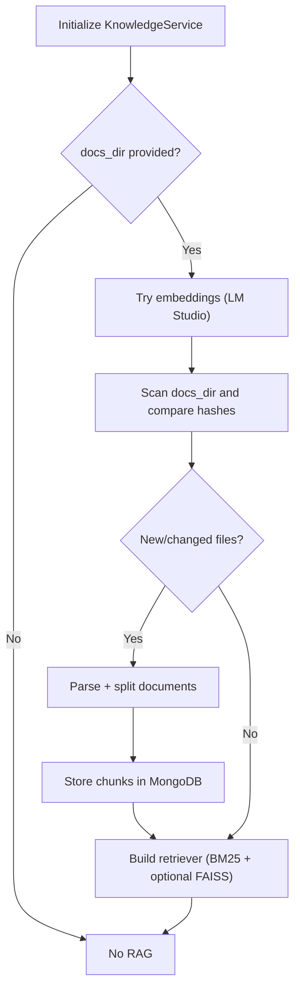

**Diagram sources**
- [backend/tools/knowledge.py:96-140](file://backend/tools/knowledge.py#L96-L140)
- [backend/tools/knowledge.py:145-230](file://backend/tools/knowledge.py#L145-L230)
- [backend/tools/knowledge.py:269-298](file://backend/tools/knowledge.py#L269-L298)
- [backend/tools/knowledge.py:303-336](file://backend/tools/knowledge.py#L303-L336)
- [backend/tools/knowledge.py:337-356](file://backend/tools/knowledge.py#L337-L356)

**Section sources**
- [backend/tools/knowledge.py:88-140](file://backend/tools/knowledge.py#L88-L140)
- [backend/tools/knowledge.py:145-230](file://backend/tools/knowledge.py#L145-L230)
- [backend/tools/knowledge.py:269-298](file://backend/tools/knowledge.py#L269-L298)
- [backend/tools/knowledge.py:303-356](file://backend/tools/knowledge.py#L303-L356)

### WebSearchService: Multi-Provider Search
- Attempts Tavily search first; falls back to DuckDuckGo if Tavily is unavailable or fails.
- Returns structured results with title, link, and body.

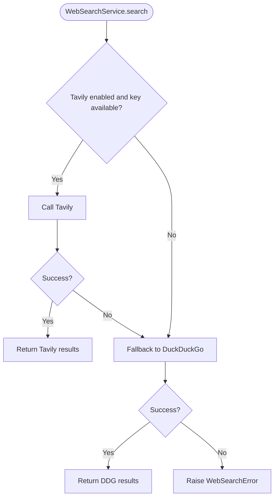

**Diagram sources**
- [backend/tools/web_search.py:69-105](file://backend/tools/web_search.py#L69-L105)
- [backend/tools/web_search.py:106-139](file://backend/tools/web_search.py#L106-L139)

**Section sources**
- [backend/tools/web_search.py:53-68](file://backend/tools/web_search.py#L53-L68)
- [backend/tools/web_search.py:69-105](file://backend/tools/web_search.py#L69-L105)
- [backend/tools/web_search.py:106-139](file://backend/tools/web_search.py#L106-L139)

### WeatherService and NewsService: Tool Execution
- WeatherService: Geocodes location, fetches forecast, and returns standardized weather data.
- NewsService: Fetches RSS feeds, parses items, and returns headlines with metadata.
- Both raise domain-specific errors propagated to the orchestration layer.

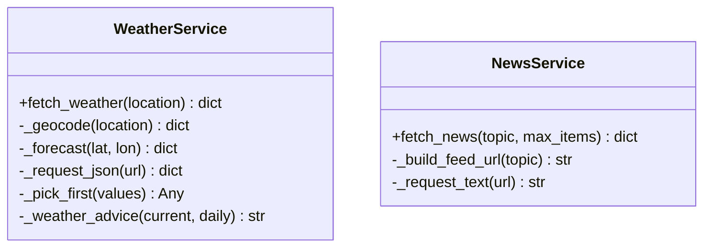

**Diagram sources**
- [backend/tools/weather.py:47-76](file://backend/tools/weather.py#L47-L76)
- [backend/tools/weather.py:77-127](file://backend/tools/weather.py#L77-L127)
- [backend/tools/news.py:21-61](file://backend/tools/news.py#L21-L61)
- [backend/tools/news.py:62-83](file://backend/tools/news.py#L62-L83)

**Section sources**
- [backend/tools/weather.py:47-76](file://backend/tools/weather.py#L47-L76)
- [backend/tools/weather.py:77-127](file://backend/tools/weather.py#L77-L127)
- [backend/tools/news.py:21-61](file://backend/tools/news.py#L21-L61)
- [backend/tools/news.py:62-83](file://backend/tools/news.py#L62-L83)

### Tool Orchestration and Memory Updates
- run_tool_call maps function names to service calls, updates MemoryStore caches, and records events.
- MemoryStore updates weather/news cache and logs activities for auditability.

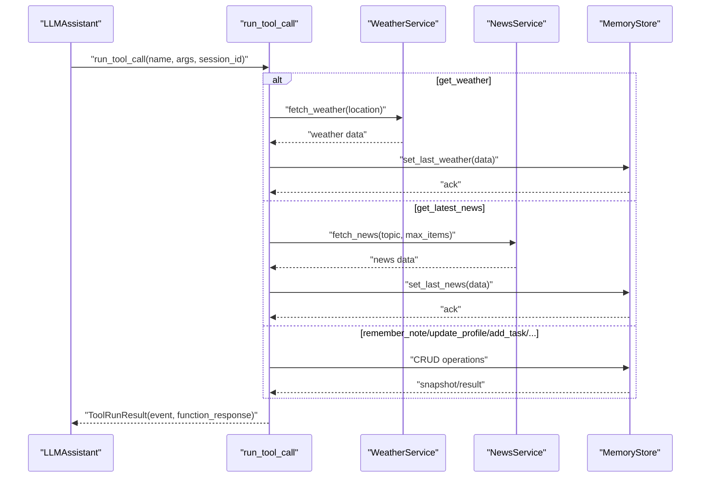

**Diagram sources**
- [backend/core/orbit_brain.py:389-502](file://backend/core/orbit_brain.py#L389-L502)
- [backend/core/memory_store.py:475-496](file://backend/core/memory_store.py#L475-L496)
- [backend/tools/weather.py:51-76](file://backend/tools/weather.py#L51-L76)
- [backend/tools/news.py:25-61](file://backend/tools/news.py#L25-L61)

**Section sources**
- [backend/core/orbit_brain.py:389-502](file://backend/core/orbit_brain.py#L389-L502)
- [backend/core/memory_store.py:475-496](file://backend/core/memory_store.py#L475-L496)

### Configuration and Environment
- Settings loads environment variables and exposes provider-specific keys and URLs.
- AssistantApplication reads Settings to configure providers and ports.

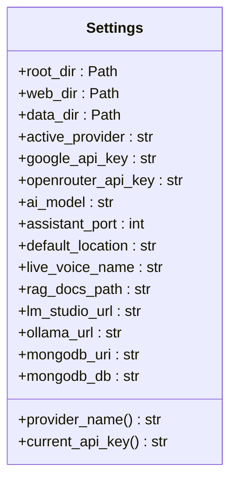

**Diagram sources**
- [backend/config.py:20-76](file://backend/config.py#L20-L76)

**Section sources**
- [backend/config.py:20-76](file://backend/config.py#L20-L76)

## Dependency Analysis
- Coupling:
  - AssistantApplication depends on all services and injects them into LLMAssistant.
  - LLMAssistant depends on MemoryStore, KnowledgeService, WebSearchService, WeatherService, and NewsService.
  - orbit_brain utilities are used by LLMAssistant to build instructions and run tools.
- Cohesion:
  - Each service encapsulates a single responsibility (memory, RAG, web search, weather, news).
- External dependencies:
  - MongoDB for persistence.
  - Web APIs for weather, news, and search providers.
  - Optional LM Studio embeddings for FAISS hybrid retrieval.

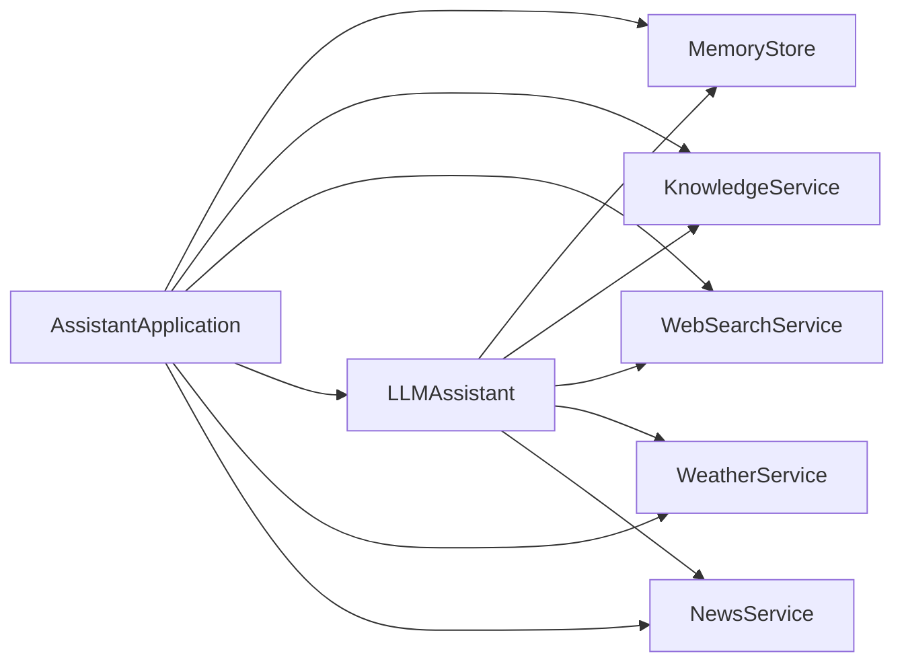

**Diagram sources**
- [backend/server.py:23-63](file://backend/server.py#L23-L63)
- [backend/api_clients/llm_client.py:38-46](file://backend/api_clients/llm_client.py#L38-L46)

**Section sources**
- [backend/server.py:23-63](file://backend/server.py#L23-L63)
- [backend/api_clients/llm_client.py:38-46](file://backend/api_clients/llm_client.py#L38-L46)

## Performance Considerations
- Tool loop limits: LLMAssistant enforces a maximum iteration count to prevent runaway tool calls.
- Provider timeouts: HTTP requests to external APIs use timeouts to avoid hanging.
- Embedding connectivity: KnowledgeService attempts to connect to LM Studio embeddings and gracefully falls back if unavailable.
- MongoDB indexing: MemoryStore ensures indexes for efficient queries on sessions, messages, tasks, notes, and knowledge chunks.
- Retrieval efficiency: Hybrid retrievers (BM25 + FAISS) improve recall; caching session retrievers avoids repeated construction.

[No sources needed since this section provides general guidance]

## Troubleshooting Guide
- Missing API keys:
  - LLMAssistant raises an error if the active provider’s API key is missing.
- Provider errors:
  - OpenRouter and Google API errors are caught and surfaced to the client.
- Tool/service failures:
  - WeatherError and NewsError propagate to the orchestration layer; run_tool_call catches and records errors as tool events.
- Web search failures:
  - WebSearchService tries Tavily first, then falls back to DuckDuckGo; if both fail, a WebSearchError is raised.
- Graceful degradation:
  - web_search_only and offline_mode flags adjust tool availability in build_rest_tools and provider logic.
- MongoDB connectivity:
  - MemoryStore initialization validates MongoDB connectivity and raises a clear error if unreachable.

**Section sources**
- [backend/api_clients/llm_client.py:60-62](file://backend/api_clients/llm_client.py#L60-L62)
- [backend/api_clients/llm_client.py:158-175](file://backend/api_clients/llm_client.py#L158-L175)
- [backend/api_clients/llm_client.py:316-324](file://backend/api_clients/llm_client.py#L316-L324)
- [backend/core/orbit_brain.py:490-493](file://backend/core/orbit_brain.py#L490-L493)
- [backend/tools/weather.py:125-127](file://backend/tools/weather.py#L125-L127)
- [backend/tools/news.py:77-83](file://backend/tools/news.py#L77-L83)
- [backend/tools/web_search.py:86-104](file://backend/tools/web_search.py#L86-L104)
- [backend/core/memory_store.py:86-99](file://backend/core/memory_store.py#L86-L99)

## Conclusion
The AssistantApplication orchestrates a robust, modular backend where LLMAssistant coordinates provider-specific logic, tool execution, and memory updates. Dependency injection and factory-like selection enable flexible provider switching, while graceful degradation and error propagation ensure resilient operation. MemoryStore, KnowledgeService, WeatherService, NewsService, and WebSearchService each encapsulate distinct responsibilities, enabling maintainability and scalability.