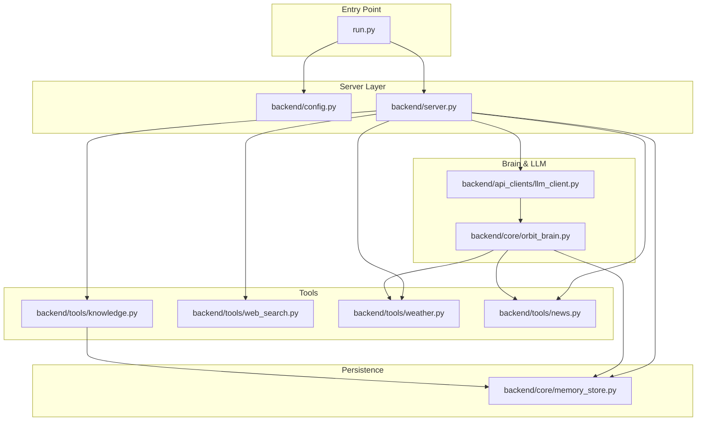
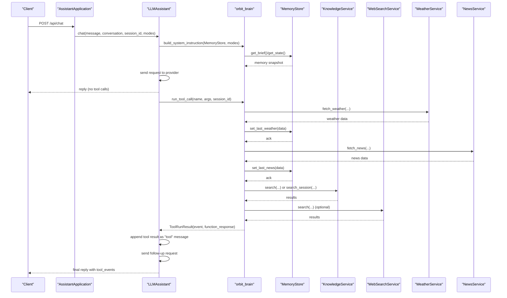
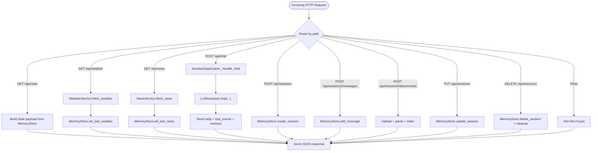
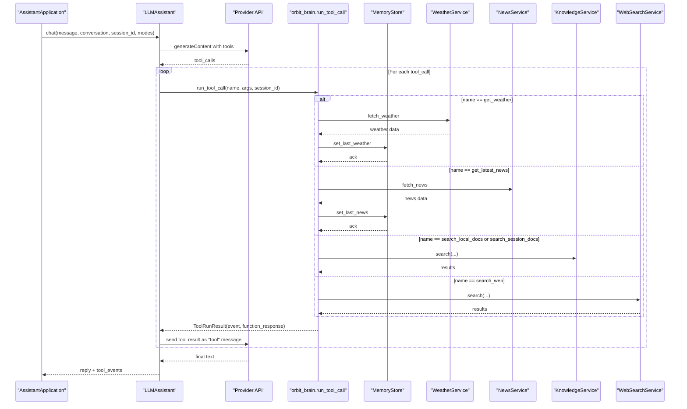
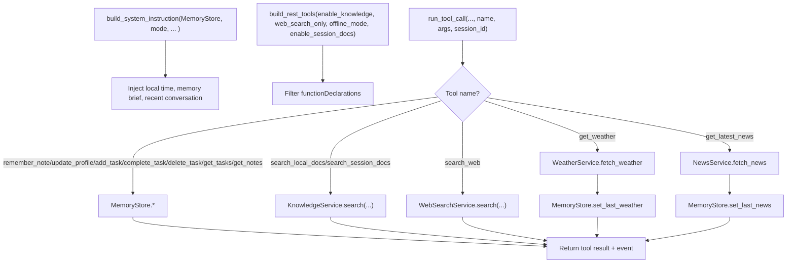
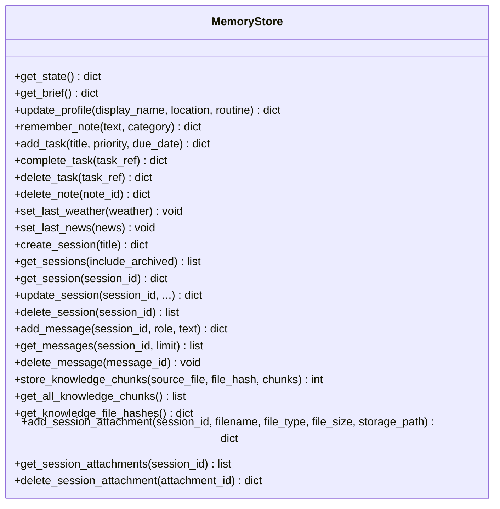
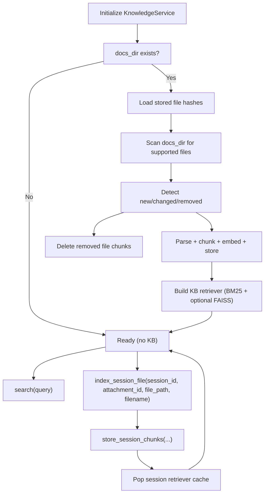
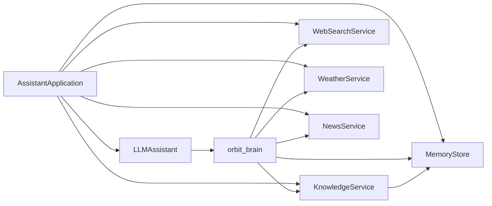

# Inter-Component Communication

<cite>
**Referenced Files in This Document**
- [README.md](file://README.md)
- [run.py](file://run.py)
- [backend/config.py](file://backend/config.py)
- [backend/server.py](file://backend/server.py)
- [backend/api_clients/llm_client.py](file://backend/api_clients/llm_client.py)
- [backend/core/orbit_brain.py](file://backend/core/orbit_brain.py)
- [backend/core/memory_store.py](file://backend/core/memory_store.py)
- [backend/tools/knowledge.py](file://backend/tools/knowledge.py)
- [backend/tools/weather.py](file://backend/tools/weather.py)
- [backend/tools/news.py](file://backend/tools/news.py)
- [backend/tools/web_search.py](file://backend/tools/web_search.py)
</cite>

## Table of Contents
1. [Introduction](#introduction)
2. [Project Structure](#project-structure)
3. [Core Components](#core-components)
4. [Architecture Overview](#architecture-overview)
5. [Detailed Component Analysis](#detailed-component-analysis)
6. [Dependency Analysis](#dependency-analysis)
7. [Performance Considerations](#performance-considerations)
8. [Troubleshooting Guide](#troubleshooting-guide)
9. [Conclusion](#conclusion)

## Introduction
This document explains how the backend components communicate to deliver a cohesive assistant experience. It focuses on how the AssistantApplication orchestrates data exchange among MemoryStore, KnowledgeService, WeatherService, NewsService, and LLMAssistant. It details message passing patterns, event propagation, state synchronization, and error handling strategies during chat processing. It also outlines performance optimization techniques and graceful fallbacks.

## Project Structure
The backend is organized into layers:
- Configuration and entry point
- HTTP server and API endpoints
- LLM client and brain logic
- Tools for external services
- Persistent memory store

**Diagram sources**
- [run.py:1-6](file://run.py#L1-L6)
- [backend/config.py:55-76](file://backend/config.py#L55-L76)
- [backend/server.py:23-63](file://backend/server.py#L23-L63)
- [backend/api_clients/llm_client.py:38-46](file://backend/api_clients/llm_client.py#L38-L46)
- [backend/core/orbit_brain.py:389-502](file://backend/core/orbit_brain.py#L389-L502)
- [backend/core/memory_store.py:67-118](file://backend/core/memory_store.py#L67-L118)
- [backend/tools/knowledge.py:88-140](file://backend/tools/knowledge.py#L88-L140)
- [backend/tools/weather.py:47-76](file://backend/tools/weather.py#L47-L76)
- [backend/tools/news.py:21-61](file://backend/tools/news.py#L21-L61)
- [backend/tools/web_search.py:53-104](file://backend/tools/web_search.py#L53-L104)

**Section sources**
- [README.md:164-201](file://README.md#L164-L201)
- [run.py:1-6](file://run.py#L1-L6)
- [backend/config.py:55-76](file://backend/config.py#L55-L76)

## Core Components
- AssistantApplication: Central orchestrator that composes MemoryStore, KnowledgeService, WeatherService, NewsService, WebSearchService, and LLMAssistant. It exposes HTTP endpoints and coordinates chat flows.
- LLMAssistant: LLM client that builds system instructions, manages tool-enabled conversations, and propagates tool events back to the LLM.
- orbit_brain: Provides system instruction construction, tool declarations, and tool dispatch logic.
- MemoryStore: MongoDB-backed persistence for sessions, messages, profile, tasks, notes, activity, and cached weather/news.
- KnowledgeService: Local RAG pipeline for persistent knowledge base and session-scoped document search.
- WeatherService and NewsService: External data retrieval services invoked via tool calls.
- WebSearchService: Live web search with Tavily and DuckDuckGo fallback.

**Section sources**
- [backend/server.py:23-63](file://backend/server.py#L23-L63)
- [backend/api_clients/llm_client.py:38-78](file://backend/api_clients/llm_client.py#L38-L78)
- [backend/core/orbit_brain.py:302-387](file://backend/core/orbit_brain.py#L302-L387)
- [backend/core/memory_store.py:67-118](file://backend/core/memory_store.py#L67-L118)
- [backend/tools/knowledge.py:88-140](file://backend/tools/knowledge.py#L88-L140)
- [backend/tools/weather.py:47-76](file://backend/tools/weather.py#L47-L76)
- [backend/tools/news.py:21-61](file://backend/tools/news.py#L21-L61)
- [backend/tools/web_search.py:53-104](file://backend/tools/web_search.py#L53-L104)

## Architecture Overview
The system follows a layered architecture:
- HTTP layer: AssistantApplication handles requests and delegates to services.
- Brain layer: orbit_brain constructs prompts and tool declarations; LLMAssistant executes tool calls and manages tool-result propagation.
- Persistence layer: MemoryStore synchronizes state across requests and tool invocations.
- Tools layer: WeatherService, NewsService, KnowledgeService, and WebSearchService provide external data and search capabilities.

**Diagram sources**
- [backend/server.py:276-321](file://backend/server.py#L276-L321)
- [backend/api_clients/llm_client.py:47-78](file://backend/api_clients/llm_client.py#L47-L78)
- [backend/core/orbit_brain.py:302-387](file://backend/core/orbit_brain.py#L302-L387)
- [backend/core/orbit_brain.py:389-502](file://backend/core/orbit_brain.py#L389-L502)
- [backend/core/memory_store.py:475-496](file://backend/core/memory_store.py#L475-L496)
- [backend/tools/weather.py:51-76](file://backend/tools/weather.py#L51-L76)
- [backend/tools/news.py:25-61](file://backend/tools/news.py#L25-L61)
- [backend/tools/knowledge.py:270-298](file://backend/tools/knowledge.py#L270-L298)
- [backend/tools/web_search.py:69-104](file://backend/tools/web_search.py#L69-L104)

## Detailed Component Analysis

### AssistantApplication: Orchestration and API Surface
- Initializes MemoryStore, KnowledgeService, WebSearchService, LLMAssistant, WeatherService, and NewsService.
- Exposes GET/POST/PUT/DELETE endpoints for sessions, messages, attachments, weather, news, and chat.
- Coordinates tool invocation and state updates, returning consistent JSON payloads and propagating tool events.

Key responsibilities:
- Endpoint routing and request parsing
- Chat orchestration via LLMAssistant
- State synchronization via MemoryStore
- Error propagation to clients

**Diagram sources**
- [backend/server.py:85-501](file://backend/server.py#L85-L501)
- [backend/server.py:276-321](file://backend/server.py#L276-L321)
- [backend/core/memory_store.py:579-646](file://backend/core/memory_store.py#L579-L646)
- [backend/tools/weather.py:51-76](file://backend/tools/weather.py#L51-L76)
- [backend/tools/news.py:25-61](file://backend/tools/news.py#L25-L61)

**Section sources**
- [backend/server.py:23-63](file://backend/server.py#L23-L63)
- [backend/server.py:85-501](file://backend/server.py#L85-L501)

### LLMAssistant: Tool-Enabled Conversation and Propagation
- Builds system instructions and messages for the selected provider.
- Supports multiple providers (OpenRouter-compatible, LM Studio, Ollama, Google REST).
- Manages tool-call loops, appending tool results back as “tool” messages to the LLM.
- Emits tool events for UI and state updates.

**Diagram sources**
- [backend/api_clients/llm_client.py:47-78](file://backend/api_clients/llm_client.py#L47-L78)
- [backend/api_clients/llm_client.py:128-216](file://backend/api_clients/llm_client.py#L128-L216)
- [backend/api_clients/llm_client.py:238-272](file://backend/api_clients/llm_client.py#L238-L272)
- [backend/core/orbit_brain.py:389-502](file://backend/core/orbit_brain.py#L389-L502)
- [backend/core/memory_store.py:475-496](file://backend/core/memory_store.py#L475-L496)

**Section sources**
- [backend/api_clients/llm_client.py:38-78](file://backend/api_clients/llm_client.py#L38-L78)
- [backend/api_clients/llm_client.py:128-216](file://backend/api_clients/llm_client.py#L128-L216)
- [backend/api_clients/llm_client.py:238-272](file://backend/api_clients/llm_client.py#L238-L272)

### orbit_brain: Prompt Building, Tool Declarations, and Dispatch
- Provides system instruction templates and dynamic tool declarations based on modes and availability.
- Implements run_tool_call to execute tools and update MemoryStore caches.
- Emits structured tool events for UI and state synchronization.

**Diagram sources**
- [backend/core/orbit_brain.py:302-387](file://backend/core/orbit_brain.py#L302-L387)
- [backend/core/orbit_brain.py:389-502](file://backend/core/orbit_brain.py#L389-L502)

**Section sources**
- [backend/core/orbit_brain.py:302-387](file://backend/core/orbit_brain.py#L302-L387)
- [backend/core/orbit_brain.py:389-502](file://backend/core/orbit_brain.py#L389-L502)

### MemoryStore: State Synchronization and Persistence
- Thread-safe MongoDB-backed store for sessions, messages, profile, tasks, notes, activity, cached weather/news, and knowledge chunks.
- Provides get_state/get_brief snapshots for system instructions and UI.
- Updates last weather/news cache and appends activity records.

**Diagram sources**
- [backend/core/memory_store.py:67-800](file://backend/core/memory_store.py#L67-L800)

**Section sources**
- [backend/core/memory_store.py:67-277](file://backend/core/memory_store.py#L67-L277)
- [backend/core/memory_store.py:475-496](file://backend/core/memory_store.py#L475-L496)

### KnowledgeService: Local RAG and Session Docs
- Initializes knowledge base from docs_dir and indexes via LangChain/FAISS/BM25.
- Stores chunks in MongoDB and builds retrievers for persistent and session-scoped searches.
- Lazily builds session retrievers and invalidates cache on file changes.

**Diagram sources**
- [backend/tools/knowledge.py:145-230](file://backend/tools/knowledge.py#L145-L230)
- [backend/tools/knowledge.py:303-335](file://backend/tools/knowledge.py#L303-L335)
- [backend/tools/knowledge.py:357-387](file://backend/tools/knowledge.py#L357-L387)

**Section sources**
- [backend/tools/knowledge.py:88-140](file://backend/tools/knowledge.py#L88-L140)
- [backend/tools/knowledge.py:270-298](file://backend/tools/knowledge.py#L270-L298)
- [backend/tools/knowledge.py:303-335](file://backend/tools/knowledge.py#L303-L335)
- [backend/tools/knowledge.py:357-387](file://backend/tools/knowledge.py#L357-L387)

### WeatherService and NewsService: Tool Execution
- WeatherService: Geocodes location, fetches forecast, and returns structured weather data.
- NewsService: Fetches RSS feeds, parses items, and returns headlines with timestamps.

Both services raise domain-specific exceptions that bubble up to the LLM client and are surfaced to the client.

**Section sources**
- [backend/tools/weather.py:47-76](file://backend/tools/weather.py#L47-L76)
- [backend/tools/weather.py:114-127](file://backend/tools/weather.py#L114-L127)
- [backend/tools/news.py:21-61](file://backend/tools/news.py#L21-L61)
- [backend/tools/news.py:69-82](file://backend/tools/news.py#L69-L82)

### WebSearchService: Live Search with Fallback
- Attempts Tavily search first; falls back to DuckDuckGo if Tavily is unavailable or fails.
- Returns structured results with title, link, and body.

**Section sources**
- [backend/tools/web_search.py:53-104](file://backend/tools/web_search.py#L53-L104)
- [backend/tools/web_search.py:106-139](file://backend/tools/web_search.py#L106-L139)

## Dependency Analysis
- AssistantApplication depends on MemoryStore, KnowledgeService, WebSearchService, WeatherService, NewsService, and LLMAssistant.
- LLMAssistant depends on orbit_brain for tool declarations and dispatch, and on external services for tool execution.
- orbit_brain depends on MemoryStore, WeatherService, NewsService, KnowledgeService, and WebSearchService.
- KnowledgeService depends on MemoryStore for persistence and LangChain/FAISS for retrieval.
- MemoryStore depends on MongoDB for persistence.

**Diagram sources**
- [backend/server.py:23-63](file://backend/server.py#L23-L63)
- [backend/api_clients/llm_client.py:38-46](file://backend/api_clients/llm_client.py#L38-L46)
- [backend/core/orbit_brain.py:389-502](file://backend/core/orbit_brain.py#L389-L502)
- [backend/tools/knowledge.py:88-140](file://backend/tools/knowledge.py#L88-L140)
- [backend/core/memory_store.py:67-118](file://backend/core/memory_store.py#L67-L118)

**Section sources**
- [backend/server.py:23-63](file://backend/server.py#L23-L63)
- [backend/api_clients/llm_client.py:38-46](file://backend/api_clients/llm_client.py#L38-L46)
- [backend/core/orbit_brain.py:389-502](file://backend/core/orbit_brain.py#L389-L502)
- [backend/tools/knowledge.py:88-140](file://backend/tools/knowledge.py#L88-L140)
- [backend/core/memory_store.py:67-118](file://backend/core/memory_store.py#L67-L118)

## Performance Considerations
- Tool loop limits: The LLM client enforces a maximum iteration count to prevent runaway tool calls.
- Lazy initialization: KnowledgeService initializes only when docs_dir is provided and builds retrievers lazily.
- Session-scoped retrievers: Cached per session and invalidated on attachment changes.
- Embedding fallback: If FAISS build fails, the system falls back to BM25-only retriever.
- Connection timeouts: HTTP requests to providers and external APIs use timeouts to avoid hanging.
- Activity trimming: MemoryStore trims activity entries to a fixed cap to control growth.

[No sources needed since this section provides general guidance]

## Troubleshooting Guide
Common failure scenarios and handling:
- Missing API key: LLM client raises a specific error when the active provider’s key is absent.
- Provider errors: HTTPError/URLError from provider APIs are caught and re-raised as LLMClientError with details.
- Tool errors: WeatherError/NewsError raised by WeatherService/NewsService are captured and emitted as tool events.
- Web search failures: WebSearchService tries Tavily first, then falls back to DuckDuckGo; if both fail, raises WebSearchError.
- Connection failures: MemoryStore fails fast if MongoDB is unreachable, raising a runtime error.
- Graceful fallbacks: Unsupported features return a standardized refusal message instead of crashing.

**Section sources**
- [backend/api_clients/llm_client.py:60-61](file://backend/api_clients/llm_client.py#L60-L61)
- [backend/api_clients/llm_client.py:161-174](file://backend/api_clients/llm_client.py#L161-L174)
- [backend/api_clients/llm_client.py:319-323](file://backend/api_clients/llm_client.py#L319-L323)
- [backend/tools/weather.py:125-127](file://backend/tools/weather.py#L125-L127)
- [backend/tools/news.py:80-82](file://backend/tools/news.py#L80-L82)
- [backend/core/memory_store.py:93-98](file://backend/core/memory_store.py#L93-L98)
- [backend/server.py:271-274](file://backend/server.py#L271-L274)

## Conclusion
The backend employs a clean separation of concerns: AssistantApplication orchestrates HTTP and tool flows, LLMAssistant manages provider-specific interactions and tool-result propagation, orbit_brain centralizes prompt building and tool dispatch, MemoryStore synchronizes state, and tools encapsulate external integrations. The system emphasizes robust error handling, graceful fallbacks, and performance-conscious design choices such as lazy initialization and caching.