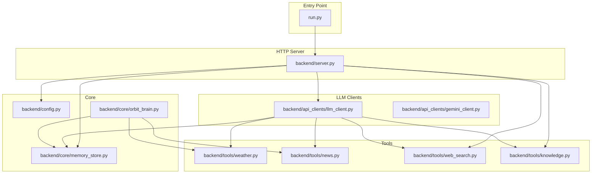
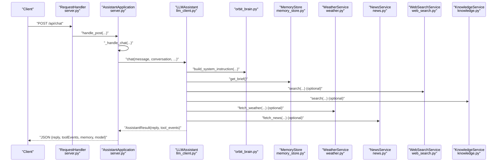
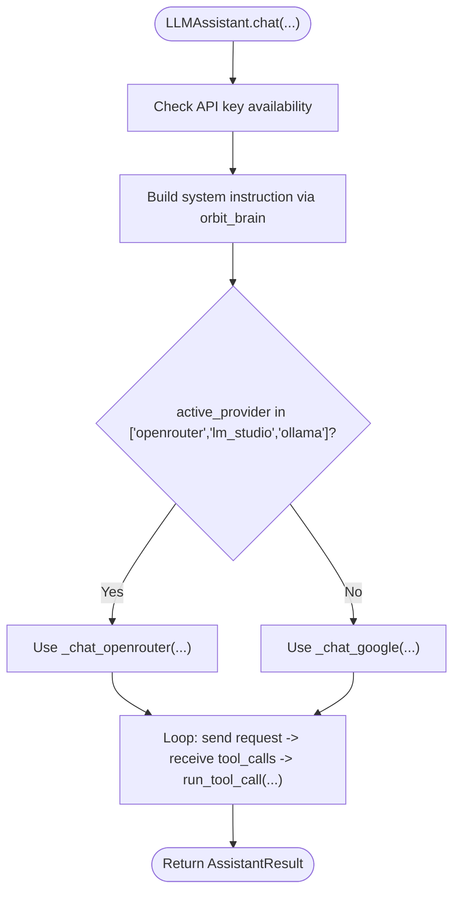
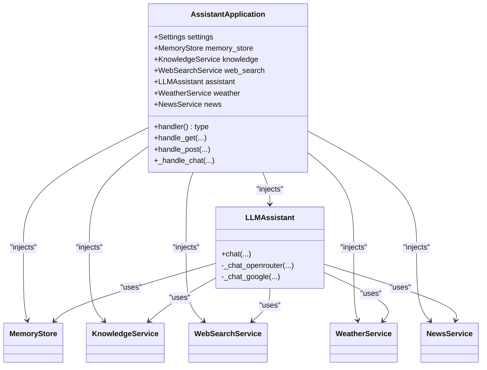
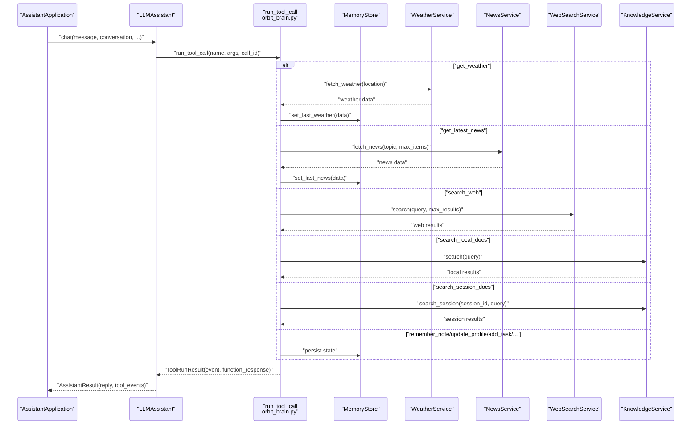
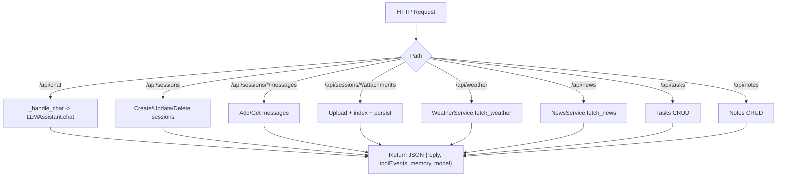
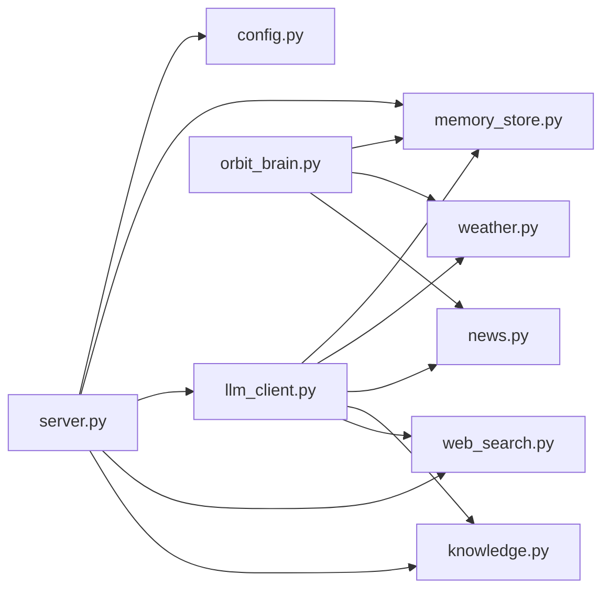

# Service Coordination Patterns

<cite>
**Referenced Files in This Document**
- [run.py](file://run.py)
- [server.py](file://backend/server.py)
- [config.py](file://backend/config.py)
- [llm_client.py](file://backend/api_clients/llm_client.py)
- [gemini_client.py](file://backend/api_clients/gemini_client.py)
- [memory_store.py](file://backend/core/memory_store.py)
- [orbit_brain.py](file://backend/core/orbit_brain.py)
- [knowledge.py](file://backend/tools/knowledge.py)
- [weather.py](file://backend/tools/weather.py)
- [news.py](file://backend/tools/news.py)
- [web_search.py](file://backend/tools/web_search.py)
- [README.md](file://README.md)
</cite>

## Table of Contents
1. [Introduction](#introduction)
2. [Project Structure](#project-structure)
3. [Core Components](#core-components)
4. [Architecture Overview](#architecture-overview)
5. [Detailed Component Analysis](#detailed-component-analysis)
6. [Dependency Analysis](#dependency-analysis)
7. [Performance Considerations](#performance-considerations)
8. [Troubleshooting Guide](#troubleshooting-guide)
9. [Conclusion](#conclusion)

## Introduction
This document explains the service coordination mechanisms within the AssistantApplication. It focuses on:
- Factory-like dynamic LLM client selection based on runtime configuration
- Dependency injection patterns used to initialize services and coordinate chat processing
- The sequential workflow that routes requests to handlers, interacts with tools, and aggregates responses
- How concurrency is handled, service state is managed, and graceful fallbacks are implemented when components fail

## Project Structure
The backend is organized into layered modules:
- Configuration and entry point
- HTTP server and request routing
- Core brain logic and persistent memory
- Tool services for weather, news, web search, and knowledge (RAG)
- LLM clients for multiple providers

**Diagram sources**
- [run.py:1-6](file://run.py#L1-L6)
- [server.py:23-63](file://backend/server.py#L23-L63)
- [config.py:20-76](file://backend/config.py#L20-L76)
- [memory_store.py:67-117](file://backend/core/memory_store.py#L67-L117)
- [orbit_brain.py:302-387](file://backend/core/orbit_brain.py#L302-L387)
- [knowledge.py:88-140](file://backend/tools/knowledge.py#L88-L140)
- [weather.py:47-76](file://backend/tools/weather.py#L47-L76)
- [news.py:21-60](file://backend/tools/news.py#L21-L60)
- [web_search.py:53-104](file://backend/tools/web_search.py#L53-L104)
- [llm_client.py:38-46](file://backend/api_clients/llm_client.py#L38-L46)
- [gemini_client.py:36-42](file://backend/api_clients/gemini_client.py#L36-L42)

**Section sources**
- [README.md:164-201](file://README.md#L164-L201)

## Core Components
- AssistantApplication orchestrates services and exposes HTTP endpoints. It initializes MemoryStore, KnowledgeService, WebSearchService, LLMAssistant, WeatherService, and NewsService, then delegates request handling to dedicated handlers.
- LLMAssistant encapsulates provider-agnostic chat orchestration, selecting the appropriate provider logic at runtime and coordinating tool calls.
- MemoryStore provides thread-safe persistence for sessions, messages, profile, tasks, notes, and caches.
- Tools (WeatherService, NewsService, WebSearchService, KnowledgeService) are injected into LLMAssistant and invoked via a unified dispatcher.
- orbit_brain defines system instructions, tool declarations, and the tool execution dispatcher.

**Section sources**
- [server.py:23-63](file://backend/server.py#L23-L63)
- [llm_client.py:38-78](file://backend/api_clients/llm_client.py#L38-L78)
- [memory_store.py:67-117](file://backend/core/memory_store.py#L67-L117)
- [orbit_brain.py:302-387](file://backend/core/orbit_brain.py#L302-L387)

## Architecture Overview
The system follows a layered architecture:
- HTTP layer: BaseHTTPRequestHandler subclasses route requests to AssistantApplication handlers
- Application layer: AssistantApplication composes services and delegates to LLMAssistant for chat
- Brain layer: orbit_brain builds system instructions and tool declarations
- Tool layer: Weather, News, Web Search, and Knowledge services provide external data
- Persistence layer: MemoryStore manages MongoDB collections with thread locks

**Diagram sources**
- [server.py:267-321](file://backend/server.py#L267-L321)
- [llm_client.py:47-78](file://backend/api_clients/llm_client.py#L47-L78)
- [orbit_brain.py:302-356](file://backend/core/orbit_brain.py#L302-L356)
- [memory_store.py:188-250](file://backend/core/memory_store.py#L188-L250)
- [web_search.py:69-104](file://backend/tools/web_search.py#L69-L104)
- [knowledge.py:270-298](file://backend/tools/knowledge.py#L270-L298)
- [weather.py:51-76](file://backend/tools/weather.py#L51-L76)
- [news.py:25-60](file://backend/tools/news.py#L25-L60)

## Detailed Component Analysis

### Factory Pattern for Dynamic LLM Client Selection
- At runtime, AssistantApplication constructs LLMAssistant with injected dependencies (MemoryStore, KnowledgeService, WebSearchService).
- LLMAssistant selects provider logic based on active provider configuration:
  - For OpenRouter-compatible providers (OpenRouter, LM Studio, Ollama), it uses a dedicated chat method that builds tool declarations and executes tool calls.
  - For Google Gemini, it uses a separate method tailored to Gemini’s REST API format.
- This is a runtime factory-like selection based on Settings.active_provider.

**Diagram sources**
- [llm_client.py:38-78](file://backend/api_clients/llm_client.py#L38-L78)
- [llm_client.py:82-216](file://backend/api_clients/llm_client.py#L82-L216)
- [llm_client.py:220-273](file://backend/api_clients/llm_client.py#L220-L273)
- [orbit_brain.py:302-356](file://backend/core/orbit_brain.py#L302-L356)

**Section sources**
- [llm_client.py:38-78](file://backend/api_clients/llm_client.py#L38-L78)
- [llm_client.py:82-216](file://backend/api_clients/llm_client.py#L82-L216)
- [llm_client.py:220-273](file://backend/api_clients/llm_client.py#L220-L273)

### Dependency Injection Patterns
- AssistantApplication injects dependencies into LLMAssistant and other services during construction:
  - MemoryStore for persistent state
  - KnowledgeService for RAG
  - WebSearchService for live web search
  - WeatherService and NewsService for local tools
- LLMAssistant receives these dependencies and uses them to execute tool calls through a unified dispatcher.

**Diagram sources**
- [server.py:23-63](file://backend/server.py#L23-L63)
- [llm_client.py:38-46](file://backend/api_clients/llm_client.py#L38-L46)
- [memory_store.py:67-117](file://backend/core/memory_store.py#L67-L117)
- [knowledge.py:88-108](file://backend/tools/knowledge.py#L88-L108)
- [weather.py:47-50](file://backend/tools/weather.py#L47-L50)
- [news.py:21-23](file://backend/tools/news.py#L21-L23)
- [web_search.py:53-61](file://backend/tools/web_search.py#L53-L61)

**Section sources**
- [server.py:23-63](file://backend/server.py#L23-L63)
- [llm_client.py:38-46](file://backend/api_clients/llm_client.py#L38-L46)

### Sequential Workflow for Chat Processing
- The chat pipeline:
  - Request arrives at AssistantApplication._handle_chat
  - LLMAssistant.chat builds system instructions and messages
  - For each tool call returned by the LLM:
    - orbit_brain.run_tool_call dispatches to the appropriate tool
    - Tool results are appended back into the conversation
  - Final reply and tool events are returned to the client

**Diagram sources**
- [server.py:267-321](file://backend/server.py#L267-L321)
- [llm_client.py:185-215](file://backend/api_clients/llm_client.py#L185-L215)
- [orbit_brain.py:389-501](file://backend/core/orbit_brain.py#L389-L501)
- [weather.py:51-76](file://backend/tools/weather.py#L51-L76)
- [news.py:25-60](file://backend/tools/news.py#L25-L60)
- [web_search.py:69-104](file://backend/tools/web_search.py#L69-L104)
- [knowledge.py:270-298](file://backend/tools/knowledge.py#L270-L298)
- [memory_store.py:475-496](file://backend/core/memory_store.py#L475-L496)

**Section sources**
- [server.py:267-321](file://backend/server.py#L267-L321)
- [llm_client.py:185-215](file://backend/api_clients/llm_client.py#L185-L215)
- [orbit_brain.py:389-501](file://backend/core/orbit_brain.py#L389-L501)

### Request Handling Pipeline and Routing
- AssistantApplication defines a RequestHandler subclass that delegates to handle_get, handle_post, handle_put, handle_delete.
- Endpoints route to:
  - Session/message management
  - Attachment upload and indexing
  - Weather and news retrieval
  - Chat processing via LLMAssistant
- The pipeline validates inputs, invokes services, and returns JSON responses with appropriate HTTP status codes.

**Diagram sources**
- [server.py:85-168](file://backend/server.py#L85-L168)
- [server.py:169-266](file://backend/server.py#L169-L266)
- [server.py:267-321](file://backend/server.py#L267-L321)

**Section sources**
- [server.py:85-168](file://backend/server.py#L85-L168)
- [server.py:169-266](file://backend/server.py#L169-L266)
- [server.py:267-321](file://backend/server.py#L267-L321)

### Concurrent Operations, State Management, and Fallbacks
- Concurrency and state:
  - MemoryStore uses a threading.Lock to guard all write operations, ensuring thread-safe access to MongoDB collections.
  - KnowledgeService uses a lock for session retriever caching to prevent race conditions when rebuilding retrievers.
- Graceful fallbacks:
  - On unsupported features (e.g., image generation), the server returns a standardized refusal message instead of failing.
  - On LLM client errors, the server returns a 502 Bad Gateway with the error message.
  - Web search falls back from Tavily to DuckDuckGo when Tavily is unavailable.
  - Weather and News services wrap network errors into specific exceptions handled by the server.

**Section sources**
- [memory_store.py:84](file://backend/core/memory_store.py#L84)
- [memory_store.py:194-250](file://backend/core/memory_store.py#L194-L250)
- [knowledge.py:108](file://backend/tools/knowledge.py#L108)
- [knowledge.py:357-387](file://backend/tools/knowledge.py#L357-L387)
- [server.py:271-275](file://backend/server.py#L271-L275)
- [server.py:308-310](file://backend/server.py#L308-L310)
- [web_search.py:86-104](file://backend/tools/web_search.py#L86-L104)
- [weather.py:125-126](file://backend/tools/weather.py#L125-L126)
- [news.py:80-82](file://backend/tools/news.py#L80-L82)

## Dependency Analysis
- Coupling and cohesion:
  - LLMAssistant depends on MemoryStore, WeatherService, NewsService, KnowledgeService, and WebSearchService. This centralizes tool invocation via orbit_brain.run_tool_call.
  - AssistantApplication composes services and delegates to LLMAssistant, keeping HTTP concerns separate.
- External dependencies:
  - MongoDB driver for persistence
  - Web APIs for weather, news, and web search
  - Optional local LLM embedding and vector stores for RAG

**Diagram sources**
- [server.py:14-21](file://backend/server.py#L14-L21)
- [llm_client.py:11-21](file://backend/api_clients/llm_client.py#L11-L21)
- [memory_store.py:11-14](file://backend/core/memory_store.py#L11-L14)
- [orbit_brain.py:9-12](file://backend/core/orbit_brain.py#L9-L12)

**Section sources**
- [server.py:14-21](file://backend/server.py#L14-L21)
- [llm_client.py:11-21](file://backend/api_clients/llm_client.py#L11-L21)
- [memory_store.py:11-14](file://backend/core/memory_store.py#L11-L14)
- [orbit_brain.py:9-12](file://backend/core/orbit_brain.py#L9-L12)

## Performance Considerations
- Thread-safety: MemoryStore and KnowledgeService use locks to serialize writes, preventing contention under concurrent requests.
- Tool loop limits: LLMAssistant enforces a maximum iteration count to avoid infinite loops when tool calls are requested repeatedly.
- RAG initialization: KnowledgeService lazily builds retrievers and caches them per session to avoid repeated heavy computations.
- Network timeouts: LLM and tool services set timeouts to avoid hanging requests.

[No sources needed since this section provides general guidance]

## Troubleshooting Guide
Common issues and resolutions:
- Missing API key:
  - Symptom: LLM client raises an error indicating missing API key.
  - Resolution: Set the appropriate key in the .env file for the selected provider.
- Provider unavailability:
  - Symptom: HTTP 502 or provider-specific error messages.
  - Resolution: Verify provider endpoints, keys, and network connectivity; check fallbacks (e.g., DuckDuckGo).
- Tool failures:
  - Symptom: Tool errors reported in tool events.
  - Resolution: Inspect tool-specific services (WeatherService, NewsService, WebSearchService) for exceptions and logs.
- MongoDB connection failure:
  - Symptom: Startup/Runtime error indicating inability to connect to MongoDB.
  - Resolution: Ensure MongoDB is running and reachable; verify URI and credentials.

**Section sources**
- [llm_client.py:34](file://backend/api_clients/llm_client.py#L34)
- [server.py:308-310](file://backend/server.py#L308-L310)
- [web_search.py:86-104](file://backend/tools/web_search.py#L86-L104)
- [weather.py:125-126](file://backend/tools/weather.py#L125-L126)
- [news.py:80-82](file://backend/tools/news.py#L80-L82)
- [memory_store.py:94-98](file://backend/core/memory_store.py#L94-L98)

## Conclusion
The AssistantApplication demonstrates robust service coordination through:
- Runtime provider selection via a factory-like pattern in LLMAssistant
- Clear dependency injection of services into LLMAssistant and tools
- A well-defined sequential workflow that integrates LLM responses with tool invocations
- Strong concurrency controls and graceful fallbacks for resilience
These patterns enable a flexible, extensible architecture that supports multiple providers, tools, and modes of operation.