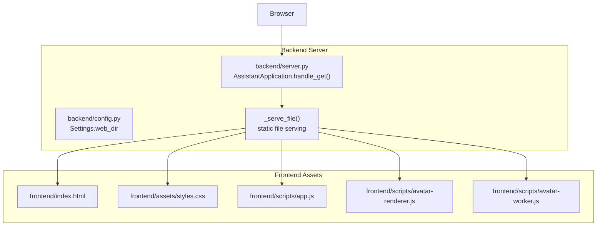
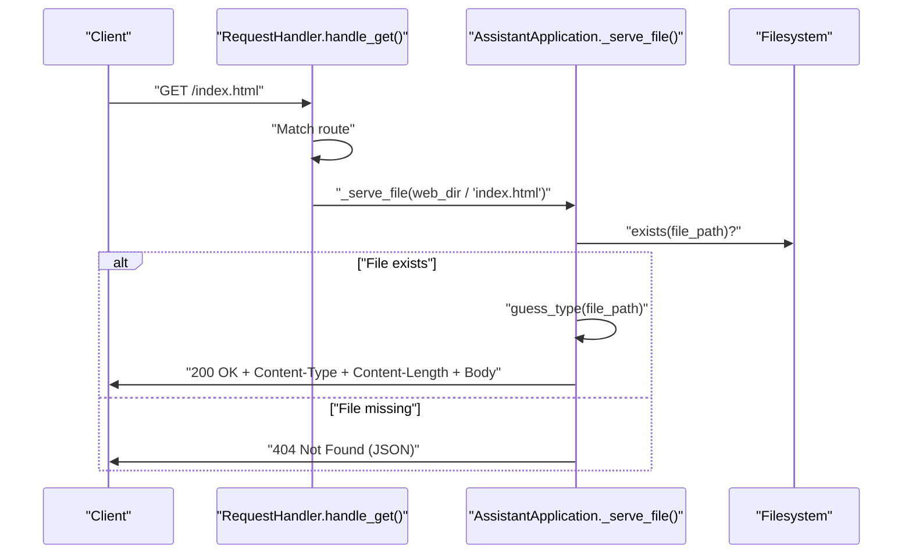
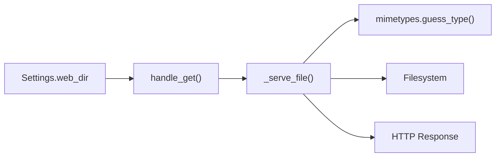

# File Serving and Asset Delivery

<cite>
**Referenced Files in This Document**
- [run.py](file://run.py)
- [backend/server.py](file://backend/server.py)
- [backend/config.py](file://backend/config.py)
- [frontend/index.html](file://frontend/index.html)
- [frontend/assets/styles.css](file://frontend/assets/styles.css)
- [frontend/scripts/app.js](file://frontend/scripts/app.js)
- [frontend/scripts/avatar-renderer.js](file://frontend/scripts/avatar-renderer.js)
- [frontend/scripts/avatar-worker.js](file://frontend/scripts/avatar-worker.js)
</cite>

## Table of Contents
1. [Introduction](#introduction)
2. [Project Structure](#project-structure)
3. [Core Components](#core-components)
4. [Architecture Overview](#architecture-overview)
5. [Detailed Component Analysis](#detailed-component-analysis)
6. [Dependency Analysis](#dependency-analysis)
7. [Performance Considerations](#performance-considerations)
8. [Troubleshooting Guide](#troubleshooting-guide)
9. [Conclusion](#conclusion)

## Introduction
This document explains the file serving and asset delivery system for the frontend resources. It covers how static assets (HTML, CSS, JavaScript, and avatar-related files) are served to the browser, including MIME type detection, file existence validation, HTTP response headers, and the directory structure used by the server. It also details the internal `_serve_file` method, error handling for missing files, and practical examples of serving different asset types.

## Project Structure
The frontend assets are organized under the frontend directory. The backend server resolves requests to these assets using a predefined mapping and serves them directly from the filesystem.

**Diagram sources**
- [backend/config.py:61](file://backend/config.py#L61)
- [backend/server.py:85-104](file://backend/server.py#L85-L104)
- [backend/server.py:522-533](file://backend/server.py#L522-L533)

**Section sources**
- [backend/config.py:61](file://backend/config.py#L61)
- [backend/server.py:85-104](file://backend/server.py#L85-L104)

## Core Components
- Static file routing: The server maps specific URLs to files under the configured web directory.
- MIME type detection: The server uses mimetypes.guess_type to infer the Content-Type header.
- File existence validation: The server checks if the target file exists before serving.
- HTTP response construction: The server sets Content-Type, Content-Length, and writes the file bytes to the response stream.
- Asset directory structure: The server expects assets under frontend/index.html, frontend/assets/styles.css, and frontend/scripts/*.js.

Key implementation references:
- URL-to-file mapping for static assets: [backend/server.py:89-104](file://backend/server.py#L89-L104)
- Static file serving method: [_serve_file:522-533](file://backend/server.py#L522-L533)
- Web directory configuration: [backend/config.py:61](file://backend/config.py#L61)

**Section sources**
- [backend/server.py:89-104](file://backend/server.py#L89-L104)
- [backend/server.py:522-533](file://backend/server.py#L522-L533)
- [backend/config.py:61](file://backend/config.py#L61)

## Architecture Overview
The static file serving pipeline is straightforward:
- The client requests a URL.
- The server’s GET handler parses the path and routes it to the appropriate static file.
- The server validates the file’s existence and determines its MIME type.
- The server sends an HTTP 200 OK response with appropriate headers and the file content.

**Diagram sources**
- [backend/server.py:85-104](file://backend/server.py#L85-L104)
- [backend/server.py:522-533](file://backend/server.py#L522-L533)

## Detailed Component Analysis

### Static File Routing
The server handles several static routes explicitly:
- "/" and "/index.html" map to frontend/index.html
- "/styles.css" maps to frontend/assets/styles.css
- "/app.js" maps to frontend/scripts/app.js
- "/avatar-worker.js" maps to frontend/scripts/avatar-worker.js
- "/avatar-renderer.js" maps to frontend/scripts/avatar-renderer.js

These routes are defined in the GET handler and call the shared _serve_file method.

**Section sources**
- [backend/server.py:89-104](file://backend/server.py#L89-L104)

### MIME Type Detection and Headers
The server uses mimetypes.guess_type to detect the MIME type for each file. It then sets:
- Content-Type: mime_type or application/octet-stream if unknown
- Content-Length: length of the file bytes
- Response body: the raw file bytes

This ensures the browser interprets assets correctly (e.g., CSS as text/css, JS as application/javascript, HTML as text/html).

**Section sources**
- [backend/server.py:522-533](file://backend/server.py#L522-L533)

### File Existence Validation and Error Handling
If the requested file does not exist, the server responds with HTTP 404 and a JSON error payload. This prevents the server from attempting to serve non-existent files and provides a consistent error response.

**Section sources**
- [backend/server.py:522-533](file://backend/server.py#L522-L533)

### Asset Directory Structure and Path Resolution
The server resolves static assets relative to the configured web directory. The web directory defaults to the frontend directory under the project root. The server constructs the full path by joining the web directory with the requested asset path.

- Web directory setting: [backend/config.py:61](file://backend/config.py#L61)
- Route mapping and path construction: [backend/server.py:89-104](file://backend/server.py#L89-L104)

Examples of served assets:
- HTML: frontend/index.html
- CSS: frontend/assets/styles.css
- JavaScript: frontend/scripts/app.js, frontend/scripts/avatar-worker.js, frontend/scripts/avatar-renderer.js

**Section sources**
- [backend/config.py:61](file://backend/config.py#L61)
- [backend/server.py:89-104](file://backend/server.py#L89-L104)

### Avatar-Related Assets
The frontend uses two JavaScript files for avatar animation:
- avatar-worker.js: A Web Worker that computes avatar animation frames and posts them to the main thread.
- avatar-renderer.js: A Canvas-based renderer that draws the avatar and applies state changes from the worker.

The app initializes the avatar worker and updates CSS custom properties to reflect the avatar state.

- Worker initialization and state updates: [frontend/scripts/app.js:538-554](file://frontend/scripts/app.js#L538-L554)
- Worker implementation: [frontend/scripts/avatar-worker.js:1-48](file://frontend/scripts/avatar-worker.js#L1-L48)
- Renderer implementation: [frontend/scripts/avatar-renderer.js:1-106](file://frontend/scripts/avatar-renderer.js#L1-L106)

**Section sources**
- [frontend/scripts/app.js:538-554](file://frontend/scripts/app.js#L538-L554)
- [frontend/scripts/avatar-worker.js:1-48](file://frontend/scripts/avatar-worker.js#L1-L48)
- [frontend/scripts/avatar-renderer.js:1-106](file://frontend/scripts/avatar-renderer.js#L1-L106)

### Serving Different File Types
Below are examples of how different asset types are served:

- HTML
  - Request: "/"
  - Route: [backend/server.py:90](file://backend/server.py#L90)
  - File: frontend/index.html
  - MIME type: text/html

- CSS
  - Request: "/styles.css"
  - Route: [backend/server.py:93](file://backend/server.py#L93)
  - File: frontend/assets/styles.css
  - MIME type: text/css

- JavaScript (main app)
  - Request: "/app.js"
  - Route: [backend/server.py:96](file://backend/server.py#L96)
  - File: frontend/scripts/app.js
  - MIME type: application/javascript

- JavaScript (avatar worker)
  - Request: "/avatar-worker.js"
  - Route: [backend/server.py:99](file://backend/server.py#L99)
  - File: frontend/scripts/avatar-worker.js
  - MIME type: application/javascript

- JavaScript (avatar renderer)
  - Request: "/avatar-renderer.js"
  - Route: [backend/server.py:102](file://backend/server.py#L102)
  - File: frontend/scripts/avatar-renderer.js
  - MIME type: application/javascript

**Section sources**
- [backend/server.py:89-104](file://backend/server.py#L89-L104)

### Handling File Not Found Scenarios
If a requested asset does not exist, the server responds with HTTP 404 and a JSON error payload. This is handled inside the _serve_file method by checking file existence and sending a JSON error response when the file is missing.

- Not found handling: [backend/server.py:523-525](file://backend/server.py#L523-L525)

**Section sources**
- [backend/server.py:523-525](file://backend/server.py#L523-L525)

### Optimizing Asset Delivery Performance
- Single-threaded HTTP server: The server uses Python’s ThreadingHTTPServer, which is suitable for development and small-scale usage. For production, consider a reverse proxy or a production WSGI server to offload static file serving and improve concurrency.
- Content-Type correctness: Using mimetypes.guess_type ensures browsers apply appropriate caching and rendering behavior.
- Minimal overhead: The server performs a simple filesystem check and streams the file bytes directly to the client.

[No sources needed since this section provides general guidance]

## Dependency Analysis
The static file serving depends on:
- Settings.web_dir for locating the frontend directory
- mimetypes module for MIME type detection
- Pathlib.Path for safe path construction
- HTTPResponse helpers for sending JSON errors and binary content

**Diagram sources**
- [backend/config.py:61](file://backend/config.py#L61)
- [backend/server.py:85-104](file://backend/server.py#L85-L104)
- [backend/server.py:522-533](file://backend/server.py#L522-L533)

**Section sources**
- [backend/config.py:61](file://backend/config.py#L61)
- [backend/server.py:85-104](file://backend/server.py#L85-L104)
- [backend/server.py:522-533](file://backend/server.py#L522-L533)

## Performance Considerations
- Concurrency: ThreadingHTTPServer is single-threaded for serving. For higher throughput, deploy behind a reverse proxy or use a production server.
- Caching: Add ETag or Last-Modified headers and leverage browser caching for static assets.
- Compression: Enable gzip/deflate for text assets (CSS/JS/HTML) to reduce bandwidth.
- CDN: Serve static assets via a CDN for global distribution and reduced latency.

[No sources needed since this section provides general guidance]

## Troubleshooting Guide
Common issues and resolutions:
- 404 Not Found
  - Cause: Requested asset does not exist at the expected path.
  - Resolution: Verify the asset exists under the configured web directory and that the route matches the intended file.

- Incorrect MIME Type
  - Cause: Unknown file extension or missing MIME type mapping.
  - Resolution: Ensure the file extension is recognized by the system or adjust the server to handle custom extensions.

- Permission Denied
  - Cause: The server process lacks read permissions for the asset file.
  - Resolution: Grant read access to the file or run the server with appropriate privileges.

- Wrong Root Directory
  - Cause: Settings.web_dir points to an incorrect path.
  - Resolution: Confirm the web directory setting and ensure frontend assets are placed under the configured directory.

**Section sources**
- [backend/server.py:522-533](file://backend/server.py#L522-L533)
- [backend/config.py:61](file://backend/config.py#L61)

## Conclusion
The file serving and asset delivery system is intentionally simple and robust. It maps specific URLs to frontend assets, validates file existence, detects MIME types, and returns appropriate HTTP responses. While suitable for development and small deployments, consider adding caching, compression, and a reverse proxy for production environments to optimize performance and scalability.