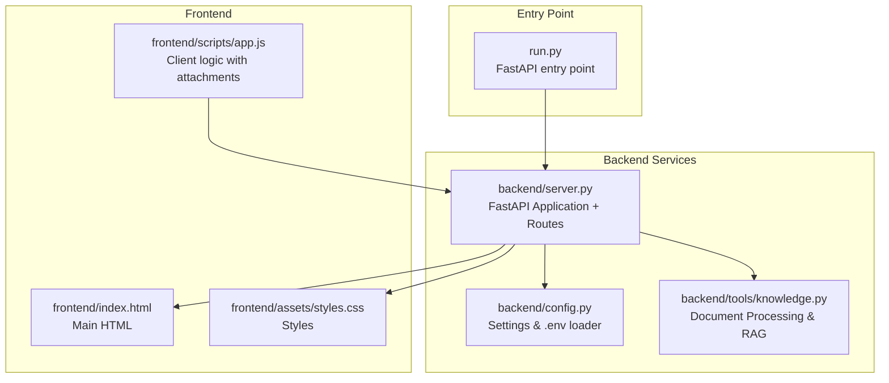
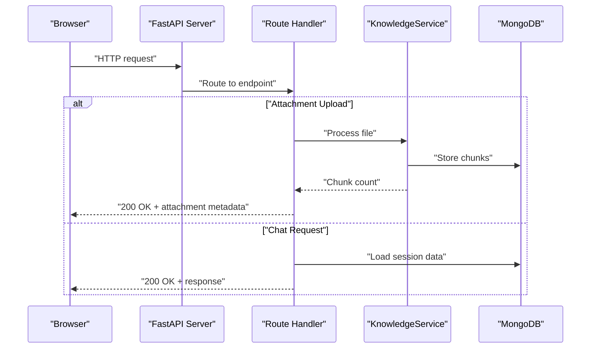
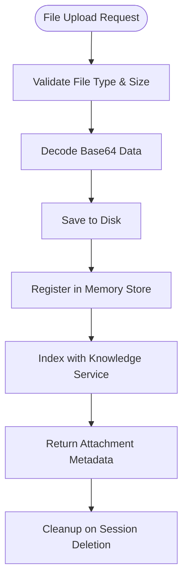
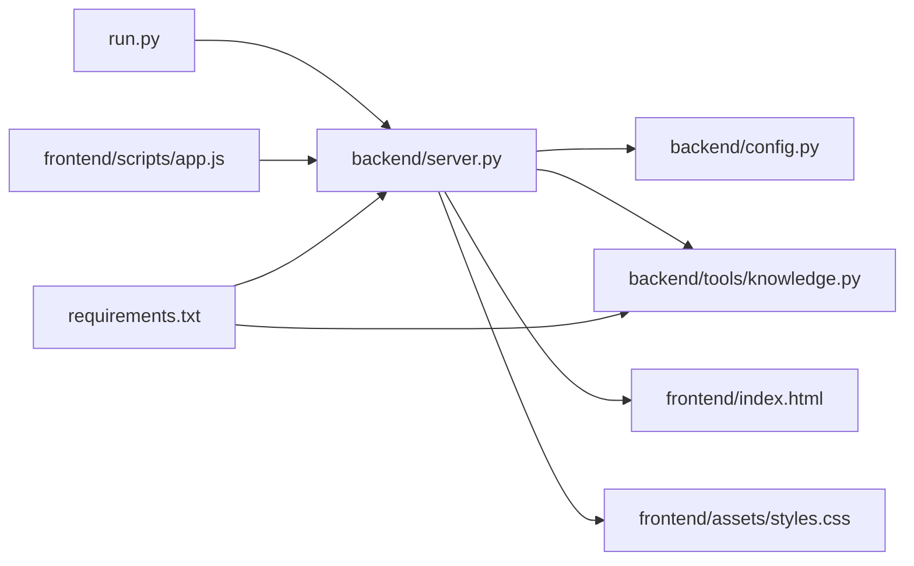

# HTTP Server Implementation

<cite>
**Referenced Files in This Document**
- [run.py](file://run.py)
- [backend/server.py](file://backend/server.py)
- [backend/config.py](file://backend/config.py)
- [backend/tools/knowledge.py](file://backend/tools/knowledge.py)
- [frontend/index.html](file://frontend/index.html)
- [frontend/assets/styles.css](file://frontend/assets/styles.css)
- [frontend/scripts/app.js](file://frontend/scripts/app.js)
- [requirements.txt](file://requirements.txt)
</cite>

## Update Summary
**Changes Made**
- Updated from ThreadingHTTPServer to FastAPI implementation
- Enhanced attachment upload handlers with base64 encoding and file processing
- Improved session management with knowledge service integration
- Added hybrid mode configuration and RAG (Retrieval-Augmented Generation) capabilities
- Integrated KnowledgeService for document parsing, chunking, and search
- Added comprehensive file attachment support with validation and indexing

## Table of Contents
1. [Introduction](#introduction)
2. [Project Structure](#project-structure)
3. [Core Components](#core-components)
4. [Architecture Overview](#architecture-overview)
5. [Detailed Component Analysis](#detailed-component-analysis)
6. [Enhanced Attachment Processing](#enhanced-attachment-processing)
7. [Hybrid Mode and RAG Integration](#hybrid-mode-and-rag-integration)
8. [Dependency Analysis](#dependency-analysis)
9. [Performance Considerations](#performance-considerations)
10. [Troubleshooting Guide](#troubleshooting-guide)
11. [Conclusion](#conclusion)

## Introduction
This document explains the HTTP server implementation powering the Orbit Virtual Assistant, now built on FastAPI with enhanced capabilities for file attachment processing, knowledge service integration, and hybrid AI model routing. The server provides a modern, scalable REST API with comprehensive session management, real-time attachment processing, and intelligent document indexing for Retrieval-Augmented Generation (RAG).

## Project Structure
The HTTP server is implemented using FastAPI with integrated knowledge processing capabilities. The architecture supports concurrent request handling, intelligent document processing, and seamless integration with MongoDB for persistent storage.

**Diagram sources**
- [run.py:1-6](file://run.py#L1-L6)
- [backend/server.py:60-61](file://backend/server.py#L60-L61)
- [backend/config.py:61-87](file://backend/config.py#L61-L87)
- [backend/tools/knowledge.py:88-141](file://backend/tools/knowledge.py#L88-L141)
- [frontend/index.html:1-352](file://frontend/index.html#L1-L352)
- [frontend/scripts/app.js:1642-1726](file://frontend/scripts/app.js#L1642-L1726)

**Section sources**
- [run.py:1-6](file://run.py#L1-L6)
- [backend/server.py:60-61](file://backend/server.py#L60-L61)
- [backend/config.py:61-87](file://backend/config.py#L61-L87)
- [backend/tools/knowledge.py:88-141](file://backend/tools/knowledge.py#L88-L141)
- [frontend/index.html:1-352](file://frontend/index.html#L1-L352)
- [frontend/scripts/app.js:1642-1726](file://frontend/scripts/app.js#L1642-L1726)

## Core Components
- **FastAPI Application**: Modern asynchronous web framework providing automatic OpenAPI documentation, request validation, and dependency injection.
- **KnowledgeService Integration**: Comprehensive document processing pipeline supporting PDF, DOCX, TXT, MD, CSV, JSON, and image files with intelligent chunking and indexing.
- **Attachment Processing Pipeline**: Base64 decoding, file validation, secure storage, and automatic indexing for search capabilities.
- **Hybrid Mode Configuration**: Dynamic AI model routing with configurable providers and models for optimal performance.
- **MongoDB Integration**: Persistent storage for sessions, messages, attachments, and knowledge chunks with efficient querying.
- **Static File Serving**: Optimized delivery of frontend assets with proper caching headers.

**Section sources**
- [backend/server.py:60-61](file://backend/server.py#L60-L61)
- [backend/server.py:98-103](file://backend/server.py#L98-L103)
- [backend/server.py:220-247](file://backend/server.py#L220-L247)
- [backend/config.py:39-43](file://backend/config.py#L39-L43)
- [backend/tools/knowledge.py:88-141](file://backend/tools/knowledge.py#L88-L141)

## Architecture Overview
The server architecture follows a layered approach with FastAPI providing the HTTP interface, KnowledgeService handling document processing, and MongoDB managing persistent storage. The system supports concurrent requests, intelligent document indexing, and dynamic AI model routing.

**Diagram sources**
- [backend/server.py:220-247](file://backend/server.py#L220-L247)
- [backend/tools/knowledge.py:304-336](file://backend/tools/knowledge.py#L304-L336)
- [backend/server.py:165-198](file://backend/server.py#L165-L198)

## Detailed Component Analysis

### FastAPI Application Setup
The server uses FastAPI for modern web development with automatic OpenAPI documentation, request validation, and dependency injection. The application is initialized with proper CORS settings and includes comprehensive error handling.

**Section sources**
- [backend/server.py:60-61](file://backend/server.py#L60-L61)
- [backend/server.py:274-326](file://backend/server.py#L274-L326)

### Request Routing System
The routing system is organized around FastAPI decorators with comprehensive path parameters and query string handling:

- **Session Management**: `/api/sessions` with CRUD operations for chat sessions
- **Message Handling**: `/api/sessions/{session_id}/messages` for conversation history
- **Attachment Processing**: `/api/sessions/{session_id}/attachments` for file uploads
- **AI Chat**: `/api/chat` for LLM interactions with hybrid mode support
- **Utility Endpoints**: `/api/weather`, `/api/news`, `/api/state` for system information

**Section sources**
- [backend/server.py:129-167](file://backend/server.py#L129-L167)
- [backend/server.py:220-247](file://backend/server.py#L220-L247)
- [backend/server.py:165-198](file://backend/server.py#L165-L198)
- [backend/server.py:201-217](file://backend/server.py#L201-L217)
- [backend/server.py:113-125](file://backend/server.py#L113-L125)

### Static File Serving
Static assets are served efficiently using FastAPI's StaticFiles mounting with proper MIME type detection and caching headers.

**Section sources**
- [backend/server.py:249-271](file://backend/server.py#L249-L271)

### Session Management Endpoints
Enhanced session management with comprehensive CRUD operations and integration with the knowledge service for document cleanup.

**Section sources**
- [backend/server.py:129-167](file://backend/server.py#L129-L167)

### API Endpoint Handlers
Comprehensive API endpoints with Pydantic model validation, error handling, and integration with external services.

**Section sources**
- [backend/server.py:113-125](file://backend/server.py#L113-L125)
- [backend/server.py:201-217](file://backend/server.py#L201-L217)
- [backend/server.py:165-198](file://backend/server.py#L165-L198)

## Enhanced Attachment Processing

### Attachment Upload Pipeline
The attachment processing system provides comprehensive file handling with validation, processing, and indexing:

**Diagram sources**
- [backend/server.py:220-247](file://backend/server.py#L220-L247)
- [backend/tools/knowledge.py:304-336](file://backend/tools/knowledge.py#L304-L336)

### File Processing Capabilities
The KnowledgeService supports extensive file formats with intelligent parsing and chunking:

- **Document Formats**: PDF, DOCX, DOC, TXT, MD, CSV, JSON
- **Image Support**: PNG, JPG, JPEG for visual content processing
- **Chunking Strategy**: 1200 character chunks with 200 character overlap
- **Metadata Preservation**: Source file information and chunk positioning
- **Search Integration**: BM25 and FAISS vector search capabilities

**Section sources**
- [backend/tools/knowledge.py:38](file://backend/tools/knowledge.py#L38)
- [backend/tools/knowledge.py:110-116](file://backend/tools/knowledge.py#L110-L116)
- [backend/tools/knowledge.py:304-336](file://backend/tools/knowledge.py#L304-L336)

### Client-Side Attachment Handling
The frontend provides comprehensive attachment support with validation and user feedback:

- **File Type Validation**: Supports PDF, DOCX, DOC, TXT, MD, CSV, JSON
- **Size Limits**: Maximum 20MB per file
- **Visual Feedback**: Upload progress and completion notifications
- **Integration**: Seamless attachment processing with chat sessions

**Section sources**
- [frontend/scripts/app.js:1669-1708](file://frontend/scripts/app.js#L1669-L1708)
- [frontend/scripts/app.js:1714-1726](file://frontend/scripts/app.js#L1714-L1726)

## Hybrid Mode and RAG Integration

### Hybrid AI Model Routing
The system supports dynamic AI model routing with configurable providers and models:

- **Provider Selection**: Google Gemini, OpenRouter, LM Studio, Ollama
- **Dynamic Routing**: Intelligent model selection based on task complexity
- **Fallback Mechanisms**: Graceful degradation when preferred models are unavailable
- **Configuration**: Runtime selection with CLI prompts

**Section sources**
- [backend/server.py:298-306](file://backend/server.py#L298-L306)
- [backend/config.py:39-43](file://backend/config.py#L39-L43)

### Retrieval-Augmented Generation (RAG)
The KnowledgeService provides comprehensive RAG capabilities:

- **Knowledge Base**: Persistent document indexing with MongoDB storage
- **Session Documents**: Temporary document processing for chat sessions
- **Hybrid Retrieval**: BM25 keyword search combined with FAISS vector search
- **Embedding Support**: LM Studio integration for custom embeddings
- **Performance Optimization**: Lazy loading and caching of retrievers

**Section sources**
- [backend/tools/knowledge.py:88-141](file://backend/tools/knowledge.py#L88-L141)
- [backend/tools/knowledge.py:232-265](file://backend/tools/knowledge.py#L232-L265)
- [backend/tools/knowledge.py:338-388](file://backend/tools/knowledge.py#L338-L388)

## Dependency Analysis
The system has evolved to use modern Python web frameworks with specialized libraries for document processing and AI integration.

**Diagram sources**
- [run.py:1-6](file://run.py#L1-L6)
- [backend/server.py:60-61](file://backend/server.py#L60-L61)
- [backend/config.py:61-87](file://backend/config.py#L61-L87)
- [backend/tools/knowledge.py:88-141](file://backend/tools/knowledge.py#L88-L141)
- [requirements.txt:1-29](file://requirements.txt#L1-L29)

**Section sources**
- [run.py:1-6](file://run.py#L1-L6)
- [backend/server.py:60-61](file://backend/server.py#L60-L61)
- [backend/config.py:61-87](file://backend/config.py#L61-L87)
- [backend/tools/knowledge.py:88-141](file://backend/tools/knowledge.py#L88-L141)
- [requirements.txt:1-29](file://requirements.txt#L1-L29)

## Performance Considerations
- **Asynchronous Processing**: FastAPI's async capabilities improve concurrent request handling
- **Lazy Loading**: Knowledge base and session retrievers are loaded on-demand
- **Caching Strategy**: Session retrievers are cached and invalidated when new documents are added
- **Memory Management**: Proper cleanup of temporary files and database connections
- **File Processing**: Efficient chunking and indexing minimize memory footprint
- **Connection Pooling**: MongoDB connection pooling for optimal database performance

## Troubleshooting Guide
- **404 Not Found**: Verify endpoint paths and ensure proper FastAPI route registration
- **400 Bad Request**: Check file type validation and size limits for attachments
- **502 Bad Gateway**: LLM client errors are properly handled with structured error responses
- **File Processing Errors**: Check KnowledgeService logs for parsing failures
- **RAG Not Working**: Verify LM Studio connectivity and embedding model availability
- **Hybrid Mode Issues**: Ensure proper provider configuration and model availability

**Section sources**
- [backend/server.py:197-198](file://backend/server.py#L197-L198)
- [backend/tools/knowledge.py:317-319](file://backend/tools/knowledge.py#L317-L319)
- [backend/server.py:324-326](file://backend/server.py#L324-L326)

## Conclusion
The HTTP server implementation has evolved from a simple ThreadingHTTPServer to a sophisticated FastAPI-based system with comprehensive attachment processing, knowledge service integration, and hybrid AI model routing. The new architecture provides enhanced scalability, intelligent document processing capabilities, and seamless integration with modern AI technologies while maintaining backward compatibility and improving overall system performance.