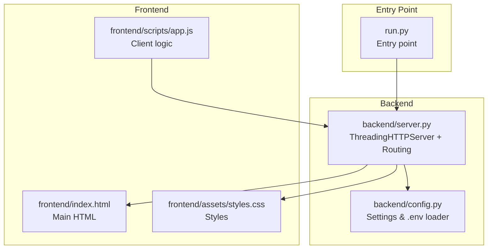
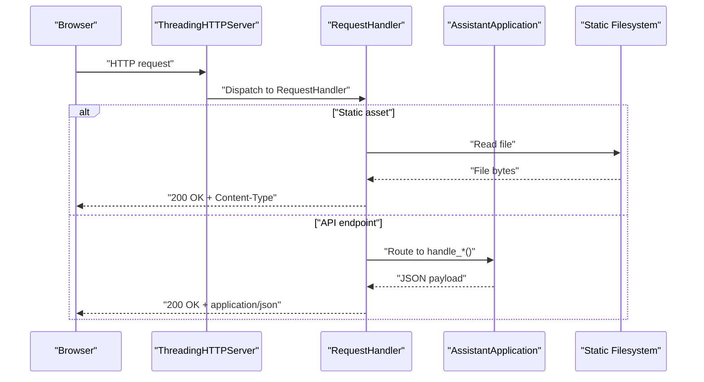
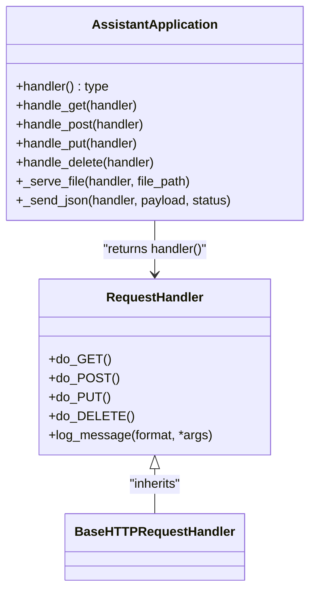
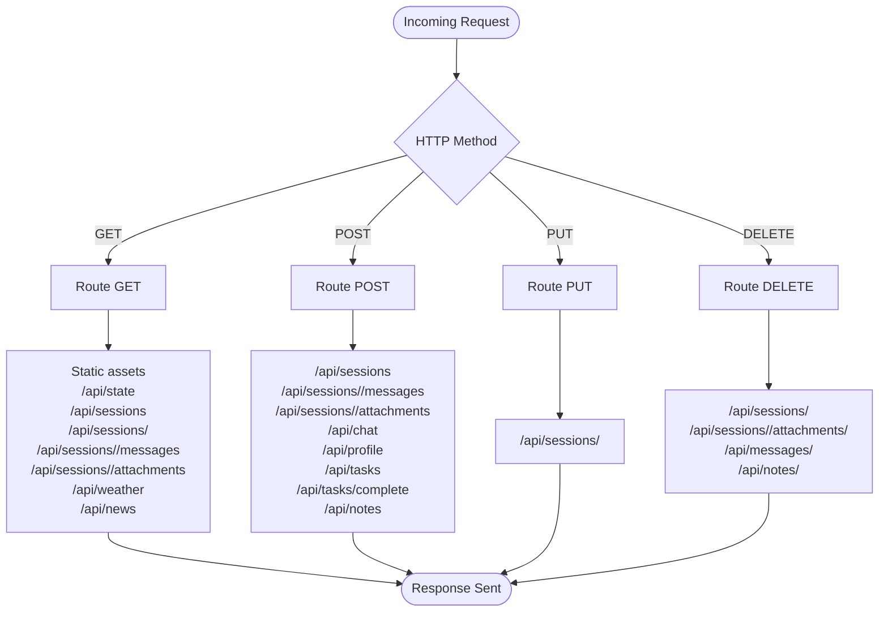
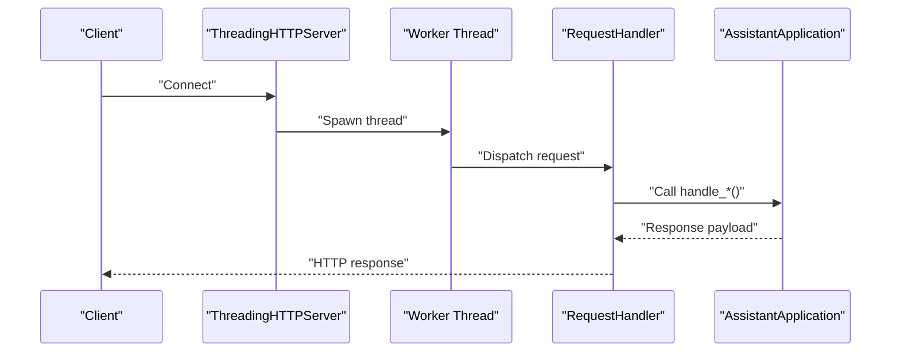
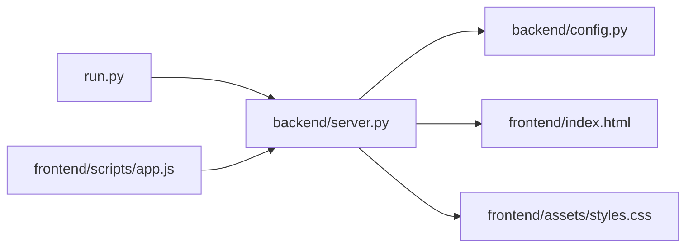

# HTTP Server Implementation

<cite>
**Referenced Files in This Document**
- [run.py](file://run.py)
- [backend/server.py](file://backend/server.py)
- [backend/config.py](file://backend/config.py)
- [frontend/index.html](file://frontend/index.html)
- [frontend/assets/styles.css](file://frontend/assets/styles.css)
- [frontend/scripts/app.js](file://frontend/scripts/app.js)
</cite>

## Table of Contents
1. [Introduction](#introduction)
2. [Project Structure](#project-structure)
3. [Core Components](#core-components)
4. [Architecture Overview](#architecture-overview)
5. [Detailed Component Analysis](#detailed-component-analysis)
6. [Dependency Analysis](#dependency-analysis)
7. [Performance Considerations](#performance-considerations)
8. [Troubleshooting Guide](#troubleshooting-guide)
9. [Conclusion](#conclusion)

## Introduction
This document explains the HTTP server implementation powering the Orbit Virtual Assistant. It focuses on the multi-threaded server built with Python’s standard library, the request routing system for GET, POST, PUT, and DELETE methods, file serving for frontend assets, session and API endpoints, the threading model, connection handling, and error management. Practical request-response examples and performance considerations are included to help developers understand and optimize the server behavior.

## Project Structure
The HTTP server is implemented in the backend module and integrates with a modern web frontend served statically. The entry point initializes the server and starts the multi-threaded HTTP server.

**Diagram sources**
- [run.py:1-6](file://run.py#L1-L6)
- [backend/server.py:566-611](file://backend/server.py#L566-L611)
- [backend/config.py:55-76](file://backend/config.py#L55-L76)
- [frontend/index.html:1-338](file://frontend/index.html#L1-L338)
- [frontend/assets/styles.css:1-800](file://frontend/assets/styles.css#L1-L800)
- [frontend/scripts/app.js:900-1087](file://frontend/scripts/app.js#L900-L1087)

**Section sources**
- [run.py:1-6](file://run.py#L1-L6)
- [backend/server.py:566-611](file://backend/server.py#L566-L611)
- [backend/config.py:55-76](file://backend/config.py#L55-L76)
- [frontend/index.html:1-338](file://frontend/index.html#L1-L338)
- [frontend/assets/styles.css:1-800](file://frontend/assets/styles.css#L1-L800)
- [frontend/scripts/app.js:900-1087](file://frontend/scripts/app.js#L900-L1087)

## Core Components
- ThreadingHTTPServer and BaseHTTPRequestHandler: The server uses Python’s ThreadingHTTPServer to serve HTTP requests concurrently, delegating each request to a dynamically generated RequestHandler subclass that inherits from BaseHTTPRequestHandler.
- AssistantApplication: Encapsulates application state, memory store, tools, and LLM integration. It exposes a handler factory that binds HTTP methods to application logic.
- Routing: Centralized routing in AssistantApplication routes requests by path and HTTP method to dedicated handlers (GET, POST, PUT, DELETE).
- Static file serving: Serves frontend assets (HTML, CSS, JS) directly from the filesystem.
- JSON transport: All API endpoints communicate using JSON payloads and responses.

**Section sources**
- [backend/server.py:64-83](file://backend/server.py#L64-L83)
- [backend/server.py:85-500](file://backend/server.py#L85-L500)
- [backend/server.py:522-564](file://backend/server.py#L522-L564)

## Architecture Overview
The server architecture is layered:
- Entry point initializes settings and constructs the AssistantApplication.
- ThreadingHTTPServer listens on a configured port and spawns a new thread per incoming request.
- Each request is handled by a RequestHandler that delegates to AssistantApplication’s method-specific handlers.
- Static assets are served directly from the frontend directory.
- API endpoints interact with the memory store and external tools (weather, news, web search, LLM).

**Diagram sources**
- [backend/server.py:64-83](file://backend/server.py#L64-L83)
- [backend/server.py:85-500](file://backend/server.py#L85-L500)
- [backend/server.py:522-564](file://backend/server.py#L522-L564)

## Detailed Component Analysis

### ThreadingHTTPServer and BaseHTTPRequestHandler
- ThreadingHTTPServer: Starts the server bound to localhost and the configured port. Each incoming request runs in a separate thread, enabling concurrent handling of multiple clients.
- RequestHandler: Dynamically created inside AssistantApplication.handler(). It maps HTTP methods to application handlers and suppresses default logging to reduce noise.

**Diagram sources**
- [backend/server.py:64-83](file://backend/server.py#L64-L83)
- [backend/server.py:67-83](file://backend/server.py#L67-L83)

**Section sources**
- [backend/server.py:64-83](file://backend/server.py#L64-L83)
- [backend/server.py:608-611](file://backend/server.py#L608-L611)

### Request Routing System
Routing is centralized in AssistantApplication with method-specific handlers:
- GET: Serves static assets and API state; retrieves sessions, messages, attachments; weather and news endpoints.
- POST: Creates sessions, adds messages, uploads attachments, performs chat, updates profile, manages tasks and notes.
- PUT: Updates session metadata (title, pinned, archived).
- DELETE: Removes sessions, attachments, messages, and notes.

**Diagram sources**
- [backend/server.py:85-500](file://backend/server.py#L85-L500)

**Section sources**
- [backend/server.py:85-500](file://backend/server.py#L85-L500)

### File Serving Functionality
Static assets are served directly from the frontend directory:
- Root path and index.html
- Stylesheet and script assets
- Avatar worker script

The server infers MIME types and sends the file bytes with appropriate headers.

**Section sources**
- [backend/server.py:89-104](file://backend/server.py#L89-L104)
- [backend/server.py:522-533](file://backend/server.py#L522-L533)

### Session Management Endpoints
- GET /api/sessions: Lists sessions, optionally including archived ones.
- GET /api/sessions/<id>: Retrieves a session by ID.
- GET /api/sessions/<id>/messages: Retrieves messages for a session with optional limit.
- GET /api/sessions/<id>/attachments: Retrieves attachments for a session.
- POST /api/sessions: Creates a new session.
- POST /api/sessions/<id>/messages: Adds a message to a session.
- POST /api/sessions/<id>/attachments: Uploads a base64-encoded file to a session.
- PUT /api/sessions/<id>: Updates session metadata (title, pinned, archived).
- DELETE /api/sessions/<id>: Deletes a session and cleans up uploaded files.
- DELETE /api/sessions/<id>/attachments/<id>: Removes a specific attachment.
- DELETE /api/messages/<id>: Removes a message.
- DELETE /api/notes/<id>: Removes a note.

These endpoints integrate with the memory store and knowledge service for persistence and indexing.

**Section sources**
- [backend/server.py:110-167](file://backend/server.py#L110-L167)
- [backend/server.py:169-265](file://backend/server.py#L169-L265)
- [backend/server.py:399-422](file://backend/server.py#L399-L422)
- [backend/server.py:428-500](file://backend/server.py#L428-L500)

### API Endpoint Handlers
- GET /api/state: Returns provider, API key presence, model, default location, memory snapshot, history, and sessions.
- GET /api/weather?location=...: Fetches weather and updates memory.
- GET /api/news?topic=...: Fetches news and updates memory.
- POST /api/chat: Sends a message to the LLM assistant with optional modes and context.
- POST /api/profile: Updates user profile and memory snapshot.
- POST /api/tasks and POST /api/tasks/complete: Manages tasks.
- POST /api/notes: Adds a note to memory.
- POST /api/sessions/<id>/attachments: Handles base64 file uploads, validates type and size, saves to disk, registers in memory store, and indexes for search.

**Section sources**
- [backend/server.py:106-167](file://backend/server.py#L106-L167)
- [backend/server.py:269-321](file://backend/server.py#L269-L321)
- [backend/server.py:214-253](file://backend/server.py#L214-L253)
- [backend/server.py:329-394](file://backend/server.py#L329-L394)

### Threading Model and Connection Handling
- ThreadingHTTPServer spawns a new thread per request, allowing concurrent handling of multiple clients.
- BaseHTTPRequestHandler methods (do_GET, do_POST, do_PUT, do_DELETE) are invoked in separate threads.
- The server suppresses default logging to keep console output clean.

**Diagram sources**
- [backend/server.py:608-611](file://backend/server.py#L608-L611)
- [backend/server.py:67-83](file://backend/server.py#L67-L83)

**Section sources**
- [backend/server.py:608-611](file://backend/server.py#L608-L611)
- [backend/server.py:67-83](file://backend/server.py#L67-L83)

### Error Management Strategies
- JSON responses consistently include an error field when applicable and appropriate HTTP status codes.
- Validation errors return 400 Bad Request; resource not found returns 404 Not Found; gateway issues return 502 Bad Gateway.
- ConnectionAbortedError is caught and ignored to prevent crashes when clients disconnect mid-request.

**Section sources**
- [backend/server.py:152-167](file://backend/server.py#L152-L167)
- [backend/server.py:198-200](file://backend/server.py#L198-L200)
- [backend/server.py:238-240](file://backend/server.py#L238-L240)
- [backend/server.py:289-291](file://backend/server.py#L289-L291)
- [backend/server.py:351-353](file://backend/server.py#L351-L353)
- [backend/server.py:355-361](file://backend/server.py#L355-L361)
- [backend/server.py:482-484](file://backend/server.py#L482-L484)
- [backend/server.py:494-496](file://backend/server.py#L494-L496)
- [backend/server.py:562-564](file://backend/server.py#L562-L564)

### Practical Request-Response Cycles
- GET /api/state
  - Client: fetch("/api/state")
  - Server: returns provider, API key presence, model, default location, memory snapshot, history, sessions
  - Example path: [frontend/scripts/app.js:902-926](file://frontend/scripts/app.js#L902-L926)

- POST /api/sessions
  - Client: creates a new session and stores the first message
  - Server: creates session in memory store and returns session metadata
  - Example path: [frontend/scripts/app.js:965-978](file://frontend/scripts/app.js#L965-L978)

- POST /api/chat
  - Client: sends a message with mode, topic, level, language, and optional screen image
  - Server: calls LLM assistant and returns reply, tool events, and memory snapshot
  - Example path: [frontend/scripts/app.js:991-1087](file://frontend/scripts/app.js#L991-L1087)

- POST /api/sessions/<id>/attachments
  - Client: uploads a base64-encoded file
  - Server: validates type and size, saves to disk, registers in memory store, indexes for search, and returns attachment metadata
  - Example path: [frontend/scripts/app.js:1608-1637](file://frontend/scripts/app.js#L1608-L1637)

- PUT /api/sessions/<id>
  - Client: toggles pinned/archived state
  - Server: updates session metadata and returns updated session
  - Example path: [frontend/scripts/app.js:308-321](file://frontend/scripts/app.js#L308-L321)

- DELETE /api/sessions/<id>
  - Client: deletes a session
  - Server: removes session and associated files, returns success
  - Example path: [frontend/scripts/app.js:358-368](file://frontend/scripts/app.js#L358-L368)

**Section sources**
- [frontend/scripts/app.js:902-926](file://frontend/scripts/app.js#L902-L926)
- [frontend/scripts/app.js:965-978](file://frontend/scripts/app.js#L965-L978)
- [frontend/scripts/app.js:991-1087](file://frontend/scripts/app.js#L991-L1087)
- [frontend/scripts/app.js:1608-1637](file://frontend/scripts/app.js#L1608-L1637)
- [frontend/scripts/app.js:308-321](file://frontend/scripts/app.js#L308-L321)
- [frontend/scripts/app.js:358-368](file://frontend/scripts/app.js#L358-L368)

### Middleware Patterns
- Centralized request parsing: All handlers parse JSON bodies and query parameters consistently.
- Consistent response formatting: All endpoints use a shared _send_json method to ensure uniform headers and status codes.
- Static asset middleware: Dedicated _serve_file method handles MIME detection and file serving.

**Section sources**
- [backend/server.py:535-547](file://backend/server.py#L535-L547)
- [backend/server.py:549-564](file://backend/server.py#L549-L564)
- [backend/server.py:522-533](file://backend/server.py#L522-L533)

## Dependency Analysis
- Entry point depends on backend.server.run to construct the server and start serving.
- AssistantApplication depends on Settings from backend.config and integrates with memory store, tools, and LLM clients.
- Frontend JavaScript communicates with backend endpoints and serves static assets.

**Diagram sources**
- [run.py:1-6](file://run.py#L1-L6)
- [backend/server.py:566-611](file://backend/server.py#L566-L611)
- [backend/config.py:55-76](file://backend/config.py#L55-L76)
- [frontend/index.html:1-338](file://frontend/index.html#L1-L338)
- [frontend/assets/styles.css:1-800](file://frontend/assets/styles.css#L1-L800)
- [frontend/scripts/app.js:900-1087](file://frontend/scripts/app.js#L900-L1087)

**Section sources**
- [run.py:1-6](file://run.py#L1-L6)
- [backend/server.py:566-611](file://backend/server.py#L566-L611)
- [backend/config.py:55-76](file://backend/config.py#L55-L76)
- [frontend/index.html:1-338](file://frontend/index.html#L1-L338)
- [frontend/assets/styles.css:1-800](file://frontend/assets/styles.css#L1-L800)
- [frontend/scripts/app.js:900-1087](file://frontend/scripts/app.js#L900-L1087)

## Performance Considerations
- Concurrency: ThreadingHTTPServer enables concurrent request handling, but Python’s GIL limits CPU-bound concurrency. For I/O-bound workloads (network calls to LLMs, web search, database), threading is suitable.
- Static assets: Serving static files directly avoids unnecessary application logic overhead.
- JSON parsing: Centralized parsing reduces duplication and ensures consistent error handling.
- Attachment uploads: Size and type checks prevent excessive memory usage and invalid payloads.
- Logging: Disabled default logging reduces overhead in production-like environments.

[No sources needed since this section provides general guidance]

## Troubleshooting Guide
- 404 Not Found: Verify endpoint paths and trailing slashes. Ensure static asset paths match the server’s routing.
- 400 Bad Request: Check JSON payload structure and required fields. Attachment uploads enforce allowed types and size limits.
- 502 Bad Gateway: LLM client errors are surfaced with structured error messages; inspect the assistant logs for provider-specific issues.
- Connection Aborted: Client disconnections are handled gracefully; no crash occurs.
- Port conflicts: Change ASSISTANT_PORT in environment variables if the default port is in use.

**Section sources**
- [backend/server.py:152-167](file://backend/server.py#L152-L167)
- [backend/server.py:198-200](file://backend/server.py#L198-L200)
- [backend/server.py:238-240](file://backend/server.py#L238-L240)
- [backend/server.py:289-291](file://backend/server.py#L289-L291)
- [backend/server.py:351-353](file://backend/server.py#L351-L353)
- [backend/server.py:355-361](file://backend/server.py#L355-L361)
- [backend/server.py:482-484](file://backend/server.py#L482-L484)
- [backend/server.py:494-496](file://backend/server.py#L494-L496)
- [backend/server.py:562-564](file://backend/server.py#L562-L564)
- [backend/config.py:67](file://backend/config.py#L67)

## Conclusion
The HTTP server implementation leverages Python’s ThreadingHTTPServer and BaseHTTPRequestHandler to deliver a robust, multi-threaded API for the Orbit Virtual Assistant. The routing system cleanly separates static asset serving from API endpoints, while centralized helpers ensure consistent request parsing and response formatting. The design supports concurrent clients, graceful error handling, and straightforward extension for new endpoints. The frontend integrates seamlessly with the server through well-defined REST endpoints, enabling a responsive and feature-rich user experience.