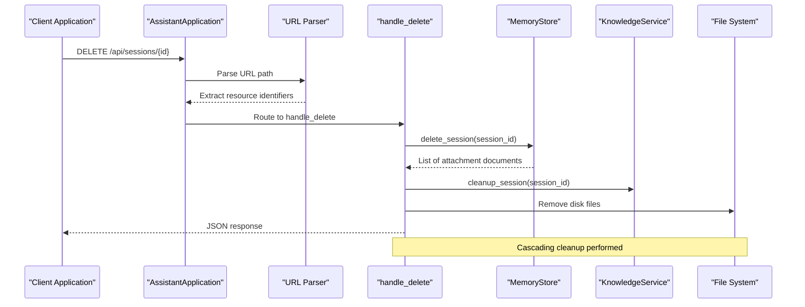
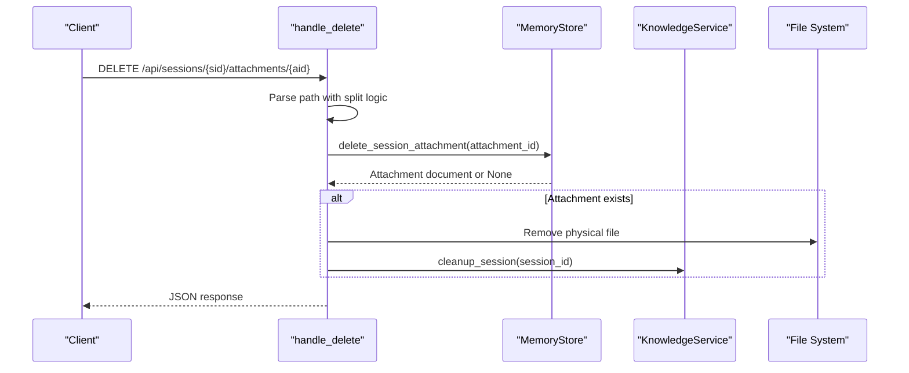
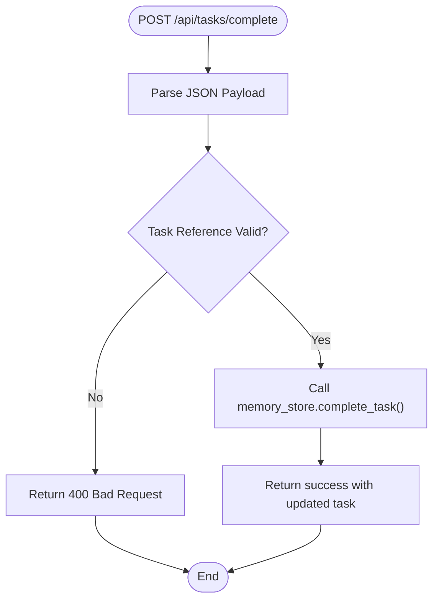
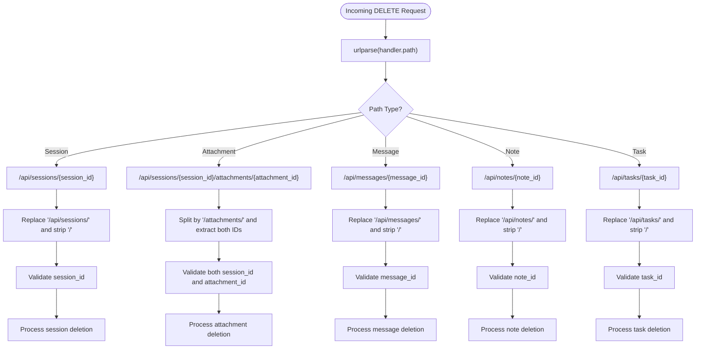
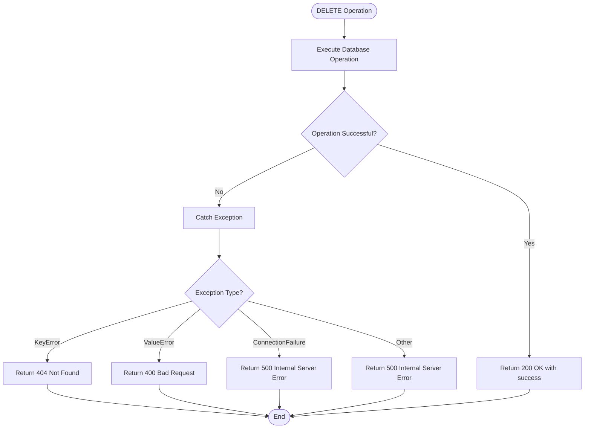
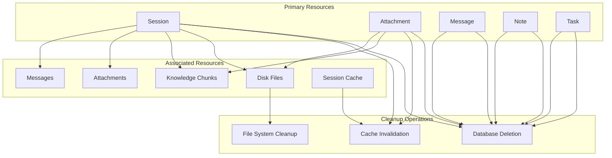

# DELETE Request Handlers

<cite>
**Referenced Files in This Document**
- [server.py](file://backend/server.py)
- [memory_store.py](file://backend/core/memory_store.py)
- [knowledge.py](file://backend/tools/knowledge.py)
</cite>

## Table of Contents
1. [Introduction](#introduction)
2. [DELETE Endpoint Architecture](#delete-endpoint-architecture)
3. [Session Deletion Handler](#session-deletion-handler)
4. [Attachment Deletion Handler](#attachment-deletion-handler)
5. [Message Deletion Handler](#message-deletion-handler)
6. [Note Deletion Handler](#note-deletion-handler)
7. [Task Deletion Handler](#task-deletion-handler)
8. [Tasks Completion Handler](#tasks-completion-handler)
9. [Path Parsing Logic](#path-parsing-logic)
10. [Error Handling Strategies](#error-handling-strategies)
11. [Cleanup Procedures](#cleanup-procedures)
12. [Performance Considerations](#performance-considerations)
13. [Troubleshooting Guide](#troubleshooting-guide)
14. [Conclusion](#conclusion)

## Introduction

This document provides comprehensive coverage of DELETE request handlers in the AI Assistant application, focusing on resource removal operations. The system implements a RESTful API with dedicated endpoints for deleting sessions, attachments, messages, notes, and tasks, each with specific cascading cleanup procedures and error handling strategies.

The DELETE handlers operate within a threaded HTTP server architecture, processing requests synchronously while maintaining thread safety through database locks. The system integrates MongoDB for persistent storage and a knowledge service for document retrieval capabilities.

## DELETE Endpoint Architecture

The DELETE request handling follows a structured pattern within the AssistantApplication class, utilizing URL parsing and conditional routing to determine the appropriate deletion operation.



**Diagram sources**
- [server.py:428-500](file://backend/server.py#L428-L500)
- [memory_store.py:632-646](file://backend/core/memory_store.py#L632-L646)

**Section sources**
- [server.py:428-500](file://backend/server.py#L428-L500)

## Session Deletion Handler

The session deletion endpoint (`/api/sessions/{id}`) performs comprehensive resource cleanup through a cascading deletion process.

### Endpoint Definition
- **Method**: DELETE
- **Path**: `/api/sessions/{session_id}`
- **Purpose**: Remove a complete chat session with all associated resources

### Processing Logic

```mermaid
flowchart TD
Start([DELETE /api/sessions/{id}]) --> Parse["Parse URL Path"]
Parse --> Validate{"Session ID Valid?"}
Validate --> |No| NotFound["Return 404 Not Found"]
Validate --> |Yes| DeleteSession["Call memory_store.delete_session()"]
DeleteSession --> GetAttachments["Get attachment documents"]
GetAttachments --> CleanupKnowledge["Call knowledge.cleanup_session()"]
CleanupKnowledge --> RemoveFiles["Iterate through attachments<br/>and remove disk files"]
RemoveFiles --> CleanupChunks["Delete session chunks from DB"]
CleanupChunks --> Success["Return success response"]
NotFound --> End([End])
Success --> End
```

**Diagram sources**
- [server.py:431-446](file://backend/server.py#L431-L446)
- [memory_store.py:632-646](file://backend/core/memory_store.py#L632-L646)

### Cascading Cleanup Operations

The session deletion triggers multiple cleanup operations:

1. **Database Cleanup**:
   - Removes the session document from the sessions collection
   - Deletes all associated messages from the messages collection
   - Removes session attachments from the session_attachments collection
   - Clears session chunks from the session_chunks collection

2. **File System Cleanup**:
   - Iterates through returned attachment documents
   - Removes physical files from the upload directory
   - Handles potential OS errors gracefully

3. **Knowledge Service Cleanup**:
   - Invalidates cached retrievers for the deleted session
   - Ensures subsequent searches don't use stale session data

**Section sources**
- [server.py:431-446](file://backend/server.py#L431-L446)
- [memory_store.py:632-646](file://backend/core/memory_store.py#L632-L646)
- [knowledge.py:389-392](file://backend/tools/knowledge.py#L389-L392)

## Attachment Deletion Handler

The attachment deletion endpoint (`/api/sessions/{id}/attachments/{attachment_id}`) removes individual file attachments with associated cleanup.

### Endpoint Definition
- **Method**: DELETE
- **Path**: `/api/sessions/{session_id}/attachments/{attachment_id}`
- **Purpose**: Remove a specific file attachment from a session

### Processing Logic



**Diagram sources**
- [server.py:448-466](file://backend/server.py#L448-L466)
- [memory_store.py:788-796](file://backend/core/memory_store.py#L788-L796)

### Key Features

1. **Path Parsing**: Uses split-based extraction for session and attachment IDs
2. **Conditional Processing**: Only processes if both IDs are present
3. **File Cleanup**: Removes the physical file from disk storage
4. **Cache Invalidation**: Clears session-specific retrievers to prevent stale searches

**Section sources**
- [server.py:448-466](file://backend/server.py#L448-L466)
- [memory_store.py:788-796](file://backend/core/memory_store.py#L788-L796)

## Message Deletion Handler

The message deletion endpoint (`/api/messages/{id}`) provides targeted removal of individual chat messages.

### Endpoint Definition
- **Method**: DELETE
- **Path**: `/api/messages/{message_id}`
- **Purpose**: Remove a specific message from the database

### Processing Logic

```mermaid
flowchart TD
Start([DELETE /api/messages/{id}]) --> Parse["Parse URL Path"]
Parse --> Validate{"Message ID Valid?"}
Validate --> |No| NotFound["Return 404 Not Found"]
Validate --> |Yes| DeleteMessage["Call memory_store.delete_message()"]
DeleteMessage --> Success["Return success response"]
NotFound --> End([End])
Success --> End
```

**Diagram sources**
- [server.py:468-474](file://backend/server.py#L468-L474)
- [memory_store.py:687-689](file://backend/core/memory_store.py#L687-L689)

### Implementation Details

The message deletion is straightforward, involving:
- Single document removal from the messages collection
- No cascading effects on other resources
- Immediate database cleanup

**Section sources**
- [server.py:468-474](file://backend/server.py#L468-L474)
- [memory_store.py:687-689](file://backend/core/memory_store.py#L687-L689)

## Note Deletion Handler

The note deletion endpoint (`/api/notes/{id}`) handles removal of user-created notes with proper error handling.

### Endpoint Definition
- **Method**: DELETE
- **Path**: `/api/notes/{note_id}`
- **Purpose**: Remove a specific note from the database

### Processing Logic

```mermaid
flowchart TD
Start([DELETE /api/notes/{id}]) --> Parse["Parse URL Path"]
Parse --> Validate{"Note ID Valid?"}
Validate --> |No| NotFound["Return 404 Not Found"]
Validate --> |Yes| DeleteNote["Call memory_store.delete_note()"]
DeleteNote --> CheckResult{"Note Found?"}
CheckResult --> |No| NotFound
CheckResult --> |Yes| Success["Return success with memory state"]
NotFound --> End([End])
Success --> End
```

**Diagram sources**
- [server.py:476-486](file://backend/server.py#L476-L486)
- [memory_store.py:448-469](file://backend/core/memory_store.py#L448-L469)

### Error Handling

The note deletion implements robust error handling:
- Validates that the note ID is not empty
- Throws KeyError if the note doesn't exist
- Returns appropriate HTTP status codes (404 for missing resources)
- Includes memory state in successful responses

**Section sources**
- [server.py:476-486](file://backend/server.py#L476-L486)
- [memory_store.py:448-469](file://backend/core/memory_store.py#L448-L469)

## Task Deletion Handler

The task deletion endpoint (`/api/tasks/{id}`) manages removal of user tasks with validation and state updates.

### Endpoint Definition
- **Method**: DELETE
- **Path**: `/api/tasks/{task_id}`
- **Purpose**: Remove a specific task from the database

### Processing Logic

```mermaid
flowchart TD
Start([DELETE /api/tasks/{id}]) --> Parse["Parse URL Path"]
Parse --> Validate{"Task ID Valid?"}
Validate --> |No| NotFound["Return 404 Not Found"]
Validate --> |Yes| DeleteTask["Call memory_store.delete_task()"]
DeleteTask --> CheckResult{"Task Found?"}
CheckResult --> |No| NotFound
CheckResult --> |Yes| Success["Return success with memory state"]
NotFound --> End([End])
Success --> End
```

**Diagram sources**
- [server.py:488-498](file://backend/server.py#L488-L498)
- [memory_store.py:417-446](file://backend/core/memory_store.py#L417-L446)

### Validation and Effects

The task deletion includes:
- Input validation for task references
- Support for deletion by exact ID or partial title match
- Automatic memory state updates
- Activity logging for audit trails

**Section sources**
- [server.py:488-498](file://backend/server.py#L488-L498)
- [memory_store.py:417-446](file://backend/core/memory_store.py#L417-L446)

## Tasks Completion Handler

The tasks completion endpoint (`/api/tasks/complete`) uses POST instead of DELETE, representing a special case in the API design.

### Endpoint Definition
- **Method**: POST
- **Path**: `/api/tasks/complete`
- **Purpose**: Mark tasks as completed

### Special Case Handling



**Diagram sources**
- [server.py:234-241](file://backend/server.py#L234-L241)
- [memory_store.py:377-415](file://backend/core/memory_store.py#L377-L415)

### Design Rationale

Unlike typical DELETE operations, task completion uses POST because:
- It modifies resource state rather than removing it
- Requires explicit action confirmation
- Maintains task history and audit trails
- Supports both ID-based and title-based completion

**Section sources**
- [server.py:234-241](file://backend/server.py#L234-L241)
- [memory_store.py:377-415](file://backend/core/memory_store.py#L377-L415)

## Path Parsing Logic

The DELETE handler implements sophisticated path parsing to extract resource identifiers from URLs.

### Parsing Strategies



**Diagram sources**
- [server.py:428-500](file://backend/server.py#L428-L500)

### Implementation Details

The path parsing logic employs different strategies based on endpoint type:

1. **Simple Path Extraction**: For single-resource endpoints like sessions and messages
2. **Split-Based Parsing**: For complex endpoints requiring multiple identifiers
3. **Conditional Validation**: Ensures both IDs are present before processing

**Section sources**
- [server.py:428-500](file://backend/server.py#L428-L500)

## Error Handling Strategies

The DELETE handlers implement comprehensive error handling with appropriate HTTP status codes and error messages.

### Error Categories

| Error Type | Status Code | Description | Handler Behavior |
|------------|-------------|-------------|------------------|
| Missing Resource | 404 Not Found | Target resource doesn't exist | Returns JSON error with message |
| Invalid Input | 400 Bad Request | Malformed or empty identifiers | Returns validation error |
| Database Error | 500 Internal Server | MongoDB connection issues | Returns generic error |
| Permission Error | 403 Forbidden | Access denied to resource | Returns permission error |

### Error Propagation



**Diagram sources**
- [server.py:476-486](file://backend/server.py#L476-L486)
- [server.py:488-498](file://backend/server.py#L488-L498)

### Error Response Format

All error responses follow a consistent JSON format:
```json
{
  "error": "Descriptive error message",
  "status": "error"
}
```

**Section sources**
- [server.py:476-486](file://backend/server.py#L476-L486)
- [server.py:488-498](file://backend/server.py#L488-L498)

## Cleanup Procedures

The DELETE handlers implement comprehensive cleanup procedures to maintain system consistency and prevent orphaned resources.

### Cascading Cleanup Patterns



**Diagram sources**
- [memory_store.py:632-646](file://backend/core/memory_store.py#L632-L646)
- [memory_store.py:788-796](file://backend/core/memory_store.py#L788-L796)
- [knowledge.py:389-392](file://backend/tools/knowledge.py#L389-L392)

### Cleanup Implementation Details

1. **Database Cleanup**: Atomic operations within transaction-like contexts
2. **File System Cleanup**: Safe file removal with error handling
3. **Cache Cleanup**: Invalidated retrievers to prevent stale data
4. **Index Cleanup**: Removal of associated search indices

**Section sources**
- [memory_store.py:632-646](file://backend/core/memory_store.py#L632-L646)
- [memory_store.py:788-796](file://backend/core/memory_store.py#L788-L796)
- [knowledge.py:389-392](file://backend/tools/knowledge.py#L389-L392)

## Performance Considerations

The DELETE handlers are designed for optimal performance through several mechanisms:

### Thread Safety
- All database operations use thread locks to prevent concurrent access conflicts
- MemoryStore operations are atomic within lock boundaries
- Prevents race conditions during cleanup operations

### Efficient Resource Management
- Batch operations for cascading deletions
- Minimal database round trips through combined operations
- Lazy initialization of knowledge service components

### Scalability Features
- Non-blocking file system operations
- Asynchronous cache invalidation
- Graceful degradation for optional cleanup steps

## Troubleshooting Guide

### Common Issues and Solutions

#### Session Deletion Failures
**Symptoms**: Session remains after DELETE request
**Causes**: 
- MongoDB connection failures
- File system permission issues
- Concurrent access conflicts

**Solutions**:
- Verify MongoDB connectivity
- Check file permissions for upload directory
- Retry operation after resolving conflicts

#### Attachment Cleanup Problems
**Symptoms**: Files persist on disk after attachment deletion
**Causes**:
- File path corruption
- Disk write permissions
- File locks from active processes

**Solutions**:
- Verify storage_path in attachment document
- Check antivirus software interference
- Restart application to release file locks

#### Error Response Analysis
**Common Error Codes**:
- **404 Not Found**: Resource doesn't exist or was already deleted
- **400 Bad Request**: Invalid identifier format or empty parameters
- **500 Internal Server Error**: Database or system-level failures

**Diagnostic Steps**:
1. Check server logs for detailed error messages
2. Verify resource existence in MongoDB collections
3. Test file system accessibility
4. Confirm network connectivity to external services

**Section sources**
- [server.py:428-500](file://backend/server.py#L428-L500)

## Conclusion

The DELETE request handlers in the AI Assistant application provide a robust foundation for resource management with comprehensive error handling, cascading cleanup procedures, and thread-safe operations. The implementation demonstrates best practices in RESTful API design while maintaining system consistency and preventing orphaned resources.

Key strengths include:
- Comprehensive cascading cleanup for dependent resources
- Robust error handling with appropriate HTTP status codes
- Thread-safe database operations with proper locking
- Efficient path parsing for various endpoint types
- Consistent response formats across all operations

The system successfully balances functionality with reliability, providing administrators and users with predictable resource management capabilities while maintaining system integrity through careful cleanup procedures and validation logic.