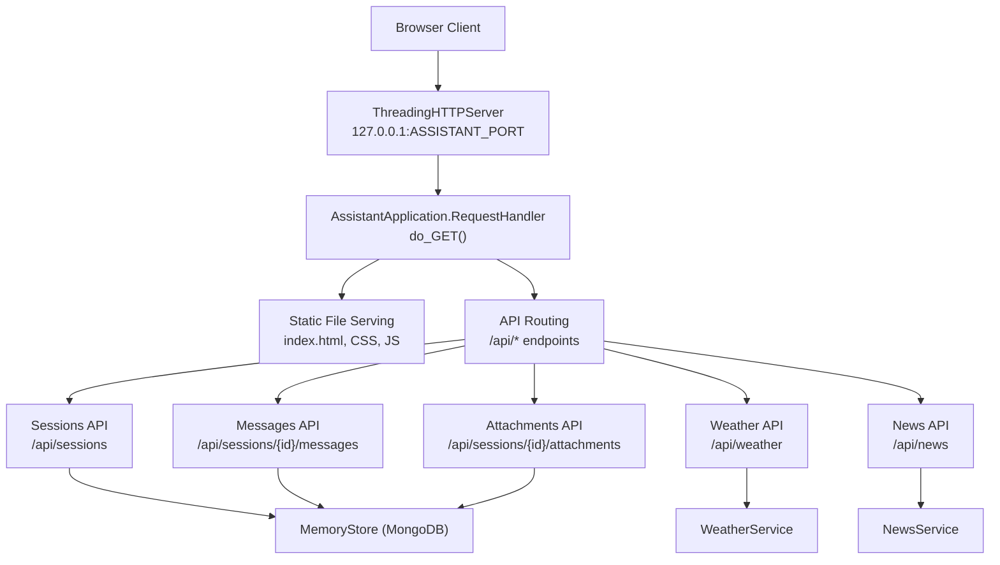
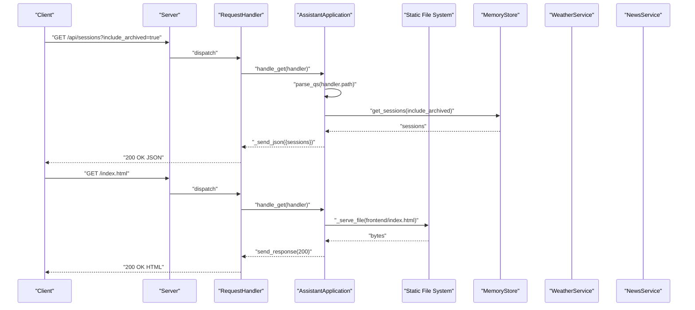
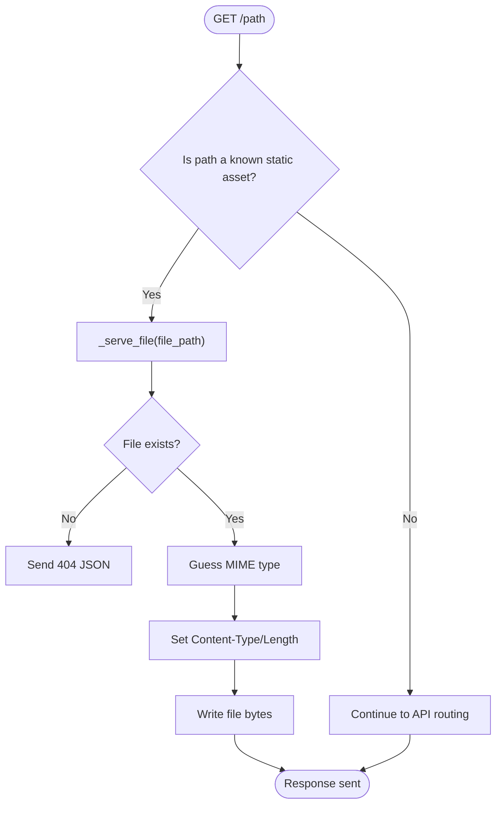
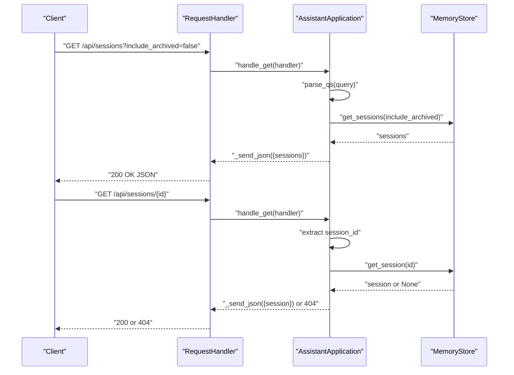
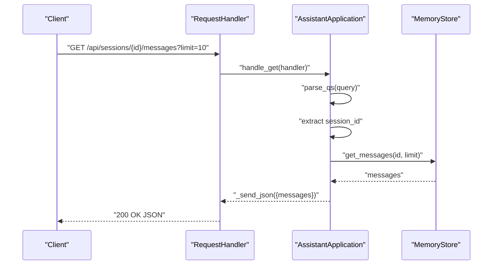
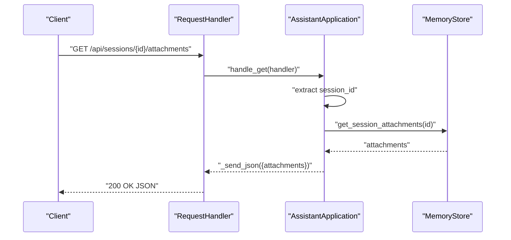
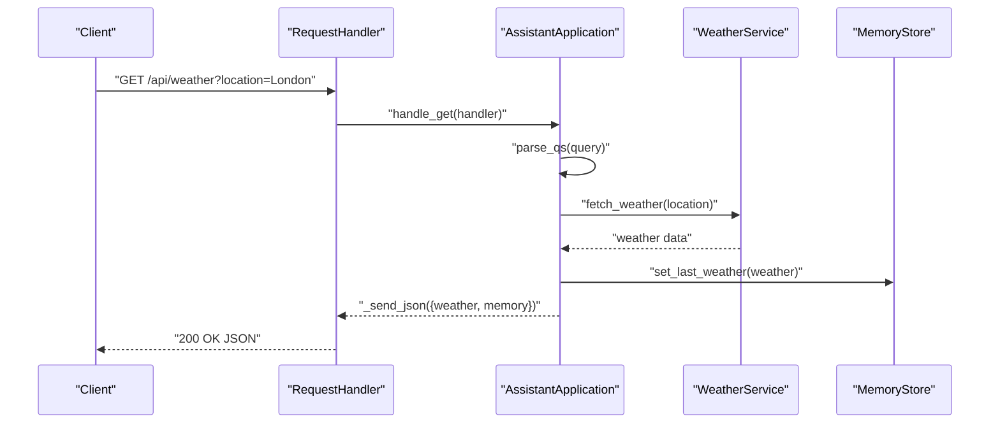
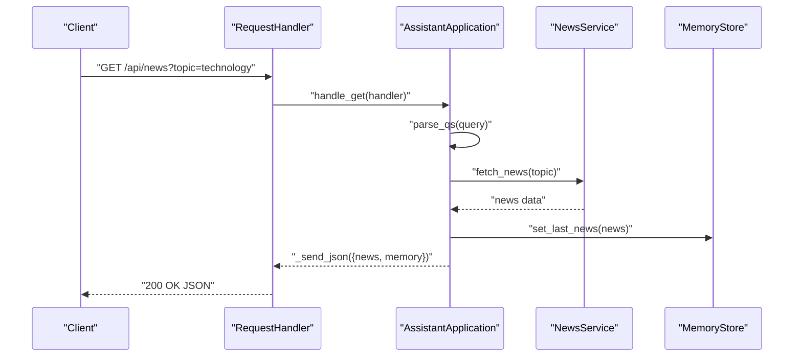
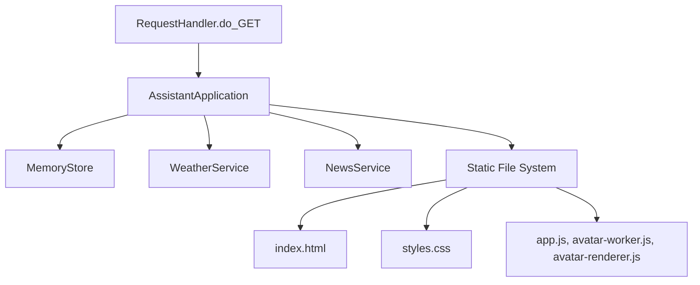

# GET Request Handlers

<cite>
**Referenced Files in This Document**
- [run.py](file://run.py)
- [backend/server.py](file://backend/server.py)
- [backend/config.py](file://backend/config.py)
- [backend/core/memory_store.py](file://backend/core/memory_store.py)
- [backend/tools/weather.py](file://backend/tools/weather.py)
- [backend/tools/news.py](file://backend/tools/news.py)
- [frontend/index.html](file://frontend/index.html)
- [frontend/assets/styles.css](file://frontend/assets/styles.css)
- [frontend/scripts/app.js](file://frontend/scripts/app.js)
- [frontend/scripts/avatar-worker.js](file://frontend/scripts/avatar-worker.js)
- [frontend/scripts/avatar-renderer.js](file://frontend/scripts/avatar-renderer.js)
</cite>

## Table of Contents
1. [Introduction](#introduction)
2. [Project Structure](#project-structure)
3. [Core Components](#core-components)
4. [Architecture Overview](#architecture-overview)
5. [Detailed Component Analysis](#detailed-component-analysis)
6. [Dependency Analysis](#dependency-analysis)
7. [Performance Considerations](#performance-considerations)
8. [Troubleshooting Guide](#troubleshooting-guide)
9. [Conclusion](#conclusion)

## Introduction
This document provides comprehensive coverage of GET request handlers in the Orbit Virtual Assistant, focusing on:
- Frontend asset serving for index.html, styles.css, app.js, avatar-worker.js, and avatar-renderer.js
- API endpoint routing for sessions, messages, attachments, weather, and news
- URL parsing, query parameter extraction, and path segment processing
- Error handling patterns and HTTP status code responses

The goal is to make the GET handling logic understandable for both technical and non-technical readers.

## Project Structure
The GET handlers are implemented in a single threaded HTTP server that serves both static frontend assets and dynamic API responses. The server delegates to a central handler that routes requests based on path and query parameters.

**Diagram sources**
- [backend/server.py:67-167](file://backend/server.py#L67-L167)
- [backend/server.py:522-534](file://backend/server.py#L522-L534)
- [backend/server.py:106-164](file://backend/server.py#L106-L164)

**Section sources**
- [backend/server.py:67-167](file://backend/server.py#L67-L167)
- [backend/config.py:55-76](file://backend/config.py#L55-L76)
- [run.py:1-6](file://run.py#L1-L6)

## Core Components
This section outlines the key components involved in GET request handling.

- AssistantApplication: Central orchestrator that creates the HTTP handler and routes requests.
- RequestHandler: Extends BaseHTTPRequestHandler to implement do_GET and other HTTP methods.
- Static file serving: Dedicated method to serve frontend assets with automatic MIME type detection.
- API routing: Path-based routing for sessions, messages, attachments, weather, and news.
- Parameter extraction: Uses urlparse and parse_qs to extract query parameters and path segments.
- Error handling: Returns structured JSON errors with appropriate HTTP status codes.

**Section sources**
- [backend/server.py:23-83](file://backend/server.py#L23-L83)
- [backend/server.py:85-167](file://backend/server.py#L85-L167)
- [backend/server.py:522-564](file://backend/server.py#L522-L564)

## Architecture Overview
The GET handler follows a layered approach:
- Top-level routing checks for static assets first, then API endpoints.
- Query string parsing is centralized using parse_qs.
- Path segment extraction uses string manipulation for API endpoints.
- Responses are sent as JSON for API endpoints and as binary for static assets.

**Diagram sources**
- [backend/server.py:85-167](file://backend/server.py#L85-L167)
- [backend/server.py:522-534](file://backend/server.py#L522-L534)
- [backend/core/memory_store.py:188-250](file://backend/core/memory_store.py#L188-L250)

## Detailed Component Analysis

### Static Asset Serving (index.html, styles.css, app.js, avatar-worker.js, avatar-renderer.js)
The server serves frontend assets directly from the configured web directory. The logic:
- Recognizes specific paths for index.html, styles.css, app.js, avatar-worker.js, and avatar-renderer.js.
- Uses a dedicated _serve_file method that:
  - Checks file existence
  - Detects MIME type using mimetypes.guess_type
  - Reads file bytes and sends Content-Type, Content-Length, and body

**Diagram sources**
- [backend/server.py:89-104](file://backend/server.py#L89-L104)
- [backend/server.py:522-534](file://backend/server.py#L522-L534)

**Section sources**
- [backend/server.py:89-104](file://backend/server.py#L89-L104)
- [backend/server.py:522-534](file://backend/server.py#L522-L534)
- [frontend/index.html:7,335:7-335](file://frontend/index.html#L7-L335)
- [frontend/assets/styles.css:1](file://frontend/assets/styles.css#L1-L1)
- [frontend/scripts/app.js:335](file://frontend/scripts/app.js#L335-L335)
- [frontend/scripts/avatar-worker.js:1](file://frontend/scripts/avatar-worker.js#L1-L1)
- [frontend/scripts/avatar-renderer.js:1](file://frontend/scripts/avatar-renderer.js#L1-L1)

### API Endpoint Routing: Sessions
The sessions endpoint supports:
- Listing sessions with optional archived inclusion
- Retrieving a single session by ID
- Retrieving messages for a session with optional limit
- Retrieving attachments for a session

**Diagram sources**
- [backend/server.py:110-126](file://backend/server.py#L110-L126)
- [backend/server.py:128-143](file://backend/server.py#L128-L143)
- [backend/core/memory_store.py:188-250](file://backend/core/memory_store.py#L188-L250)

**Section sources**
- [backend/server.py:110-143](file://backend/server.py#L110-L143)
- [backend/core/memory_store.py:188-250](file://backend/core/memory_store.py#L188-L250)

### API Endpoint Routing: Messages
The messages endpoint retrieves messages for a given session with an optional limit parameter.

**Diagram sources**
- [backend/server.py:128-135](file://backend/server.py#L128-L135)

**Section sources**
- [backend/server.py:128-135](file://backend/server.py#L128-L135)

### API Endpoint Routing: Attachments
The attachments endpoint lists attachments for a given session.

**Diagram sources**
- [backend/server.py:137-143](file://backend/server.py#L137-L143)

**Section sources**
- [backend/server.py:137-143](file://backend/server.py#L137-L143)

### API Endpoint Routing: Weather Information
The weather endpoint fetches current weather for a given location and caches it in memory.

**Diagram sources**
- [backend/server.py:145-154](file://backend/server.py#L145-L154)
- [backend/tools/weather.py:51-75](file://backend/tools/weather.py#L51-L75)

**Section sources**
- [backend/server.py:145-154](file://backend/server.py#L145-L154)
- [backend/tools/weather.py:51-75](file://backend/tools/weather.py#L51-L75)

### API Endpoint Routing: News Headlines
The news endpoint retrieves news headlines for a given topic and caches them in memory.

**Diagram sources**
- [backend/server.py:155-164](file://backend/server.py#L155-L164)
- [backend/tools/news.py:25-60](file://backend/tools/news.py#L25-L60)

**Section sources**
- [backend/server.py:155-164](file://backend/server.py#L155-L164)
- [backend/tools/news.py:25-60](file://backend/tools/news.py#L25-L60)

### URL Parsing and Parameter Extraction
The server uses:
- urlparse to separate path and query string
- parse_qs to convert query string into a dictionary mapping keys to lists
- String manipulation to extract resource IDs from paths

Key behaviors:
- Query parameters are extracted as lists; the first element is used for boolean flags and numeric limits
- Path segments are extracted using split and strip operations
- Missing or invalid IDs result in 404 responses

**Section sources**
- [backend/server.py:86-87](file://backend/server.py#L86-L87)
- [backend/server.py:112-113](file://backend/server.py#L112-L113)
- [backend/server.py:129-132](file://backend/server.py#L129-L132)
- [backend/server.py:139-142](file://backend/server.py#L139-L142)
- [backend/server.py:146-147](file://backend/server.py#L146-L147)
- [backend/server.py:156-157](file://backend/server.py#L156-L157)

### Error Handling and HTTP Status Codes
The server consistently returns structured JSON errors with appropriate HTTP status codes:
- 404 Not Found for missing static assets or sessions
- 400 Bad Request for invalid parameters or service errors
- 502 Bad Gateway for LLM client failures
- 200 OK for successful responses

Examples:
- Missing session ID triggers a 404 with an error message
- Weather and news service errors are caught and returned as 400
- LLM client errors are handled with 502

**Section sources**
- [backend/server.py:122-126](file://backend/server.py#L122-L126)
- [backend/server.py:152-154](file://backend/server.py#L152-L154)
- [backend/server.py:162-164](file://backend/server.py#L162-L164)
- [backend/server.py:308-310](file://backend/server.py#L308-L310)

## Dependency Analysis
The GET handler depends on several subsystems:
- MemoryStore for persistence of sessions, messages, and cached data
- WeatherService and NewsService for external data retrieval
- Frontend assets located under the configured web directory

**Diagram sources**
- [backend/server.py:67-167](file://backend/server.py#L67-L167)
- [backend/server.py:522-534](file://backend/server.py#L522-L534)
- [backend/core/memory_store.py:67-117](file://backend/core/memory_store.py#L67-L117)
- [backend/tools/weather.py:48-75](file://backend/tools/weather.py#L48-L75)
- [backend/tools/news.py:22-60](file://backend/tools/news.py#L22-L60)

**Section sources**
- [backend/server.py:67-167](file://backend/server.py#L67-L167)
- [backend/core/memory_store.py:67-117](file://backend/core/memory_store.py#L67-L117)
- [backend/tools/weather.py:48-75](file://backend/tools/weather.py#L48-L75)
- [backend/tools/news.py:22-60](file://backend/tools/news.py#L22-L60)

## Performance Considerations
- Static file serving uses direct file I/O with minimal overhead; ensure the web directory is on fast storage.
- API responses are small JSON payloads; consider caching frequently accessed data in memory where appropriate.
- Query parameter parsing is O(n) in the number of parameters; keep query strings concise.
- MongoDB queries are indexed; ensure proper indexing for session and message retrieval.

## Troubleshooting Guide
Common issues and resolutions:
- 404 Not Found for static assets:
  - Verify the web directory path in settings and that files exist
  - Check browser network tab for exact URLs requested
- 404 Not Found for sessions:
  - Confirm the session ID exists in the database
  - Use the sessions listing endpoint to verify IDs
- 400 Bad Request for weather/news:
  - Validate the location/topic parameter
  - Check external service availability and API keys
- CORS or mixed content issues:
  - Ensure the server runs on localhost and uses HTTPS if required by browser policies

**Section sources**
- [backend/server.py:122-126](file://backend/server.py#L122-L126)
- [backend/server.py:152-154](file://backend/server.py#L152-L154)
- [backend/server.py:162-164](file://backend/server.py#L162-L164)

## Conclusion
The GET request handlers provide a clean separation between static asset serving and API routing. They leverage robust parameter extraction, consistent error handling, and efficient persistence through MongoDB. The modular design allows for easy extension of new endpoints while maintaining predictable behavior and clear error reporting.