# POST Request Handlers

<cite>
**Referenced Files in This Document**
- [server.py](file://backend/server.py)
- [memory_store.py](file://backend/core/memory_store.py)
- [knowledge.py](file://backend/tools/knowledge.py)
- [llm_client.py](file://backend/api_clients/llm_client.py)
- [orbit_brain.py](file://backend/core/orbit_brain.py)
- [config.py](file://backend/config.py)
- [requirements.txt](file://requirements.txt)
</cite>

## Table of Contents
1. [Introduction](#introduction)
2. [Project Structure](#project-structure)
3. [Core Components](#core-components)
4. [Architecture Overview](#architecture-overview)
5. [Detailed Component Analysis](#detailed-component-analysis)
6. [Dependency Analysis](#dependency-analysis)
7. [Performance Considerations](#performance-considerations)
8. [Troubleshooting Guide](#troubleshooting-guide)
9. [Conclusion](#conclusion)

## Introduction
This document provides comprehensive coverage of POST request handlers in the backend server. It focuses on endpoints that create and update resources, including session creation, message posting, attachment uploads, chat processing, profile updates, task management, and notes handling. It also documents graceful fallback behavior for unsupported features such as image generation.

## Project Structure
The backend is organized around a central HTTP server that routes requests to handlers. The server delegates business logic to specialized services:
- Memory persistence via MongoDB through MemoryStore
- Knowledge indexing and retrieval for RAG
- LLM orchestration and tool execution
- External services for weather, news, and web search

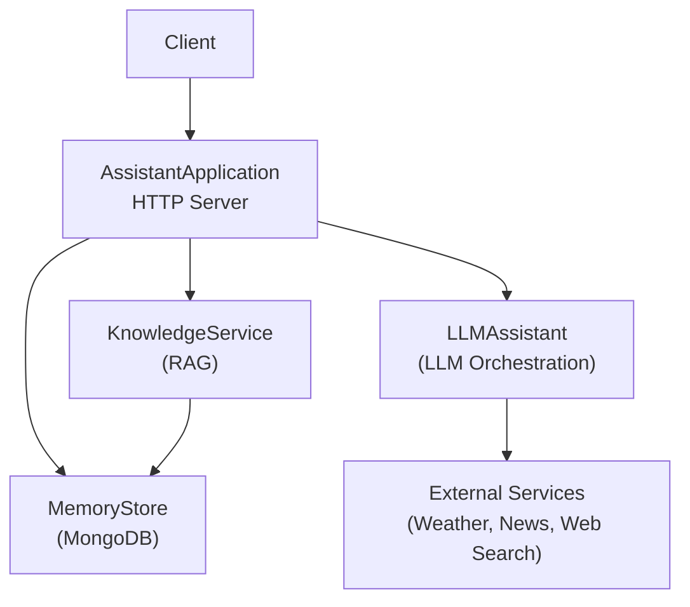

**Diagram sources**
- [server.py:64-83](file://backend/server.py#L64-L83)
- [memory_store.py:67-117](file://backend/core/memory_store.py#L67-L117)
- [knowledge.py:88-140](file://backend/tools/knowledge.py#L88-L140)
- [llm_client.py:38-46](file://backend/api_clients/llm_client.py#L38-L46)

**Section sources**
- [server.py:64-83](file://backend/server.py#L64-L83)
- [memory_store.py:67-117](file://backend/core/memory_store.py#L67-L117)
- [knowledge.py:88-140](file://backend/tools/knowledge.py#L88-L140)
- [llm_client.py:38-46](file://backend/api_clients/llm_client.py#L38-L46)

## Core Components
- AssistantApplication: Central server class that registers routes and delegates to handlers.
- MemoryStore: MongoDB-backed persistence for sessions, messages, tasks, notes, and attachments.
- KnowledgeService: Manages RAG capabilities for both persistent knowledge and session-scoped document indexing.
- LLMAssistant: Orchestrates LLM calls, builds system instructions, and executes tools.
- External services: Weather, news, and web search for tool integration.

**Section sources**
- [server.py:23-63](file://backend/server.py#L23-L63)
- [memory_store.py:67-117](file://backend/core/memory_store.py#L67-L117)
- [knowledge.py:88-140](file://backend/tools/knowledge.py#L88-L140)
- [llm_client.py:38-46](file://backend/api_clients/llm_client.py#L38-L46)

## Architecture Overview
The POST handlers are implemented in the AssistantApplication.handle_post method. They route to:
- Session creation and updates
- Message creation
- Attachment uploads
- Chat processing
- Profile updates
- Task management
- Notes creation
- Graceful fallback for unsupported endpoints

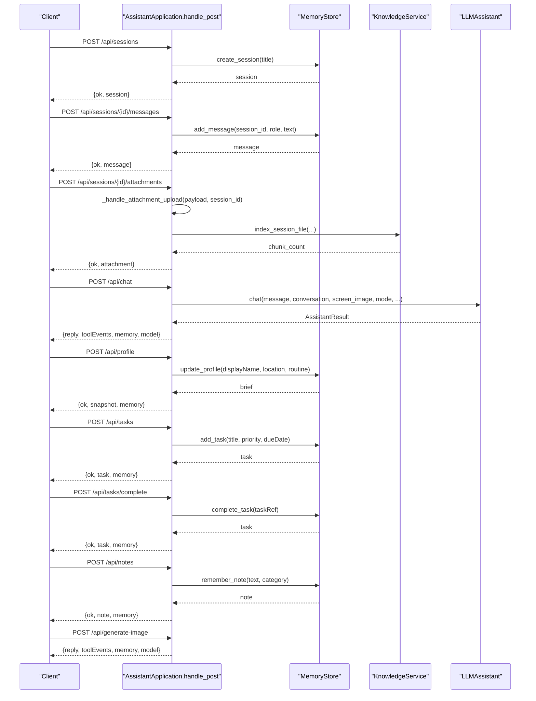

**Diagram sources**
- [server.py:169-265](file://backend/server.py#L169-L265)
- [memory_store.py:579-673](file://backend/core/memory_store.py#L579-L673)
- [memory_store.py:754-796](file://backend/core/memory_store.py#L754-L796)
- [llm_client.py:47-78](file://backend/api_clients/llm_client.py#L47-L78)
- [knowledge.py:303-335](file://backend/tools/knowledge.py#L303-L335)

## Detailed Component Analysis

### Session Creation Endpoint: POST /api/sessions
- Purpose: Create a new chat session with an optional title.
- Processing:
  - Reads JSON payload from request body.
  - Calls MemoryStore.create_session(title) to persist and return a session object.
- Validation:
  - Title is optional; defaults to a sensible placeholder if omitted.
- Response:
  - Returns {ok: true, session: {...}}.

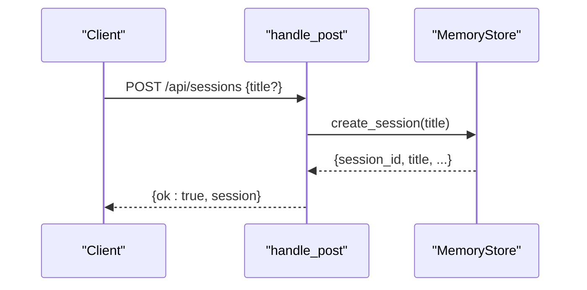

**Diagram sources**
- [server.py:182-186](file://backend/server.py#L182-L186)
- [memory_store.py:579-596](file://backend/core/memory_store.py#L579-L596)

**Section sources**
- [server.py:182-186](file://backend/server.py#L182-L186)
- [memory_store.py:579-596](file://backend/core/memory_store.py#L579-L596)

### Message Posting Endpoint: POST /api/sessions/{id}/messages
- Purpose: Add a message to a specific session.
- Processing:
  - Extracts session_id from path.
  - Reads JSON payload containing role and text.
  - Calls MemoryStore.add_message(session_id, role, text).
- Validation:
  - Enforces non-empty text; raises error if empty.
- Response:
  - Returns {ok: true, message: {...}}.

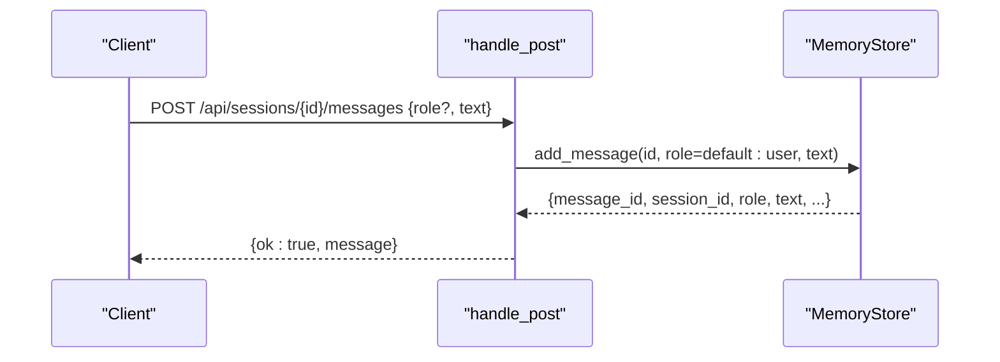

**Diagram sources**
- [server.py:188-202](file://backend/server.py#L188-L202)
- [memory_store.py:652-673](file://backend/core/memory_store.py#L652-L673)

**Section sources**
- [server.py:188-202](file://backend/server.py#L188-L202)
- [memory_store.py:652-673](file://backend/core/memory_store.py#L652-L673)

### Attachment Upload Handler: POST /api/sessions/{id}/attachments
- Purpose: Accept a base64-encoded file, validate type and size, save to disk, register in MongoDB, and index for session-scoped search.
- Processing:
  - Extracts session_id from path.
  - Validates presence of filename and data.
  - Checks file extension against allowed types: .pdf, .docx, .doc, .txt, .md, .csv, .json.
  - Decodes base64 data; rejects invalid encodings.
  - Enforces maximum size of 20 MB.
  - Saves file to upload directory under session_id_{filename}.
  - Registers attachment in MongoDB with metadata.
  - Parses and indexes file content for session search; captures chunk count or parse error.
- Response:
  - Returns {ok: true, attachment: {...}}.

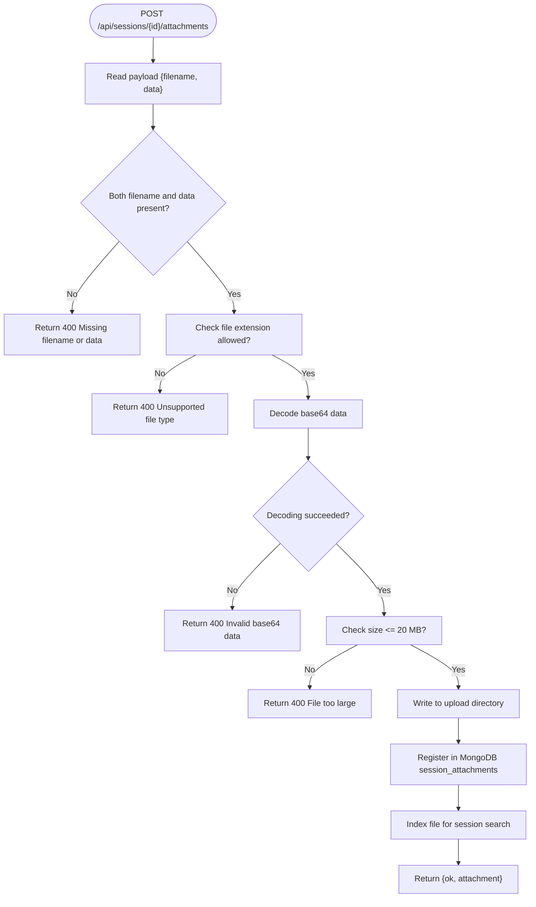

**Diagram sources**
- [server.py:204-209](file://backend/server.py#L204-L209)
- [server.py:329-393](file://backend/server.py#L329-L393)
- [knowledge.py:303-335](file://backend/tools/knowledge.py#L303-L335)
- [memory_store.py:754-779](file://backend/core/memory_store.py#L754-L779)

**Section sources**
- [server.py:204-209](file://backend/server.py#L204-L209)
- [server.py:329-393](file://backend/server.py#L329-L393)
- [knowledge.py:303-335](file://backend/tools/knowledge.py#L303-L335)
- [memory_store.py:754-779](file://backend/core/memory_store.py#L754-L779)

### Chat Endpoint: POST /api/chat
- Purpose: Process user messages with comprehensive parameter handling and tool orchestration.
- Parameter processing:
  - message: Required; stripped and validated for emptiness.
  - conversation: Optional; recent conversation snapshot.
  - screenImage: Optional; base64 image data for screen-aware assistance.
  - mode: Selection among simple, copilot, coach; defaults to simple.
  - coachTopic and coachLevel: Coaching parameters for expert mode.
  - preferredLanguage: Language preference hint.
  - webSearchOnly and offlineMode: Feature flags controlling tool availability.
  - sessionId: Optional session identifier for enabling session-doc search.
- Validation:
  - Rejects empty message.
  - Graceful fallback for unsupported image generation feature.
- Execution:
  - Builds system instruction tailored to mode, language, and flags.
  - Invokes LLMAssistant.chat(...) which orchestrates tools and external services.
  - Returns reply, tool events, memory snapshot, and model info.

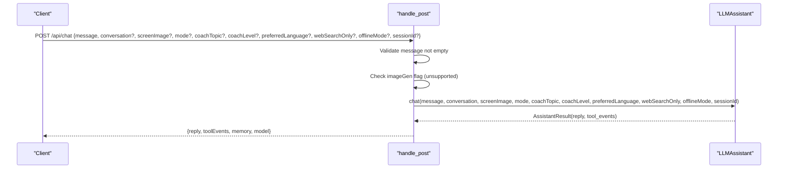

**Diagram sources**
- [server.py:211-213](file://backend/server.py#L211-L213)
- [server.py:276-320](file://backend/server.py#L276-L320)
- [llm_client.py:47-78](file://backend/api_clients/llm_client.py#L47-L78)
- [orbit_brain.py:302-356](file://backend/core/orbit_brain.py#L302-L356)

**Section sources**
- [server.py:211-213](file://backend/server.py#L211-L213)
- [server.py:276-320](file://backend/server.py#L276-L320)
- [llm_client.py:47-78](file://backend/api_clients/llm_client.py#L47-L78)
- [orbit_brain.py:302-356](file://backend/core/orbit_brain.py#L302-L356)

### Profile Update Endpoint: POST /api/profile
- Purpose: Update user profile fields (display name, location, routine).
- Processing:
  - Reads JSON payload with displayName, location, routine.
  - Calls MemoryStore.update_profile(...) which strips whitespace and updates the single profile document.
- Response:
  - Returns {ok: true, snapshot: {...}, memory: {...}}.

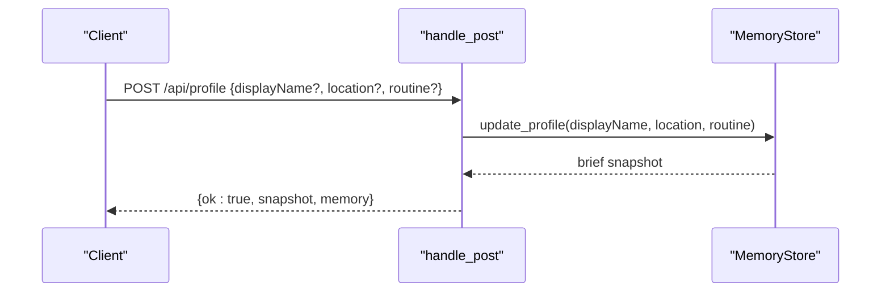

**Diagram sources**
- [server.py:214-221](file://backend/server.py#L214-L221)
- [memory_store.py:282-303](file://backend/core/memory_store.py#L282-L303)

**Section sources**
- [server.py:214-221](file://backend/server.py#L214-L221)
- [memory_store.py:282-303](file://backend/core/memory_store.py#L282-L303)

### Task Management Endpoints
- POST /api/tasks
  - Purpose: Create a new task.
  - Processing:
    - Reads title, priority, dueDate from payload.
    - Validates non-empty title; enforces priority normalization.
  - Response:
    - Returns {ok: true, task: {...}, memory: {...}}.

- POST /api/tasks/complete
  - Purpose: Mark a task as complete.
  - Processing:
    - Reads taskRef from payload; supports exact id or substring match on title.
    - Updates status and completion timestamp.
  - Response:
    - Returns {ok: true, task: {...}, memory: {...}}.

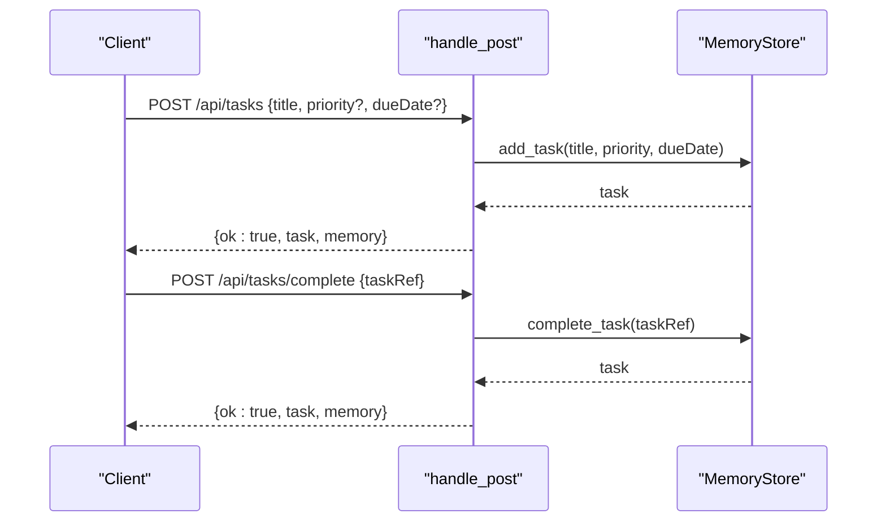

**Diagram sources**
- [server.py:222-241](file://backend/server.py#L222-L241)
- [memory_store.py:338-375](file://backend/core/memory_store.py#L338-L375)
- [memory_store.py:377-415](file://backend/core/memory_store.py#L377-L415)

**Section sources**
- [server.py:222-241](file://backend/server.py#L222-L241)
- [memory_store.py:338-375](file://backend/core/memory_store.py#L338-L375)
- [memory_store.py:377-415](file://backend/core/memory_store.py#L377-L415)

### Notes Endpoint: POST /api/notes
- Purpose: Save a note with optional category.
- Processing:
  - Reads text and category from payload; category defaults to "note".
  - Validates non-empty text; strips whitespace.
- Response:
  - Returns {ok: true, note: {...}, memory: {...}}.

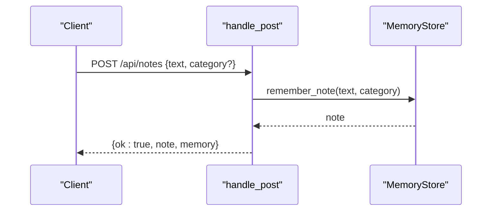

**Diagram sources**
- [server.py:243-253](file://backend/server.py#L243-L253)
- [memory_store.py:309-332](file://backend/core/memory_store.py#L309-L332)

**Section sources**
- [server.py:243-253](file://backend/server.py#L243-L253)
- [memory_store.py:309-332](file://backend/core/memory_store.py#L309-L332)

### Graceful Fallback Handling: Unsupported Features
- POST /api/generate-image
  - Behavior: Returns a standardized refusal message indicating the feature is not available, along with current memory and model info.
  - Intended to prevent clients from expecting unsupported capabilities.

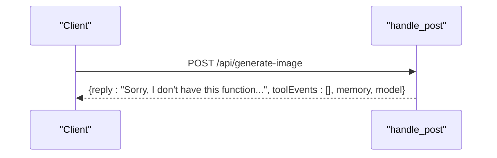

**Diagram sources**
- [server.py:255-263](file://backend/server.py#L255-L263)

**Section sources**
- [server.py:255-263](file://backend/server.py#L255-L263)

## Dependency Analysis
- Server depends on:
  - MemoryStore for persistence of sessions, messages, tasks, notes, and attachments.
  - KnowledgeService for RAG indexing and session-scoped document search.
  - LLMAssistant for orchestrating LLM calls and tool execution.
- External dependencies:
  - MongoDB for persistence.
  - Optional RAG stack (LangChain, FAISS, BM25, Unstructured) for document parsing and retrieval.
  - Web search providers (DDG, Tavily) for online search.

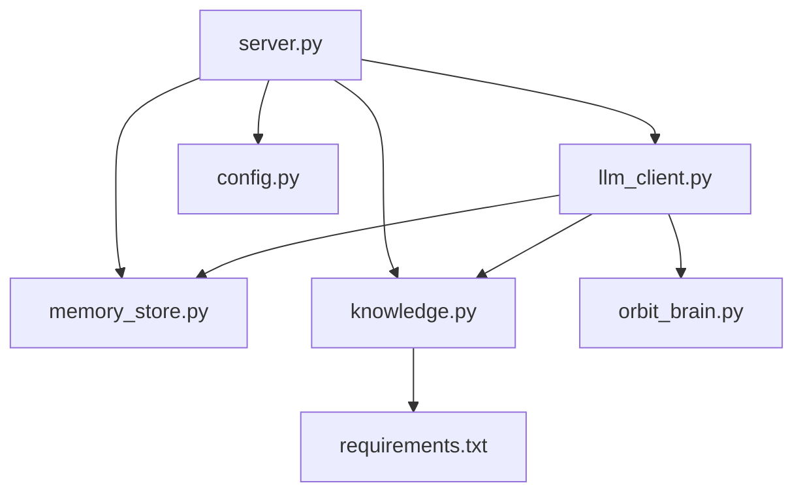

**Diagram sources**
- [server.py:14-21](file://backend/server.py#L14-L21)
- [memory_store.py:10-16](file://backend/core/memory_store.py#L10-L16)
- [knowledge.py:12-24](file://backend/tools/knowledge.py#L12-L24)
- [llm_client.py:11-21](file://backend/api_clients/llm_client.py#L11-L21)
- [orbit_brain.py:9-12](file://backend/core/orbit_brain.py#L9-L12)
- [config.py:20-36](file://backend/config.py#L20-L36)
- [requirements.txt:10-28](file://requirements.txt#L10-L28)

**Section sources**
- [server.py:14-21](file://backend/server.py#L14-L21)
- [memory_store.py:10-16](file://backend/core/memory_store.py#L10-L16)
- [knowledge.py:12-24](file://backend/tools/knowledge.py#L12-L24)
- [llm_client.py:11-21](file://backend/api_clients/llm_client.py#L11-L21)
- [orbit_brain.py:9-12](file://backend/core/orbit_brain.py#L9-L12)
- [config.py:20-36](file://backend/config.py#L20-L36)
- [requirements.txt:10-28](file://requirements.txt#L10-L28)

## Performance Considerations
- Attachment upload:
  - Base64 decoding and binary write occur synchronously; consider streaming or async I/O for large files.
  - Indexing session documents involves parsing and chunking; batch or rate-limit heavy indexing operations.
- Chat processing:
  - Tool invocation and external API calls introduce latency; consider timeouts and retries.
  - Conversation snapshots and memory briefs are computed on demand; cache where appropriate.
- MongoDB operations:
  - Ensure indexes exist for frequent queries (e.g., messages by session_id, attachments by session_id).
  - Batch insertions for history updates to reduce round-trips.

## Troubleshooting Guide
- Empty message in chat:
  - Symptom: 400 Bad Request with message cannot be empty.
  - Resolution: Ensure the message field is present and non-empty.
- Unsupported file type during attachment upload:
  - Symptom: 400 Bad Request with allowed file types list.
  - Resolution: Use one of the supported extensions: pdf, docx, doc, txt, md, csv, json.
- Invalid base64 data:
  - Symptom: 400 Bad Request.
  - Resolution: Verify the data is valid base64-encoded content.
- File too large:
  - Symptom: 400 Bad Request with maximum size exceeded.
  - Resolution: Keep files under 20 MB.
- Task reference not found:
  - Symptom: 400 Bad Request or 404 Not Found depending on exact match.
  - Resolution: Provide either the exact task id or a unique substring of the title.
- Web search or external service failures:
  - Symptom: Tool errors or service unavailability.
  - Resolution: Check API keys and network connectivity; fallback providers are used when configured.

**Section sources**
- [server.py:198-200](file://backend/server.py#L198-L200)
- [server.py:340-361](file://backend/server.py#L340-L361)
- [memory_store.py:311-312](file://backend/core/memory_store.py#L311-L312)
- [memory_store.py:379-396](file://backend/core/memory_store.py#L379-L396)
- [llm_client.py:34-35](file://backend/api_clients/llm_client.py#L34-L35)

## Conclusion
The POST request handlers provide robust endpoints for creating and updating data across sessions, messages, attachments, profiles, tasks, and notes. They integrate tightly with MongoDB for persistence, support RAG for document search, and orchestrate LLM tools with careful validation and graceful fallbacks for unsupported features. Proper configuration of environment variables and optional RAG dependencies ensures full functionality.